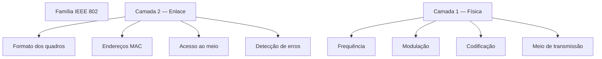

# Diferenças entre os padrões de redes da família IEEE 802

> [!info] Conceito
> A família **IEEE 802** reúne padrões técnicos usados em redes locais e metropolitanas. Cada padrão define regras próprias para o funcionamento da comunicação, principalmente nas camadas **Física** e **de Enlace** do modelo OSI.

Os padrões IEEE possuem protocolos e características técnicas diferentes. Essas diferenças existem porque cada tecnologia foi desenvolvida para atender a determinados meios de transmissão, distâncias, velocidades, níveis de mobilidade e condições de interferência.

---

## 1. O que é a família IEEE 802?

O **IEEE — Institute of Electrical and Electronics Engineers** é uma organização responsável pela criação de diversos padrões tecnológicos.

A família IEEE 802 abrange tecnologias utilizadas em redes de computadores, como:

| Padrão | Tecnologia principal |
|---|---|
| IEEE 802.3 | Ethernet |
| IEEE 802.11 | Redes locais sem fio — Wi-Fi |
| IEEE 802.15.4 | Redes pessoais sem fio de baixa potência |
| IEEE 802.16 | Redes metropolitanas sem fio — WiMAX |
| IEEE 802.1 | Pontes, VLANs e gerenciamento de redes |

Esses padrões tratam principalmente das duas primeiras camadas do modelo OSI:

```text
Camada 2 — Enlace
Camada 1 — Física
```

> [!note] Observação
> Nem todos os padrões IEEE 802 representam um tipo diferente de meio físico. Alguns, como o IEEE 802.1Q, definem funções de controle e organização da rede, como as VLANs.

---

## 2. Protocolos próprios de cada padrão

Cada padrão estabelece procedimentos específicos para que os dispositivos possam transmitir, receber e interpretar os dados.

Esses procedimentos podem definir:

- a estrutura do quadro;
- o método de acesso ao meio;
- a forma de identificar os dispositivos;
- o tratamento de erros;
- a velocidade de transmissão;
- o tipo de cabo ou canal sem fio;
- as formas de autenticação e associação;
- o modo de compartilhamento do meio.

> [!info] Conceito
> Um protocolo é um conjunto de regras que determina como os dispositivos devem se comunicar.

Por exemplo, o Ethernet e o Wi-Fi realizam a transmissão de quadros, mas utilizam métodos diferentes para controlar o acesso ao meio.

### Ethernet

No Ethernet tradicional, o método historicamente associado ao acesso ao meio é o:

```text
CSMA/CD
```

A sigla significa:

```text
Carrier Sense Multiple Access with Collision Detection
```

Esse mecanismo foi utilizado principalmente em redes Ethernet compartilhadas e em modo half-duplex.

Nas redes Ethernet modernas, com switches e comunicação full-duplex, as colisões praticamente deixam de ocorrer.

### Wi-Fi

Nas redes Wi-Fi é empregado o:

```text
CSMA/CA
```

A sigla significa:

```text
Carrier Sense Multiple Access with Collision Avoidance
```

Como um dispositivo sem fio não consegue detectar colisões da mesma maneira que uma rede cabeada, o Wi-Fi procura evitar que elas aconteçam.

> [!tip] Comparação
> - Ethernet compartilhada: detecta colisões.
> - Wi-Fi: procura evitar colisões.
> - Ethernet moderna com switches: normalmente funciona sem colisões.

---

## 3. Diferenças relacionadas ao meio físico

Os padrões IEEE podem utilizar diferentes meios de transmissão.

### Redes cabeadas

O IEEE 802.3, relacionado ao Ethernet, pode utilizar:

- cabo de par trançado;
- cabo coaxial, em tecnologias antigas;
- fibra óptica.

Nesse caso, a informação é transmitida por sinais elétricos ou ópticos.

### Redes sem fio

Padrões como IEEE 802.11 e IEEE 802.15.4 utilizam ondas eletromagnéticas para transportar os dados.

Essas redes dependem de características como:

- faixa de frequência;
- largura do canal;
- potência de transmissão;
- tipo de antena;
- interferência;
- distância;
- obstáculos físicos;
- técnica de modulação.

> [!important] Ponto central
> A frequência e a modulação são especialmente importantes nos padrões de redes **sem fio**.
>
> Em padrões cabeados, as principais diferenças estão relacionadas ao tipo de cabo, sinalização, codificação e velocidade de transmissão.

---

## 4. Frequência de operação

A frequência indica a faixa do espectro eletromagnético utilizada para transmitir os sinais.

Nas redes sem fio, diferentes padrões e versões podem operar em faixas distintas.

Exemplos comuns:

| Tecnologia | Faixas de frequência |
|---|---|
| Wi-Fi IEEE 802.11 | 2,4 GHz, 5 GHz e 6 GHz |
| IEEE 802.15.4 | 868 MHz, 915 MHz e 2,4 GHz |
| WiMAX IEEE 802.16 | Diferentes faixas licenciadas e não licenciadas |

A frequência influencia aspectos como:

- alcance do sinal;
- capacidade de atravessar obstáculos;
- disponibilidade de canais;
- interferência;
- velocidade de transmissão;
- largura de banda.

### Frequências mais baixas

Em geral, frequências mais baixas apresentam:

- maior alcance;
- maior capacidade de atravessar obstáculos;
- menor quantidade de canais;
- menor largura de banda disponível.

### Frequências mais altas

Em geral, frequências mais altas podem oferecer:

- maior largura de banda;
- mais canais disponíveis;
- maiores velocidades;
- menor alcance;
- maior dificuldade para atravessar paredes e obstáculos.

> [!warning] Atenção
> Uma frequência mais alta não garante, isoladamente, maior velocidade.
>
> O desempenho também depende da largura do canal, da modulação, da quantidade de antenas, da interferência e da qualidade do sinal.

---

## 5. Modulação

A **modulação** é o processo utilizado para representar dados digitais por meio de alterações em uma onda ou sinal.

Os bits podem ser representados por mudanças em características como:

- amplitude;
- frequência;
- fase.

De forma simplificada, a modulação transforma uma sequência de bits em sinais capazes de atravessar o meio físico.

```text
Bits digitais
     ↓
Processo de modulação
     ↓
Sinal elétrico, óptico ou eletromagnético
     ↓
Meio de transmissão
```

> [!info] Conceito
> Quanto mais informações forem representadas em cada símbolo transmitido, maior poderá ser a taxa de dados. Entretanto, técnicas de modulação mais complexas exigem um sinal de melhor qualidade.

---

## 6. Exemplos de técnicas de modulação

### BPSK

A **BPSK — Binary Phase Shift Keying** representa os dados por meio de duas variações de fase.

Em geral, é uma técnica:

- mais resistente a interferências;
- adequada para sinais mais fracos;
- menos eficiente em termos de velocidade.

### QPSK

A **QPSK — Quadrature Phase Shift Keying** utiliza quatro estados de fase.

Cada símbolo pode representar dois bits.

```text
00
01
10
11
```

Ela permite transmitir mais informações do que a BPSK no mesmo intervalo.

### QAM

A **QAM — Quadrature Amplitude Modulation** combina variações de amplitude e fase.

Exemplos:

- 16-QAM;
- 64-QAM;
- 256-QAM;
- 1024-QAM;
- 4096-QAM.

Quanto maior a ordem da modulação, maior é a quantidade de bits representados em cada símbolo.

| Modulação | Bits por símbolo |
|---|---:|
| BPSK | 1 |
| QPSK | 2 |
| 16-QAM | 4 |
| 64-QAM | 6 |
| 256-QAM | 8 |
| 1024-QAM | 10 |

> [!warning] Atenção
> Modulações de ordem mais alta permitem maiores taxas de transmissão, mas são mais sensíveis a ruído, interferência e perda de sinal.

---

## 7. OFDM e OFDMA

O **OFDM — Orthogonal Frequency Division Multiplexing** divide o canal em diversas subportadoras.

Em vez de transmitir todos os dados em uma única frequência, os dados são distribuídos por várias subportadoras ortogonais.

Essa técnica ajuda a reduzir problemas relacionados a:

- interferência;
- reflexões do sinal;
- propagação por múltiplos caminhos;
- perda de desempenho.

O **OFDMA — Orthogonal Frequency Division Multiple Access** é uma evolução que permite distribuir grupos de subportadoras entre diferentes usuários.

> [!tip] Resumindo
> - OFDM divide o canal em várias subportadoras.
> - OFDMA permite que diferentes usuários utilizem partes dessas subportadoras simultaneamente.

Essas técnicas são utilizadas em padrões modernos de Wi-Fi.

---

## 8. Exemplo: IEEE 802.3 — Ethernet

O IEEE 802.3 define as tecnologias Ethernet.

Suas especificações podem determinar:

- formato do quadro Ethernet;
- velocidades de transmissão;
- tipos de cabos;
- distâncias máximas;
- codificação do sinal;
- conectores;
- operação full-duplex ou half-duplex.

Exemplos de tecnologias Ethernet:

| Tecnologia | Velocidade | Meio |
|---|---:|---|
| 10BASE-T | 10 Mb/s | Par trançado |
| 100BASE-TX | 100 Mb/s | Par trançado |
| 1000BASE-T | 1 Gb/s | Par trançado |
| 10GBASE-SR | 10 Gb/s | Fibra óptica |
| 100GBASE-LR4 | 100 Gb/s | Fibra óptica |

> [!note] Importante
> No Ethernet cabeado não se costuma destacar uma frequência de rádio, pois a transmissão ocorre por sinais elétricos ou ópticos.
>
> Nesse padrão, conceitos como **codificação de linha**, sinalização e tipo de meio são mais adequados do que frequência de radiofrequência e modulação sem fio.

---

## 9. Exemplo: IEEE 802.11 — Wi-Fi

O IEEE 802.11 define as redes locais sem fio.

Suas diferentes versões apresentam características próprias relacionadas a:

- frequência;
- largura do canal;
- modulação;
- número de antenas;
- taxa de transmissão;
- eficiência espectral;
- quantidade de dispositivos atendidos.

Exemplos:

| Padrão | Frequência principal | Técnica utilizada |
|---|---|---|
| IEEE 802.11b | 2,4 GHz | DSSS |
| IEEE 802.11a | 5 GHz | OFDM |
| IEEE 802.11g | 2,4 GHz | OFDM |
| IEEE 802.11n | 2,4 e 5 GHz | OFDM e MIMO |
| IEEE 802.11ac | 5 GHz | OFDM, MIMO e QAM |
| IEEE 802.11ax | 2,4, 5 e 6 GHz | OFDMA e MIMO |

> [!info] MIMO
> **MIMO — Multiple Input, Multiple Output** utiliza várias antenas para transmitir e receber diferentes fluxos de dados.
>
> Isso pode aumentar a velocidade, a capacidade e a confiabilidade da rede.

---

## 10. Exemplo: IEEE 802.15.4

O IEEE 802.15.4 é voltado a redes pessoais sem fio de baixa potência e baixa taxa de transmissão.

Ele é utilizado como base para tecnologias de automação e Internet das Coisas.

Suas características incluem:

- baixo consumo de energia;
- pequeno alcance;
- baixo custo;
- taxas de transmissão menores;
- operação em diferentes frequências;
- suporte a dispositivos alimentados por bateria.

Dependendo da região e da implementação, pode operar em:

```text
868 MHz
915 MHz
2,4 GHz
```

Entre as técnicas de modulação utilizadas estão:

```text
BPSK
O-QPSK
```

> [!tip] Aplicação
> Esse padrão é adequado para sensores, dispositivos de automação residencial e equipamentos que precisam funcionar por longos períodos com baixo consumo energético.

---

## 11. Camada Física e Camada de Enlace

As principais diferenças entre os padrões IEEE aparecem nas camadas Física e de Enlace.

### Camada Física

A Camada Física pode definir:

- frequência;
- modulação;
- codificação;
- tipo de cabo;
- potência do sinal;
- conectores;
- largura do canal;
- taxa de transmissão.

### Camada de Enlace

A Camada de Enlace pode definir:

- formato do quadro;
- endereçamento MAC;
- acesso ao meio;
- detecção de erros;
- retransmissão;
- controle de acesso;
- associação de dispositivos.



---

## 12. Por que existem tantos padrões?

Um único padrão não consegue atender igualmente bem a todas as necessidades.

Cada tipo de rede pode exigir características diferentes.

| Necessidade | Tecnologia mais adequada |
|---|---|
| Alta velocidade em rede local cabeada | Ethernet |
| Mobilidade de notebooks e celulares | Wi-Fi |
| Sensores de baixo consumo | IEEE 802.15.4 |
| Comunicação metropolitana sem fio | WiMAX |
| Separação lógica de redes | IEEE 802.1Q |

Por exemplo, uma rede de sensores prioriza economia de energia, enquanto uma rede corporativa cabeada pode priorizar velocidade, estabilidade e baixa latência.

> [!important] Ponto central
> As diferenças entre os padrões existem porque cada tecnologia busca equilibrar fatores como velocidade, alcance, consumo de energia, custo, mobilidade e resistência a interferências.

---

## 13. Correção conceitual da afirmação


> [!warning] Atenção
> Nem todos os padrões da família IEEE 802 são diferenciados principalmente por frequência e modulação.
>
> Essas características são especialmente importantes nos padrões sem fio. Em redes cabeadas, as diferenças costumam envolver o meio físico, a codificação do sinal, o formato dos quadros, a velocidade e o método de acesso ao meio.

Uma formulação mais precisa seria:

> Os diversos padrões da família IEEE 802 apresentam protocolos e especificações próprias nas camadas Física e de Enlace. Nos padrões sem fio, essas diferenças incluem principalmente as faixas de frequência e as técnicas de modulação. Nos padrões cabeados, incluem o tipo de meio, a codificação, a sinalização e a velocidade de transmissão.

---

## 14. Exemplo comparativo

Considere três redes diferentes:

| Característica | Ethernet | Wi-Fi | IEEE 802.15.4 |
|---|---|---|---|
| Padrão | IEEE 802.3 | IEEE 802.11 | IEEE 802.15.4 |
| Meio | Cabo ou fibra | Ondas de rádio | Ondas de rádio |
| Mobilidade | Baixa | Alta | Alta |
| Velocidade | Geralmente alta | Alta | Geralmente baixa |
| Consumo de energia | Menos crítico | Moderado | Muito baixo |
| Frequência de rádio | Não se aplica diretamente | 2,4, 5 e 6 GHz | 868 MHz, 915 MHz e 2,4 GHz |
| Modulação | Sinalização e codificação de linha | OFDM, OFDMA e QAM | BPSK ou O-QPSK |
| Aplicação | Redes locais cabeadas | Acesso sem fio | Sensores e IoT |

---

## 15. Relação entre modulação, velocidade e qualidade do sinal

A rede pode ajustar a modulação de acordo com a qualidade do sinal.

Quando o sinal é forte e possui pouco ruído, pode ser utilizada uma modulação de ordem mais alta.

```text
Sinal forte
     ↓
Modulação mais complexa
     ↓
Mais bits por símbolo
     ↓
Maior taxa de transmissão
```

Quando o sinal é fraco ou apresenta muita interferência, a rede pode adotar uma modulação mais simples.

```text
Sinal fraco
     ↓
Modulação mais robusta
     ↓
Menos bits por símbolo
     ↓
Menor velocidade, mas maior confiabilidade
```

> [!tip] Resumindo
> A rede busca um equilíbrio entre velocidade e confiabilidade.
>
> Quanto melhor o sinal, maior pode ser a quantidade de dados transmitida em cada símbolo.

---

## 16. Pegadinhas comuns

### Afirmar que todo padrão IEEE é uma tecnologia sem fio

Incorreto. O Ethernet, definido pelo IEEE 802.3, é predominantemente cabeado.

### Afirmar que a frequência é a única diferença entre os padrões

Incorreto. Também existem diferenças no formato dos quadros, acesso ao meio, codificação, velocidade, consumo de energia e alcance.

### Confundir modulação com protocolo

A modulação é uma técnica da Camada Física. Um protocolo é um conjunto mais amplo de regras de comunicação.

### Afirmar que modulação mais complexa sempre melhora a comunicação

Uma modulação mais complexa pode aumentar a velocidade, mas exige melhor qualidade de sinal.

### Considerar todos os padrões IEEE 802 incompatíveis

Alguns padrões podem trabalhar em conjunto. Uma rede, por exemplo, pode utilizar Ethernet, Wi-Fi e VLANs simultaneamente.

---

## 17. Questão de fixação

> [!question] Exercício
> Por que diferentes padrões da família IEEE 802 utilizam diferentes técnicas de modulação, frequências e métodos de acesso ao meio?

> [!success]- Gabarito
> Porque cada padrão foi desenvolvido para atender a necessidades específicas de comunicação. Algumas redes priorizam alta velocidade, outras priorizam mobilidade, alcance, baixo consumo de energia ou resistência a interferências.
>
> As técnicas de modulação, as frequências e os métodos de acesso ao meio são escolhidos de acordo com o ambiente, o meio de transmissão e os objetivos de cada tecnologia.

---

## 18. Resumo

> [!tip] Resumindo
> - A família IEEE 802 reúne diversos padrões de redes.
> - Cada padrão possui regras e especificações próprias.
> - As diferenças aparecem principalmente nas camadas Física e de Enlace.
> - Em redes sem fio, destacam-se a frequência e a modulação.
> - Em redes cabeadas, destacam-se o meio, a codificação e a sinalização.
> - Técnicas de modulação mais complexas podem transmitir mais dados.
> - Quanto maior a complexidade da modulação, melhor deve ser a qualidade do sinal.
> - Cada padrão busca atender a necessidades específicas de velocidade, alcance, mobilidade e consumo de energia.

---

## 19. Conclusão

Os padrões da família IEEE 802 não são definidos apenas por nomes ou velocidades diferentes. Cada um estabelece um conjunto de regras compatíveis com determinado meio de transmissão e tipo de aplicação.

Nas redes sem fio, a frequência e a modulação são fundamentais porque determinam como os sinais são enviados pelo espaço. Nas redes cabeadas, o foco recai sobre o tipo de cabo, a sinalização, a codificação e a capacidade do enlace.

Portanto, as diferenças entre os padrões IEEE refletem as diferentes necessidades existentes nas redes de computadores, como alcance, velocidade, confiabilidade, mobilidade e consumo energético.