# Resumo — Redes de Computadores, Modelos em Camadas e Camada de Transporte

## 1. Rede, Internet e Web

> [!info] Conceito
> Rede, Internet e Web são conceitos relacionados, mas não significam a mesma coisa.

Uma **rede de computadores** é um conjunto de dispositivos interconectados capazes de trocar informações. Esses dispositivos podem compartilhar recursos, como arquivos, impressoras, servidores, sistemas, banco de dados e acesso à Internet.

A **Internet** é uma rede global formada pela interligação de muitas redes menores. Ela funciona como uma “rede de redes”, conectando redes domésticas, empresariais, acadêmicas, governamentais e de provedores.

A **Web** é um serviço que funciona sobre a Internet. Ela usa protocolos como o HTTP para permitir o acesso a páginas, documentos, imagens, vídeos e aplicações Web por meio de navegadores.

| Conceito | Explicação simples |
|---|---|
| **Rede de computadores** | Dispositivos conectados para trocar dados. |
| **Internet** | Rede mundial formada por várias redes interligadas. |
| **Web** | Serviço usado para acessar páginas e aplicações pela Internet. |

> [!warning] Atenção
> Internet e Web não são sinônimos. A Web é apenas um dos serviços que funcionam sobre a Internet.

---

## 2. Finalidades das redes de computadores

> [!info] Conceito
> As redes existem para permitir comunicação, compartilhamento e acesso a recursos, mesmo a distância.

As redes permitem que usuários e sistemas compartilhem informações, programas, equipamentos e serviços. Em empresas, isso facilita o acesso a bancos de dados, servidores, sistemas corporativos, arquivos e impressoras. Em residências, permite acesso à Internet, streaming, jogos on-line, redes sociais e dispositivos inteligentes.

Também há redes voltadas à mobilidade, como Wi-Fi e redes celulares, que permitem acesso a dados por notebooks, smartphones, sensores e equipamentos móveis.

| Uso | Exemplo |
|---|---|
| **Compartilhamento de recursos** | Impressoras, arquivos, servidores e sistemas. |
| **Comunicação** | E-mail, mensagens, chamadas de voz e vídeo. |
| **Acesso remoto** | VPN, sistemas Web e bancos de dados remotos. |
| **Entretenimento** | Streaming, jogos on-line e redes sociais. |
| **Mobilidade** | Smartphones, Wi-Fi, GPS e redes celulares. |
| **Automação** | Sensores, RFID e dispositivos inteligentes. |

> [!note]- Nota complementar
> O uso de redes reduz a dependência da localização física. Um usuário pode acessar dados armazenados em outro prédio, cidade ou país como se estivessem disponíveis localmente, desde que exista conectividade e autorização adequada.

> [!tip] Resumindo
> Redes aproximam pessoas, sistemas e recursos, independentemente da distância física.

---

## 3. Rede de computadores e sistema distribuído

> [!info] Conceito
> Uma rede conecta máquinas; um sistema distribuído faz várias máquinas parecerem um sistema único.

Em uma **rede de computadores**, o usuário pode perceber que existem diferentes máquinas, servidores, sistemas operacionais e serviços. Já em um **sistema distribuído**, uma camada de software organiza vários computadores para que pareçam um único sistema coerente.

A diferença principal não está no hardware, mas no software. Um sistema distribuído usa a rede como base, mas adiciona uma camada de organização que esconde parte da complexidade dos computadores envolvidos.

| Conceito | Característica |
|---|---|
| **Rede de computadores** | Usuário percebe dispositivos e serviços distintos. |
| **Sistema distribuído** | Usuário enxerga um sistema único e integrado. |

> [!warning] Atenção
> Todo sistema distribuído depende de uma rede, mas nem toda rede forma um sistema distribuído.

---

## 4. Modelos de comunicação: cliente-servidor e peer-to-peer

> [!info] Conceito
> Aplicações em rede podem se organizar em modelos diferentes de comunicação.

No modelo **cliente-servidor**, um cliente solicita um serviço e um servidor responde. Esse modelo é comum na Web: o navegador solicita uma página, e o servidor Web envia a resposta.

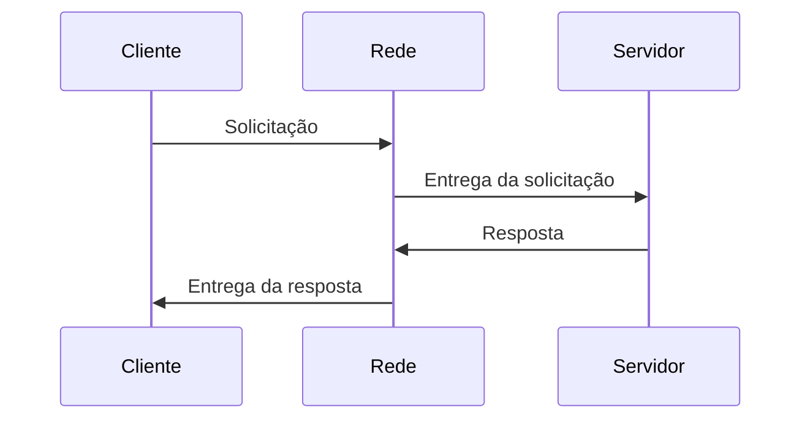

No modelo **peer-to-peer**, os participantes podem atuar tanto como clientes quanto como servidores. Não há uma divisão rígida entre quem solicita e quem fornece dados.

| Modelo | Característica |
|---|---|
| **Cliente-servidor** | Um processo solicita, outro responde. |
| **Peer-to-peer** | Os participantes podem solicitar e fornecer dados. |

> [!note]- Nota complementar
> Cliente e servidor não precisam ser máquinas diferentes. Eles podem ser processos em execução. Um mesmo computador pode executar aplicações clientes e servidoras ao mesmo tempo.

---

## 5. Classificação das redes por escala

> [!info] Conceito
> As redes podem ser classificadas conforme o alcance físico que cobrem.

As redes podem variar de poucos metros até alcance global. A escala influencia os meios de transmissão, os equipamentos usados, o desempenho, os atrasos, a administração e os mecanismos de segurança.

| Tipo de rede | Alcance típico | Exemplo |
|---|---|---|
| **PAN** | Área pessoal | Bluetooth entre computador, mouse, teclado ou fone. |
| **LAN** | Local | Rede de casa, escritório, escola ou empresa. |
| **MAN** | Metropolitana | Rede que cobre uma cidade. |
| **WAN** | Longa distância | Rede entre filiais em cidades ou países diferentes. |
| **Internet** | Global | Interligação mundial de redes. |

> [!tip] Resumindo
> Quanto maior a rede, maior tende a ser a complexidade de roteamento, segurança, desempenho e administração.

> [!tip]- Aprofundando sobre padrões (IEEE)
> ![[Padroes-IEEE]]

[[Padroes-IEEE|Abrir em nova pagina]]

---

## 6. Tecnologias de transmissão: broadcast e ponto a ponto

> [!info] Conceito
> A transmissão pode ocorrer por meio compartilhado ou por enlaces diretos entre pares.

Em redes de **broadcast**, existe um canal compartilhado. Um pacote transmitido pode ser recebido por vários dispositivos, mas apenas o destinatário correto deve processá-lo.

Em redes **ponto a ponto**, os enlaces conectam pares de máquinas. Para alcançar o destino, os pacotes podem passar por dispositivos intermediários, como roteadores.

| Tecnologia | Explicação |
|---|---|
| **Broadcast** | Um meio compartilhado por vários dispositivos. |
| **Ponto a ponto** | Enlaces diretos entre pares de dispositivos. |

> [!warning] Atenção
> Quando existem vários caminhos possíveis, a rede precisa decidir por onde os pacotes devem seguir. Essa decisão é feita pelo roteamento.

---

## 7. Componentes de uma rede local

> [!info] Conceito
> Uma LAN combina dispositivos finais, meios de transmissão e equipamentos intermediários.

Uma **LAN** é uma rede local usada para conectar dispositivos em uma área limitada, como uma casa, escritório ou prédio. Nela, os **hosts** enviam e recebem dados. A **placa de rede** permite a conexão do dispositivo à rede.

Equipamentos como **switches**, **roteadores**, **gateways** e **firewalls** ajudam a organizar o tráfego, interligar redes e controlar o acesso.

| Componente        | Função                                       |
| ----------------- | -------------------------------------------- |
| **Host**          | Dispositivo final que envia ou recebe dados. |
| **Servidor**      | Disponibiliza recursos ou serviços.          |
| **Cliente**       | Solicita recursos ou serviços.               |
| **Placa de rede** | Interface de comunicação com a rede.         |
| **Hub**           | Repassa dados para todas as portas.          |
| **Switch**        | Encaminha dados para a porta correta.        |
| **Roteador**      | Encaminha pacotes entre redes.               |
| **Gateway**       | Interliga redes ou sistemas diferentes.      |
| **Firewall**      | Filtra o tráfego e ajuda na segurança.       |

> [!tip] Resumindo
> Hosts produzem e consomem dados; switches organizam a rede local; roteadores interligam redes.

---

## 8. Topologias de rede

> [!info] Conceito
> Topologia é a forma como os dispositivos estão organizados e conectados.

A topologia influencia desempenho, manutenção e tolerância a falhas. Em **barramento**, todos compartilham o mesmo meio físico. Em **estrela**, os dispositivos se conectam a um concentrador central. Em **anel**, os dispositivos formam um circuito fechado.

| Topologia | Característica |
|---|---|
| **Barramento** | Todos usam um mesmo meio físico. |
| **Estrela** | Todos se conectam a um ponto central. |
| **Anel** | Os dispositivos formam um circuito fechado. |

> [!warning] Atenção
> A topologia física mostra como os dispositivos estão conectados. A topologia lógica mostra como os dados circulam.

---

## 9. Arquitetura em camadas

> [!info] Conceito
> A arquitetura em camadas divide a comunicação em partes menores e mais fáceis de gerenciar.

As redes são organizadas em camadas para reduzir a complexidade. Cada camada oferece serviços à camada superior e usa os serviços da camada inferior. Assim, os detalhes internos de uma camada ficam escondidos das demais.

Essa separação permite trocar ou modificar uma camada sem alterar todo o sistema, desde que a interface e o serviço oferecido continuem compatíveis.

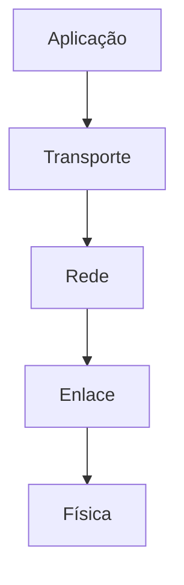

> [!note]- Nota complementar
> A ideia de camadas se relaciona com conceitos como encapsulamento, abstração e ocultação de informações. A camada superior não precisa conhecer todos os detalhes de implementação da camada inferior; ela apenas usa o serviço fornecido.

> [!tip] Resumindo
> Camadas tornam a rede modular, organizada e mais fácil de estudar, implementar e manter.

---

## 10. Serviço, interface e protocolo

> [!info] Conceito
> Serviço, interface e protocolo são conceitos diferentes e fundamentais para entender redes em camadas.

Um **serviço** descreve o que uma camada oferece à camada acima. Uma **interface** define como esse serviço é acessado. Um **protocolo** define como entidades da mesma camada, em máquinas diferentes, comunicam-se entre si.

| Conceito | Pergunta que responde | Exemplo simples |
|---|---|---|
| **Serviço** | O que a camada oferece? | A camada de transporte oferece comunicação entre processos. |
| **Interface** | Como acessar o serviço? | Uma aplicação usa sockets para acessar a camada de transporte. |
| **Protocolo** | Como os pares se comunicam? | TCP e UDP definem regras entre entidades de transporte. |

> [!warning] Atenção
> O serviço é visível para a camada superior. O protocolo é a forma usada internamente para implementar esse serviço entre entidades equivalentes.

> [!tip] Resumindo
> Serviço é “o que faz”; interface é “como usar”; protocolo é “como conversa”.

---

## 11. Protocolos de rede

> [!info] Conceito
> Protocolo é um conjunto de regras que permite a comunicação entre dispositivos ou processos.

Para que dois computadores se comuniquem, eles precisam usar regras compatíveis. Essas regras definem formato das mensagens, endereçamento, controle de erros, confirmação, retransmissão, fragmentação, portas e outros aspectos.

| Protocolo | Função principal |
|---|---|
| **HTTP** | Acesso a páginas e recursos da Web. |
| **SMTP** | Envio de e-mails. |
| **FTP** | Transferência de arquivos. |
| **DNS** | Tradução de nomes para endereços IP. |
| **TCP** | Transporte confiável e orientado à conexão. |
| **UDP** | Transporte simples e sem conexão. |
| **IP** | Endereçamento e roteamento de pacotes. |
| **ICMP** | Mensagens de controle da Internet. |
| **ARP** | Associação entre endereço IP e endereço MAC. |
| **SNMP** | Gerenciamento de redes. |

> [!tip] Resumindo
> Protocolos funcionam como uma linguagem comum para que sistemas diferentes consigam trocar dados.

---

## 12. MAC, IP, porta e socket

> [!info] Conceito
> MAC, IP, porta e socket identificam elementos diferentes na comunicação em rede.

Esses quatro conceitos são frequentemente confundidos, mas atuam em níveis diferentes. O **MAC** identifica uma interface de rede em uma rede local. O **IP** identifica um host ou interface em uma rede lógica. A **porta** identifica a aplicação ou processo dentro do host. O **socket** representa o ponto final de comunicação usado por um processo.

| Elemento | Identifica o quê? | Camada associada |
|---|---|---|
| **Endereço MAC** | Interface física ou placa de rede em uma rede local. | Enlace |
| **Endereço IP** | Host ou interface em uma rede lógica. | Rede |
| **Porta** | Aplicação ou processo dentro do host. | Transporte |
| **Socket** | Ponto final de comunicação entre processos. | Transporte / Aplicação |

> [!example] Exemplo
> Ao acessar um site, o IP ajuda a localizar o servidor, a porta indica o serviço acessado, e o socket representa a comunicação entre o processo do navegador e o processo do servidor.

> [!warning] Atenção
> IP identifica o host na rede. Porta identifica o processo dentro do host. MAC é usado na comunicação local.

> [!tip]- Aprofundando nas camadas 2 e 3
> ![[Camadas-2-3]]

[[Camadas-2-3|Abrir em nova pagina]]

---

## 13. Encapsulamento dos dados

> [!info] Conceito
> Encapsulamento é o processo de adicionar informações de controle aos dados enquanto eles descem pelas camadas.

Quando uma aplicação envia dados, eles descem pela pilha de camadas. Em cada camada, recebem informações adicionais, como cabeçalhos e, em alguns casos, rodapés. Essas informações permitem endereçar, controlar, verificar e entregar corretamente os dados.

No destino, ocorre o processo inverso: cada camada interpreta e remove as informações adicionadas pela camada correspondente no remetente.

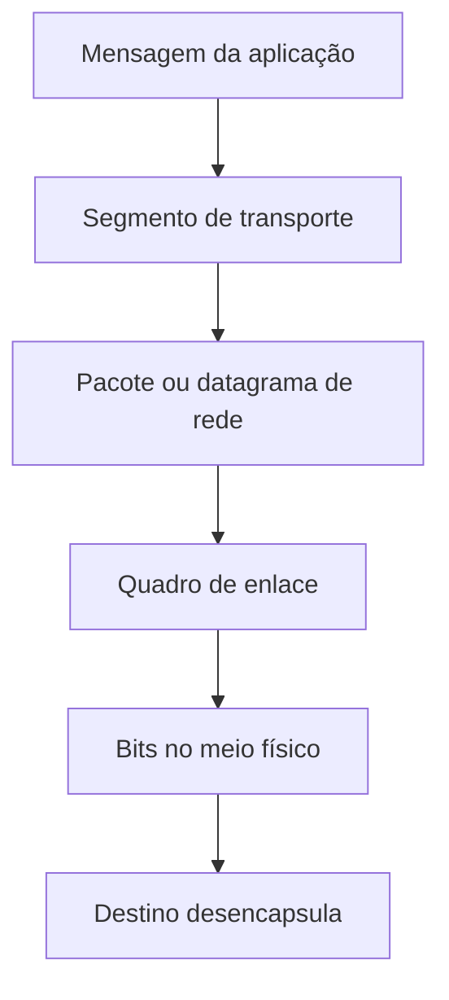

| Camada | Unidade típica |
|---|---|
| **Aplicação** | Mensagem |
| **Transporte** | Segmento |
| **Rede** | Pacote ou datagrama |
| **Enlace** | Quadro |
| **Física** | Bits |

> [!tip] Resumindo
> Encapsular é empacotar os dados com informações necessárias para que atravessem a rede corretamente.

---

## 14. Serviços orientados e não orientados à conexão

> [!info] Conceito
> Um serviço pode estabelecer uma conexão antes de transmitir ou enviar mensagens independentes.

Um serviço **orientado à conexão** funciona de forma semelhante a uma ligação telefônica: primeiro a conexão é estabelecida, depois os dados são transmitidos e, ao final, a conexão é encerrada.

Um serviço **não orientado à conexão** funciona de forma semelhante ao envio de cartas: cada mensagem carrega informações de destino e pode ser tratada de forma independente.

| Tipo | Analogia | Característica |
|---|---|---|
| **Orientado à conexão** | Telefonema | Estabelece, usa e encerra uma conexão. |
| **Não orientado à conexão** | Carta | Envia mensagens independentes. |

> [!warning] Atenção
> Serviço sem conexão não significa necessariamente serviço inútil ou ruim. Ele pode ser mais simples, rápido e adequado a certas aplicações.

---

## 15. Modelo OSI/ISO

> [!info] Conceito
> O modelo OSI organiza a comunicação em sete camadas.

O modelo **OSI/ISO** é uma referência conceitual usada para entender a comunicação em redes. Ele divide o processo em sete camadas, cada uma com uma função específica.

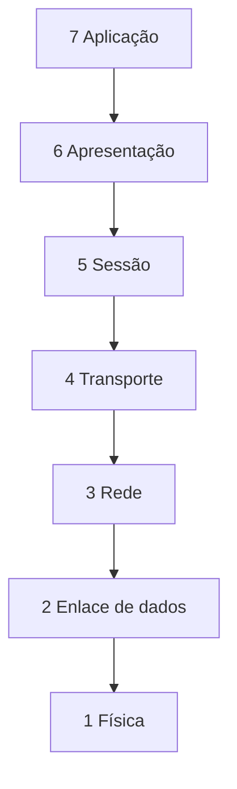

| Camada OSI             | Função resumida                                               |
| ---------------------- | ------------------------------------------------------------- |
| **7. Aplicação**       | Protocolos usados por aplicações, como Web e e-mail.          |
| **6. Apresentação**    | Representação, tradução, compressão e criptografia dos dados. |
| **5. Sessão**          | Estabelecimento, gerenciamento e encerramento de sessões.     |
| **4. Transporte**      | Comunicação fim a fim entre processos.                        |
| **3. Rede**            | Endereçamento lógico e roteamento.                            |
| **2. Enlace de dados** | Organização dos bits em quadros e comunicação local.          |
| **1. Física**          | Transmissão de bits pelo meio físico.                         |

> [!note]- Nota complementar
> O OSI é muito útil para estudar redes porque separa responsabilidades. Porém, seus protocolos não se tornaram dominantes na prática. O modelo é mais usado como referência didática e conceitual.

> [!tip] Resumindo
> O OSI ajuda a entender “quem faz o quê” dentro da comunicação em rede.

---

## 16. Camadas inferiores do OSI

> [!info] Conceito
> As camadas física, enlace e rede lidam com a movimentação dos dados pela infraestrutura.

A **camada física** transmite bits por cabos, fibras ópticas, rádio ou outros meios. Ela se preocupa com sinais, conectores, frequências, voltagens e características mecânicas ou elétricas.

A **camada de enlace de dados** organiza os bits em quadros, trata a comunicação local e pode realizar controle de erros e controle de fluxo entre dispositivos diretamente conectados.

A **camada de rede** encaminha pacotes entre origem e destino, mesmo quando eles precisam passar por várias redes intermediárias. Ela envolve endereçamento lógico, roteamento, interconexão de redes e controle de congestionamento em nível de rede.

| Camada         | Ideia-chave                 |
| -------------- | --------------------------- |
| **Física** (1) | Move bits.                  |
| **Enlace** (2) | Move quadros na rede local. |
| **Rede** (3)   | Move pacotes entre redes.   |

> [!warning] Atenção
> A camada de rede entrega pacotes ao host de destino. A entrega ao processo correto é responsabilidade da camada de transporte.

---

## 17. Camadas superiores do OSI

> [!info] Conceito
> As camadas superiores aproximam a comunicação das aplicações e do usuário.

A **camada de transporte** oferece comunicação fim a fim entre processos. Ela pode dividir dados em partes menores, controlar erros, ordenar informações e oferecer confiabilidade, dependendo do protocolo usado.

A **camada de sessão** organiza sessões de comunicação, podendo controlar diálogo, sincronização e retomada após falhas.

A **camada de apresentação** trata da forma dos dados, permitindo que sistemas com representações internas diferentes consigam trocar informações. Atua como um "tradutor" dos dados, sendo responsável por aspectos como a sintaxe, a semântica, a criptografia e a compactação das informações antes que sejam enviadas às camadas inferiores.

A **camada de aplicação** contém protocolos usados pelas aplicações, como HTTP, FTP, SMTP e DNS.

| Camada               | Ideia-chave                           |
| -------------------- | ------------------------------------- |
| **Transporte** (4)   | Comunicação entre processos.          |
| **Sessão** (5)       | Organização da sessão de comunicação. |
| **Apresentação** (6) | Formato e significado dos dados.      |
| **Aplicação** (7)    | Serviços usados pelas aplicações.     |

> [!tip] Resumindo
> As camadas superiores cuidam da comunicação do ponto de vista dos processos e aplicações.

---

## 18. Modelo TCP/IP

> [!info] Conceito
> O TCP/IP é a arquitetura prática usada como base da Internet.

O modelo **TCP/IP** surgiu a partir da necessidade de interligar redes diferentes. Seus protocolos foram usados na prática antes de o modelo ser formalizado como uma descrição da arquitetura.

No TCP/IP, as funções das camadas de sessão e apresentação do OSI são geralmente absorvidas pela camada de aplicação. Por isso, o modelo é mais simples.

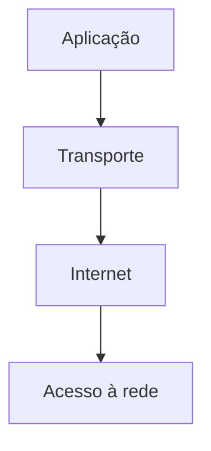

| Camada TCP/IP           | Função                                                |
| ----------------------- | ----------------------------------------------------- |
| **Aplicação** (5)       | Protocolos de alto nível, como HTTP, DNS, SMTP e FTP. |
| **Transporte** (4)      | Comunicação entre processos, usando TCP ou UDP.       |
| **Internet** (3)        | Entrega de pacotes IP entre redes.                    |
| **Acesso à rede** (1/2) | Comunicação ==física e de enlace== com a rede local.  |

> [!warning] Atenção
> Alguns materiais apresentam o TCP/IP com quatro camadas; ==outros separam acesso à rede em enlace e física, formando cinco camadas.== A diferença está no agrupamento das camadas inferiores.

---

## 19. Modelo híbrido de cinco camadas

> [!info] Conceito
> O modelo híbrido combina a clareza do OSI com a prática do TCP/IP.

Uma forma muito usada para estudar redes é o modelo de cinco camadas: **aplicação, transporte, rede, enlace e física**. Ele mantém a separação das camadas inferiores e foca nos protocolos usados na prática.

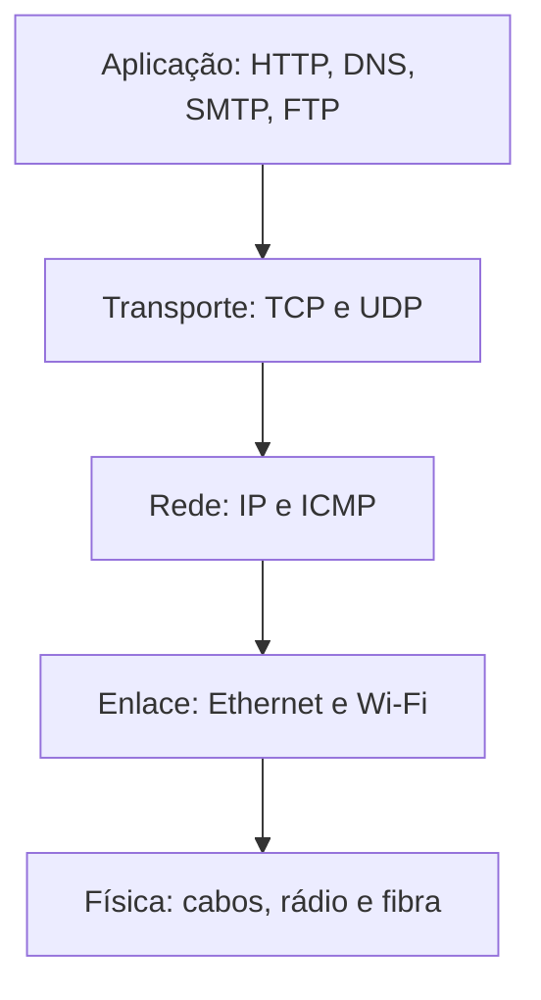

| Camada | Exemplo prático |
|---|---|
| **Aplicação** | Navegador acessando uma página via HTTP. |
| **Transporte** | TCP garantindo entrega ordenada dos dados da página. |
| **Rede** | IP encaminhando pacotes até o servidor. |
| **Enlace** | Ethernet ou Wi-Fi transmitindo quadros na rede local. |
| **Física** | Bits trafegando por cabo, fibra ou rádio. |

> [!tip] Resumindo
> O modelo de cinco camadas é prático para estudar redes modernas sem perder a organização conceitual.

---

## 20. Comparação entre OSI e TCP/IP

> [!info] Conceito
> OSI é mais conceitual; TCP/IP é mais prático e amplamente usado.

Os modelos OSI e TCP/IP usam a ideia de pilha de protocolos independentes. Ambos possuem funções relacionadas a rede, transporte e aplicação. A diferença principal está na origem e no uso.

O **OSI** foi criado antes da consolidação de seus protocolos, tornando-se um modelo mais genérico e didático. O **TCP/IP** surgiu a partir de protocolos já utilizados e se tornou a base prática da Internet.

| Aspecto | OSI | TCP/IP |
|---|---|---|
| Estrutura | Sete camadas | Quatro ou cinco camadas |
| Origem | Modelo veio antes dos protocolos | Protocolos vieram antes do modelo |
| Uso principal | Referência didática | Implementação prática da Internet |
| Serviço, interface e protocolo | Separação mais clara | Separação menos clara |
| Sessão e apresentação | Camadas próprias | Absorvidas pela aplicação |
| Adoção prática | Menor | Muito ampla |

> [!warning] Atenção
> O OSI é muito importante para aprender redes, mas o TCP/IP é a arquitetura predominante na prática.

---

## 21. Camada de rede e protocolo IP

> [!info] Conceito
> A camada de rede entrega pacotes entre hosts, mesmo que estejam em redes diferentes.

A camada de rede é responsável pelo **endereçamento lógico** e pelo **roteamento**. O principal protocolo dessa camada na Internet é o **IP**, que permite encaminhar pacotes entre redes diferentes.

O IP é um serviço **não orientado à conexão**. Isso significa que cada pacote pode ser tratado de forma independente. Pacotes de uma mesma comunicação podem seguir caminhos diferentes e chegar fora de ordem.

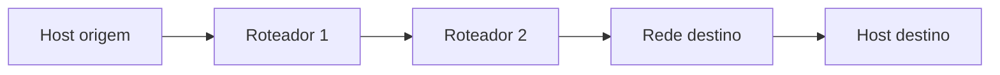

> [!note]- Nota complementar
> O roteador consulta informações de roteamento para decidir o próximo salto do pacote. Ele não precisa conhecer a aplicação que gerou os dados; sua função principal é encaminhar pacotes com base em endereços de rede.

> [!tip] Resumindo
> O IP leva pacotes até o host de destino; os roteadores escolhem os caminhos.

---

## 22. IPv4 e IPv6

> [!info] Conceito
> IPv4 e IPv6 são versões do protocolo IP usadas para endereçamento em redes.

O **IPv4** usa endereços de 32 bits e se tornou a versão mais difundida historicamente. Sua limitação principal é a quantidade de endereços disponíveis.

O **IPv6** usa endereços de 128 bits, ampliando muito o espaço de endereçamento e permitindo a evolução da Internet.

| Característica | IPv4 | IPv6 |
|---|---|---|
| Tamanho do endereço | 32 bits | 128 bits |
| Quantidade de endereços | Menor | Muito maior |
| Representação comum | Decimal com pontos | Hexadecimal com dois-pontos |
| Objetivo | Endereçamento tradicional da Internet | Expansão e evolução do endereçamento |

> [!warning] Atenção
> IPv6 não é apenas “IPv4 com mais endereços”. Ele representa uma evolução do protocolo, embora IPv4 e IPv6 ainda convivam em muitas redes.

---

## 23. Camada de transporte

> [!info] Conceito
> A camada de transporte fornece comunicação lógica entre processos de aplicação em hosts diferentes.

A **camada de rede** entrega ==pacotes== entre hosts. A camada de transporte vai além: entrega dados ao **processo correto** dentro do host. Isso é necessário porque um mesmo computador pode executar várias aplicações de rede ao mesmo tempo.

Para isso, a **camada de transporte** usa ==portas e sockets==. Ela transforma mensagens da aplicação em segmentos e os entrega à camada de rede. No destino, recebe os segmentos e encaminha os dados à aplicação correta.

```mermaid
flowchart LR
    subgraph ORIGEM["Dispositivo de origem"]
        direction TB
        A["Aplicação<br/>Dados"]
        B["Transporte<br/>Segmento TCP ou datagrama UDP"]
        C["Rede<br/>Pacote IP"]
        D["Enlace<br/>Quadro"]
        E["Física<br/>Bits"]

        A -->|"Encapsulamento"| B
        B --> C
        C --> D
        D --> E
    end

    N["Meio de transmissão<br/>Rede cabeada ou sem fio"]

    subgraph DESTINO["Dispositivo de destino"]
        direction BT
        F["Física<br/>Bits"]
        G["Enlace<br/>Quadro"]
        H["Rede<br/>Pacote IP"]
        I["Transporte<br/>Segmento TCP ou datagrama UDP"]
        J["Aplicação de destino<br/>Dados recebidos"]

        F -->|"Desencapsulamento"| G
        G --> H
        H --> I
        I --> J
    end

    E -->|"Transmissão dos sinais"| N
    N --> F
```

> [!tip] Resumindo
> A camada de transporte transforma entrega host a host em entrega processo a processo.

---

## 24. Multiplexação e demultiplexação

> [!info] Conceito
> Multiplexar é reunir dados de várias aplicações; demultiplexar é entregá-los à aplicação correta.

Na origem, a **multiplexação** ocorre quando a camada de transporte recebe dados de várias aplicações e os encapsula em segmentos.

No destino, a **demultiplexação** ocorre quando a camada de transporte analisa portas, endereços e outras informações para entregar os dados ao socket correto.

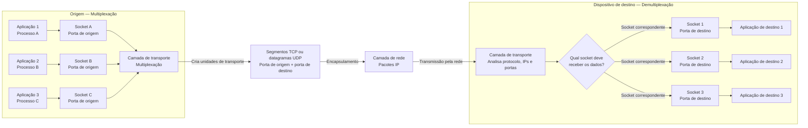

| Protocolo | Como identifica a entrega                                       |
| --------- | --------------------------------------------------------------- |
| **UDP**   | Usa principalmente porta de destino e informações do datagrama. |
| **TCP**   | Usa IP origem, porta origem, IP destino e porta destino.        |

> [!warning] Atenção
> Porta não identifica o computador. Porta identifica o processo ou serviço dentro do computador.

---

## 25. Sockets

> [!info] Conceito
> Socket é o ponto final de comunicação usado por processos em rede.

Um socket conecta uma aplicação à camada de transporte. Ele permite que processos enviem e recebam dados pela rede.

No **UDP**, diferentes origens podem enviar datagramas para o mesmo socket de destino. No **TCP**, cada conexão é identificada por uma combinação de quatro elementos: IP de origem, porta de origem, IP de destino e porta de destino.

| Protocolo | Identificação |
|---|---|
| **UDP** | Comunicação simples por datagramas. |
| **TCP** | Conexão identificada por uma quádrupla. |

> [!tip] Resumindo
> Sockets evitam que dados de diferentes aplicações sejam misturados dentro do mesmo host.

---

## 26. Protocolo UDP

> [!info] Conceito
> UDP é um protocolo simples, sem conexão e sem garantias automáticas de entrega.

O **UDP** realiza poucas funções além de multiplexação, demultiplexação e verificação de erros. Ele não estabelece conexão antes do envio, não garante entrega, não garante ordem e não retransmite automaticamente dados perdidos.

Sua principal vantagem é a simplicidade. Por ter menos controle e menor sobrecarga, pode ser adequado a aplicações que precisam de rapidez ou que implementam seus próprios mecanismos de controle.

| Característica | UDP |
|---|---|
| Orientado à conexão | Não |
| Garantia de entrega | Não |
| Garantia de ordem | Não |
| Retransmissão automática | Não |
| Cabeçalho | Pequeno |
| Uso comum | DNS, SNMP, RIP, multimídia e tempo real |

> [!warning] Atenção
> UDP não é “ruim”. Ele apenas não oferece garantias automáticas. Em algumas aplicações, simplicidade e menor atraso são mais importantes que confiabilidade total.

---

## 27. Checksum no UDP

> [!info] Conceito
> Checksum é um mecanismo usado para detectar erros nos dados transmitidos.

O UDP usa uma soma de verificação para identificar possíveis alterações nos bits durante a transmissão. O transmissor calcula um valor com base no conteúdo do segmento e o receptor recalcula esse valor ao receber os dados.

Se os valores forem diferentes, houve erro detectado. Se forem iguais, não foi detectado erro, mas isso não transforma o UDP em um protocolo confiável.

> [!tip] Resumindo
> O checksum detecta erros, mas não garante entrega, ordem ou retransmissão.

---

## 28. Protocolo TCP

> [!info] Conceito
> TCP é um protocolo confiável, orientado à conexão e baseado em fluxo de bytes.

O **TCP** estabelece uma conexão antes da transmissão. Ele controla sequência, confirma recebimentos, retransmite perdas, organiza os dados e controla o fluxo para evitar sobrecarregar o receptor.

O TCP oferece à aplicação a ideia de um fluxo contínuo de bytes. A aplicação não precisa lidar diretamente com pacotes individuais; ela envia e recebe dados de forma ordenada e confiável.

| Característica | TCP |
|---|---|
| Orientado à conexão | Sim |
| Entrega confiável | Sim |
| Entrega ordenada | Sim |
| Retransmissão | Sim |
| Controle de fluxo | Sim |
| Controle de congestionamento | Sim |
| Uso comum | HTTP, SMTP, FTP, Telnet e aplicações confiáveis |

> [!warning] Atenção
> TCP é confiável quanto à entrega dos dados, mas isso não significa segurança criptográfica. Para segurança, são necessários mecanismos como TLS, IPsec, autenticação, VPNs e firewalls.

---

## 29. Estabelecimento e encerramento de conexão TCP

> [!info] Conceito
> O TCP usa uma apresentação inicial para estabelecer uma conexão.

O estabelecimento de conexão TCP ocorre por meio do **3-Way Handshake**. Primeiro, o cliente envia **SYN**. Depois, o servidor responde com **SYN + ACK**. Por fim, o cliente responde com **ACK**.

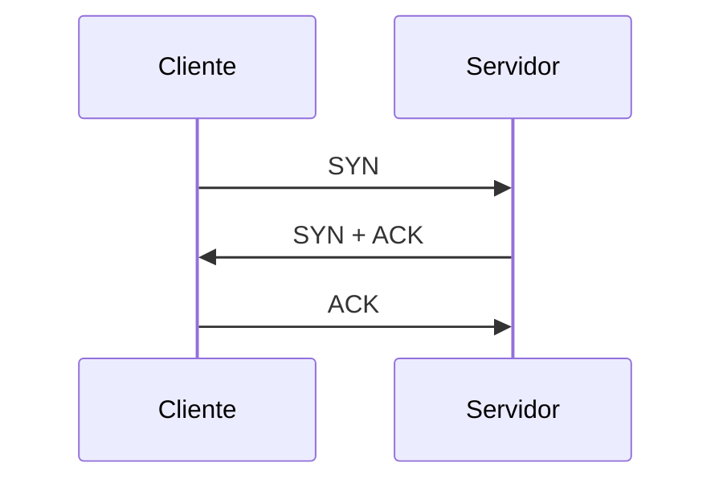

Esse processo permite preparar os dois lados da conexão, sincronizar parâmetros e criar o estado necessário para a comunicação. O encerramento da conexão envolve segmentos de finalização, normalmente com **FIN** e **ACK**.

> [!tip] Resumindo
> O TCP precisa estabelecer uma conexão antes de transmitir dados de forma confiável.

---

## 30. Controle de fluxo

> [!info] Conceito
> Controle de fluxo evita que o remetente envie mais dados do que o receptor consegue processar.

O receptor pode ser mais lento que o remetente ou ter pouco espaço em buffer. Para evitar sobrecarga, o TCP usa uma janela de recepção, informando quanto o receptor ainda consegue receber.

Assim, o remetente ajusta a quantidade de dados enviados sem confirmação.

> [!tip] Resumindo
> Controle de fluxo protege o receptor.

---

## 31. Controle de congestionamento

> [!info] Conceito
> Controle de congestionamento evita que a rede receba mais tráfego do que consegue transportar.

Congestionamento ocorre quando há muitos dados circulando na rede, causando atrasos, perdas e queda de desempenho. O TCP interpreta perdas e atrasos como sinais de congestionamento e reduz sua taxa de envio.

A variável **cwnd**, chamada janela de congestionamento, limita a quantidade de dados que o remetente pode enviar. Na **partida lenta**, o TCP começa com poucos dados e aumenta gradualmente. Quando detecta perda, reduz a janela.

| Variável     | Significado                                           | Função                                                                                       |
| ------------ | ----------------------------------------------------- | -------------------------------------------------------------------------------------------- |
| **cwnd**     | *Congestion Window*, ou janela de congestionamento    | Limita quanto o remetente pode enviar para a rede sem receber novos ACKs.                    |
| **ssthresh** | *Slow Start Threshold*, ou limiar da partida lenta    | Define o ponto em que o TCP deixa de crescer rapidamente e passa a crescer com mais cautela. |
| **ACK**      | Confirmação de recebimento                            | Indica que um segmento chegou ao destino.                                                    |
| **RTT**      | *Round Trip Time*, ou tempo de ida e volta            | Tempo entre enviar um segmento e receber sua confirmação.                                    |
| **MSS**      | *Maximum Segment Size*, ou tamanho máximo de segmento | Tamanho máximo de dados que podem ser enviados em um segmento TCP.                           |

> [!warning] Atenção
> Controle de fluxo protege o receptor. Controle de congestionamento protege a rede.

>[!info]- Aprofundando sobre controle de congestionamento
>![[RECOMP-Congestionamento]]

[[RECOMP-Congestionamento|Abrir em nova página]]

---

## 32. TCP versus UDP

> [!info] Conceito
> TCP e UDP atendem a necessidades diferentes.

TCP é adequado quando a aplicação precisa de confiabilidade, ordem, retransmissão e controle. UDP é adequado quando a aplicação precisa de simplicidade, menor atraso ou controle próprio.

| Critério | TCP | UDP |
|---|---|---|
| Conexão | Orientado à conexão | Sem conexão |
| Entrega confiável | Sim | Não |
| Ordem dos dados | Sim | Não |
| Retransmissão | Sim | Não automática |
| Controle de fluxo | Sim | Não |
| Controle de congestionamento | Sim | Não como o TCP |
| Sobrecarga | Maior | Menor |
| Melhor para | Web, arquivos, e-mail | DNS, tempo real, consultas simples |

> [!tip] Resumindo
> TCP prioriza confiabilidade. UDP prioriza simplicidade e menor sobrecarga.

---

## 33. Aplicações e protocolos de transporte

> [!info] Conceito
> A escolha entre TCP e UDP depende das necessidades da aplicação.

Aplicações como Web, e-mail e transferência de arquivos geralmente precisam de entrega correta e ordenada, por isso usam TCP. Aplicações como DNS, gerenciamento de rede, roteamento simples e algumas transmissões multimídia podem usar UDP.

| Aplicação | Protocolo de aplicação | Transporte comum |
|---|---|---|
| Web | HTTP | TCP |
| Correio eletrônico | SMTP | TCP |
| Transferência de arquivos | FTP | TCP |
| Tradução de nomes | DNS | Geralmente UDP |
| Gerenciamento de rede | SNMP | Geralmente UDP |
| Roteamento | RIP | Geralmente UDP |
| Multimídia | Protocolos variados | UDP ou TCP |
| Telefonia pela Internet | Protocolos variados | UDP ou TCP |

> [!warning] Atenção
> Não existe um protocolo “melhor” em todos os casos. Existe o protocolo mais adequado ao tipo de aplicação.

---

## 34. Qualidade de serviço e desempenho

> [!info] Conceito
> Desempenho de rede envolve mais que velocidade.

A qualidade de uma rede não depende apenas da taxa de transmissão. Também envolve atraso, variação do atraso, perdas, confiabilidade e capacidade de atender diferentes tipos de aplicação.

Uma transferência de arquivos pode tolerar atraso, desde que os dados cheguem corretamente. Já chamadas de voz e vídeo em tempo real sofrem mais com atraso e variação de atraso, mesmo que tolerem pequenas perdas.

| Requisito | Significado |
|---|---|
| **Vazão** | Quantidade de dados transmitidos por unidade de tempo. |
| **Atraso** | Tempo para os dados irem da origem ao destino. |
| **Jitter** | Variação do atraso. |
| **Perda** | Pacotes descartados ou não entregues. |
| **Confiabilidade** | Probabilidade de entrega correta. |

> [!tip] Resumindo
> Uma rede rápida nem sempre é uma rede boa para todas as aplicações. Cada aplicação tem requisitos diferentes.

---

## 35. Segurança e vulnerabilidades em redes

> [!info] Conceito
> Redes transportam informações e, por isso, precisam ser protegidas.

Como redes carregam dados, voz, autenticações, arquivos e informações sensíveis, elas podem ser alvo de ataques, interceptações, fraudes e uso indevido.

Mecanismos como **firewalls**, **VPNs**, **criptografia**, **autenticação**, **controle de acesso** e **protocolos seguros** ajudam a proteger a comunicação.

> [!warning] Atenção
> TCP garante entrega confiável, mas não garante sigilo, autenticação ou proteção contra ataques. Segurança depende de mecanismos adicionais.

---

## 36. Erros comuns de interpretação

> [!warning] Erros comuns
> Alguns conceitos de redes são frequentemente confundidos em provas e na prática.

| Erro comum                                        | Correção                                                                        |
| ------------------------------------------------- | ------------------------------------------------------------------------------- |
| Confundir Internet com Web.                       | A Web é um serviço que funciona sobre a Internet.                               |
| Achar que TCP/IP são apenas dois protocolos.      | TCP/IP é uma pilha/conjunto de protocolos.                                      |
| Achar que UDP é “ruim”.                           | UDP é simples e útil quando a aplicação tolera perdas ou controla isso sozinha. |
| Dizer que TCP é “seguro”.                         | TCP é confiável na entrega, mas não oferece criptografia por si só.             |
| Confundir IP com porta.                           | IP identifica o host; porta identifica o processo.                              |
| Confundir MAC com IP.                             | MAC atua na rede local; IP atua no endereçamento lógico entre redes.            |
| Confundir controle de fluxo com congestionamento. | Fluxo protege o receptor; congestionamento protege a rede.                      |
| Achar que OSI é o modelo mais usado na prática.   | OSI é referência didática; TCP/IP domina a prática.                             |
| Achar que roteador entrega dados à aplicação.     | Roteador encaminha pacotes; transporte entrega ao processo correto.             |

> [!tip] Resumindo
> Muitos erros vêm de misturar camadas diferentes. Sempre pergunte: isso pertence à aplicação, transporte, rede, enlace ou física?

---

## 37. Revisão rápida por camada

> [!info] Conceito
> Cada camada tem uma responsabilidade principal.

| Camada | Responsabilidade | Unidade típica | Exemplos |
|---|---|---|---|
| **Aplicação** | Serviços usados por aplicações | Mensagem | HTTP, DNS, SMTP, FTP |
| **Transporte** | Comunicação entre processos | Segmento | TCP, UDP |
| **Rede** | Endereçamento e roteamento | Pacote / datagrama | IP, ICMP |
| **Enlace** | Comunicação local entre dispositivos | Quadro | Ethernet, Wi-Fi |
| **Física** | Transmissão de bits | Bits | Cabo, fibra, rádio |

> [!tip] Resumindo
> Aplicação usa serviços; transporte entrega ao processo; rede entrega ao host; enlace entrega localmente; física move bits.

---

## 38. Relação geral entre os conceitos

> [!info] Conceito
> Os temas estudados formam uma sequência lógica.

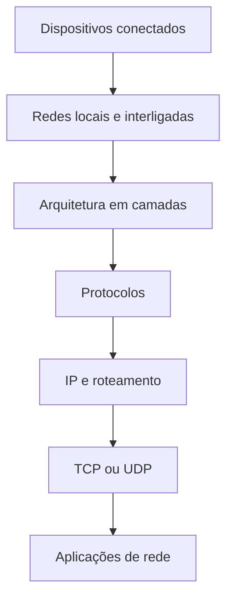

Primeiro existem dispositivos conectados. Esses dispositivos formam redes locais ou redes maiores. Para organizar a comunicação, usam-se camadas. Dentro das camadas, os protocolos definem regras. O IP encaminha pacotes entre redes. TCP ou UDP fazem o transporte entre processos. Por fim, as aplicações usam esses serviços para entregar funcionalidades ao usuário.

---

## 39. Tabela final de revisão

> [!summary] Síntese
> A tabela abaixo reúne as ideias centrais do conteúdo.

| Tema | Ideia-chave |
|---|---|
| **Redes** | Conectam dispositivos para troca de dados e compartilhamento de recursos. |
| **Internet** | Rede global formada pela interligação de várias redes. |
| **Web** | Serviço que funciona sobre a Internet. |
| **Camadas** | Organizam funções e reduzem complexidade. |
| **Protocolos** | Definem regras de comunicação. |
| **Serviço** | O que uma camada oferece. |
| **Interface** | Como a camada superior acessa o serviço. |
| **OSI** | Modelo didático com sete camadas. |
| **TCP/IP** | Arquitetura prática usada na Internet. |
| **IP** | Endereça e roteia pacotes entre redes. |
| **MAC** | Identifica interface na rede local. |
| **Porta** | Identifica aplicação ou processo no host. |
| **Socket** | Ponto final de comunicação entre processos. |
| **TCP** | Transporte confiável, ordenado e orientado à conexão. |
| **UDP** | Transporte simples, sem conexão e sem garantias automáticas. |
| **Controle de fluxo** | Evita sobrecarregar o receptor. |
| **Controle de congestionamento** | Evita sobrecarregar a rede. |
| **Segurança** | Exige mecanismos adicionais, como criptografia, autenticação, VPNs e firewalls. |

> [!summary] Síntese final
> Redes de computadores conectam dispositivos para permitir comunicação, compartilhamento e acesso a serviços. Para reduzir a complexidade, a comunicação é organizada em camadas. O modelo OSI é uma referência conceitual com sete camadas, enquanto o TCP/IP é a arquitetura prática usada na Internet. A camada de rede, com o IP, entrega pacotes entre hosts. A camada de transporte, com TCP e UDP, entrega dados entre processos. TCP prioriza confiabilidade e ordem; UDP prioriza simplicidade e menor sobrecarga. Entender a diferença entre rede, Internet, Web, IP, MAC, portas, sockets, serviços, interfaces e protocolos é essencial para analisar, administrar e proteger redes.