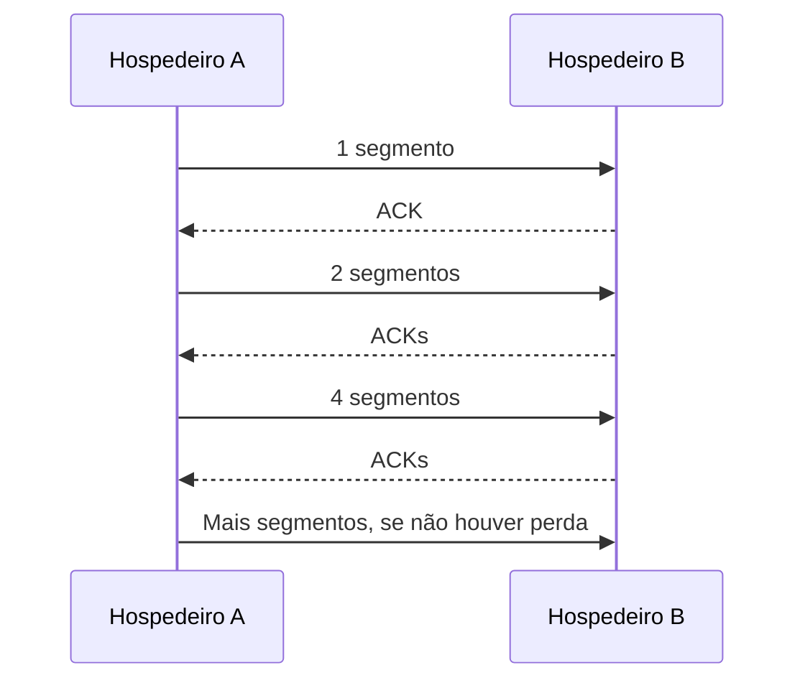
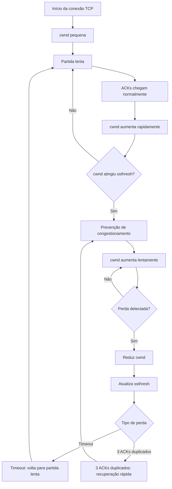

## 31. Controle de congestionamento no TCP

> [!info] Conceito
> Controle de congestionamento é o mecanismo usado pelo TCP para ajustar a quantidade de dados enviados de acordo com a capacidade percebida da rede.

O **controle de congestionamento** evita que o remetente envie dados em uma taxa maior do que a rede consegue transportar. Quando muitos hosts transmitem ao mesmo tempo, roteadores e enlaces podem ficar sobrecarregados, gerando **atrasos longos**, **filas**, **perda de pacotes** e queda no desempenho geral.

No TCP, esse controle é feito de forma **fim a fim**. Isso significa que a rede não precisa avisar diretamente ao remetente que está congestionada. O próprio TCP infere o congestionamento observando sinais como:

- perda de segmento;
- esgotamento de temporização, chamado **timeout**;
- recebimento de **ACKs duplicados**;
- aumento de atrasos na comunicação.

> [!warning] Atenção
> Controle de congestionamento não é a mesma coisa que controle de fluxo.  
> **Controle de fluxo** protege o receptor.  
> **Controle de congestionamento** protege a rede.

---

### 31.1 Variáveis principais do controle de congestionamento

> [!info] Conceito
> O TCP usa variáveis para decidir quantos segmentos podem ser enviados antes de aguardar confirmações.

| Variável     | Significado                                           | Função                                                                                       |
| ------------ | ----------------------------------------------------- | -------------------------------------------------------------------------------------------- |
| **cwnd**     | *Congestion Window*, ou janela de congestionamento    | Limita quanto o remetente pode enviar para a rede sem receber novos ACKs.                    |
| **ssthresh** | *Slow Start Threshold*, ou limiar da partida lenta    | Define o ponto em que o TCP deixa de crescer rapidamente e passa a crescer com mais cautela. |
| **ACK**      | Confirmação de recebimento                            | Indica que um segmento chegou ao destino.                                                    |
| **RTT**      | *Round Trip Time*, ou tempo de ida e volta            | Tempo entre enviar um segmento e receber sua confirmação.                                    |
| **MSS**      | *Maximum Segment Size*, ou tamanho máximo de segmento | Tamanho máximo de dados que podem ser enviados em um segmento TCP.                           |

A variável mais importante é a **cwnd**. Ela representa a quantidade máxima de dados que o remetente pode manter “em trânsito” na rede antes de receber confirmações.

De forma simplificada:

```text
Taxa de envio permitida ≈ cwnd / RTT
```

Ou seja, quanto maior a janela de congestionamento (**cwnd**), mais dados podem ser enviados por rodada de comunicação. Quanto maior o **RTT**, mais tempo o remetente espera pelas confirmações.

> [!tip] Resumindo
> A **cwnd** controla o ritmo de envio do TCP. Se a rede parece livre, ela aumenta. Se há perda, ela diminui.

---

### 31.2 Partida lenta

> [!info] Conceito
> A partida lenta é a fase inicial em que o TCP começa enviando poucos segmentos e aumenta rapidamente conforme recebe confirmações.

Apesar do nome, a **partida lenta** não significa que o TCP cresce devagar o tempo todo. Ela recebe esse nome porque começa com uma quantidade pequena de dados, evitando sobrecarregar a rede logo no início da conexão.

Na prática, o TCP começa com uma **cwnd pequena**. A cada ACK recebido, ele aumenta a janela de congestionamento. Com isso, a quantidade de segmentos enviados por rodada tende a crescer rapidamente.

A imagem abaixo representa esse crescimento:

<svg viewBox="0 0 680 540" xmlns="http://www.w3.org/2000/svg" font-family="sans-serif" preserveAspectRatio="xMidYMid meet"  
style="display:block; width:100%; max-width:800px; height:auto; margin:0 auto;">
  <defs>
    <marker id="arrowData" viewBox="0 0 10 10" refX="8" refY="5" markerWidth="6" markerHeight="6" orient="auto-start-reverse">
      <path d="M2 1L8 5L2 9" fill="none" stroke="#29B6E6" stroke-width="1.5" stroke-linecap="round" stroke-linejoin="round"/>
    </marker>
    <marker id="arrowAck" viewBox="0 0 10 10" refX="8" refY="5" markerWidth="6" markerHeight="6" orient="auto-start-reverse">
      <path d="M2 1L8 5L2 9" fill="none" stroke="#aaaaaa" stroke-width="1.4" stroke-linecap="round" stroke-linejoin="round"/>
    </marker>
    <marker id="arrowTime" viewBox="0 0 10 10" refX="8" refY="5" markerWidth="6" markerHeight="6" orient="auto-start-reverse">
      <path d="M2 1L8 5L2 9" fill="none" stroke="#888888" stroke-width="1.4" stroke-linecap="round" stroke-linejoin="round"/>
    </marker>
  </defs>

  <rect width="680" height="540" fill="transparent"/>

  <!-- ===== Linhas do tempo ===== -->
  <line x1="160" y1="50" x2="160" y2="490" stroke="#888888" stroke-width="1" stroke-dasharray="4 4" opacity="0.55"/>
  <line x1="520" y1="50" x2="520" y2="490" stroke="#888888" stroke-width="1" stroke-dasharray="4 4" opacity="0.55"/>

  <!-- ===== Cabeçalhos ===== -->
  <rect x="100" y="18" width="120" height="38" rx="8" fill="#1A4A5E" fill-opacity="0.6" stroke="#7FCFF0" stroke-width="1.2"/>
  <text x="160" y="41" text-anchor="middle" font-size="13" font-weight="600" fill="#D6F0FB">Hospedeiro A</text>

  <rect x="460" y="18" width="120" height="38" rx="8" fill="#1A4A5E" fill-opacity="0.6" stroke="#7FCFF0" stroke-width="1.2"/>
  <text x="520" y="41" text-anchor="middle" font-size="13" font-weight="600" fill="#D6F0FB">Hospedeiro B</text>

  <!-- ===== Colchete RTT ===== -->
  <line x1="72" y1="80" x2="72" y2="160" stroke="#aaaaaa" stroke-width="1.1" opacity="0.9"/>
  <line x1="68" y1="80" x2="76" y2="80" stroke="#aaaaaa" stroke-width="1.1" opacity="0.9"/>
  <line x1="68" y1="160" x2="76" y2="160" stroke="#aaaaaa" stroke-width="1.1" opacity="0.9"/>
  <text x="56" y="124" text-anchor="middle" font-size="12" fill="#dddddd">RTT</text>

  <!-- ===== Rodada 1 ===== -->
  <line x1="160" y1="80" x2="520" y2="140" stroke="#29B6E6" stroke-width="1.8" marker-end="url(#arrowData)"/>
  <line x1="520" y1="140" x2="160" y2="160" stroke="#aaaaaa" stroke-width="1.2" stroke-dasharray="5 3" marker-end="url(#arrowAck)"/>
  <text x="350" y="97" text-anchor="middle" font-size="11" fill="#D6F0FB" font-weight="600">1 segmento</text>

  <!-- ===== Rodada 2 ===== -->
  <line x1="160" y1="170" x2="520" y2="230" stroke="#29B6E6" stroke-width="1.8" marker-end="url(#arrowData)"/>
  <line x1="160" y1="180" x2="520" y2="252" stroke="#29B6E6" stroke-width="1.8" marker-end="url(#arrowData)"/>
  <line x1="520" y1="230" x2="160" y2="280" stroke="#aaaaaa" stroke-width="1.2" stroke-dasharray="5 3" marker-end="url(#arrowAck)"/>
  <line x1="520" y1="252" x2="160" y2="292" stroke="#aaaaaa" stroke-width="1.2" stroke-dasharray="5 3" marker-end="url(#arrowAck)"/>
  <text x="350" y="192" text-anchor="middle" font-size="11" fill="#D6F0FB" font-weight="600">2 segmentos</text>

  <!-- ===== Rodada 3 ===== -->
  <line x1="160" y1="305" x2="520" y2="360" stroke="#29B6E6" stroke-width="1.8" marker-end="url(#arrowData)"/>
  <line x1="160" y1="315" x2="520" y2="376" stroke="#29B6E6" stroke-width="1.8" marker-end="url(#arrowData)"/>
  <line x1="160" y1="325" x2="520" y2="392" stroke="#29B6E6" stroke-width="1.8" marker-end="url(#arrowData)"/>
  <line x1="160" y1="335" x2="520" y2="408" stroke="#29B6E6" stroke-width="1.8" marker-end="url(#arrowData)"/>
  <line x1="520" y1="360" x2="160" y2="418" stroke="#aaaaaa" stroke-width="1.2" stroke-dasharray="5 3" marker-end="url(#arrowAck)"/>
  <line x1="520" y1="376" x2="160" y2="430" stroke="#aaaaaa" stroke-width="1.2" stroke-dasharray="5 3" marker-end="url(#arrowAck)"/>
  <line x1="520" y1="392" x2="160" y2="442" stroke="#aaaaaa" stroke-width="1.2" stroke-dasharray="5 3" marker-end="url(#arrowAck)"/>
  <line x1="520" y1="408" x2="160" y2="454" stroke="#aaaaaa" stroke-width="1.2" stroke-dasharray="5 3" marker-end="url(#arrowAck)"/>
  <text x="350" y="326" text-anchor="middle" font-size="11" fill="#D6F0FB" font-weight="600">4 segmentos</text>

  <!-- ===== Setas de tempo ===== -->
  <line x1="160" y1="472" x2="160" y2="492" stroke="#888888" stroke-width="1.4" marker-end="url(#arrowTime)"/>
  <text x="160" y="512" text-anchor="middle" font-size="12" fill="#dddddd">Tempo</text>

  <line x1="520" y1="472" x2="520" y2="492" stroke="#888888" stroke-width="1.4" marker-end="url(#arrowTime)"/>
  <text x="520" y="512" text-anchor="middle" font-size="12" fill="#dddddd">Tempo</text>

  <!-- ===== Legenda ===== -->
  <line x1="230" y1="528" x2="265" y2="528" stroke="#29B6E6" stroke-width="2"/>
  <text x="272" y="532" font-size="11" fill="#eeeeee">dados (A→B)</text>

  <line x1="360" y1="528" x2="395" y2="528" stroke="#aaaaaa" stroke-width="1.4" stroke-dasharray="5 3"/>
  <text x="402" y="532" font-size="11" fill="#dddddd">ACK (B→A)</text>
</svg>


Na figura, o **Hospedeiro A** envia dados ao **Hospedeiro B**. O tempo desce verticalmente. As setas inclinadas representam segmentos enviados e confirmações recebidas.

O fluxo pode ser entendido assim:

1. Primeiro, o remetente envia **um segmento**.
2. Quando recebe o ACK correspondente, entende que a rede suportou esse envio.
3. Em seguida, envia **dois segmentos**.
4. Recebendo os ACKs, aumenta novamente a janela.
5. Depois, envia **quatro segmentos**.
6. O processo continua enquanto não houver sinal de congestionamento ou até atingir o limite definido por **ssthresh**.



> [!tip] Resumindo
> Na partida lenta, o TCP testa a capacidade da rede aumentando a quantidade de segmentos enviados a cada rodada de ACKs.

---

### 31.3 Crescimento exponencial e papel do RTT

> [!info] Conceito
> Na partida lenta, a janela de congestionamento cresce rapidamente porque cada ACK permite aumentar a quantidade de dados enviados.

A cada **RTT**, se os ACKs chegam normalmente, o TCP entende que a rede ainda está suportando a transmissão. Por isso, a janela de congestionamento tende a dobrar a cada rodada.

Um exemplo simplificado:

| Rodada | cwnd aproximada | Quantidade enviada |
|---|---:|---|
| 1º RTT | 1 MSS | 1 segmento |
| 2º RTT | 2 MSS | 2 segmentos |
| 3º RTT | 4 MSS | 4 segmentos |
| 4º RTT | 8 MSS | 8 segmentos |

Esse crescimento é chamado de **exponencial**, porque a quantidade de segmentos aumenta rapidamente. Isso permite que o TCP encontre uma taxa de envio eficiente sem começar agressivamente.

> [!warning] Atenção
> A partida lenta cresce rapidamente, mas não indefinidamente. Ela para quando há perda ou quando a janela alcança o valor de **ssthresh**.

---

### 31.4 ssthresh e prevenção de congestionamento

> [!info] Conceito
> O ssthresh define quando o TCP deve sair da partida lenta e entrar em uma fase mais cautelosa.

A variável **ssthresh** funciona como um limite. Enquanto **cwnd < ssthresh**, o TCP permanece em **partida lenta**, aumentando a janela rapidamente.

Quando **cwnd ≥ ssthresh**, o TCP entra na fase de **prevenção de congestionamento**. Nessa fase, o crescimento deixa de ser exponencial e passa a ser mais controlado, geralmente linear.

| Fase | Condição | Comportamento |
|---|---|---|
| **Partida lenta** | cwnd < ssthresh | Crescimento rápido da janela. |
| **Prevenção de congestionamento** | cwnd ≥ ssthresh | Crescimento mais lento e cauteloso. |

A prevenção de congestionamento evita que o TCP continue aumentando agressivamente a taxa de envio até causar perdas. Em vez disso, ele passa a testar a rede com aumentos menores.

> [!tip] Resumindo
> A partida lenta encontra rapidamente uma taxa inicial. A prevenção de congestionamento aumenta a taxa com mais cuidado.

---

### 31.5 O que acontece quando há perda?

> [!info] Conceito
> Para o TCP, perda de segmento é um forte sinal de congestionamento.

Quando o TCP detecta perda, ele entende que a rede pode estar congestionada. A partir disso, reduz sua taxa de envio.

Existem dois casos principais:

| Evento de perda | Interpretação | Reação do TCP |
|---|---|---|
| **Timeout** | Sinal forte de congestionamento | Reduz bastante a cwnd e reinicia a partida lenta. |
| **3 ACKs duplicados** | Sinal de perda, mas a rede ainda está entregando alguns segmentos | Faz retransmissão rápida e entra em recuperação rápida. |

No caso de **timeout**, o TCP age de forma mais conservadora:

1. considera que houve congestionamento forte;
2. reduz a **cwnd** para um valor pequeno;
3. define **ssthresh** como aproximadamente metade da janela no momento da perda;
4. reinicia a fase de partida lenta.

No caso de **três ACKs duplicados**, o TCP entende que um segmento se perdeu, mas que outros segmentos ainda estão chegando. Por isso, ele pode retransmitir rapidamente o segmento perdido sem esperar o timeout.

> [!warning] Atenção
> Timeout é tratado como sinal mais grave. ACKs duplicados indicam perda, mas também mostram que a rede ainda está conseguindo entregar parte dos dados.

---

### 31.6 Fluxo geral do controle de congestionamento

> [!info] Conceito
> O TCP alterna entre aumentar a taxa de envio e reduzir essa taxa quando percebe congestionamento.

O funcionamento geral pode ser entendido como um ciclo:



Esse fluxo mostra que o TCP não usa uma taxa fixa. Ele se adapta continuamente às condições percebidas da rede.

> [!tip] Resumindo
> O TCP aumenta a taxa quando os ACKs chegam bem e reduz a taxa quando percebe sinais de congestionamento.

---

### 31.7 Exemplo intuitivo

> [!example] Exemplo
> Imagine uma estrada com carros entrando aos poucos.

No início, poucos carros entram na estrada. Se o tráfego flui bem, mais carros são liberados. Se tudo continua fluindo, a quantidade aumenta rapidamente. Porém, quando começam a aparecer congestionamentos ou acidentes, a entrada de carros precisa ser reduzida.

No TCP, os “carros” são os segmentos. A “estrada” é a rede. Os “sinais de trânsito fluindo” são os ACKs chegando corretamente. Os “acidentes ou engarrafamentos” são perdas, atrasos ou timeouts.

---

### 31.8 Diferença entre controle de fluxo e controle de congestionamento

> [!warning] Atenção
> Esses dois controles limitam o envio de dados, mas por motivos diferentes.

| Controle | Protege quem? | Problema evitado | Variável associada |
|---|---|---|---|
| **Controle de fluxo** | O receptor | Enviar mais dados do que o receptor consegue processar | Janela de recepção |
| **Controle de congestionamento** | A rede | Enviar mais dados do que a rede consegue transportar | cwnd |

O controle de fluxo depende da capacidade do receptor. O controle de congestionamento depende da capacidade percebida da rede.

> [!summary] Síntese
> O controle de congestionamento do TCP ajusta dinamicamente a taxa de envio para evitar sobrecarregar a rede. A variável **cwnd** limita a quantidade de dados em trânsito. Na **partida lenta**, a cwnd começa pequena e cresce rapidamente conforme ACKs chegam. Ao atingir **ssthresh**, o TCP entra em **prevenção de congestionamento**, aumentando a janela de forma mais cautelosa. Quando ocorre perda, o TCP reduz a cwnd, ajusta o ssthresh e diminui sua taxa de envio. Assim, o TCP tenta equilibrar desempenho e estabilidade da rede.