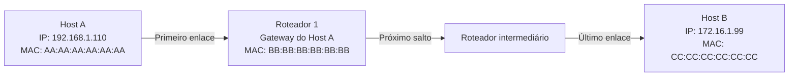
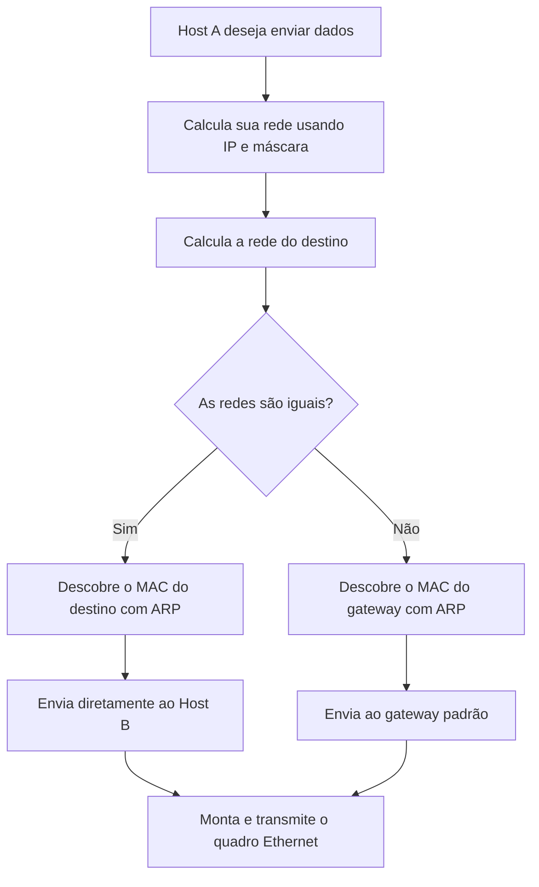
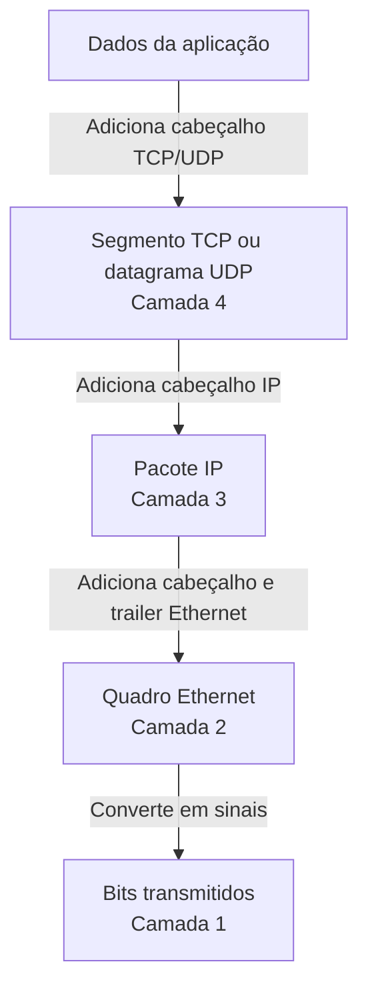
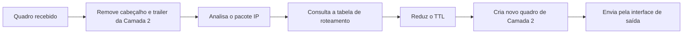
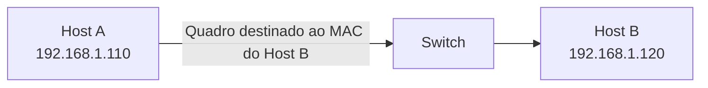

# Encapsulamento e endereçamento nas camadas 2 e 3

> [!info] Conceito
> Durante uma comunicação entre computadores de redes diferentes, o **endereço IP identifica a origem e o destino final**, enquanto o **endereço MAC identifica os dispositivos envolvidos em cada enlace local**.
>
> Em outras palavras:
>
> - o **IP** é usado na comunicação de ponta a ponta;
> - o **MAC** é usado na comunicação salto a salto.

---

## 1. Cenário da questão

Considere que o **Host A** precisa enviar dados para o **Host B**, localizado em outra rede.

| Dispositivo | Endereço IP | Endereço MAC |
|---|---|---|
| Host A | `192.168.1.110/24` | `AA:AA:AA:AA:AA:AA` |
| Gateway do Host A | `192.168.1.1/24` | `BB:BB:BB:BB:BB:BB` |
| Host B | `172.16.1.99/24` | `CC:CC:CC:CC:CC:CC` |

Entre os dois computadores existem roteadores responsáveis por encaminhar os pacotes entre as diferentes redes.



> [!note] Representação da nuvem
> Em diagramas de redes, uma **nuvem** pode representar a Internet, uma rede desconhecida ou um conjunto de roteadores intermediários.
>
> A nuvem não é necessariamente um único equipamento. Ela oculta os detalhes da infraestrutura existente entre a origem e o destino.

---

## 2. O que a questão deseja avaliar?

A questão procura verificar se o estudante consegue diferenciar:

1. o endereçamento da **Camada 3 — Rede**;
2. o endereçamento da **Camada 2 — Enlace**;
3. a comunicação de ponta a ponta;
4. a comunicação entre dispositivos diretamente conectados;
5. o processo de encapsulamento e reencapsulamento realizado pelos roteadores.

A pergunta geralmente apresenta a seguinte estrutura:

> Quando o computador de origem envia um pacote para um computador localizado em uma rede distante, quais endereços de origem e destino estarão no cabeçalho IP e no quadro Ethernet ao sair do computador de origem?

---

## 3. Camada 3: endereçamento IP

A Camada 3 do modelo OSI é responsável pelo endereçamento lógico e pelo encaminhamento dos pacotes entre redes.

No cenário apresentado, o cabeçalho IP contém:

| Campo | Endereço |
|---|---|
| IP de origem | `192.168.1.110` |
| IP de destino | `172.16.1.99` |

O IP de origem identifica o computador que iniciou a comunicação, enquanto o IP de destino identifica o computador que deverá receber os dados.

> [!tip] Regra para a prova
> Em um cenário tradicional de roteamento, sem NAT, os **endereços IP de origem e destino permanecem os mesmos durante o percurso**.
>
> Os roteadores encaminham o pacote em direção ao destino, mas não substituem os endereços IP dos computadores envolvidos.

Assim, mesmo quando o pacote estiver passando por um roteador intermediário, continuará contendo:

```text
IP de origem:  192.168.1.110
IP de destino: 172.16.1.99
```

### O cabeçalho IP permanece totalmente igual?

Não. Embora os endereços IP normalmente permaneçam os mesmos, alguns campos do cabeçalho são modificados durante o encaminhamento.

O principal exemplo é o campo **TTL — Time to Live**.

Cada roteador reduz o TTL em uma unidade:

```text
Host A envia:       TTL = 64
Roteador 1 recebe:  TTL = 64
Roteador 1 envia:   TTL = 63
Roteador 2 envia:   TTL = 62
```

No IPv4, como o TTL faz parte do cabeçalho, o roteador também precisa recalcular o checksum do cabeçalho IP.

> [!warning] Atenção
> A frase “os IPs nunca mudam” deve ser compreendida dentro do cenário clássico da questão.
>
> Tecnologias como **NAT**, proxies, túneis e alguns mecanismos de tradução de endereços podem modificar o IP de origem ou de destino. No exercício tradicional do CCNA, considera-se que não existe NAT.

---

## 4. Camada 2: endereçamento MAC

A Camada 2 é responsável pela entrega dos quadros dentro de um enlace ou rede local.

Os endereços MAC não indicam necessariamente o destino final da comunicação. Eles indicam quem deve receber o quadro no **enlace atual**.

Ao sair do Host A, o quadro Ethernet contém:

| Campo | Endereço |
|---|---|
| MAC de origem | `AA:AA:AA:AA:AA:AA` |
| MAC de destino | `BB:BB:BB:BB:BB:BB` |

O MAC de origem pertence ao Host A.

O MAC de destino pertence à interface do gateway padrão conectada à mesma rede do Host A.

```text
MAC de origem:  AA:AA:AA:AA:AA:AA
MAC de destino: BB:BB:BB:BB:BB:BB
```

> [!important] Ponto principal
> Como o Host B está em outra rede, o Host A não envia o quadro diretamente para o MAC do Host B.
>
> O Host A envia o quadro para o **MAC do gateway padrão**, pois é o roteador que conhece o caminho para outras redes.

---

## 5. Como o Host A descobre que o destino está em outra rede?

Antes de enviar os dados, o Host A compara o seu próprio endereço de rede com o endereço de rede do destino.

O Host A possui:

```text
IP:      192.168.1.110
Máscara: 255.255.255.0
Prefixo: /24
```

Aplicando a máscara, obtém-se a rede:

```text
192.168.1.110/24 → rede 192.168.1.0
```

Para o destino:

```text
172.16.1.99/24 → rede 172.16.1.0
```

A comparação produz:

```text
Rede de origem:  192.168.1.0
Rede de destino: 172.16.1.0
```

Como as redes são diferentes, o Host A conclui que o destino não está diretamente acessível pela rede local.



> [!tip] Decisão do computador
> - Destino na mesma rede: o MAC de destino é o MAC do computador final.
> - Destino em outra rede: o MAC de destino é o MAC do gateway padrão.

---

## 6. A função do gateway padrão

O gateway padrão é o roteador utilizado pelo computador para alcançar redes que não estão diretamente conectadas à rede local.

No exemplo:

```text
Host A:  192.168.1.110
Gateway: 192.168.1.1
```

O gateway deve estar na mesma sub-rede do computador.

O Host A consegue entregar um quadro diretamente ao gateway porque ambos pertencem à rede `192.168.1.0/24`.

> [!info] Conceito
> O gateway padrão não substitui o destino final no cabeçalho IP.
>
> Ele funciona como o **próximo salto** que receberá o quadro Ethernet e encaminhará o pacote IP para outra rede.

---

## 7. Como o Host A descobre o MAC do gateway?

O computador normalmente conhece o endereço IP do gateway, mas precisa descobrir seu endereço MAC para montar o quadro Ethernet.

Para isso, utiliza o protocolo **ARP — Address Resolution Protocol**.

### Processo de resolução ARP

1. O Host A consulta sua tabela ARP.
2. Caso o endereço não esteja armazenado, envia uma solicitação ARP.
3. A solicitação é enviada em broadcast.
4. O gateway reconhece seu endereço IP.
5. O gateway responde informando seu endereço MAC.
6. O Host A armazena temporariamente essa associação na tabela ARP.

A solicitação pode ser representada como:

```text
Quem possui o IP 192.168.1.1?
Informe para 192.168.1.110.
```

O gateway responde:

```text
O IP 192.168.1.1 está associado ao MAC BB:BB:BB:BB:BB:BB.
```

Na solicitação ARP, o endereço MAC de destino do quadro é:

```text
FF:FF:FF:FF:FF:FF
```

Esse endereço representa o broadcast Ethernet.

> [!warning] Atenção
> O Host A não utiliza ARP para descobrir diretamente o MAC do Host B quando o destino está em outra rede.
>
> O ARP funciona apenas dentro do domínio de broadcast local. Por isso, o Host A resolve o MAC do gateway padrão.

---

## 8. Encapsulamento dos dados

Antes da transmissão, os dados passam por um processo chamado **encapsulamento**.

Cada camada acrescenta suas próprias informações de controle.



### Estrutura simplificada do quadro enviado pelo Host A

```text
┌───────────────────────────────────────────────────────────────┐
│ Cabeçalho Ethernet                                            │
│ MAC origem: AA:AA:AA:AA:AA:AA                                │
│ MAC destino: BB:BB:BB:BB:BB:BB                               │
├───────────────────────────────────────────────────────────────┤
│ Pacote IP                                                     │
│ IP origem: 192.168.1.110                                      │
│ IP destino: 172.16.1.99                                       │
├───────────────────────────────────────────────────────────────┤
│ Segmento TCP/UDP e dados da aplicação                         │
├───────────────────────────────────────────────────────────────┤
│ Trailer Ethernet — FCS                                        │
└───────────────────────────────────────────────────────────────┘
```

> [!info] Unidade de dados
> - Camada 4: segmento TCP ou datagrama UDP;
> - Camada 3: pacote IP;
> - Camada 2: quadro;
> - Camada 1: bits.

---

## 9. O que acontece quando o quadro chega ao roteador?

Quando o primeiro roteador recebe o quadro, ele executa as seguintes operações:

1. verifica se o MAC de destino corresponde à sua interface;
2. verifica a integridade do quadro;
3. remove o cabeçalho e o trailer da Camada 2;
4. examina o endereço IP de destino;
5. consulta sua tabela de roteamento;
6. reduz o TTL do pacote;
7. escolhe a interface de saída;
8. identifica o próximo salto;
9. cria um novo quadro de Camada 2;
10. encaminha o pacote.

> [!important] Reencapsulamento
> O roteador não encaminha o mesmo quadro Ethernet recebido.
>
> Ele remove o quadro antigo e cria um **novo quadro**, adequado ao próximo enlace.



---

## 10. Endereços utilizados em cada salto

Considere que existam dois roteadores entre os computadores.

| Enlace | IP de origem | IP de destino | MAC de origem | MAC de destino |
|---|---|---|---|---|
| Host A → Roteador 1 | `192.168.1.110` | `172.16.1.99` | MAC do Host A | MAC da interface do Roteador 1 |
| Roteador 1 → Roteador 2 | `192.168.1.110` | `172.16.1.99` | MAC de saída do Roteador 1 | MAC de entrada do Roteador 2 |
| Roteador 2 → Host B | `192.168.1.110` | `172.16.1.99` | MAC de saída do Roteador 2 | MAC do Host B |

Uma representação genérica seria:

```text
Primeiro enlace
IP:  192.168.1.110 → 172.16.1.99
MAC: AA:AA:AA:AA:AA:AA → BB:BB:BB:BB:BB:BB

Segundo enlace
IP:  192.168.1.110 → 172.16.1.99
MAC: MAC do Roteador 1 → MAC do Roteador 2

Último enlace
IP:  192.168.1.110 → 172.16.1.99
MAC: MAC do último roteador → CC:CC:CC:CC:CC:CC
```

> [!tip] Resumindo
> Os endereços IP indicam **quem iniciou** e **quem deve receber** a comunicação.
>
> Os endereços MAC indicam **quem envia** e **quem recebe o quadro no enlace atual**.

---

## 11. Por que os endereços MAC mudam?

Os endereços MAC possuem significado local. Eles são utilizados para entregar quadros dentro de um determinado enlace Ethernet.

Um roteador separa redes e domínios de broadcast. Portanto, um quadro Ethernet não atravessa o roteador sem ser substituído.

Em cada enlace, o quadro precisa apresentar:

```text
MAC de origem  = interface que está transmitindo naquele enlace
MAC de destino = interface que receberá o quadro naquele enlace
```

Por esse motivo, os endereços MAC são atualizados em cada salto.

> [!example] Analogia
> O endereço IP pode ser comparado ao endereço final escrito em uma encomenda.
>
> O endereço MAC pode ser comparado à identificação do veículo ou da transportadora responsável pelo trecho atual da entrega.
>
> O destino da encomenda permanece, mas o meio utilizado para transportá-la pode mudar em cada etapa.

---

## 12. E se os computadores estiverem na mesma rede?

Caso o Host A e o Host B pertençam à mesma sub-rede, o gateway padrão não participa da transmissão inicial.

Exemplo:

```text
Host A:
IP:  192.168.1.110/24
MAC: AA:AA:AA:AA:AA:AA

Host B:
IP:  192.168.1.120/24
MAC: CC:CC:CC:CC:CC:CC
```

Nesse caso, o quadro seria:

| Campo | Valor |
|---|---|
| IP de origem | `192.168.1.110` |
| IP de destino | `192.168.1.120` |
| MAC de origem | `AA:AA:AA:AA:AA:AA` |
| MAC de destino | `CC:CC:CC:CC:CC:CC` |

O Host A utilizaria ARP para descobrir diretamente o MAC do Host B.



---

## 13. Switch e roteador possuem funções diferentes

### Switch

O switch atua principalmente na Camada 2.

Ele utiliza endereços MAC para encaminhar quadros dentro da mesma rede local.

```text
Decisão do switch → baseada no MAC de destino
```

### Roteador

O roteador atua principalmente na Camada 3.

Ele utiliza endereços IP e a tabela de roteamento para encaminhar pacotes entre redes diferentes.

```text
Decisão do roteador → baseada no IP de destino
```

| Dispositivo | Camada principal | Informação usada no encaminhamento |
|---|---|---|
| Switch | Camada 2 | Endereço MAC |
| Roteador | Camada 3 | Endereço IP |
| Host | Várias camadas | IP, máscara, gateway, MAC e portas |

> [!warning] Pegadinha
> Um switch não substitui os endereços MAC de origem e destino de um quadro comum.
>
> O roteador, por outro lado, remove o quadro recebido e cria outro para o próximo enlace.

---

## 14. Gabarito da questão clássica

Ao sair do Host A em direção ao Host B, localizado em outra rede:

### Cabeçalho IP — Camada 3

```text
IP de origem:  192.168.1.110
IP de destino: 172.16.1.99
```

### Cabeçalho Ethernet — Camada 2

```text
MAC de origem:  AA:AA:AA:AA:AA:AA
MAC de destino: BB:BB:BB:BB:BB:BB
```

O MAC de destino é o MAC da interface do gateway padrão que está conectada à rede do Host A.

> [!success] Resposta
> O pacote IP aponta para o computador de destino final, enquanto o quadro Ethernet aponta para o próximo dispositivo que deverá receber o pacote naquele enlace.
>
> Portanto:
>
> - **IP de origem:** Host A;
> - **IP de destino:** Host B;
> - **MAC de origem:** Host A;
> - **MAC de destino:** gateway padrão do Host A.

---

## 15. Pegadinhas comuns em provas

### Confundir IP de destino com IP do gateway

O IP de destino continua sendo o IP do Host B.

O gateway aparece como destino apenas na Camada 2, por meio do endereço MAC de sua interface.

```text
Incorreto:
IP de destino = IP do gateway

Correto:
IP de destino = IP do Host B
MAC de destino = MAC do gateway
```

### Utilizar o MAC do Host B no primeiro quadro

O Host A não consegue encaminhar diretamente um quadro Ethernet para um computador localizado em outra rede.

O primeiro quadro deve ser entregue ao gateway.

### Afirmar que o switch altera os endereços MAC

O switch lê o MAC de destino e encaminha o quadro, mas normalmente não substitui os endereços MAC do quadro.

### Afirmar que o roteador mantém o mesmo quadro

O roteador descarta o encapsulamento de Camada 2 recebido e cria um novo encapsulamento para a interface de saída.

### Confundir pacote com quadro

O pacote IP é encapsulado dentro do quadro Ethernet.

```text
Quadro Ethernet
└── Pacote IP
    └── Segmento TCP/UDP
        └── Dados
```

---

## 16. Observação sobre endereços iniciados por 127

A faixa `127.0.0.0/8` é reservada para **loopback**.

O endereço mais conhecido é:

```text
127.0.0.1
```

Ele representa o próprio computador e é utilizado para testar a pilha de protocolos local.

> [!warning] Atenção
> Um endereço iniciado por `127` não deve ser utilizado como endereço de um computador remoto em um cenário normal de roteamento.
>
> Se a questão original apresentava um destino em outra rede, é provável que o endereço fosse `172.x.x.x`, e não `127.x.x.x`.

---

## 17. Limitações da regra dos endereços MAC

A explicação sobre mudança de endereços MAC pressupõe que os enlaces utilizem Ethernet.

Nem todas as tecnologias de Camada 2 utilizam endereços MAC Ethernet. Um enlace entre roteadores pode utilizar, por exemplo, outra forma de encapsulamento.

Para as questões introdutórias do CCNA e para redes locais Ethernet, aplica-se a seguinte regra:

```text
Em cada novo enlace Ethernet, um novo quadro é criado com novos endereços MAC.
```

---

## 18. Quadro-resumo

| Característica | Endereço IP | Endereço MAC |
|---|---|---|
| Camada OSI | Camada 3 | Camada 2 |
| Tipo de endereço | Lógico | Físico ou de enlace |
| Alcance | Entre redes | Enlace local |
| Identifica | Origem e destino finais | Remetente e próximo receptor do quadro |
| Modificado por roteadores | Normalmente não, sem NAT | Sim, em cada enlace Ethernet |
| Usado pelo switch | Não como decisão principal | Sim |
| Usado pelo roteador | Sim | Sim, para transmitir no enlace local |
| Protocolo de resolução | DNS pode resolver nomes para IP | ARP resolve IPv4 para MAC na rede local |

---

## 19. Regra de memorização

> [!tip] Fórmula mental
> **IP = destino final**
>
> **MAC = próximo salto**

Uma forma mais completa de memorizar é:

```text
IP responde:
“De qual computador para qual computador?”

MAC responde:
“De qual interface para qual interface neste enlace?”
```

---

## 20. Exercício de fixação

> [!question] Exercício
> Um computador possui:
>
> - IP: `10.0.0.50/24`;
> - MAC: `11:11:11:11:11:11`;
> - gateway: `10.0.0.1`;
> - MAC do gateway: `22:22:22:22:22:22`.
>
> Ele precisa enviar dados para o servidor:
>
> - IP: `192.168.20.10/24`;
> - MAC: `33:33:33:33:33:33`.
>
> Quais endereços estarão no pacote IP e no quadro Ethernet ao sair do computador?

> [!success]- Gabarito
> **Cabeçalho IP:**
>
> ```text
> IP de origem:  10.0.0.50
> IP de destino: 192.168.20.10
> ```
>
> **Cabeçalho Ethernet:**
>
> ```text
> MAC de origem:  11:11:11:11:11:11
> MAC de destino: 22:22:22:22:22:22
> ```
>
> O servidor está em uma rede diferente. Por isso, o quadro é enviado ao gateway, mas o pacote continua endereçado ao servidor final.

---

## 21. Conclusão

Na comunicação entre redes diferentes, o computador de origem mantém no pacote IP os endereços dos hosts envolvidos na comunicação. Entretanto, como o destino não está diretamente conectado à rede local, o quadro Ethernet é entregue inicialmente ao gateway padrão.

Cada roteador recebe o quadro, remove o encapsulamento da Camada 2, analisa o IP de destino e cria um novo quadro para o próximo enlace. Assim, os endereços MAC mudam durante o percurso, enquanto os endereços IP de origem e destino normalmente permanecem os mesmos em um cenário sem NAT.

> [!tip] Resumindo
> - O Host A verifica se o destino está na mesma rede.
> - Como o Host B está em outra rede, o Host A utiliza o gateway.
> - O ARP descobre o MAC do gateway.
> - O pacote contém o IP do Host A e o IP do Host B.
> - O primeiro quadro contém o MAC do Host A e o MAC do gateway.
> - Cada roteador cria um novo quadro para o próximo enlace.
> - No último enlace, o MAC de destino finalmente será o MAC do Host B.
