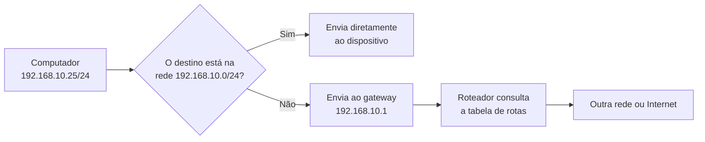
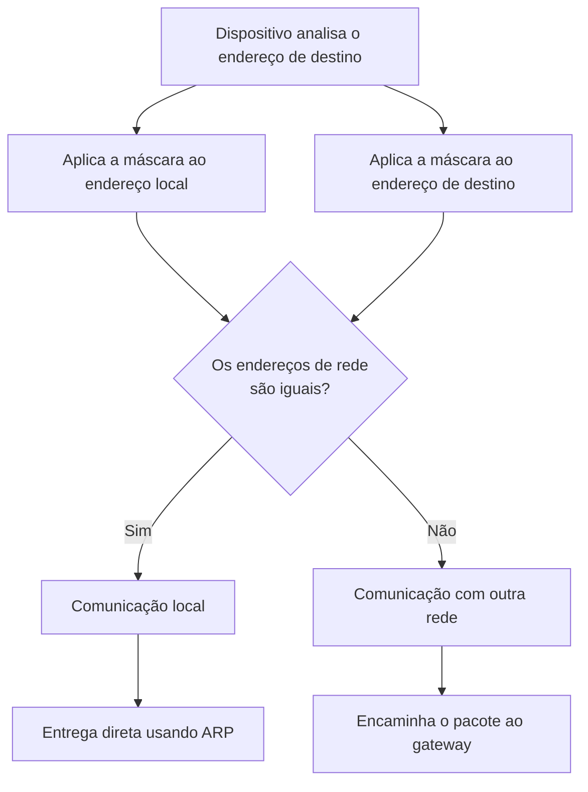
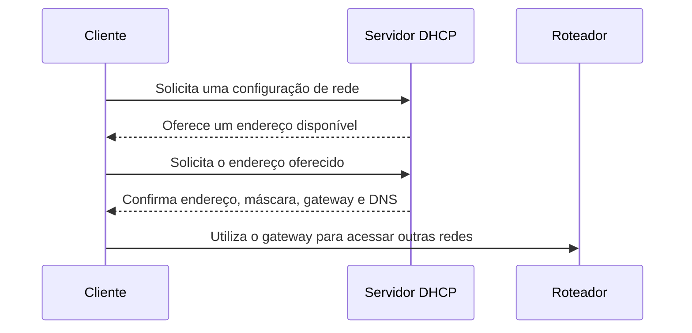
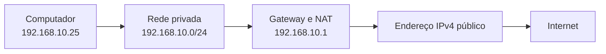
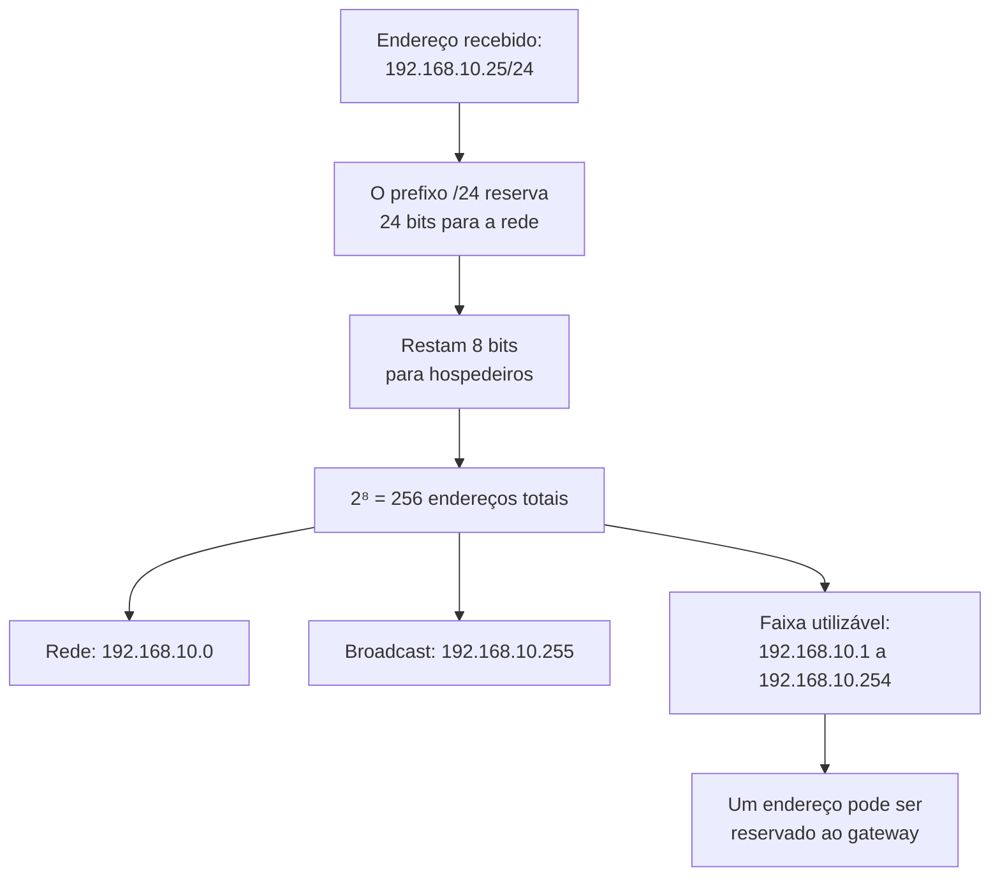

### 10.4 Alocação de endereços IPv4 em uma rede

> [!info] Conceito
> Um endereço IPv4 possui **32 bits**, divididos em duas partes: uma identifica a **rede** e a outra identifica o **hospedeiro** dentro dessa rede. O número escrito depois da barra, como `/8`, `/16` ou `/24`, informa quantos bits pertencem ao prefixo de rede.

Um endereço IPv4 é normalmente escrito como quatro números decimais separados por pontos:

```text
192.168.10.25
```

Cada número representa um grupo de **8 bits**, chamado de **octeto**. Como existem quatro octetos, o endereço possui:

```text
4 octetos × 8 bits = 32 bits
```

Quando o endereço é escrito como `192.168.10.25/24`, temos duas informações:

- `192.168.10.25`: endereço da interface do dispositivo;
- `/24`: quantidade de bits reservados para identificar a rede.

---

#### 10.4.1 Estrutura de um endereço IPv4

O prefixo separa os bits da rede dos bits usados para identificar os hospedeiros.

No endereço `192.168.10.25/24`, os primeiros 24 bits identificam a rede e os 8 bits restantes identificam o dispositivo.

<div
  class="svg-diagram"
  style="
    width: 100%;
    max-width: 900px;
    margin: 1.5rem auto;
    overflow-x: auto;
    overflow-y: hidden;
    -webkit-overflow-scrolling: touch;
  "
>
  <svg
    width="900"
    height="310"
    viewBox="0 0 900 310"
    xmlns="http://www.w3.org/2000/svg"
    font-family="Arial, sans-serif"
    preserveAspectRatio="xMidYMid meet"
    class="network-diagram"
    role="img"
    aria-label="Estrutura do endereço IPv4 192.168.10.25 com prefixo 24"
    style="
      display: block;
      width: 100%;
      min-width: 700px;
      height: auto;
      aspect-ratio: 900 / 310;
      margin: 0 auto;
    "
  >
    <rect width="900" height="310" fill="transparent"/>
    <!-- ===== Título ===== -->
    <text
      x="450"
      y="28"
      text-anchor="middle"
      font-size="18"
      fill="#D6F0FB"
      font-weight="600"
    >
      Estrutura do endereço 192.168.10.25/24
    </text>
    <!-- ===== Rótulos superiores ===== -->
    <text
      x="345"
      y="66"
      text-anchor="middle"
      font-size="15"
      fill="#D6F0FB"
      font-weight="600"
    >
      24 bits do prefixo de rede
    </text>
    <text
      x="748"
      y="66"
      text-anchor="middle"
      font-size="15"
      fill="#D6F0FB"
      font-weight="600"
    >
      8 bits do hospedeiro
    </text>
    <!-- ===== Octetos ===== -->
    <rect
      x="70"
      y="85"
      width="190"
      height="70"
      rx="6"
      fill="#1A4A5E"
      fill-opacity="0.6"
      stroke="#7FCFF0"
      stroke-width="1.5"
    />
    <rect
      x="260"
      y="85"
      width="190"
      height="70"
      rx="6"
      fill="#1A4A5E"
      fill-opacity="0.6"
      stroke="#7FCFF0"
      stroke-width="1.5"
    />
    <rect
      x="450"
      y="85"
      width="190"
      height="70"
      rx="6"
      fill="#1A4A5E"
      fill-opacity="0.6"
      stroke="#7FCFF0"
      stroke-width="1.5"
    />
    <rect
      x="640"
      y="85"
      width="190"
      height="70"
      rx="6"
      fill="#3C3489"
      fill-opacity="0.3"
      stroke="#A89CF5"
      stroke-width="1.5"
    />
    <!-- ===== Valores decimais ===== -->
    <text
      x="165"
      y="116"
      text-anchor="middle"
      font-size="20"
      fill="#eeeeee"
      font-weight="600"
    >
      192
    </text>
    <text
      x="355"
      y="116"
      text-anchor="middle"
      font-size="20"
      fill="#eeeeee"
      font-weight="600"
    >
      168
    </text>
    <text
      x="545"
      y="116"
      text-anchor="middle"
      font-size="20"
      fill="#eeeeee"
      font-weight="600"
    >
      10
    </text>
    <text
      x="735"
      y="116"
      text-anchor="middle"
      font-size="20"
      fill="#D6F0FB"
      font-weight="600"
    >
      25
    </text>
    <!-- ===== Valores binários ===== -->
    <text
      x="165"
      y="142"
      text-anchor="middle"
      font-size="13"
      fill="#dddddd"
    >
      11000000
    </text>
    <text
      x="355"
      y="142"
      text-anchor="middle"
      font-size="13"
      fill="#dddddd"
    >
      10101000
    </text>
    <text
      x="545"
      y="142"
      text-anchor="middle"
      font-size="13"
      fill="#dddddd"
    >
      00001010
    </text>
    <text
      x="735"
      y="142"
      text-anchor="middle"
      font-size="13"
      fill="#dddddd"
    >
      00011001
    </text>
    <!-- ===== Máscara ===== -->
    <text
      x="70"
      y="202"
      font-size="15"
      fill="#D6F0FB"
      font-weight="600"
    >
      Máscara:
    </text>
    <rect
      x="160"
      y="178"
      width="670"
      height="44"
      rx="5"
      fill="#1A4A5E"
      fill-opacity="0.10"
      stroke="#888888"
      stroke-width="1"
    />
    <text
      x="495"
      y="206"
      text-anchor="middle"
      font-size="17"
      fill="#eeeeee"
    >
      255.255.255.0
    </text>
    <!-- ===== Representação binária da máscara ===== -->
    <text
      x="70"
      y="256"
      font-size="15"
      fill="#D6F0FB"
      font-weight="600"
    >
      Binário:
    </text>
    <text
      x="495"
      y="256"
      text-anchor="middle"
      font-size="15"
      fill="#dddddd"
    >
      11111111 . 11111111 . 11111111 . 00000000
    </text>
    <text
      x="495"
      y="285"
      text-anchor="middle"
      font-size="14"
      fill="#dddddd"
    >
      Os bits 1 pertencem à rede; os bits 0 ficam disponíveis para os hospedeiros.
    </text>
  </svg>
</div>

Na máscara de rede:

- o bit `1` indica a parte que identifica a rede;
- o bit `0` indica a parte destinada aos hospedeiros.

A máscara `/24` possui 24 bits iguais a `1` e 8 bits iguais a `0`:

```text
11111111.11111111.11111111.00000000
```

Convertendo cada octeto binário para decimal:

```text
255.255.255.0
```

---

#### 10.4.2 Prefixo CIDR e máscara de rede

A notação com barra é chamada de **notação CIDR**, do inglês *Classless Inter-Domain Routing*.

O número depois da barra representa diretamente a quantidade de bits usada para identificar a rede.

| Prefixo | Máscara decimal | Bits da rede | Bits dos hospedeiros |
|---:|---|---:|---:|
| `/8` | `255.0.0.0` | 8 | 24 |
| `/16` | `255.255.0.0` | 16 | 16 |
| `/24` | `255.255.255.0` | 24 | 8 |
| `/25` | `255.255.255.128` | 25 | 7 |
| `/26` | `255.255.255.192` | 26 | 6 |
| `/27` | `255.255.255.224` | 27 | 5 |
| `/28` | `255.255.255.240` | 28 | 4 |
| `/29` | `255.255.255.248` | 29 | 3 |
| `/30` | `255.255.255.252` | 30 | 2 |

> [!tip] Regra prática
> Quanto **maior** for o número depois da barra, mais bits serão utilizados para identificar a rede e menos endereços ficarão disponíveis para os hospedeiros.

Por exemplo:

```text
/8  → rede muito grande
/16 → rede de tamanho intermediário
/24 → rede menor
/30 → rede com somente quatro endereços
```

---

#### 10.4.3 Quantidade total de endereços

Como o IPv4 possui 32 bits, a quantidade de bits disponíveis para os hospedeiros é calculada por:

```text
Bits dos hospedeiros = 32 − prefixo
```

A quantidade total de endereços da sub-rede é:

```text
Quantidade total = 2^(32 − prefixo)
```

Em uma sub-rede IPv4 convencional, dois desses endereços possuem funções especiais:

1. o primeiro endereço identifica a própria rede;
2. o último endereço é reservado para broadcast.

Assim, a quantidade normalmente disponível para interfaces de dispositivos é:

```text
Endereços utilizáveis = 2^(32 − prefixo) − 2
```

| Prefixo | Bits dos hospedeiros | Total de endereços | Endereços utilizáveis |
|---:|---:|---:|---:|
| `/8` | 24 | 16.777.216 | 16.777.214 |
| `/16` | 16 | 65.536 | 65.534 |
| `/24` | 8 | 256 | 254 |
| `/25` | 7 | 128 | 126 |
| `/26` | 6 | 64 | 62 |
| `/27` | 5 | 32 | 30 |
| `/28` | 4 | 16 | 14 |
| `/29` | 3 | 8 | 6 |
| `/30` | 2 | 4 | 2 |

> [!example] Exemplo com `/24`
> Em uma rede `/24`, restam 8 bits para os hospedeiros:
>
> ```text
> 2⁸ = 256 endereços totais
> ```
>
> Descontando o endereço da rede e o broadcast:
>
> ```text
> 256 − 2 = 254 endereços utilizáveis
> ```

> [!warning] Exceções
> A regra de subtrair dois endereços aplica-se às sub-redes IPv4 convencionais. Um prefixo `/31` pode ser utilizado em enlaces ponto a ponto, enquanto um prefixo `/32` representa um único endereço ou rota de hospedeiro.

---

#### 10.4.4 Endereço da rede

O **endereço da rede** identifica todo o bloco de endereços da sub-rede.

Ele corresponde ao primeiro endereço do bloco e possui todos os bits da parte de hospedeiro iguais a zero.

Na sub-rede:

```text
192.168.10.0/24
```

o endereço da rede é:

```text
192.168.10.0
```

Esse endereço representa toda a rede e não deve ser atribuído a um computador, celular, servidor ou outro dispositivo.

---

#### 10.4.5 Endereço de broadcast

O **broadcast** é o último endereço do bloco. Nele, todos os bits da parte destinada aos hospedeiros possuem o valor `1`.

Na rede `192.168.10.0/24`, o broadcast é:

```text
192.168.10.255
```

Um pacote enviado para esse endereço é direcionado a todos os dispositivos da mesma sub-rede que aceitam esse tipo de comunicação.

O endereço de broadcast também não pode ser atribuído a uma interface comum.

---

#### 10.4.6 Faixa utilizável de uma sub-rede

A faixa utilizável corresponde aos endereços existentes entre o endereço da rede e o endereço de broadcast.

Para a rede `192.168.10.0/24`:

| Elemento | Endereço |
|---|---|
| Endereço da rede | `192.168.10.0` |
| Primeiro endereço utilizável | `192.168.10.1` |
| Último endereço utilizável | `192.168.10.254` |
| Endereço de broadcast | `192.168.10.255` |

<div
  class="svg-diagram"
  style="
    width: 100%;
    max-width: 960px;
    margin: 1.5rem auto;
    overflow-x: auto;
    overflow-y: hidden;
    -webkit-overflow-scrolling: touch;
  "
>
  <svg
    width="960"
    height="390"
    viewBox="0 0 960 390"
    xmlns="http://www.w3.org/2000/svg"
    font-family="Arial, sans-serif"
    preserveAspectRatio="xMidYMid meet"
    class="network-diagram"
    role="img"
    aria-label="Distribuição dos endereços da rede 192.168.10.0 barra 24"
    style="
      display: block;
      width: 100%;
      min-width: 720px;
      height: auto;
      aspect-ratio: 960 / 390;
      margin: 0 auto;
    "
  >
    <rect width="960" height="390" fill="transparent"/>
    <!-- ===== Título ===== -->
    <text
      x="480"
      y="30"
      text-anchor="middle"
      font-size="18"
      fill="#D6F0FB"
      font-weight="600"
    >
      Distribuição de endereços na rede 192.168.10.0/24
    </text>
    <!-- ===== Área agrupada ===== -->
    <rect
      x="35"
      y="55"
      width="890"
      height="210"
      rx="10"
      fill="#1A4A5E"
      fill-opacity="0.10"
      stroke="#888888"
      stroke-width="1"
    />
    <!-- ===== Endereço da rede ===== -->
    <rect
      x="60"
      y="95"
      width="190"
      height="110"
      rx="7"
      fill="#1A4A5E"
      fill-opacity="0.6"
      stroke="#7FCFF0"
      stroke-width="1.5"
    />
    <text
      x="155"
      y="126"
      text-anchor="middle"
      font-size="15"
      fill="#D6F0FB"
      font-weight="600"
    >
      Endereço da rede
    </text>
    <text
      x="155"
      y="158"
      text-anchor="middle"
      font-size="18"
      fill="#eeeeee"
    >
      192.168.10.0
    </text>
    <text
      x="155"
      y="184"
      text-anchor="middle"
      font-size="13"
      fill="#dddddd"
    >
      Não atribuível
    </text>
    <!-- ===== Faixa utilizável ===== -->
    <rect
      x="275"
      y="75"
      width="410"
      height="150"
      rx="7"
      fill="#3C3489"
      fill-opacity="0.3"
      stroke="#A89CF5"
      stroke-width="1.5"
    />
    <text
      x="480"
      y="108"
      text-anchor="middle"
      font-size="16"
      fill="#D6F0FB"
      font-weight="600"
    >
      Faixa de endereços utilizáveis
    </text>
    <text
      x="480"
      y="145"
      text-anchor="middle"
      font-size="20"
      fill="#eeeeee"
    >
      192.168.10.1 — 192.168.10.254
    </text>
    <text
      x="480"
      y="178"
      text-anchor="middle"
      font-size="14"
      fill="#dddddd"
    >
      254 endereços disponíveis para interfaces
    </text>
    <text
      x="480"
      y="205"
      text-anchor="middle"
      font-size="13"
      fill="#dddddd"
    >
      Inclui gateway, servidores, computadores, impressoras e outros dispositivos
    </text>
    <!-- ===== Broadcast ===== -->
    <rect
      x="710"
      y="95"
      width="190"
      height="110"
      rx="7"
      fill="#1A4A5E"
      fill-opacity="0.6"
      stroke="#7FCFF0"
      stroke-width="1.5"
    />
    <text
      x="805"
      y="126"
      text-anchor="middle"
      font-size="15"
      fill="#D6F0FB"
      font-weight="600"
    >
      Broadcast
    </text>
    <text
      x="805"
      y="158"
      text-anchor="middle"
      font-size="18"
      fill="#eeeeee"
    >
      192.168.10.255
    </text>
    <text
      x="805"
      y="184"
      text-anchor="middle"
      font-size="13"
      fill="#dddddd"
    >
      Não atribuível
    </text>
    <!-- ===== Linha de endereços ===== -->
    <line
      x1="155"
      y1="292"
      x2="805"
      y2="292"
      stroke="#aaaaaa"
      stroke-width="2"
    />
    <circle cx="155" cy="292" r="7" fill="#29B6E6"/>
    <circle cx="275" cy="292" r="7" fill="#29B6E6"/>
    <circle cx="685" cy="292" r="7" fill="#29B6E6"/>
    <circle cx="805" cy="292" r="7" fill="#29B6E6"/>
    <text
      x="155"
      y="324"
      text-anchor="middle"
      font-size="13"
      fill="#dddddd"
    >
      .0
    </text>
    <text
      x="275"
      y="324"
      text-anchor="middle"
      font-size="13"
      fill="#dddddd"
    >
      .1
    </text>
    <text
      x="685"
      y="324"
      text-anchor="middle"
      font-size="13"
      fill="#dddddd"
    >
      .254
    </text>
    <text
      x="805"
      y="324"
      text-anchor="middle"
      font-size="13"
      fill="#dddddd"
    >
      .255
    </text>
    <text
      x="155"
      y="351"
      text-anchor="middle"
      font-size="12"
      fill="#dddddd"
    >
      Rede
    </text>
    <text
      x="480"
      y="351"
      text-anchor="middle"
      font-size="12"
      fill="#dddddd"
    >
      Hospedeiros
    </text>
    <text
      x="805"
      y="351"
      text-anchor="middle"
      font-size="12"
      fill="#dddddd"
    >
      Broadcast
    </text>
  </svg>
</div>

> [!important] Importante
> O endereço da rede e o endereço de broadcast fazem parte da quantidade total de endereços, mas não podem ser utilizados como endereços comuns de dispositivos.

---

#### 10.4.7 Gateway padrão

O **gateway padrão** é o endereço da interface do roteador conectada à sub-rede.

Quando um dispositivo precisa se comunicar com um endereço pertencente à sua própria rede, ele envia os dados diretamente ao dispositivo de destino. Quando o destino está em outra rede, o pacote é encaminhado ao gateway.



Uma configuração possível seria:

```text
Endereço do computador: 192.168.10.25
Máscara:                255.255.255.0
Prefixo:                /24
Gateway:                192.168.10.1
```

> [!important] Escolha do gateway
> O gateway não precisa ser obrigatoriamente o primeiro endereço utilizável. Ele pode utilizar qualquer endereço válido da sub-rede.
>
> Entretanto, por convenção administrativa, são frequentemente utilizados:
>
> - o primeiro endereço disponível, como `192.168.10.1`;
> - o último endereço disponível, como `192.168.10.254`.

Quando o gateway utiliza `192.168.10.1`, esse endereço deixa de estar disponível para outro dispositivo.

Assim, embora uma rede `/24` tenha 254 endereços tecnicamente utilizáveis, um deles normalmente será ocupado pela interface do roteador.

---

#### 10.4.8 Como o dispositivo identifica redes locais e remotas

O dispositivo utiliza seu próprio endereço e a máscara para determinar qual parte representa a rede.

Considere:

```text
Endereço do computador: 192.168.10.25
Máscara:                255.255.255.0
Rede resultante:        192.168.10.0
```

Se o destino for `192.168.10.80`, ele pertence à mesma rede `/24`.

```text
Origem:  192.168.10.25
Destino: 192.168.10.80
Rede:    192.168.10.0/24
```

A comunicação pode ocorrer diretamente dentro da rede local.

Se o destino for `192.168.20.80`, ele pertence a outra sub-rede:

```text
Origem:  192.168.10.25
Destino: 192.168.20.80
```

Nesse caso, o pacote deve ser enviado ao gateway.



---

#### 10.4.9 Planejamento da alocação de endereços

Os endereços utilizáveis podem ser organizados de acordo com a finalidade dos equipamentos.

Uma possível organização da rede `192.168.10.0/24` seria:

| Finalidade | Endereço ou faixa |
|---|---|
| Endereço da rede | `192.168.10.0` |
| Gateway | `192.168.10.1` |
| Servidores | `192.168.10.2` a `192.168.10.19` |
| Equipamentos de rede | `192.168.10.20` a `192.168.10.39` |
| Impressoras e câmeras | `192.168.10.40` a `192.168.10.69` |
| Endereços estáticos diversos | `192.168.10.70` a `192.168.10.99` |
| Faixa distribuída por DHCP | `192.168.10.100` a `192.168.10.220` |
| Endereços reservados | `192.168.10.221` a `192.168.10.254` |
| Broadcast | `192.168.10.255` |

Essa divisão é apenas um exemplo. O administrador pode definir outras faixas conforme o tamanho e as necessidades da rede.

> [!warning] Conflito de endereços
> Dois dispositivos não podem utilizar simultaneamente o mesmo endereço IPv4 dentro da mesma sub-rede. Caso isso ocorra, a comunicação de ambos pode ficar instável ou deixar de funcionar.

---

#### 10.4.10 Alocação estática e dinâmica

Os endereços IPv4 podem ser atribuídos manualmente ou distribuídos automaticamente.

##### Endereço estático

Na alocação estática, o endereço é configurado manualmente e permanece associado ao dispositivo.

Esse método é comum em:

- roteadores;
- servidores;
- impressoras;
- câmeras;
- pontos de acesso;
- switches gerenciáveis;
- equipamentos que precisam ser localizados sempre pelo mesmo endereço.

Uma configuração estática precisa informar, no mínimo:

```text
Endereço IPv4
Máscara ou prefixo
Gateway padrão
```

Normalmente também são configurados servidores DNS.

##### Endereço dinâmico

Na alocação dinâmica, um servidor **DHCP** fornece automaticamente as configurações ao dispositivo.



O DHCP pode fornecer:

- endereço IPv4;
- máscara de sub-rede;
- prefixo;
- gateway padrão;
- servidores DNS;
- tempo de validade da concessão.

> [!warning] Atenção
> A faixa utilizada pelo DHCP não deve se sobrepor aos endereços configurados manualmente, exceto quando existirem reservas corretamente cadastradas no servidor DHCP.

---

#### 10.4.11 Comparação entre redes `/8`, `/16` e `/24`

| Rede | Prefixo e máscara | Endereço da rede | Faixa utilizável | Broadcast |
|---|---|---|---|---|
| `10.0.0.0/8` | `/8` — `255.0.0.0` | `10.0.0.0` | `10.0.0.1` a `10.255.255.254` | `10.255.255.255` |
| `172.16.0.0/16` | `/16` — `255.255.0.0` | `172.16.0.0` | `172.16.0.1` a `172.16.255.254` | `172.16.255.255` |
| `172.20.0.0/16` | `/16` — `255.255.0.0` | `172.20.0.0` | `172.20.0.1` a `172.20.255.254` | `172.20.255.255` |
| `192.168.10.0/24` | `/24` — `255.255.255.0` | `192.168.10.0` | `192.168.10.1` a `192.168.10.254` | `192.168.10.255` |

<div
  class="svg-diagram"
  style="
    width: 100%;
    max-width: 920px;
    margin: 1.5rem auto;
    overflow-x: auto;
    overflow-y: hidden;
    -webkit-overflow-scrolling: touch;
  "
>
  <svg
    width="920"
    height="380"
    viewBox="0 0 920 380"
    xmlns="http://www.w3.org/2000/svg"
    font-family="Arial, sans-serif"
    preserveAspectRatio="xMidYMid meet"
    class="network-diagram"
    role="img"
    aria-label="Comparação entre prefixos IPv4 e quantidades de endereços"
    style="
      display: block;
      width: 100%;
      min-width: 680px;
      height: auto;
      aspect-ratio: 920 / 380;
      margin: 0 auto;
    "
  >
    <rect width="920" height="380" fill="transparent"/>
    <!-- ===== Título ===== -->
    <text
      x="460"
      y="30"
      text-anchor="middle"
      font-size="18"
      fill="#D6F0FB"
      font-weight="600"
    >
      Relação entre prefixo e quantidade de endereços
    </text>
    <!-- ===== Escala /8 ===== -->
    <text
      x="60"
      y="90"
      font-size="16"
      fill="#D6F0FB"
      font-weight="600"
    >
      /8
    </text>
    <rect
      x="115"
      y="65"
      width="720"
      height="42"
      rx="5"
      fill="#1A4A5E"
      fill-opacity="0.6"
      stroke="#7FCFF0"
      stroke-width="1.5"
    />
    <text
      x="475"
      y="92"
      text-anchor="middle"
      font-size="14"
      fill="#eeeeee"
    >
      16.777.216 endereços totais
    </text>
    <!-- ===== Escala /16 ===== -->
    <text
      x="60"
      y="168"
      font-size="16"
      fill="#D6F0FB"
      font-weight="600"
    >
      /16
    </text>
    <rect
      x="115"
      y="143"
      width="430"
      height="42"
      rx="5"
      fill="#1A4A5E"
      fill-opacity="0.3"
      stroke="#7FCFF0"
      stroke-width="1.5"
    />
    <text
      x="330"
      y="170"
      text-anchor="middle"
      font-size="14"
      fill="#eeeeee"
    >
      65.536 endereços totais
    </text>
    <!-- ===== Escala /24 ===== -->
    <text
      x="60"
      y="246"
      font-size="16"
      fill="#D6F0FB"
      font-weight="600"
    >
      /24
    </text>
    <rect
      x="115"
      y="221"
      width="235"
      height="42"
      rx="5"
      fill="#3C3489"
      fill-opacity="0.3"
      stroke="#A89CF5"
      stroke-width="1.5"
    />
    <text
      x="232"
      y="248"
      text-anchor="middle"
      font-size="14"
      fill="#eeeeee"
    >
      256 endereços
    </text>
    <!-- ===== Escala /30 ===== -->
    <text
      x="60"
      y="324"
      font-size="16"
      fill="#D6F0FB"
      font-weight="600"
    >
      /30
    </text>
    <rect
      x="115"
      y="299"
      width="105"
      height="42"
      rx="5"
      fill="#3C3489"
      fill-opacity="0.3"
      stroke="#A89CF5"
      stroke-width="1.5"
    />
    <text
      x="167"
      y="326"
      text-anchor="middle"
      font-size="14"
      fill="#eeeeee"
    >
      4 IPs
    </text>
    <!-- ===== Explicação lateral ===== -->
    <rect
      x="610"
      y="135"
      width="250"
      height="175"
      rx="8"
      fill="#1A4A5E"
      fill-opacity="0.10"
      stroke="#888888"
      stroke-width="1"
    />
    <text
      x="735"
      y="170"
      text-anchor="middle"
      font-size="15"
      fill="#D6F0FB"
      font-weight="600"
    >
      Regra geral
    </text>
    <text
      x="735"
      y="207"
      text-anchor="middle"
      font-size="14"
      fill="#dddddd"
    >
      Prefixo maior
    </text>
    <text
      x="735"
      y="236"
      text-anchor="middle"
      font-size="20"
      fill="#29B6E6"
      font-weight="600"
    >
      ↓
    </text>
    <text
      x="735"
      y="270"
      text-anchor="middle"
      font-size="14"
      fill="#dddddd"
    >
      Menos endereços disponíveis
    </text>
  </svg>
</div>

---

#### 10.4.12 Endereços privados e acesso à Internet

Os exemplos apresentados pertencem a faixas privadas do IPv4.

| Faixa privada | Prefixo principal |
|---|---|
| `10.0.0.0` a `10.255.255.255` | `10.0.0.0/8` |
| `172.16.0.0` a `172.31.255.255` | `172.16.0.0/12` |
| `192.168.0.0` a `192.168.255.255` | `192.168.0.0/16` |

Esses endereços podem ser reutilizados em diferentes redes internas, pois não são encaminhados diretamente pela Internet pública.

Para acessar a Internet, normalmente o roteador realiza a tradução dos endereços privados por meio de **NAT**.



O NAT substitui temporariamente o endereço privado de origem pelo endereço público utilizado pelo roteador na conexão com a Internet.

---

#### 10.4.13 Exemplo completo de configuração

Considere a seguinte rede:

```text
192.168.10.0/24
```

Uma configuração válida para um computador poderia ser:

| Parâmetro | Valor |
|---|---|
| Endereço IPv4 | `192.168.10.25` |
| Prefixo | `/24` |
| Máscara | `255.255.255.0` |
| Endereço da rede | `192.168.10.0` |
| Gateway padrão | `192.168.10.1` |
| Broadcast | `192.168.10.255` |
| Primeiro endereço utilizável | `192.168.10.1` |
| Último endereço utilizável | `192.168.10.254` |
| Total de endereços | 256 |
| Endereços utilizáveis | 254 |

A sequência de interpretação é:



> [!tip] Resumindo
> - Um endereço IPv4 possui 32 bits.
> - O número depois da barra informa quantos bits identificam a rede.
> - Os bits restantes são usados para identificar os hospedeiros.
> - O primeiro endereço do bloco identifica a rede.
> - O último endereço do bloco é o broadcast.
> - O gateway é uma interface do roteador dentro da mesma sub-rede.
> - O gateway pode usar qualquer endereço válido, embora `.1` e `.254` sejam escolhas comuns.
> - Endereços podem ser configurados manualmente ou distribuídos por DHCP.
> - Quanto maior o prefixo, menor é a quantidade de endereços disponíveis.
> - Redes privadas normalmente utilizam NAT para acessar a Internet.
