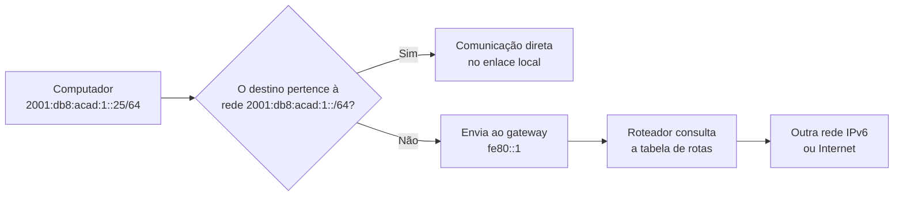
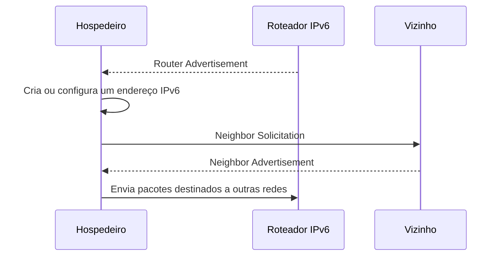
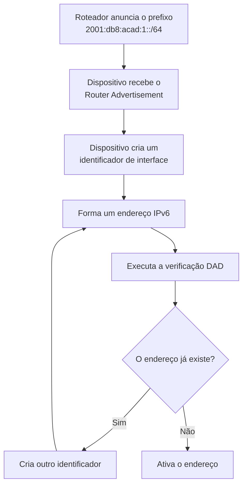
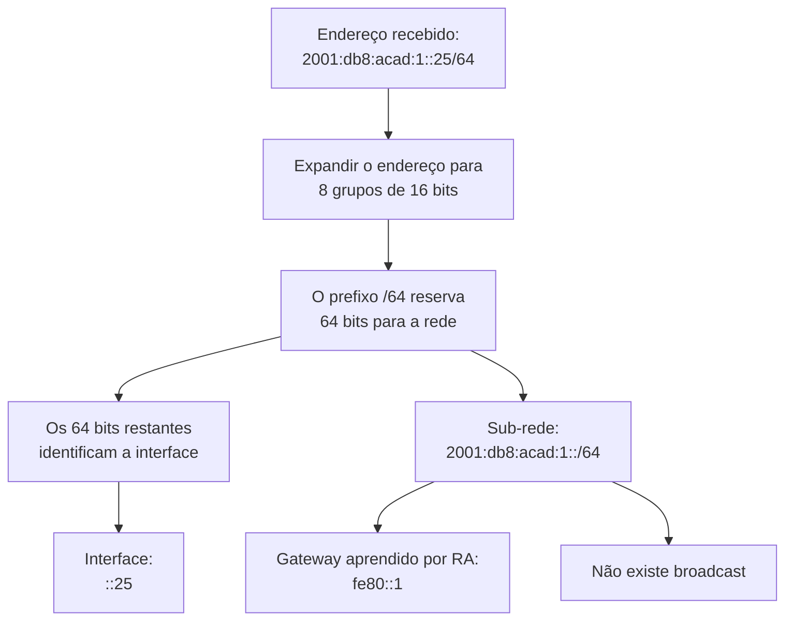

## 11. IPv6

> [!info] Conceito
> O IPv6 é a versão mais recente do Protocolo de Internet. Ele utiliza endereços de **128 bits**, representados em hexadecimal e divididos em oito grupos. Sua criação amplia significativamente o espaço de endereçamento disponível e introduz mudanças importantes na configuração e na comunicação das redes.

Um endereço IPv6 completo possui oito grupos separados por dois-pontos:

```text
2001:0DB8:0000:0000:0000:0000:0000:0001
```

Cada grupo contém quatro algarismos hexadecimais e representa **16 bits**.

Como existem oito grupos:

```text
8 grupos × 16 bits = 128 bits
```

Cada algarismo hexadecimal pode assumir um dos seguintes valores:

```text
0, 1, 2, 3, 4, 5, 6, 7, 8, 9, A, B, C, D, E ou F
```

Um algarismo hexadecimal representa quatro bits:

```text
1 algarismo hexadecimal = 4 bits
4 algarismos hexadecimais = 16 bits
```

---

### 11.1 Estrutura de um endereço IPv6

Um endereço IPv6 é dividido em oito grupos de 16 bits. Esses grupos também podem ser chamados de **hextetos**.

Considere o endereço:

```text
2001:0DB8:ACAD:0001:0000:0000:0000:0025
```

<div
  class="svg-diagram"
  style="
    width: 100%;
    max-width: 980px;
    margin: 1.5rem auto;
    overflow-x: auto;
    overflow-y: hidden;
    -webkit-overflow-scrolling: touch;
  "
>
  <svg
    width="980"
    height="350"
    viewBox="0 0 980 350"
    xmlns="http://www.w3.org/2000/svg"
    font-family="Arial, sans-serif"
    preserveAspectRatio="xMidYMid meet"
    class="network-diagram"
    role="img"
    aria-label="Estrutura de um endereço IPv6 com oito grupos de dezesseis bits"
    style="
      display: block;
      width: 100%;
      min-width: 760px;
      height: auto;
      aspect-ratio: 980 / 350;
      margin: 0 auto;
    "
  >
    <rect width="980" height="350" fill="transparent"/>
    <!-- ===== Título ===== -->
    <text
      x="490"
      y="30"
      text-anchor="middle"
      font-size="18"
      fill="#D6F0FB"
      font-weight="600"
    >
      Estrutura de um endereço IPv6
    </text>
    <!-- ===== Rótulo geral ===== -->
    <rect
      x="45"
      y="52"
      width="890"
      height="44"
      rx="6"
      fill="#1A4A5E"
      fill-opacity="0.10"
      stroke="#888888"
      stroke-width="1"
    />
    <text
      x="490"
      y="80"
      text-anchor="middle"
      font-size="15"
      fill="#dddddd"
    >
      128 bits divididos em 8 grupos de 16 bits
    </text>
    <!-- ===== Grupos principais ===== -->
    <rect
      x="45"
      y="122"
      width="110"
      height="82"
      rx="6"
      fill="#1A4A5E"
      fill-opacity="0.6"
      stroke="#7FCFF0"
      stroke-width="1.5"
    />
    <rect
      x="155"
      y="122"
      width="110"
      height="82"
      rx="6"
      fill="#1A4A5E"
      fill-opacity="0.6"
      stroke="#7FCFF0"
      stroke-width="1.5"
    />
    <rect
      x="265"
      y="122"
      width="110"
      height="82"
      rx="6"
      fill="#1A4A5E"
      fill-opacity="0.6"
      stroke="#7FCFF0"
      stroke-width="1.5"
    />
    <rect
      x="375"
      y="122"
      width="110"
      height="82"
      rx="6"
      fill="#1A4A5E"
      fill-opacity="0.6"
      stroke="#7FCFF0"
      stroke-width="1.5"
    />
    <rect
      x="495"
      y="122"
      width="110"
      height="82"
      rx="6"
      fill="#3C3489"
      fill-opacity="0.3"
      stroke="#A89CF5"
      stroke-width="1.5"
    />
    <rect
      x="605"
      y="122"
      width="110"
      height="82"
      rx="6"
      fill="#3C3489"
      fill-opacity="0.3"
      stroke="#A89CF5"
      stroke-width="1.5"
    />
    <rect
      x="715"
      y="122"
      width="110"
      height="82"
      rx="6"
      fill="#3C3489"
      fill-opacity="0.3"
      stroke="#A89CF5"
      stroke-width="1.5"
    />
    <rect
      x="825"
      y="122"
      width="110"
      height="82"
      rx="6"
      fill="#3C3489"
      fill-opacity="0.3"
      stroke="#A89CF5"
      stroke-width="1.5"
    />
    <!-- ===== Valores ===== -->
    <text x="100" y="158" text-anchor="middle" font-size="17" fill="#eeeeee" font-weight="600">2001</text>
    <text x="210" y="158" text-anchor="middle" font-size="17" fill="#eeeeee" font-weight="600">0DB8</text>
    <text x="320" y="158" text-anchor="middle" font-size="17" fill="#eeeeee" font-weight="600">ACAD</text>
    <text x="430" y="158" text-anchor="middle" font-size="17" fill="#eeeeee" font-weight="600">0001</text>
    <text x="550" y="158" text-anchor="middle" font-size="17" fill="#D6F0FB" font-weight="600">0000</text>
    <text x="660" y="158" text-anchor="middle" font-size="17" fill="#D6F0FB" font-weight="600">0000</text>
    <text x="770" y="158" text-anchor="middle" font-size="17" fill="#D6F0FB" font-weight="600">0000</text>
    <text x="880" y="158" text-anchor="middle" font-size="17" fill="#D6F0FB" font-weight="600">0025</text>
    <!-- ===== Quantidade de bits ===== -->
    <text x="100" y="187" text-anchor="middle" font-size="12" fill="#dddddd">16 bits</text>
    <text x="210" y="187" text-anchor="middle" font-size="12" fill="#dddddd">16 bits</text>
    <text x="320" y="187" text-anchor="middle" font-size="12" fill="#dddddd">16 bits</text>
    <text x="430" y="187" text-anchor="middle" font-size="12" fill="#dddddd">16 bits</text>
    <text x="550" y="187" text-anchor="middle" font-size="12" fill="#dddddd">16 bits</text>
    <text x="660" y="187" text-anchor="middle" font-size="12" fill="#dddddd">16 bits</text>
    <text x="770" y="187" text-anchor="middle" font-size="12" fill="#dddddd">16 bits</text>
    <text x="880" y="187" text-anchor="middle" font-size="12" fill="#dddddd">16 bits</text>
    <!-- ===== Separação /64 ===== -->
    <line
      x1="490"
      y1="108"
      x2="490"
      y2="225"
      stroke="#29B6E6"
      stroke-width="2"
      stroke-dasharray="6 5"
    />
    <!-- ===== Rótulos inferiores ===== -->
    <rect
      x="45"
      y="238"
      width="440"
      height="70"
      rx="7"
      fill="#1A4A5E"
      fill-opacity="0.3"
      stroke="#7FCFF0"
      stroke-width="1.5"
    />
    <rect
      x="495"
      y="238"
      width="440"
      height="70"
      rx="7"
      fill="#3C3489"
      fill-opacity="0.3"
      stroke="#A89CF5"
      stroke-width="1.5"
    />
    <text
      x="265"
      y="267"
      text-anchor="middle"
      font-size="15"
      fill="#D6F0FB"
      font-weight="600"
    >
      Prefixo da rede
    </text>
    <text
      x="265"
      y="293"
      text-anchor="middle"
      font-size="14"
      fill="#dddddd"
    >
      Primeiros 64 bits
    </text>
    <text
      x="715"
      y="267"
      text-anchor="middle"
      font-size="15"
      fill="#D6F0FB"
      font-weight="600"
    >
      Identificador da interface
    </text>
    <text
      x="715"
      y="293"
      text-anchor="middle"
      font-size="14"
      fill="#dddddd"
    >
      Últimos 64 bits
    </text>
    <!-- ===== Rodapé ===== -->
    <text
      x="490"
      y="335"
      text-anchor="middle"
      font-size="13"
      fill="#dddddd"
    >
      Exemplo de divisão do endereço quando o prefixo utilizado é /64
    </text>
  </svg>
</div>

No exemplo anterior:

```text
2001:0DB8:ACAD:0001:0000:0000:0000:0025/64
```

os primeiros quatro grupos formam o prefixo da rede:

```text
2001:0DB8:ACAD:0001::/64
```

Os quatro grupos finais identificam a interface dentro dessa sub-rede:

```text
0000:0000:0000:0025
```

> [!important] Importante
> A divisão em 64 bits para a rede e 64 bits para a interface é muito comum no IPv6. Entretanto, o tamanho exato do prefixo depende do planejamento e da forma como o bloco foi atribuído.

---

### 11.2 Representação hexadecimal

No IPv4, cada octeto é representado em decimal, como `192`, `168` ou `10`.

No IPv6, os grupos são representados em hexadecimal.

| Hexadecimal | Binário | Decimal |
|---:|---:|---:|
| `0` | `0000` | 0 |
| `1` | `0001` | 1 |
| `2` | `0010` | 2 |
| `8` | `1000` | 8 |
| `A` | `1010` | 10 |
| `B` | `1011` | 11 |
| `C` | `1100` | 12 |
| `D` | `1101` | 13 |
| `E` | `1110` | 14 |
| `F` | `1111` | 15 |

Por exemplo, o grupo hexadecimal `0DB8` representa:

```text
0    D    B    8
0000 1101 1011 1000
```

Portanto:

```text
0DB8 = 0000110110111000
```

Esse grupo possui 16 bits.

> [!tip] Resumindo
> Cada grupo IPv6 possui quatro algarismos hexadecimais. Como cada algarismo representa quatro bits, cada grupo contém 16 bits.

---

### 11.3 Abreviação de endereços IPv6

Como os endereços IPv6 são extensos, existem duas regras principais para reduzir sua representação.

#### Remoção de zeros à esquerda

Os zeros localizados à esquerda de um grupo podem ser removidos.

```text
0DB8 → DB8
0001 → 1
0025 → 25
0000 → 0
```

Assim:

```text
2001:0DB8:0000:0000:0000:0000:0000:0001
```

pode ser inicialmente reduzido para:

```text
2001:DB8:0:0:0:0:0:1
```

#### Substituição de grupos formados por zeros

Uma sequência contínua de grupos `0000` pode ser substituída por `::`.

```text
2001:DB8:0:0:0:0:0:1
```

torna-se:

```text
2001:DB8::1
```

<div
  class="svg-diagram"
  style="
    width: 100%;
    max-width: 920px;
    margin: 1.5rem auto;
    overflow-x: auto;
    overflow-y: hidden;
    -webkit-overflow-scrolling: touch;
  "
>
  <svg
    width="920"
    height="420"
    viewBox="0 0 920 420"
    xmlns="http://www.w3.org/2000/svg"
    font-family="Arial, sans-serif"
    preserveAspectRatio="xMidYMid meet"
    class="network-diagram"
    role="img"
    aria-label="Etapas de abreviação de um endereço IPv6"
    style="
      display: block;
      width: 100%;
      min-width: 700px;
      height: auto;
      aspect-ratio: 920 / 420;
      margin: 0 auto;
    "
  >
    <defs>
      <marker
        id="ipv6-arrow"
        viewBox="0 0 10 10"
        refX="8"
        refY="5"
        markerWidth="7"
        markerHeight="7"
        orient="auto-start-reverse"
      >
        <path
          d="M 1 1 L 9 5 L 1 9 Z"
          fill="#29B6E6"
        />
      </marker>
    </defs>
    <rect width="920" height="420" fill="transparent"/>
    <!-- ===== Título ===== -->
    <text
      x="460"
      y="30"
      text-anchor="middle"
      font-size="18"
      fill="#D6F0FB"
      font-weight="600"
    >
      Abreviação de um endereço IPv6
    </text>
    <!-- ===== Forma completa ===== -->
    <rect
      x="85"
      y="62"
      width="750"
      height="82"
      rx="8"
      fill="#1A4A5E"
      fill-opacity="0.6"
      stroke="#7FCFF0"
      stroke-width="1.5"
    />
    <text
      x="460"
      y="92"
      text-anchor="middle"
      font-size="14"
      fill="#D6F0FB"
      font-weight="600"
    >
      Forma completa
    </text>
    <text
      x="460"
      y="122"
      text-anchor="middle"
      font-size="18"
      fill="#eeeeee"
    >
      2001:0DB8:0000:0000:0000:0000:0000:0001
    </text>
    <!-- ===== Primeira seta ===== -->
    <line
      x1="460"
      y1="145"
      x2="460"
      y2="184"
      stroke="#29B6E6"
      stroke-width="2"
      marker-end="url(#ipv6-arrow)"
    />
    <text
      x="482"
      y="170"
      font-size="13"
      fill="#dddddd"
    >
      remove zeros à esquerda
    </text>
    <!-- ===== Forma intermediária ===== -->
    <rect
      x="140"
      y="190"
      width="640"
      height="82"
      rx="8"
      fill="#1A4A5E"
      fill-opacity="0.3"
      stroke="#7FCFF0"
      stroke-width="1.5"
    />
    <text
      x="460"
      y="220"
      text-anchor="middle"
      font-size="14"
      fill="#D6F0FB"
      font-weight="600"
    >
      Forma intermediária
    </text>
    <text
      x="460"
      y="250"
      text-anchor="middle"
      font-size="19"
      fill="#eeeeee"
    >
      2001:DB8:0:0:0:0:0:1
    </text>
    <!-- ===== Segunda seta ===== -->
    <line
      x1="460"
      y1="273"
      x2="460"
      y2="312"
      stroke="#29B6E6"
      stroke-width="2"
      marker-end="url(#ipv6-arrow)"
    />
    <text
      x="482"
      y="298"
      font-size="13"
      fill="#dddddd"
    >
      substitui grupos de zeros por ::
    </text>
    <!-- ===== Forma abreviada ===== -->
    <rect
      x="265"
      y="318"
      width="390"
      height="72"
      rx="8"
      fill="#3C3489"
      fill-opacity="0.3"
      stroke="#A89CF5"
      stroke-width="1.5"
    />
    <text
      x="460"
      y="346"
      text-anchor="middle"
      font-size="14"
      fill="#D6F0FB"
      font-weight="600"
    >
      Forma abreviada
    </text>
    <text
      x="460"
      y="375"
      text-anchor="middle"
      font-size="22"
      fill="#eeeeee"
      font-weight="600"
    >
      2001:DB8::1
    </text>
  </svg>
</div>

> [!warning] Atenção
> O símbolo `::` só pode aparecer **uma vez** em um endereço IPv6. Caso fosse utilizado duas vezes, não seria possível determinar quantos grupos de zeros foram omitidos em cada posição.

Por exemplo, a representação abaixo é inválida:

```text
2001::DB8::1
```

Também é importante observar que letras maiúsculas e minúsculas representam o mesmo valor:

```text
2001:DB8::1
2001:db8::1
```

As duas formas representam o mesmo endereço. Por convenção, é comum utilizar letras minúsculas.

---

### 11.4 Prefixos IPv6

Assim como ocorre no IPv4, o número depois da barra indica quantos bits identificam o prefixo da rede.

```text
2001:db8:acad:1::25/64
```

Nesse exemplo:

- `/64` indica que os primeiros 64 bits identificam a sub-rede;
- os 64 bits restantes identificam a interface;
- o prefixo da sub-rede é `2001:db8:acad:1::/64`.

```text
|---------- 64 bits da rede ----------|------ 64 bits da interface ------|

2001 : 0DB8 : ACAD : 0001 : 0000 : 0000 : 0000 : 0025
```

O IPv6 não utiliza uma máscara decimal como `255.255.255.0`. A notação de prefixo é usada diretamente:

```text
IPv4: 192.168.10.25/24
IPv6: 2001:db8:acad:1::25/64
```

#### Prefixos comuns

| Prefixo | Uso típico                                           | Quantidade de sub-redes `/64` |
| ------: | ---------------------------------------------------- | ----------------------------: |
|   `/32` | Bloco amplo, normalmente atribuído a provedores      |                 4.294.967.296 |
|   `/48` | Organização ou local com muitas sub-redes            |                        65.536 |
|   `/56` | Organização menor ou residência com várias sub-redes |                           256 |
|   `/60` | Pequeno conjunto de sub-redes                        |                            16 |
|   `/64` | Uma sub-rede IPv6 convencional                       |                             1 |
|  `/128` | Um único endereço ou rota de hospedeiro              |                             — |

> [!important] Prefixo `/64`
> O prefixo `/64` é o tamanho normalmente utilizado em redes locais IPv6. Ele também é necessário para o funcionamento convencional do SLAAC, mecanismo de autoconfiguração de endereços.

Uma única sub-rede `/64` contém:

```text
2^(128 − 64) = 2^64 endereços
```

Ou seja:

```text
18.446.744.073.709.551.616 endereços
```

> [!tip] Diferença importante
> No IPv6, o objetivo não é economizar endereços dentro de cada rede local. O grande espaço de endereçamento permite utilizar sub-redes `/64` mesmo quando há poucos dispositivos conectados.

---

### 11.5 Hierarquia dos prefixos

Um bloco IPv6 pode ser dividido hierarquicamente em:

1. prefixo de roteamento global;
2. identificador da sub-rede;
3. identificador da interface.

Um exemplo comum de organização utiliza um bloco `/48`, dividido em várias sub-redes `/64`.

```text
2001:db8:1234:0001::/64
2001:db8:1234:0002::/64
2001:db8:1234:0003::/64
```

<div
  class="svg-diagram"
  style="
    width: 100%;
    max-width: 940px;
    margin: 1.5rem auto;
    overflow-x: auto;
    overflow-y: hidden;
    -webkit-overflow-scrolling: touch;
  "
>
  <svg
    width="940"
    height="370"
    viewBox="0 0 940 370"
    xmlns="http://www.w3.org/2000/svg"
    font-family="Arial, sans-serif"
    preserveAspectRatio="xMidYMid meet"
    class="network-diagram"
    role="img"
    aria-label="Hierarquia de prefixos IPv6 com prefixo global, sub-rede e identificador de interface"
    style="
      display: block;
      width: 100%;
      min-width: 720px;
      height: auto;
      aspect-ratio: 940 / 370;
      margin: 0 auto;
    "
  >
    <rect width="940" height="370" fill="transparent"/>
    <!-- ===== Título ===== -->
    <text
      x="470"
      y="30"
      text-anchor="middle"
      font-size="18"
      fill="#D6F0FB"
      font-weight="600"
    >
      Organização hierárquica de um endereço IPv6
    </text>
    <!-- ===== Barra de bits ===== -->
    <rect
      x="55"
      y="72"
      width="360"
      height="82"
      rx="7"
      fill="#1A4A5E"
      fill-opacity="0.6"
      stroke="#7FCFF0"
      stroke-width="1.5"
    />
    <rect
      x="415"
      y="72"
      width="120"
      height="82"
      fill="#1A4A5E"
      fill-opacity="0.3"
      stroke="#7FCFF0"
      stroke-width="1.5"
    />
    <rect
      x="535"
      y="72"
      width="350"
      height="82"
      rx="7"
      fill="#3C3489"
      fill-opacity="0.3"
      stroke="#A89CF5"
      stroke-width="1.5"
    />
    <!-- ===== Números de bits ===== -->
    <text
      x="235"
      y="104"
      text-anchor="middle"
      font-size="16"
      fill="#D6F0FB"
      font-weight="600"
    >
      48 bits
    </text>
    <text
      x="475"
      y="104"
      text-anchor="middle"
      font-size="16"
      fill="#D6F0FB"
      font-weight="600"
    >
      16 bits
    </text>
    <text
      x="710"
      y="104"
      text-anchor="middle"
      font-size="16"
      fill="#D6F0FB"
      font-weight="600"
    >
      64 bits
    </text>
    <!-- ===== Nomes ===== -->
    <text
      x="235"
      y="135"
      text-anchor="middle"
      font-size="14"
      fill="#eeeeee"
    >
      Prefixo de roteamento global
    </text>
    <text
      x="475"
      y="135"
      text-anchor="middle"
      font-size="13"
      fill="#eeeeee"
    >
      Sub-rede
    </text>
    <text
      x="710"
      y="135"
      text-anchor="middle"
      font-size="14"
      fill="#eeeeee"
    >
      Identificador da interface
    </text>
    <!-- ===== Exemplo ===== -->
    <rect
      x="55"
      y="188"
      width="830"
      height="62"
      rx="7"
      fill="#1A4A5E"
      fill-opacity="0.10"
      stroke="#888888"
      stroke-width="1"
    />
    <text
      x="470"
      y="226"
      text-anchor="middle"
      font-size="20"
      fill="#eeeeee"
    >
      2001:0DB8:1234:0001:0000:0000:0000:0025
    </text>
    <!-- ===== Partes do exemplo ===== -->
    <line
      x1="415"
      y1="188"
      x2="415"
      y2="250"
      stroke="#29B6E6"
      stroke-width="1.5"
    />
    <line
      x1="535"
      y1="188"
      x2="535"
      y2="250"
      stroke="#29B6E6"
      stroke-width="1.5"
    />
    <!-- ===== Resultado ===== -->
    <rect
      x="155"
      y="282"
      width="630"
      height="58"
      rx="7"
      fill="#3C3489"
      fill-opacity="0.3"
      stroke="#A89CF5"
      stroke-width="1.5"
    />
    <text
      x="470"
      y="318"
      text-anchor="middle"
      font-size="17"
      fill="#D6F0FB"
      font-weight="600"
    >
      Sub-rede resultante: 2001:db8:1234:1::/64
    </text>
  </svg>
</div>

Nesse modelo:

```text
2001:db8:1234::/48
```

é o bloco principal.

O quarto grupo pode identificar até 65.536 sub-redes `/64`:

```text
2001:db8:1234:0000::/64
2001:db8:1234:0001::/64
2001:db8:1234:0002::/64
...
2001:db8:1234:ffff::/64
```

---

### 11.6 Endereço da rede e broadcast

No IPv4, uma sub-rede normalmente reserva:

- o primeiro endereço para identificar a rede;
- o último endereço para broadcast.

No IPv6, esse funcionamento é diferente.

> [!important] Não existe broadcast no IPv6
> O IPv6 não possui endereço de broadcast. As comunicações destinadas a vários dispositivos utilizam **multicast**.

Também não se utiliza o conceito de endereço da rede da mesma maneira que no IPv4 para determinar uma faixa entre o primeiro e o último endereço utilizável.

O prefixo identifica a sub-rede:

```text
2001:db8:acad:1::/64
```

Os endereços das interfaces pertencentes a ela podem ser, por exemplo:

```text
2001:db8:acad:1::1
2001:db8:acad:1::25
2001:db8:acad:1::100
2001:db8:acad:1:abcd:1234:5678:90ef
```

Ainda existem endereços especiais definidos pelo protocolo, mas não há uma reserva de broadcast equivalente ao último endereço do IPv4.

| Característica | IPv4 | IPv6 |
|---|---|---|
| Endereço da rede | Primeiro endereço do bloco | Prefixo identifica a sub-rede |
| Broadcast | Último endereço do bloco | Não existe |
| Comunicação com vários dispositivos | Broadcast | Multicast |
| Descoberta de vizinhos | ARP | NDP com ICMPv6 |

---

### 11.7 Tipos de endereços IPv6

O IPv6 possui diferentes tipos de endereço, utilizados de acordo com o alcance e a finalidade da comunicação.

#### Global Unicast

Os endereços **Global Unicast** são utilizados para comunicação roteável pela Internet.

Normalmente pertencem ao bloco:

```text
2000::/3
```

Exemplo de documentação:

```text
2001:db8:acad:1::25
```

> [!warning] Prefixo de documentação
> O bloco `2001:db8::/32` é reservado para exemplos e documentação. Ele não deve ser utilizado como endereço público real na Internet.

#### Link-local

Os endereços **link-local** permitem comunicação somente no enlace local.

Eles começam no bloco:

```text
fe80::/10
```

Exemplo:

```text
fe80::21c:7eff:fe5a:9c20
```

Todo dispositivo IPv6 normalmente cria automaticamente pelo menos um endereço link-local em cada interface ativa.

Esses endereços são utilizados em funções importantes, como:

- descoberta de vizinhos;
- descoberta de roteadores;
- anúncios de roteador;
- comunicação com o gateway local;
- protocolos de roteamento.

Endereços link-local não são encaminhados por roteadores para outras redes.

#### Unique Local Address

Os endereços **Unique Local Address**, ou ULA, são utilizados em redes internas.

O bloco reservado é:

```text
fc00::/7
```

Na prática, endereços locais gerados pelas organizações normalmente começam com:

```text
fd
```

Exemplo:

```text
fd12:3456:789a:1::25
```

Eles possuem função semelhante à dos endereços privados do IPv4, mas não são equivalentes em todos os aspectos.

#### Multicast

Os endereços multicast começam com:

```text
ff00::/8
```

Eles identificam grupos de interfaces.

Exemplos:

```text
ff02::1
ff02::2
```

| Endereço | Função |
|---|---|
| `ff02::1` | Todos os nós IPv6 do enlace local |
| `ff02::2` | Todos os roteadores IPv6 do enlace local |

#### Anycast

No **anycast**, o mesmo endereço unicast é configurado em mais de uma interface.

A rede encaminha o pacote para a instância considerada mais próxima de acordo com o roteamento.

Anycast pode ser utilizado em:

- servidores DNS;
- serviços distribuídos;
- redes de distribuição de conteúdo;
- serviços com redundância geográfica.

#### Endereços especiais

| Endereço | Prefixo | Função |
|---|---:|---|
| `::` | `/128` | Endereço não especificado |
| `::1` | `/128` | Loopback, equivalente ao `127.0.0.1` do IPv4 |
| `2001:db8::` | `/32` | Documentação e exemplos |
| `fe80::` | `/10` | Comunicação link-local |
| `fc00::` | `/7` | Endereçamento local único |
| `ff00::` | `/8` | Multicast |

---

### 11.8 Gateway padrão no IPv6

No IPv4, o gateway costuma ser configurado com um endereço como:

```text
192.168.10.1
```

No IPv6, o gateway padrão geralmente é identificado pelo endereço **link-local** do roteador.

Exemplo:

```text
fe80::1
```

Uma configuração poderia apresentar:

```text
Endereço global:     2001:db8:acad:1::25/64
Endereço link-local: fe80::25
Gateway padrão:      fe80::1
```

O endereço link-local do gateway é suficiente porque o roteador está diretamente conectado ao mesmo enlace.



> [!important] Descoberta do gateway
> No IPv6, o gateway padrão normalmente é aprendido por meio de mensagens **Router Advertisement**, enviadas pelo roteador usando o protocolo ICMPv6.

O roteador anuncia informações como:

- existência de um gateway;
- prefixos disponíveis;
- tamanho do prefixo;
- possibilidade de autoconfiguração;
- tempo de validade das rotas;
- parâmetros adicionais da rede.

> [!warning] DHCPv6 e gateway
> Diferentemente do DHCP do IPv4, o DHCPv6 normalmente não informa o gateway padrão. A rota padrão é aprendida por meio das mensagens de anúncio do roteador.

---

### 11.9 Descoberta de vizinhos

O IPv6 não utiliza ARP.

Em seu lugar, utiliza o **Neighbor Discovery Protocol**, conhecido como NDP, que funciona por meio de mensagens ICMPv6.

O NDP executa funções como:

- descobrir outros dispositivos no enlace;
- identificar o endereço físico correspondente a um endereço IPv6;
- localizar roteadores;
- receber anúncios de prefixos;
- verificar se um endereço já está sendo utilizado;
- detectar alterações no estado dos vizinhos.



A descoberta de endereços duplicados é chamada de **Duplicate Address Detection**, ou DAD.

Antes de utilizar plenamente um endereço, o dispositivo verifica se outra interface já está usando o mesmo valor no enlace.

---

### 11.10 Formas de configuração de endereços

Um dispositivo IPv6 pode receber ou criar seus endereços de diferentes maneiras.

#### Configuração estática

O endereço é definido manualmente.

Exemplo:

```text
Endereço: 2001:db8:acad:1::25
Prefixo:  /64
Gateway:  fe80::1
```

Esse método pode ser utilizado em:

- roteadores;
- servidores;
- equipamentos de infraestrutura;
- serviços que precisam de endereços fixos.

#### SLAAC

O **Stateless Address Autoconfiguration**, ou SLAAC, permite que o dispositivo configure seu próprio endereço.

O processo básico é:

1. o roteador anuncia o prefixo da rede;
2. o dispositivo recebe o anúncio;
3. o dispositivo cria um identificador de interface;
4. o endereço IPv6 é formado;
5. o dispositivo verifica se o endereço já existe;
6. o endereço passa a ser utilizado.



O dispositivo pode criar endereços temporários para reduzir o rastreamento de sua interface. Esse recurso é conhecido como **extensão de privacidade**.

#### DHCPv6

O DHCPv6 pode atribuir endereços e outros parâmetros de configuração.

Ele pode fornecer informações como:

- endereço IPv6;
- servidores DNS;
- domínio de pesquisa;
- tempo de concessão;
- outras opções administrativas.

Existem duas formas principais:

| Forma             | Funcionamento                                                         |
| ----------------- | --------------------------------------------------------------------- |
| DHCPv6 com estado | O servidor atribui e registra o endereço                              |
| DHCPv6 sem estado | O endereço é criado por SLAAC e o servidor fornece outras informações |


> [!tip] SLAAC e DHCPv6
> SLAAC e DHCPv6 não são necessariamente excludentes. Uma rede pode utilizar SLAAC para formar endereços e DHCPv6 para fornecer configurações adicionais.

---

### 11.11 Alocação de sub-redes IPv6

Considere que uma organização recebeu o bloco:

```text
2001:db8:1234::/48
```

Esse bloco pode ser dividido em 65.536 sub-redes `/64`.

Uma possível organização seria:

| Finalidade | Sub-rede |
|---|---|
| Rede administrativa | `2001:db8:1234:1::/64` |
| Servidores | `2001:db8:1234:2::/64` |
| Computadores dos usuários | `2001:db8:1234:3::/64` |
| Rede sem fio | `2001:db8:1234:4::/64` |
| Câmeras | `2001:db8:1234:5::/64` |
| Telefonia IP | `2001:db8:1234:6::/64` |
| Visitantes | `2001:db8:1234:7::/64` |

O quarto grupo identifica a sub-rede:

```text
2001:db8:1234:0001::/64
                   ↑
             identificador
              da sub-rede
```

> [!tip] Planejamento
> Mesmo que uma rede possua poucos dispositivos, normalmente cada segmento recebe um prefixo `/64`. A separação deve considerar segurança, finalidade, localização e políticas de roteamento.

---

### 11.12 Exemplo completo de configuração

Considere o endereço:

```text
2001:db8:acad:1::25/64
```

Sua forma expandida é:

```text
2001:0db8:acad:0001:0000:0000:0000:0025
```

A configuração pode ser interpretada da seguinte forma:

| Parâmetro                  | Valor                  |
| -------------------------- | ---------------------- |
| Endereço IPv6              | `2001:db8:acad:1::25`  |
| Prefixo                    | `/64`                  |
| Prefixo da sub-rede        | `2001:db8:acad:1::/64` |
| Parte da rede              | `2001:0db8:acad:0001`  |
| Identificador da interface | `0000:0000:0000:0025`  |
| Gateway padrão             | `fe80::1`              |
| Quantidade de bits         | 128                    |
| Bits do prefixo            | 64                     |
| Bits da interface          | 64                     |
| Broadcast                  | Não existe             |




---

### 11.13 Comparação entre IPv4 e IPv6

| Característica              | IPv4                        | IPv6                             |
| --------------------------- | --------------------------- | -------------------------------- |
| Tamanho do endereço         | 32 bits                     | 128 bits                         |
| Representação               | Decimal                     | Hexadecimal                      |
| Separação                   | Pontos                      | Dois-pontos                      |
| Exemplo                     | `192.168.10.25`             | `2001:db8::25`                   |
| Quantidade de grupos        | 4 octetos                   | 8 hextetos                       |
| Bits por grupo              | 8 bits                      | 16 bits                          |
| Prefixo comum em LAN        | `/24`                       | `/64`                            |
| Broadcast                   | Existe                      | Não existe                       |
| Multicast                   | Disponível                  | Parte essencial do protocolo     |
| Descoberta de vizinhos      | ARP                         | NDP                              |
| Configuração automática     | DHCP ou APIPA               | SLAAC, DHCPv6 ou estática        |
| Gateway                     | IPv4 do roteador            | Normalmente endereço link-local  |
| Fragmentação por roteadores | Pode ocorrer                | Não é realizada pelos roteadores |
| Espaço de endereçamento     | Aproximadamente 4,3 bilhões | Aproximadamente `3,4 × 10³⁸`     |

> [!tip] Resumindo
> - O IPv6 utiliza endereços de 128 bits.
> - Os endereços são representados em hexadecimal.
> - Um endereço completo possui oito grupos de 16 bits.
> - Zeros à esquerda podem ser removidos.
> - Uma sequência de grupos formados por zeros pode ser substituída por `::`.
> - O símbolo `::` só pode aparecer uma vez no endereço.
> - O número após a barra indica o tamanho do prefixo.
> - O prefixo `/64` é normalmente utilizado em redes locais.
> - O IPv6 não possui broadcast.
> - Multicast substitui várias funções que dependiam de broadcast no IPv4.
> - O gateway normalmente é identificado por um endereço link-local.
> - O gateway é descoberto por mensagens Router Advertisement.
> - O NDP substitui o ARP.
> - Endereços podem ser configurados por SLAAC, DHCPv6 ou manualmente.
> - Uma única sub-rede `/64` possui `2⁶⁴` endereços.
