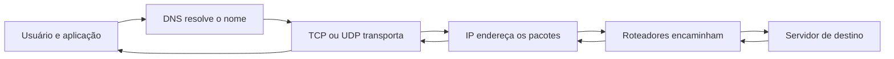
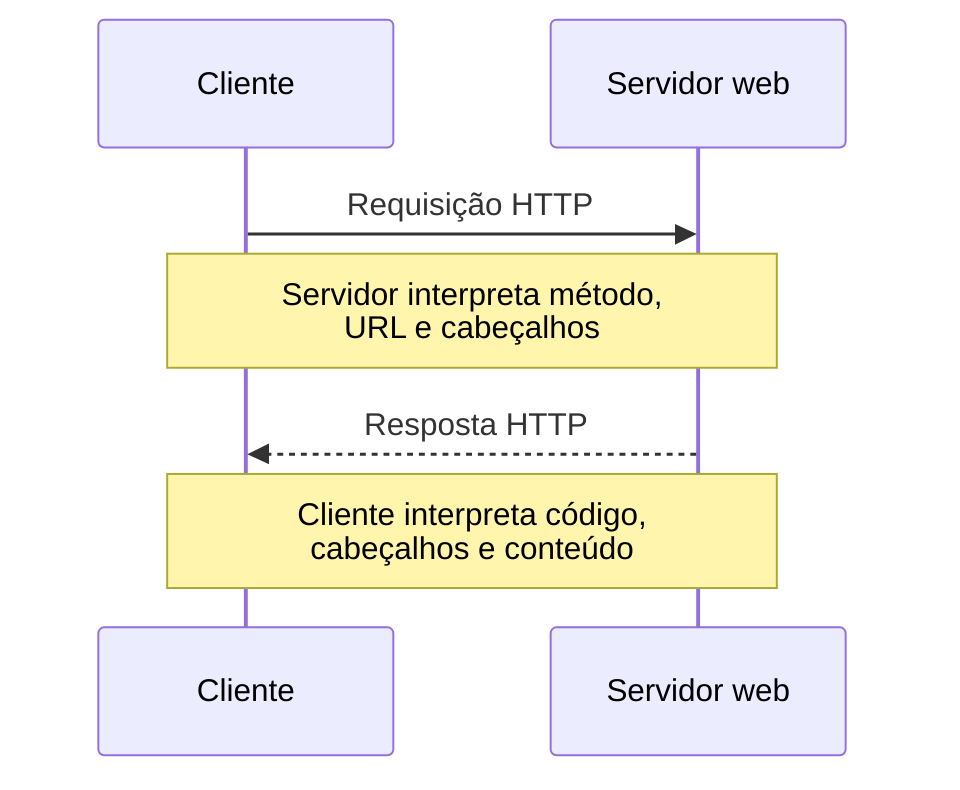
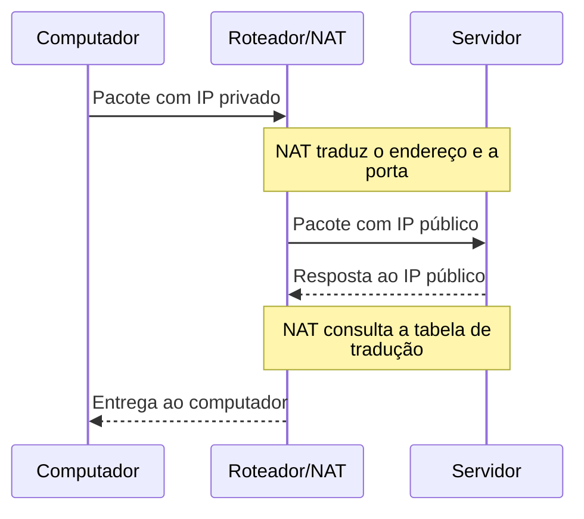
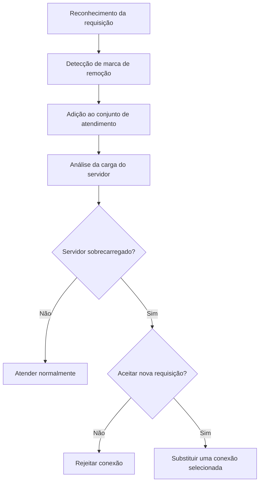
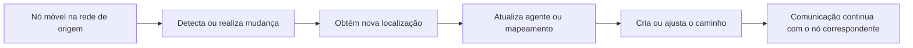
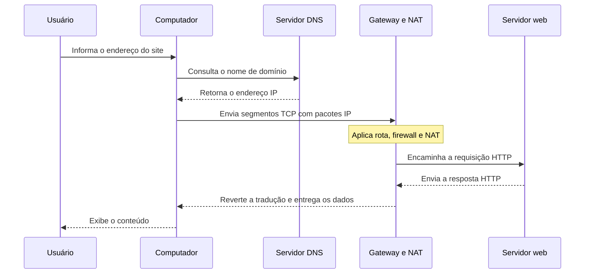

# Camada de aplicação, transporte e rede — HTTP, TCP/UDP, IPv4 e IPv6

## 1. Visão integrada da comunicação em redes

> [!info] Conceito
> A comunicação em rede depende da cooperação entre aplicações, protocolos de transporte, endereçamento IP, roteadores e serviços auxiliares, como DNS e NAT.

Quando uma pessoa acessa um site, envia um e-mail, transfere um arquivo ou participa de uma chamada, a aplicação não realiza todo o processo sozinha. A **camada de aplicação** define como os programas trocam mensagens; a **camada de transporte** entrega dados entre processos por meio de TCP ou UDP; e a **camada de rede** identifica os dispositivos e encaminha os pacotes entre redes distintas.

O endereço IP identifica logicamente uma interface de rede, enquanto a porta identifica o processo ou serviço que receberá os dados. O DNS converte nomes compreensíveis em endereços IP, o gateway encaminha tráfego destinado a outras redes e o NAT traduz endereços privados durante o acesso à Internet.



> [!tip] Resumindo
> Cada camada oferece um serviço específico e utiliza a camada inferior para completar a comunicação.

---

## 2. Camada de aplicação

> [!info] Conceito
> A camada de aplicação é a camada mais próxima do usuário e reúne protocolos e serviços utilizados diretamente pelos programas.

Aplicações como navegadores, clientes de e-mail, serviços de vídeo, mensagens instantâneas e chamadas de voz utilizam protocolos da camada de aplicação para estabelecer regras de comunicação. Essa camada gerencia os serviços oferecidos aos usuários e conecta os processos executados nos terminais à camada de transporte.

A escolha do transporte depende dos requisitos da aplicação. Transferências de arquivos, documentos web e e-mails não podem perder partes dos dados, por isso valorizam confiabilidade e ordenação. Já telefonia, videoconferência, áudio, vídeo e jogos interativos podem tolerar pequenas perdas, mas são sensíveis ao atraso e precisam manter a comunicação fluida.

| Tipo de aplicação                 | Tolerância a perdas          | Necessidade principal            |
| --------------------------------- | ---------------------------- | -------------------------------- |
| Arquivos, e-mail e documentos web | Não tolera perdas            | Integridade dos dados            |
| Telefonia e videoconferência      | Tolera pequenas perdas       | Baixo atraso                     |
| Áudio e vídeo armazenados         | Tolera pequenas perdas       | Reprodução contínua              |
| Jogos interativos                 | Tolera pequenas perdas       | Resposta rápida                  |
| Mensagens instantâneas            | Geralmente não tolera perdas | Entrega correta e tempo adequado |

> [!warning] Atenção
> TCP e UDP pertencem à camada de transporte. A camada de aplicação escolhe qual deles atende melhor às necessidades do serviço.

### 2.1 Arquitetura cliente-servidor

Na arquitetura **cliente-servidor**, o cliente inicia uma requisição e o servidor a processa e devolve uma resposta. O servidor tende a permanecer disponível em um endereço conhecido, enquanto os clientes acessam seus serviços. Esse modelo centraliza dados e controle, mas o servidor pode se tornar um ponto de sobrecarga ou indisponibilidade.

### 2.2 Arquitetura P2P

Na arquitetura **P2P**, ou par a par, os terminais podem fornecer e receber recursos diretamente. Um mesmo participante pode exercer funções de cliente e servidor, distribuindo a carga entre os pares. Essa característica favorece a escalabilidade, pois os dados recebidos por um usuário podem ser compartilhados com outros. Em contrapartida, surgem desafios de disponibilidade, segurança e permanência dos participantes na rede.

| Aspecto | Cliente-servidor | P2P |
|---|---|---|
| Organização | Serviço centralizado | Comunicação distribuída entre pares |
| Papel dos terminais | Cliente solicita; servidor responde | Pares podem solicitar e fornecer |
| Escalabilidade | Depende da capacidade do servidor | Pode crescer com a entrada de novos pares |
| Ponto crítico | Sobrecarga ou falha do servidor | Instabilidade e saída dos pares |
| Segurança | Controle concentrado | Maior exposição entre terminais |

---

## 3. Sockets e comunicação entre processos

> [!info] Conceito
> Socket é a interface que permite a um processo enviar e receber dados pela rede utilizando um protocolo de transporte.

O socket funciona como um ponto de ligação entre o programa e a pilha de protocolos do sistema operacional. O programador controla o processo da aplicação e escolhe parâmetros, como o protocolo de transporte; o sistema operacional administra buffers, variáveis e mecanismos internos do TCP ou UDP.

Um ponto de comunicação pode ser representado pela combinação:

```text
protocolo + endereço IP + porta
```

Exemplo:

```text
TCP 192.168.1.20:443
```

O endereço IP identifica o equipamento ou interface, enquanto a porta identifica o serviço dentro do equipamento. Essa separação permite que várias aplicações utilizem a rede simultaneamente no mesmo terminal.

### Figura — Socket entre o processo e a camada de transporte

<svg  
viewBox="0 0 800 400"  
xmlns="http://www.w3.org/2000/svg"  
font-family="sans-serif"  
preserveAspectRatio="xMidYMid meet"  
style="display:block; width:100%; max-width:800px; height:auto; margin:0 auto;"  
>
<defs><marker id="arrowS" viewBox="0 0 10 10" refX="8" refY="5" markerWidth="6" markerHeight="6" orient="auto-start-reverse"><path d="M2 1L8 5L2 9" fill="none" stroke="#7FE0C4" stroke-width="1.5" stroke-linecap="round" stroke-linejoin="round"/></marker></defs><rect width="800" height="400" fill="transparent"/><!-- ===== LADO ESQUERDO ===== --><text x="195" y="28" text-anchor="middle" font-size="14" font-weight="600" fill="#D8D3FF">Hospedeiro</text><text x="195" y="48" text-anchor="middle" font-size="14" font-weight="600" fill="#D8D3FF">ou servidor</text><ellipse cx="195" cy="135" rx="75" ry="35" fill="#3C3489" fill-opacity="0.35" stroke="#A89CF5" stroke-width="1.2"/><text x="195" y="140" text-anchor="middle" font-size="13" fill="#EDEBFF">Processo</text><rect x="155" y="180" width="80" height="32" fill="#1A4A5E" fill-opacity="0.6" stroke="#7FCFF0" stroke-width="1.2"/><text x="195" y="200" text-anchor="middle" font-size="13" font-weight="600" fill="#D6F0FB">Socket</text><rect x="115" y="230" width="160" height="100" fill="transparent" stroke="#A89CF5" stroke-width="1.2"/><text x="195" y="272" text-anchor="middle" font-size="13" fill="#EDEBFF">TCP com</text><text x="195" y="294" text-anchor="middle" font-size="13" fill="#EDEBFF">buffers, variáveis</text><line x1="195" y1="170" x2="195" y2="180" stroke="#7FE0C4" stroke-width="2.2" marker-end="url(#arrowS)"/><line x1="195" y1="212" x2="195" y2="230" stroke="#7FE0C4" stroke-width="2.2" marker-end="url(#arrowS)"/><line x1="20" y1="196" x2="155" y2="196" stroke="#999" stroke-width="0.7" opacity="0.5"/><text x="15" y="180" font-size="12" fill="#cccccc">Controlado</text><text x="15" y="196" font-size="12" fill="#cccccc">pelo programador</text><text x="15" y="212" font-size="12" fill="#cccccc">da aplicação</text><line x1="20" y1="280" x2="115" y2="280" stroke="#999" stroke-width="0.7" opacity="0.5"/><text x="15" y="264" font-size="12" fill="#cccccc">Controlado</text><text x="15" y="280" font-size="12" fill="#cccccc">pelo sistema</text><text x="15" y="296" font-size="12" fill="#cccccc">operacional</text><!-- ===== LADO DIREITO ===== --><text x="605" y="28" text-anchor="middle" font-size="14" font-weight="600" fill="#D8D3FF">Hospedeiro</text><text x="605" y="48" text-anchor="middle" font-size="14" font-weight="600" fill="#D8D3FF">ou servidor</text><ellipse cx="605" cy="135" rx="75" ry="35" fill="#3C3489" fill-opacity="0.35" stroke="#A89CF5" stroke-width="1.2"/><text x="605" y="140" text-anchor="middle" font-size="13" fill="#EDEBFF">Processo</text><rect x="565" y="180" width="80" height="32" fill="#1A4A5E" fill-opacity="0.6" stroke="#7FCFF0" stroke-width="1.2"/><text x="605" y="200" text-anchor="middle" font-size="13" font-weight="600" fill="#D6F0FB">Socket</text><rect x="525" y="230" width="160" height="100" fill="transparent" stroke="#A89CF5" stroke-width="1.2"/><text x="605" y="272" text-anchor="middle" font-size="13" fill="#EDEBFF">TCP com</text><text x="605" y="294" text-anchor="middle" font-size="13" fill="#EDEBFF">buffers, variáveis</text><line x1="605" y1="170" x2="605" y2="180" stroke="#7FE0C4" stroke-width="2.2" marker-end="url(#arrowS)"/><line x1="605" y1="212" x2="605" y2="230" stroke="#7FE0C4" stroke-width="2.2" marker-end="url(#arrowS)"/><line x1="645" y1="196" x2="780" y2="196" stroke="#999" stroke-width="0.7" opacity="0.5"/><text x="785" y="180" text-anchor="end" font-size="12" fill="#cccccc">Controlado</text><text x="785" y="196" text-anchor="end" font-size="12" fill="#cccccc">pelo programador</text><text x="785" y="212" text-anchor="end" font-size="12" fill="#cccccc">da aplicação</text><line x1="685" y1="280" x2="780" y2="280" stroke="#999" stroke-width="0.7" opacity="0.5"/><text x="785" y="264" text-anchor="end" font-size="12" fill="#cccccc">Controlado</text><text x="785" y="280" text-anchor="end" font-size="12" fill="#cccccc">pelo sistema</text><text x="785" y="296" text-anchor="end" font-size="12" fill="#cccccc">operacional</text><ellipse cx="400" cy="280" rx="80" ry="32" fill="#444444" fill-opacity="0.4" stroke="#999999" stroke-width="1"/><text x="400" y="285" text-anchor="middle" font-size="13" fill="#eeeeee">Internet</text><line x1="275" y1="280" x2="320" y2="280" stroke="#7FE0C4" stroke-width="3" marker-end="url(#arrowS)" marker-start="url(#arrowS)"/><line x1="480" y1="280" x2="525" y2="280" stroke="#7FE0C4" stroke-width="3" marker-end="url(#arrowS)" marker-start="url(#arrowS)"/></svg>

Os serviços esperados em uma comunicação por sockets incluem:

| Serviço | Significado |
|---|---|
| Segurança | Proteção dos dados durante a transferência |
| Confiabilidade | Tratamento de perdas e entrega correta |
| Vazão | Quantidade de dados transferida em determinado intervalo |
| Temporização | Controle de atrasos, limites de espera e tempo de resposta |

> [!tip] Resumindo
> A aplicação utiliza o socket; o sistema operacional executa os mecanismos internos de transporte e comunicação com a rede.

---

## 4. HTTP e comunicação na Web

> [!info] Conceito
> HTTP é um protocolo da camada de aplicação usado para solicitar e entregar páginas e outros objetos da Web.

Uma página web pode reunir um documento principal e objetos vinculados, como imagens, scripts, vídeos e folhas de estilo. O HTTP identifica esses recursos por meio de uma **URL**, formada principalmente pelo nome do hospedeiro e pelo caminho do objeto.

```text
Hospedeiro: http://www.site.com
Caminho:    paginas/index.html
URL:        http://www.site.com/paginas/index.html
```

Uma URL também pode transportar parâmetros, usados pela aplicação para transmitir valores associados à requisição.

O HTTP é apresentado no material como um protocolo **sem estado**: cada requisição é tratada de maneira independente. A repetição de uma ação pode gerar uma nova requisição, mesmo quando outra semelhante já está sendo processada.

### 4.1 Conexões persistentes e não persistentes

- **Conexão persistente:** a conexão permanece aberta para várias requisições e respostas, até atingir um limite ou tempo de espera.
- **Conexão não persistente:** uma nova conexão é aberta para cada requisição.

### 4.2 Mensagem de requisição HTTP

A requisição contém uma linha inicial, linhas de cabeçalho, uma linha em branco e, quando necessário, um corpo. A linha inicial informa o método, a URL e a versão do HTTP. Entre os métodos citados estão `GET`, `POST`, `HEAD`, `PUT` e `DELETE`.

### Figura — Estrutura de uma requisição HTTP

<svg  
viewBox="0 0 800 400"  
xmlns="http://www.w3.org/2000/svg"  
font-family="sans-serif"  
preserveAspectRatio="xMidYMid meet"  
style="display:block; width:100%; max-width:800px; height:auto; margin:0 auto;"  
>
<rect width="980" height="520" fill="transparent"/><rect x="265" y="45" width="135" height="60" fill="#1A4A5E" fill-opacity="0.6" stroke="#7FCFF0" stroke-width="1"/><rect x="400" y="45" width="36" height="60" fill="transparent" stroke="#7FCFF0" stroke-width="1"/><rect x="436" y="45" width="178" height="60" fill="#1A4A5E" fill-opacity="0.6" stroke="#7FCFF0" stroke-width="1"/><rect x="614" y="45" width="36" height="60" fill="transparent" stroke="#7FCFF0" stroke-width="1"/><rect x="650" y="45" width="143" height="60" fill="#1A4A5E" fill-opacity="0.6" stroke="#7FCFF0" stroke-width="1"/><rect x="793" y="45" width="42" height="60" fill="transparent" stroke="#7FCFF0" stroke-width="1"/><rect x="835" y="45" width="42" height="60" fill="transparent" stroke="#7FCFF0" stroke-width="1"/><text x="332.5" y="81" text-anchor="middle" font-size="20" font-weight="600" fill="#D6F0FB">Método</text><text x="418" y="81" text-anchor="middle" font-size="17" fill="#dddddd">sp</text><text x="525" y="81" text-anchor="middle" font-size="20" font-weight="600" fill="#D6F0FB">URL</text><text x="632" y="81" text-anchor="middle" font-size="17" fill="#dddddd">sp</text><text x="721.5" y="81" text-anchor="middle" font-size="20" font-weight="600" fill="#D6F0FB">Versão</text><text x="814" y="81" text-anchor="middle" font-size="17" fill="#dddddd">cr</text><text x="856" y="81" text-anchor="middle" font-size="17" fill="#dddddd">lf</text><text x="165" y="66" text-anchor="end" font-size="18" font-weight="600" fill="#eeeeee">Linha de</text><text x="165" y="91" text-anchor="end" font-size="18" font-weight="600" fill="#eeeeee">requisição</text><line x1="197" y1="72" x2="263" y2="72" stroke="#888" stroke-width="0.8" opacity="0.6"/><rect x="265" y="105" width="247" height="60" fill="#1A4A5E" fill-opacity="0.3" stroke="#7FCFF0" stroke-width="1"/><rect x="512" y="105" width="38" height="60" fill="transparent" stroke="#7FCFF0" stroke-width="1"/><rect x="550" y="105" width="112" height="60" fill="#1A4A5E" fill-opacity="0.18" stroke="#7FCFF0" stroke-width="1"/><rect x="662" y="105" width="42" height="60" fill="transparent" stroke="#7FCFF0" stroke-width="1"/><rect x="704" y="105" width="42" height="60" fill="transparent" stroke="#7FCFF0" stroke-width="1"/><text x="282" y="130" text-anchor="start" font-size="18" fill="#eeeeee">nome do campo</text><text x="282" y="153" text-anchor="start" font-size="18" fill="#eeeeee">de cabeçalho:</text><text x="531" y="141" text-anchor="middle" font-size="17" fill="#dddddd">sp</text><text x="606" y="141" text-anchor="middle" font-size="18" fill="#eeeeee">valor</text><text x="683" y="141" text-anchor="middle" font-size="17" fill="#dddddd">cr</text><text x="725" y="141" text-anchor="middle" font-size="17" fill="#dddddd">lf</text><rect x="265" y="165" width="481" height="75" fill="transparent" stroke="#7FCFF0" stroke-width="1"/><path d="M258 194 L276 187" stroke="#aaaaaa" stroke-width="1.6" fill="none"/><path d="M262 204 L280 197" stroke="#aaaaaa" stroke-width="1.6" fill="none"/><path d="M732 194 L750 187" stroke="#aaaaaa" stroke-width="1.6" fill="none"/><path d="M736 204 L754 197" stroke="#aaaaaa" stroke-width="1.6" fill="none"/><rect x="265" y="240" width="247" height="60" fill="#1A4A5E" fill-opacity="0.3" stroke="#7FCFF0" stroke-width="1"/><rect x="512" y="240" width="38" height="60" fill="transparent" stroke="#7FCFF0" stroke-width="1"/><rect x="550" y="240" width="112" height="60" fill="#1A4A5E" fill-opacity="0.18" stroke="#7FCFF0" stroke-width="1"/><rect x="662" y="240" width="42" height="60" fill="transparent" stroke="#7FCFF0" stroke-width="1"/><rect x="704" y="240" width="42" height="60" fill="transparent" stroke="#7FCFF0" stroke-width="1"/><text x="282" y="265" text-anchor="start" font-size="18" fill="#eeeeee">nome do campo</text><text x="282" y="288" text-anchor="start" font-size="18" fill="#eeeeee">de cabeçalho:</text><text x="531" y="276" text-anchor="middle" font-size="17" fill="#dddddd">sp</text><text x="606" y="276" text-anchor="middle" font-size="18" fill="#eeeeee">valor</text><text x="683" y="276" text-anchor="middle" font-size="17" fill="#dddddd">cr</text><text x="725" y="276" text-anchor="middle" font-size="17" fill="#dddddd">lf</text><path d="M257 105 L246 105 L246 300 L257 300" stroke="#999" stroke-width="0.9" fill="none" opacity="0.6"/><line x1="246" y1="202" x2="197" y2="202" stroke="#888" stroke-width="0.8" opacity="0.6"/><text x="165" y="194" text-anchor="end" font-size="18" font-weight="600" fill="#eeeeee">Linhas de</text><text x="165" y="219" text-anchor="end" font-size="18" font-weight="600" fill="#eeeeee">cabeçalho</text><rect x="265" y="300" width="44" height="58" fill="transparent" stroke="#7FCFF0" stroke-width="1"/><rect x="309" y="300" width="44" height="58" fill="transparent" stroke="#7FCFF0" stroke-width="1"/><text x="287" y="335" text-anchor="middle" font-size="17" fill="#dddddd">cr</text><text x="331" y="335" text-anchor="middle" font-size="17" fill="#dddddd">lf</text><text x="165" y="325" text-anchor="end" font-size="18" font-weight="600" fill="#eeeeee">Linha em</text><text x="165" y="350" text-anchor="end" font-size="18" font-weight="600" fill="#eeeeee">branco</text><line x1="170" y1="331" x2="263" y2="331" stroke="#888" stroke-width="0.8" opacity="0.6"/><rect x="265" y="358" width="680" height="125" fill="#3C3489" fill-opacity="0.3" stroke="#A89CF5" stroke-width="1"/><path d="M258 450 L277 442" stroke="#aaaaaa" stroke-width="1.6" fill="none"/><path d="M262 460 L281 452" stroke="#aaaaaa" stroke-width="1.6" fill="none"/><path d="M932 450 L951 442" stroke="#aaaaaa" stroke-width="1.6" fill="none"/><path d="M936 460 L955 452" stroke="#aaaaaa" stroke-width="1.6" fill="none"/><text x="165" y="420" text-anchor="end" font-size="18" font-weight="600" fill="#eeeeee">Corpo da</text><text x="165" y="445" text-anchor="end" font-size="18" font-weight="600" fill="#eeeeee">entidade</text><line x1="187" y1="426" x2="263" y2="426" stroke="#888" stroke-width="0.8" opacity="0.6"/></svg>

### 4.3 Mensagem de resposta HTTP

A resposta possui estrutura semelhante, mas começa com uma linha de estado, que contém a versão do HTTP, o código de estado e uma frase correspondente. Em seguida aparecem os cabeçalhos, a linha em branco e o corpo com os dados devolvidos ao cliente.

```
<svg  
viewBox="0 0 800 400"  
xmlns="http://www.w3.org/2000/svg"  
font-family="sans-serif"  
preserveAspectRatio="xMidYMid meet"  
style="display:block; width:100%; max-width:800px; height:auto; margin:0 auto;"  
>
```

### Figura — Estrutura de uma resposta HTTP

<svg viewBox="0 0 980 520" xmlns="http://www.w3.org/2000/svg" font-family="sans-serif" preserveAspectRatio="xMidYMid meet"  
style="display:block; width:100%; max-width:800px; height:auto; margin:0 auto;" >

<rect width="980" height="520" fill="transparent"/><rect x="250" y="30" width="135" height="60" fill="#1A4A5E" fill-opacity="0.6" stroke="#7FCFF0" stroke-width="1"/><rect x="385" y="30" width="35" height="60" fill="transparent" stroke="#7FCFF0" stroke-width="1"/><rect x="420" y="30" width="175" height="60" fill="#1A4A5E" fill-opacity="0.6" stroke="#7FCFF0" stroke-width="1"/><rect x="595" y="30" width="35" height="60" fill="transparent" stroke="#7FCFF0" stroke-width="1"/><rect x="630" y="30" width="145" height="60" fill="#1A4A5E" fill-opacity="0.6" stroke="#7FCFF0" stroke-width="1"/><rect x="775" y="30" width="40" height="60" fill="transparent" stroke="#7FCFF0" stroke-width="1"/><rect x="815" y="30" width="40" height="60" fill="transparent" stroke="#7FCFF0" stroke-width="1"/><text x="317.5" y="66" text-anchor="middle" font-size="20" font-weight="600" fill="#D6F0FB">versão</text><text x="402.5" y="66" text-anchor="middle" font-size="16" fill="#dddddd">sp</text><text x="507.5" y="55" text-anchor="middle" font-size="18" font-weight="600" fill="#D6F0FB">código</text><text x="507.5" y="77" text-anchor="middle" font-size="18" font-weight="600" fill="#D6F0FB">de estado</text><text x="612.5" y="66" text-anchor="middle" font-size="16" fill="#dddddd">sp</text><text x="702.5" y="66" text-anchor="middle" font-size="20" font-weight="600" fill="#D6F0FB">frase</text><text x="795" y="66" text-anchor="middle" font-size="16" fill="#dddddd">cr</text><text x="835" y="66" text-anchor="middle" font-size="16" fill="#dddddd">lf</text><text x="180" y="48" text-anchor="end" font-size="17" font-weight="600" fill="#eeeeee">Linha de</text><text x="180" y="70" text-anchor="end" font-size="17" font-weight="600" fill="#eeeeee">estado</text><line x1="190" y1="58" x2="248" y2="58" stroke="#888" stroke-width="0.8" opacity="0.5"/><rect x="250" y="90" width="240" height="70" fill="#1A4A5E" fill-opacity="0.3" stroke="#7FCFF0" stroke-width="1"/><rect x="490" y="90" width="40" height="70" fill="transparent" stroke="#7FCFF0" stroke-width="1"/><rect x="530" y="90" width="120" height="70" fill="transparent" stroke="#7FCFF0" stroke-width="1"/><rect x="650" y="90" width="40" height="70" fill="transparent" stroke="#7FCFF0" stroke-width="1"/><rect x="690" y="90" width="40" height="70" fill="transparent" stroke="#7FCFF0" stroke-width="1"/><text x="370" y="124" text-anchor="middle" font-size="17" fill="#eeeeee">nome do campo</text><text x="370" y="146" text-anchor="middle" font-size="17" fill="#eeeeee">de cabeçalho:</text><text x="510" y="132" text-anchor="middle" font-size="16" fill="#dddddd">sp</text><text x="590" y="132" text-anchor="middle" font-size="18" fill="#eeeeee">valor</text><text x="670" y="132" text-anchor="middle" font-size="16" fill="#dddddd">cr</text><text x="710" y="132" text-anchor="middle" font-size="16" fill="#dddddd">lf</text><rect x="250" y="160" width="480" height="55" fill="transparent" stroke="#7FCFF0" stroke-width="1"/><path d="M246 177 L262 170" stroke="#aaaaaa" stroke-width="1.5" fill="none"/><path d="M251 188 L267 181" stroke="#aaaaaa" stroke-width="1.5" fill="none"/><path d="M714 177 L730 170" stroke="#aaaaaa" stroke-width="1.5" fill="none"/><path d="M719 188 L735 181" stroke="#aaaaaa" stroke-width="1.5" fill="none"/><rect x="250" y="215" width="240" height="70" fill="#1A4A5E" fill-opacity="0.3" stroke="#7FCFF0" stroke-width="1"/><rect x="490" y="215" width="40" height="70" fill="transparent" stroke="#7FCFF0" stroke-width="1"/><rect x="530" y="215" width="120" height="70" fill="transparent" stroke="#7FCFF0" stroke-width="1"/><rect x="650" y="215" width="40" height="70" fill="transparent" stroke="#7FCFF0" stroke-width="1"/><rect x="690" y="215" width="40" height="70" fill="transparent" stroke="#7FCFF0" stroke-width="1"/><text x="370" y="249" text-anchor="middle" font-size="17" fill="#eeeeee">nome do campo</text><text x="370" y="271" text-anchor="middle" font-size="17" fill="#eeeeee">de cabeçalho:</text><text x="510" y="257" text-anchor="middle" font-size="16" fill="#dddddd">sp</text><text x="590" y="257" text-anchor="middle" font-size="18" fill="#eeeeee">valor</text><text x="670" y="257" text-anchor="middle" font-size="16" fill="#dddddd">cr</text><text x="710" y="257" text-anchor="middle" font-size="16" fill="#dddddd">lf</text><path d="M240 95 L228 95 L228 285 L240 285" stroke="#999" stroke-width="0.8" fill="none" opacity="0.5"/><line x1="228" y1="190" x2="210" y2="190" stroke="#999" stroke-width="0.8" opacity="0.5"/><text x="195" y="181" text-anchor="end" font-size="17" font-weight="600" fill="#eeeeee">Linhas de</text><text x="195" y="203" text-anchor="end" font-size="17" font-weight="600" fill="#eeeeee">cabeçalho</text><rect x="250" y="300" width="40" height="45" fill="transparent" stroke="#7FCFF0" stroke-width="1"/><rect x="290" y="300" width="40" height="45" fill="transparent" stroke="#7FCFF0" stroke-width="1"/><text x="270" y="328" text-anchor="middle" font-size="16" fill="#dddddd">cr</text><text x="310" y="328" text-anchor="middle" font-size="16" fill="#dddddd">lf</text><text x="180" y="314" text-anchor="end" font-size="17" font-weight="600" fill="#eeeeee">Linha em</text><text x="180" y="336" text-anchor="end" font-size="17" font-weight="600" fill="#eeeeee">branco</text><line x1="190" y1="322" x2="248" y2="322" stroke="#888" stroke-width="0.8" opacity="0.5"/><rect x="250" y="365" width="670" height="125" fill="#3C3489" fill-opacity="0.3" stroke="#A89CF5" stroke-width="1"/><path d="M246 412 L262 405" stroke="#aaaaaa" stroke-width="1.5" fill="none"/><path d="M251 423 L267 416" stroke="#aaaaaa" stroke-width="1.5" fill="none"/><path d="M904 412 L920 405" stroke="#aaaaaa" stroke-width="1.5" fill="none"/><path d="M909 423 L925 416" stroke="#aaaaaa" stroke-width="1.5" fill="none"/><text x="180" y="420" text-anchor="end" font-size="17" font-weight="600" fill="#eeeeee">Corpo da</text><text x="180" y="442" text-anchor="end" font-size="17" font-weight="600" fill="#eeeeee">entidade</text><line x1="190" y1="430" x2="248" y2="430" stroke="#888" stroke-width="0.8" opacity="0.5"/></svg>




> [!tip] Resumindo
> A Web opera principalmente por uma sequência de requisições enviadas pelo cliente e respostas devolvidas pelo servidor.

---

## 5. TCP, UDP e portas de comunicação

> [!info] Conceito
> TCP e UDP transportam dados entre processos, mas oferecem níveis diferentes de controle, confiabilidade e sobrecarga.

### 5.1 TCP

O **TCP** é orientado à conexão e busca entregar os dados de maneira confiável e ordenada. Ele utiliza confirmações, retransmissões, controle de erros, controle de fluxo e controle de congestionamento. É adequado quando a perda de parte do conteúdo pode corromper a informação, como em arquivos, páginas web, e-mails, acesso remoto e comunicação com bancos de dados.

### 5.2 UDP

O **UDP** envia datagramas sem estabelecer uma conexão completa e sem confirmar automaticamente cada entrega. Os dados podem chegar fora de ordem, ser duplicados ou não chegar. Em compensação, o protocolo possui menor sobrecarga e pode reduzir a latência, sendo útil em áudio, vídeo, jogos on-line e consultas rápidas.

| Característica | TCP | UDP |
|---|---|---|
| Orientação à conexão | Sim | Não |
| Confirmação de recebimento | Sim | Não |
| Retransmissão automática | Sim | Não |
| Entrega ordenada | Sim | Não |
| Controle de fluxo e congestionamento | Sim | Não |
| Sobrecarga | Maior | Menor |
| Prioridade típica | Confiabilidade | Baixa latência e simplicidade |

### 5.3 Portas conhecidas

| Porta | Serviço | Transporte mais comum | Função |
|---:|---|---|---|
| 21 | FTP | TCP | Controle de transferência de arquivos |
| 22 | SSH | TCP | Acesso remoto seguro |
| 25 | SMTP | TCP | Envio de e-mails |
| 53 | DNS | UDP e TCP | Resolução de nomes |
| 80 | HTTP | TCP | Acesso web sem criptografia |
| 110 | POP3 | TCP | Recebimento de e-mails |
| 143 | IMAP | TCP | Acesso e sincronização de e-mails |
| 443 | HTTPS | TCP | Acesso web protegido |

> [!warning] Atenção
> UDP não é inferior ao TCP. Os dois protocolos atendem a requisitos diferentes, e a escolha depende da aplicação.

---

## 6. DNS, gateway, roteador, firewall e NAT

> [!info] Conceito
> Esses mecanismos localizam serviços, conectam redes diferentes, controlam o tráfego e permitem o compartilhamento de endereços públicos.

### 6.1 DNS

O **DNS** relaciona nomes de domínio a endereços IP. Quando o usuário informa um nome, o computador consulta o servidor DNS e recebe o endereço necessário para estabelecer a comunicação.

Registros de uma zona DNS podem incluir:

| Registro | Finalidade |
|---|---|
| `A` | Associa um nome a um endereço IPv4 |
| `AAAA` | Associa um nome a um endereço IPv6 |
| `CNAME` | Define um nome alternativo |
| `MX` | Indica servidores de e-mail |
| `NS` | Indica servidores responsáveis pela zona |

### 6.2 Gateway e roteador

O **gateway padrão** é o equipamento para o qual um terminal envia pacotes destinados a outras redes. O roteador examina o endereço IP de destino e determina o próximo caminho. A comunicação entre redes diferentes exige rotas adequadas e permissões de segurança.

### 6.3 Firewall

O **firewall** aplica regras para permitir ou bloquear tráfego. Um mesmo equipamento pode funcionar simultaneamente como roteador, firewall e dispositivo de NAT.

### 6.4 NAT

O **NAT** traduz endereços IP durante a passagem dos pacotes por um roteador ou firewall. Em uma rede privada, vários terminais podem compartilhar um único endereço público. O equipamento mantém uma tabela de traduções para devolver cada resposta ao dispositivo interno correto, frequentemente diferenciando as conexões também pelas portas.



> [!tip] Resumindo
> DNS descobre o endereço, o gateway recebe o tráfego externo, o roteador escolhe o caminho, o firewall aplica as regras e o NAT traduz os endereços.

---

## 7. Segurança na camada de aplicação, QoS e QoE

> [!info] Conceito
> Ataques de negação de serviço procuram esgotar recursos e impedir o atendimento de usuários legítimos; a defesa deve preservar disponibilidade e qualidade percebida.

O artigo sobre proteção em servidores Apache diferencia ataques de grande volume, chamados **Flooding**, e ataques **LowRate**, que usam pouco tráfego e se parecem com conexões legítimas. Os exemplos analisados mantêm requisições abertas por longos períodos para ocupar o conjunto de atendimentos do servidor. Essa semelhança com o tráfego normal torna a detecção mais difícil.

> [!warning] Atenção
> A análise desses ataques tem finalidade defensiva: compreender o consumo de recursos e avaliar mecanismos de proteção, não reproduzir procedimentos ofensivos.

### 7.1 Estratégia SeVen e módulo `mod_seven`

A estratégia **SeVen** realiza uma seleção probabilística quando o servidor está sobrecarregado. Uma nova requisição pode ser rejeitada ou aceita; quando aceita em um conjunto já cheio, outra conexão é selecionada para substituição. A ideia é que, durante um ataque, o conjunto de atendimento provavelmente contém mais conexões maliciosas do que legítimas.

O `mod_seven` integra essa lógica diretamente ao Apache. O processamento foi dividido em quatro fases:



### 7.2 QoS e QoE

- **QoS — Qualidade de Serviço:** medida por parâmetros técnicos, como disponibilidade, taxa de erro, atraso, taxa de transferência, consumo de CPU e memória.
- **QoE — Qualidade de Experiência:** percepção subjetiva do usuário, relacionada principalmente ao tempo de resposta, sucesso das tarefas e necessidade de recarregar páginas.

Os **webbots** foram criados para simular usuários com ritmos diferentes, repetir tarefas diante de falhas e registrar tempo de resposta, tentativas, sucesso e desistência. A ferramenta complementa testes de carga ao observar o serviço da perspectiva do usuário.

### 7.3 Resultados principais do artigo

| Cenário de curta duração | Disponibilidade com `mod_seven` | TTS médio |
|---|---:|---:|
| Sem ataque | 100% | 0,03 s |
| Slowloris | 98,7% | 0,07 s |
| HTTP POST lento | 95,1% | 0,02 s |

Nos testes comparativos, o módulo manteve disponibilidade próxima ou superior à estratégia executada como proxy. Em testes sem proteção, os ataques tornaram a aplicação indisponível; com o módulo, a disponibilidade permaneceu em aproximadamente 98,7% no cenário Slowloris e 96,6% no cenário HTTP POST, com baixo tempo de resposta.

Nos testes de duas horas, a disponibilidade permaneceu acima de 91% nos cenários HTTP e HTTPS analisados. O módulo suportou grande volume de tráfego e apresentou baixo impacto adicional em situações normais. Nos experimentos com robôs simulando inscrições em um sistema semelhante ao SISU, a aplicação desprotegida falhou para praticamente todos os usuários durante os ataques; com o módulo, a taxa de sucesso permaneceu superior a 91% até no cenário de maior criação de robôs.

> [!tip] Resumindo
> A proteção foi avaliada não apenas pela sobrevivência do servidor, mas também pela capacidade de usuários legítimos concluírem tarefas com tempo de resposta aceitável.

---

## 8. Camada de rede

> [!info] Conceito
> A camada de rede realiza endereçamento e encaminhamento de pacotes entre a origem e o destino, inclusive através de várias redes intermediárias.

A comparação com um sistema rodoviário ajuda a compreender a camada de rede: os pacotes correspondem aos veículos, os enlaces correspondem às vias e os roteadores funcionam como pontos de decisão. Assim como o tráfego viário, a rede precisa lidar com capacidade, caminhos alternativos, tamanhos diferentes de unidades transportadas e congestionamentos.

As funções centrais são o **roteamento** e o **controle de congestionamento**, acompanhadas por atividades como endereçamento, multiplexação, transmissão de pacotes, mapeamento entre endereços de rede e de enlace, segmentação, detecção de erros e sequenciação.

### 8.1 Roteamento e repasse

- **Roteamento:** processo de determinar uma rota válida entre origem e destino.
- **Repasse:** decisão local de um roteador sobre a interface ou enlace de saída usado pelo pacote.

As rotas podem ser definidas por tabelas estáticas, por decisões estabelecidas no início da comunicação ou por tabelas dinâmicas atualizadas ao longo da rede.

### 8.2 Tabela de repasse

A tabela de repasse associa informações do cabeçalho ou do destino a um enlace de saída. O algoritmo de roteamento constrói ou atualiza essa estrutura; durante o encaminhamento, o roteador consulta a tabela e envia o pacote ao próximo ponto.

### Figura — Funcionamento de uma tabela de repasse

<svg viewBox="0 0 980 900" xmlns="http://www.w3.org/2000/svg" font-family="sans-serif" preserveAspectRatio="xMidYMid meet"  
style="display:block; width:100%; max-width:800px; height:auto; margin:0 auto;" >
<defs><marker id="arrow-cyan" markerWidth="10" markerHeight="10" refX="9" refY="5" orient="auto"><path d="M0,0 L10,5 L0,10 Z" fill="#29B6E6"/></marker><marker id="arrow-gray" markerWidth="9" markerHeight="9" refX="8" refY="4.5" orient="auto"><path d="M0,0 L9,4.5 L0,9 Z" fill="#aaaaaa"/></marker><linearGradient id="router-gradient" x1="0" y1="0" x2="0" y2="1"><stop offset="0%" stop-color="#D6F0FB" stop-opacity="0.95"/><stop offset="100%" stop-color="#1A4A5E" stop-opacity="0.75"/></linearGradient><g id="router"><ellipse cx="0" cy="9" rx="43" ry="18" fill="#D6F0FB" stroke="#7FCFF0" stroke-width="1.5"/><path d="M-43 9 V25 C-43 36 -24 44 0 44 C24 44 43 36 43 25 V9" fill="url(#router-gradient)" stroke="#7FCFF0" stroke-width="1.5"/><path d="M-17 2 L17 18 M17 2 L-17 18" stroke="#1A4A5E" stroke-width="5" stroke-linecap="round"/><path d="M-17 2 L-8 1 M-17 2 L-12 10 M17 2 L8 1 M17 2 L12 10 M-17 18 L-8 19 M-17 18 L-12 10 M17 18 L8 19 M17 18 L12 10" stroke="#1A4A5E" stroke-width="2" fill="none" stroke-linecap="round"/></g><g id="small-table"><rect x="0" y="0" width="108" height="112" fill="#1A4A5E" fill-opacity="0.28" stroke="#7FCFF0" stroke-width="1.2"/><ellipse cx="54" cy="17" rx="42" ry="11" fill="#3C3489" fill-opacity="0.28" stroke="#A89CF5" stroke-width="1.2"/><line x1="54" y1="29" x2="54" y2="42" stroke="#aaaaaa" stroke-width="1.2" marker-end="url(#arrow-gray)"/><rect x="10" y="42" width="88" height="60" fill="transparent" stroke="#7FCFF0" stroke-width="1"/><line x1="10" y1="58" x2="98" y2="58" stroke="#7FCFF0" stroke-width="1"/><line x1="54" y1="42" x2="54" y2="102" stroke="#7FCFF0" stroke-width="1"/><line x1="10" y1="76" x2="98" y2="76" stroke="#7FCFF0" stroke-width="1"/></g></defs><rect width="980" height="900" fill="transparent"/><rect x="155" y="20" width="370" height="370" fill="#1A4A5E" fill-opacity="0.22" stroke="#7FCFF0" stroke-width="1.4"/><ellipse cx="340" cy="70" rx="157" ry="34" fill="#3C3489" fill-opacity="0.28" stroke="#A89CF5" stroke-width="1.4"/><text x="340" y="78" text-anchor="middle" font-size="21" font-weight="600" fill="#eeeeee">Algoritmo de roteamento</text><line x1="340" y1="105" x2="340" y2="135" stroke="#aaaaaa" stroke-width="1.5" marker-end="url(#arrow-gray)"/><rect x="173" y="140" width="334" height="225" fill="transparent" stroke="#7FCFF0" stroke-width="1.2"/><rect x="173" y="140" width="334" height="45" fill="#1A4A5E" fill-opacity="0.6" stroke="#7FCFF0" stroke-width="1.2"/><text x="340" y="169" text-anchor="middle" font-size="20" font-weight="600" fill="#D6F0FB">Tabela de repasse local</text><rect x="173" y="185" width="178" height="73" fill="#1A4A5E" fill-opacity="0.3" stroke="#7FCFF0" stroke-width="1"/><rect x="351" y="185" width="156" height="73" fill="#1A4A5E" fill-opacity="0.3" stroke="#7FCFF0" stroke-width="1"/><text x="262" y="215" text-anchor="middle" font-size="18" fill="#eeeeee">valor do</text><text x="262" y="239" text-anchor="middle" font-size="18" fill="#eeeeee">cabeçalho</text><text x="429" y="215" text-anchor="middle" font-size="18" fill="#eeeeee">enlace</text><text x="429" y="239" text-anchor="middle" font-size="18" fill="#eeeeee">de saída</text><rect x="173" y="258" width="334" height="107" fill="transparent" stroke="#7FCFF0" stroke-width="1"/><line x1="351" y1="258" x2="351" y2="365" stroke="#7FCFF0" stroke-width="1"/><text x="315" y="287" text-anchor="end" font-size="19" fill="#eeeeee">0100</text><text x="315" y="314" text-anchor="end" font-size="19" fill="#eeeeee">0101</text><text x="315" y="341" text-anchor="end" font-size="19" fill="#eeeeee">0111</text><text x="315" y="361" text-anchor="end" font-size="19" fill="#eeeeee">1001</text><text x="363" y="287" font-size="19" fill="#eeeeee">3</text><text x="363" y="314" font-size="19" fill="#eeeeee">2</text><text x="363" y="341" font-size="19" fill="#eeeeee">2</text><text x="363" y="361" font-size="19" fill="#eeeeee">1</text><path d="M190 390 L405 510 L330 600 Z" fill="#1A4A5E" fill-opacity="0.07"/><text x="48" y="460" font-size="19" font-weight="600" fill="#eeeeee">Valor no cabeçalho do</text><text x="48" y="485" font-size="19" font-weight="600" fill="#eeeeee">pacote que está chegando</text><line x1="235" y1="490" x2="250" y2="520" stroke="#aaaaaa" stroke-width="1.2"/><line x1="25" y1="545" x2="145" y2="545" stroke="#aaaaaa" stroke-width="2"/><rect x="145" y="528" width="126" height="34" fill="#1A4A5E" fill-opacity="0.6" stroke="#29B6E6" stroke-width="2"/><rect x="213" y="533" width="52" height="24" fill="transparent" stroke="#D6F0FB" stroke-width="1"/><text x="239" y="551" text-anchor="middle" font-size="16" font-weight="600" fill="#eeeeee">0111</text><line x1="271" y1="545" x2="315" y2="545" stroke="#29B6E6" stroke-width="4" marker-end="url(#arrow-cyan)"/><path d="M315 565 C350 505 430 495 480 520 C525 465 620 460 670 510 C750 490 835 535 840 610 C885 670 810 755 730 745 C680 790 575 785 535 752 C465 785 365 747 360 680 C310 650 295 605 315 565 Z" fill="#1A4A5E" fill-opacity="0.10"/><path d="M360 585 C425 540 500 555 535 595 C590 535 690 550 725 605 C785 625 785 690 735 718 C660 755 570 735 525 710 C465 750 390 710 395 655 C350 630 340 605 360 585 Z" fill="#3C3489" fill-opacity="0.08"/><line x1="365" y1="560" x2="535" y2="500" stroke="#aaaaaa" stroke-width="2"/><line x1="575" y1="500" x2="745" y2="560" stroke="#aaaaaa" stroke-width="2"/><line x1="370" y1="575" x2="535" y2="620" stroke="#aaaaaa" stroke-width="2"/><line x1="575" y1="620" x2="745" y2="575" stroke="#aaaaaa" stroke-width="2"/><line x1="355" y1="585" x2="430" y2="690" stroke="#aaaaaa" stroke-width="2"/><line x1="475" y1="710" x2="620" y2="710" stroke="#aaaaaa" stroke-width="2"/><line x1="660" y1="690" x2="755" y2="585" stroke="#aaaaaa" stroke-width="2"/><use href="#router" transform="translate(355 550)"/><use href="#router" transform="translate(555 485)"/><use href="#router" transform="translate(555 610)"/><use href="#router" transform="translate(770 550)"/><use href="#router" transform="translate(450 690)"/><use href="#router" transform="translate(645 690)"/><line x1="315" y1="545" x2="438" y2="575" stroke="#29B6E6" stroke-width="4" marker-end="url(#arrow-cyan)"/><text x="442" y="513" text-anchor="middle" font-size="20" font-weight="600" fill="#eeeeee">1</text><text x="455" y="594" text-anchor="middle" font-size="20" font-weight="600" fill="#eeeeee">2</text><text x="405" y="640" text-anchor="middle" font-size="20" font-weight="600" fill="#eeeeee">3</text><use href="#small-table" transform="translate(610 315)"/><use href="#small-table" transform="translate(845 420)"/><use href="#small-table" transform="translate(220 690)"/><use href="#small-table" transform="translate(510 775)"/><use href="#small-table" transform="translate(790 690)"/></svg>

Os roteadores operam principalmente nas camadas de rede, enlace e física. Em geral, eles não executam as funções completas das camadas de aplicação e transporte dos terminais finais.

### 8.3 Serviços da camada de rede

| Serviço | Finalidade |
|---|---|
| Entrega garantida | Assegurar que o pacote chegue ao destino |
| Atraso limitado | Entregar dentro de um limite de tempo |
| Ordem de pacotes | Preservar a sequência de envio |
| Largura de banda mínima | Reservar uma taxa mínima para o fluxo |
| Jitter máximo | Limitar a variação entre os tempos de chegada |
| Segurança | Prover sigilo, integridade ou autenticação |

O material também diferencia taxa constante de bits (**CBR**), que busca manter uma taxa previamente estabelecida, e taxa de bits disponível (**ABR**), que ajusta a transferência conforme a disponibilidade da rede.

### 8.4 Datagramas e redes virtuais

Em uma rede de datagramas, os pacotes são tratados de maneira independente e podem percorrer caminhos diferentes. Em uma rede virtual, os pacotes mantêm uma relação de conexão e seguem um tratamento associado ao fluxo estabelecido.

> [!tip] Resumindo
> Roteamento escolhe caminhos em escala de rede; repasse aplica a decisão em cada roteador.

---

## 9. Protocolo IP

> [!info] Conceito
> O Internet Protocol identifica origem e destino e permite que os pacotes sejam encaminhados entre redes.

O IP possui duas versões centrais no material: **IPv4** e **IPv6**. O IPv4 continua amplamente utilizado, mas seu espaço de endereçamento é limitado. O IPv6 amplia drasticamente a quantidade de endereços e simplifica partes do cabeçalho, embora a transição dependa da compatibilidade da infraestrutura e dos dispositivos.

---

## 10. IPv4

> [!info] Conceito
> O IPv4 utiliza endereços de 32 bits, normalmente representados por quatro octetos decimais separados por pontos.

Cada octeto possui 8 bits e pode representar valores de `0` a `255`. Assim, um endereço IPv4 possui o formato:

```text
192.168.10.25
```

O menor valor visual possível é `0.0.0.0` e o maior é `255.255.255.255`. O endereço identifica uma interface lógica, e não o endereço físico da placa de rede.

### 10.1 Cabeçalho IPv4

Os principais campos apresentados são:

| Campo | Função |
|---|---|
| Versão | Identifica a versão do IP |
| IHL | Indica o tamanho do cabeçalho |
| Tipo de serviço | Identifica o tratamento solicitado |
| Comprimento total | Informa o tamanho do datagrama |
| Identificação, flags e deslocamento | Controlam a fragmentação |
| Tempo de vida — TTL | Limita a permanência do datagrama na rede |
| Protocolo | Informa o protocolo transportado |
| Soma de verificação | Auxilia na detecção de erros do cabeçalho |
| Origem e destino | Identificam os pontos da comunicação |
| Opções | Permitem extensões do cabeçalho |
| Dados | Transportam o conteúdo da camada superior |

### Figura — Estrutura do cabeçalho IPv4

<svg viewBox="0 0 900 500" xmlns="http://www.w3.org/2000/svg" font-family="sans-serif" preserveAspectRatio="xMidYMid meet"  
style="display:block; width:100%; max-width:800px; height:auto; margin:0 auto;" >
<rect width="900" height="500" fill="transparent"/><line x1="105" y1="28" x2="795" y2="28" stroke="#aaaaaa" stroke-width="1.4"/><path d="M105 28 L116 23 L116 33 Z" fill="#aaaaaa"/><path d="M795 28 L784 23 L784 33 Z" fill="#aaaaaa"/><text x="450" y="33" text-anchor="middle" font-size="16" font-weight="600" fill="#eeeeee">32 Bits</text><line x1="105" y1="68" x2="795" y2="68" stroke="#888888" stroke-width="1"/><line x1="105" y1="48" x2="105" y2="68" stroke="#aaaaaa" stroke-width="1.4"/><line x1="277.5" y1="48" x2="277.5" y2="68" stroke="#aaaaaa" stroke-width="1.4"/><line x1="450" y1="48" x2="450" y2="68" stroke="#aaaaaa" stroke-width="1.4"/><line x1="622.5" y1="48" x2="622.5" y2="68" stroke="#aaaaaa" stroke-width="1.4"/><line x1="795" y1="48" x2="795" y2="68" stroke="#aaaaaa" stroke-width="1.4"/><path d="M126.56 58 V68 M148.12 58 V68 M169.68 58 V68 M191.25 58 V68 M212.81 58 V68 M234.37 58 V68 M255.93 58 V68 M299.06 58 V68 M320.62 58 V68 M342.18 58 V68 M363.75 58 V68 M385.31 58 V68 M406.87 58 V68 M428.43 58 V68 M471.56 58 V68 M493.12 58 V68 M514.68 58 V68 M536.25 58 V68 M557.81 58 V68 M579.37 58 V68 M600.93 58 V68 M644.06 58 V68 M665.62 58 V68 M687.18 58 V68 M708.75 58 V68 M730.31 58 V68 M751.87 58 V68 M773.43 58 V68" fill="none" stroke="#888888" stroke-width="1"/><rect x="105" y="85" width="86.25" height="42" fill="#1A4A5E" fill-opacity="0.6" stroke="#7FCFF0" stroke-width="1"/><rect x="191.25" y="85" width="86.25" height="42" fill="#1A4A5E" fill-opacity="0.4" stroke="#7FCFF0" stroke-width="1"/><rect x="277.5" y="85" width="129.38" height="42" fill="#1A4A5E" fill-opacity="0.4" stroke="#7FCFF0" stroke-width="1"/><rect x="406.88" y="85" width="43.12" height="42" fill="#1A4A5E" fill-opacity="0.2" stroke="#7FCFF0" stroke-width="1"/><rect x="450" y="85" width="345" height="42" fill="#1A4A5E" fill-opacity="0.3" stroke="#7FCFF0" stroke-width="1"/><text x="148.13" y="111" text-anchor="middle" font-size="15" font-weight="600" fill="#D6F0FB">Version</text><text x="234.38" y="111" text-anchor="middle" font-size="15" font-weight="600" fill="#D6F0FB">IHL</text><text x="342.19" y="111" text-anchor="middle" font-size="15" font-weight="600" fill="#D6F0FB">Type of service</text><text x="622.5" y="111" text-anchor="middle" font-size="15" font-weight="600" fill="#D6F0FB">Total length</text><rect x="105" y="127" width="345" height="42" fill="#1A4A5E" fill-opacity="0.3" stroke="#7FCFF0" stroke-width="1"/><rect x="450" y="127" width="21.56" height="42" fill="transparent" stroke="#7FCFF0" stroke-width="1"/><rect x="471.56" y="127" width="21.56" height="42" fill="transparent" stroke="#7FCFF0" stroke-width="1"/><rect x="493.12" y="127" width="21.56" height="42" fill="transparent" stroke="#7FCFF0" stroke-width="1"/><rect x="514.68" y="127" width="280.32" height="42" fill="#1A4A5E" fill-opacity="0.3" stroke="#7FCFF0" stroke-width="1"/><text x="277.5" y="153" text-anchor="middle" font-size="15" fill="#eeeeee">Identification</text><text x="460.78" y="153" text-anchor="middle" font-size="13" fill="#dddddd">0</text><text x="482.34" y="145" text-anchor="middle" font-size="12" fill="#dddddd">D</text><text x="482.34" y="160" text-anchor="middle" font-size="12" fill="#dddddd">F</text><text x="503.9" y="145" text-anchor="middle" font-size="12" fill="#dddddd">M</text><text x="503.9" y="160" text-anchor="middle" font-size="12" fill="#dddddd">F</text><text x="654.84" y="153" text-anchor="middle" font-size="15" fill="#eeeeee">Fragment offset</text><rect x="105" y="169" width="172.5" height="42" fill="#1A4A5E" fill-opacity="0.3" stroke="#7FCFF0" stroke-width="1"/><rect x="277.5" y="169" width="172.5" height="42" fill="#1A4A5E" fill-opacity="0.3" stroke="#7FCFF0" stroke-width="1"/><rect x="450" y="169" width="345" height="42" fill="#1A4A5E" fill-opacity="0.3" stroke="#7FCFF0" stroke-width="1"/><text x="191.25" y="195" text-anchor="middle" font-size="15" fill="#eeeeee">Time to live</text><text x="363.75" y="195" text-anchor="middle" font-size="15" fill="#eeeeee">Protocol</text><text x="622.5" y="195" text-anchor="middle" font-size="15" fill="#eeeeee">Header checksum</text><rect x="105" y="211" width="690" height="42" fill="#1A4A5E" fill-opacity="0.3" stroke="#7FCFF0" stroke-width="1"/><text x="450" y="237" text-anchor="middle" font-size="15" fill="#eeeeee">Source address</text><rect x="105" y="253" width="690" height="42" fill="#1A4A5E" fill-opacity="0.3" stroke="#7FCFF0" stroke-width="1"/><text x="450" y="279" text-anchor="middle" font-size="15" fill="#eeeeee">Destination address</text><rect x="105" y="295" width="690" height="78" fill="#1A4A5E" fill-opacity="0.18" stroke="#7FCFF0" stroke-width="1"/><text x="450" y="339" text-anchor="middle" font-size="16" fill="#eeeeee">Options (0 or more words)</text><rect x="105" y="373" width="690" height="100" fill="#3C3489" fill-opacity="0.3" stroke="#A89CF5" stroke-width="1"/><text x="450" y="428" text-anchor="middle" font-size="17" font-weight="600" fill="#eeeeee">Data</text><path d="M98 424 L112 418" stroke="#aaaaaa" stroke-width="1.6" fill="none"/><path d="M102 434 L116 428" stroke="#aaaaaa" stroke-width="1.6" fill="none"/><path d="M784 424 L798 418" stroke="#aaaaaa" stroke-width="1.6" fill="none"/><path d="M788 434 L802 428" stroke="#aaaaaa" stroke-width="1.6" fill="none"/></svg>

### 10.2 Máscara e notação CIDR

A máscara separa a parte de rede da parte de hospedeiro. Na notação CIDR, o número após a barra informa quantos bits, contados a partir da esquerda, identificam a rede.

| Prefixo | Máscara decimal | Endereços totais | Hospedeiros utilizáveis em uma sub-rede tradicional |
|---:|---|---:|---:|
| `/8` | `255.0.0.0` | 16.777.216 | 16.777.214 |
| `/16` | `255.255.0.0` | 65.536 | 65.534 |
| `/24` | `255.255.255.0` | 256 | 254 |

Em uma rede `/24`, os primeiros 24 bits identificam a rede e os 8 bits restantes identificam os hospedeiros. O primeiro endereço representa a rede e o último é normalmente reservado ao broadcast; os endereços intermediários podem ser atribuídos às interfaces.

> [!warning] Atenção
> A máscara não cria comunicação entre redes diferentes. Para isso, também são necessários roteamento e regras de segurança adequadas.

### 10.3 Sub-redes e interfaces do roteador

Um roteador pode possuir interfaces em várias sub-redes. Cada interface utiliza um endereço pertencente à rede que conecta, funcionando como gateway dos hospedeiros daquele segmento.

### Figura — Três sub-redes IPv4 conectadas a um roteador


<svg
  viewBox="0 0 780 480"
  xmlns="http://www.w3.org/2000/svg"
  font-family="Arial, sans-serif"
  role="img"
  aria-label="Exemplo de três sub-redes IPv4 conectadas por um roteador"
  preserveAspectRatio="xMidYMid meet"
  style="display:block; width:100%; max-width:800px; height:auto; margin:0 auto;">
  <!-- Fundo transparente -->
  <rect width="780" height="480" fill="transparent"/>

  <!-- ===================================================== -->
  <!-- ÁREAS DAS SUB-REDES                                   -->
  <!-- ===================================================== -->

  <!-- Rede 223.1.1.0 -->
  <path
    d="M62 18
       C86 4 110 14 123 28
       C142 46 166 18 188 32
       C209 47 220 94 216 142
       C214 188 224 246 194 296
       C180 321 160 319 151 294
       C142 265 148 230 137 213
       C127 196 108 198 94 208
       C78 220 60 207 57 187
       C53 164 70 153 88 153
       C106 153 124 162 137 151
       C151 139 151 112 143 94
       C133 72 111 66 95 77
       C78 89 60 80 56 61
       C52 43 52 28 62 18 Z"
    fill="#1A4A5E"
    fill-opacity="0.10"
    stroke="#7FCFF0"
    stroke-opacity="0.25"
  />

  <!-- Rede 223.1.2.0 -->
  <path
    d="M521 47
       C535 31 553 42 563 58
       C574 77 596 70 614 59
       C635 46 665 48 682 65
       C701 84 696 110 682 125
       C670 138 665 162 678 181
       C693 202 699 229 687 253
       C675 279 642 292 622 274
       C606 259 614 235 624 217
       C634 198 628 178 612 167
       C597 157 576 160 566 175
       C553 196 552 226 542 250
       C533 273 513 271 503 248
       C491 221 495 179 500 143
       C505 102 506 65 521 47 Z"
    fill="#1A4A5E"
    fill-opacity="0.10"
    stroke="#7FCFF0"
    stroke-opacity="0.25"
  />

  <!-- Rede 223.1.3.0 -->
  <path
    d="M292 305
       C312 280 349 273 382 278
       C414 282 437 277 463 289
       C490 302 492 325 476 342
       C458 362 456 392 468 417
       C480 443 457 459 435 447
       C414 435 402 406 380 404
       C356 402 345 428 326 441
       C306 455 282 444 280 421
       C278 399 296 382 303 362
       C310 342 279 324 292 305 Z"
    fill="#1A4A5E"
    fill-opacity="0.10"
    stroke="#7FCFF0"
    stroke-opacity="0.25"
  />

  <!-- Títulos das redes -->
  <text x="135" y="28" text-anchor="middle" font-size="14" font-weight="600" fill="#D6F0FB">
    Rede 223.1.1.0
  </text>

  <text x="610" y="47" text-anchor="middle" font-size="14" font-weight="600" fill="#D6F0FB">
    Rede 223.1.2.0
  </text>

  <text x="390" y="296" text-anchor="middle" font-size="14" font-weight="600" fill="#D6F0FB">
    Rede 223.1.3.0
  </text>

  <!-- ===================================================== -->
  <!-- ENLACES                                               -->
  <!-- ===================================================== -->

  <!-- Rede esquerda -->
  <line x1="117" y1="70" x2="193" y2="70" stroke="#AAAAAA" stroke-width="2"/>
  <line x1="117" y1="190" x2="193" y2="190" stroke="#AAAAAA" stroke-width="2"/>
  <line x1="117" y1="310" x2="193" y2="310" stroke="#AAAAAA" stroke-width="2"/>
  <line x1="193" y1="70" x2="193" y2="310" stroke="#AAAAAA" stroke-width="2"/>
  <line x1="193" y1="170" x2="346" y2="170" stroke="#AAAAAA" stroke-width="2"/>

  <!-- Rede direita -->
  <line x1="434" y1="170" x2="573" y2="170" stroke="#AAAAAA" stroke-width="2"/>
  <line x1="573" y1="82" x2="573" y2="277" stroke="#AAAAAA" stroke-width="2"/>
  <line x1="573" y1="82" x2="622" y2="82" stroke="#AAAAAA" stroke-width="2"/>
  <line x1="573" y1="277" x2="622" y2="277" stroke="#AAAAAA" stroke-width="2"/>

  <!-- Rede inferior -->
  <line x1="390" y1="202" x2="390" y2="302" stroke="#AAAAAA" stroke-width="2"/>
  <line x1="306" y1="302" x2="475" y2="302" stroke="#AAAAAA" stroke-width="2"/>
  <line x1="306" y1="302" x2="306" y2="346" stroke="#AAAAAA" stroke-width="2"/>
  <line x1="475" y1="302" x2="475" y2="346" stroke="#AAAAAA" stroke-width="2"/>

  <!-- ===================================================== -->
  <!-- ROTEADOR CENTRAL                                      -->
  <!-- ===================================================== -->

  <g transform="translate(390 158)">
    <ellipse
      cx="0"
      cy="8"
      rx="30"
      ry="13"
      fill="#D6F0FB"
      stroke="#7FCFF0"
      stroke-width="1.4"
    />

    <path
      d="M-30 8 V20
         C-30 29 -16 34 0 34
         C16 34 30 29 30 20
         V8"
      fill="#1A4A5E"
      fill-opacity="0.85"
      stroke="#7FCFF0"
      stroke-width="1.4"
    />

    <path
      d="M-13 3 L13 15
         M13 3 L-13 15"
      fill="none"
      stroke="#1A4A5E"
      stroke-width="4"
      stroke-linecap="round"
    />

    <path
      d="M-13 3 L-6 2
         M-13 3 L-9 9
         M13 3 L6 2
         M13 3 L9 9
         M-13 15 L-6 16
         M-13 15 L-9 9
         M13 15 L6 16
         M13 15 L9 9"
      fill="none"
      stroke="#1A4A5E"
      stroke-width="1.5"
      stroke-linecap="round"
    />
  </g>

  <text x="390" y="218" text-anchor="middle" font-size="13" font-weight="600" fill="#EEEEEE">
    Roteador
  </text>

  <!-- ===================================================== -->
  <!-- COMPUTADOR 1                                          -->
  <!-- ===================================================== -->

  <g transform="translate(67 38) scale(0.9)">
    <rect
      x="4"
      y="2"
      width="52"
      height="47"
      rx="4"
      fill="#1A4A5E"
      fill-opacity="0.45"
      stroke="#7FCFF0"
      stroke-width="1.5"
    />

    <rect
      x="10"
      y="8"
      width="40"
      height="32"
      fill="#1A4A5E"
      fill-opacity="0.75"
      stroke="#D6F0FB"
      stroke-width="1"
    />

    <line x1="30" y1="49" x2="30" y2="61" stroke="#A89CF5" stroke-width="2"/>
    <line x1="19" y1="62" x2="41" y2="62" stroke="#A89CF5" stroke-width="2"/>

    <path
      d="M8 66 L49 63 L58 72 L16 76 Z"
      fill="#1A4A5E"
      fill-opacity="0.40"
      stroke="#7FCFF0"
      stroke-width="1.2"
    />
  </g>

  <!-- ===================================================== -->
  <!-- COMPUTADOR 2                                          -->
  <!-- ===================================================== -->

  <g transform="translate(67 158) scale(0.9)">
    <rect x="4" y="2" width="52" height="47" rx="4"
          fill="#1A4A5E" fill-opacity="0.45"
          stroke="#7FCFF0" stroke-width="1.5"/>

    <rect x="10" y="8" width="40" height="32"
          fill="#1A4A5E" fill-opacity="0.75"
          stroke="#D6F0FB" stroke-width="1"/>

    <line x1="30" y1="49" x2="30" y2="61"
          stroke="#A89CF5" stroke-width="2"/>

    <line x1="19" y1="62" x2="41" y2="62"
          stroke="#A89CF5" stroke-width="2"/>

    <path d="M8 66 L49 63 L58 72 L16 76 Z"
          fill="#1A4A5E" fill-opacity="0.40"
          stroke="#7FCFF0" stroke-width="1.2"/>
  </g>

  <!-- ===================================================== -->
  <!-- COMPUTADOR 3                                          -->
  <!-- ===================================================== -->

  <g transform="translate(67 278) scale(0.9)">
    <rect x="4" y="2" width="52" height="47" rx="4"
          fill="#1A4A5E" fill-opacity="0.45"
          stroke="#7FCFF0" stroke-width="1.5"/>

    <rect x="10" y="8" width="40" height="32"
          fill="#1A4A5E" fill-opacity="0.75"
          stroke="#D6F0FB" stroke-width="1"/>

    <line x1="30" y1="49" x2="30" y2="61"
          stroke="#A89CF5" stroke-width="2"/>

    <line x1="19" y1="62" x2="41" y2="62"
          stroke="#A89CF5" stroke-width="2"/>

    <path d="M8 66 L49 63 L58 72 L16 76 Z"
          fill="#1A4A5E" fill-opacity="0.40"
          stroke="#7FCFF0" stroke-width="1.2"/>
  </g>

  <!-- ===================================================== -->
  <!-- COMPUTADOR 4                                          -->
  <!-- ===================================================== -->

  <g transform="translate(622 50) scale(0.9)">
    <rect x="4" y="2" width="52" height="47" rx="4"
          fill="#1A4A5E" fill-opacity="0.45"
          stroke="#7FCFF0" stroke-width="1.5"/>

    <rect x="10" y="8" width="40" height="32"
          fill="#1A4A5E" fill-opacity="0.75"
          stroke="#D6F0FB" stroke-width="1"/>

    <line x1="30" y1="49" x2="30" y2="61"
          stroke="#A89CF5" stroke-width="2"/>

    <line x1="19" y1="62" x2="41" y2="62"
          stroke="#A89CF5" stroke-width="2"/>

    <path d="M8 66 L49 63 L58 72 L16 76 Z"
          fill="#1A4A5E" fill-opacity="0.40"
          stroke="#7FCFF0" stroke-width="1.2"/>
  </g>

  <!-- ===================================================== -->
  <!-- COMPUTADOR 5                                          -->
  <!-- ===================================================== -->

  <g transform="translate(622 245) scale(0.9)">
    <rect x="4" y="2" width="52" height="47" rx="4"
          fill="#1A4A5E" fill-opacity="0.45"
          stroke="#7FCFF0" stroke-width="1.5"/>

    <rect x="10" y="8" width="40" height="32"
          fill="#1A4A5E" fill-opacity="0.75"
          stroke="#D6F0FB" stroke-width="1"/>

    <line x1="30" y1="49" x2="30" y2="61"
          stroke="#A89CF5" stroke-width="2"/>

    <line x1="19" y1="62" x2="41" y2="62"
          stroke="#A89CF5" stroke-width="2"/>

    <path d="M8 66 L49 63 L58 72 L16 76 Z"
          fill="#1A4A5E" fill-opacity="0.40"
          stroke="#7FCFF0" stroke-width="1.2"/>
  </g>

  <!-- ===================================================== -->
  <!-- COMPUTADOR 6                                          -->
  <!-- ===================================================== -->

  <g transform="translate(278 350) scale(0.9)">
    <rect x="4" y="2" width="52" height="47" rx="4"
          fill="#1A4A5E" fill-opacity="0.45"
          stroke="#7FCFF0" stroke-width="1.5"/>

    <rect x="10" y="8" width="40" height="32"
          fill="#1A4A5E" fill-opacity="0.75"
          stroke="#D6F0FB" stroke-width="1"/>

    <line x1="30" y1="49" x2="30" y2="61"
          stroke="#A89CF5" stroke-width="2"/>

    <line x1="19" y1="62" x2="41" y2="62"
          stroke="#A89CF5" stroke-width="2"/>

    <path d="M8 66 L49 63 L58 72 L16 76 Z"
          fill="#1A4A5E" fill-opacity="0.40"
          stroke="#7FCFF0" stroke-width="1.2"/>
  </g>

  <!-- ===================================================== -->
  <!-- COMPUTADOR 7                                          -->
  <!-- ===================================================== -->

  <g transform="translate(447 350) scale(0.9)">
    <rect x="4" y="2" width="52" height="47" rx="4"
          fill="#1A4A5E" fill-opacity="0.45"
          stroke="#7FCFF0" stroke-width="1.5"/>

    <rect x="10" y="8" width="40" height="32"
          fill="#1A4A5E" fill-opacity="0.75"
          stroke="#D6F0FB" stroke-width="1"/>

    <line x1="30" y1="49" x2="30" y2="61"
          stroke="#A89CF5" stroke-width="2"/>

    <line x1="19" y1="62" x2="41" y2="62"
          stroke="#A89CF5" stroke-width="2"/>

    <path d="M8 66 L49 63 L58 72 L16 76 Z"
          fill="#1A4A5E" fill-opacity="0.40"
          stroke="#7FCFF0" stroke-width="1.2"/>
  </g>

  <!-- ===================================================== -->
  <!-- ENDEREÇOS DOS COMPUTADORES                            -->
  <!-- ===================================================== -->

  <text x="98" y="126" text-anchor="middle" font-size="15" fill="#EEEEEE">
    223.1.1.1
  </text>

  <text x="98" y="246" text-anchor="middle" font-size="15" fill="#EEEEEE">
    223.1.1.2
  </text>

  <text x="98" y="366" text-anchor="middle" font-size="15" fill="#EEEEEE">
    223.1.1.3
  </text>

  <text x="653" y="140" text-anchor="middle" font-size="15" fill="#EEEEEE">
    223.1.2.1
  </text>

  <text x="653" y="335" text-anchor="middle" font-size="15" fill="#EEEEEE">
    223.1.2.2
  </text>

  <text x="309" y="454" text-anchor="middle" font-size="15" fill="#EEEEEE">
    223.1.3.1
  </text>

  <text x="478" y="454" text-anchor="middle" font-size="15" fill="#EEEEEE">
    223.1.3.2
  </text>

  <!-- ===================================================== -->
  <!-- ENDEREÇOS DAS INTERFACES DO ROTEADOR                  -->
  <!-- ===================================================== -->

  <line x1="336" y1="158" x2="309" y2="137"
        stroke="#888888" stroke-width="0.9"/>

  <text x="302" y="132"
        text-anchor="end"
        font-size="14"
        font-weight="600"
        fill="#EEEEEE">
    223.1.1.4
  </text>

  <line x1="431" y1="158" x2="452" y2="138"
        stroke="#888888" stroke-width="0.9"/>

  <text x="458" y="133"
        text-anchor="start"
        font-size="14"
        font-weight="600"
        fill="#EEEEEE">
    223.1.2.9
  </text>

  <line x1="398" y1="191" x2="425" y2="210"
        stroke="#888888" stroke-width="0.9"/>

  <text x="432" y="218"
        text-anchor="start"
        font-size="14"
        font-weight="600"
        fill="#EEEEEE">
    223.1.3.27
  </text>

</svg>

### 10.4 Exercício de redes privadas, gateways e hospedeiros

O relatório anexado interpreta a solicitação de “quatro protocolos” como quatro redes IPv4, porque máscaras são atribuídas a endereços e sub-redes, e não a protocolos como TCP ou UDP. O primeiro endereço utilizável foi reservado ao gateway e os quatro seguintes aos hospedeiros.

| Rede | Prefixo e máscara | Broadcast | Gateway | Quatro hospedeiros |
|---|---|---|---|---|
| `10.0.0.0` | `/8` — `255.0.0.0` | `10.255.255.255` | `10.0.0.1` | `10.0.0.2` a `10.0.0.5` |
| `172.16.0.0` | `/16` — `255.255.0.0` | `172.16.255.255` | `172.16.0.1` | `172.16.0.2` a `172.16.0.5` |
| `172.20.0.0` | `/16` — `255.255.0.0` | `172.20.255.255` | `172.20.0.1` | `172.20.0.2` a `172.20.0.5` |
| `192.168.10.0` | `/24` — `255.255.255.0` | `192.168.10.255` | `192.168.10.1` | `192.168.10.2` a `192.168.10.5` |

Esses endereços pertencem a faixas privadas e são adequados a redes internas. Para alcançar a Internet, normalmente utilizam um roteador com NAT.

> [!tip] Resumindo
> O prefixo define o tamanho da rede; o gateway conecta a sub-rede às demais; cada hospedeiro recebe um endereço único dentro da faixa utilizável.

---

## 11. IPv6

> [!info] Conceito
> O IPv6 utiliza endereços de 128 bits, representados em hexadecimal e divididos em oito grupos.

Um endereço IPv6 utiliza grupos separados por dois-pontos:

```text
2001:0DB8:0000:0000:0000:0000:0000:0001
```

Cada grupo representa 16 bits e pode variar de `0000` a `FFFF`. O símbolo `::` pode abreviar uma sequência de grupos formados por zeros, reduzindo a representação visual do endereço.

Assim como no IPv4, um prefixo após a barra indica quantos bits identificam a rede. Os demais bits podem ser usados para identificar interfaces dentro do segmento.

### 11.1 Cabeçalho IPv6

O cabeçalho IPv6 é colocado no início de cada pacote para fornecer aos dispositivos da rede as informações necessárias para encaminhá-lo da origem ao destino.

O **cabeçalho básico tem tamanho fixo de 40 bytes**, equivalentes a **320 bits**. No desenho, a indicação de **32 bits** representa apenas a largura de cada linha da tabela. Como cada endereço IPv6 possui 128 bits, os campos de origem e destino ocupam, cada um, quatro linhas lógicas de 32 bits.

| Campo                     |  Tamanho | Função                                                                                                                                                                                                    |
| ------------------------- | -------: | --------------------------------------------------------------------------------------------------------------------------------------------------------------------------------------------------------- |
| Versão                    |   4 bits | Identifica o IPv6                                                                                                                                                                                         |
| Classe de tráfego         |   8 bits | Auxilia na classificação do tráfego                                                                                                                                                                       |
| Rótulo de fluxo           |  20 bits | Identifica pacotes pertencentes a um fluxo                                                                                                                                                                |
| Comprimento da carga útil |  16 bits | Informa o tamanho dos dados transportados                                                                                                                                                                 |
| Próximo cabeçalho         |   8 bits | Indica o protocolo ou cabeçalho seguinte                                                                                                                                                                  |
| Limite de saltos          |   8 bits | Limita a quantidade de roteadores percorridos                                                                                                                                                             |
| Endereço de origem        | 128 bits | Endereços IPv6 de 128 bits                                                                                                                                                                                |
| Endereço de destino       | 128 bits | Endereços IPv6 de 128 bits                                                                                                                                                                                |
| Dados                     |        - | **Dados** não fazem parte dos 40 bytes (320 bits) do cabeçalho base. O tamanho dos dados é variável, e o campo **Comprimento da carga útil** informa o tamanho do conteúdo que vem após o cabeçalho IPv6. |


### Figura — Estrutura do cabeçalho IPv6

\* “32 bits” representa a largura padrão de cada linha, enquanto o cabeçalho IPv6 completo possui 320 bits (32 + 32 + 128 + 128).
<svg viewBox="0 0 920 460" xmlns="http://www.w3.org/2000/svg" font-family="sans-serif" preserveAspectRatio="xMidYMid meet"  
style="display:block; width:100%; max-width:800px; height:auto; margin:0 auto;"><rect width="920" height="460" fill="transparent"/><path d="M80 72 V52 H840 V72" fill="none" stroke="#888888" stroke-width="1.2" opacity="0.8"/><line x1="460" y1="52" x2="460" y2="34" stroke="#888888" stroke-width="1.2" opacity="0.8"/><text x="460" y="27" text-anchor="middle" font-size="17" font-weight="600" fill="#eeeeee">32 bits</text><rect x="80" y="72" width="95" height="64" fill="#1A4A5E" fill-opacity="0.6" stroke="#7FCFF0" stroke-width="1.2"/><rect x="175" y="72" width="190" height="64" fill="#1A4A5E" fill-opacity="0.45" stroke="#7FCFF0" stroke-width="1.2"/><rect x="365" y="72" width="475" height="64" fill="#1A4A5E" fill-opacity="0.35" stroke="#7FCFF0" stroke-width="1.2"/><text x="127.5" y="110" text-anchor="middle" font-size="18" font-weight="600" fill="#D6F0FB">Versão</text><text x="270" y="98" text-anchor="middle" font-size="18" font-weight="600" fill="#D6F0FB">Classe de</text><text x="270" y="121" text-anchor="middle" font-size="18" font-weight="600" fill="#D6F0FB">tráfego</text><text x="602.5" y="110" text-anchor="middle" font-size="18" font-weight="600" fill="#D6F0FB">Rótulo de fluxo</text><rect x="80" y="136" width="380" height="64" fill="#1A4A5E" fill-opacity="0.3" stroke="#7FCFF0" stroke-width="1.2"/><rect x="460" y="136" width="190" height="64" fill="#1A4A5E" fill-opacity="0.3" stroke="#7FCFF0" stroke-width="1.2"/><rect x="650" y="136" width="190" height="64" fill="#1A4A5E" fill-opacity="0.3" stroke="#7FCFF0" stroke-width="1.2"/><text x="270" y="174" text-anchor="middle" font-size="18" fill="#eeeeee">Comprimento da carga útil</text><text x="555" y="161" text-anchor="middle" font-size="18" fill="#eeeeee">Próximo</text><text x="555" y="184" text-anchor="middle" font-size="18" fill="#eeeeee">cabeçalho (Hdr)</text><text x="745" y="174" text-anchor="middle" font-size="18" fill="#eeeeee">Limite de saltos</text><rect x="80" y="200" width="760" height="64" fill="#1A4A5E" fill-opacity="0.28" stroke="#7FCFF0" stroke-width="1.2"/><text x="460" y="226" text-anchor="middle" font-size="18" fill="#eeeeee">Endereço de origem</text><text x="460" y="249" text-anchor="middle" font-size="17" fill="#dddddd">(128 bits)</text><rect x="80" y="264" width="760" height="64" fill="#1A4A5E" fill-opacity="0.28" stroke="#7FCFF0" stroke-width="1.2"/><text x="460" y="290" text-anchor="middle" font-size="18" fill="#eeeeee">Endereço de destino</text><text x="460" y="313" text-anchor="middle" font-size="17" fill="#dddddd">(128 bits)</text><rect x="80" y="328" width="760" height="100" fill="#3C3489" fill-opacity="0.3" stroke="#A89CF5" stroke-width="1.2"/><text x="460" y="384" text-anchor="middle" font-size="19" font-weight="600" fill="#eeeeee">Dados</text><path d="M74 370 L88 364" fill="none" stroke="#aaaaaa" stroke-width="1.6"/><path d="M78 380 L92 374" fill="none" stroke="#aaaaaa" stroke-width="1.6"/><path d="M828 370 L842 364" fill="none" stroke="#aaaaaa" stroke-width="1.6"/><path d="M832 380 L846 374" fill="none" stroke="#aaaaaa" stroke-width="1.6"/></svg>


> [!tip] Resumindo
> O IPv6 amplia o espaço de endereçamento e utiliza uma representação hexadecimal mais extensa que a do IPv4.

---

## 12. Mobilidade em IPv6

> [!info] Conceito
> Mobilidade em IPv6 procura manter a comunicação de um dispositivo mesmo quando ele muda de uma rede para outra.

O artigo sobre mobilidade usa os seguintes elementos:

| Elemento | Função |
|---|---|
| **MN — Mobile Node** | Dispositivo que muda de rede |
| **CN — Correspondent Node** | Nó com o qual o dispositivo móvel se comunica |
| **HN — Home Network** | Rede original do nó móvel |
| **FN — Foreign Network** | Nova rede acessada pelo nó móvel |
| **HA — Home Agent** | Agente que acompanha a localização e encaminha pacotes |
| **Handover** | Processo de troca entre redes |

Os protocolos foram separados em duas famílias:

- **IPv6 puros:** utilizam mecanismos nativos do IPv6 — MIPv6, FMIPv6, HMIPv6 e PMIPv6.
- **Híbridos:** separam a identificação estável do nó de sua localização atual — HIP, LISP e SHIM6.

### 12.1 Protocolos puros

| Protocolo | Ideia principal | Vantagem | Limitação observada |
|---|---|---|---|
| **MIPv6** | O nó obtém um novo endereço e registra a localização no HA | Mantém a comunicação durante a mudança | Depende de atualizações e túnel com o HA |
| **FMIPv6** | Prepara a nova conexão antes de abandonar a anterior | Reduz o tempo de troca | A implementação analisada exige duas interfaces sem fio |
| **HMIPv6** | Introduz o MAP para controlar mobilidade dentro de um domínio | Reduz atualizações ao HA em mudanças locais | Aumenta mensagens em mudanças entre domínios |
| **PMIPv6** | MAG e LMA gerenciam a mobilidade em nome do nó | O dispositivo não precisa executar a sinalização | A implementação avaliada não oferece a mesma proteção IPsec dos demais protocolos puros |

### 12.2 Protocolos híbridos

| Protocolo | Separação proposta | Funcionamento resumido | Observação do estudo |
|---|---|---|---|
| **HIP** | Identidade criptográfica e localização IP | Usa HIT, DNS e servidor de encontro para localizar o nó | Boa segurança e tempo de troca competitivo |
| **LISP** | EID para identidade e RLOC para localização | Roteadores de borda encapsulam os pacotes | Bom tempo, mas exige agentes e estruturas adicionais |
| **SHIM6** | Identificador superior e múltiplos localizadores | Troca o par de localizadores diante de falha | Handover lento devido ao tempo de detecção configurado |

O processo geral pode ser representado assim:



### 12.3 Metodologia e resultados

Os experimentos usaram um nó móvel, um nó correspondente, dois pontos de acesso e roteadores virtualizados. O tempo de handover foi medido com pacotes ICMP e durante transferência TCP. O handover físico — tempo de desconexão de um ponto de acesso e reconexão ao outro — foi de **5,152 segundos**.

Nos protocolos puros, os tempos totais com ICMP ficaram entre **1,904 e 9,432 segundos**, conforme a implementação. O FMIPv6 apresentou o menor valor aparente, mas se beneficiou do uso simultâneo de duas interfaces. Considerando a praticidade, o artigo destacou o **PMIPv6**, cujo tempo ficou apenas cerca de 21 milissegundos acima do handover físico e que não exige gestão da mobilidade pelo nó móvel.

Durante transferência TCP, os tempos ficaram entre **8,403 e 12,901 segundos**. O HMIPv6 não pôde ser medido nesse cenário por falha na implementação utilizada.

Entre os híbridos, o **LISP** obteve os menores tempos, mas depende de mecanismos adicionais de mapeamento e encaminhamento. O **HIP** apresentou maior segurança por utilizar autenticação e identificação criptográfica, com tempo semelhante ao dos protocolos puros protegidos. O **SHIM6** teve desempenho inferior porque aguardava o intervalo de detecção antes de trocar o contexto.

Quanto à implantação, nenhuma solução foi considerada amigável ao usuário. MIPv6, FMIPv6 e HMIPv6 exigiram configurações complexas, principalmente relacionadas ao IPsec. O PMIPv6 foi mais simples, enquanto HIP apresentou agentes mais definidos e estáveis que SHIM6. O LISP era estável, mas não detectava automaticamente a mobilidade na implementação testada.

> [!tip] Resumindo
> O estudo considerou o PMIPv6 a alternativa pura mais prática e o HIP a solução híbrida mais viável, mas concluiu que a mobilidade IPv6 fim a fim ainda precisava evoluir.

---

## 13. Fluxo completo ao acessar um serviço web

> [!info] Conceito
> O acesso a um serviço web combina resolução de nomes, transporte, endereçamento, roteamento, tradução de endereços e processamento HTTP.



Nesse fluxo, cada componente resolve uma parte do problema:

| Componente | Responsabilidade |
|---|---|
| Aplicação e HTTP | Criar e interpretar requisições e respostas |
| Socket e porta | Identificar os processos comunicantes |
| TCP ou UDP | Transportar os dados entre aplicações |
| IP | Identificar origem e destino |
| Máscara | Determinar os limites da rede local |
| Gateway e roteador | Encaminhar para outras redes |
| Firewall | Controlar o tráfego permitido |
| NAT | Traduzir endereços privados e públicos |
| DNS | Converter nomes em endereços IP |

---

## 14. Síntese final

> [!summary] Síntese
> A comunicação em redes é resultado da integração entre camadas e serviços. A camada de aplicação define as regras usadas pelos programas e inclui protocolos como HTTP e DNS. Os sockets ligam os processos à camada de transporte, onde TCP prioriza confiabilidade e UDP prioriza simplicidade e baixa sobrecarga. A camada de rede usa IP, máscaras, sub-redes, tabelas de repasse e roteadores para entregar pacotes entre origens e destinos. O IPv4 utiliza 32 bits e depende de subnetting e NAT para prolongar seu uso; o IPv6 utiliza 128 bits e oferece um espaço de endereçamento muito maior. Os artigos analisados mostram duas aplicações práticas desses fundamentos: a defesa de servidores web contra negação de serviço, avaliada por QoS e QoE, e a manutenção da conectividade de dispositivos móveis durante mudanças de rede IPv6.