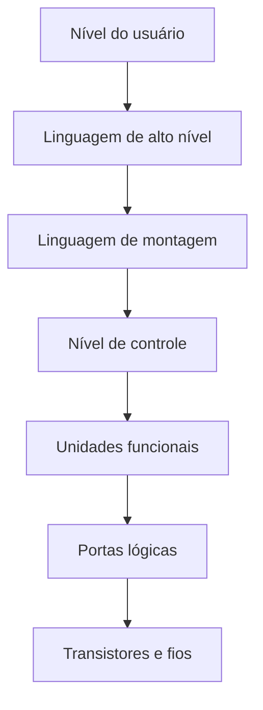
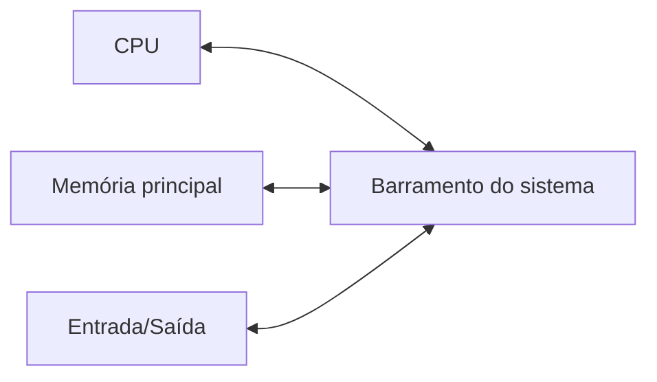
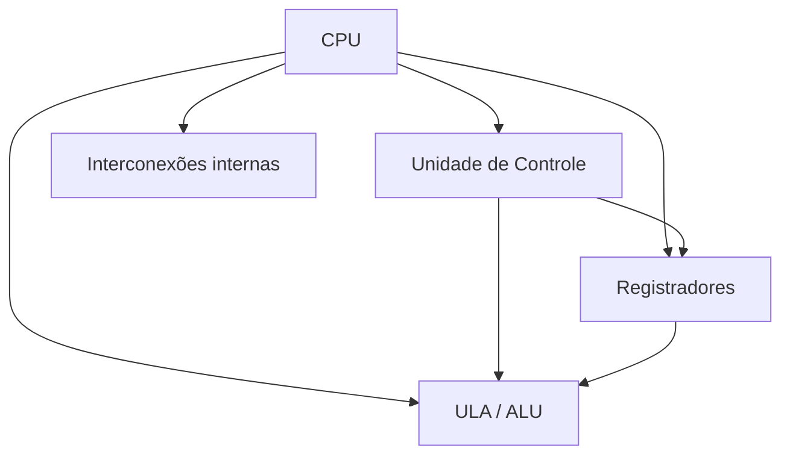
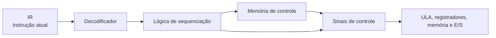
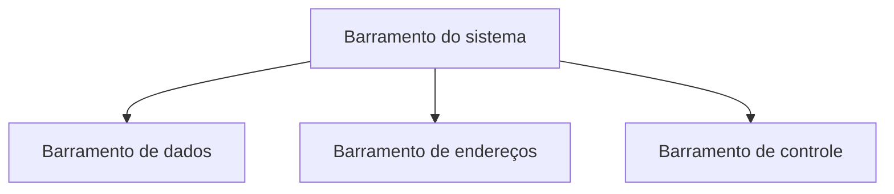
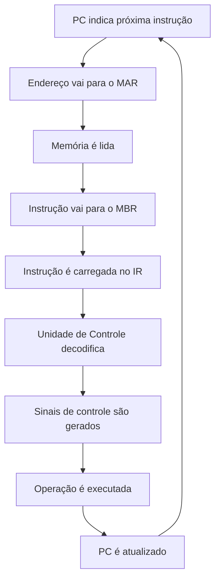
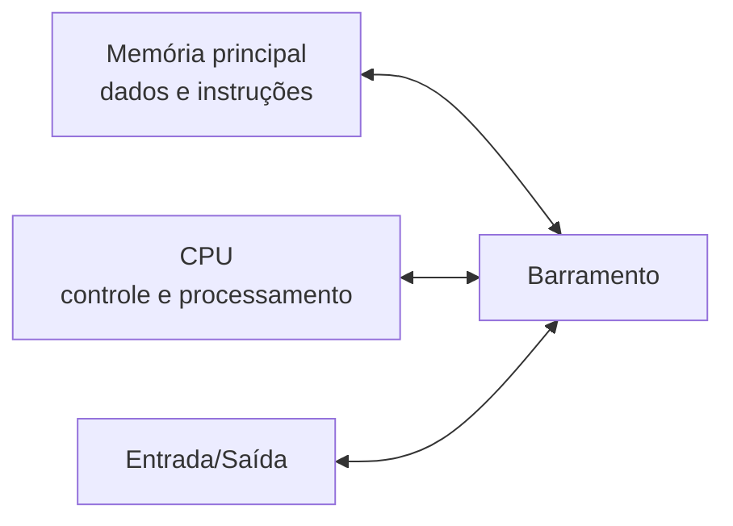
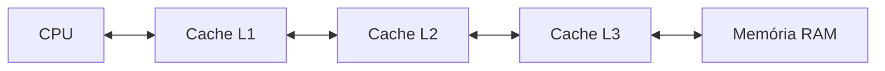

# Resumo 1.2 - Os principais componentes de um computador

# Os Principais Componentes de um Computador

## 1. Visão geral do sistema computacional

> [!info] Conceito
> Um sistema computacional é formado pela integração entre **hardware**, **software** e **peopleware**, trabalhando juntos para processar dados e gerar resultados.

Um computador não deve ser entendido apenas como uma “caixa fechada”. Ele é um sistema complexo formado por componentes interconectados, capazes de receber dados, armazená-los, processá-los e gerar novas informações. O **hardware** corresponde às partes físicas da máquina, como processador, memória, barramentos e dispositivos de entrada e saída. O **software** corresponde aos sistemas e programas que orientam o funcionamento da máquina. O **peopleware** representa os usuários que interagem com o sistema.

De forma simples, o computador recebe dados por dispositivos de entrada, armazena essas informações, executa programas por meio do processador e entrega resultados por dispositivos de saída ou por armazenamento.

> [!tip] Resumindo
> O computador funciona como um sistema organizado que recebe dados, processa informações, armazena resultados e controla a comunicação entre seus componentes.

---

## 2. Funções básicas do computador

> [!info] Conceito
> As funções básicas de um computador são **processamento**, **armazenamento**, **movimentação de dados** e **controle**.

O **processamento** é a transformação dos dados por meio de cálculos, comparações e operações lógicas. Essa função é realizada principalmente pela CPU, com apoio da ULA.

O **armazenamento** permite guardar dados e instruções. Ele pode ser temporário, como na memória RAM, ou permanente, como em discos rígidos e SSDs.

A **movimentação de dados** corresponde à transferência de informações entre os componentes do computador, como CPU, memória, dispositivos de entrada e saída e meios de armazenamento.

O **controle** coordena todas essas atividades. Ele garante que as instruções sejam executadas na ordem correta e que os componentes sejam acionados no momento adequado.

| Função | Explicação simples |
|---|---|
| Processamento | Transforma dados em novas informações |
| Armazenamento | Guarda dados e instruções |
| Movimentação | Transfere dados entre componentes |
| Controle | Coordena a execução das operações |

> [!tip] Resumindo
> O computador processa, armazena, movimenta dados e controla suas próprias operações para executar programas corretamente.

---

## 3. Níveis hierárquicos de um sistema computacional

> [!info] Conceito
> A hierarquia computacional organiza o sistema em camadas, desde o nível mais próximo do usuário até o nível físico dos circuitos eletrônicos.

A estrutura hierárquica ajuda a compreender como diferentes partes do computador se relacionam. O nível mais alto é aquele com o qual o usuário interage diretamente. O nível mais baixo corresponde aos componentes eletrônicos, como transistores e fios.

Essa visão é importante porque permite analisar problemas de desempenho, entender limitações do hardware e escolher melhor os recursos computacionais para cada necessidade.

| Nível | Função principal |
|---|---|
| Usuário | Inclui partes visíveis do computador e programas usados diretamente |
| Linguagem de alto nível | Onde programadores desenvolvem aplicações em linguagens mais próximas da linguagem humana |
| Linguagem de montagem | Nível mais próximo do hardware, com instruções interpretadas pelo processador |
| Controle | Envia sinais para coordenar registradores, memória, ULA e outros componentes |
| Unidades funcionais | Inclui registradores, ULA, memória e barramentos |
| Portas lógicas | Estrutura lógica usada para construir os circuitos |
| Transistores e fios | Base física e eletrônica do computador |

> [!tip] Resumindo
> A hierarquia mostra como o computador vai desde a interação do usuário até os circuitos eletrônicos que tornam o processamento possível.

---

## 4. Componentes básicos do computador

> [!info] Conceito
> Os principais componentes internos de um computador são **CPU**, **memória principal**, **entrada/saída** e **interconexão por barramentos**.

A **CPU**, ou unidade central de processamento, é responsável por controlar o computador e executar instruções. Ela é o núcleo do processamento.

A **memória principal** armazena dados e instruções usados durante a execução dos programas. No modelo de Von Neumann, dados e instruções ficam na mesma memória principal.

Os módulos de **entrada e saída** fazem a comunicação entre o computador e o meio externo. Eles permitem receber dados de dispositivos como teclado e mouse, além de enviar resultados para dispositivos como monitor e impressora.

A **interconexão** é o mecanismo de comunicação entre CPU, memória e entrada/saída. Normalmente, essa comunicação ocorre por barramentos.

> [!tip] Resumindo
> CPU, memória, entrada/saída e barramentos formam a estrutura básica de funcionamento do computador.

---

## 5. CPU: Unidade Central de Processamento

> [!info] Conceito
> A CPU é o componente responsável por executar instruções, controlar operações e coordenar o funcionamento geral do computador.

A CPU executa programas por meio de instruções armazenadas na memória. Ela busca uma instrução, interpreta seu significado e realiza a operação correspondente. Esse processo pode envolver cálculos, transferência de dados, acesso à memória ou comunicação com dispositivos de entrada e saída.

A CPU é formada por componentes internos principais:

| Componente | Função |
|---|---|
| Unidade de Controle | Coordena a execução das instruções |
| ULA / ALU | Realiza operações aritméticas e lógicas |
| Registradores | Guardam dados, endereços e instruções temporariamente |
| Interconexões internas | Permitem a comunicação entre os componentes da CPU |

> [!tip] Resumindo
> A CPU é o centro de processamento. Ela controla, interpreta e executa instruções com apoio da Unidade de Controle, da ULA e dos registradores.

---

## 6. Unidade de Controle

> [!info] Conceito
> A Unidade de Controle é a parte da CPU responsável por coordenar a execução das instruções.

A **Unidade de Controle**, também chamada de **UC** ou **CU**, não realiza cálculos diretamente. Sua função é interpretar instruções e gerar sinais de controle que comandam os demais componentes, como registradores, memória, ULA e dispositivos de entrada e saída.

Ela determina, por exemplo, quando um dado deve ser transferido, quando a memória deve ser lida, quando um registrador deve ser carregado e qual operação a ULA deve executar.

Em uma unidade de controle microprogramada, aparecem três elementos importantes:

| Elemento | Função |
|---|---|
| Memória de controle | Guarda microinstruções |
| Decodificadores | Interpretam o código da instrução |
| Lógica de sequenciação | Define a ordem das etapas internas |

> [!tip] Resumindo
> A Unidade de Controle funciona como o coordenador da CPU: ela interpreta instruções e envia sinais para que os componentes executem cada etapa corretamente.

---

## 7. ULA ou ALU

> [!info] Conceito
> A ULA é a unidade responsável pelas operações aritméticas e lógicas dentro da CPU.

A **ULA**, ou **Unidade Lógica e Aritmética**, realiza operações como soma, subtração, comparação, deslocamento de bits e operações lógicas. Ela é acionada pela Unidade de Controle, que define qual operação deve ser feita.

A ULA não decide sozinha o que executar. Ela recebe os comandos da Unidade de Controle e opera sobre dados armazenados nos registradores ou trazidos da memória.

> [!tip] Resumindo
> A Unidade de Controle comanda; a ULA executa as operações matemáticas e lógicas.

---

## 8. Registradores

> [!info] Conceito
> Registradores são pequenas áreas de armazenamento de alta velocidade localizadas dentro da CPU.

Os registradores guardam temporariamente dados, endereços e instruções usados durante o processamento. Eles são muito rápidos porque ficam dentro da CPU e participam diretamente do ciclo de execução das instruções.

| Registrador | Função |
|---|---|
| PC | Guarda o endereço da próxima instrução |
| IR / CIR | Guarda a instrução atual |
| MAR | Guarda o endereço de memória a ser acessado |
| MBR / MDR | Guarda temporariamente dados ou instruções transferidos entre CPU e memória |
| I/O AR | Guarda o endereço do dispositivo de entrada/saída |
| I/O BR | Guarda dados transferidos entre CPU e entrada/saída |
| IBR | Guarda a próxima instrução a ser executada no computador IAS |
| AC | Acumulador, usado para operandos e resultados da ULA |
| MQ | Multiplicador-quociente, usado em operações aritméticas no IAS |

> [!warning] Atenção
> O **MAR** guarda o endereço de memória. O **MBR/MDR** guarda o conteúdo transferido. Portanto, um indica “onde acessar” e o outro guarda “o que foi lido ou será gravado”.

> [!tip] Resumindo
> Registradores são memórias internas muito rápidas usadas pela CPU para controlar e executar instruções.

---

## 9. Barramentos

> [!info] Conceito
> Barramentos são caminhos de comunicação usados para transferir dados, endereços e sinais de controle entre os componentes do computador.

Um barramento é uma estrutura compartilhada de comunicação. Ele permite que CPU, memória e dispositivos de entrada/saída troquem informações. Como é compartilhado, normalmente apenas um dispositivo por vez usa o barramento para transmitir dados.

Os principais tipos são:

| Barramento | Função |
|---|---|
| Barramento de dados | Transporta dados e instruções |
| Barramento de endereços | Transporta a localização onde o dado está ou será armazenado |
| Barramento de controle | Transporta comandos e sinais de sincronização |

O barramento de controle pode transmitir sinais como leitura de memória, escrita de memória, leitura de entrada/saída, escrita de entrada/saída, confirmação de transferência, solicitação de barramento, concessão de barramento, requisição de interrupção, confirmação de interrupção, clock e reset.

> [!warning] Atenção
> O barramento de endereços não transporta o dado em si; ele transporta apenas a localização do dado.

> [!tip] Resumindo
> Barramentos funcionam como vias internas de comunicação entre CPU, memória e dispositivos de entrada e saída.

---

## 10. Ciclo de instrução

> [!info] Conceito
> O ciclo de instrução é a sequência repetida pela CPU para buscar e executar instruções.

O processamento principal do computador ocorre pela execução de programas. Um programa é um conjunto de instruções armazenadas na memória. A CPU executa essas instruções por meio de ciclos repetidos.

O ciclo pode ser entendido em duas grandes etapas: **busca** e **execução**. Na busca, a CPU obtém a próxima instrução da memória. Na execução, a instrução é interpretada e realizada.

As instruções podem envolver diferentes categorias:

| Categoria | Explicação |
|---|---|
| Processador-memória | Transferência de dados entre CPU e memória |
| Processador-E/S | Transferência de dados entre CPU e dispositivos de entrada/saída |
| Processamento de dados | Operações aritméticas ou lógicas |
| Controle | Alteração da sequência de execução, como desvios |

> [!tip] Resumindo
> A CPU busca, decodifica e executa instruções continuamente enquanto o computador está em funcionamento.

---

## 11. Interrupções

> [!info] Conceito
> Interrupções são mecanismos que permitem que dispositivos ou eventos interrompam temporariamente o processamento normal da CPU.

Como muitos dispositivos externos são mais lentos que o processador, o computador usa interrupções para sinalizar eventos importantes. Assim, a CPU não precisa ficar sempre esperando passivamente por um dispositivo.

As principais classes de interrupções apresentadas são:

| Classe | Explicação |
|---|---|
| Programa | Ocorre por resultado de instrução, como divisão por zero, overflow ou instrução ilegal |
| Timer | Gerada com base no clock, permitindo ações periódicas |
| Entrada/Saída | Indica término de operação ou erro em dispositivo de E/S |
| Falha de hardware | Indica problemas como falta de energia ou erro de paridade de memória |

> [!tip] Resumindo
> Interrupções permitem que a CPU responda a eventos importantes sem perder eficiência no processamento.

---

## 12. Arquitetura de Von Neumann

> [!info] Conceito
> A arquitetura de Von Neumann organiza o computador com **programas e dados armazenados na mesma memória principal**.

A grande inovação desse modelo foi o conceito de **programa armazenado**. Antes, computadores como o ENIAC exigiam configurações manuais por fios, relés e chaves para executar determinadas tarefas. Com a arquitetura de Von Neumann, tornou-se possível armazenar instruções na memória e executar diferentes programas sem reconfigurar fisicamente a máquina.

Esse modelo estabeleceu uma estrutura composta por memória, unidade aritmética e lógica, unidade de controle e unidades de entrada/saída. Ele tornou os computadores mais flexíveis, programáveis e eficientes.

> [!warning] Atenção
> No modelo de Von Neumann, dados e instruções compartilham a mesma memória principal. Essa característica é essencial para entender o conceito de programa armazenado.

> [!tip] Resumindo
> A arquitetura de Von Neumann permitiu que programas fossem guardados na memória, tornando os computadores mais flexíveis e automatizados.

---

## 13. Computador IAS

> [!info] Conceito
> O computador IAS foi uma implementação importante associada ao modelo de Von Neumann.

O computador IAS foi construído a partir de um projeto iniciado em 1946 e concluído em 1952. Sua memória possuía mil espaços chamados **palavras**, cada uma com 40 bits. Cada palavra podia armazenar dados ou duas instruções de 20 bits. Cada instrução tinha 8 bits para o código da operação e 12 bits para o endereço de memória.

No IAS, a CPU era composta por uma unidade de controle do programa e uma unidade lógica e aritmética. Os dados e instruções eram armazenados na memória principal e transferidos entre memória, CPU e entrada/saída.

Os registradores do IAS incluíam MBR, MAR, IR, IBR, PC, AC e MQ. O **AC** e o **MQ** aparecem como registradores usados para operandos e resultados da ULA, especialmente em operações aritméticas.

O conjunto de instruções do IAS era pequeno e podia ser agrupado em cinco tipos:

| Tipo de instrução | Função |
|---|---|
| Transferência de dados | Move dados entre memória e registradores |
| Desvio incondicional | Altera diretamente a próxima instrução a ser executada |
| Desvio condicional | Altera o fluxo se uma condição for satisfeita |
| Aritmética | Aciona operações lógicas e aritméticas |
| Modificação de endereço | Altera campos de endereço em instruções armazenadas |

> [!tip] Resumindo
> O IAS mostra, de forma histórica e concreta, como dados, instruções, registradores, memória, ULA e controle se integram em uma arquitetura baseada no programa armazenado.

---

## 14. Memória cache

> [!info] Conceito
> A memória cache é uma memória muito rápida, próxima ou interna ao processador, usada para armazenar dados e instruções acessados com frequência.

A CPU costuma ser muito mais rápida que a memória RAM. Se o processador precisasse buscar todos os dados diretamente na RAM, haveria atrasos constantes. A cache reduz esse problema ao manter informações frequentemente usadas mais próximas da CPU.

A cache não substitui a memória principal. Ela funciona como uma camada intermediária entre CPU e RAM.

| Nível de cache | Característica principal |
|---|---|
| L1 | Mais rápida, menor e mais próxima do núcleo da CPU |
| L2 | Maior que a L1, mas um pouco mais lenta |
| L3 | Maior, normalmente compartilhada entre núcleos e último nível antes da RAM |

A cache trabalha com dois princípios principais:

| Princípio | Explicação |
|---|---|
| Localidade temporal | Um dado usado recentemente pode ser usado novamente em breve |
| Localidade espacial | Dados próximos ao dado acessado também podem ser usados em seguida |

Quando a CPU encontra o dado na cache, ocorre um **cache hit**. Quando não encontra, ocorre um **cache miss**, e o sistema precisa buscar o dado em um nível mais lento, como outra cache ou a RAM.

> [!warning] Atenção
> Não basta avaliar apenas clock do processador ou quantidade de RAM. O tipo, o tamanho e a organização da cache também influenciam o desempenho.

> [!tip] Resumindo
> A cache aproxima da CPU os dados mais usados, reduzindo acessos à RAM e melhorando o desempenho do computador.

---

## 15. Gargalo de Von Neumann

> [!info] Conceito
> O gargalo de Von Neumann ocorre pela diferença de velocidade entre a CPU e a memória principal.

No modelo de Von Neumann, dados e instruções ficam na memória principal. A CPU precisa buscar essas informações para executar os programas. Como a CPU é muito rápida e a RAM é relativamente mais lenta, o processador pode ficar aguardando dados e instruções.

A memória cache ajuda a reduzir esse gargalo porque armazena informações frequentemente usadas em níveis mais próximos da CPU.

> [!tip] Resumindo
> O gargalo de Von Neumann é a limitação causada pela troca constante de informações entre CPU e memória. A cache reduz esse impacto.

---

## 16. Aplicação prática: análise de desempenho

> [!info] Conceito
> Problemas de desempenho devem ser analisados considerando diferentes níveis do sistema computacional.

No caso prático apresentado, um técnico analisa computadores usados para simulações científicas em uma escola. Mesmo com boas configurações de hardware, as máquinas apresentavam lentidão. O problema não estava apenas na capacidade física dos computadores, mas na interação entre hardware, sistema operacional, drivers e aplicações.

A análise foi organizada em três níveis:

| Nível | O que foi analisado |
|---|---|
| Físico | RAM, barramentos, clock, conexões internas e armazenamento |
| Lógico | Sistema operacional, drivers, linguagem de máquina e compatibilidade |
| Aplicação | Softwares de simulação, dados, interfaces e configurações dos programas |

As melhorias incluíram manutenção física, aumento de RAM, substituição de HD por SSD, atualização do sistema operacional e drivers, remoção de programas desnecessários, verificação de malwares e reorganização de arquivos.

> [!warning] Atenção
> Um computador lento não tem necessariamente problema apenas no hardware. A causa pode estar na integração entre níveis físicos, lógicos e de aplicação.

> [!tip] Resumindo
> A análise por níveis permite identificar gargalos com mais precisão e aplicar soluções mais eficientes.

---

## 17. Aplicação prática: escolha de computador

> [!info] Conceito
> A escolha de um computador deve considerar processamento, memória, armazenamento, entrada/saída e desempenho gráfico conforme a tarefa desejada.

Para um estúdio de design gráfico, a melhor opção apresentada foi o **Desktop Dell Inspiron**, com Intel Core i7, 16 GB de RAM, 1 TB HD, 256 GB SSD e placa de vídeo dedicada NVIDIA GeForce GTX 1660.

Essa escolha é adequada porque tarefas como edição de imagens, renderização de vídeos e multitarefa com softwares pesados exigem bom processamento, memória suficiente, armazenamento rápido e capacidade gráfica dedicada.

O equipamento também se relaciona ao modelo de Von Neumann porque possui CPU, memória, armazenamento e dispositivos de entrada/saída interligados por barramentos.

> [!tip] Resumindo
> Para tarefas gráficas pesadas, o computador mais adequado é aquele que combina bom processador, memória suficiente, armazenamento rápido e placa de vídeo dedicada.

---

## 18. Pontos importantes para exercícios

> [!info] Conceito
> Os exercícios reforçam a relação entre níveis hierárquicos, controle, registradores, programa armazenado e execução de instruções.

Os principais pontos cobrados nos exercícios são:

- O **nível de controle** coordena transferências entre registradores, memória e ULA por meio de sinais de controle.
- O **nível de unidades funcionais** reúne registradores, ULA, memória e barramentos.
- O programador que usa linguagens como C ou Python atua no **nível de linguagem de alto nível**.
- O **nível de montagem** está mais próximo do hardware e envolve instruções executadas pelo processador.
- O **nível do usuário** envolve os elementos com os quais o usuário interage diretamente.
- O **IR** guarda a instrução buscada da memória antes da decodificação.
- O **PC** aponta para a próxima instrução, mas pode ser alterado por instruções de desvio.
- O conceito de **programa armazenado** permitiu guardar instruções na memória, tornando a execução mais rápida e flexível.
- Em desvios condicionais, a instrução é carregada no IR, uma condição é avaliada e, se atendida, o PC recebe um novo endereço.

> [!tip] Resumindo
> As questões destacam que a CPU depende de controle, registradores, barramentos e memória para buscar, interpretar e executar instruções corretamente.

---

## Síntese final

> [!summary] Síntese
> Um computador é um sistema formado por componentes físicos, programas e usuários. Internamente, ele realiza processamento, armazenamento, movimentação de dados e controle. A CPU executa instruções com apoio da Unidade de Controle, da ULA e dos registradores. A memória guarda dados e programas, enquanto os dispositivos de entrada e saída permitem a comunicação com o meio externo. Os barramentos interligam esses componentes e transportam dados, endereços e sinais de controle.
>
> A arquitetura de Von Neumann é essencial para compreender os computadores modernos porque introduziu o conceito de programa armazenado, permitindo que dados e instruções ocupem a memória principal. O computador IAS exemplifica essa lógica por meio de registradores, memória, ULA, unidade de controle e instruções organizadas. A memória cache, embora seja uma otimização moderna, ajuda a reduzir o gargalo entre CPU e RAM, melhorando o desempenho. Por fim, compreender os níveis hierárquicos do sistema computacional permite diagnosticar problemas, escolher equipamentos adequados e entender como cada camada contribui para o funcionamento da máquina.