# Resumo 1.2 - Os principais componentes de um computador

# Os principais componentes de um computador

## 1. Visão geral do sistema computacional

> [!info] Conceito
> Um sistema computacional é formado por componentes interligados que trabalham juntos para processar dados e gerar informações úteis.

Um computador não funciona apenas como um conjunto isolado de peças. Ele faz parte de um **sistema computacional**, composto por **hardware**, **software** e **peopleware**. O **hardware** corresponde aos componentes físicos, como processador, memória, teclado, monitor, HD e SSD. O **software** corresponde aos sistemas e programas que controlam o funcionamento da máquina. O **peopleware** representa os usuários e profissionais que utilizam, configuram ou mantêm o sistema.

O funcionamento do computador depende da interação entre esses elementos. Os dados entram por dispositivos de entrada, são armazenados, processados pelo processador e depois enviados para dispositivos de saída, armazenados novamente ou transmitidos para outros sistemas.

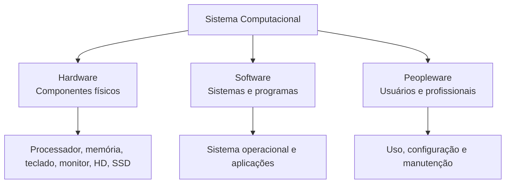

> [!tip] Resumindo
> O computador é parte de um sistema maior, em que hardware, software e usuários atuam de forma integrada para transformar dados em informações.

---

## 2. Funções básicas do computador

> [!info] Conceito
> As funções básicas do computador são processamento, armazenamento, movimentação de dados e controle.

O **processamento de dados** é a função responsável por transformar dados em novos resultados. Isso pode envolver cálculos, comparações, operações lógicas e manipulação de informações. Essa função é realizada principalmente pelo processador.

O **armazenamento de dados** permite guardar informações temporariamente ou permanentemente. A memória principal armazena dados e instruções em uso durante a execução dos programas, enquanto dispositivos como HDs e SSDs guardam informações por mais tempo.

A **movimentação de dados** corresponde ao transporte das informações entre os componentes do computador. Os dados precisam circular entre entrada, saída, memória, processador e dispositivos de armazenamento.

O **controle** coordena as demais funções. Ele garante que as operações ocorram na ordem correta, que os componentes sejam acionados no momento adequado e que as instruções sejam executadas corretamente.

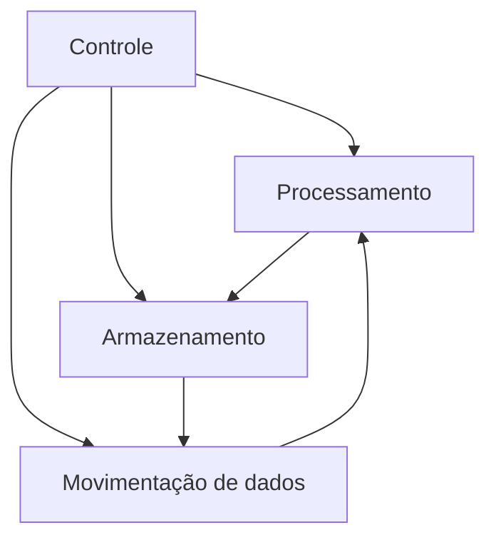

> [!tip] Resumindo
> O computador recebe dados, armazena informações, processa instruções, movimenta dados entre componentes e controla a execução das tarefas.

---

## 3. Componentes internos principais

> [!info] Conceito
> Os principais componentes internos de um computador são CPU, memória principal, entrada/saída e interconexão.

A **CPU**, ou Unidade Central de Processamento, é o componente responsável por controlar o computador e executar as instruções dos programas. Ela é frequentemente chamada apenas de **processador**.

A **memória principal** armazena dados e instruções utilizados durante o processamento. Ela permite que o processador acesse rapidamente as informações necessárias para executar os programas.

Os módulos de **entrada/saída**, também chamados de **E/S**, permitem a comunicação entre o computador e o meio externo. Dispositivos de entrada enviam dados ao computador, como teclado e mouse. Dispositivos de saída apresentam resultados ao usuário, como monitor e impressora. Alguns dispositivos podem atuar como entrada e saída, como HD, SSD, pendrive e placa de rede.

A **interconexão** é o mecanismo de comunicação entre CPU, memória e dispositivos de entrada/saída. Normalmente, essa comunicação ocorre por meio de **barramentos**, que são caminhos físicos usados para transportar dados, endereços e sinais de controle.

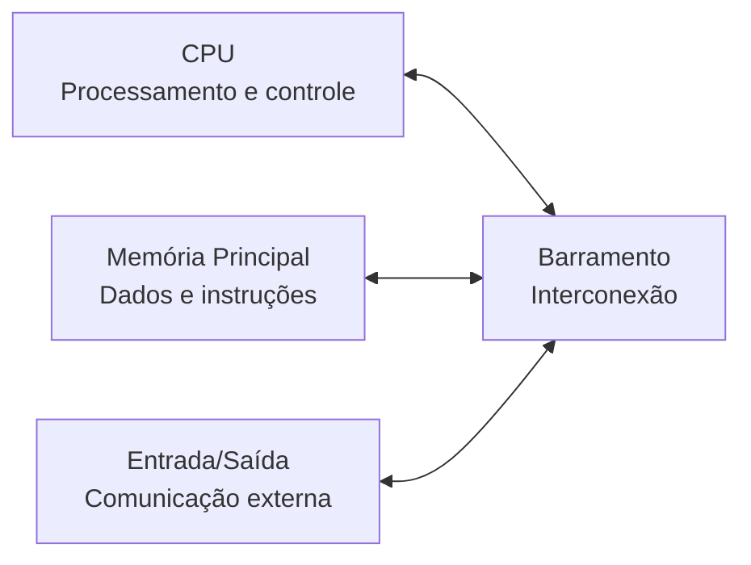

> [!tip] Resumindo
> A CPU processa e controla; a memória armazena; a entrada/saída comunica o computador com o exterior; e os barramentos interligam os componentes.

---

## 4. Hierarquia de um sistema computacional

> [!info] Conceito
> A hierarquia computacional organiza o computador em níveis, do mais próximo do usuário ao mais próximo dos circuitos eletrônicos.

O computador é um sistema complexo. Para compreendê-lo melhor, ele pode ser analisado em níveis hierárquicos. O nível mais alto é aquele mais próximo do usuário, enquanto o nível mais baixo corresponde aos componentes eletrônicos internos.

O **nível do usuário** envolve as partes visíveis do computador e os programas utilizados diretamente. É o nível dos aplicativos, interfaces e periféricos.

O **nível da linguagem de alto nível** é usado por programadores que desenvolvem aplicações em linguagens mais próximas da linguagem humana, como C ou Python.

O **nível da linguagem de montagem**, ou linguagem de máquina, está mais próximo do processador. Nesse nível, as instruções são interpretadas e executadas pelo hardware.

O **nível de controle** envolve a Unidade de Controle, responsável por enviar sinais que coordenam transferências de dados entre registradores, memória e outros componentes, além de selecionar operações na ULA.

O **nível de unidades funcionais** reúne elementos como registradores, ULA, memória e barramentos. Esses componentes participam diretamente da execução e transferência das operações do sistema.

O **nível das portas lógicas** corresponde à estrutura lógica dos componentes digitais. Já o **nível de transistores e fios** representa a base física mais baixa, onde os circuitos são implementados eletronicamente.

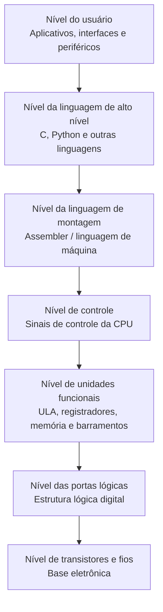

> [!warning] Atenção
> Linguagens como C ou Python não operam no nível das portas lógicas. Elas pertencem ao nível de linguagem de alto nível.

> [!tip] Resumindo
> A hierarquia computacional permite entender o computador em camadas, desde os programas usados pelo usuário até os circuitos eletrônicos que executam operações básicas.

---

## 5. Níveis físico, lógico e de aplicação na análise prática

> [!info] Conceito
> A análise por níveis ajuda a diagnosticar problemas de desempenho de forma mais precisa.

No material prático, o desempenho de computadores usados para simulações científicas foi analisado considerando três níveis principais: **físico**, **lógico** e **de aplicação**.

O **nível físico** corresponde ao hardware e inclui elementos como memória RAM, barramentos, clock do processador, conexões internas e dispositivos de armazenamento. Melhorias nesse nível podem envolver aumento de RAM, substituição de HD por SSD, limpeza preventiva e verificação das conexões.

O **nível lógico** envolve o sistema operacional, drivers, linguagem de máquina e compatibilidade entre software e hardware. Problemas nesse nível podem causar lentidão mesmo quando o hardware é adequado. Atualizar drivers, otimizar a inicialização e corrigir incompatibilidades são exemplos de ações nesse nível.

O **nível de aplicação** corresponde aos programas utilizados diretamente pelos usuários. Inclui simuladores, editores, configurações dos softwares e organização dos arquivos. Softwares mal configurados, obsoletos ou pesados demais podem comprometer o desempenho geral.

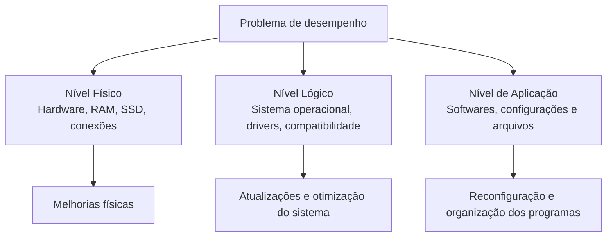

> [!warning] Atenção
> Nem sempre um computador lento tem problema apenas no hardware. A lentidão pode estar na interação entre hardware, sistema operacional, drivers e aplicativos.

> [!tip] Resumindo
> Avaliar um computador por níveis permite identificar se o gargalo está no hardware, no sistema operacional, nos drivers ou nos programas utilizados.

---

## 6. CPU: Unidade Central de Processamento

> [!info] Conceito
> A CPU é o centro de processamento e controle do computador.

A **CPU** executa as instruções dos programas, processa dados e coordena a comunicação com memória e dispositivos de entrada/saída. Ela é composta por elementos internos que trabalham em conjunto.

A **Unidade de Controle (UC)** coordena o funcionamento da CPU e do computador. Ela interpreta instruções, emite sinais de controle e organiza a sequência de execução.

A **Unidade Lógica e Aritmética (ULA)** realiza operações aritméticas e lógicas, como soma, subtração, comparação e operações com bits.

Os **registradores** são pequenas áreas de armazenamento de alta velocidade localizadas dentro da CPU. Eles guardam temporariamente dados, endereços e instruções usados durante o processamento.

As **interconexões da CPU** são caminhos internos que permitem a comunicação entre Unidade de Controle, ULA e registradores.

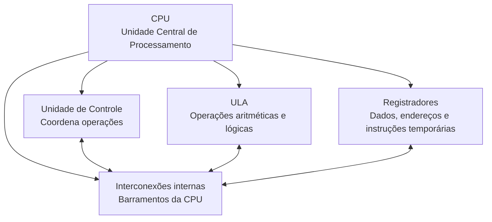

> [!tip] Resumindo
> A CPU busca instruções, interpreta comandos, executa operações e coordena o funcionamento dos demais componentes do computador.

---

## 7. Unidade de Controle

> [!info] Conceito
> A Unidade de Controle é o componente da CPU responsável por organizar e comandar a execução das instruções.

A **Unidade de Controle (UC)** não realiza diretamente os cálculos. Sua função é coordenar as ações internas da CPU. Ela decide quando buscar uma instrução, quais registradores serão usados, se a memória será lida ou gravada, se a ULA será acionada e se o fluxo normal do programa deve continuar ou desviar para outro endereço.

A UC emite **sinais de controle**, que são comandos internos usados para acionar componentes. Esses sinais podem ordenar leitura de memória, gravação em memória, carregamento de registrador, incremento do contador de programa, acionamento da ULA ou comunicação com dispositivos de entrada/saída.

A Unidade de Controle pode ser implementada de forma **cabeada** ou **microprogramada**. Na UC cabeada, os sinais são gerados por circuitos lógicos fixos, o que tende a ser rápido, mas menos flexível. Na UC microprogramada, os sinais são gerados a partir de microinstruções armazenadas em uma memória de controle, o que oferece mais flexibilidade.

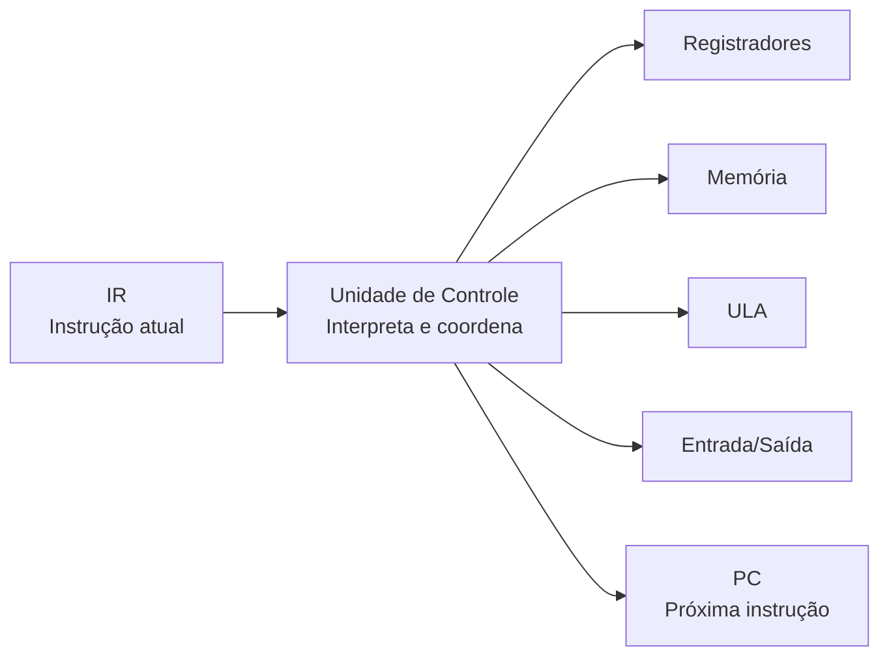

> [!tip] Resumindo
> A Unidade de Controle funciona como o “maestro” da CPU: ela não executa os cálculos, mas determina quais componentes devem agir e em qual ordem.

---

## 8. Unidade de Controle microprogramada

> [!info] Conceito
> A Unidade de Controle microprogramada usa microinstruções armazenadas em uma memória interna para gerar sinais de controle.

Na UC microprogramada, uma instrução da máquina é dividida em etapas menores chamadas **microinstruções**. Essas microinstruções ficam armazenadas na **memória de controle** e indicam os passos internos necessários para executar uma instrução.

A **memória de controle** guarda a sequência de microinstruções. O **decodificador de instruções** interpreta a instrução armazenada no registrador de instrução e identifica qual operação deve ser realizada. A **lógica de sequenciação** decide qual microinstrução será executada em seguida.

Também podem participar desse processo o **registrador de endereço de controle**, que indica o endereço da próxima microinstrução, e o **registrador de microinstrução**, que guarda a microinstrução atual. O **gerador de sinais de controle** transforma os campos da microinstrução em comandos reais para a CPU.

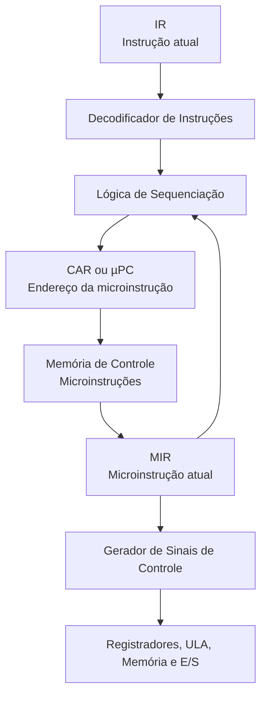

> [!tip] Resumindo
> Na UC microprogramada, o decodificador identifica a instrução, a memória de controle guarda como executá-la e a lógica de sequenciação define qual passo vem depois.

---

## 9. Registradores da CPU

> [!info] Conceito
> Registradores são pequenas áreas de armazenamento muito rápidas localizadas dentro da CPU.

Os registradores armazenam temporariamente informações usadas durante a execução das instruções. Eles são mais rápidos que a memória principal e por isso são usados em etapas críticas do processamento.

O **PC**, ou **Contador de Programa**, guarda o endereço da próxima instrução a ser buscada na memória. Ele funciona como um marcador que indica onde o programa deve continuar.

O **IR**, ou **Registrador de Instrução**, guarda a instrução atual depois que ela é buscada da memória. A Unidade de Controle lê essa instrução para saber qual operação deve ser realizada.

O **MAR**, ou **Registrador de Endereço de Memória**, guarda o endereço da posição de memória que será acessada. Ele não guarda o dado, apenas indica onde o dado ou a instrução está.

O **MBR**, ou **Registrador de Buffer de Memória**, guarda temporariamente o conteúdo transferido entre a CPU e a memória. Ele pode conter uma instrução lida, um dado lido ou um dado que será gravado.

O **IBR**, ou **Registrador de Buffer de Instrução**, aparece no contexto do computador IAS e serve para conter a próxima instrução a ser executada.

O **AC**, ou acumulador, e o **MQ**, ou quociente multiplicador, também aparecem no IAS e registram operandos e resultados da ULA.

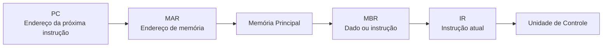

> [!warning] Atenção
> O MAR indica o endereço de memória, enquanto o MBR guarda o conteúdo transferido. O IR guarda a instrução atual, mas não executa a instrução sozinho.

> [!tip] Resumindo
> Registradores aceleram o processamento porque guardam temporariamente endereços, instruções e dados dentro da própria CPU.

---

## 10. Barramentos

> [!info] Conceito
> Barramentos são caminhos de comunicação usados para transportar dados, endereços e sinais de controle entre os componentes do computador.

O **barramento de dados** transporta os dados propriamente ditos. Ele pode levar uma instrução da memória para a CPU, um número para ser processado ou um resultado para ser armazenado.

O **barramento de endereços** transporta a localização da memória ou do dispositivo que será acessado. Ele indica onde o dado está ou para onde ele deve ir, mas não carrega o dado em si.

O **barramento de controle** transporta comandos e sinais de sincronização. Ele pode indicar leitura de memória, escrita de memória, leitura de entrada/saída, escrita de entrada/saída, interrupção, confirmação de operação, clock ou reset.

Um barramento é um meio compartilhado. Vários dispositivos podem estar conectados a ele, mas somente um dispositivo por vez utiliza o barramento para transmitir dados.

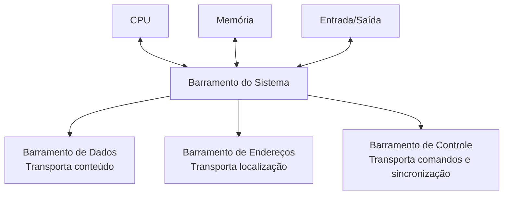

> [!warning] Atenção
> O barramento de endereços não transporta o conteúdo dos dados. Ele transporta apenas a localização que será acessada.

> [!tip] Resumindo
> Dados circulam pelo barramento de dados, localizações circulam pelo barramento de endereços e comandos circulam pelo barramento de controle.

---

## 11. Ciclo de instrução

> [!info] Conceito
> O ciclo de instrução é a sequência repetida pela CPU para buscar, interpretar e executar instruções.

O processamento principal do computador ocorre pela execução de programas. Um programa é formado por instruções armazenadas na memória. A CPU executa essas instruções repetindo o ciclo de instrução.

O ciclo começa com a **busca**. O PC contém o endereço da próxima instrução. Esse endereço é usado para acessar a memória, a instrução é lida e carregada no IR.

Depois ocorre a **decodificação**. A Unidade de Controle interpreta a instrução presente no IR e identifica qual operação deve ser feita.

Em seguida ocorre a **execução**. A CPU realiza a operação indicada, que pode envolver transferência de dados entre processador e memória, comunicação com entrada/saída, operação aritmética ou lógica na ULA, ou alteração da sequência de execução do programa.

Ao final, o PC normalmente é atualizado para apontar para a próxima instrução. Quando há uma instrução de desvio, o PC pode receber outro endereço.

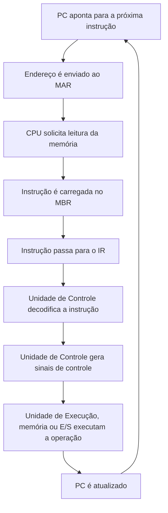

> [!tip] Resumindo
> A CPU trabalha repetindo o ciclo: buscar a instrução, decodificar o comando, executar a operação e atualizar o próximo endereço.

---

## 12. Tipos de instruções executadas pelo processador

> [!info] Conceito
> As instruções indicam à CPU que tipo de operação deve ser realizada.

As instruções podem envolver transferência entre **processador e memória**, quando dados são lidos ou gravados na memória.

Também podem envolver transferência entre **processador e entrada/saída**, quando dados circulam entre a CPU e dispositivos periféricos.

Outra categoria é o **processamento de dados**, quando a CPU realiza operações aritméticas ou lógicas com os dados.

Há ainda instruções de **controle**, que alteram a sequência normal de execução. Nesse caso, o PC pode ser modificado para que o programa continue em outro endereço.

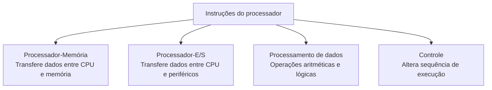

> [!tip] Resumindo
> As instruções podem mover dados, acessar dispositivos, realizar cálculos ou controlar o fluxo de execução do programa.

---

## 13. Interrupções

> [!info] Conceito
> Interrupções são mecanismos que permitem que dispositivos ou eventos interrompam temporariamente o processamento normal da CPU.

Como muitos dispositivos externos são mais lentos que o processador, a CPU pode solicitar uma operação e aguardar um sinal de retorno. Esse sinal pode ser feito por meio de uma interrupção.

As interrupções de **programa** surgem de situações causadas pela execução de instruções, como divisão por zero, overflow aritmético, instrução ilegal ou tentativa de acesso a uma área de memória não permitida.

As interrupções de **timer** são geradas pelo clock do processador e permitem a execução periódica de determinadas funções.

As interrupções de **entrada/saída** são geradas por controladores de E/S para indicar o término de uma operação ou uma condição de erro.

As interrupções por **falha de hardware** indicam problemas como falta de energia ou erro de paridade de memória.

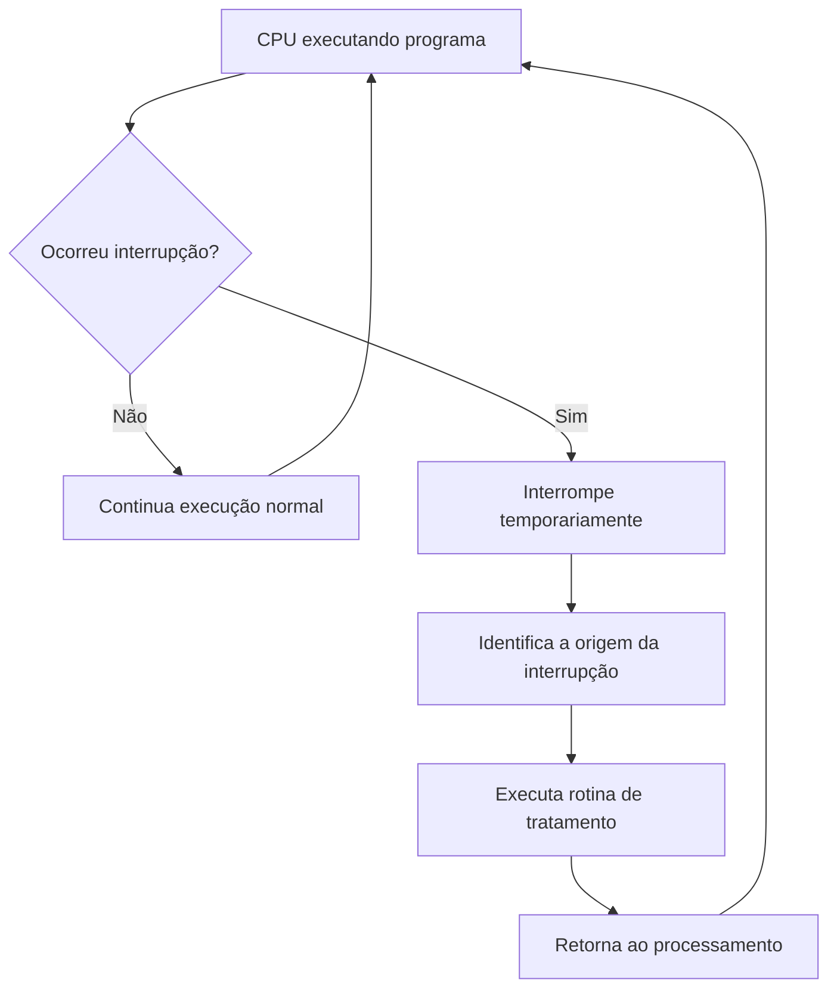

> [!tip] Resumindo
> Interrupções permitem que a CPU responda a eventos importantes sem precisar verificar continuamente cada dispositivo.

---

## 14. Arquitetura de Von Neumann

> [!info] Conceito
> A arquitetura de Von Neumann organiza o computador de modo que dados e instruções sejam armazenados na mesma memória e processados por uma unidade central.

A arquitetura de Von Neumann foi uma mudança importante na história da computação. Antes, computadores como o ENIAC dependiam de conexões manuais com fios, relés e chaves para executar tarefas diferentes. Com o modelo de programa armazenado, tornou-se possível guardar instruções na memória e executar diferentes programas sem reconfigurar fisicamente a máquina.

Nesse modelo, o computador é organizado em grandes blocos: **memória**, **Unidade de Controle**, **Unidade Lógica e Aritmética**, **entrada/saída** e mecanismos de transferência de dados.

A memória armazena tanto dados quanto instruções. A Unidade de Controle organiza a sequência de execução. A ULA realiza operações aritméticas e lógicas. Os dispositivos de entrada/saída permitem a comunicação com o exterior. Os barramentos fazem a ligação entre esses componentes.

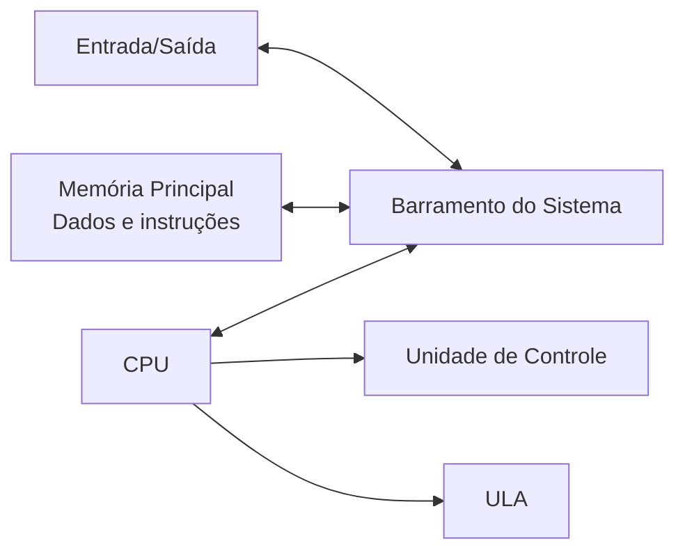

> [!tip] Resumindo
> A grande contribuição da arquitetura de Von Neumann foi permitir que programas e dados fossem armazenados na memória, tornando os computadores mais flexíveis e programáveis.

---

## 15. Modelo de Von Neumann e programa armazenado

> [!info] Conceito
> Programa armazenado significa que as instruções do programa ficam guardadas na memória do computador.

O conceito de **programa armazenado** permitiu que as instruções fossem acessadas rapidamente pela CPU. Antes disso, as instruções podiam depender de cartões perfurados ou configurações manuais. Com o armazenamento interno, o computador passou a executar programas com mais velocidade e flexibilidade.

Esse princípio também permitiu que o computador tratasse instruções como dados. Isso abriu caminho para ferramentas como montadores, compiladores e outros mecanismos de automação da programação.

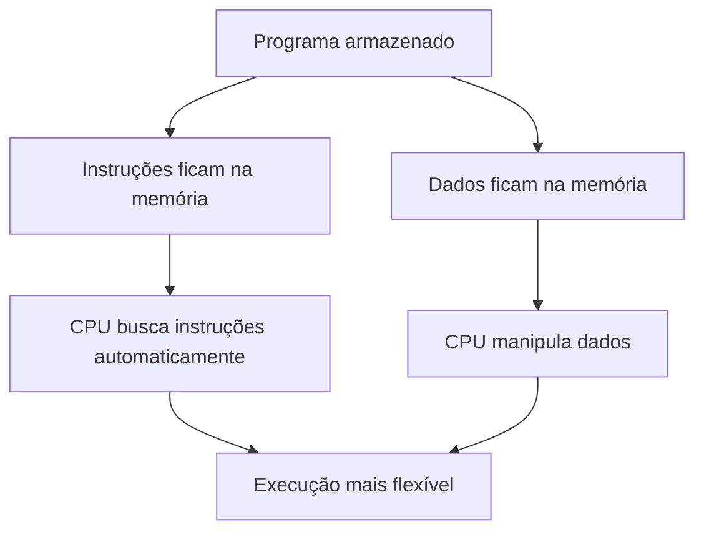

> [!warning] Atenção
> O conceito de programa armazenado não eliminou o armazenamento de dados. Pelo contrário, reforçou a importância da memória para guardar tanto dados quanto instruções.

> [!tip] Resumindo
> O programa armazenado tornou os computadores mais eficientes, pois as instruções passaram a ficar disponíveis na memória interna para execução automática.

---

## 16. Computador IAS

> [!info] Conceito
> O computador IAS foi uma implementação importante baseada na arquitetura de Von Neumann.

O computador IAS, desenvolvido no Institute for Advanced Studies de Princeton, seguia a lógica do modelo de Von Neumann. Sua memória possuía mil posições, chamadas de **palavras**, cada uma com 40 bits. Essas palavras podiam armazenar dados ou instruções em formato binário.

Uma palavra podia conter duas instruções de 20 bits. Cada instrução era formada por um **opcode**, que indicava a operação, e por um campo de endereço, que indicava a posição de memória envolvida.

No IAS, os registradores tinham funções específicas. O **MBR** guardava uma palavra transferida entre memória, E/S ou CPU. O **MAR** guardava o endereço da palavra a ser lida ou escrita. O **IR** guardava o código da instrução em execução. O **IBR** armazenava a próxima instrução. O **PC** indicava o endereço do próximo par de instruções. O **AC** e o **MQ** guardavam operandos e resultados da ULA.

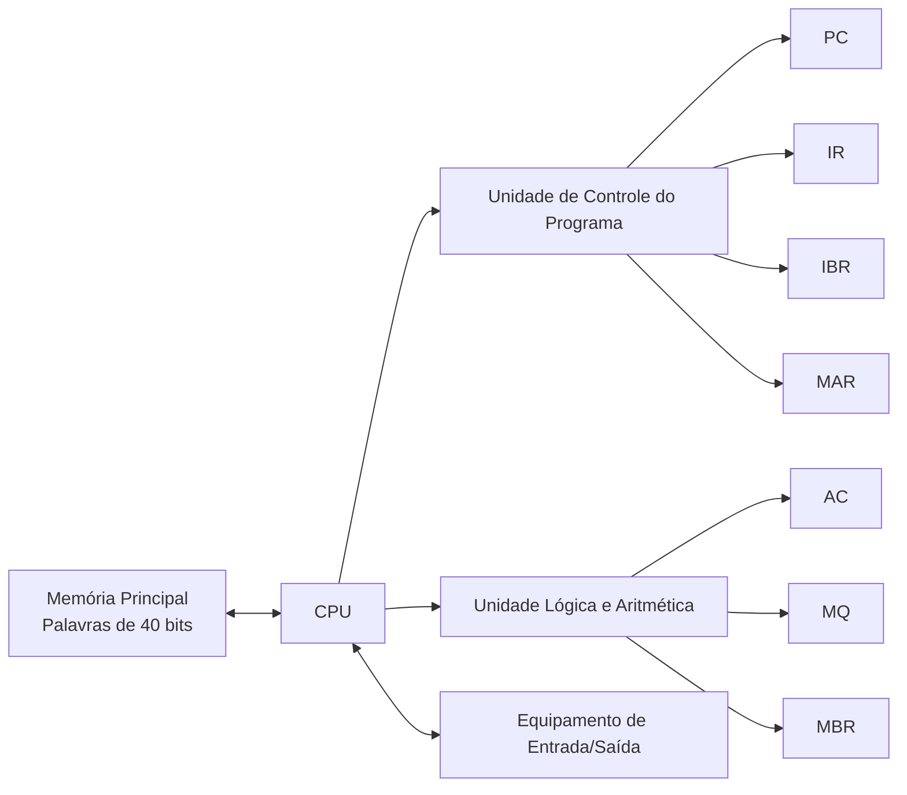

> [!tip] Resumindo
> O IAS demonstrou na prática a organização de memória, registradores, controle, ULA e entrada/saída proposta pela arquitetura de Von Neumann.

---

## 17. Tipos de instruções do IAS

> [!info] Conceito
> As instruções do IAS eram agrupadas conforme a função que realizavam.

As instruções de **transferência de dados** moviam informações entre memória e registradores da central aritmética ou entre registradores.

As instruções de **desvio incondicional** alteravam diretamente o fluxo do programa, fazendo a execução continuar em outra posição.

As instruções de **desvio condicional** realizavam um teste e, dependendo do resultado, alteravam o PC para outro endereço.

As instruções **aritméticas** acionavam operações lógicas e aritméticas, como soma, subtração, multiplicação, divisão e deslocamento de bits.

As instruções de **modificação de endereço** geravam ou alteravam endereços a partir de operações na central aritmética, inserindo esses endereços em instruções armazenadas na memória.

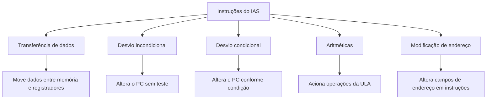

> [!tip] Resumindo
> As instruções do IAS mostram como um computador pode mover dados, calcular, tomar decisões e alterar a sequência de execução de um programa.

---

## 18. Entrada, saída e buffers

> [!info] Conceito
> A entrada/saída permite que o computador receba dados do ambiente externo e envie resultados ao usuário ou a outros dispositivos.

Dispositivos de **entrada** enviam dados ou comandos para o computador, como teclado, mouse, scanner e microfone. Dispositivos de **saída** recebem informações processadas, como monitor, impressora, alto-falantes e projetor.

Alguns dispositivos podem funcionar tanto como entrada quanto como saída, como HD, SSD, pendrive, tela sensível ao toque e placa de rede.

Os **buffers** são áreas temporárias de armazenamento usadas para organizar a transferência de dados. Eles são importantes porque a CPU, a memória e os periféricos podem trabalhar em velocidades diferentes. Por exemplo, uma impressora é muito mais lenta que a CPU; o buffer guarda temporariamente os dados até que o dispositivo consiga processá-los.

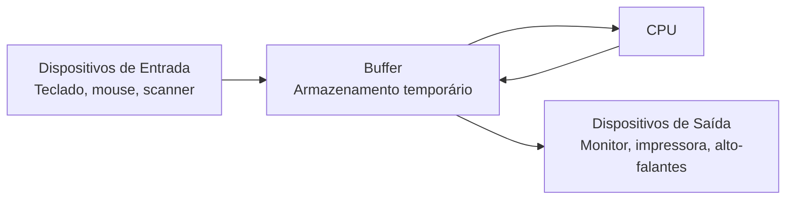

> [!tip] Resumindo
> Entrada e saída conectam o computador ao mundo externo, enquanto buffers ajudam a equilibrar diferenças de velocidade entre componentes.

---

## 19. Memória cache

> [!info] Conceito
> A memória cache é uma memória rápida, próxima da CPU, usada para guardar dados e instruções acessados com frequência.

A cache é importante porque a CPU costuma ser muito mais rápida que a memória RAM. Se o processador precisasse buscar todos os dados diretamente na RAM, perderia tempo esperando. A cache reduz esse atraso mantendo informações frequentemente utilizadas mais próximas da CPU.

A cache funciona como uma camada intermediária entre a CPU e a memória principal. Ela não substitui a RAM, mas ajuda a diminuir a frequência de acessos diretos à memória principal.

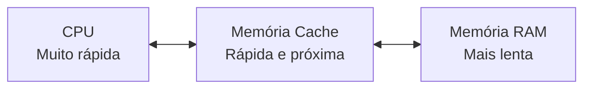

> [!warning] Atenção
> Ter um processador com alto clock ou muita RAM não garante, sozinho, o melhor desempenho. O tipo, o tamanho e a organização da cache também influenciam a velocidade do sistema.

> [!tip] Resumindo
> A cache acelera o computador porque aproxima da CPU os dados e instruções que provavelmente serão usados novamente.

---

## 20. Níveis de cache: L1, L2 e L3

> [!info] Conceito
> A memória cache é organizada em níveis, que variam em proximidade, velocidade e capacidade.

A **cache L1** fica dentro do núcleo da CPU. É a mais rápida e a menor. Por estar muito próxima da unidade de execução, é acessada primeiro pelo processador.

A **cache L2** costuma ter maior capacidade que a L1, mas é um pouco mais lenta. Ela funciona como uma segunda camada de apoio quando a informação não é encontrada na L1.

A **cache L3** geralmente é maior e compartilhada entre vários núcleos do processador. Ela é mais lenta que L1 e L2, mas ainda é muito mais rápida que acessar diretamente a RAM.

A sequência típica de busca é: primeiro a CPU procura na L1; se não encontrar, procura na L2; depois na L3; e, se necessário, acessa a RAM.

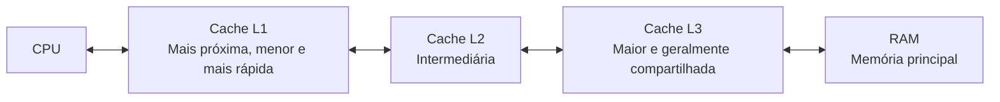

> [!tip] Resumindo
> Quanto mais próximo da CPU, mais rápido e menor é o cache. Quanto mais distante, maior tende a ser a capacidade, mas menor a velocidade.

---

## 21. Cache hit, cache miss e princípios de localidade

> [!info] Conceito
> O desempenho da cache depende da capacidade de antecipar quais dados a CPU provavelmente usará.

Um **cache hit** ocorre quando a CPU procura um dado ou instrução e encontra essa informação na cache. Isso gera acesso rápido.

Um **cache miss** ocorre quando a CPU procura uma informação e ela não está na cache. Nesse caso, o sistema precisa buscar em outro nível mais lento, como L2, L3 ou RAM.

A cache utiliza dois princípios principais. A **localidade temporal** indica que um dado usado recentemente tem grande chance de ser usado novamente em breve. A **localidade espacial** indica que, quando um dado é acessado, dados próximos a ele também podem ser acessados em seguida.

```mermaid
flowchart TD
    A[CPU precisa de um dado ou instrução]
    B{Está na cache?}
    C[Cache hit<br>Acesso rápido]
    D[Cache miss<br>Busca em nível mais lento]
    E[Busca na L2, L3 ou RAM]
    F[Atualiza cache para acessos futuros]

    A --> B
    B -->|Sim| C
    B -->|Não| D --> E --> F
```

```mermaid
flowchart TD
    A[Princípios de localidade]
    A --> B[Localidade temporal<br>Dado usado recentemente pode ser reutilizado]
    A --> C[Localidade espacial<br>Dados próximos podem ser usados em seguida]
    B --> D[Cache mantém dados prováveis próximos da CPU]
    C --> D
```

> [!tip] Resumindo
> A cache tenta prever o que a CPU usará em seguida, mantendo próximos os dados usados recentemente e os dados próximos aos já acessados.

---

## 22. Gargalo de Von Neumann

> [!warning] Atenção
> O gargalo de Von Neumann ocorre porque CPU e memória principal trabalham em velocidades diferentes.

Na arquitetura de Von Neumann, dados e instruções ficam armazenados na memória principal. A CPU precisa buscar essas informações para executar programas. O problema é que a CPU costuma ser muito mais rápida que a RAM. Assim, o processador pode ficar esperando a chegada de dados e instruções.

Essa limitação é chamada de **gargalo de Von Neumann**. A cache ajuda a reduzir esse problema, mantendo dados e instruções frequentemente usados mais próximos da CPU.

```mermaid
flowchart LR
    CPU[CPU rápida]
    RAM[Memória principal mais lenta]
    G[Gargalo de Von Neumann<br>Espera na troca de dados e instruções]
    CACHE[Cache<br>Reduz acessos diretos à RAM]

    CPU <--> G
    G <--> RAM
    CPU <--> CACHE
    CACHE <--> RAM
```

> [!tip] Resumindo
> O gargalo de Von Neumann é a limitação causada pela troca constante de informações entre CPU e memória principal. A cache reduz esse impacto.

---

## 23. Escolha de computador no desafio prático

> [!info] Conceito
> A escolha de um computador deve considerar processamento, memória, armazenamento, desempenho gráfico e adequação à tarefa.

No desafio do estúdio de design gráfico, a melhor opção foi o **Desktop Dell Inspiron**, com Intel Core i7, 16 GB de RAM, 1 TB HD, 256 GB SSD e placa de vídeo dedicada NVIDIA GeForce GTX 1660.

Esse computador foi considerado mais adequado porque tarefas como edição de imagens, renderização de vídeos e multitarefa com softwares pesados exigem alto poder de processamento, boa quantidade de memória, armazenamento eficiente e desempenho gráfico.

O processador Core i7 representa a unidade de processamento. A RAM permite armazenar temporariamente dados e instruções em uso. O SSD acelera abertura do sistema e dos programas. O HD oferece espaço para arquivos e projetos. A placa de vídeo dedicada melhora o desempenho em tarefas gráficas.


> [!tip] Resumindo
> Para tarefas pesadas de design gráfico, a melhor escolha é a máquina com processador mais forte, mais memória, armazenamento híbrido e placa de vídeo dedicada.

---

## 24. Relação entre desempenho e visão hierárquica

> [!info] Conceito
> A visão hierárquica permite compreender o desempenho do computador como resultado da interação entre várias camadas.

No exemplo prático do técnico Vicente, a lentidão dos computadores não foi tratada apenas como problema de hardware. A análise mostrou que o desempenho depende da integração entre nível físico, nível lógico e nível de aplicação.

No nível físico, foram consideradas ações como limpeza, aumento de RAM, verificação de conexões e substituição de HD por SSD. No nível lógico, foram feitas atualizações de sistema operacional e drivers, além da otimização da inicialização e verificação de malwares. No nível de aplicação, foram reconfigurados programas pesados, removidos softwares obsoletos e organizados arquivos.

Essa abordagem mostrou que a solução eficiente exige entender o computador como um conjunto de camadas interdependentes.

```mermaid
flowchart TD
    A[Lentidão nos computadores]
    A --> B[Análise por níveis]

    B --> C[Nível físico]
    B --> D[Nível lógico]
    B --> E[Nível de aplicação]

    C --> F[Limpeza, RAM, SSD, conexões]
    D --> G[Drivers, sistema operacional, segurança]
    E --> H[Softwares, configurações, arquivos]

    F --> I[Melhor desempenho]
    G --> I
    H --> I
```

> [!tip] Resumindo
> A análise por níveis ajuda a localizar gargalos e aplicar melhorias mais precisas, sem tratar o computador como um conjunto isolado de peças.

---

## 25. Principais cuidados conceituais

> [!warning] Atenção
> Alguns conceitos são parecidos, mas têm funções diferentes dentro da arquitetura computacional.

O **nível de controle** não é responsável pela interação entre linguagens de alto nível e dispositivos de entrada/saída. Ele coordena operações internas da CPU, como transferências entre registradores, memória e ULA.

O **nível de unidades funcionais** reúne registradores, ULA, memória e barramentos, mas quem coordena suas ações é o nível de controle.

O **IR** armazena a instrução atual, mas não executa a instrução sozinho. A execução depende da Unidade de Controle e dos demais componentes acionados.

O **PC** aponta para a próxima instrução, mas não gerencia dados da ULA. Em desvios condicionais, ele pode receber um novo endereço conforme o resultado do teste.

O **MAR** guarda endereços, enquanto o **MBR** guarda dados ou instruções transferidos. O barramento de endereços transporta localizações, não conteúdo.

```mermaid
flowchart TD
    A[Cuidados conceituais]
    A --> B[PC<br>Aponta próxima instrução]
    A --> C[IR<br>Guarda instrução atual]
    A --> D[MAR<br>Guarda endereço]
    A --> E[MBR<br>Guarda conteúdo]
    A --> F[UC<br>Coordena sinais de controle]
    A --> G[ULA<br>Executa operações]
```

> [!tip] Resumindo
> Entender a função específica de cada componente evita confundir armazenamento, endereçamento, controle e execução.

---

## Síntese final

> [!summary] Síntese
> Um computador é um sistema formado por componentes físicos, programas e usuários que trabalham de forma integrada para processar dados.

Os principais componentes de um computador são o **processador**, a **memória** e os **dispositivos de entrada/saída**, interligados por **barramentos**. O processador executa instruções, a memória armazena dados e programas, e os dispositivos de entrada/saída permitem a comunicação com o meio externo.

A organização hierárquica do sistema computacional permite compreender o computador em diferentes níveis, desde os aplicativos usados pelo usuário até os transistores e fios que formam os circuitos. Essa visão ajuda a diagnosticar problemas, melhorar desempenho e entender como hardware e software se relacionam.

A **arquitetura de Von Neumann** é uma base essencial da computação moderna. Ela propõe que dados e instruções sejam armazenados na mesma memória e processados por uma unidade central. Esse modelo tornou os computadores mais flexíveis, pois permitiu o uso de programas armazenados em vez de reconfiguração física da máquina.

Dentro da CPU, a **Unidade de Controle** coordena as operações, a **ULA** realiza cálculos e operações lógicas, e os **registradores** armazenam temporariamente informações essenciais. O ciclo de instrução, formado por busca, decodificação e execução, explica como a CPU executa programas passo a passo.

A **memória cache** complementa essa organização ao reduzir o atraso entre CPU e RAM. Ela armazena dados e instruções usados com frequência, diminuindo o impacto do gargalo de Von Neumann e melhorando o desempenho geral do sistema.

```mermaid
flowchart TD
    A[Computador]
    A --> B[CPU]
    A --> C[Memória]
    A --> D[Entrada/Saída]
    A --> E[Barramentos]

    B --> F[Unidade de Controle]
    B --> G[ULA]
    B --> H[Registradores]

    C --> I[Dados e instruções]
    E --> J[Dados, endereços e controle]

    F --> K[Ciclo de instrução]
    K --> L[Busca]
    K --> M[Decodificação]
    K --> N[Execução]

    C --> O[Gargalo de Von Neumann]
    O --> P[Memória cache]
```

> [!summary] Ideia central
> Compreender os principais componentes de um computador significa entender como CPU, memória, entrada/saída, barramentos, registradores, Unidade de Controle, ULA e cache cooperam para buscar, interpretar, executar e armazenar instruções e dados.