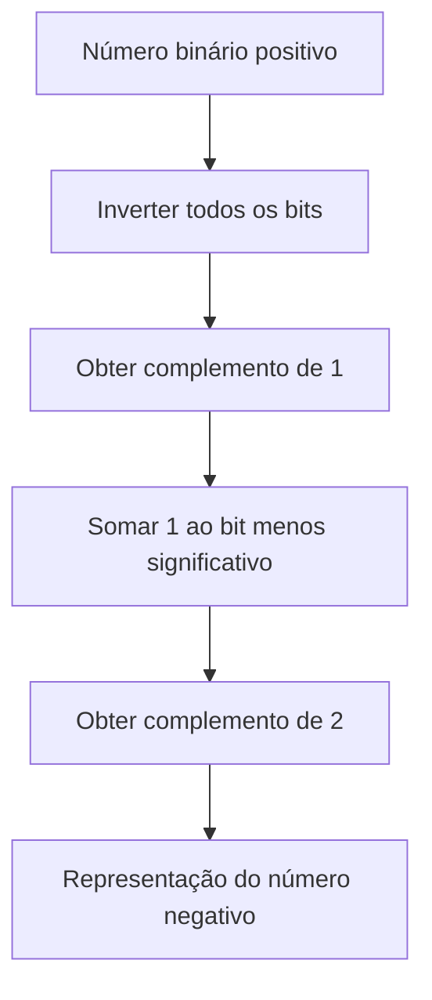
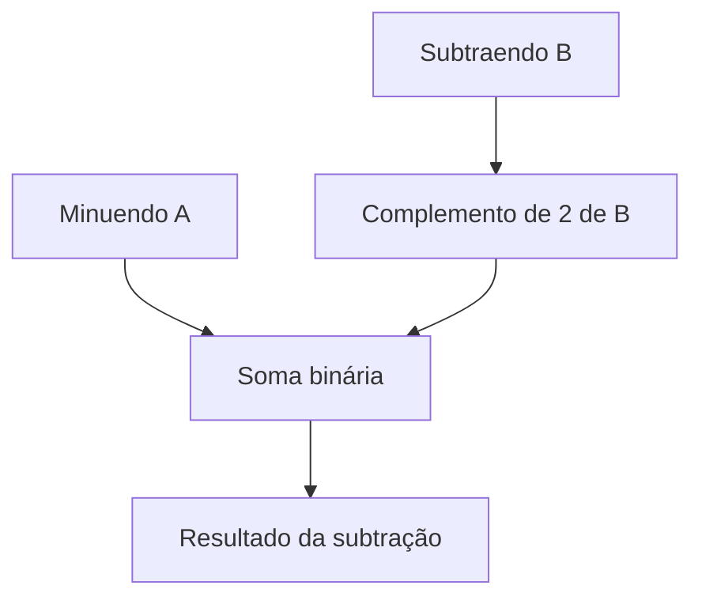
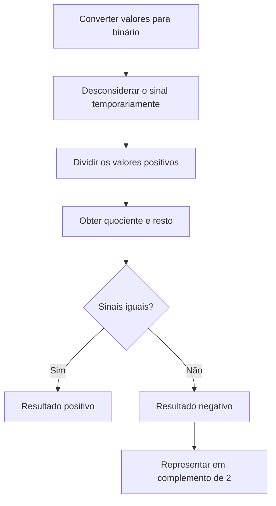
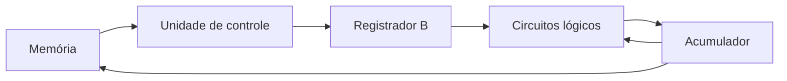
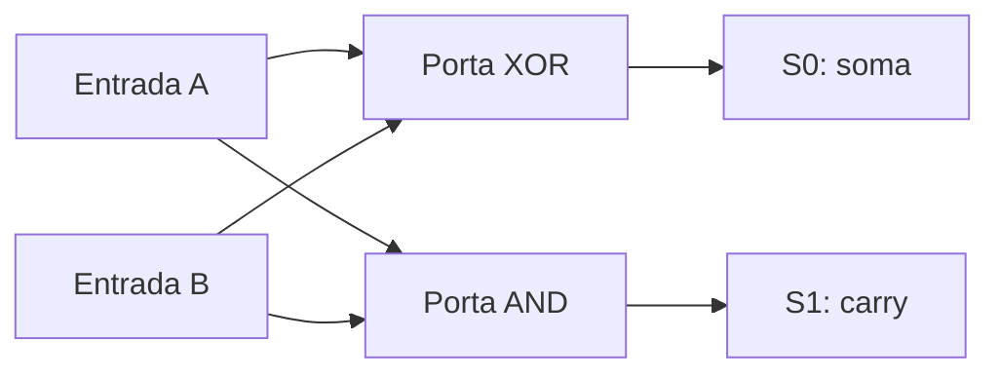
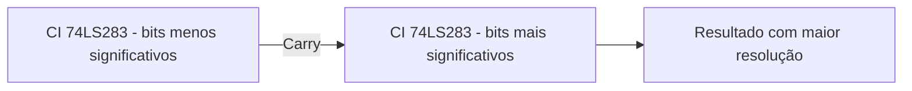
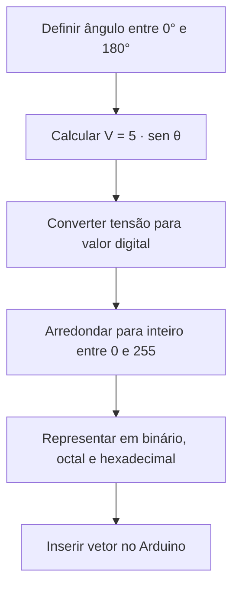

# Resumo 1.3 - Aritmética digital: operações e circuitos

# Aritmética digital: operações e circuitos

## Visão geral da aritmética digital

> [!info] Conceito
> A aritmética digital estuda como sistemas digitais representam números e realizam operações matemáticas usando apenas bits, isto é, valores `0` e `1`.

Sistemas digitais, como processadores, microcontroladores, calculadoras e circuitos integrados, realizam operações matemáticas por meio de números binários. Mesmo operações aparentemente complexas podem ser entendidas como combinações de operações aritméticas básicas, movimentação de dados entre registradores e processamento por circuitos lógicos.

Nesta unidade, o foco está em compreender como números positivos e negativos são representados em binário, como funcionam as operações de adição, subtração, multiplicação e divisão, e como essas operações podem ser implementadas em circuitos digitais.

> [!tip] Resumindo
> Todo cálculo digital depende de representar informações em bits e manipular esses bits por meio de regras lógicas e circuitos eletrônicos.

---

## Números binários positivos e negativos

> [!info] Conceito
> Um número binário com sinal utiliza um bit especial para indicar se o valor é positivo ou negativo.

Assim como na base decimal, os números binários podem representar valores positivos e negativos. Para isso, adiciona-se um **bit de sinal**. Por convenção, o bit `0` indica número positivo e o bit `1` indica número negativo.

Uma forma simples de representação é chamada de **sinal-magnitude**. Nela, o primeiro bit indica o sinal e os demais bits indicam o valor absoluto do número. Por exemplo, um número com bit de sinal `0` representa um valor positivo, enquanto o mesmo valor com bit de sinal `1` representa o correspondente negativo.

> [!warning] Atenção
> A representação em sinal-magnitude é fácil de entender, mas não é a mais prática para realizar operações aritméticas em circuitos digitais.

---

## Complemento de 1 e complemento de 2

> [!info] Conceito
> O complemento de 2 é uma forma muito usada para representar números negativos em sistemas digitais.

O **complemento de 1** é obtido invertendo todos os bits de um número: cada `0` vira `1` e cada `1` vira `0`.

O **complemento de 2** é obtido em duas etapas: primeiro calcula-se o complemento de 1 e depois soma-se `1` ao bit menos significativo. Essa forma é amplamente utilizada porque facilita a realização de subtrações e operações com números negativos em circuitos digitais.

O diagrama mostra a sequência usada para transformar um número binário positivo em sua representação negativa por complemento de 2.

> [!tip] Resumindo
> Para representar um número negativo em complemento de 2, invertem-se os bits do valor positivo e soma-se `1`.

---

## Bases numéricas: binária, decimal, octal e hexadecimal

> [!info] Conceito
> Diferentes bases numéricas representam os mesmos valores usando quantidades diferentes de símbolos.

A base binária utiliza apenas os símbolos `0` e `1`. A base decimal utiliza os símbolos de `0` a `9`. A base octal utiliza os símbolos de `0` a `7`. Já a base hexadecimal utiliza os símbolos de `0` a `9` e as letras `A` a `F`.

A base hexadecimal é muito usada em sistemas digitais porque cada dígito hexadecimal corresponde diretamente a um grupo de quatro bits. Isso torna a leitura de números binários longos mais simples. A base octal também permite conversão rápida com binário, mas é menos utilizada que a hexadecimal.

| Decimal | Binário | Octal | Hexadecimal |
|---:|---:|---:|---:|
| 0 | `0000` | `0` | `0` |
| 1 | `0001` | `1` | `1` |
| 2 | `0010` | `2` | `2` |
| 3 | `0011` | `3` | `3` |
| 4 | `0100` | `4` | `4` |
| 5 | `0101` | `5` | `5` |
| 6 | `0110` | `6` | `6` |
| 7 | `0111` | `7` | `7` |
| 8 | `1000` | `10` | `8` |
| 9 | `1001` | `11` | `9` |
| 10 | `1010` | `12` | `A` |
| 11 | `1011` | `13` | `B` |
| 12 | `1100` | `14` | `C` |
| 13 | `1101` | `15` | `D` |
| 14 | `1110` | `16` | `E` |
| 15 | `1111` | `17` | `F` |

> [!warning] Atenção
> Para evitar confusão entre bases, é comum indicar a base em subscrito, como `101₂` para binário, `17₈` para octal, `12₁₀` para decimal e `1A₁₆` para hexadecimal.

---

## Adição binária

> [!info] Conceito
> A adição binária segue a mesma lógica da adição decimal, mas trabalha apenas com os valores `0` e `1`.

Na soma binária, o cálculo começa pelo bit menos significativo, chamado de **LSB**. Quando uma soma ultrapassa o valor que cabe em uma coluna, surge um **carry**, ou transporte, que é levado para a próxima posição.

As combinações básicas da soma binária são:

| Operação | Resultado |
|---:|---:|
| `0 + 0` | `0` |
| `0 + 1` | `1` |
| `1 + 0` | `1` |
| `1 + 1` | `10` |

No caso `1 + 1 = 10`, o `0` fica na posição atual e o `1` é transportado como carry para a próxima coluna.

> [!tip] Resumindo
> O carry é o bit excedente gerado em uma coluna da soma e usado na próxima coluna.

---

## Soma com números positivos e negativos

> [!info] Conceito
> Em complemento de 2, números positivos e negativos podem ser somados usando a mesma estrutura de soma binária.

A soma binária com sinal pode envolver diferentes situações: dois números positivos, um positivo maior que o negativo, um negativo maior que o positivo ou dois números negativos. O complemento de 2 permite tratar essas situações de forma mais simples, pois o circuito realiza uma soma comum entre os bits.

Quando há um carry final além da quantidade de bits usada pelo sistema, esse bit pode ser descartado em algumas operações, desde que a representação esteja dentro da capacidade do registrador.

> [!warning] Atenção
> O descarte do carry final não deve ser confundido com overflow. O overflow ocorre quando o resultado real não cabe na quantidade de bits disponível.

---

## Overflow

> [!info] Conceito
> Overflow é o transbordamento da capacidade de representação de um sistema com número fixo de bits.

Em sistemas digitais, a quantidade de bits é limitada. Se uma operação gera um resultado que precisa de mais bits do que o registrador possui, ocorre **overflow**. Nessa situação, o resultado armazenado pode ficar incorreto.

Um caso típico ocorre quando dois números positivos são somados e o resultado ultrapassa a capacidade disponível, fazendo o bit de sinal indicar incorretamente um valor negativo.

> [!warning] Atenção
> O overflow é um erro de capacidade de representação. Ele não significa apenas que apareceu um carry, mas que o resultado não cabe corretamente no número de bits disponível.

---

## Subtração binária

> [!info] Conceito
> A subtração binária pode ser feita como uma soma usando complemento de 2.

Em circuitos digitais, a subtração é tratada como uma forma particular de adição. Para calcular `A - B`, o sistema pode transformar o subtraendo `B` em seu complemento de 2 e depois realizar uma soma:

`A - B = A + complemento de 2 de B`

Esse procedimento simplifica o hardware, pois o mesmo circuito somador pode ser usado tanto para somar quanto para subtrair.

O diagrama mostra que a subtração é convertida em uma soma entre o minuendo e o complemento de 2 do subtraendo.

> [!tip] Resumindo
> Em vez de construir um circuito separado para subtrair, o sistema usa complemento de 2 e reaproveita o circuito de soma.

---

## Multiplicação binária

> [!info] Conceito
> A multiplicação binária segue a mesma lógica da multiplicação decimal, mas é mais simples porque cada bit só pode ser `0` ou `1`.

Na multiplicação binária, cada bit do multiplicador define se o multiplicando será considerado ou substituído por zero em uma parcela intermediária. Depois, as parcelas são somadas para formar o resultado final.

Quando os números são positivos, a multiplicação pode ser feita diretamente. Quando há números negativos, é necessário considerar o sinal. Se os dois números tiverem sinais iguais, o resultado será positivo. Se tiverem sinais diferentes, o resultado será negativo, sendo representado em complemento de 2.

> [!tip] Resumindo
> Na multiplicação binária, multiplicar por `0` gera uma parcela nula, e multiplicar por `1` repete o multiplicando.

---

## Divisão binária

> [!info] Conceito
> A divisão binária utiliza comparações, subtrações e deslocamentos, de modo semelhante à divisão decimal.

A divisão binária é considerada uma operação mais completa porque envolve outras operações: comparação, subtração, adição auxiliar e, em alguns casos, multiplicação. O procedimento é parecido com a divisão decimal: compara-se parte do dividendo com o divisor, define-se um bit do quociente, realiza-se a subtração e desce-se o próximo bit.

Nas subtrações internas da divisão, pode-se usar complemento de 2 para transformar a subtração em adição. Quando os sinais do dividendo e do divisor são iguais, o resultado é positivo. Quando os sinais são diferentes, o resultado é negativo.

O diagrama resume o tratamento de divisões binárias com sinal.

> [!tip] Resumindo
> Primeiro calcula-se a divisão com os valores positivos. Depois, o sinal do resultado é ajustado conforme os sinais originais dos operandos.

---

## Unidade Aritmética Lógica — ALU

> [!info] Conceito
> A ALU é a parte do processador responsável por executar operações aritméticas e lógicas.

A **Unidade Aritmética Lógica**, ou **ALU**, é uma estrutura central dos processadores digitais. Ela recebe dados binários vindos da memória ou de registradores, executa operações aritméticas e lógicas, e armazena resultados temporários.

Uma ALU é composta por elementos como registradores, acumulador, unidade de controle, memória e circuitos lógicos. O **acumulador** recebe esse nome porque armazena resultados parciais ou sucessivos de operações.

O diagrama representa, de forma simplificada, como a ALU movimenta dados entre memória, registradores, circuitos lógicos e acumulador.

> [!tip] Resumindo
> A ALU processa dados binários e usa registradores para armazenar temporariamente valores de entrada, resultados parciais e resultados finais.

---

## Somador binário paralelo

> [!info] Conceito
> Um somador binário paralelo realiza a soma de vários bits simultaneamente, usando vários somadores completos.

O **somador binário paralelo** recebe dois números binários com vários bits e realiza a soma bit a bit. Cada coluna da soma usa os bits correspondentes dos dois números e o carry vindo da coluna anterior.

Em um somador paralelo de 5 bits, por exemplo, existem entradas `A0` a `A4`, entradas `B0` a `B4`, carries `C0` a `C5` e saídas `S0` a `S4`. O carry `C0` normalmente é `0` quando o circuito trabalha sozinho. O carry final pode indicar transporte para outro circuito ou possível overflow, dependendo da operação.

> [!tip] Resumindo
> O somador paralelo é rápido porque recebe todos os bits das parcelas ao mesmo tempo, diferentemente da soma manual, que é feita coluna por coluna.

---

## Meio somador

> [!info] Conceito
> O meio somador soma dois bits e gera duas saídas: o bit da soma e o carry.

  <svg
    width="900"
    height="460"
    viewBox="0 0 900 460"
    xmlns="http://www.w3.org/2000/svg"
    font-family="Arial, sans-serif"
    preserveAspectRatio="xMidYMid meet"
    class="logic-diagram"
    role="img"
    aria-label="Diagrama didático de um meio somador com portas XOR e AND"
    style="
      display: block;
      width: 100%;
      height: auto;
      aspect-ratio: 900 / 460;
    "
  >
    <defs>
      <marker id="half-adder-arrow-31742" viewBox="0 0 10 10" refX="8" refY="5" markerWidth="6" markerHeight="6" orient="auto">
        <path d="M1 1 L9 5 L1 9 Z" fill="#29B6E6"/>
      </marker>
    </defs>
    <rect width="900" height="460" fill="transparent"/>
    <!-- ===== Título ===== -->
    <text x="450" y="35" text-anchor="middle" fill="#D6F0FB" font-size="24" font-weight="700">Meio Somador</text>
    <text x="450" y="60" text-anchor="middle" fill="#dddddd" font-size="14">Soma dois bits e produz um bit de soma e um bit de transporte</text>
    <!-- ===== Entradas ===== -->
    <rect x="30" y="105" width="170" height="215" rx="16" fill="#1A4A5E" fill-opacity="0.10" stroke="#7FCFF0" stroke-width="1.2"/>
    <text x="115" y="135" text-anchor="middle" fill="#D6F0FB" font-size="17" font-weight="600">Entradas</text>
    <circle cx="90" cy="190" r="7" fill="#29B6E6"/>
    <text x="112" y="196" fill="#eeeeee" font-size="20" font-weight="600">A</text>
    <circle cx="90" cy="255" r="7" fill="#29B6E6"/>
    <text x="112" y="261" fill="#eeeeee" font-size="20" font-weight="600">B</text>
    <text x="115" y="295" text-anchor="middle" fill="#dddddd" font-size="13">Cada entrada vale 0 ou 1</text>
    <!-- ===== Portas lógicas ===== -->
    <rect x="330" y="120" width="190" height="80" rx="16" fill="#1A4A5E" fill-opacity="0.6" stroke="#7FCFF0" stroke-width="1.4"/>
    <text x="425" y="151" text-anchor="middle" fill="#D6F0FB" font-size="20" font-weight="700">XOR</text>
    <text x="425" y="177" text-anchor="middle" fill="#dddddd" font-size="14">Soma sem transporte</text>
    <rect x="330" y="235" width="190" height="80" rx="16" fill="#1A4A5E" fill-opacity="0.3" stroke="#7FCFF0" stroke-width="1.4"/>
    <text x="425" y="266" text-anchor="middle" fill="#D6F0FB" font-size="20" font-weight="700">AND</text>
    <text x="425" y="292" text-anchor="middle" fill="#dddddd" font-size="14">Detecta 1 + 1</text>
    <!-- ===== Saídas ===== -->
    <rect x="690" y="105" width="180" height="215" rx="16" fill="#3C3489" fill-opacity="0.3" stroke="#A89CF5" stroke-width="1.2"/>
    <text x="780" y="135" text-anchor="middle" fill="#D6F0FB" font-size="17" font-weight="600">Saídas</text>
    <circle cx="815" cy="160" r="7" fill="#29B6E6"/>
    <text x="730" y="157" fill="#eeeeee" font-size="19" font-weight="600">S</text>
    <text x="730" y="181" fill="#dddddd" font-size="13">Soma</text>
    <circle cx="815" cy="275" r="7" fill="#29B6E6"/>
    <text x="730" y="272" fill="#eeeeee" font-size="19" font-weight="600">C</text>
    <text x="730" y="296" fill="#dddddd" font-size="13">Carry</text>
    <!-- ===== Conexões das entradas ===== -->
    <path d="M97 190 H240 V145 H330" fill="none" stroke="#aaaaaa" stroke-width="1.6" vector-effect="non-scaling-stroke" marker-end="url(#half-adder-arrow-31742)"/>
    <path d="M240 190 V260 H330" fill="none" stroke="#aaaaaa" stroke-width="1.6" vector-effect="non-scaling-stroke" marker-end="url(#half-adder-arrow-31742)"/>
    <circle cx="240" cy="190" r="4" fill="#29B6E6"/>
    <path d="M97 255 H275 V175 H330" fill="none" stroke="#888888" stroke-width="1.6" vector-effect="non-scaling-stroke" marker-end="url(#half-adder-arrow-31742)"/>
    <path d="M275 255 V290 H330" fill="none" stroke="#888888" stroke-width="1.6" vector-effect="non-scaling-stroke" marker-end="url(#half-adder-arrow-31742)"/>
    <circle cx="275" cy="255" r="4" fill="#29B6E6"/>
    <!-- ===== Conexões das saídas ===== -->
    <path d="M520 160 H815" fill="none" stroke="#29B6E6" stroke-width="2.2" vector-effect="non-scaling-stroke" marker-end="url(#half-adder-arrow-31742)"/>
    <text x="600" y="148" text-anchor="middle" fill="#D6F0FB" font-size="15" font-weight="600">S = A ⊕ B</text>
    <path d="M520 275 H815" fill="none" stroke="#29B6E6" stroke-width="2.2" vector-effect="non-scaling-stroke" marker-end="url(#half-adder-arrow-31742)"/>
    <text x="600" y="263" text-anchor="middle" fill="#D6F0FB" font-size="15" font-weight="600">C = A · B</text>
    <!-- ===== Explicação ===== -->
    <rect x="95" y="360" width="710" height="70" rx="15" fill="#1A4A5E" fill-opacity="0.10" stroke="#7FCFF0" stroke-width="1"/>
    <text x="450" y="386" text-anchor="middle" fill="#D6F0FB" font-size="15" font-weight="600">Exemplo: A = 1 e B = 1</text>
    <text x="450" y="411" text-anchor="middle" fill="#eeeeee" font-size="14">A XOR B gera S = 0 e A AND B gera C = 1, representando o resultado binário 10.</text>
  </svg>

O **meio somador** é um circuito simples que soma dois bits de entrada, geralmente chamados de `A` e `B`. Ele gera duas saídas: `S0`, que representa o bit menos significativo da soma, e `S1`, que representa o carry.

A porta lógica **XOR** gera o resultado da soma sem considerar transporte. A porta lógica **AND** identifica quando ocorre carry, isto é, quando a operação `1 + 1` gera `10`.

|   A |   B |  S1 |  S0 | Valor decimal |
| --: | --: | --: | --: | ------------: |
|   0 |   0 |   0 |   0 |             0 |
|   0 |   1 |   0 |   1 |             1 |
|   1 |   0 |   0 |   1 |             1 |
|   1 |   1 |   1 |   0 |             2 |

O diagrama mostra que o meio somador usa duas operações lógicas: XOR para o bit da soma e AND para o transporte.

> [!tip] Resumindo
> O meio somador resolve a soma de dois bits, mas não considera carry vindo de uma operação anterior.

> [!info]- Porta Lógicas
> 
Porta lógica AND
>
> | A   | B   | Y   |
> | --- | --- | --- |
> | 0   | 0   | 0   |
> | 0   | 1   | 0   |
> | 1   | 0   | 0   |
> | 1   | 1   | 1   |
>
>Porta lógica OR ou porta OU
>
| A | B | Y |
|---|---|---|
| 0 | 0 | 0 |
| 0 | 1 | 1 |
| 1 | 0 | 1 |
| 1 | 1 | 1 |
>
>Porta lógica NOT ou porta inversora
>
| A | Y |
|---|---|
| 0 | 1 |
| 1 | 0 |
>
>
>| Porta | Funcionamento                              |
>| ----- | ------------------------------------------ |
>| NAND  | É a porta AND com saída invertida          |
>| NOR   | É a porta OR com saída invertida           |
>| XOR (Exclusivo)  | Gera `1` quando as entradas são diferentes |
>| XNOR (Coincidência)  | Gera `0` quando as entradas são diferentes   |

---

## Somador de três bits

> [!info] Conceito
> Um somador de três bits pode ser construído combinando meios somadores e portas lógicas auxiliares.

Para somar três entradas de 1 bit, como `A`, `B` e `C`, o circuito precisa produzir uma saída de 2 bits, formada por `S1` e `S0`. Isso ocorre porque a maior soma possível é:

`1 + 1 + 1 = 3`

Em binário, o número `3` é representado como `11`.

| A | B | C | S1 | S0 | Valor decimal |
|---:|---:|---:|---:|---:|---:|
| 0 | 0 | 0 | 0 | 0 | 0 |
| 0 | 0 | 1 | 0 | 1 | 1 |
| 0 | 1 | 0 | 0 | 1 | 1 |
| 0 | 1 | 1 | 1 | 0 | 2 |
| 1 | 0 | 0 | 0 | 1 | 1 |
| 1 | 0 | 1 | 1 | 0 | 2 |
| 1 | 1 | 0 | 1 | 0 | 2 |
| 1 | 1 | 1 | 1 | 1 | 3 |

> [!warning] Atenção
> Mesmo que cada entrada tenha apenas 1 bit, o resultado precisa ter 2 bits para representar corretamente os valores de `0` a `3`.

---

## Somador completo

> [!info] Conceito
> O somador completo soma dois bits mais um carry de entrada, gerando uma soma e um carry de saída.

 <svg width="1000" height="560" viewBox="0 0 1000 560" xmlns="http://www.w3.org/2000/svg" font-family="Arial, sans-serif" preserveAspectRatio="xMidYMid meet" class="logic-diagram" role="img" aria-label="Diagrama didático de um somador completo com entradas A, B e carry de entrada e saídas soma e carry de saída" style=" display: block; width: 100%; height: auto; aspect-ratio: 1000 / 560; " > <defs> <marker id="full-adder-flow-arrow" viewBox="0 0 10 10" refX="8" refY="5" markerWidth="6" markerHeight="6" orient="auto"> <path d="M1 1 L9 5 L1 9 Z" fill="#29B6E6"/> </marker> <marker id="full-adder-gray-arrow" viewBox="0 0 10 10" refX="8" refY="5" markerWidth="6" markerHeight="6" orient="auto"> <path d="M1 1 L9 5 L1 9 Z" fill="#aaaaaa"/> </marker> </defs> <rect width="1000" height="560" fill="transparent"/> <!-- ===== Título ===== --> <text x="500" y="35" text-anchor="middle" fill="#D6F0FB" font-size="24" font-weight="700">Somador Completo</text> <text x="500" y="61" text-anchor="middle" fill="#dddddd" font-size="14">Soma dois bits e o carry recebido da posição anterior</text> <!-- ===== Registradores ===== --> <rect x="35" y="100" width="200" height="275" rx="17" fill="#1A4A5E" fill-opacity="0.10" stroke="#7FCFF0" stroke-width="1.2"/> <text x="135" y="130" text-anchor="middle" fill="#D6F0FB" font-size="17" font-weight="600">Entradas</text> <rect x="65" y="155" width="140" height="55" rx="11" fill="#1A4A5E" fill-opacity="0.6" stroke="#7FCFF0" stroke-width="1.3"/> <text x="135" y="178" text-anchor="middle" fill="#D6F0FB" font-size="17" font-weight="700">Aᵢ</text> <text x="135" y="198" text-anchor="middle" fill="#dddddd" font-size="12">Bit do registrador A</text> <rect x="65" y="230" width="140" height="55" rx="11" fill="#1A4A5E" fill-opacity="0.6" stroke="#7FCFF0" stroke-width="1.3"/> <text x="135" y="253" text-anchor="middle" fill="#D6F0FB" font-size="17" font-weight="700">Bᵢ</text> <text x="135" y="273" text-anchor="middle" fill="#dddddd" font-size="12">Bit do registrador B</text> <rect x="65" y="305" width="140" height="55" rx="11" fill="#3C3489" fill-opacity="0.3" stroke="#A89CF5" stroke-width="1.3"/> <text x="135" y="328" text-anchor="middle" fill="#D6F0FB" font-size="17" font-weight="700">Cᵢ</text> <text x="135" y="348" text-anchor="middle" fill="#dddddd" font-size="12">Carry de entrada</text> <!-- ===== Origem do carry ===== --> <rect x="30" y="410" width="220" height="70" rx="14" fill="#1A4A5E" fill-opacity="0.08" stroke="#7FCFF0" stroke-width="1"/> <text x="140" y="435" text-anchor="middle" fill="#D6F0FB" font-size="14" font-weight="600">Posição anterior</text> <text x="140" y="458" text-anchor="middle" fill="#dddddd" font-size="13">O estágio i − 1 envia Cᵢ</text> <path d="M140 410 V375 H135 V360" fill="none" stroke="#29B6E6" stroke-width="2" vector-effect="non-scaling-stroke" marker-end="url(#full-adder-flow-arrow)"/> <!-- ===== Bloco do somador completo ===== --> <rect x="350" y="125" width="300" height="250" rx="22" fill="#1A4A5E" fill-opacity="0.6" stroke="#7FCFF0" stroke-width="1.6"/> <text x="500" y="160" text-anchor="middle" fill="#D6F0FB" font-size="21" font-weight="700">Somador completo</text> <line x1="385" y1="180" x2="615" y2="180" stroke="#7FCFF0" stroke-width="1" opacity="0.7"/> <text x="500" y="212" text-anchor="middle" fill="#eeeeee" font-size="15">Entradas</text> <text x="500" y="238" text-anchor="middle" fill="#D6F0FB" font-size="18" font-weight="600">Aᵢ + Bᵢ + Cᵢ</text> <text x="500" y="279" text-anchor="middle" fill="#eeeeee" font-size="15">Saídas</text> <text x="500" y="305" text-anchor="middle" fill="#D6F0FB" font-size="18" font-weight="600">Sᵢ e Cᵢ₊₁</text> <text x="500" y="342" text-anchor="middle" fill="#dddddd" font-size="13">Processa uma posição da soma binária</text> <!-- ===== Conexões de entrada ===== --> <path d="M205 182 H350" fill="none" stroke="#aaaaaa" stroke-width="1.7" vector-effect="non-scaling-stroke" marker-end="url(#full-adder-gray-arrow)"/> <text x="275" y="170" text-anchor="middle" fill="#dddddd" font-size="13">bit Aᵢ</text> <path d="M205 257 H300 V245 H350" fill="none" stroke="#aaaaaa" stroke-width="1.7" vector-effect="non-scaling-stroke" marker-end="url(#full-adder-gray-arrow)"/> <text x="275" y="246" text-anchor="middle" fill="#dddddd" font-size="13">bit Bᵢ</text> <path d="M205 332 H300 V315 H350" fill="none" stroke="#29B6E6" stroke-width="2" vector-effect="non-scaling-stroke" marker-end="url(#full-adder-flow-arrow)"/> <text x="275" y="322" text-anchor="middle" fill="#D6F0FB" font-size="13" font-weight="600">carry Cᵢ</text> <!-- ===== Saídas ===== --> <rect x="765" y="100" width="200" height="275" rx="17" fill="#3C3489" fill-opacity="0.3" stroke="#A89CF5" stroke-width="1.2"/> <text x="865" y="130" text-anchor="middle" fill="#D6F0FB" font-size="17" font-weight="600">Saídas</text> <rect x="795" y="165" width="140" height="70" rx="12" fill="#1A4A5E" fill-opacity="0.6" stroke="#7FCFF0" stroke-width="1.3"/> <text x="865" y="191" text-anchor="middle" fill="#D6F0FB" font-size="18" font-weight="700">Sᵢ</text> <text x="865" y="216" text-anchor="middle" fill="#dddddd" font-size="13">Bit da soma</text> <rect x="795" y="270" width="140" height="70" rx="12" fill="#3C3489" fill-opacity="0.4" stroke="#A89CF5" stroke-width="1.3"/> <text x="865" y="296" text-anchor="middle" fill="#D6F0FB" font-size="18" font-weight="700">Cᵢ₊₁</text> <text x="865" y="321" text-anchor="middle" fill="#dddddd" font-size="13">Carry de saída</text> <!-- ===== Conexões de saída ===== --> <path d="M650 200 H795" fill="none" stroke="#29B6E6" stroke-width="2.2" vector-effect="non-scaling-stroke" marker-end="url(#full-adder-flow-arrow)"/> <text x="720" y="188" text-anchor="middle" fill="#D6F0FB" font-size="14" font-weight="600">soma</text> <path d="M650 305 H795" fill="none" stroke="#29B6E6" stroke-width="2.2" vector-effect="non-scaling-stroke" marker-end="url(#full-adder-flow-arrow)"/> <text x="720" y="293" text-anchor="middle" fill="#D6F0FB" font-size="14" font-weight="600">carry</text> <!-- ===== Destino do carry ===== --> <rect x="750" y="410" width="230" height="70" rx="14" fill="#1A4A5E" fill-opacity="0.08" stroke="#7FCFF0" stroke-width="1"/> <text x="865" y="435" text-anchor="middle" fill="#D6F0FB" font-size="14" font-weight="600">Próxima posição</text> <text x="865" y="458" text-anchor="middle" fill="#dddddd" font-size="13">O estágio i + 1 recebe Cᵢ₊₁</text> <path d="M865 340 V410" fill="none" stroke="#29B6E6" stroke-width="2" vector-effect="non-scaling-stroke" marker-end="url(#full-adder-flow-arrow)"/> <!-- ===== Fórmulas ===== --> <rect x="285" y="425" width="430" height="100" rx="16" fill="#1A4A5E" fill-opacity="0.10" stroke="#7FCFF0" stroke-width="1"/> <text x="500" y="451" text-anchor="middle" fill="#D6F0FB" font-size="15" font-weight="600">Operações lógicas</text> <text x="500" y="480" text-anchor="middle" fill="#eeeeee" font-size="15">Sᵢ = Aᵢ ⊕ Bᵢ ⊕ Cᵢ</text> <text x="500" y="507" text-anchor="middle" fill="#eeeeee" font-size="15">Cᵢ₊₁ = AᵢBᵢ + Cᵢ(Aᵢ ⊕ Bᵢ)</text> </svg> 

Diferentemente do meio somador, o **somador completo** considera três entradas: um bit do registrador `A`, um bit do registrador `B` e um carry vindo da posição anterior. Ele gera duas saídas: o bit da soma e o carry que será enviado à próxima posição.

Em somadores paralelos, vários somadores completos são ligados em sequência. O carry de saída de uma posição alimenta a próxima posição, permitindo somar números com vários bits.

> [!tip] Resumindo
> O somador completo é a base dos circuitos de soma com vários bits, pois permite encadear carries entre posições.

---

## Circuito Integrado 74LS283

> [!info] Conceito
> O 74LS283 é um circuito integrado comercial que realiza soma binária paralela de 4 bits.

O **CI 74LS283** é um componente utilizado para realizar operações aritméticas binárias, principalmente adição. Com configurações adequadas, ele também pode ser usado em operações de subtração.

Esse circuito trabalha com resolução de 4 bits. Em representação com sinal por complemento de 2, 4 bits permitem representar valores de `-8` a `+7`.

O CI recebe dois conjuntos de bits, associados aos registradores `A` e `B`, além de um carry de entrada `C0`. Como saída, produz os bits da soma e o carry final `C4`.

| Elemento | Função |
|---|---|
| `A1` a `A4` | Bits do primeiro número |
| `B1` a `B4` | Bits do segundo número |
| `C0` | Carry de entrada |
| `Σ1` a `Σ4` | Bits do resultado |
| `C4` | Carry de saída |
| `GND` | Referência elétrica |
| `VCC` | Alimentação do circuito |

> [!warning] Atenção
> Como podem existir variações entre fabricantes, a folha de dados técnicos do componente deve ser consultada antes de montar ou simular o circuito.

---

## Uso de múltiplos circuitos integrados

> [!info] Conceito
> Mais de um CI somador pode ser combinado para trabalhar com números de maior resolução.

O 74LS283 opera com 4 bits, mas pode ser conectado a outros circuitos semelhantes para ampliar a quantidade de bits processados. Por exemplo, dois CIs podem ser usados em conjunto para realizar operações com 8 bits.

Nesse caso, o carry de saída do primeiro CI é enviado como carry de entrada para o segundo CI.

O diagrama mostra a ideia de encadear CIs somadores para aumentar a capacidade da operação.

> [!tip] Resumindo
> A ligação em cascata permite que somadores de poucos bits sejam combinados para formar somadores maiores.

---

## Conversor digital-analógico e geração de meia onda senoidal

> [!info] Conceito
> Um DAC converte um valor digital em uma tensão analógica proporcional.

No desafio, utiliza-se um Arduino com um conversor digital-analógico, ou **DAC**, de 8 bits. Como 8 bits permitem `256` combinações, os valores digitais variam de `0` a `255`.

A relação indicada é:

| Valor digital | Tensão de saída |
|---:|---:|
| `0` | `0 V` |
| `255` | `5 V` |

Para gerar uma trajetória equivalente à metade de uma onda senoidal, a tensão é calculada pela função:

`V(θ) = 5 · sen(θ)`

Depois, a tensão é convertida para valor digital:

`D = (V / 5) · 255`

Como `V = 5 · sen(θ)`, a relação também pode ser escrita como:

`D(θ) = 255 · sen(θ)`

A proposta do desafio é dividir o intervalo de `0°` a `180°` em 21 pontos equidistantes, calcular a tensão correspondente, converter para decimal e representar o valor também em binário, octal e hexadecimal.

O diagrama resume o processo de cálculo dos pontos usados para gerar a meia onda senoidal no DAC.

> [!warning] Atenção
> Como o DAC trabalha apenas com valores inteiros de `0` a `255`, os resultados calculados com casas decimais precisam ser convertidos para valores inteiros antes de serem usados no Arduino.

---

## Exemplos de aplicação dos conceitos

> [!info] Conceito
> Os exercícios mostram como aplicar complemento de 2, conversão de bases, divisão, multiplicação e carry em situações práticas.

Um exemplo de uso do complemento de 2 aparece no cálculo de diferença de temperaturas. Para calcular `35 - 123`, obtém-se `-88`. O valor positivo `88` em binário é `01011000`. Invertendo os bits e somando `1`, chega-se a `10101000`, que representa `-88` em complemento de 2 com 8 bits.

Outro exemplo envolve um DAC em que `1023` corresponde a `5 V`. Para obter aproximadamente `1 V`, calcula-se `1023 / 5 = 204,6`, valor aproximado para `205`. Em hexadecimal, `205` é `CD`.

Na multiplicação `25 × (-10)`, o resultado decimal é `-250`. Com 8 bits mais 1 bit de sinal, representa-se `+250` como `0 11111010`. Aplicando complemento de 2, obtém-se `1 00000110`.

Na divisão `506 / 15`, o resultado inteiro é `33`, com resto `11`. Como os valores são positivos, o resultado recebe bit de sinal `0`, ficando `0 100001`.

No exemplo de carries com 5 bits, os valores `+17` e `+15` são somados como:

`17 = 10001`

`15 = 01111`

Considerando `C0 = 0`, os carries de `C5` até `C0` ficam:

`111110`

> [!tip] Resumindo
> Os exercícios reforçam que a interpretação correta depende sempre da base numérica, da quantidade de bits e da forma de representação do sinal.

---

## Relação entre software, hardware e aritmética digital

> [!info] Conceito
> Operações aritméticas digitais conectam programação, eletrônica e arquitetura de computadores.

A aritmética digital aparece tanto em programação quanto em circuitos físicos. Em um programa para Arduino, por exemplo, valores calculados em decimal podem precisar ser convertidos para binário, hexadecimal ou enviados a um DAC. Em circuitos eletrônicos, portas lógicas e circuitos integrados executam fisicamente as operações.

Processadores modernos realizam operações muito mais complexas, mas a base lógica continua sendo a manipulação de bits, registradores, carries, somadores, complementos e circuitos lógicos.

> [!tip] Resumindo
> A mesma lógica binária usada em exercícios manuais aparece em microcontroladores, processadores, DACs e circuitos integrados comerciais.

---

## Síntese final

> [!summary] Síntese
> A aritmética digital explica como sistemas digitais representam números e executam operações matemáticas usando bits. Números negativos são representados principalmente por complemento de 2, pois essa forma simplifica operações como soma e subtração. As bases octal e hexadecimal facilitam a leitura de valores binários. Operações como adição, subtração, multiplicação e divisão seguem lógicas semelhantes às operações decimais, mas adaptadas ao sistema binário e à quantidade limitada de bits. Em hardware, essas operações são realizadas por estruturas como a ALU, somadores completos, somadores paralelos e circuitos integrados como o 74LS283. Em aplicações práticas, como Arduino e DACs, esses conceitos permitem converter valores digitais em sinais analógicos e implementar funções como uma meia onda senoidal.