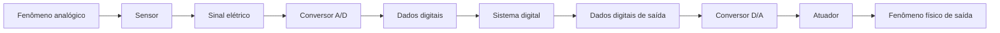
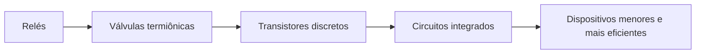
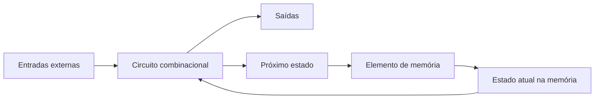
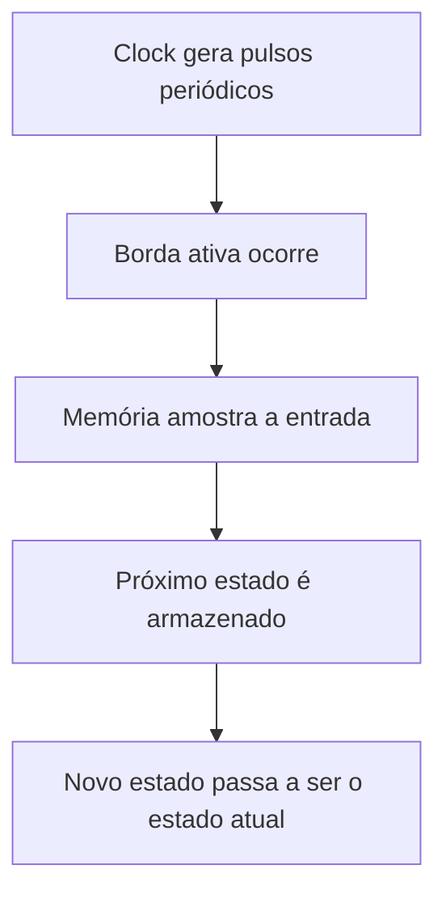
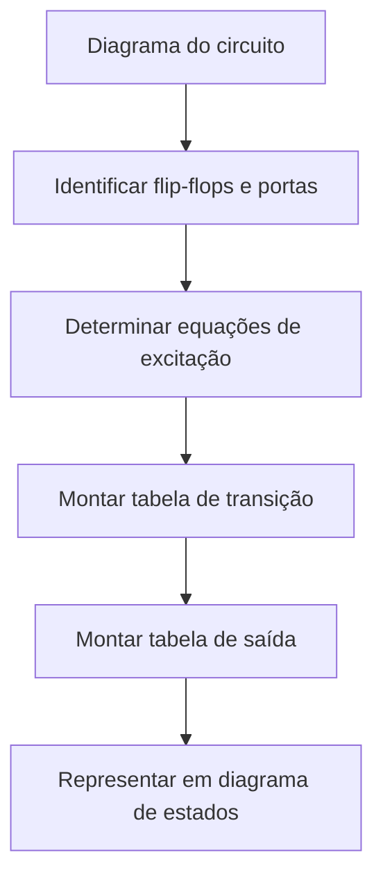
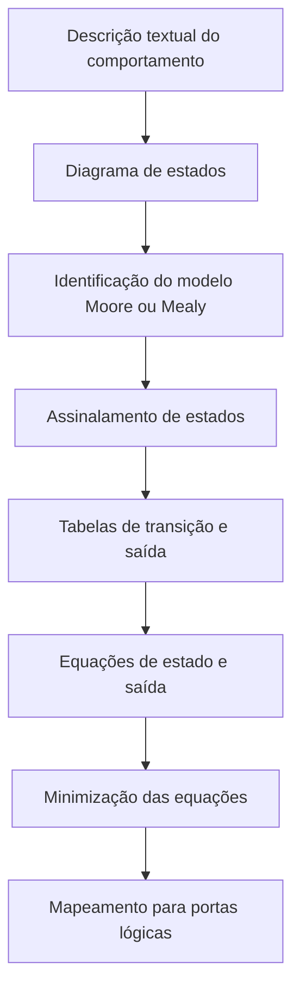

# Resumo 1.4 - Circuitos lógicos sequenciais

## 1. Contexto dos circuitos digitais

> [!info] Conceito
> Circuitos digitais trabalham com sinais representados em valores binários, normalmente `0` e `1`.

Os circuitos digitais estão presentes em computadores, celulares, câmeras digitais, videogames e equipamentos portáteis. Sua evolução permitiu que dispositivos antes grandes e difíceis de transportar se tornassem menores, mais rápidos, mais baratos e mais eficientes. A base dessa evolução está na capacidade de representar informações por meio de sinais digitais e processá-las com componentes eletrônicos.

Um **sinal analógico** pode assumir infinitos valores dentro de uma faixa contínua. Já um **sinal digital** assume valores finitos. Na computação, esses valores costumam ser representados por `0` e `1`, formando o sistema binário. O menor sinal binário é chamado de **bit**, ou dígito binário.

> [!tip] Resumindo
> O mundo físico é, em grande parte, analógico; os sistemas digitais precisam converter essas informações para `bits` antes de processá-las.

## 2. Sinais analógicos, digitais e conversão

> [!info] Conceito
> A conversão analógico-digital transforma fenômenos físicos em dados binários que podem ser processados por sistemas digitais.

Muitos fenômenos do mundo real, como temperatura, áudio, vídeo, fluxo de ar, velocidade e nível de combustível, aparecem originalmente em forma analógica. Para que um sistema digital consiga processar essas informações, primeiro é necessário medi-las com sensores, transformá-las em sinal elétrico e depois convertê-las em dados digitais.

O processo inverso também pode ocorrer. Um sistema digital pode gerar dados de saída, convertê-los em sinal elétrico por meio de um conversor digital-analógico e acionar atuadores para produzir uma ação física.



Esse fluxo mostra como um fenômeno analógico pode ser transformado em informação digital, processado por um sistema e, se necessário, convertido novamente em uma ação física.

> [!tip] Resumindo
> Sensores captam fenômenos físicos, conversores A/D transformam sinais em `bits`, sistemas digitais processam os dados e conversores D/A permitem gerar respostas no mundo físico.

## 3. Chaves eletrônicas e evolução dos circuitos digitais

> [!info] Conceito
> Chaves eletrônicas são a base dos circuitos digitais porque alternam entre dois estados: ligado e desligado.

Uma chave eletrônica funciona de modo semelhante a um interruptor. Ela pode bloquear ou permitir a passagem de corrente elétrica. Como possui dois estados possíveis, ela se adapta ao sistema binário: desligado pode representar `0`, e ligado pode representar `1`.

O transistor é um exemplo de chave eletrônica. Ele substituiu tecnologias anteriores e foi essencial para a popularização da eletrônica digital. Com o avanço tecnológico, os circuitos integrados passaram a reunir muitos transistores em uma única placa de silício, permitindo a criação de equipamentos menores e mais poderosos.

| Período                  | Tecnologia predominante               |
| ------------------------ | ------------------------------------- |
| Década de 1930           | Relés                                 |
| Década de 1940           | Válvulas termiônicas                  |
| Década de 1950           | Transistores discretos                |
| Década de 1960 em diante | Circuitos integrados com transistores |



> [!tip] Resumindo
> A evolução das chaves eletrônicas permitiu substituir componentes grandes e lentos por circuitos integrados compactos, rápidos e eficientes.

## 4. Circuitos digitais, combinacionais e sequenciais

> [!info] Conceito
> Um circuito digital recebe e produz sinais digitais. Ele pode ser combinacional ou sequencial.

Um **circuito digital** é formado pela conexão entre componentes que recebem entradas digitais e produzem saídas digitais. Um conjunto organizado de circuitos digitais forma um **sistema digital**.

Os circuitos digitais podem ser classificados em dois grupos principais: **combinacionais** e **sequenciais**.

Um **circuito lógico combinacional** produz saídas que dependem apenas dos valores atuais das entradas. Ele não possui memória, portanto não consegue armazenar informações para uso posterior.

Um **circuito lógico sequencial** combina um circuito combinacional com um elemento de memória. Por isso, suas saídas dependem não apenas das entradas atuais, mas também do estado armazenado na memória.

> [!warning] Atenção
> A principal diferença é a memória: circuitos combinacionais não armazenam estado; circuitos sequenciais armazenam informações e usam esse estado para decidir as próximas saídas.

| Tipo de circuito | Possui memória? | Saída depende de quê? |
|---|---:|---|
| Combinacional | Não | Entradas atuais |
| Sequencial | Sim | Entradas atuais e estado armazenado |

## 5. Estrutura de um circuito lógico sequencial

> [!info] Conceito
> Um circuito sequencial é formado por circuito combinacional, elemento de memória e realimentação.

No circuito sequencial, o circuito combinacional recebe entradas externas e também informações vindas da memória. Com base nesses dados, ele gera as saídas do sistema e define qual será o próximo estado.

As informações enviadas para o elemento de memória são chamadas de **variáveis do próximo estado**. Já as informações que saem da memória e retornam ao circuito combinacional são chamadas de **variáveis do estado atual**. Esse retorno forma um **laço de realimentação**, pois parte da saída do sistema volta a influenciar o próprio funcionamento do circuito.



Esse diagrama representa a ideia central de um circuito sequencial: o comportamento atual depende das entradas e também da informação armazenada anteriormente.

> [!tip] Resumindo
> O estado guardado na memória permite que o circuito sequencial “lembre” informações anteriores.

## 6. Estados em circuitos sequenciais

> [!info] Conceito
> Estado é a informação armazenada na memória de um circuito em determinado momento.

O estado de um circuito sequencial é definido pelos valores armazenados em sua memória. Como os circuitos digitais trabalham com dados binários, essa informação é codificada em `0` e `1`.

Um exemplo simples é uma porta automática de garagem. Ao pressionar o controle, a ação do sistema depende do estado atual da porta. Se ela está fechada, o comando pode abri-la. Se ela está aberta, o mesmo comando pode fechá-la. Portanto, a mesma entrada pode produzir saídas diferentes dependendo do estado armazenado.

> [!warning] Atenção
> Em circuitos sequenciais, não basta olhar apenas para a entrada atual. É necessário saber em qual estado o circuito se encontra.

## 7. Modelos de Moore e Mealy

> [!info] Conceito
> Os modelos de Moore e Mealy descrevem como as saídas de uma máquina de estados são determinadas.

Os circuitos sequenciais podem ser analisados como **máquinas de estados**. Dois modelos principais são utilizados: **Moore** e **Mealy**.

No **modelo de Moore**, as saídas ==dependem somente do estado atual do circuito==. Assim, a saída está diretamente associada ao estado em que a máquina se encontra.

No **modelo de Mealy**, as saídas dependem do ==estado atual== e também das ==entradas externas atuais==. Isso significa que uma mudança nas entradas pode alterar a saída antes mesmo da próxima troca de estado.

| Modelo | Saída depende do estado atual? | Saída depende das entradas atuais? |
|---|---:|---:|
| Moore | Sim | Não |
| Mealy | Sim | Sim |

> [!tip] Resumindo
> Moore depende apenas do estado. Mealy depende do estado e das entradas.

## 8. Circuitos síncronos e assíncronos

> [!info] Conceito
> Circuitos sequenciais podem mudar de estado com ou sem sincronização por clock.

Um **circuito sequencial assíncrono** pode ter seu ==estado alterado a qualquer momento==, conforme a ordem de mudança das entradas. Por depender diretamente dessas mudanças, pode se tornar instável e é mais difícil de utilizar.

Um **circuito sequencial síncrono** usa um ==sinal de temporização chamado **clock**==. O clock gera pulsos periódicos que definem os instantes em que a memória deve amostrar os valores de entrada e atualizar o estado do circuito.

O clock possui bordas, níveis e período. A **borda ascendente** ocorre quando o sinal sobe do nível baixo para o nível alto. A **borda descendente** ocorre quando o sinal desce do nível alto para o nível baixo. O **período**, representado por `T`, é o intervalo em que o ciclo do clock se repete.



> [!tip] Resumindo
> Em circuitos síncronos, as mudanças de estado são organizadas pelo clock, o que torna o comportamento mais previsível.

## 9. Frequência e período do clock

> [!info] Conceito
> A frequência indica quantos ciclos ocorrem por segundo; o período indica a duração de cada ciclo.

A frequência do clock é representada por `f` e corresponde ao inverso do período `T`.

```text
f = 1 / T
T = 1 / f
```

O período pode ser medido em segundos e seus submúltiplos, como milissegundos, microssegundos, nanossegundos e picossegundos. A frequência é medida em hertz e seus múltiplos, como kHz, MHz e GHz.

No exemplo de um clock de `2,4 GHz`, o tempo de ciclo é calculado como:

```text
T = 1 / (2,4 × 10⁹)
T ≈ 0,42 × 10⁻⁹ s
T ≈ 0,42 ns
```

> [!warning] Atenção
> Frequência alta significa período menor. Ou seja, quanto mais ciclos por segundo, menor o tempo disponível para cada ciclo.


## 10. Flip-flops

> [!info] Conceito  
> Flip-flops são elementos de memória usados em circuitos sequenciais síncronos para armazenar **1 bit** de informação.

Um **flip-flop** é um circuito digital capaz de guardar um valor binário, ou seja, `0` ou `1`. Diferentemente de um circuito combinacional, cuja saída depende apenas das entradas atuais, o flip-flop possui **memória**. Isso significa que sua saída também depende do estado que estava armazenado anteriormente.

Em geral, um flip-flop possui uma entrada de dados, uma entrada de clock e duas saídas. A saída `Q` representa o bit armazenado, enquanto a saída `Q̅` representa o complemento desse bit. Se `Q = 1`, então `Q̅ = 0`. Se `Q = 0`, então `Q̅ = 1`.

A principal característica do flip-flop é que ele não atualiza sua saída a qualquer momento. Em circuitos síncronos, a atualização ocorre somente em um instante específico do sinal de clock, normalmente na **borda de subida** ou na **borda de descida**.

A borda de subida ocorre quando o clock muda de `0` para `1`. A borda de descida ocorre quando o clock muda de `1` para `0`. Fora desse instante de transição, o flip-flop mantém o valor armazenado.


<div
  class="svg-diagram"
  style="
    width: 100%;
    max-width: 900px;
    margin: 1.5rem auto;
    overflow: hidden;
  "
>
  <svg
    width="900"
    height="420"
    viewBox="0 0 900 420"
    xmlns="http://www.w3.org/2000/svg"
    font-family="Arial, sans-serif"
    preserveAspectRatio="xMidYMid meet"
    class="logic-diagram"
    role="img"
    aria-label="Diagrama didático de um flip-flop D acionado por borda de clock"
    style="
      display: block;
      width: 100%;
      height: auto;
      aspect-ratio: 900 / 420;
    "
  >
    <defs>
      <marker id="ff-d-arrow-58273" viewBox="0 0 10 10" refX="8" refY="5" markerWidth="6" markerHeight="6" orient="auto">
        <path d="M1 1 L9 5 L1 9 Z" fill="#29B6E6"/>
      </marker>
      <marker id="ff-d-gray-arrow-58273" viewBox="0 0 10 10" refX="8" refY="5" markerWidth="6" markerHeight="6" orient="auto">
        <path d="M1 1 L9 5 L1 9 Z" fill="#aaaaaa"/>
      </marker>
    </defs>
    <rect width="900" height="420" fill="transparent"/>
    <!-- ===== Título ===== -->
    <text x="450" y="36" text-anchor="middle" fill="#D6F0FB" font-size="24" font-weight="700">Flip-flop D</text>
    <text x="450" y="62" text-anchor="middle" fill="#dddddd" font-size="14">Armazena 1 bit e atualiza a saída somente na borda ativa do clock</text>
    <!-- ===== Entradas ===== -->
    <rect x="40" y="110" width="185" height="210" rx="16" fill="#1A4A5E" fill-opacity="0.10" stroke="#7FCFF0" stroke-width="1.2"/>
    <text x="132" y="140" text-anchor="middle" fill="#D6F0FB" font-size="17" font-weight="700">Entradas</text>
    <circle cx="90" cy="205" r="7" fill="#29B6E6"/>
    <text x="115" y="211" fill="#eeeeee" font-size="18" font-weight="600">D</text>
    <text x="140" y="211" fill="#dddddd" font-size="13">dado</text>
    <circle cx="90" cy="270" r="7" fill="#29B6E6"/>
    <text x="115" y="276" fill="#eeeeee" font-size="18" font-weight="600">CLK</text>
    <text x="155" y="276" fill="#dddddd" font-size="13">clock</text>
    <!-- ===== Bloco do flip-flop ===== -->
    <rect x="350" y="120" width="220" height="190" rx="18" fill="#1A4A5E" fill-opacity="0.6" stroke="#7FCFF0" stroke-width="1.5"/>
    <text x="460" y="153" text-anchor="middle" fill="#D6F0FB" font-size="20" font-weight="700">Flip-flop D</text>
    <line x1="380" y1="172" x2="540" y2="172" stroke="#7FCFF0" stroke-width="1" opacity="0.7"/>
    <text x="460" y="205" text-anchor="middle" fill="#eeeeee" font-size="15">Na borda ativa:</text>
    <text x="460" y="232" text-anchor="middle" fill="#D6F0FB" font-size="18" font-weight="700">Q recebe D</text>
    <text x="460" y="265" text-anchor="middle" fill="#dddddd" font-size="13">Entre bordas, Q permanece</text>
    <!-- ===== Saídas ===== -->
    <rect x="675" y="110" width="185" height="210" rx="16" fill="#3C3489" fill-opacity="0.3" stroke="#A89CF5" stroke-width="1.2"/>
    <text x="767" y="140" text-anchor="middle" fill="#D6F0FB" font-size="17" font-weight="700">Saídas</text>
    <circle cx="815" cy="200" r="7" fill="#29B6E6"/>
    <text x="730" y="195" fill="#eeeeee" font-size="18" font-weight="700">Q</text>
    <text x="730" y="218" fill="#dddddd" font-size="13">bit armazenado</text>
    <circle cx="815" cy="275" r="7" fill="#29B6E6"/>
    <text x="730" y="270" fill="#eeeeee" font-size="18" font-weight="700">Q̅</text>
    <text x="730" y="293" fill="#dddddd" font-size="13">complemento</text>
    <!-- ===== Conexões ===== -->
    <path d="M97 205 H350" fill="none" stroke="#aaaaaa" stroke-width="1.7" vector-effect="non-scaling-stroke" marker-end="url(#ff-d-gray-arrow-58273)"/>
    <text x="250" y="193" text-anchor="middle" fill="#dddddd" font-size="13">valor que será armazenado</text>
    <path d="M97 270 H300 V275 H350" fill="none" stroke="#29B6E6" stroke-width="2" vector-effect="non-scaling-stroke" marker-end="url(#ff-d-arrow-58273)"/>
    <text x="250" y="292" text-anchor="middle" fill="#D6F0FB" font-size="13" font-weight="600">borda ativa controla a atualização</text>
    <path d="M570 200 H815" fill="none" stroke="#29B6E6" stroke-width="2.2" vector-effect="non-scaling-stroke" marker-end="url(#ff-d-arrow-58273)"/>
    <path d="M570 275 H815" fill="none" stroke="#888888" stroke-width="1.7" vector-effect="non-scaling-stroke" marker-end="url(#ff-d-gray-arrow-58273)"/>
    <!-- ===== Resumo ===== -->
    <rect x="100" y="350" width="700" height="48" rx="14" fill="#1A4A5E" fill-opacity="0.10" stroke="#7FCFF0" stroke-width="1"/>
    <text x="450" y="380" text-anchor="middle" fill="#eeeeee" font-size="14">Ideia central: o flip-flop guarda o valor de D no instante do clock e mantém esse valor depois.</text>
  </svg>
</div>


> [!tip] Resumindo  
> O flip-flop funciona como uma pequena memória de **1 bit** controlada pelo clock. Ele só muda de estado no momento correto do sinal de clock.

---

## 11. Latches

> [!info] Conceito  
> Latches são circuitos de memória sensíveis ao **nível** do sinal de controle.

Um **latch** também armazena informação, mas seu comportamento é diferente do flip-flop. O latch é sensível ao nível do sinal de controle. Isso significa que, enquanto o controle estiver habilitado, a saída pode acompanhar as mudanças das entradas.

Por isso, costuma-se dizer que o latch é **transparente** quando está habilitado. Nesse estado, a informação passa da entrada para a saída. Quando o controle é desabilitado, o latch deixa de acompanhar a entrada e mantém o último valor armazenado.

A diferença principal é:

- **Latch:** responde enquanto o sinal de controle está ativo.
- **Flip-flop:** responde somente na borda ativa do clock.

### Latch RS

O **latch RS** é um dos latches mais básicos. Ele possui duas entradas principais:

- `S`, de **set**, usada para colocar a saída `Q` em `1`;
- `R`, de **reset**, usada para colocar a saída `Q` em `0`.

Quando `R = 0` e `S = 0`, o latch mantém o estado anterior. Quando `S = 1`, ele armazena `1`. Quando `R = 1`, ele armazena `0`. A combinação `R = 1` e `S = 1` é considerada proibida, porque tenta ativar set e reset ao mesmo tempo.

|R|S|Próximo estado|Comentário|
|--:|--:|---|---|
|0|0|`Qt`|Mantém o estado anterior|
|0|1|`1`|Estado set|
|1|0|`0`|Estado reset|
|1|1|`-`|Estado proibido|


<div
  class="svg-diagram"
  style="
    width: 100%;
    max-width: 950px;
    margin: 1.5rem auto;
    overflow: hidden;
  "
>
  <svg
    width="950"
    height="430"
    viewBox="0 0 950 430"
    xmlns="http://www.w3.org/2000/svg"
    font-family="Arial, sans-serif"
    preserveAspectRatio="xMidYMid meet"
    class="logic-diagram"
    role="img"
    aria-label="Diagrama didático de um latch RS com entradas R e S e saídas Q e complemento de Q"
    style="
      display: block;
      width: 100%;
      height: auto;
      aspect-ratio: 950 / 430;
    "
  >
    <defs>
      <marker id="latch-rs-arrow-58273" viewBox="0 0 10 10" refX="8" refY="5" markerWidth="6" markerHeight="6" orient="auto">
        <path d="M1 1 L9 5 L1 9 Z" fill="#29B6E6"/>
      </marker>
      <marker id="latch-rs-gray-arrow-58273" viewBox="0 0 10 10" refX="8" refY="5" markerWidth="6" markerHeight="6" orient="auto">
        <path d="M1 1 L9 5 L1 9 Z" fill="#aaaaaa"/>
      </marker>
    </defs>
    <rect width="950" height="430" fill="transparent"/>
    <!-- ===== Título ===== -->
    <text x="475" y="36" text-anchor="middle" fill="#D6F0FB" font-size="24" font-weight="700">Latch RS</text>
    <text x="475" y="62" text-anchor="middle" fill="#dddddd" font-size="14">Armazena 1 bit usando entradas de set e reset</text>
    <!-- ===== Entradas ===== -->
    <rect x="40" y="105" width="180" height="190" rx="16" fill="#1A4A5E" fill-opacity="0.10" stroke="#7FCFF0" stroke-width="1.2"/>
    <text x="130" y="135" text-anchor="middle" fill="#D6F0FB" font-size="17" font-weight="700">Entradas</text>
    <circle cx="90" cy="190" r="7" fill="#29B6E6"/>
    <text x="115" y="196" fill="#eeeeee" font-size="18" font-weight="700">S</text>
    <text x="145" y="196" fill="#dddddd" font-size="13">set</text>
    <circle cx="90" cy="245" r="7" fill="#29B6E6"/>
    <text x="115" y="251" fill="#eeeeee" font-size="18" font-weight="700">R</text>
    <text x="145" y="251" fill="#dddddd" font-size="13">reset</text>
    <!-- ===== Bloco central ===== -->
    <rect x="345" y="115" width="250" height="170" rx="18" fill="#1A4A5E" fill-opacity="0.6" stroke="#7FCFF0" stroke-width="1.5"/>
    <text x="470" y="150" text-anchor="middle" fill="#D6F0FB" font-size="21" font-weight="700">Latch RS</text>
    <line x1="380" y1="170" x2="560" y2="170" stroke="#7FCFF0" stroke-width="1" opacity="0.7"/>
    <text x="470" y="202" text-anchor="middle" fill="#eeeeee" font-size="15">Guarda o estado atual</text>
    <text x="470" y="228" text-anchor="middle" fill="#D6F0FB" font-size="16" font-weight="600">Q(t)</text>
    <text x="470" y="255" text-anchor="middle" fill="#dddddd" font-size="13">Pode manter, setar ou resetar</text>
    <!-- ===== Saídas ===== -->
    <rect x="735" y="105" width="180" height="190" rx="16" fill="#3C3489" fill-opacity="0.3" stroke="#A89CF5" stroke-width="1.2"/>
    <text x="825" y="135" text-anchor="middle" fill="#D6F0FB" font-size="17" font-weight="700">Saídas</text>
    <circle cx="865" cy="190" r="7" fill="#29B6E6"/>
    <text x="775" y="185" fill="#eeeeee" font-size="18" font-weight="700">Q</text>
    <text x="775" y="208" fill="#dddddd" font-size="13">estado</text>
    <circle cx="865" cy="245" r="7" fill="#29B6E6"/>
    <text x="775" y="240" fill="#eeeeee" font-size="18" font-weight="700">Q̅</text>
    <text x="775" y="263" fill="#dddddd" font-size="13">complemento</text>
    <!-- ===== Conexões ===== -->
    <path d="M97 190 H345" fill="none" stroke="#aaaaaa" stroke-width="1.7" vector-effect="non-scaling-stroke" marker-end="url(#latch-rs-gray-arrow-58273)"/>
    <path d="M97 245 H345" fill="none" stroke="#aaaaaa" stroke-width="1.7" vector-effect="non-scaling-stroke" marker-end="url(#latch-rs-gray-arrow-58273)"/>
    <path d="M595 190 H865" fill="none" stroke="#29B6E6" stroke-width="2.2" vector-effect="non-scaling-stroke" marker-end="url(#latch-rs-arrow-58273)"/>
    <path d="M595 245 H865" fill="none" stroke="#888888" stroke-width="1.7" vector-effect="non-scaling-stroke" marker-end="url(#latch-rs-gray-arrow-58273)"/>
    <!-- ===== Estados ===== -->
    <rect x="95" y="330" width="175" height="55" rx="12" fill="#1A4A5E" fill-opacity="0.3" stroke="#7FCFF0" stroke-width="1"/>
    <text x="182" y="352" text-anchor="middle" fill="#D6F0FB" font-size="14" font-weight="700">R=0, S=0</text>
    <text x="182" y="374" text-anchor="middle" fill="#eeeeee" font-size="13">mantém Q</text>
    <rect x="295" y="330" width="175" height="55" rx="12" fill="#1A4A5E" fill-opacity="0.3" stroke="#7FCFF0" stroke-width="1"/>
    <text x="382" y="352" text-anchor="middle" fill="#D6F0FB" font-size="14" font-weight="700">R=0, S=1</text>
    <text x="382" y="374" text-anchor="middle" fill="#eeeeee" font-size="13">set: Q=1</text>
    <rect x="495" y="330" width="175" height="55" rx="12" fill="#1A4A5E" fill-opacity="0.3" stroke="#7FCFF0" stroke-width="1"/>
    <text x="582" y="352" text-anchor="middle" fill="#D6F0FB" font-size="14" font-weight="700">R=1, S=0</text>
    <text x="582" y="374" text-anchor="middle" fill="#eeeeee" font-size="13">reset: Q=0</text>
    <rect x="695" y="330" width="175" height="55" rx="12" fill="#3C3489" fill-opacity="0.3" stroke="#A89CF5" stroke-width="1"/>
    <text x="782" y="352" text-anchor="middle" fill="#D6F0FB" font-size="14" font-weight="700">R=1, S=1</text>
    <text x="782" y="374" text-anchor="middle" fill="#eeeeee" font-size="13">proibido</text>
  </svg>
</div>


> [!warning] Atenção  
> No latch RS, a combinação `R = 1` e `S = 1` deve ser evitada, pois aciona reset e set ao mesmo tempo.

### Latch RS controlado

O **latch RS controlado** acrescenta uma entrada de controle `C`. Essa entrada funciona como uma autorização para o latch responder a `R` e `S`.

Quando `C = 0`, o latch fica bloqueado e mantém o estado anterior, mesmo que `R` e `S` mudem. Quando `C = 1`, o latch passa a responder às entradas `R` e `S`.

|C|R|S|Próximo estado|Comentário|
|--:|--:|--:|---|---|
|0|X|X|`Qt`|Mantém o estado anterior|
|1|0|0|`Qt`|Mantém o estado anterior|
|1|0|1|`1`|Estado set|
|1|1|0|`0`|Estado reset|
|1|1|1|`-`|Proibido|

O símbolo `X` significa “tanto faz”. Quando `C = 0`, os valores de `R` e `S` não alteram a saída.

### Latch D

O **latch D** foi criado para simplificar o uso do latch RS e evitar sua combinação proibida. Em vez de usar duas entradas independentes, ele usa apenas uma entrada de dados `D`.

A ideia é simples:

- se `D = 1`, o latch deve armazenar `1`;
- se `D = 0`, o latch deve armazenar `0`.

Para isso, internamente, o circuito gera sinais equivalentes a set e reset de forma controlada. Assim, o usuário não precisa se preocupar em acionar `R` e `S` ao mesmo tempo.

Quando `C = 1`, o latch D fica transparente e a saída `Q` acompanha `D`. Quando `C = 0`, ele mantém o último valor armazenado.

|C|D|Próximo estado|
|--:|--:|---|
|0|X|`Qt`|
|1|0|`0`|
|1|1|`1`|


<div
  class="svg-diagram"
  style="
    width: 100%;
    max-width: 950px;
    margin: 1.5rem auto;
    overflow: hidden;
  "
>
  <svg
    width="950"
    height="390"
    viewBox="0 0 950 390"
    xmlns="http://www.w3.org/2000/svg"
    font-family="Arial, sans-serif"
    preserveAspectRatio="xMidYMid meet"
    class="logic-diagram"
    role="img"
    aria-label="Diagrama didático de um latch D com entrada D, controle C e saída Q"
    style="
      display: block;
      width: 100%;
      height: auto;
      aspect-ratio: 950 / 390;
    "
  >
    <defs>
      <marker id="latch-d-arrow-58273" viewBox="0 0 10 10" refX="8" refY="5" markerWidth="6" markerHeight="6" orient="auto">
        <path d="M1 1 L9 5 L1 9 Z" fill="#29B6E6"/>
      </marker>
      <marker id="latch-d-gray-arrow-58273" viewBox="0 0 10 10" refX="8" refY="5" markerWidth="6" markerHeight="6" orient="auto">
        <path d="M1 1 L9 5 L1 9 Z" fill="#aaaaaa"/>
      </marker>
    </defs>
    <rect width="950" height="390" fill="transparent"/>
    <!-- ===== Título ===== -->
    <text x="475" y="36" text-anchor="middle" fill="#D6F0FB" font-size="24" font-weight="700">Latch D</text>
    <text x="475" y="62" text-anchor="middle" fill="#dddddd" font-size="14">Usa uma única entrada de dado e evita a condição proibida do latch RS</text>
    <!-- ===== Entradas ===== -->
    <rect x="45" y="110" width="180" height="175" rx="16" fill="#1A4A5E" fill-opacity="0.10" stroke="#7FCFF0" stroke-width="1.2"/>
    <text x="135" y="140" text-anchor="middle" fill="#D6F0FB" font-size="17" font-weight="700">Entradas</text>
    <circle cx="90" cy="195" r="7" fill="#29B6E6"/>
    <text x="115" y="201" fill="#eeeeee" font-size="18" font-weight="700">D</text>
    <text x="145" y="201" fill="#dddddd" font-size="13">dado</text>
    <circle cx="90" cy="250" r="7" fill="#29B6E6"/>
    <text x="115" y="256" fill="#eeeeee" font-size="18" font-weight="700">C</text>
    <text x="145" y="256" fill="#dddddd" font-size="13">controle</text>
    <!-- ===== Controle ===== -->
    <rect x="310" y="130" width="180" height="135" rx="16" fill="#1A4A5E" fill-opacity="0.3" stroke="#7FCFF0" stroke-width="1.4"/>
    <text x="400" y="162" text-anchor="middle" fill="#D6F0FB" font-size="18" font-weight="700">Controle</text>
    <text x="400" y="193" text-anchor="middle" fill="#eeeeee" font-size="14">C = 1: passa D</text>
    <text x="400" y="220" text-anchor="middle" fill="#eeeeee" font-size="14">C = 0: mantém Q</text>
    <text x="400" y="245" text-anchor="middle" fill="#dddddd" font-size="13">funciona como uma porta</text>
    <!-- ===== Latch ===== -->
    <rect x="590" y="130" width="180" height="135" rx="16" fill="#1A4A5E" fill-opacity="0.6" stroke="#7FCFF0" stroke-width="1.4"/>
    <text x="680" y="162" text-anchor="middle" fill="#D6F0FB" font-size="18" font-weight="700">Memória</text>
    <text x="680" y="193" text-anchor="middle" fill="#eeeeee" font-size="14">armazena 1 bit</text>
    <text x="680" y="220" text-anchor="middle" fill="#D6F0FB" font-size="16" font-weight="700">Q</text>
    <text x="680" y="245" text-anchor="middle" fill="#dddddd" font-size="13">último valor aceito</text>
    <!-- ===== Saída ===== -->
    <circle cx="855" cy="197" r="7" fill="#29B6E6"/>
    <text x="805" y="192" fill="#eeeeee" font-size="18" font-weight="700">Q</text>
    <text x="805" y="215" fill="#dddddd" font-size="13">saída</text>
    <!-- ===== Conexões ===== -->
    <path d="M97 195 H310" fill="none" stroke="#aaaaaa" stroke-width="1.7" vector-effect="non-scaling-stroke" marker-end="url(#latch-d-gray-arrow-58273)"/>
    <path d="M97 250 H260 V235 H310" fill="none" stroke="#29B6E6" stroke-width="2" vector-effect="non-scaling-stroke" marker-end="url(#latch-d-arrow-58273)"/>
    <path d="M490 197 H590" fill="none" stroke="#29B6E6" stroke-width="2.2" vector-effect="non-scaling-stroke" marker-end="url(#latch-d-arrow-58273)"/>
    <path d="M770 197 H855" fill="none" stroke="#29B6E6" stroke-width="2.2" vector-effect="non-scaling-stroke" marker-end="url(#latch-d-arrow-58273)"/>
    <!-- ===== Resumo ===== -->
    <rect x="130" y="315" width="690" height="45" rx="14" fill="#1A4A5E" fill-opacity="0.10" stroke="#7FCFF0" stroke-width="1"/>
    <text x="475" y="343" text-anchor="middle" fill="#eeeeee" font-size="14">Quando C=1, Q acompanha D. Quando C=0, Q mantém o valor anterior.</text>
  </svg>
</div>


> [!tip] Resumindo  
> O latch D simplifica o armazenamento porque usa apenas uma entrada de dado. Ele evita a combinação proibida do latch RS.

---

## 12. Flip-flop D mestre-escravo e flip-flop JK

> [!info] Conceito  
> Flip-flops mais complexos podem ser construídos a partir de latches.

### Flip-flop D mestre-escravo

O **flip-flop D mestre-escravo** é formado por dois latches D ligados em sequência. O primeiro latch é chamado de **mestre**, e o segundo é chamado de **escravo**.

A ideia desse arranjo é impedir que a entrada `D` atravesse diretamente até a saída final `Q` durante todo o tempo em que o clock está ativo. Em vez disso, o circuito divide o processo em duas etapas:

1. o latch mestre captura a informação de entrada;
2. o latch escravo transfere essa informação para a saída em outro momento do clock.


Enquanto um latch está habilitado, o outro fica bloqueado. Isso permite que o flip-flop funcione de forma mais controlada, aproximando seu comportamento de uma atualização por borda.


<div
  class="svg-diagram"
  style="
    width: 100%;
    max-width: 950px;
    margin: 1.5rem auto;
    overflow: hidden;
  "
>
  <svg
    width="950"
    height="390"
    viewBox="0 0 950 390"
    xmlns="http://www.w3.org/2000/svg"
    font-family="Arial, sans-serif"
    preserveAspectRatio="xMidYMid meet"
    class="logic-diagram"
    role="img"
    aria-label="Diagrama didático de um flip-flop D mestre-escravo formado por dois latches D"
    style="
      display: block;
      width: 100%;
      height: auto;
      aspect-ratio: 950 / 390;
    "
  >
    <defs>
      <marker id="ms-d-arrow-58273" viewBox="0 0 10 10" refX="8" refY="5" markerWidth="6" markerHeight="6" orient="auto">
        <path d="M1 1 L9 5 L1 9 Z" fill="#29B6E6"/>
      </marker>
      <marker id="ms-d-gray-arrow-58273" viewBox="0 0 10 10" refX="8" refY="5" markerWidth="6" markerHeight="6" orient="auto">
        <path d="M1 1 L9 5 L1 9 Z" fill="#aaaaaa"/>
      </marker>
    </defs>
    <rect width="950" height="390" fill="transparent"/>
    <!-- ===== Título ===== -->
    <text x="475" y="36" text-anchor="middle" fill="#D6F0FB" font-size="24" font-weight="700">Flip-flop D mestre-escravo</text>
    <text x="475" y="62" text-anchor="middle" fill="#dddddd" font-size="14">Dois latches D em cascata controlam quando a informação chega à saída</text>
    <!-- ===== Entrada ===== -->
    <circle cx="75" cy="180" r="7" fill="#29B6E6"/>
    <text x="45" y="175" fill="#eeeeee" font-size="18" font-weight="700">D</text>
    <text x="35" y="202" fill="#dddddd" font-size="13">entrada</text>
    <!-- ===== Mestre ===== -->
    <rect x="180" y="120" width="220" height="130" rx="17" fill="#1A4A5E" fill-opacity="0.6" stroke="#7FCFF0" stroke-width="1.4"/>
    <text x="290" y="153" text-anchor="middle" fill="#D6F0FB" font-size="20" font-weight="700">Latch mestre</text>
    <text x="290" y="184" text-anchor="middle" fill="#eeeeee" font-size="14">captura D</text>
    <text x="290" y="211" text-anchor="middle" fill="#dddddd" font-size="13">habilitado em uma fase</text>
    <!-- ===== Escravo ===== -->
    <rect x="550" y="120" width="220" height="130" rx="17" fill="#1A4A5E" fill-opacity="0.3" stroke="#7FCFF0" stroke-width="1.4"/>
    <text x="660" y="153" text-anchor="middle" fill="#D6F0FB" font-size="20" font-weight="700">Latch escravo</text>
    <text x="660" y="184" text-anchor="middle" fill="#eeeeee" font-size="14">atualiza Q</text>
    <text x="660" y="211" text-anchor="middle" fill="#dddddd" font-size="13">habilitado na fase oposta</text>
    <!-- ===== Saída ===== -->
    <circle cx="865" cy="180" r="7" fill="#29B6E6"/>
    <text x="830" y="175" fill="#eeeeee" font-size="18" font-weight="700">Q</text>
    <text x="815" y="202" fill="#dddddd" font-size="13">saída</text>
    <!-- ===== Clock ===== -->
    <circle cx="290" cy="310" r="7" fill="#29B6E6"/>
    <text x="240" y="316" fill="#eeeeee" font-size="17" font-weight="700">CLK</text>
    <circle cx="660" cy="310" r="7" fill="#29B6E6"/>
    <text x="610" y="316" fill="#eeeeee" font-size="17" font-weight="700">CLK̅</text>
    <!-- ===== Conexões ===== -->
    <path d="M82 180 H180" fill="none" stroke="#aaaaaa" stroke-width="1.7" vector-effect="non-scaling-stroke" marker-end="url(#ms-d-gray-arrow-58273)"/>
    <path d="M400 180 H550" fill="none" stroke="#29B6E6" stroke-width="2.2" vector-effect="non-scaling-stroke" marker-end="url(#ms-d-arrow-58273)"/>
    <text x="475" y="168" text-anchor="middle" fill="#D6F0FB" font-size="14" font-weight="600">valor intermediário</text>
    <path d="M770 180 H865" fill="none" stroke="#29B6E6" stroke-width="2.2" vector-effect="non-scaling-stroke" marker-end="url(#ms-d-arrow-58273)"/>
    <path d="M290 303 V250" fill="none" stroke="#29B6E6" stroke-width="2" vector-effect="non-scaling-stroke" marker-end="url(#ms-d-arrow-58273)"/>
    <path d="M660 303 V250" fill="none" stroke="#29B6E6" stroke-width="2" vector-effect="non-scaling-stroke" marker-end="url(#ms-d-arrow-58273)"/>
    <!-- ===== Explicação ===== -->
    <rect x="120" y="335" width="710" height="35" rx="12" fill="#1A4A5E" fill-opacity="0.10" stroke="#7FCFF0" stroke-width="1"/>
    <text x="475" y="358" text-anchor="middle" fill="#eeeeee" font-size="14">Quando um latch está aberto, o outro está fechado, evitando passagem direta de D para Q.</text>
  </svg>
</div>


### Flip-flop JK

O **flip-flop JK** é uma evolução do comportamento RS. Ele possui duas entradas principais:

- `J`, que funciona de forma parecida com o set;
- `K`, que funciona de forma parecida com o reset.


A diferença importante é que, no JK, a combinação `J = 1` e `K = 1` não é proibida. Em vez disso, ela faz o flip-flop alternar seu estado. Se `Q` era `0`, passa a ser `1`. Se `Q` era `1`, passa a ser `0`.

Esse comportamento é chamado de **toggle**, ou alternância.

|J|K|Próximo estado|Comentário|
|--:|--:|---|---|
|0|0|`Qt`|Mantém o estado anterior|
|0|1|`0`|Reset|
|1|0|`1`|Set|
|1|1|`Q̅t`|Alterna o estado|

<div
  class="svg-diagram"
  style="
    width: 100%;
    max-width: 950px;
    margin: 1.5rem auto;
    overflow: hidden;
  "
>
  <svg
    width="950"
    height="420"
    viewBox="0 0 950 420"
    xmlns="http://www.w3.org/2000/svg"
    font-family="Arial, sans-serif"
    preserveAspectRatio="xMidYMid meet"
    class="logic-diagram"
    role="img"
    aria-label="Diagrama didático de um flip-flop JK com estados de manter, resetar, setar e alternar"
    style="
      display: block;
      width: 100%;
      height: auto;
      aspect-ratio: 950 / 420;
    "
  >
    <defs>
      <marker id="jk-arrow-58273" viewBox="0 0 10 10" refX="8" refY="5" markerWidth="6" markerHeight="6" orient="auto">
        <path d="M1 1 L9 5 L1 9 Z" fill="#29B6E6"/>
      </marker>
      <marker id="jk-gray-arrow-58273" viewBox="0 0 10 10" refX="8" refY="5" markerWidth="6" markerHeight="6" orient="auto">
        <path d="M1 1 L9 5 L1 9 Z" fill="#aaaaaa"/>
      </marker>
    </defs>
    <rect width="950" height="420" fill="transparent"/>
    <!-- ===== Título ===== -->
    <text x="475" y="36" text-anchor="middle" fill="#D6F0FB" font-size="24" font-weight="700">Flip-flop JK</text>
    <text x="475" y="62" text-anchor="middle" fill="#dddddd" font-size="14">Resolve o estado proibido do RS usando alternância quando J=1 e K=1</text>
    <!-- ===== Entradas ===== -->
    <rect x="45" y="100" width="180" height="215" rx="16" fill="#1A4A5E" fill-opacity="0.10" stroke="#7FCFF0" stroke-width="1.2"/>
    <text x="135" y="130" text-anchor="middle" fill="#D6F0FB" font-size="17" font-weight="700">Entradas</text>
    <circle cx="90" cy="185" r="7" fill="#29B6E6"/>
    <text x="115" y="191" fill="#eeeeee" font-size="18" font-weight="700">J</text>
    <text x="145" y="191" fill="#dddddd" font-size="13">set</text>
    <circle cx="90" cy="240" r="7" fill="#29B6E6"/>
    <text x="115" y="246" fill="#eeeeee" font-size="18" font-weight="700">K</text>
    <text x="145" y="246" fill="#dddddd" font-size="13">reset</text>
    <circle cx="90" cy="290" r="7" fill="#29B6E6"/>
    <text x="115" y="296" fill="#eeeeee" font-size="18" font-weight="700">CLK</text>
    <!-- ===== Bloco JK ===== -->
    <rect x="350" y="120" width="245" height="170" rx="18" fill="#1A4A5E" fill-opacity="0.6" stroke="#7FCFF0" stroke-width="1.5"/>
    <text x="472" y="153" text-anchor="middle" fill="#D6F0FB" font-size="21" font-weight="700">Flip-flop JK</text>
    <line x1="385" y1="173" x2="560" y2="173" stroke="#7FCFF0" stroke-width="1" opacity="0.7"/>
    <text x="472" y="204" text-anchor="middle" fill="#eeeeee" font-size="14">J=0, K=0: mantém</text>
    <text x="472" y="228" text-anchor="middle" fill="#eeeeee" font-size="14">J=1, K=0: seta</text>
    <text x="472" y="252" text-anchor="middle" fill="#eeeeee" font-size="14">J=0, K=1: reseta</text>
    <text x="472" y="276" text-anchor="middle" fill="#D6F0FB" font-size="14" font-weight="700">J=1, K=1: alterna</text>
    <!-- ===== Saída ===== -->
    <rect x="725" y="100" width="180" height="215" rx="16" fill="#3C3489" fill-opacity="0.3" stroke="#A89CF5" stroke-width="1.2"/>
    <text x="815" y="130" text-anchor="middle" fill="#D6F0FB" font-size="17" font-weight="700">Saída</text>
    <circle cx="855" cy="200" r="7" fill="#29B6E6"/>
    <text x="770" y="195" fill="#eeeeee" font-size="18" font-weight="700">Q</text>
    <text x="770" y="218" fill="#dddddd" font-size="13">estado atual</text>
    <circle cx="855" cy="260" r="7" fill="#29B6E6"/>
    <text x="770" y="255" fill="#eeeeee" font-size="18" font-weight="700">Q̅</text>
    <text x="770" y="278" fill="#dddddd" font-size="13">complemento</text>
    <!-- ===== Conexões ===== -->
    <path d="M97 185 H350" fill="none" stroke="#aaaaaa" stroke-width="1.7" vector-effect="non-scaling-stroke" marker-end="url(#jk-gray-arrow-58273)"/>
    <path d="M97 240 H350" fill="none" stroke="#aaaaaa" stroke-width="1.7" vector-effect="non-scaling-stroke" marker-end="url(#jk-gray-arrow-58273)"/>
    <path d="M97 290 H300 V270 H350" fill="none" stroke="#29B6E6" stroke-width="2" vector-effect="non-scaling-stroke" marker-end="url(#jk-arrow-58273)"/>
    <path d="M595 200 H855" fill="none" stroke="#29B6E6" stroke-width="2.2" vector-effect="non-scaling-stroke" marker-end="url(#jk-arrow-58273)"/>
    <path d="M595 260 H855" fill="none" stroke="#888888" stroke-width="1.7" vector-effect="non-scaling-stroke" marker-end="url(#jk-gray-arrow-58273)"/>
    <!-- ===== Resumo ===== -->
    <rect x="105" y="350" width="740" height="45" rx="14" fill="#1A4A5E" fill-opacity="0.10" stroke="#7FCFF0" stroke-width="1"/>
    <text x="475" y="378" text-anchor="middle" fill="#eeeeee" font-size="14">A principal vantagem do JK é transformar o estado proibido do RS em alternância controlada.</text>
  </svg>
</div>


> [!tip] Resumindo  
> O flip-flop JK melhora o comportamento do RS porque a combinação `J = 1` e `K = 1` não é inválida. Ela faz o circuito alternar o valor armazenado.

## 13. Portas lógicas básicas

> [!info] Conceito
> Portas lógicas implementam funções lógicas usando entradas e saídas binárias.

As **portas lógicas** são componentes fundamentais dos circuitos digitais. Elas recebem valores binários de entrada e produzem uma saída conforme uma regra lógica.

As três portas básicas são **AND**, **OR** e **NOT**.

A porta **AND**, ou porta **E**, gera saída `1` somente quando todas as entradas são `1`.

| A | B | Y |
|---|---|---|
| 0 | 0 | 0 |
| 0 | 1 | 0 |
| 1 | 0 | 0 |
| 1 | 1 | 1 |

A porta **OR**, ou porta **OU**, gera saída `1` quando pelo menos uma entrada é `1`.

| A | B | Y |
|---|---|---|
| 0 | 0 | 0 |
| 0 | 1 | 1 |
| 1 | 0 | 1 |
| 1 | 1 | 1 |

A porta **NOT**, ou inversora, inverte o valor recebido.

| A | Y |
|---|---|
| 0 | 1 |
| 1 | 0 |

> [!tip] Resumindo
> AND exige todas as entradas em `1`; OR exige pelo menos uma entrada em `1`; NOT inverte a entrada.

## 14. Portas lógicas derivadas

> [!info] Conceito
> Portas derivadas são construídas a partir das portas lógicas básicas.

As portas **NAND**, **NOR**, **XOR** e **XNOR** são derivadas das portas básicas. Em muitos casos, a diferença está na inversão da saída ou na comparação entre entradas.

| Porta | Funcionamento                              |
| ----- | ------------------------------------------ |
| NAND  | É a porta AND com saída invertida          |
| NOR   | É a porta OR com saída invertida           |
| XOR   | Gera `1` quando as entradas são diferentes |
| XNOR  | Gera `1` quando as entradas são iguais     |

### NAND

| A | B | Y |
|---|---|---|
| 0 | 0 | 1 |
| 0 | 1 | 1 |
| 1 | 0 | 1 |
| 1 | 1 | 0 |

### NOR

| A | B | Y |
|---|---|---|
| 0 | 0 | 1 |
| 0 | 1 | 0 |
| 1 | 0 | 0 |
| 1 | 1 | 0 |

### XOR

| A | B | Y |
|---|---|---|
| 0 | 0 | 0 |
| 0 | 1 | 1 |
| 1 | 0 | 1 |
| 1 | 1 | 0 |

### XNOR

| A | B | Y |
|---|---|---|
| 0 | 0 | 1 |
| 0 | 1 | 0 |
| 1 | 0 | 0 |
| 1 | 1 | 1 |

> [!tip] Resumindo
> NAND e NOR são versões negadas de AND e OR. XOR identifica diferença; XNOR identifica igualdade.

## 15. Análise de circuitos sequenciais

> [!info] Conceito
> Analisar um circuito sequencial significa descrever seu comportamento a partir de sua estrutura.

A análise de circuitos sequenciais parte da identificação dos flip-flops, portas lógicas, entradas, saídas e conexões. Como esses circuitos possuem memória, seu comportamento é mais difícil de representar do que o de circuitos combinacionais.

Para descrever o funcionamento de um circuito sequencial, podem ser usados:

- diagramas de estado;
- tabelas de transição de estados;
- tabelas de saída;
- equações booleanas;
- equações de excitação.

As **equações de excitação** descrevem os sinais aplicados às entradas dos flip-flops. Esses sinais determinam qual será o próximo estado do circuito no próximo ciclo de clock.



> [!tip] Resumindo
> A análise transforma a estrutura física/lógica do circuito em uma descrição organizada de seu comportamento.

## 16. Projeto de circuitos sequenciais

> [!info] Conceito
> Projetar um circuito sequencial significa partir do comportamento desejado e chegar à implementação lógica.

O projeto começa com uma descrição textual do comportamento esperado. Em seguida, esse comportamento é transformado em um diagrama de estados, no qual são definidos os estados possíveis, as condições de transição e os valores de saída.

Depois disso, os estados recebem nomes simbólicos ou valores binários. Essa etapa é chamada de **assinalamento de estados**. A partir das tabelas de transição e saída, são obtidas as equações de estado e de saída.

Quando há muitas variáveis, mapas de Karnaugh podem ser usados para simplificar equações. Se a minimização manual não for suficiente, pode ser necessário usar software de minimização. Ao final, as funções são mapeadas para as portas lógicas disponíveis.



> [!tip] Resumindo
> No projeto, primeiro se define o comportamento; depois se constrói a lógica que realiza esse comportamento.

## Síntese final

> [!summary] Síntese
> Circuitos lógicos sequenciais são circuitos digitais com memória. Eles combinam lógica combinacional, elementos de memória e realimentação para produzir saídas que dependem das entradas atuais e do estado armazenado.

Os materiais mostram que os circuitos digitais se baseiam em sinais binários, portas lógicas e chaves eletrônicas. Os circuitos combinacionais produzem saídas apenas a partir das entradas atuais, enquanto os circuitos sequenciais acrescentam memória e passam a trabalhar com estados.

A compreensão dos modelos de Moore e Mealy permite entender como as saídas são geradas em máquinas de estados. A distinção entre circuitos síncronos e assíncronos mostra a importância do clock para organizar a mudança de estados. Latches e flip-flops são componentes essenciais porque armazenam bits, permitindo que os circuitos digitais tenham memória.

Por fim, o projeto de circuitos sequenciais exige transformar uma descrição de comportamento em diagramas, tabelas, equações e portas lógicas. Assim, o estudo dos circuitos lógicos sequenciais conecta conceitos fundamentais de sinais digitais, portas lógicas, memória, clock e máquinas de estados.