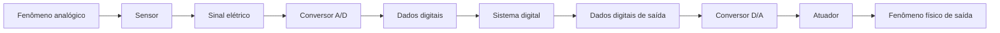
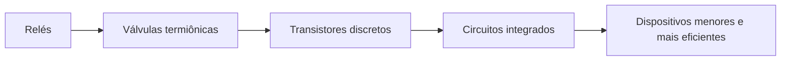
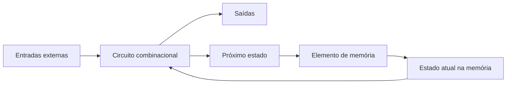
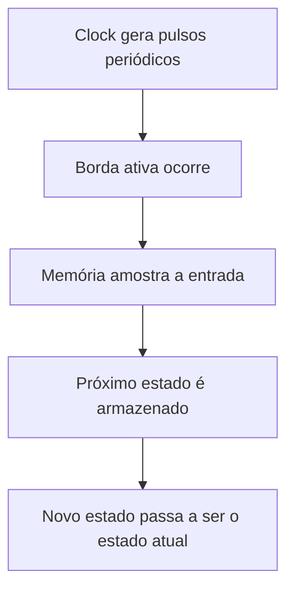
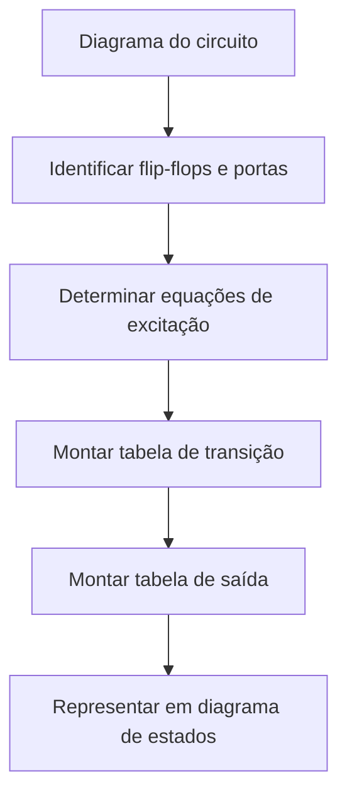
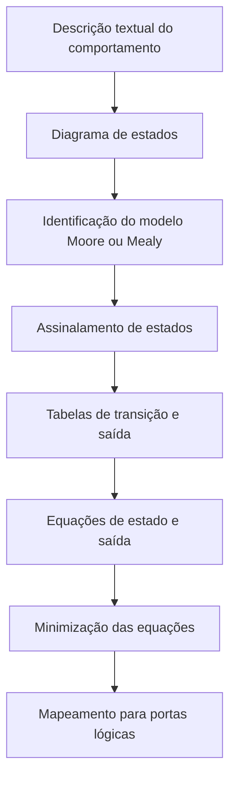

# Resumo 1.4 - Circuitos lógicos sequenciais

## 1. Contexto dos circuitos digitais

> [!info] Conceito
> Circuitos digitais trabalham com sinais representados em valores binários, normalmente `0` e `1`.

Os circuitos digitais estão presentes em computadores, celulares, câmeras digitais, videogames e equipamentos portáteis. Sua evolução permitiu que dispositivos antes grandes e difíceis de transportar se tornassem menores, mais rápidos, mais baratos e mais eficientes. A base dessa evolução está na capacidade de representar informações por meio de sinais digitais e processá-las com componentes eletrônicos.

Um **sinal analógico** pode assumir infinitos valores dentro de uma faixa contínua. Já um **sinal digital** assume valores finitos. Na computação, esses valores costumam ser representados por `0` e `1`, formando o sistema binário. O menor sinal binário é chamado de **bit**, ou dígito binário.

> [!tip] Resumindo
> O mundo físico é, em grande parte, analógico; os sistemas digitais precisam converter essas informações para `bits` antes de processá-las.

## 2. Sinais analógicos, digitais e conversão

> [!info] Conceito
> A conversão analógico-digital transforma fenômenos físicos em dados binários que podem ser processados por sistemas digitais.

Muitos fenômenos do mundo real, como temperatura, áudio, vídeo, fluxo de ar, velocidade e nível de combustível, aparecem originalmente em forma analógica. Para que um sistema digital consiga processar essas informações, primeiro é necessário medi-las com sensores, transformá-las em sinal elétrico e depois convertê-las em dados digitais.

O processo inverso também pode ocorrer. Um sistema digital pode gerar dados de saída, convertê-los em sinal elétrico por meio de um conversor digital-analógico e acionar atuadores para produzir uma ação física.



Esse fluxo mostra como um fenômeno analógico pode ser transformado em informação digital, processado por um sistema e, se necessário, convertido novamente em uma ação física.

> [!tip] Resumindo
> Sensores captam fenômenos físicos, conversores A/D transformam sinais em `bits`, sistemas digitais processam os dados e conversores D/A permitem gerar respostas no mundo físico.

## 3. Chaves eletrônicas e evolução dos circuitos digitais

> [!info] Conceito
> Chaves eletrônicas são a base dos circuitos digitais porque alternam entre dois estados: ligado e desligado.

Uma chave eletrônica funciona de modo semelhante a um interruptor. Ela pode bloquear ou permitir a passagem de corrente elétrica. Como possui dois estados possíveis, ela se adapta ao sistema binário: desligado pode representar `0`, e ligado pode representar `1`.

O transistor é um exemplo de chave eletrônica. Ele substituiu tecnologias anteriores e foi essencial para a popularização da eletrônica digital. Com o avanço tecnológico, os circuitos integrados passaram a reunir muitos transistores em uma única placa de silício, permitindo a criação de equipamentos menores e mais poderosos.

| Período | Tecnologia predominante |
|---|---|
| Década de 1930 | Relés |
| Década de 1940 | Válvulas termiônicas |
| Década de 1950 | Transistores discretos |
| Década de 1960 em diante | Circuitos integrados com transistores |



> [!tip] Resumindo
> A evolução das chaves eletrônicas permitiu substituir componentes grandes e lentos por circuitos integrados compactos, rápidos e eficientes.

## 4. Circuitos digitais, combinacionais e sequenciais

> [!info] Conceito
> Um circuito digital recebe e produz sinais digitais. Ele pode ser combinacional ou sequencial.

Um **circuito digital** é formado pela conexão entre componentes que recebem entradas digitais e produzem saídas digitais. Um conjunto organizado de circuitos digitais forma um **sistema digital**.

Os circuitos digitais podem ser classificados em dois grupos principais: **combinacionais** e **sequenciais**.

Um **circuito lógico combinacional** produz saídas que dependem apenas dos valores atuais das entradas. Ele não possui memória, portanto não consegue armazenar informações para uso posterior.

Um **circuito lógico sequencial** combina um circuito combinacional com um elemento de memória. Por isso, suas saídas dependem não apenas das entradas atuais, mas também do estado armazenado na memória.

> [!warning] Atenção
> A principal diferença é a memória: circuitos combinacionais não armazenam estado; circuitos sequenciais armazenam informações e usam esse estado para decidir as próximas saídas.

| Tipo de circuito | Possui memória? | Saída depende de quê? |
|---|---:|---|
| Combinacional | Não | Entradas atuais |
| Sequencial | Sim | Entradas atuais e estado armazenado |

## 5. Estrutura de um circuito lógico sequencial

> [!info] Conceito
> Um circuito sequencial é formado por circuito combinacional, elemento de memória e realimentação.

No circuito sequencial, o circuito combinacional recebe entradas externas e também informações vindas da memória. Com base nesses dados, ele gera as saídas do sistema e define qual será o próximo estado.

As informações enviadas para o elemento de memória são chamadas de **variáveis do próximo estado**. Já as informações que saem da memória e retornam ao circuito combinacional são chamadas de **variáveis do estado atual**. Esse retorno forma um **laço de realimentação**, pois parte da saída do sistema volta a influenciar o próprio funcionamento do circuito.



Esse diagrama representa a ideia central de um circuito sequencial: o comportamento atual depende das entradas e também da informação armazenada anteriormente.

> [!tip] Resumindo
> O estado guardado na memória permite que o circuito sequencial “lembre” informações anteriores.

## 6. Estados em circuitos sequenciais

> [!info] Conceito
> Estado é a informação armazenada na memória de um circuito em determinado momento.

O estado de um circuito sequencial é definido pelos valores armazenados em sua memória. Como os circuitos digitais trabalham com dados binários, essa informação é codificada em `0` e `1`.

Um exemplo simples é uma porta automática de garagem. Ao pressionar o controle, a ação do sistema depende do estado atual da porta. Se ela está fechada, o comando pode abri-la. Se ela está aberta, o mesmo comando pode fechá-la. Portanto, a mesma entrada pode produzir saídas diferentes dependendo do estado armazenado.

> [!warning] Atenção
> Em circuitos sequenciais, não basta olhar apenas para a entrada atual. É necessário saber em qual estado o circuito se encontra.

## 7. Modelos de Moore e Mealy

> [!info] Conceito
> Os modelos de Moore e Mealy descrevem como as saídas de uma máquina de estados são determinadas.

Os circuitos sequenciais podem ser analisados como **máquinas de estados**. Dois modelos principais são utilizados: **Moore** e **Mealy**.

No **modelo de Moore**, as saídas dependem somente do estado atual do circuito. Assim, a saída está diretamente associada ao estado em que a máquina se encontra.

No **modelo de Mealy**, as saídas dependem do estado atual e também das entradas externas atuais. Isso significa que uma mudança nas entradas pode alterar a saída antes mesmo da próxima troca de estado.

| Modelo | Saída depende do estado atual? | Saída depende das entradas atuais? |
|---|---:|---:|
| Moore | Sim | Não |
| Mealy | Sim | Sim |

> [!tip] Resumindo
> Moore depende apenas do estado. Mealy depende do estado e das entradas.

## 8. Circuitos síncronos e assíncronos

> [!info] Conceito
> Circuitos sequenciais podem mudar de estado com ou sem sincronização por clock.

Um **circuito sequencial assíncrono** pode ter seu estado alterado a qualquer momento, conforme a ordem de mudança das entradas. Por depender diretamente dessas mudanças, pode se tornar instável e é mais difícil de utilizar.

Um **circuito sequencial síncrono** usa um sinal de temporização chamado **clock**. O clock gera pulsos periódicos que definem os instantes em que a memória deve amostrar os valores de entrada e atualizar o estado do circuito.

O clock possui bordas, níveis e período. A **borda ascendente** ocorre quando o sinal sobe do nível baixo para o nível alto. A **borda descendente** ocorre quando o sinal desce do nível alto para o nível baixo. O **período**, representado por `T`, é o intervalo em que o ciclo do clock se repete.



> [!tip] Resumindo
> Em circuitos síncronos, as mudanças de estado são organizadas pelo clock, o que torna o comportamento mais previsível.

## 9. Frequência e período do clock

> [!info] Conceito
> A frequência indica quantos ciclos ocorrem por segundo; o período indica a duração de cada ciclo.

A frequência do clock é representada por `f` e corresponde ao inverso do período `T`.

```text
f = 1 / T
T = 1 / f
```

O período pode ser medido em segundos e seus submúltiplos, como milissegundos, microssegundos, nanossegundos e picossegundos. A frequência é medida em hertz e seus múltiplos, como kHz, MHz e GHz.

No exemplo de um clock de `2,4 GHz`, o tempo de ciclo é calculado como:

```text
T = 1 / (2,4 × 10⁹)
T ≈ 0,42 × 10⁻⁹ s
T ≈ 0,42 ns
```

> [!warning] Atenção
> Frequência alta significa período menor. Ou seja, quanto mais ciclos por segundo, menor o tempo disponível para cada ciclo.

## 10. Flip-flops

> [!info] Conceito
> Flip-flops são elementos de memória usados em circuitos sequenciais síncronos para armazenar um bit.

Um **flip-flop** é um circuito digital capaz de armazenar um bit de informação. Ele possui entrada de dados, entrada de clock e saídas que representam o dado armazenado e seu complemento.

Nos circuitos síncronos, o flip-flop atualiza seu estado conforme a borda ativa do clock. Enquanto uma nova borda ativa não ocorre, o estado armazenado permanece. Dessa forma, o circuito conserva o valor atual até que sinais de entrada e clock provoquem uma atualização.

> [!tip] Resumindo
> O flip-flop funciona como uma pequena memória de 1 bit controlada pelo clock.

## 11. Latches

> [!info] Conceito
> Latches são circuitos de memória sensíveis ao nível dos sinais de entrada e podem ser usados na construção de flip-flops.

Os **latches** são elementos de memória mais simples. Eles armazenam informações e podem manter seu estado anterior dependendo das entradas recebidas.

### Latch RS

O **latch RS** possui duas entradas principais: `R`, de reset, e `S`, de set. Ele pode manter o estado anterior, definir a saída como `1`, definir a saída como `0` ou entrar em uma condição proibida.

| R | S | Próximo estado | Comentário |
|---|---|---|---|
| 0 | 0 | `Qt` | Mantém o estado anterior |
| 0 | 1 | `1` | Estado set |
| 1 | 0 | `0` | Estado reset |
| 1 | 1 | `-` | Estado proibido |

> [!warning] Atenção
> A condição `R = 1` e `S = 1` é proibida no latch RS, pois gera um comportamento inadequado para o armazenamento binário.

### Latch RS controlado

O **latch RS controlado** acrescenta uma entrada de controle `C`. Quando `C = 0`, o latch mantém o estado anterior, independentemente dos valores de `R` e `S`. Quando `C = 1`, o latch responde às entradas `R` e `S`.

| C | R | S | Próximo estado | Comentário |
|---|---|---|---|---|
| 0 | X | X | `Qt` | Mantém o estado anterior |
| 1 | 0 | 0 | `Qt` | Mantém o estado anterior |
| 1 | 0 | 1 | `1` | Estado set |
| 1 | 1 | 0 | `0` | Estado reset |
| 1 | 1 | 1 | `-` | Proibido |

### Latch D

O **latch D** foi desenvolvido para evitar o estado proibido do latch RS. Ele usa uma entrada de dados `D` e uma entrada de controle `C`. Quando o controle permite a atualização, a saída acompanha o valor de `D`.

| C | D | Próximo estado |
|---|---|---|
| 0 | X | `Qt` |
| 1 | 0 | `0` |
| 1 | 1 | `1` |

> [!tip] Resumindo
> O latch D simplifica o controle do estado porque usa uma única entrada de dado e evita a combinação proibida do latch RS.

## 12. Flip-flop D mestre-escravo e flip-flop JK

> [!info] Conceito
> Flip-flops mais complexos podem ser construídos a partir de latches.

O **flip-flop D mestre-escravo** é formado por dois latches D ligados em cascata. O primeiro é chamado de mestre, e o segundo, de escravo. Enquanto um latch está habilitado, o outro mantém o estado anterior. Esse arranjo permite que a saída seja atualizada em momento controlado, de acordo com a transição do sinal de controle.

O **flip-flop JK** tem comportamento semelhante ao latch RS, mas resolve o problema do estado proibido. Quando `J = 1` e `K = 1`, em vez de entrar em condição inválida, o flip-flop JK complementa o estado anterior, isto é, alterna o valor armazenado.

> [!tip] Resumindo
> O flip-flop JK melhora o comportamento do RS ao substituir a condição proibida por uma alternância de estado.

## 13. Portas lógicas básicas

> [!info] Conceito
> Portas lógicas implementam funções lógicas usando entradas e saídas binárias.

As **portas lógicas** são componentes fundamentais dos circuitos digitais. Elas recebem valores binários de entrada e produzem uma saída conforme uma regra lógica.

As três portas básicas são **AND**, **OR** e **NOT**.

A porta **AND**, ou porta **E**, gera saída `1` somente quando todas as entradas são `1`.

| A | B | Y |
|---|---|---|
| 0 | 0 | 0 |
| 0 | 1 | 0 |
| 1 | 0 | 0 |
| 1 | 1 | 1 |

A porta **OR**, ou porta **OU**, gera saída `1` quando pelo menos uma entrada é `1`.

| A | B | Y |
|---|---|---|
| 0 | 0 | 0 |
| 0 | 1 | 1 |
| 1 | 0 | 1 |
| 1 | 1 | 1 |

A porta **NOT**, ou inversora, inverte o valor recebido.

| A | Y |
|---|---|
| 0 | 1 |
| 1 | 0 |

> [!tip] Resumindo
> AND exige todas as entradas em `1`; OR exige pelo menos uma entrada em `1`; NOT inverte a entrada.

## 14. Portas lógicas derivadas

> [!info] Conceito
> Portas derivadas são construídas a partir das portas lógicas básicas.

As portas **NAND**, **NOR**, **XOR** e **XNOR** são derivadas das portas básicas. Em muitos casos, a diferença está na inversão da saída ou na comparação entre entradas.

| Porta | Funcionamento |
|---|---|
| NAND | É a porta AND com saída invertida |
| NOR | É a porta OR com saída invertida |
| XOR | Gera `1` quando as entradas são diferentes |
| XNOR | Gera `1` quando as entradas são iguais |

### NAND

| A | B | Y |
|---|---|---|
| 0 | 0 | 1 |
| 0 | 1 | 1 |
| 1 | 0 | 1 |
| 1 | 1 | 0 |

### NOR

| A | B | Y |
|---|---|---|
| 0 | 0 | 1 |
| 0 | 1 | 0 |
| 1 | 0 | 0 |
| 1 | 1 | 0 |

### XOR

| A | B | Y |
|---|---|---|
| 0 | 0 | 0 |
| 0 | 1 | 1 |
| 1 | 0 | 1 |
| 1 | 1 | 0 |

### XNOR

| A | B | Y |
|---|---|---|
| 0 | 0 | 1 |
| 0 | 1 | 0 |
| 1 | 0 | 0 |
| 1 | 1 | 1 |

> [!tip] Resumindo
> NAND e NOR são versões negadas de AND e OR. XOR identifica diferença; XNOR identifica igualdade.

## 15. Análise de circuitos sequenciais

> [!info] Conceito
> Analisar um circuito sequencial significa descrever seu comportamento a partir de sua estrutura.

A análise de circuitos sequenciais parte da identificação dos flip-flops, portas lógicas, entradas, saídas e conexões. Como esses circuitos possuem memória, seu comportamento é mais difícil de representar do que o de circuitos combinacionais.

Para descrever o funcionamento de um circuito sequencial, podem ser usados:

- diagramas de estado;
- tabelas de transição de estados;
- tabelas de saída;
- equações booleanas;
- equações de excitação.

As **equações de excitação** descrevem os sinais aplicados às entradas dos flip-flops. Esses sinais determinam qual será o próximo estado do circuito no próximo ciclo de clock.



> [!tip] Resumindo
> A análise transforma a estrutura física/lógica do circuito em uma descrição organizada de seu comportamento.

## 16. Projeto de circuitos sequenciais

> [!info] Conceito
> Projetar um circuito sequencial significa partir do comportamento desejado e chegar à implementação lógica.

O projeto começa com uma descrição textual do comportamento esperado. Em seguida, esse comportamento é transformado em um diagrama de estados, no qual são definidos os estados possíveis, as condições de transição e os valores de saída.

Depois disso, os estados recebem nomes simbólicos ou valores binários. Essa etapa é chamada de **assinalamento de estados**. A partir das tabelas de transição e saída, são obtidas as equações de estado e de saída.

Quando há muitas variáveis, mapas de Karnaugh podem ser usados para simplificar equações. Se a minimização manual não for suficiente, pode ser necessário usar software de minimização. Ao final, as funções são mapeadas para as portas lógicas disponíveis.



> [!tip] Resumindo
> No projeto, primeiro se define o comportamento; depois se constrói a lógica que realiza esse comportamento.

## Síntese final

> [!summary] Síntese
> Circuitos lógicos sequenciais são circuitos digitais com memória. Eles combinam lógica combinacional, elementos de memória e realimentação para produzir saídas que dependem das entradas atuais e do estado armazenado.

Os materiais mostram que os circuitos digitais se baseiam em sinais binários, portas lógicas e chaves eletrônicas. Os circuitos combinacionais produzem saídas apenas a partir das entradas atuais, enquanto os circuitos sequenciais acrescentam memória e passam a trabalhar com estados.

A compreensão dos modelos de Moore e Mealy permite entender como as saídas são geradas em máquinas de estados. A distinção entre circuitos síncronos e assíncronos mostra a importância do clock para organizar a mudança de estados. Latches e flip-flops são componentes essenciais porque armazenam bits, permitindo que os circuitos digitais tenham memória.

Por fim, o projeto de circuitos sequenciais exige transformar uma descrição de comportamento em diagramas, tabelas, equações e portas lógicas. Assim, o estudo dos circuitos lógicos sequenciais conecta conceitos fundamentais de sinais digitais, portas lógicas, memória, clock e máquinas de estados.