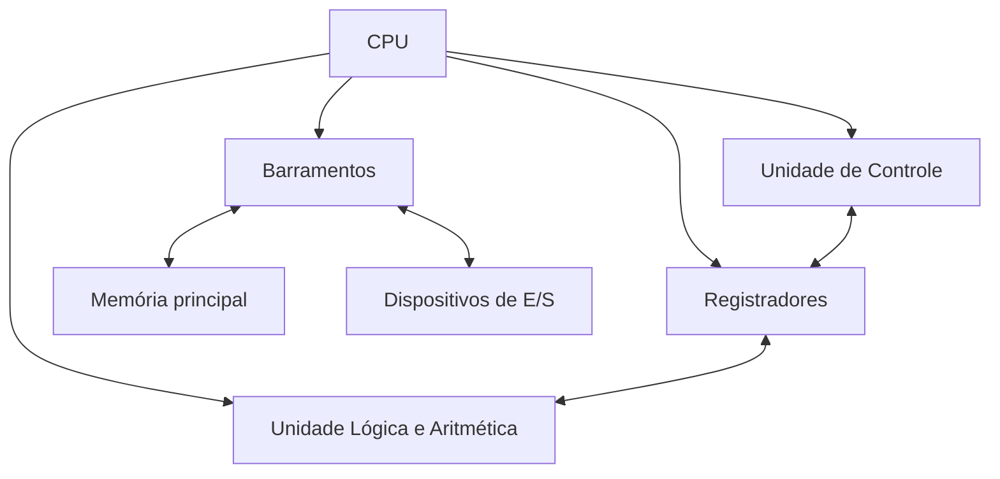
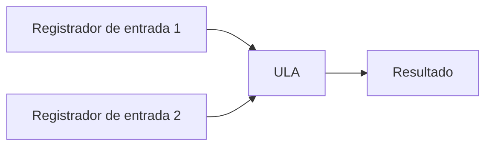
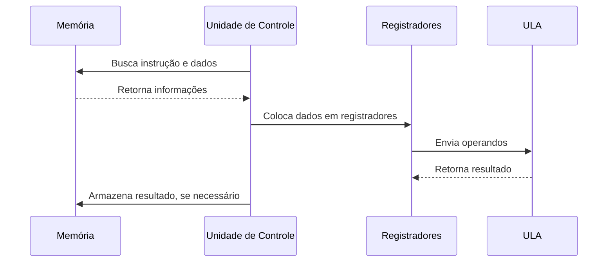
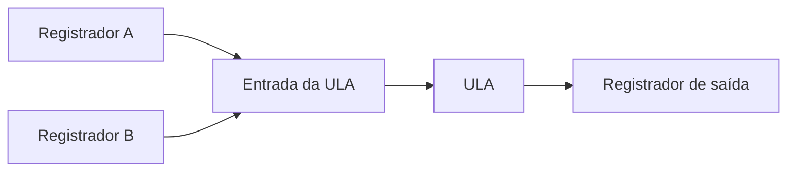
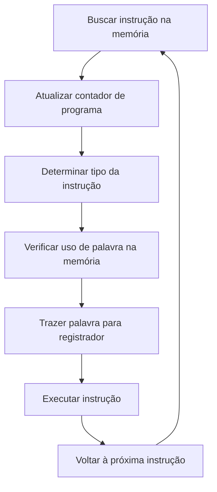
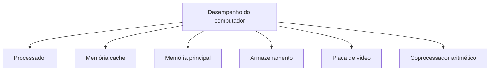
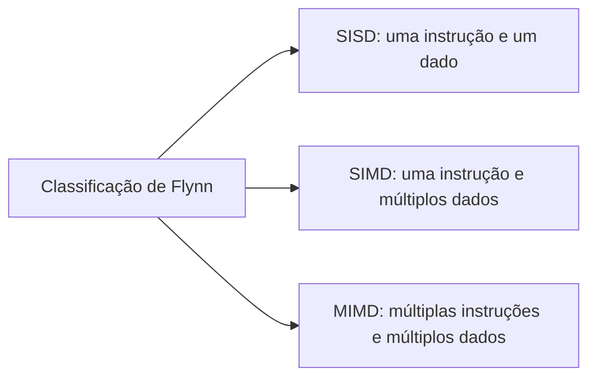

# Resumo 2.1 - Estrutura e funcionamento da CPU

# Estrutura e funcionamento da CPU

## 1. Visão geral da CPU

> [!info] Conceito
> A **CPU** é a unidade central de processamento do computador e executa instruções armazenadas na memória.

A CPU, também chamada de **processador**, é apresentada como o “cérebro do computador”, pois coordena e executa as operações necessárias para o funcionamento da máquina. Sua função principal é buscar instruções armazenadas na memória, interpretar essas instruções e executar as operações correspondentes.

O material destaca que o funcionamento do computador depende da interação entre componentes físicos e lógicos. Hardware, software, firmware e sistema operacional atuam em conjunto para permitir que as instruções sejam traduzidas e executadas no ambiente computacional.

> [!tip] Resumindo
> A CPU não trabalha isoladamente: ela depende da memória, dos barramentos e dos demais componentes do computador para executar tarefas.

---

## 2. Estrutura básica da CPU

> [!info] Conceito
> A estrutura da CPU envolve **Unidade de Controle**, **Unidade Lógica e Aritmética**, **registradores** e **barramentos**.

A CPU é formada por partes que trabalham em conjunto. A **Unidade de Controle (UC)** organiza a execução das instruções; a **Unidade Lógica e Aritmética (ULA)** realiza operações matemáticas e lógicas; os **registradores** armazenam temporariamente dados usados pelo processador; e os **barramentos** permitem a comunicação entre os componentes internos e externos.

A memória principal não é parte interna da CPU, mas é essencial para seu funcionamento. A CPU acessa a memória por meio da Unidade de Controle e dos barramentos.

> [!tip] Resumindo
> A CPU processa instruções usando a ULA para calcular, a UC para coordenar, os registradores para armazenar dados temporários e os barramentos para transportar sinais e informações.

---

## 3. Unidade Lógica e Aritmética (ULA)

> [!info] Conceito
> A **ULA** executa operações lógicas e aritméticas sobre dados representados em formato binário.

A Unidade Lógica e Aritmética é responsável por realizar cálculos e comparações. Ela trabalha com dígitos binários e recebe valores normalmente vindos dos registradores. Depois de processar esses valores, devolve o resultado também por meio de registradores.

Entre as operações aritméticas, aparecem exemplos como **adição** e **subtração**. Entre as operações lógicas, aparecem **AND**, **OR**, **NOT** e operações de deslocamento, conhecidas como **shift**.

A ULA recebe operandos de entrada e utiliza uma entrada de controle para determinar qual operação será executada. Por isso, sua construção depende de dois fundamentos: o **controle do fluxo de dados** e os **circuitos que implementam operações**.

> [!warning] Atenção
> A ULA não acessa diretamente a memória principal. Ela depende da Unidade de Controle para receber dados e para que os resultados sejam armazenados.

---

## 4. Controle de fluxo na ULA

> [!info] Conceito
> O controle de fluxo define como os dados entram, circulam e saem dos circuitos da ULA.

Para que a ULA processe dados de forma eficiente, são utilizadas técnicas de controle de fluxo, como **multiplexação** e **demultiplexação**.

A **multiplexação** ocorre quando várias entradas compartilham uma mesma saída. Já a **demultiplexação** ocorre quando uma entrada é direcionada para uma saída própria, sem compartilhamento.

Também é citada a lógica de três estados, ou **tristate**. Um componente tristate possui uma entrada adicional de controle, capaz de desabilitar sua saída. Quando isso acontece, o componente assume um estado de alta impedância e se comporta como se estivesse desconectado do circuito.

Os circuitos que implementam operações são chamados de **circuitos combinatórios**. Entre eles estão os circuitos somadores, subtratores, AND e OR.

> [!tip] Resumindo
> A ULA não é apenas uma “calculadora”: ela depende de circuitos digitais e mecanismos de controle de fluxo para executar operações corretamente.

---

## 5. Unidade de Controle (UC)

> [!info] Conceito
> A **UC** coordena a execução das instruções e controla a comunicação entre CPU, memória e ULA.

A **Unidade de Controle** é responsável por **acessar, decodificar e executar instruções** armazenadas na memória. Ela recebe instruções pelo barramento de instruções e envia endereços para a memória por meio do barramento de endereços.

A UC funciona como uma organizadora do sistema. Ela controla a sequência das operações, gerencia o fluxo de instruções e dados e coordena o trabalho da ULA. Uma analogia usada no material compara a ULA a uma calculadora simples e a UC ao operador dessa calculadora: a ULA executa operações, enquanto a UC sabe onde buscar os dados e em que ordem eles devem ser usados.

Entre as responsabilidades da UC estão:

- controlar a execução das instruções na ordem correta;
- buscar instruções e dados na memória principal;
- colocar dados em registradores para que a ULA processe;
- encaminhar resultados para armazenamento na memória;
- controlar ==ciclos de interrupção== quando a CPU precisa interromper uma instrução e executar outra.

> [!tip] Resumindo
> A UC é a parte que organiza o funcionamento da CPU; a ULA executa as operações, mas quem busca, ordena e controla é a UC.

---

## 6. Registradores

> [!info] Conceito
> **Registradores** são pequenas unidades de armazenamento internas ao processador, usadas para guardar dados temporários.

Os registradores armazenam dados necessários à execução de programas. Eles podem guardar endereços, contadores de programa e valores que serão processados pela ULA. Todos os dados armazenados nos registradores ficam em formato binário.

Como os registradores estão dentro do processador, o acesso a eles é muito rápido. Porém, sua capacidade de armazenamento é reduzida quando comparada a outros tipos de memória. O material cita tamanhos comuns como 16, 32 e 64 bits.

As informações podem ser escritas, lidas e transferidas entre registradores. Diferentemente da memória principal, os registradores não são endereçados palavra por palavra; eles são manipulados diretamente pela Unidade de Controle.

Exemplos de registradores especializados incluem registradores para armazenar informações, deslocar valores, comparar valores e contar.

> [!warning] Atenção
> Registradores são rápidos, mas pequenos. Eles não têm capacidade maior que a memória cache.

---

## 7. Barramentos

> [!info] Conceito
> **Barramentos** são meios de comunicação que transportam dados, endereços e sinais de controle entre componentes.

Os barramentos são comparados a estradas que permitem a comunicação entre os componentes internos da CPU e entre a CPU e os demais elementos do computador. Eles conectam processador, memória e dispositivos de entrada e saída.

| Tipo de barramento | Função principal |
|---|---|
| Barramento de dados | Transporta a informação real de uma posição para outra. |
| Barramento de endereço | Indica a posição de memória onde o dado será lido ou escrito. |
| Barramento de controle | Transporta sinais de controle, autorização, interrupções e sincronização. |
| Barramento de entrada e saída | Permite comunicação com periféricos e dispositivos variados. |
| Barramento processador-memória | Faz ligação curta e rápida entre processador e sistema de memória. |

Além dessa classificação, o material apresenta barramentos **ponto a ponto** e de **caminho comum**. O barramento ponto a ponto conecta dois componentes específicos. Já o barramento de caminho comum, também chamado de multiponto, conecta vários dispositivos.

Também aparecem terminologias associadas aos computadores pessoais:

| Terminologia | Função |
|---|---|
| Barramento do sistema | Conecta processador, memória e componentes internos. |
| Barramento de expansão | Conecta dispositivos externos ao computador. |
| Barramento local | Conecta um dispositivo periférico diretamente ao processador. |

> [!warning] Atenção
> O barramento de dados transporta dados; quem trabalha com posições de memória é o barramento de endereços.

---

## 8. Organização do processador e caminho de dados

> [!info] Conceito
> A organização do processador descreve como seus componentes internos trabalham para executar instruções.

A organização interna da CPU inclui registradores, ULA, barramentos e UC. O fluxo básico de trabalho segue uma lógica semelhante para as instruções: os registradores armazenam valores de entrada, esses valores são enviados para a ULA, a ULA processa os dados e o resultado é armazenado em um registrador de saída. Depois, o resultado pode ou não ser salvo na memória, dependendo da finalidade da instrução.

As instruções podem ser classificadas em duas categorias:

| Tipo de instrução | Característica |
|---|---|
| Registrador-memória | Permite acesso à memória para armazenamento ou recuperação de dados. |
| Registrador-registrador | Busca operandos nos registradores, processa na ULA e armazena o resultado em registrador. |

O **caminho de dados** é o percurso seguido pelos operandos e resultados durante o processamento. No caso de uma instrução registrador-registrador, os operandos são buscados nos registradores, enviados à ULA, processados e armazenados novamente em um registrador.

> [!tip] Resumindo
> Em uma instrução registrador-registrador, os dados não são buscados diretamente na memória principal nem na cache; eles são processados a partir dos registradores.

---

## 9. Ciclo de execução de instruções

> [!info] Conceito
> O ciclo de execução é a sequência de etapas pela qual a CPU busca, interpreta e executa instruções.

A CPU executa cada instrução por meio de pequenas etapas. Primeiro, a próxima instrução é trazida da memória para um registrador. Depois, o contador de programa é alterado para preparar a próxima instrução. Em seguida, a CPU determina o tipo de instrução trazida.

Se a instrução usar uma palavra na memória, a CPU determina onde essa palavra está, traz essa palavra para um registrador e executa a instrução. Ao final, o ciclo retorna ao início para buscar a próxima instrução.

Esse fluxo pode ser executado por hardware ou por software interpretador. Quando realizado por software, a demanda por máquina pode ser menor. O material também cita a **microprogramação**, em que programas de nível de máquina convencional são executados por meio de um interpretador em execução no hardware, chamado de microprograma.

> [!tip] Resumindo
> A CPU executa instruções repetindo um ciclo: buscar, interpretar, preparar dados, executar e retornar ao início.

---

## 10. Desempenho do computador

> [!info] Conceito
> O desempenho não depende apenas do processador; ele depende do equilíbrio entre vários componentes.

O material destaca que comprar apenas um processador de última geração não garante bom desempenho. Mesmo dentro de uma mesma família de processadores, podem existir diferenças de geração, frequência de operação e memória cache.

A **frequência de operação**, também chamada de **clock**, indica quantos ciclos o processador pode executar por minuto, sendo apresentada no material como medida em megahertz. Embora seja importante, uma frequência maior não garante automaticamente maior eficiência, pois o desempenho também depende da quantidade de instruções processadas por ciclo e de outros componentes do computador.

A **memória cache** foi criada para reduzir o problema de desempenho causado pelo acesso constante à memória principal. Ela fica junto ao processador e armazena dados usados com frequência, evitando acessos repetidos à memória RAM.

O **coprocessador aritmético** auxilia o processador em cálculos matemáticos mais complexos, como seno, cosseno e tangente. Também pode ajudar em tarefas envolvendo imagens, planilhas e jogos com gráficos tridimensionais.

A **placa de vídeo** pode melhorar o desempenho quando o computador trabalha com imagens, jogos ou processamento gráfico. Além disso, a escolha entre disco rígido e SSD também impacta o desempenho geral, sendo indicado priorizar SSD sempre que possível.

> [!warning] Atenção
> Um computador pode ser limitado pelo componente menos eficiente. Por isso, processador potente sem memória, cache, armazenamento e vídeo adequados pode não entregar o desempenho esperado.

---

## 11. RISC e CISC

> [!info] Conceito
> **RISC** e **CISC** são formas diferentes de organizar o conjunto de instruções de um processador.

RISC (Reduced Instruction Set Computer) significa **computador com conjunto de instruções reduzido**. Esse tipo de arquitetura é voltado ao processamento de instruções mais simples, com uma Unidade de Controle mais simples, barata e rápida. Processadores RISC tendem a resultar em projetos menores, mais baratos e com menor consumo de energia, sendo interessantes para dispositivos móveis e computadores portáteis mais simples.

CISC (Complex Instruction Set Computer) significa **computador com conjunto de instruções complexo**. Essa arquitetura trabalha com instruções mais complexas, facilita a criação de compiladores e programas e pode precisar acessar menos a memória para buscar instruções. Processadores CISC trabalham com clock elevado, são mais caros e podem oferecer maior desempenho, mas também são maiores e consomem mais energia.

| Característica | RISC | CISC |
|---|---|---|
| Arquitetura | Registrador-registrador | Registrador-memória |
| Tipos de dados | Pouca variedade | Muita variedade |
| Formato das instruções | Poucos endereços | Muitos endereços |
| Modo de endereçamento | Pouca variedade | Muita variedade |
| Estágios de pipeline | Entre 4 e 10 | Entre 20 e 30 |
| Acesso aos dados | Via registradores | Via memória |
| Perfil geral | Menor, mais barato e com menor consumo | Mais poderoso, maior e com maior consumo |

> [!tip] Resumindo
> RISC prioriza simplicidade e eficiência energética; CISC prioriza instruções mais complexas e maior capacidade em contextos de desempenho elevado.

---

## 12. Arquiteturas paralelas e classificação de Flynn

> [!info] Conceito
> A classificação de Flynn organiza máquinas conforme o fluxo de instruções e o fluxo de dados.

O material apresenta três tipos de máquinas paralelas segundo a classificação de Flynn: **SISD**, **SIMD** e **MIMD**. Essa classificação ajuda a entender como diferentes arquiteturas processam instruções e dados.

| Tipo | Significado | Característica |
|---|---|---|
| SISD | Single Instruction, Single Data | Fluxo único de instruções e de dados. |
| SIMD | Single Instruction, Multiple Data | Fluxo único de instruções e múltiplos dados. |
| MIMD | Multiple Instruction, Multiple Data | Fluxo múltiplo de instruções e de dados. |

A arquitetura **MIMD** permite executar ==várias instruções ao mesmo tempo==, de forma independente e com ==múltiplos dados==. Isso é importante para programação paralela e distribuída. Porém, o material ressalta que nem sempre MIMD será a melhor escolha.

A arquitetura **SIMD** executa uma ==única instrução== sobre ==vários dados== ao mesmo tempo. Isso é **útil quando uma mesma operação precisa ser repetida sobre muitos dados**. O exemplo apresentado compara essa situação a uma pessoa apertando o mesmo botão de operação em várias calculadoras, cada uma com valores diferentes.

> [!warning] Atenção
> A melhor arquitetura depende da aplicação. SIMD pode ser eficiente para cálculos repetitivos sobre muitos dados, mesmo sem executar várias instruções independentes como MIMD.

---

## 13. Pontos reforçados pelos exercícios

> [!info] Conceito
> Os exercícios destacam confusões comuns sobre CPU, ULA, UC, registradores, barramentos, cache e caminho de dados.

Os exercícios reforçam que a **Unidade de Controle** é quem sequencia a execução das instruções e acessa a memória principal. A **ULA** executa operações lógicas e aritméticas, mas não busca nem salva dados diretamente na memória principal.

Também é reforçado que **registradores** são memórias pequenas e rápidas, usadas para armazenar valores temporários, incluindo dados que serão enviados para a ULA. Eles têm acesso mais rápido que a memória principal, mas capacidade reduzida.

Sobre os **barramentos**, o material reforça que eles não conectam apenas componentes internos da CPU; eles também permitem comunicação com memória e dispositivos de entrada e saída. O barramento de dados transporta dados, enquanto o barramento de endereços indica posições de memória. O barramento local conecta periféricos diretamente à CPU.

Outro ponto importante é a **memória cache**, criada para armazenar informações usadas com frequência e reduzir acessos à memória RAM. Por fim, o caminho de dados de uma instrução registrador-registrador envolve buscar operandos nos registradores, processar na ULA e armazenar o resultado em registrador.

> [!tip] Resumindo
> A UC coordena, a ULA calcula, os registradores guardam dados temporários, os barramentos comunicam componentes e a cache reduz acessos frequentes à RAM.

---

## 14. Critérios para escolher um computador

> [!info] Conceito
> A escolha de um computador deve considerar o conjunto dos componentes, não apenas o nome do processador.

O material recomenda analisar cuidadosamente cada parte do computador antes da compra. O processador é importante, mas sua geração, frequência de operação e quantidade de cache devem ser observadas. Além disso, é necessário avaliar armazenamento, memória principal, placa de vídeo e necessidade de processamento gráfico.

A orientação apresentada segue uma sequência prática: primeiro definir o armazenamento, dando preferência ao SSD quando possível; depois escolher a memória principal, buscando usar a maior quantidade viável; em seguida analisar o processador e suas características; por fim, verificar se o uso com imagens, jogos ou gráficos exige placa de vídeo para auxiliar o processamento.

> [!warning] Atenção
> Um processador “top de linha” pode não compensar se o restante da configuração criar gargalos de desempenho.

---

## Síntese final

> [!summary] Síntese
> A CPU é o centro do processamento, mas o desempenho real depende da integração entre todos os componentes do computador.

A CPU executa programas armazenados na memória por meio de um ciclo contínuo de busca, interpretação e execução de instruções. Sua estrutura envolve Unidade de Controle, Unidade Lógica e Aritmética, registradores e barramentos. A UC organiza o fluxo das instruções, busca dados na memória e controla a execução. A ULA realiza operações lógicas e aritméticas. Os registradores armazenam dados temporários de acesso rápido. Os barramentos permitem a comunicação entre processador, memória e dispositivos.

O desempenho do computador depende de equilíbrio. Frequência de operação, memória cache, memória RAM, armazenamento, placa de vídeo e coprocessador aritmético influenciam o resultado. Por isso, escolher apenas um processador mais potente não garante melhor desempenho. A melhor configuração é aquela que considera o tipo de uso e busca o melhor custo-benefício.

As arquiteturas RISC, CISC, SISD, SIMD e MIMD mostram que existem diferentes formas de organizar e otimizar o processamento. A escolha da arquitetura ou da configuração ideal depende da aplicação, do tipo de dado processado e da necessidade de desempenho.