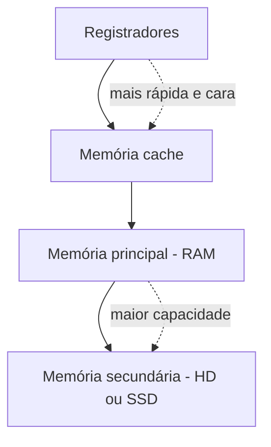
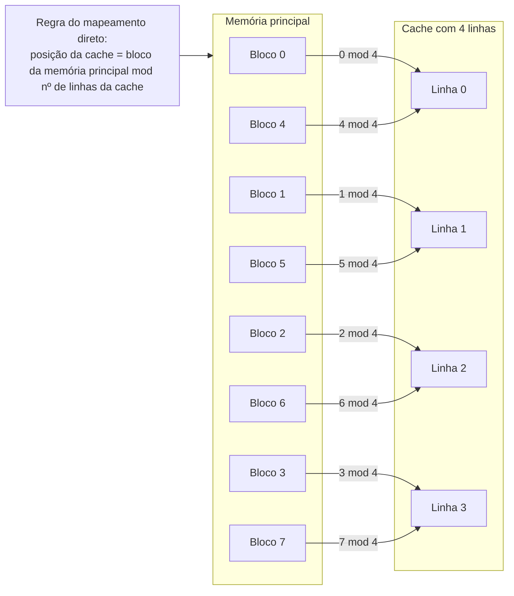
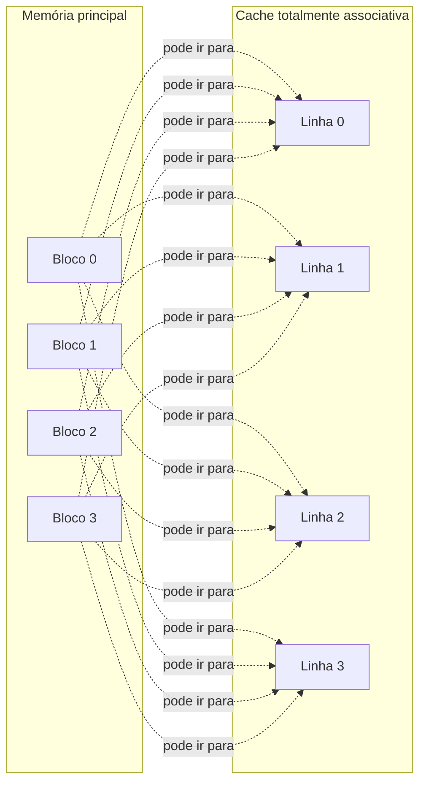
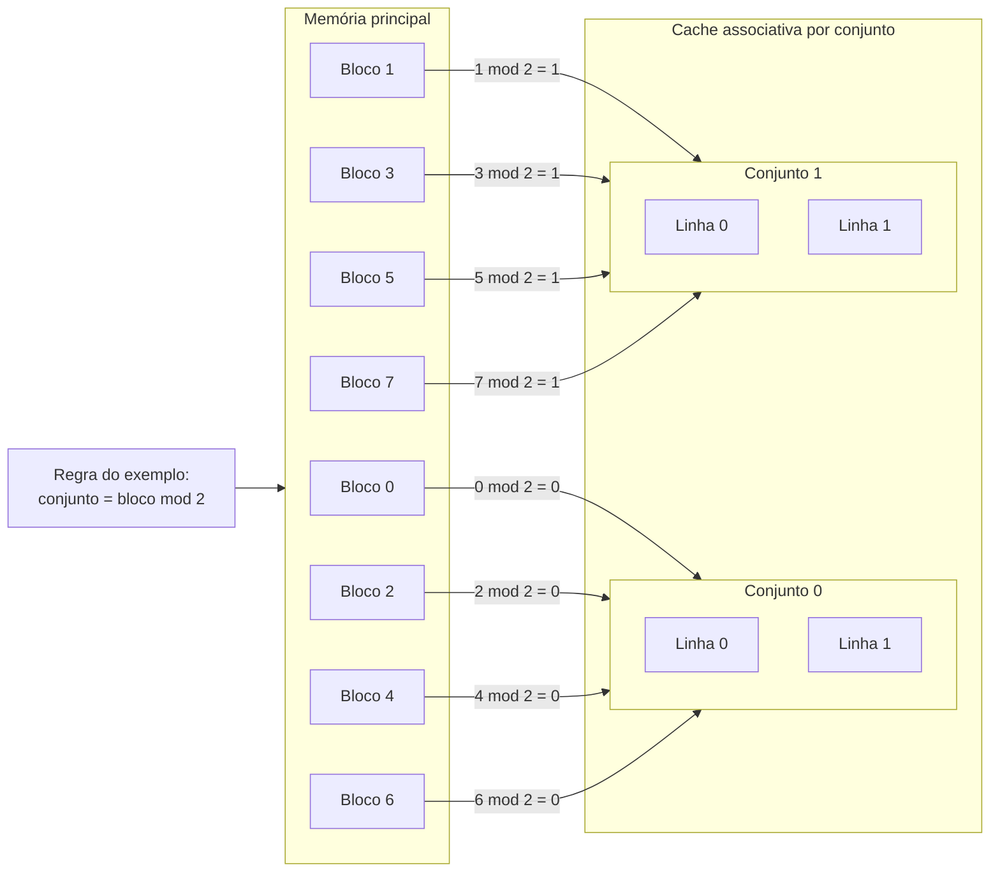
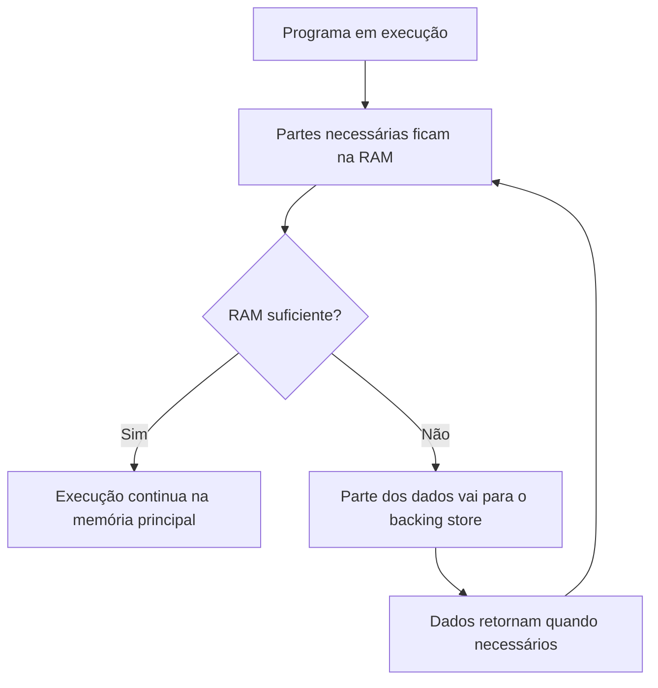
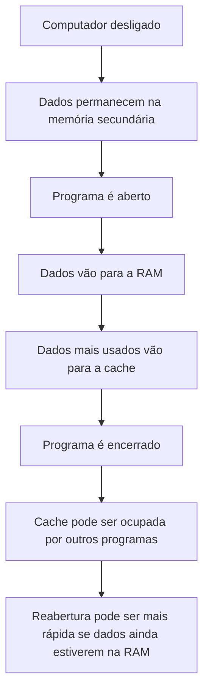

# Resumo 2.2 - Tecnologia e Hierarquia de Memorias

# Tecnologia e Hierarquia de Memórias

## Visão geral da memória no computador

> [!info] Conceito
> A memória é o conjunto de recursos responsáveis por armazenar dados e instruções usados pelo computador.

A memória é um dos componentes centrais da arquitetura de computadores. Ela armazena informações que podem representar **dados**, como arquivos e imagens, ou **instruções**, como comandos necessários para abrir programas e executar operações. No computador, essas informações são organizadas em palavras de memória, e cada palavra possui um endereço único, permitindo que o processador localize o conteúdo necessário.

A memória não existe em um único formato. Ela aparece em diferentes tecnologias e níveis, cada um com características próprias de **velocidade**, **capacidade**, **custo** e **proximidade em relação ao processador**. Por isso, os sistemas computacionais combinam memórias rápidas e caras com memórias maiores e mais lentas, buscando equilíbrio entre desempenho e custo.

> [!tip] Resumindo
> Memória não é apenas RAM. O computador usa vários tipos de memória, cada um com uma função específica no armazenamento e na execução das informações.

## RAM e ROM

> [!info] Conceito
> RAM e ROM são dois grandes grupos de memória usados nos computadores, diferenciados principalmente pela volatilidade e pela função.

A **memória RAM** é a memória principal do computador. Ela é chamada de **volátil** porque perde os dados quando o computador é desligado. Sua função é manter temporariamente os programas e dados em uso, permitindo que o processador acesse essas informações de maneira mais rápida do que se precisasse buscá-las diretamente na memória secundária.

A **memória ROM** é uma memória **não volátil**, ou seja, mantém informações mesmo sem energia. Ela armazena dados fundamentais para o funcionamento inicial do computador, como as instruções da BIOS. A BIOS é o primeiro programa executado quando o computador é ligado e prepara a máquina para carregar o sistema operacional.

> [!warning] Atenção
> RAM é usada durante a execução dos programas e perde dados ao desligar. ROM mantém informações permanentes, como instruções básicas de inicialização.

### Tecnologias DRAM e SRAM

A **DRAM**, ou RAM dinâmica, precisa atualizar constantemente as informações armazenadas para que elas não sejam perdidas enquanto o computador está ligado. Ela costuma ser usada como memória principal porque oferece maior capacidade com menor custo.

A **SRAM**, ou RAM estática, é mais rápida e não precisa dessa atualização constante enquanto houver energia. Por isso, é mais cara e normalmente usada em memórias _cache_, nas quais a velocidade é mais importante do que a capacidade.

| Tecnologia | Característica principal | Uso comum |
|---|---|---|
| DRAM | Menor custo por capacidade, precisa de atualização constante | Memória principal |
| SRAM | Mais rápida, maior custo, não precisa de atualização constante | Memória _cache_ |
| ROM | Não volátil, armazena informações permanentes | Inicialização do sistema |

## Tipos de ROM

> [!info] Conceito
> As memórias ROM são usadas para armazenar informações permanentes ou pouco modificadas.

Além da ROM tradicional, existem variações que permitem diferentes formas de gravação e regravação. A **PROM** pode ser programada pelo usuário uma única vez. A **EPROM** pode ser apagada e reprogramada com uso de luz ultravioleta. A **EEPROM** também pode ser reprogramada, mas de maneira mais prática, permitindo apagar partes do chip. A **memória flash** é uma forma de EEPROM que permite apagar e gravar dados em blocos, tornando o processo mais rápido.

Essas tecnologias são importantes porque permitem armazenar informações que precisam permanecer mesmo quando a energia é desligada, especialmente em inicialização de sistemas e em sistemas embarcados.

## Hierarquia de memória

> [!info] Conceito
> A hierarquia de memória organiza os tipos de memória conforme velocidade, custo, capacidade e proximidade em relação ao processador.

A hierarquia de memória existe porque nenhuma tecnologia atende perfeitamente a todos os requisitos de desempenho, capacidade e custo. Memórias mais próximas do processador são mais rápidas e mais caras, mas possuem menor capacidade. Já memórias mais distantes são mais lentas e mais baratas, mas conseguem armazenar volumes maiores de dados.

A organização básica da hierarquia é formada por **registradores**, **memória _cache_**, **memória principal** e **memória secundária**. A memória virtual complementa essa estrutura ao usar parte da memória secundária como apoio lógico para a memória principal.

O diagrama representa a ordem dos níveis de memória. Quanto mais próximo do topo, maior tende a ser a velocidade e o custo. Quanto mais próximo da base, maior tende a ser a capacidade de armazenamento e menor o custo por unidade armazenada.

> [!tip] Resumindo
> A hierarquia de memória equilibra velocidade e capacidade: o processador acessa primeiro memórias rápidas e pequenas, enquanto os dados permanentes ficam em memórias maiores e mais lentas.

## Função dos principais níveis de memória

> [!info] Conceito
> Cada nível da hierarquia tem uma função específica no processamento e no armazenamento de informações.

Os **registradores** ficam dentro do processador e armazenam dados usados imediatamente na execução das instruções. Eles são extremamente rápidos, pequenos e caros.

A **memória _cache_** fica entre os registradores e a memória principal. Ela armazena cópias de dados e instruções usados com frequência, reduzindo a necessidade de acesso constante à RAM.

A **memória principal**, normalmente RAM, armazena temporariamente os programas e dados em execução. Ela é maior que a _cache_, mas mais lenta.

A **memória secundária**, como HDs e SSDs, armazena dados de forma permanente, incluindo arquivos, programas e mídias. Ela tem maior capacidade, mas tempo de acesso mais alto.

| Nível | Função | Característica |
|---|---|---|
| Registradores | Guardam dados imediatos do processador | Muito rápidos, pequenos e voláteis |
| _Cache_ | Guarda cópias de dados usados com frequência | Rápida, pequena e volátil |
| RAM | Mantém programas e dados em execução | Volátil, maior que a _cache_ |
| Memória secundária | Guarda dados permanentes | Não volátil, maior e mais lenta |
| Memória virtual | Usa parte da secundária como apoio à RAM | Amplia logicamente a memória principal |

## Localidade de referência

> [!info] Conceito
> Localidade de referência é o princípio de que programas tendem a acessar repetidamente uma pequena parte da memória em determinado momento.

A localidade de referência explica por que a memória _cache_ funciona bem. Durante a execução de um programa, é comum que o processador acesse dados usados recentemente, dados próximos entre si ou instruções em sequência. Assim, manter esses dados em uma memória pequena e rápida aumenta o desempenho.

A **localidade temporal** ocorre quando um dado ou instrução acessado recentemente tende a ser acessado novamente em pouco tempo. Um exemplo são os _loops_, que repetem instruções e dados.

A **localidade espacial** ocorre quando, ao acessar um endereço de memória, há grande chance de acessar endereços próximos. Um exemplo é o acesso a elementos de um _array_.

A **localidade sequencial** ocorre quando as instruções são acessadas em sequência, uma após a outra, seguindo a ordem normal de execução do programa.

| Tipo de localidade | Explicação simples | Exemplo |
|---|---|---|
| Temporal | O que foi usado recentemente pode ser usado de novo | _Loops_ |
| Espacial | Endereços próximos podem ser acessados em seguida | Elementos de um _array_ |
| Sequencial | Instruções tendem a ser executadas em ordem | Sequência de comandos |

> [!tip] Resumindo
> A localidade permite que uma memória pequena e rápida, como a _cache_, melhore o desempenho ao manter por perto os dados mais prováveis de serem usados.

## Memória _cache_

> [!info] Conceito
> A memória _cache_ reduz o tempo de acesso aos dados ao guardar cópias de informações frequentemente usadas da memória principal.

A memória _cache_ é pequena, temporária, muito rápida e fica próxima do processador. Sua função é evitar que o processador precise acessar a memória principal a todo momento. Para isso, ela armazena cópias de dados e instruções que foram buscados na RAM e que têm maior chance de serem usados novamente.

Como o computador não consegue saber com certeza quais dados serão necessários no futuro, a _cache_ trabalha com **blocos de informação**. Em vez de trazer apenas um dado isolado, ela pode trazer um conjunto de dados relacionados, aproveitando o princípio da localidade.

> [!warning] Atenção
> A _cache_ não substitui a RAM. Ela apenas acelera o acesso a dados e instruções que já estão ou foram buscados na memória principal.

## Mapeamento de _cache_

> [!info] Conceito
> O mapeamento de _cache_ define como blocos da memória principal são associados às posições disponíveis na memória _cache_.

Quando um dado sai da memória principal e vai para a _cache_, ele não mantém necessariamente o mesmo endereço. Por isso, é necessário criar um mecanismo de associação entre os blocos da memória principal e as posições da _cache_. Esse mecanismo é chamado de **mapeamento**.

No **mapeamento direto**, cada bloco da memória principal é associado a uma posição específica da _cache_. É simples, mas menos flexível, porque diferentes blocos podem disputar a mesma posição.

> [!tip] Mapeamento Direto
> No mapeamento direto, cada bloco da memória principal só pode ir para uma linha específica da cache. Por isso, blocos diferentes podem disputar a mesma linha, como os blocos 0 e 4, que ambos são associados à linha 0.

Na **_cache_ totalmente associativa**, qualquer bloco da memória principal pode ser armazenado em qualquer posição da _cache_. Isso aumenta a flexibilidade, mas torna a busca mais custosa, pois pode ser necessário pesquisar em toda a _cache_.

> [!tip] Mapeamento Totalmente Associativo
> Nesse tipo de cache, **não existe uma posição fixa** para cada bloco da memória principal.  
Ou seja, **qualquer bloco** pode ser armazenado em **qualquer linha da cache**. Isso dá mais flexibilidade, mas exige uma busca maior para localizar os dados.

Na **_cache_ associativa por conjunto**, cada bloco da memória principal é direcionado a um conjunto específico, podendo ocupar uma posição dentro desse conjunto. Esse modelo combina características do mapeamento direto e da associação total.

> [!tip] Mapeamento Associativo por Conjunto
> Nesse caso, cada bloco da memória principal é enviado para **um conjunto específico** da cache.  
> Porém, **dentro do conjunto**, ele pode ocupar **qualquer uma das linhas disponíveis**.
>
>No exemplo (conjunto = bloco mod 2):
>- Blocos **pares** vão para o **Conjunto 0**
>- Blocos **ímpares** vão para o **Conjunto 1**
>
>Assim, a cache associativa por conjunto é um meio-termo entre:
>
>- **mapeamento direto**: uma única posição possível;
>- **totalmente associativa**: qualquer posição possível.

| Tipo de mapeamento       | Ideia central                                                              |
| ------------------------ | -------------------------------------------------------------------------- |
| Direto                   | Cada bloco vai para uma posição específica da _cache_                      |
| Totalmente associativo   | Qualquer bloco pode ir para qualquer posição                               |
| Associativo por conjunto | Cada bloco vai para um conjunto específico e ocupa uma posição dentro dele |

## Memória virtual e _backing store_

> [!info] Conceito
> A memória virtual usa parte da memória secundária como complemento lógico da memória principal.

A memória virtual permite que o sistema execute programas mesmo quando a RAM física não é suficiente para manter todos os dados carregados ao mesmo tempo. Para isso, o sistema operacional mantém na RAM apenas as partes necessárias naquele momento e desloca o restante para uma área de apoio no armazenamento secundário.

Essa área de apoio é chamada de **_backing store_**. Ela guarda informações que não estão temporariamente na memória principal, mas que ainda podem ser necessárias para a execução dos programas. O _backing store_ pode estar no disco rígido ou em outro meio de armazenamento secundário.

O diagrama mostra que o programa não precisa estar totalmente carregado na RAM. O sistema mantém as partes mais importantes na memória principal e usa o _backing store_ como apoio quando necessário.

> [!warning] Atenção
> A memória virtual aumenta a flexibilidade do sistema, mas não tem a mesma velocidade da RAM, pois depende da memória secundária.

## Paginação, segmentação e _swapping_

> [!info] Conceito
> Paginação, segmentação e _swapping_ são técnicas usadas para movimentar e organizar dados entre a RAM e o armazenamento secundário.

A **paginação** divide o endereço lógico do processo e a memória física em páginas de tamanho fixo. O programa pode ser carregado por páginas, e essas páginas podem ficar em áreas não contínuas da memória. Uma tabela de páginas registra onde cada parte do processo está armazenada.

A **segmentação** divide o programa em segmentos de tamanhos variados, conforme a lógica do próprio programa. Diferentemente da paginação, a segmentação não trabalha com tamanhos fixos.

| Critério        | Paginação                                              | Segmentação                                           |
| --------------- | ------------------------------------------------------ | ----------------------------------------------------- |
| Como divide     | Em **páginas** de tamanho fixo                         | Em **segmentos** de tamanho variável                  |
| Base da divisão | Tamanho padronizado da memória                         | Estrutura lógica do programa                          |
| Organização     | O programa pode ficar espalhado em áreas não contínuas | Cada segmento representa uma parte lógica do programa |
| Controle        | Usa uma **tabela de páginas**                          | Usa segmentos com espaços próprios de endereçamento   |
| Exemplo simples | Página 1, página 2, página 3                           | Código, dados, pilha, funções etc.                    |

O **_swapping_** consiste em transferir temporariamente partes de um processo para o armazenamento secundário quando a RAM precisa liberar espaço. Depois, essas partes podem retornar à memória principal quando forem necessárias.

> [!tip] Resumindo
> Essas técnicas ajudam o sistema operacional a decidir o que deve permanecer na RAM e o que pode ficar temporariamente no armazenamento secundário.

## Comportamento da memória na execução de programas

> [!info] Conceito
> O desempenho percebido pelo usuário depende de como os dados circulam entre memória secundária, RAM e _cache_.

Quando o computador está desligado, a RAM e a _cache_ não mantêm dados carregados, pois são memórias voláteis. No entanto, os arquivos, programas e dados permanecem armazenados na memória secundária.

Quando um programa é executado pela primeira vez, o processador precisa buscar as informações na memória secundária. Em seguida, essas informações são carregadas na RAM, e os dados mais necessários à execução imediata são enviados para a _cache_.

Se o programa for encerrado e outros programas forem abertos, a _cache_ pode substituir os dados antigos por dados das aplicações em uso, pois possui espaço reduzido. Ainda assim, parte das informações pode permanecer por algum tempo na RAM.

Se o mesmo programa for aberto novamente sem desligar o computador, ele pode iniciar mais rapidamente caso suas informações ainda estejam na memória principal. Nesse caso, evita-se uma nova busca completa na memória secundária.

> [!tip] Resumindo
> A segunda abertura de um programa pode ser mais rápida porque parte dos dados pode continuar disponível na memória principal.

## Memória e desempenho profissional

> [!info] Conceito
> A demanda por memória depende do tipo de tarefa executada e do perfil de uso do computador.

Em atividades com **CAD e modelagem 3D**, há grande demanda por memória principal, pois os programas precisam carregar modelos complexos, texturas, componentes tridimensionais e cálculos geométricos. Nesse caso, ampliar a RAM pode melhorar a fluidez da edição e reduzir gargalos. A _cache_ também contribui para operações repetitivas, mas a principal melhoria indicada é o aumento da memória principal.

Em atividades de **edição de vídeo e renderização em alta definição**, há alta demanda por RAM e também por memória secundária. Arquivos de vídeo, projetos e materiais de renderização ocupam muito espaço, e o acesso rápido a esses arquivos influencia diretamente o desempenho. Nesse caso, além de uma boa quantidade de RAM, recomenda-se priorizar SSDs de maior capacidade, pois eles reduzem o tempo de carregamento, leitura, gravação e exportação.

| Perfil profissional | Memória mais demandada | Melhoria indicada |
|---|---|---|
| Arquiteto com CAD e 3D | RAM e _cache_ | Ampliar memória RAM |
| Editor de vídeo | RAM, _cache_ e memória secundária | Usar SSD com boa capacidade e desempenho |

> [!tip] Resumindo
> CAD e modelagem 3D exigem principalmente RAM. Edição de vídeo exige RAM e armazenamento secundário rápido e amplo.

## Termos usados para medir eficiência da hierarquia

> [!info] Conceito
> A eficiência da memória pode ser analisada por acertos, falhas e tempos de acesso.

Um **acerto** ocorre quando o dado procurado é encontrado em determinado nível da memória. Uma **falha** ocorre quando o dado não é encontrado nesse nível e precisa ser buscado em outro mais abaixo na hierarquia.

A **taxa de acertos** representa a porcentagem de acessos em que os dados foram encontrados no nível analisado. A **taxa de falhas** representa a porcentagem de acessos em que os dados não foram encontrados. O **tempo de acerto** é o tempo necessário para acessar o dado quando ele está disponível naquele nível. A **penalidade de falha** é o tempo gasto para lidar com a falha e buscar o dado em outro nível.

| Termo | Significado |
|---|---|
| Acerto | O dado foi encontrado no nível de memória consultado |
| Falha | O dado não foi encontrado naquele nível |
| Taxa de acertos | Percentual de acessos bem-sucedidos |
| Taxa de falhas | Percentual de acessos não encontrados |
| Tempo de acerto | Tempo para acessar um dado encontrado |
| Penalidade de falha | Tempo adicional causado pela busca em outro nível |

## Pontos de atenção para revisão

> [!warning] Atenção
> Alguns conceitos são próximos, mas possuem funções diferentes na arquitetura de memória.

A **RAM** é volátil e usada durante a execução dos programas. A **ROM** é não volátil e armazena instruções de inicialização. A **memória secundária** é não volátil e guarda arquivos e programas de forma permanente. A **memória virtual** não é um novo componente físico independente: ela usa parte da memória secundária como complemento da RAM.

A **SRAM** é mais rápida e usada normalmente em _cache_. A **DRAM** é mais barata por capacidade e usada como memória principal. A memória virtual não substitui a _cache_, não armazena instruções permanentes de inicialização e não deve ser confundida com pen drives ou armazenamento em nuvem.

No mapeamento de _cache_, o **mapeamento direto** associa cada bloco a uma posição específica; a **_cache_ totalmente associativa** permite colocar qualquer bloco em qualquer posição; e a **associativa por conjunto** direciona cada bloco a um conjunto específico.

## Síntese final

> [!summary] Síntese
> A hierarquia de memória organiza diferentes tecnologias para equilibrar desempenho, custo e capacidade de armazenamento.

A memória é essencial para o funcionamento dos computadores porque armazena dados e instruções necessários à execução dos programas. Como cada tecnologia possui limitações, os sistemas usam uma hierarquia composta por registradores, _cache_, memória principal e memória secundária.

A _cache_ melhora o desempenho ao aproveitar a localidade de referência, mantendo próximos do processador os dados mais usados. A RAM mantém temporariamente programas e dados em execução. A memória secundária armazena informações permanentes. A memória virtual, com apoio do _backing store_, amplia logicamente a memória principal, permitindo que programas executem mesmo quando a RAM física é limitada.

O bom desempenho depende do equilíbrio entre esses níveis. Aumentar RAM, usar SSDs e compreender o papel da _cache_ são decisões que podem melhorar a eficiência do sistema, especialmente em tarefas profissionais exigentes, como CAD, modelagem 3D, edição de vídeo e renderização.