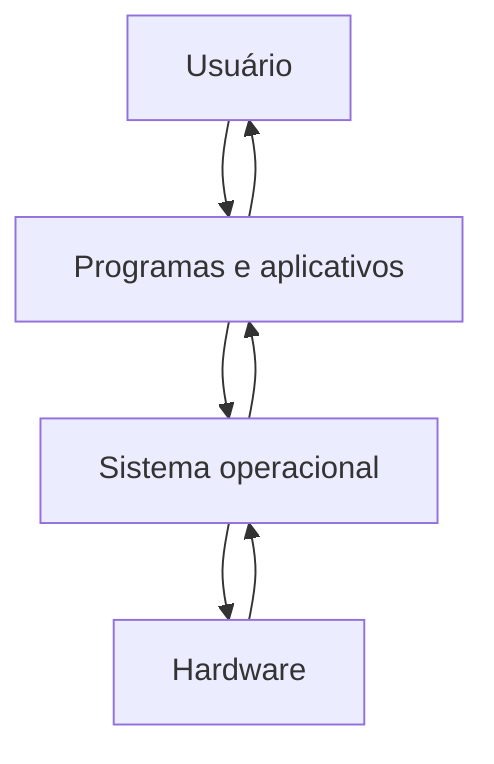
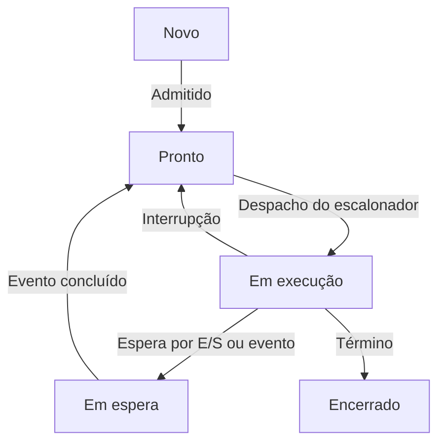

# Resumo 2.3 - Fundamentos e estrutura dos Sistemas Operacionais

## 1. Conceito de sistema operacional

> [!info] Conceito
> O sistema operacional é a camada de _software_ que intermedeia a relação entre usuário, programas e _hardware_.

O sistema operacional é a base que permite o funcionamento do computador ou dispositivo. Ele atua entre os aplicativos e os componentes físicos da máquina, administrando recursos como processador, memória, arquivos e dispositivos de entrada e saída. Sem essa camada, cada programa precisaria controlar diretamente o _hardware_, o que tornaria o desenvolvimento muito mais complexo, inseguro e dependente de cada equipamento.

Após o processo inicial realizado pelo _firmware_, como BIOS ou UEFI, o sistema operacional é carregado e passa a oferecer os serviços necessários para que os programas sejam executados. Exemplos de sistemas operacionais são Windows, Linux, macOS, iOS e Android.

> [!tip] Resumindo
> O sistema operacional torna o uso do computador mais simples para o usuário e mais organizado para os programas.

## 2. Propósitos principais do sistema operacional

> [!info] Conceito
> O sistema operacional tem dois grandes propósitos: abstrair a complexidade do _hardware_ e gerenciar os recursos do sistema.

A **abstração** significa esconder os detalhes técnicos do _hardware_ e oferecer interfaces mais simples para os programas e usuários. Por exemplo, um aplicativo não precisa saber como cada modelo de disco, teclado, mouse ou impressora funciona internamente; ele solicita o serviço ao sistema operacional, que realiza a comunicação adequada.

O **gerenciamento de recursos** consiste em controlar o uso compartilhado do processador, da memória, dos arquivos e dos dispositivos. Como vários programas podem precisar dos mesmos recursos ao mesmo tempo, o sistema operacional organiza o acesso para evitar conflitos, falhas e interferências entre processos.

Esse diagrama representa a posição do sistema operacional como camada intermediária. O usuário interage com os programas, os programas solicitam serviços ao sistema operacional e o sistema operacional controla o acesso ao _hardware_.

> [!tip] Resumindo
> Para o usuário, o sistema operacional oferece conveniência; para o computador, oferece controle, segurança e eficiência.

## 3. Sistema operacional como camada entre programas e hardware

> [!info] Conceito
> Os programas não acessam diretamente os dispositivos físicos; eles fazem solicitações ao sistema operacional.

Quando um programa precisa realizar uma tarefa, como salvar um arquivo, imprimir uma página ou ler uma tecla digitada, ele não conversa diretamente com o _hardware_. Em vez disso, faz uma **chamada de sistema**, que é uma solicitação formal ao sistema operacional.

O sistema operacional recebe essa solicitação, aciona o **driver** adequado e envia comandos específicos ao dispositivo físico. O _driver_ é um pequeno _software_ responsável por traduzir comandos genéricos em instruções compreensíveis por um equipamento específico.

O retorno da operação ocorre por meio de uma **interrupção**, que informa ao sistema operacional que uma tarefa foi concluída ou que algum evento precisa ser tratado. Esse ciclo permite que a comunicação entre _software_ e _hardware_ ocorra de forma controlada e segura.

> [!warning] Atenção
> Programas de usuário não devem acessar diretamente teclado, disco, impressora ou memória física, pois isso poderia comprometer a estabilidade e a segurança do sistema.

## 4. Kernel, modo usuário e modo kernel

> [!info] Conceito
> O kernel é o núcleo do sistema operacional e executa as funções mais privilegiadas do sistema.

O **kernel** é o conjunto central de rotinas do sistema operacional. Ele trata interrupções e exceções, gerencia processos, memória, arquivos, dispositivos de entrada e saída, redes e mecanismos de segurança. Como precisa controlar diretamente os recursos físicos, o kernel executa em **modo kernel**, um modo privilegiado com acesso amplo ao _hardware_.

Os aplicativos comuns executam em **modo usuário**, no qual não têm permissão para acessar diretamente instruções críticas ou dispositivos físicos. Essa separação evita que uma falha em um programa derrube todo o sistema. Se um aplicativo apresentar problema, o kernel pode intervir, encerrar o processo e recuperar os recursos.

Alguns sistemas utilizam diferentes arquiteturas de kernel. O Linux é apresentado como exemplo de kernel monolítico, concentrando muitos serviços no próprio núcleo, o que favorece desempenho, mas pode aumentar o impacto de falhas em componentes internos. O Windows é apresentado como exemplo de kernel híbrido, combinando características de kernel monolítico e microkernel para equilibrar desempenho e estabilidade.

> [!tip] Resumindo
> O modo usuário limita os aplicativos; o modo kernel dá ao sistema operacional os privilégios necessários para controlar a máquina.

## 5. Gerenciamento de processos

> [!info] Conceito
> Processo é um programa em execução, controlado pelo sistema operacional.

O sistema operacional precisa coordenar vários programas em execução, mesmo quando existe apenas uma CPU. Para isso, utiliza o **escalonador de processos**, responsável por decidir qual processo usará o processador em cada momento.

O escalonador ==distribui pequenas fatias de tempo entre os processos==, criando a sensação de que vários programas estão sendo executados simultaneamente. Essa alternância é essencial para sistemas multitarefa e para o uso eficiente do processador.

O processo nasce no estado **Novo**, passa para **Pronto**, é selecionado para ficar **Em execução**, pode ir para **Em espera** caso precise aguardar entrada, saída ou outro evento, e termina no estado **Encerrado**, quando seus recursos são liberados.

> [!tip] Resumindo  
> O _scheduler_ organiza a fila de processos e decide quem usa a CPU, evitando que um único programa monopolize o processador.

> [!warning] Atenção
> Multiprogramação e paralelismo não são a mesma coisa. Na multiprogramação, vários programas ficam na memória e a CPU alterna entre eles; no paralelismo real, há execução simultânea, geralmente com múltiplos núcleos ou processadores.

## 6. Gerenciamento de memória

> [!info] Conceito
> O sistema operacional controla quais áreas da memória pertencem a cada processo.

A memória principal, ou RAM, é um recurso volátil e limitado. O sistema operacional decide quais processos serão carregados, quais áreas de memória serão usadas e quando esses espaços serão liberados. Ele também impede que um processo invada a área de memória de outro, protegendo dados e evitando falhas graves.

Nos sistemas modernos, destaca-se a **memória virtual**, técnica que oferece a cada processo a impressão de possuir um espaço de endereçamento próprio e contínuo. O sistema operacional mapeia endereços virtuais para endereços físicos na RAM. Quando a memória física não é suficiente, partes dos dados podem ser movidas temporariamente para o disco, em uma área chamada **swap** ou arquivo de paginação.

No contexto da programação, isso ajuda a entender que uma variável não é apenas um nome no código. Ela está associada a uma posição de memória controlada pelo sistema operacional, que organiza e protege o acesso aos dados de cada programa.

> [!tip] Resumindo
> O gerenciamento de memória permite que vários programas sejam executados ao mesmo tempo sem misturar seus dados.

## 7. Gerenciamento de arquivos e diretórios

> [!info] Conceito
> O sistema de arquivos organiza os dados em arquivos, pastas e permissões de acesso.

O sistema operacional cria uma visão lógica do armazenamento. Em vez de o usuário lidar com setores físicos do disco, ele trabalha com arquivos e diretórios. Essa abstração permite criar, ler, escrever, apagar e organizar dados de forma mais simples e segura.

As estruturas de diretórios evoluíram de modelos simples para modelos hierárquicos. Na estrutura de **um nível**, todos os arquivos ficam em um único diretório. Na estrutura de **dois níveis**, há diretórios separados por usuário, reduzindo conflitos de nomes. Já a estrutura **em árvore** permite criar subdiretórios em vários níveis, tornando a organização mais flexível e intuitiva.

| Estrutura | Característica principal |
|---|---|
| Um nível | Todos os arquivos ficam em um único diretório |
| Dois níveis | Cada usuário possui seu próprio diretório |
| Árvore | Diretórios podem conter arquivos e outros subdiretórios |

> [!tip] Resumindo
> O sistema de arquivos transforma o armazenamento físico em uma organização lógica compreensível para usuários e programas.

## 8. Entrada, saída, drivers e interrupções

> [!info] Conceito
> O sistema operacional controla a comunicação com dispositivos como teclado, impressora, disco, tela e rede.

Dispositivos de entrada e saída possuem características próprias. Para que os aplicativos não precisem conhecer os detalhes técnicos de cada equipamento, o sistema operacional utiliza _drivers_. Assim, um comando genérico, como imprimir ou salvar, é transformado em instruções específicas para o dispositivo correto.

As interrupções também são importantes nesse processo. Elas permitem que o _hardware_ avise ao sistema operacional quando uma operação terminou ou quando precisa de atenção. Isso evita que a CPU fique esperando inutilmente e melhora o uso dos recursos.

> [!warning] Atenção
> A comunicação direta entre programa e dispositivo seria complexa, insegura e difícil de padronizar, especialmente quando há muitos modelos diferentes de equipamentos.

## 9. Multiprogramação, tempo compartilhado e multitarefa

> [!info] Conceito
> A evolução dos sistemas operacionais buscou aproveitar melhor a CPU e permitir interação com vários usuários e programas.

A **multiprogramação** surgiu para manter vários trabalhos carregados na memória ao mesmo tempo. Quando um processo precisava esperar uma operação lenta de entrada ou saída, a CPU podia ser entregue a outro processo pronto para executar. Isso reduzia o tempo ocioso do processador.

O **tempo compartilhado** avançou essa ideia ao dividir o uso da CPU em pequenas fatias de tempo. Essas fatias eram alternadas rapidamente entre usuários e processos ativos, criando a sensação de simultaneidade. Essa técnica permitiu sistemas mais interativos, nos quais vários usuários podiam usar o mesmo computador quase ao mesmo tempo.

> [!warning] Atenção
> O tempo compartilhado não significa execução paralela real. Ele significa alternância rápida do processador entre usuários ou processos.

## 10. Evolução histórica dos sistemas operacionais

> [!info] Conceito
> A evolução dos sistemas operacionais acompanha a evolução do próprio _hardware_.

Nos primeiros computadores, como os grandes equipamentos das décadas de 1940 e 1950, não existia sistema operacional como nos modelos atuais. A programação era feita diretamente em linguagem de máquina, muitas vezes com painéis, fios, chaves e cartões. O uso era sequencial, lento e dependente de operadores especializados.

Com os **sistemas em lote**, trabalhos semelhantes passaram a ser agrupados e executados em sequência, reduzindo o tempo ocioso da máquina. Depois, a **multiprogramação** permitiu manter vários trabalhos na memória. Em seguida, o **tempo compartilhado** tornou o uso mais interativo, dividindo o processador entre usuários e processos.

O UNIX foi um marco importante por sua filosofia de pequenas ferramentas combináveis, sistema de arquivos hierárquico e portabilidade. A reescrita de grande parte do UNIX em linguagem C facilitou sua adaptação a diferentes arquiteturas e influenciou sistemas posteriores.

Com os computadores pessoais, surgiram sistemas voltados para máquinas individuais, como o MS-DOS, e depois interfaces gráficas com janelas, ícones, menus e ponteiro, tornando o uso dos computadores mais acessível. Posteriormente, redes e internet impulsionaram sistemas distribuídos, nos quais vários computadores conectados podem compartilhar recursos. Por fim, smartphones e tablets consolidaram os sistemas operacionais móveis, com foco em toque, conectividade, economia de energia, segurança e ecossistemas de aplicativos.

> [!tip] Resumindo
> A história dos sistemas operacionais mostra uma passagem gradual de máquinas rígidas e difíceis de operar para ambientes acessíveis, multitarefa, conectados e móveis.

## 11. Aplicação prática: programação e memória

> [!info] Conceito
> Entender sistemas operacionais ajuda a compreender como o código realmente funciona na máquina.

No ensino de programação, o sistema operacional ajuda a explicar como variáveis, programas e memória se relacionam. Quando um programa em C declara uma variável, esse dado precisa ser armazenado em uma região de memória controlada pelo sistema operacional.

Cada programa recebe seu próprio espaço de memória. Isso impede que os dados de um programa sejam misturados com os de outro. Assim, o estudante compreende que o código não funciona isoladamente: ele depende do sistema operacional para acessar memória, processador, arquivos e dispositivos físicos.

> [!tip] Resumindo
> Programar melhor exige entender que o sistema operacional é a infraestrutura que liga o código aos recursos reais do computador.

## 12. Aplicação prática: sistema hospitalar automatizado

> [!info] Conceito
> Em sistemas complexos, o sistema operacional padroniza a comunicação entre _software_ e equipamentos diferentes.

No exemplo de um sistema hospitalar automatizado, diferentes equipamentos, como monitores cardíacos, respiradores, bombas de infusão e aparelhos de diagnóstico, podem possuir tipos de _hardware_ e protocolos distintos. Seria inviável e inseguro que o _software_ central controlasse cada equipamento diretamente.

A solução é utilizar o sistema operacional como camada intermediária, com chamadas de sistema e _drivers_ capazes de traduzir comandos de alto nível em instruções compreensíveis por cada dispositivo. Isso permite registrar sinais vitais, ajustar medicações e emitir alertas de maneira controlada, padronizada e segura.

> [!warning] Atenção
> Quanto mais crítico for o ambiente, maior a importância de controlar o acesso ao _hardware_ por meio de camadas seguras e bem definidas.

## Síntese final

> [!summary] Síntese
> O sistema operacional é a base que permite que programas, usuários e _hardware_ funcionem de forma integrada, segura e eficiente.

Os sistemas operacionais surgiram para reduzir a complexidade do uso dos computadores e melhorar o aproveitamento dos recursos físicos. Eles abstraem detalhes do _hardware_, oferecem interfaces padronizadas, controlam processos, memória, arquivos, dispositivos e redes, além de proteger o sistema contra acessos indevidos.

Seu funcionamento depende de componentes como kernel, chamadas de sistema, drivers, escalonador, gerenciador de memória e sistema de arquivos. A evolução histórica mostra que cada avanço do _hardware_ trouxe novas demandas, levando dos sistemas manuais e em lote aos ambientes multitarefa, distribuídos e móveis atuais.

Em resumo, compreender sistemas operacionais é essencial para entender como o computador executa programas, organiza recursos, protege dados e permite que aplicações modernas funcionem de maneira estável e confiável.