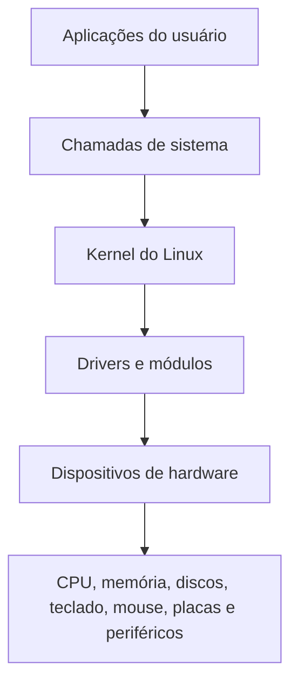
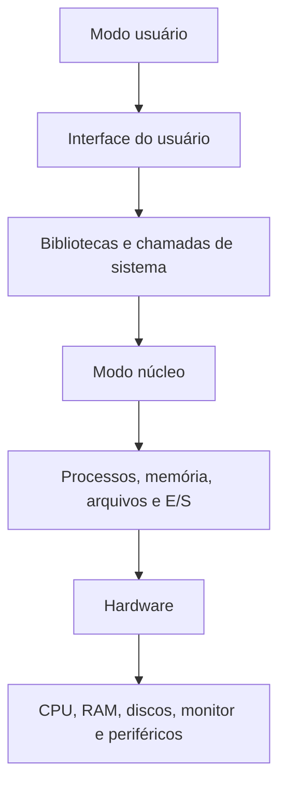
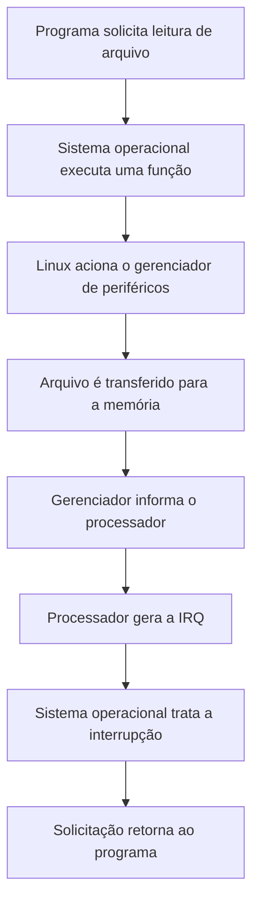
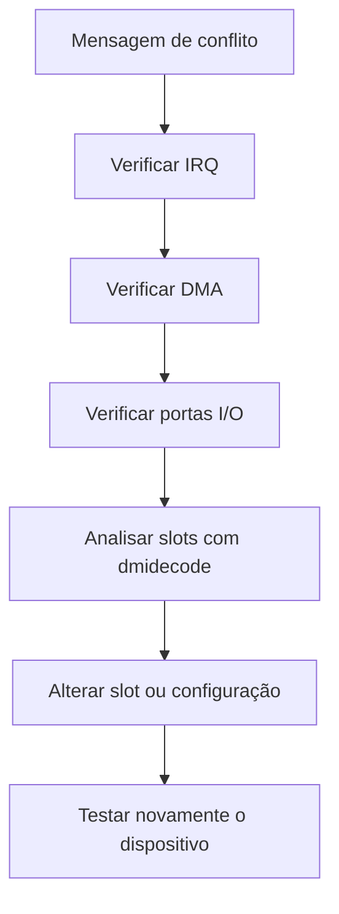

# Resumo 2.4 - Gerencia de hardware no Linux

## Visão geral

> [!info] Conceito
> A gerência de _hardware_ no Linux é o conjunto de mecanismos usados pelo sistema para identificar, controlar, monitorar e permitir o uso dos dispositivos da máquina.

O Linux precisa gerenciar dispositivos como CPU, memória, discos, teclado, mouse, monitor, impressoras, placas de rede, placas de som, portas USB e outros componentes. Esse gerenciamento é importante para garantir o bom desempenho do sistema, permitir que os dispositivos funcionem corretamente e ajudar o administrador a identificar problemas de configuração ou conflitos de _hardware_.

Os materiais destacam que o Linux oferece comandos específicos para consultar dispositivos conectados, interrupções, canais DMA, portas de entrada e saída, informações da CPU, área de _swap_, barramentos e componentes físicos da máquina.

> [!tip] Resumindo
> A gerência de _hardware_ permite acompanhar o funcionamento dos dispositivos e agir quando algum componente apresenta erro, conflito ou mau funcionamento.

---

## Papel do kernel no gerenciamento de hardware

> [!info] Conceito
> O kernel é a parte central do Linux responsável por intermediar a comunicação entre os programas e o _hardware_.

As aplicações do usuário não acessam diretamente os dispositivos físicos. Para usar recursos como processador, memória, arquivos, teclado, mouse, disco ou impressora, elas fazem solicitações ao sistema operacional. O kernel recebe essas solicitações e controla o acesso ao _hardware_ por meio de chamadas de sistema, drivers, módulos carregáveis e arquivos especiais de dispositivos.

Os dispositivos podem ser implementados por meio de módulos de núcleo carregáveis. Isso significa que determinados componentes são carregados quando necessários e descarregados quando deixam de ser usados. Além disso, dispositivos com funções semelhantes podem ser agrupados em classes, como ocorre com mouses e teclados na classe de dispositivos de entrada.



O diagrama mostra que o acesso ao _hardware_ passa pelo kernel. As aplicações solicitam recursos, o kernel interpreta essas solicitações e aciona os drivers ou módulos adequados para controlar os dispositivos.

> [!warning] Atenção
> O _hardware_ não “libera” recursos diretamente para os programas. O acesso é mediado pelo sistema operacional, principalmente pelo kernel.

---

## Camadas do Linux e posição do hardware

> [!info] Conceito
> O _hardware_ fica na base da estrutura do sistema, enquanto o kernel e as interfaces de usuário ficam nas camadas superiores.

Nos materiais, o Linux é apresentado em camadas. Na base estão os componentes físicos, como CPU, memória, discos e terminais. Acima ficam funções do modo núcleo, como gerenciamento de processos, gerenciamento de memória, sistema de arquivos e entrada/saída. No modo usuário ficam as bibliotecas, as chamadas de sistema e a interface utilizada pelos usuários e programas.

Essa organização permite que os programas usem os recursos da máquina sem precisar conhecer detalhes físicos, como o _slot_ em que uma placa está instalada.



> [!tip] Resumindo
> O Linux separa as aplicações do acesso direto ao _hardware_, tornando o sistema mais organizado, seguro e controlável.

---

## Diretório `/proc`

> [!info] Conceito
> O diretório `/proc` disponibiliza informações do sistema, dos processos e do _hardware_ em forma de arquivos consultáveis.

O Linux usa o diretório `/proc` para apresentar informações sobre processos, processador, partições, dispositivos, vetores de interrupção, contadores do kernel, sistemas de arquivos e módulos carregados. Vários comandos estudados acessam arquivos dentro desse diretório para exibir o estado atual do sistema.

Exemplos importantes:

| Comando                | Informação exibida                                |
| ---------------------- | ------------------------------------------------- |
| `cat /proc/interrupts` | Interrupções de E/S realizadas pelos dispositivos |
| `cat /proc/dma`        | Canais DMA em uso                                 |
| `cat /proc/ioports`    | Endereços de portas de entrada e saída            |
| `cat /proc/iomem`      | Mapeamento de memória usado por dispositivos      |
| `cat /proc/cpuinfo`    | Informações do processador                        |
| `cat /proc/swaps`      | Informações sobre a área de _swap_                |

> [!tip] Resumindo
> O `/proc` funciona como uma fonte de consulta sobre o estado interno do Linux e ajuda no diagnóstico de problemas de _hardware_.

---

## IRQ: solicitações de interrupção

> [!info] Conceito
> IRQ significa _Interrupt Request_, ou solicitação de interrupção. É um mecanismo usado para pedir atenção da CPU ou do sistema operacional.

Uma interrupção de _hardware_ ocorre quando um dispositivo ou processo precisa que a CPU interrompa temporariamente sua execução normal para tratar uma requisição. Segundo os materiais, uma IRQ pode ser entendida como uma chamada feita pelo _hardware_ ao sistema para solicitar um serviço.

As interrupções podem ter prioridade e podem ser transmitidas pelo barramento do _hardware_, inclusive por interrupção sinalizada por mensagem, ou podem ocorrer por solicitação de programas, como interrupções de _software_.

O infográfico apresenta o exemplo de um programa que precisa ler um arquivo:



> [!warning] Atenção
> A interrupção faz a CPU tratar uma solicitação específica antes de continuar o fluxo normal de execução.

---

## DMA: acesso direto à memória

> [!info] Conceito
> DMA significa _Direct Memory Access_, ou acesso direto à memória. Ele permite transferir dados entre dispositivos de E/S e memória sem que a CPU realize diretamente essa transferência.

O DMA é usado por dispositivos como placas de rede e placas de som para transferir dados com menos dependência da CPU. Os materiais apresentam oito canais DMA, numerados de 0 a 7. Os canais de 0 a 3 realizam transferências de 8 bits, enquanto os canais de 4 a 7 realizam transferências de 16 bits.

Um canal DMA normalmente não deve ser dividido entre dispositivos. Em algumas situações, pode haver compartilhamento, desde que os canais não sejam utilizados ao mesmo tempo. Se houver conflito de DMA, o sistema pode travar.

> [!warning] Atenção
> Conflitos de DMA podem comprometer o funcionamento do sistema e causar travamentos.

---

## Portas de entrada e saída: I/O

> [!info] Conceito
> Portas de I/O são endereços usados para troca de dados entre processador e periféricos.

Os endereços de I/O são posições usadas para comunicação entre processador e dispositivos. Cada dispositivo deve usar seu próprio endereço ou faixa de endereços, evitando sobreposição de informações.

O comando `cat /proc/ioports` exibe as faixas de portas de E/S em uso. O material cita como exemplo uma faixa associada à saída VGA, mostrando que o comando ajuda a identificar quais dispositivos estão usando determinados endereços.

> [!tip] Resumindo
> As portas de I/O ajudam a organizar a comunicação entre CPU e periféricos, mas podem gerar conflitos se forem usadas incorretamente por mais de um dispositivo.

---

## Conflitos de hardware

> [!info] Conceito
> Um conflito de _hardware_ ocorre quando dois ou mais dispositivos tentam usar o mesmo recurso, como IRQ, I/O ou DMA.

Conflitos de _hardware_ podem comprometer o desempenho do sistema, causar travamentos e até perda de informações. O desafio do material apresenta um caso em que há conflito entre placa de vídeo e placa de rede em uma empresa que usa Linux para infraestrutura e impressão 3D.

Para investigar esse tipo de problema, os materiais indicam consultar:

| Recurso analisado | Comando indicado |
|---|---|
| Interrupções | `cat /proc/interrupts` |
| Canais DMA | `cat /proc/dma` |
| Portas de E/S | `cat /proc/ioports` |
| _Slots_ usados e livres | `dmidecode` |



> [!warning] Atenção
> Quando o conflito envolve placa de vídeo e placa de rede, a análise deve considerar IRQ, DMA, endereços de I/O, drivers, módulos do kernel e _slots_ utilizados.

---

## Comando `lspci`

> [!info] Conceito
> O comando `lspci` lista dispositivos conectados ao barramento PCI.

O `lspci` exibe informações de dispositivos cujos dados trafegam pelo barramento PCI, como interface IDE, placa de vídeo, controladores de áudio, SATA, USB, Ethernet, placa-mãe e outros componentes. Nos exemplos do material, o comando mostra controladores de áudio, SATA, USB, Ethernet, interfaces ISA e IDE, além de controlador VGA.

Principais opções:

| Opção | Função |
|---|---|
| `-n` | Exibe códigos dos dispositivos e fabricantes |
| `-k` | Mostra módulos do kernel e drivers associados |
| `-v` | Exibe informações detalhadas |
| `-vv` | Exibe ainda mais detalhes |
| `-x` | Mostra os primeiros 64 bytes da configuração PCI em hexadecimal |
| `-xxx` | Mostra a configuração PCI em hexadecimal |
| `--help` | Exibe ajuda do comando |
| `--version` | Mostra a versão do comando |

> [!tip] Resumindo
> O `lspci` é útil para identificar dispositivos PCI e verificar drivers e módulos do kernel associados a eles.

---

## Comando `lsusb`

> [!info] Conceito
> O comando `lsusb` lista dispositivos conectados ao barramento USB.

O `lsusb` exibe informações sobre dispositivos USB e ajuda a diagnosticar problemas de detecção de drivers USB. Nos exemplos do material, a saída mostra o barramento, o número do dispositivo, o ID do fabricante, o ID do dispositivo e a descrição do componente.

Principais opções:

| Opção       | Função                                                                    |
| ----------- | ------------------------------------------------------------------------- |
| `-s`        | Exibe informações de dispositivo informando porta e número do dispositivo |
| `-v`        | Exibe informações detalhadas                                              |
| `-vv`       | Exibe mais informações detalhadas                                         |
| `-d`        | Exibe informações de um dispositivo específico                            |
| `--help`    | Exibe ajuda do comando                                                    |
| `--version` | Mostra a versão do comando                                                |

> [!tip] Resumindo
> O `lsusb` é usado principalmente para verificar dispositivos USB reconhecidos pelo Linux e investigar falhas de detecção.

---

## Comando `disktype`

> [!info] Conceito
> O comando `disktype` identifica o formato de discos, imagens, sistemas de arquivos, tabelas de partição e códigos de inicialização.

O `disktype` reconhece sistemas de arquivos como FAT12, FAT16, FAT32, NTFS e HPFS. Também reconhece imagens de disco, imagens de CD não processadas, imagens de disco rígido do Virtual PC, formatos de compressão como gzip, compress e bzip, além de particionamentos como DOS/PC, Apple, RAID Linux, discos físicos, Linux LVM1, Linux LVM2 e Solaris x86.

O comando precisa ser instalado com:

```bash
sudo apt install disktype
```

Para consultar um disco ou partição, usa-se o comando seguido do dispositivo, por exemplo:

```bash
disktype /dev/sda
```

> [!warning] Atenção
> A instalação do `disktype` exige permissões de administrador, conforme indicado no material.

---

## Comandos baseados em `/proc`

> [!info] Conceito
> Os comandos baseados em `/proc` mostram informações em tempo real sobre interrupções, DMA, portas, memória, CPU e _swap_.

### `cat /proc/interrupts`

Mostra a quantidade de interrupções de E/S realizadas pelos dispositivos na CPU, o número da interrupção, o tipo de interrupção e os dispositivos associados. Também pode ser filtrado com `grep`, por exemplo:

```bash
cat /proc/interrupts | grep timer
```

### `cat /proc/dma`

Exibe os canais DMA em uso no Linux. O material mostra como exemplo o canal `4: cascade`, relacionado à conexão para outro canal entre 0 e 3.

### `cat /proc/ioports`

Exibe os endereços das portas de entrada e saída em uso. Ajuda a identificar faixas de endereços associadas aos dispositivos.

### `cat /proc/iomem`

Mostra o mapeamento da utilização de memória RAM pelos dispositivos. O material destaca que esse mapeamento envolve faixas de endereço usadas na memória.

### `cat /proc/cpuinfo`

Exibe informações do processador, como marca, modelo, _clock_ e tamanho do _cache_ interno.

### `cat /proc/swaps`

Mostra informações sobre a área de _swap_, incluindo:

| Campo | Significado |
|---|---|
| `Filename` | Partição ou arquivo onde o _swap_ está localizado |
| `Type` | Tipo de _swap_, como partição |
| `Size` | Tamanho alocado |
| `Used` | Área usada |
| `Priority` | Prioridade do _swap_ |

> [!tip] Resumindo
> Os arquivos de `/proc` são úteis para diagnóstico porque mostram recursos usados pelo sistema e pelos dispositivos.

---

## Comando `lshw`

> [!info] Conceito
> O comando `lshw` lista informações detalhadas sobre os componentes de _hardware_.

O `lshw` mostra dados sobre memória, placa de vídeo, placa-mãe, barramentos SCSI, USB, IDE e PCI, processador, placa de som e outros dispositivos. Pode ser executado com `sudo lshw` para obter detalhes do _hardware_.

Principais opções:

| Opção | Função |
|---|---|
| `sudo lshw` | Exibe detalhes completos do _hardware_ |
| `-businfo` | Exibe informações dos barramentos SCSI, USB, IDE e PCI |
| `--help` | Exibe ajuda |
| `--version` | Mostra a versão |

O comando também permite consultar uma classe específica de dispositivo, como no exemplo prático:

```bash
lshw -C video
```

Esse comando foi usado no estudo de caso para identificar uma placa de vídeo com problema. A saída permitiu verificar dados como descrição, produto, fabricante, barramento, driver, IRQ, porta de E/S e faixas de memória.

> [!tip] Resumindo
> O `lshw -C video` facilita a identificação de placa de vídeo, modelo e fabricante, sendo útil para substituição correta de componentes.

---

## Comando `hwinfo`

> [!info] Conceito
> O comando `hwinfo` exibe informações detalhadas sobre componentes de _hardware_.

O `hwinfo` apresenta informações sobre memória, placa de vídeo, placa-mãe, barramentos SCSI, USB, IDE e PCI, CPU, placa de som, partições, discos, mouse, teclado e outros dispositivos.

O comando precisa ser instalado:

```bash
sudo apt install hwinfo
```

Principais opções:

| Opção           | Função                                        |
| --------------- | --------------------------------------------- |
| `--log arquivo` | Exibe detalhes de um arquivo específico       |
| `--short`       | Mostra uma descrição resumida do _hardware_   |
| `--componente`  | Exibe informações de um componente específico |
| `--cpu`         | Exibe informações da CPU                      |
| `--help`        | Exibe ajuda                                   |
| `--version`     | Mostra a versão                               |

> [!tip] Resumindo
> O `hwinfo` é semelhante ao `lshw`, mas também pode apresentar informações resumidas ou filtradas por componente.

---

## Outros comandos citados na Dica do Professor

> [!info] Conceito
> Além dos comandos principais, o material apresenta comandos auxiliares para consultar sistema, arquitetura, memória, _slots_, inicialização e interrupções.

### `uname`

O `uname` exibe informações sobre o sistema operacional e o kernel.

| Opção      | Informação exibida            |
| ---------- | ----------------------------- |
| `uname -a` | Informações detalhadas        |
| `uname -s` | Nome do sistema operacional   |
| `uname -n` | Nome da máquina na rede       |
| `uname -r` | Versão de liberação do kernel |
| `uname -v` | Versão do kernel              |
| `uname -m` | Arquitetura de _hardware_     |

### `arch`

O `arch` é similar ao `uname` e exibe a arquitetura da máquina. As opções citadas são `--help` e `--version`.

### `dmidecode`

O `dmidecode` exibe informações como tipo, velocidade e quantidade máxima de memória possível, além da quantidade de _slots_ livres e usados. No desafio, ele é indicado para verificar _slots_ ocupados e disponíveis em caso de conflito entre placa de vídeo e placa de rede.

### `inxi`

O `inxi` apresenta informações sobre áudio, som, drivers, bateria, CPU, disco rígido, servidor de exibição, resolução, OpenGL, processos, tempo de atividade, memória, rede, sistema, partições, sensores e USB.

O material informa que ele precisa ser instalado com:

```bash
sudo apt-get install inxi
```

Também é indicado consultar o manual com:

```bash
man inxi
```

### `desmeg`

O material cita o comando `desmeg` como responsável por mostrar o _buffer_ de alertas do kernel e acompanhar a rotina de inicialização do sistema, auxiliando na identificação de problemas.

### `/proc/irq`

O `/proc/irq` lista propriedades de interrupção do Linux.

> [!warning] Atenção
> Os comandos auxiliares ajudam a complementar a análise, especialmente quando o problema envolve kernel, inicialização, arquitetura, _slots_ ou interrupções.

---

## Aplicação prática: identificação de placa de vídeo

> [!info] Conceito
> A identificação correta do _hardware_ permite substituir peças com defeito de forma precisa.

No caso prático, Cynthia, analista de suporte em uma rede hospitalar, precisou resolver um problema em que o monitor de uma atendente parou de funcionar. Após testes, ela identificou que a placa de vídeo havia queimado.

Como a rede hospitalar usava computadores e dispositivos de fabricantes diferentes, Cynthia precisou identificar corretamente o modelo e o fabricante da placa. Para isso, usou:

```bash
lshw -C video
```

A saída do comando destacou informações como:

```bash
descrição: VGA compatible controller
produto: SVGA II Adapter
fabricante: VMware
```

Esses dados foram enviados ao setor de compras, que adquiriu a placa correta. Após a troca, o monitor voltou a funcionar.

> [!tip] Resumindo
> O comando `lshw` pode ser usado não apenas para consulta, mas também para apoiar decisões práticas de manutenção e substituição de componentes.

---

## Pontos importantes para exercícios

> [!info] Conceito
> Os exercícios reforçam diferenças entre comandos, funções do kernel e cuidados com conflitos de _hardware_.

O `lsusb` auxilia na análise de dispositivos USB e problemas de detecção de drivers. A opção `-v` pode ser usada tanto com `lspci` quanto com `lsusb` para exibir informações sobre dispositivos. Já o `lspci -k` mostra módulos do kernel e drivers associados aos dispositivos PCI.

O kernel é responsável por gerenciar, identificar e iniciar dispositivos de _hardware_. Os módulos carregáveis e as classes de dispositivos são conceitos verdadeiros, mas representam ideias diferentes: módulos tratam do carregamento de suporte ao dispositivo, enquanto classes organizam dispositivos com funções semelhantes.

Sobre DMA, os canais de 0 a 3 trabalham com 8 bits e os canais de 4 a 7 com 16 bits. O comando `cat /proc/dma` mostra canais DMA em uso, e conflitos podem causar falhas ou travamentos.

O `disktype` precisa ser instalado e reconhece vários formatos de disco, imagem, compressão e particionamento. Ele não se limita apenas a alguns formatos de partição.

> [!warning] Atenção
> Uma confusão comum é pensar que aplicações acessam diretamente o _hardware_. No Linux, esse acesso é mediado pelo kernel por meio de interfaces e chamadas de sistema.

---

## Síntese final

> [!summary] Síntese
> A gerência de _hardware_ no Linux depende do kernel, de drivers, módulos, arquivos especiais, comandos de diagnóstico e informações disponibilizadas pelo diretório `/proc`.

O Linux controla o acesso ao _hardware_ para permitir que aplicações usem dispositivos sem lidar diretamente com detalhes físicos. O kernel identifica, inicializa e gerencia os dispositivos, enquanto comandos como `lspci`, `lsusb`, `disktype`, `lshw`, `hwinfo` e os arquivos de `/proc` ajudam a visualizar o estado dos componentes.

Os principais recursos que precisam ser monitorados são IRQ, DMA e portas de I/O, pois conflitos nesses elementos podem causar perda de desempenho, travamentos e falhas no sistema. Em situações práticas, comandos como `lshw -C video`, `cat /proc/interrupts`, `cat /proc/dma`, `cat /proc/ioports` e `dmidecode` ajudam o administrador a identificar problemas e tomar decisões corretas de manutenção.