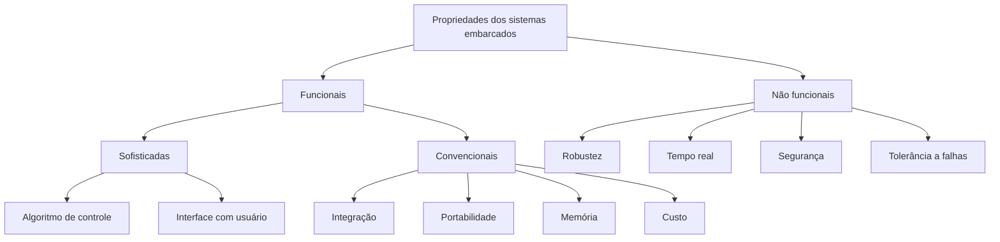
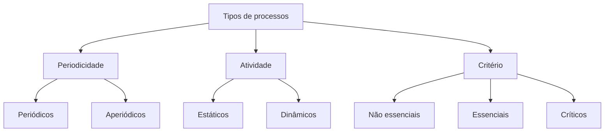
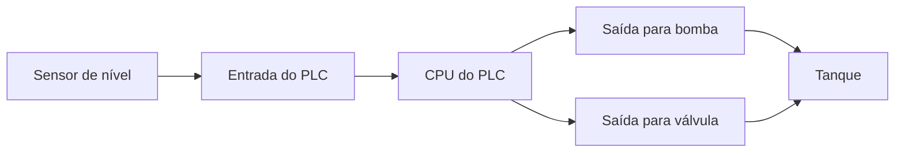

# Resumo 3.1 - Introducao aos sistemas embarcados

## 1. Conceito geral de sistemas embarcados

> [!info] Conceito
> Sistemas embarcados são sistemas computacionais dedicados, nos quais _hardware_ e _software_ são projetados para executar uma função específica.

Um sistema embarcado é diferente de um sistema de propósito geral, como um microcomputador comum. Em um computador convencional, o mesmo equipamento pode executar muitos tipos de programas. Já em um sistema embarcado, o conjunto formado por _hardware_ e _software_ é planejado para uma tarefa específica, como controlar uma máquina, monitorar sensores, acionar dispositivos ou automatizar processos.

Nos sistemas embarcados, o desenvolvimento é mais complexo porque não envolve apenas escrever o programa. Também é necessário projetar ou escolher o ambiente de _hardware_, os dispositivos de entrada e saída, as formas de alimentação, os sensores, os atuadores e os métodos de validação.

> [!tip] Resumindo
> Um sistema embarcado não é apenas um programa instalado em uma placa: ele é a integração entre programa, circuito eletrônico, entradas, saídas e finalidade específica.

## 2. Microcontroladores e processamento dedicado

> [!info] Conceito
> O microcontrolador é o componente que concentra processamento, memória e recursos de entrada e saída em um único circuito integrado.

Os sistemas embarcados normalmente utilizam microcontroladores porque eles são adequados para tarefas específicas. Um microcontrolador pode reunir CPU, memórias e portas de comunicação, permitindo que o sistema leia entradas, processe informações e gere saídas.

A CPU executa as instruções do programa. As memórias armazenam dados e instruções. As portas de entrada e saída permitem a comunicação com sensores, botões, motores, displays, válvulas e outros dispositivos externos.

A principal ideia é a dedicação: o sistema não tenta atender a qualquer tipo de tarefa, mas sim executar bem uma função definida. Por isso, um equipamento dedicado tende a ter melhor adequação ao objetivo do projeto do que um equipamento genérico tentando cumprir a mesma função.

> [!warning] Atenção
> “Dedicado” não significa apenas “fazer esforço”. Significa que o sistema foi concebido, configurado e programado para uma finalidade específica.

## 3. Desenvolvimento e teste de programas em sistemas microcontrolados

> [!info] Conceito
> O programa de um sistema microcontrolado passa por edição, compilação, verificação de erros e testes antes de ser usado definitivamente.

Após a edição do programa, ocorre a compilação, momento em que o código é transformado em uma forma compreensível para o microcontrolador. Nessa fase, erros de edição e de construção do programa podem ser identificados e corrigidos.

Depois disso, há diferentes possibilidades de teste e execução. O programa pode ser gravado diretamente na memória, pode ser simulado em um _software_ simulador ou pode ser emulado com um sistema específico. A simulação permite verificar o comportamento do programa em ambiente controlado. A emulação busca aproximar o teste do funcionamento real do sistema.

> [!tip] Resumindo
> Antes de um sistema embarcado ser entregue ou produzido em série, é necessário verificar se o código funciona corretamente e se interage bem com o _hardware_.

## 4. Propriedades dos sistemas embarcados

> [!info] Conceito
> As propriedades dos sistemas embarcados ajudam a descrever o que o sistema faz e quais qualidades ele precisa apresentar.

As propriedades dos sistemas embarcados podem ser organizadas em dois grandes grupos: propriedades funcionais e propriedades não funcionais.

As propriedades funcionais indicam o comportamento direto do sistema, ou seja, aquilo que ele deve fazer. Elas incluem o algoritmo de controle, a interface com o usuário, a integração, a portabilidade, o uso de memória e o custo.

As propriedades não funcionais estão relacionadas à qualidade do sistema. Elas não descrevem diretamente uma função, mas indicam critérios importantes de desempenho, confiabilidade e segurança. Entre elas estão robustez, tempo real, segurança e tolerância a falhas.

O diagrama mostra que as propriedades funcionais tratam do comportamento do sistema e de suas características de operação, enquanto as não funcionais tratam da qualidade e das restrições do projeto.

> [!tip] Resumindo
> As propriedades funcionais dizem “o que o sistema faz”; as propriedades não funcionais dizem “com que qualidade, segurança e desempenho ele faz”.

## 5. Propriedades funcionais

> [!info] Conceito
> Propriedades funcionais descrevem as ações, entradas, processamentos e saídas esperadas do sistema.

O algoritmo de controle é o programa responsável por processar as entradas e gerar as saídas. Ele define a lógica de funcionamento do sistema. Por exemplo, em um sistema de controle de nível, o algoritmo pode decidir quando ligar uma bomba ou abrir uma válvula.

A interface com o usuário é o meio pelo qual uma pessoa configura, acompanha ou ajusta o sistema. Essa interface pode estar em um botão físico, em um aplicativo, em uma tela ou em outro ambiente de configuração.

A integração indica como o microcontrolador se comunica com os demais componentes internos e externos. Já a portabilidade indica a capacidade de adaptação do sistema a diferentes plataformas, embora nos sistemas embarcados essa portabilidade costume ser mais limitada.

Memória e custo também são considerados nas propriedades funcionais convencionais, pois influenciam diretamente as decisões de projeto, o tamanho do programa, os recursos disponíveis e a viabilidade do produto.

> [!warning] Atenção
> Em sistemas embarcados, recursos como memória, custo e integração não são detalhes secundários. Eles influenciam diretamente o funcionamento e a viabilidade do sistema.

## 6. Propriedades não funcionais

> [!info] Conceito
> Propriedades não funcionais são critérios de qualidade, desempenho, segurança e confiabilidade do sistema.

A robustez indica a capacidade do sistema de resistir a condições de uso. Um sistema que funciona bem em uma residência pode não ser suficientemente robusto para uma indústria, pois o ambiente industrial pode exigir maior resistência e confiabilidade.

Tempo real significa que o tempo de resposta é um fator crítico. Em muitas aplicações embarcadas, não basta executar a tarefa corretamente; é necessário executá-la dentro de um tempo determinado. Atrasos podem comprometer o funcionamento do sistema.

A segurança envolve a proteção contra riscos, danos e incertezas. Quanto mais crítico for o sistema, maiores devem ser os cuidados com segurança, como proteção de dados, fontes de alimentação secundárias e mecanismos de proteção contra falhas.

A tolerância a falhas parte da ideia de que falhas podem acontecer. Por isso, o projetista precisa definir como o sistema deve reagir quando uma falha for detectada.

> [!tip] Resumindo
> As propriedades não funcionais ajudam a avaliar se o sistema é resistente, seguro, confiável e capaz de responder no tempo necessário.

## 7. Tipos de processos em sistemas embarcados

> [!info] Conceito
> Os processos em sistemas embarcados podem ser classificados conforme periodicidade, atividade e critério de tempo.

Um mesmo sistema embarcado pode executar diferentes tipos de processos ao longo de sua operação. Essa classificação ajuda a entender quando uma tarefa ocorre, como ela é ativada e qual a gravidade de atrasos ou falhas.

Quanto à periodicidade, os processos podem ser periódicos ou aperiódicos. Processos periódicos acontecem em intervalos regulares de tempo, como a leitura constante de sinais vitais em um monitor cardíaco. Processos aperiódicos não seguem uma cadência fixa, mas podem ocorrer diante de uma condição prevista, como um alerta sonoro em uma emergência.

Quanto à atividade, os processos podem ser estáticos ou dinâmicos. Um processo estático inicia junto com o sistema e permanece ativo até o desligamento. Um processo dinâmico pode iniciar ou terminar durante a execução, conforme a necessidade do sistema.

Quanto ao critério de tempo, os processos podem ser não essenciais, essenciais ou críticos. Os não essenciais não causam grandes problemas imediatos se atrasarem. Os essenciais possuem limite de tempo, chamado _deadline_, mas seu atraso não necessariamente gera desastre. Os críticos exigem resposta rápida, pois o fator tempo é decisivo para o funcionamento ou para a segurança.

O diagrama organiza os processos conforme três formas de análise: quando acontecem, como permanecem ativos e qual a importância do tempo para sua execução.

> [!warning] Atenção
> “Periódico” não é o mesmo que “dinâmico”. Periódico se refere à repetição no tempo; dinâmico se refere ao momento de ativação ou encerramento durante a execução do sistema.

## 8. Exemplos de tipos de processos

> [!info] Conceito
> Os exemplos ajudam a entender como a classificação dos processos aparece em situações reais.

Em um monitor cardíaco, a verificação dos sinais vitais é periódica, pois ocorre repetidamente em intervalos de tempo. Já o disparo de um aviso sonoro em uma emergência é aperiódico, porque não ocorre em intervalos fixos, mas apenas quando uma situação específica acontece.

Em inversores de frequência, usados na indústria para controlar velocidade e torque, alguns comandos são dinâmicos, pois podem ocorrer durante o processo, como aumento, redução ou inversão de funcionamento.

No caso dos airbags de automóveis, há diferença entre processo essencial e processo crítico. A comunicação de uma anomalia no sistema é essencial, pois precisa ser informada prontamente, mas não impede imediatamente o veículo de se mover. Já o acionamento das bolsas em caso de acidente é crítico, pois precisa acontecer rapidamente.

No sensor de chuva de veículos, a verificação da chuva pode ser periódica, a atuação dos limpadores é dinâmica e o critério é não essencial, pois, se o sistema não agir imediatamente, o motorista ainda pode acionar os limpadores manualmente.

> [!tip] Resumindo
> A mesma aplicação pode combinar diferentes classificações: uma parte pode ser periódica, outra dinâmica, e outra crítica ou não essencial.

## 9. Planejamento de sistemas embarcados

> [!info] Conceito
> O planejamento de sistemas embarcados envolve a definição do funcionamento, da estrutura, do desenvolvimento e da implantação do sistema.

Projetar sistemas embarcados é mais complexo do que desenvolver um programa comum porque o projeto precisa integrar _hardware_, _software_ e validações. Além disso, o sistema precisa atender às especificidades do problema, com menos margem para generalizações.

A descrição funcional define as tarefas que o sistema deverá realizar. Nessa etapa, são consideradas as interações com o mundo externo e os algoritmos necessários para viabilizar essas interações.

A especificação estrutural define a estrutura necessária para captar eventos externos, processar o programa e estabelecer a comunicação entre os blocos do sistema. Ela descreve, em nível de blocos ou sistemas, como os componentes se relacionam.

No desenvolvimento, ocorrem as implementações do circuito projetado e dos programas elaborados. Nessa fase, o projeto começa a ser materializado em _hardware_ e _software_.

A validação verifica se _hardware_ e _software_ funcionam juntos. Esse ponto é fundamental, pois em sistemas embarcados não basta o programa funcionar isoladamente nem o circuito funcionar sozinho: os dois precisam operar de forma integrada.

O fluxo mostra a sequência geral de planejamento e desenvolvimento até a entrega do sistema.

> [!tip] Resumindo
> O planejamento começa definindo o que o sistema deve fazer, depois estrutura como isso será feito, implementa o conjunto, valida a integração e segue para a implantação.

## 10. Implantação: prototipação, fabricação e produção

> [!info] Conceito
> A implantação é a etapa que aproxima o sistema embarcado do uso real pelo cliente.

A primeira fase da implantação é a prototipação. Nela, _hardware_, _software_ e validações são colocados em funcionamento, mesmo que ainda não estejam fisicamente integrados em um único conjunto definitivo. O objetivo é verificar se o sistema se comporta conforme o planejado.

Depois vem a fabricação, que corresponde ao fechamento do primeiro conjunto físico com chip, placa e programa. Se tudo estiver correto, o projeto pode seguir para a produção em série.

> [!warning] Atenção
> A prototipação não testa apenas o _hardware_ nem apenas o _software_. Ela testa o funcionamento conjunto do sistema e das validações.

## 11. Arduino como ferramenta para sistemas embarcados

> [!info] Conceito
> O Arduino é apresentado como uma alternativa de baixo custo e economicamente viável para desenvolver e testar sistemas embarcados.

O Arduino, especialmente no modelo UNO, é uma plataforma utilizada para experimentação e desenvolvimento. Um dos seus principais atrativos é ser _open source_, isto é, seu _hardware_ e seu _software_ podem ser copiados, modificados e aprimorados com apoio da comunidade.

O processamento do Arduino acontece por meio de um microcontrolador programável. Esse microcontrolador é responsável pelo processamento, pela gerência de memória, pelos controles de entrada e saída e pelo sincronismo dos processos.

O Arduino possui conexões de alimentação, USB, pinos digitais, pinos analógicos e pinos de alimentação. Esses recursos permitem conectar sensores, atuadores, módulos periféricos e outros dispositivos.

Os módulos periféricos conectáveis ao Arduino são chamados de _shields_. Entre os exemplos apresentados estão joystick, protoboards para simulações eletrônicas, placas GSM/GPRS e placas LCD. Esses módulos ampliam as possibilidades de teste e adaptação do projeto.

> [!tip] Resumindo
> O Arduino facilita a prototipação porque reúne microcontrolador, conexões, programação acessível e possibilidade de expansão por módulos.

## 12. PLC como sistema embarcado industrial

> [!info] Conceito
> PLC significa _Programmable Logic Controller_, ou Controlador Lógico Programável, e é um sistema embarcado muito usado em aplicações industriais.

O PLC é um controlador eletrônico-digital compatível com aplicações industriais. Ele recebe sinais de entrada, processa esses sinais conforme sua programação e aciona saídas para controlar equipamentos.

Todo PLC possui fonte de alimentação, CPU programável e sistema de entrada e saída. A fonte fornece energia. A CPU executa a lógica de controle. As entradas e saídas conectam o PLC ao processo físico, como sensores, motores, bombas e válvulas.

Entre as aplicações de PLC estão o controle de vazão, pressão, temperatura e nível; a dosagem de produtos e materiais; o controle de bombas, máquinas e processos industriais.

Um exemplo apresentado é o controle PID do nível de um tanque. Nesse sistema, um sensor ultrassônico mede o nível da água, o PLC interpreta o sinal e aciona uma bomba ou uma válvula solenoide conforme a necessidade. O computador é usado para programação e monitoramento.

O diagrama representa o funcionamento básico do PLC no controle de nível: o sensor envia dados, o PLC processa e as saídas controlam os dispositivos do sistema.

> [!tip] Resumindo
> O PLC é um sistema embarcado industrial que transforma sinais de entrada em ações de controle sobre máquinas e processos.

## 13. Análise prática de substituição de microcontrolador

> [!info] Conceito
> A escolha de um microcontrolador deve equilibrar desempenho, barramento e compatibilidade com o sistema existente.

No caso apresentado, uma empresa deseja melhorar o desempenho de maquinários no pátio fabril. Os equipamentos operam em 40% da capacidade, e uma alternativa considerada é substituir o microcontrolador atual por outro modelo compatível e mais eficiente.

A análise compara modelos de microcontroladores considerando _clock_, barramento e compatibilidade. O _clock_ indica a velocidade de operação. O barramento indica a quantidade de dados que pode trafegar em um mesmo instante. A compatibilidade indica quanto o novo modelo se aproxima do sistema atual, especialmente em relação aos comandos.

| Modelo | Clock (MHz) | Barramento | Compatibilidade |
|---|---:|---:|---|
| PIC 10 | 5 | 12 | atual |
| PIC 12 | 5 | 14 | 98% |
| PIC 12F | 8 | 14 | 95% |
| PIC 18 | 16 | 16 | 40% |

O PIC 18 possui maior _clock_ e maior barramento, mas apresenta apenas 40% de compatibilidade, o que exigiria grande adaptação do código. O PIC 12 tem compatibilidade muito alta, mas não melhora o _clock_. O PIC 12F apresenta equilíbrio: tem _clock_ maior que o atual, barramento superior e compatibilidade ainda elevada.

> [!warning] Atenção
> O microcontrolador mais rápido nem sempre é a melhor escolha. Baixa compatibilidade pode exigir reescrita significativa do código e gerar riscos operacionais.

> [!tip] Resumindo
> O PIC 12F é a alternativa indicada no material porque melhora o desempenho sem comprometer excessivamente a compatibilidade.

## 14. Interpretação de tabela verdade em um microcontrolador

> [!info] Conceito
> Uma tabela verdade mostra como combinações de entradas produzem combinações de saídas.

No desafio apresentado, o microcontrolador possui pinos de alimentação, quatro entradas (`E0`, `E1`, `E2`, `E3`) e quatro saídas (`S0`, `S1`, `S2`, `S3`). O valor `0` representa ausência de sinal, e o valor `1` representa presença de sinal.

Ao observar a tabela verdade, percebe-se que as entradas `E0`, `E1` e `E3` não alteram o resultado das saídas. A única entrada que influencia o comportamento do sistema é `E2`.

Quando `E2 = 0`, todas as saídas permanecem em `0`. Quando `E2 = 1`, a saída `S2` é acionada, enquanto `S0`, `S1` e `S3` permanecem em `0`.

| Condição | Resultado |
|---|---|
| `E2 = 0` | `S0 = 0`, `S1 = 0`, `S2 = 0`, `S3 = 0` |
| `E2 = 1` | `S0 = 0`, `S1 = 0`, `S2 = 1`, `S3 = 0` |

O comportamento pode ser resumido pelas expressões:

- `S0 = 0`
- `S1 = 0`
- `S2 = E2`
- `S3 = 0`

> [!tip] Resumindo
> O microcontrolador funciona como um repassador direto do sinal da entrada `E2` para a saída `S2`.

## 15. Aplicações citadas no material

> [!info] Conceito
> Sistemas embarcados aparecem em ambientes residenciais, comerciais, industriais, educacionais e automotivos.

O material destaca que sistemas embarcados estão presentes em muitos segmentos. Na indústria automotiva, podem aparecer em sensores de estacionamento, freios regenerativos, airbags e sensores de chuva. Em ambientes industriais, aparecem em PLCs, inversores de frequência e controles numéricos computadorizados.

Os controles numéricos computadorizados, conhecidos como CNC, são usados no controle de máquinas, especialmente tornos e centros de usinagem. Eles controlam com precisão partes móveis por meio de movimentos previamente programados.

Também são citados dispositivos como o Sonoff, um interruptor eletrônico acionável por aplicativo. Esse exemplo mostra a presença de algoritmo de controle, interface com usuário, integração com outros sistemas, portabilidade por meio de aplicativos e critérios não funcionais como robustez, segurança, tempo real e tolerância a falhas.

> [!tip] Resumindo
> Os sistemas embarcados estão presentes sempre que um dispositivo eletrônico executa uma função específica com processamento dedicado.

## 16. Pontos principais dos exercícios

> [!info] Conceito
> Os exercícios reforçam os conceitos centrais da unidade: prototipação, propriedades, processos, validação e uso de microcontroladores.

A prototipação é a primeira fase da implantação e coloca em funcionamento _hardware_, _software_ e validações. Fabricar em série ocorre depois, quando o sistema já foi testado e validado.

As propriedades dos sistemas embarcados se dividem em funcionais e não funcionais. Integração, portabilidade, algoritmo de controle, interface com usuário, memória e custo são tratadas no material como funcionais. Segurança, tolerância a falhas, robustez e tempo real aparecem como não funcionais.

Quanto aos tipos de processamento, processos periódicos são cadenciados pelo tempo; processos estáticos iniciam junto com o sistema; processos essenciais possuem _deadline_; e processos críticos exigem observação rigorosa do fator tempo.

Na validação, _hardware_ e _software_ são testados em conjunto. Essa integração é fundamental porque um sistema embarcado depende do funcionamento coordenado entre circuito físico e programa.

Sistemas embarcados normalmente usam microcontroladores porque eles são adequados para funções específicas, reunindo processamento, memória e entradas/saídas em um conjunto compacto.

> [!warning] Atenção
> Ao estudar os exercícios, mantenha a classificação conforme o conteúdo principal da unidade: funcionais descrevem o comportamento e características operacionais; não funcionais descrevem qualidade, segurança, desempenho e confiabilidade.

## Síntese final

> [!summary] Síntese
> Sistemas embarcados são sistemas computacionais dedicados, formados pela integração entre _hardware_ e _software_, normalmente baseados em microcontroladores. Eles executam tarefas específicas, interagem com sensores e atuadores e precisam ser planejados considerando propriedades funcionais e não funcionais. Seus processos podem ser classificados por periodicidade, atividade e critério de tempo. O desenvolvimento exige descrição funcional, especificação estrutural, implementação, validação e implantação. Exemplos como Arduino, PLC, sensores automotivos, Sonoff, CNC e substituição de microcontroladores mostram que o tema envolve tanto programação quanto decisões práticas de engenharia.