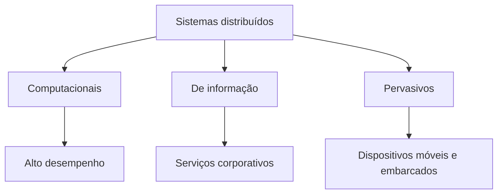
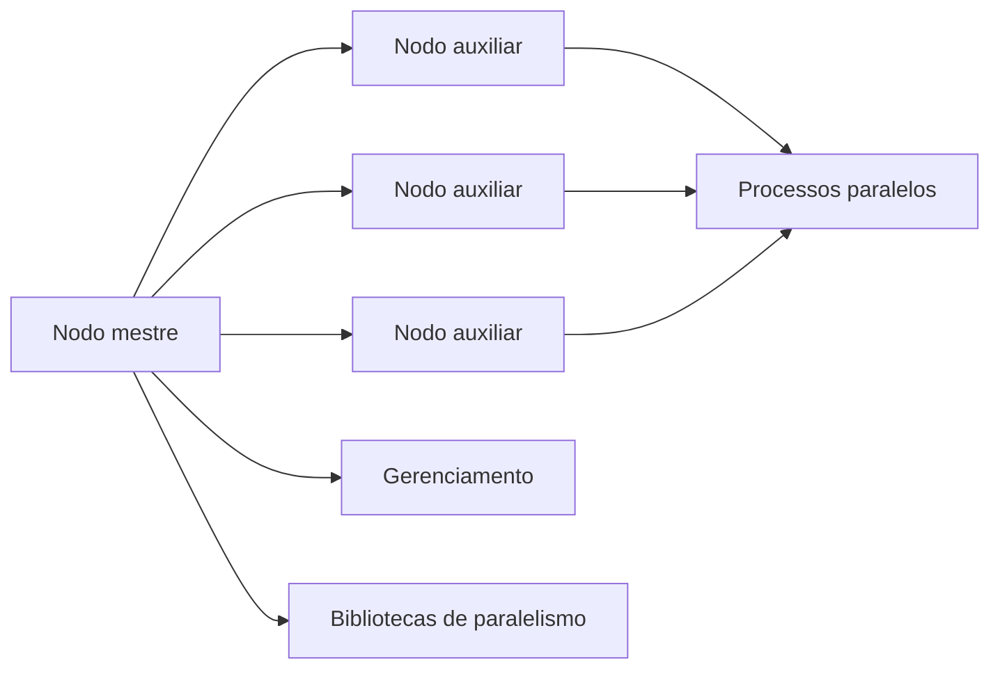
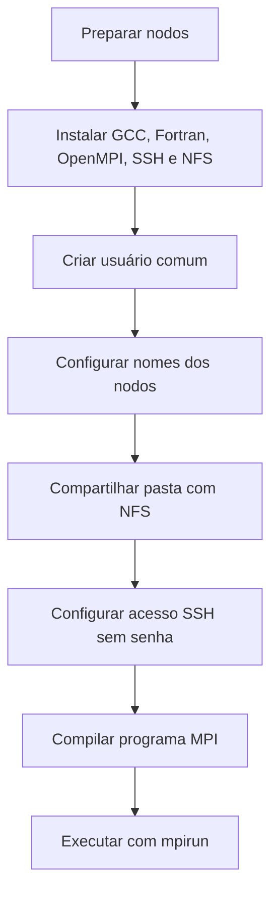
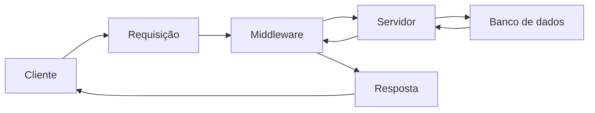
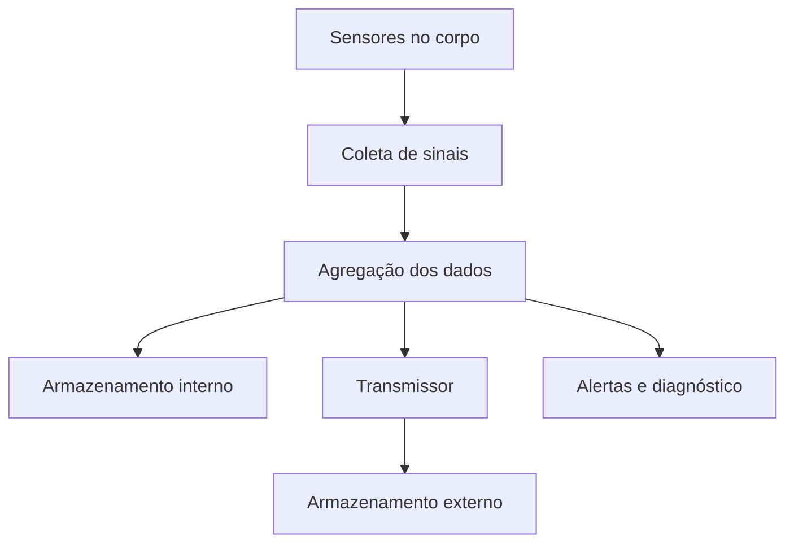
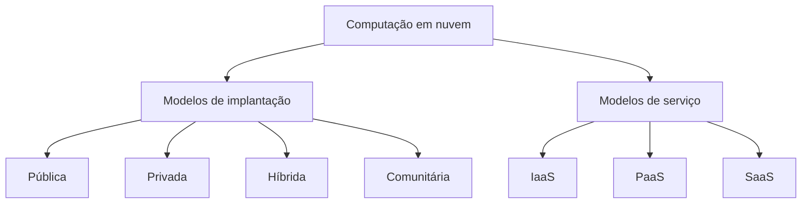
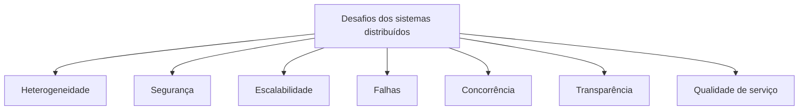

# Resumo 3.2 - Tipos de sistemas distribuídos

# Tipos de Sistemas Distribuídos

## Visão geral

> [!info] Conceito
> Sistemas distribuídos são formados por computadores ou dispositivos conectados em rede que trabalham em conjunto para compartilhar recursos de _hardware_ e _software_.

Os sistemas distribuídos surgem da necessidade de executar aplicações que uma única máquina não conseguiria atender com eficiência. Eles permitem compartilhar processamento, armazenamento, dados, serviços e informações entre vários usuários ou dispositivos. Do ponto de vista do usuário, muitas vezes existe a impressão de estar usando um único sistema, mesmo que internamente existam vários computadores, redes e serviços cooperando.

Os materiais classificam os sistemas distribuídos em três grandes tipos: **computacionais**, **de informação** e **pervasivos**.

> [!tip] Resumindo
> A classificação ajuda a entender o objetivo principal de cada sistema distribuído: processar mais rápido, oferecer serviços a usuários ou integrar dispositivos ao ambiente.

---

## Sistemas distribuídos computacionais

> [!info] Conceito
> Sistemas distribuídos computacionais são usados em aplicações que exigem grande capacidade de processamento.

Esse tipo de sistema é voltado para **computação intensiva**, isto é, tarefas que precisam de muito poder computacional. Em vez de executar tudo em uma única máquina, o processamento é dividido entre vários computadores conectados em rede. Os principais exemplos são os **clusters computacionais** e as **grades computacionais**.

### _Clusters_ computacionais

Um _cluster_ computacional é formado por vários computadores dedicados, geralmente conectados por uma rede de alta velocidade. Esses computadores trabalham de forma coordenada para executar aplicações paralelas, ou seja, programas que dividem o trabalho entre vários processos executados ao mesmo tempo.

No modelo Beowulf, há normalmente um **nodo mestre**, responsável por gerenciar o _cluster_, e vários **nodos auxiliares**, que executam partes da aplicação paralela. O nodo mestre pode gerenciar a fila de trabalhos, alocar nodos para programas paralelos, oferecer uma interface para os usuários e compartilhar recursos com os demais nodos.

> [!warning] Atenção
> Em _clusters_, o usuário ou desenvolvedor não recebe automaticamente a ilusão de um sistema único. É necessário lidar com a divisão da carga, comunicação entre processos e sincronização dos dados.

### Grades computacionais

As grades computacionais são formadas por recursos distribuídos geograficamente, conectados pela Internet. Diferentemente de um _cluster_, uma grade pode reunir computadores, supercomputadores, bancos de dados e sistemas de armazenamento pertencentes a organizações diferentes.

Nesse tipo de sistema, a **heterogeneidade** é maior, pois os recursos podem ter redes, sistemas operacionais, políticas de segurança e domínios administrativos diferentes. A grade pode funcionar como uma organização virtual, permitindo que pessoas ou instituições compartilhem recursos computacionais.

A arquitetura de uma grade pode ser organizada em camadas:

| Camada | Função principal |
|---|---|
| Nível 1 | Interface para reservar recursos locais de um _site_ |
| Nível 2 | Protocolos de comunicação e abstração para uso dos recursos |
| Nível 3 | Gerenciamento de múltiplos recursos e usuários |
| Nível 4 | Execução das aplicações no ambiente de grade |

> [!tip] Resumindo
> O _cluster_ costuma ser mais controlado e homogêneo; a grade é mais distribuída, heterogênea e envolve recursos de diferentes locais ou organizações.

---

## Configuração de um _cluster_ Beowulf

> [!info] Conceito
> Um _cluster_ Beowulf é um sistema distribuído computacional que pode ser montado com _hardware_ convencional e usado para executar aplicações paralelas.

O material da Dica do Professor apresenta a configuração de um _cluster_ Beowulf com quatro nodos conectados por rede Ethernet. O objetivo é executar aplicações paralelas usando a biblioteca **OpenMPI**, voltada para aplicações de alto desempenho ou de processamento intensivo.

Para montar um _cluster_ Beowulf, é necessário ter pelo menos dois nodos. Um nodo pode ser um notebook, desktop ou servidor. Quando há mais nodos, é necessário usar um _switch_ ou _hub_ para conectá-los em rede.

O processo de configuração envolve a preparação dos nodos, a instalação de compiladores e bibliotecas, a configuração da comunicação entre as máquinas e a execução de um programa de teste em paralelo.

O uso do **NFS** permite compartilhar arquivos entre o nodo mestre e os nodos auxiliares. Assim, o programa compilado no mestre fica disponível para os demais nodos. O **SSH** é usado pelo OpenMPI para comunicação entre as máquinas, e por isso é configurado o acesso sem senha. Ao final, o programa MPI é executado nos nodos informados em um arquivo de máquinas, permitindo verificar em qual nodo cada processo foi executado.

> [!tip] Resumindo
> O _cluster_ Beowulf combina nodos comuns, rede, compartilhamento de arquivos, SSH e OpenMPI para executar processos paralelos em várias máquinas.

---

## Desafio: simulação de dinâmica de fluidos em _cluster_

> [!info] Conceito
> Migrar um programa de uma única máquina para um _cluster_ exige planejar como dividir o trabalho, comunicar os processos e preservar a correção dos resultados.

No desafio, um grupo de engenheiros possui um programa de simulação de dinâmica de fluidos que executa em apenas uma máquina e leva semanas para concluir os cálculos. A proposta é usar um _cluster_ Beowulf para reduzir o tempo de execução sem comprometer a precisão da simulação.

Os principais desafios identificados são **concorrência**, **escalabilidade** e **qualidade de serviço**. A concorrência aparece porque a execução passa a ocorrer em mais de um computador. A escalabilidade é necessária porque o programa deve funcionar com diferentes quantidades de nodos. A qualidade de serviço está ligada à redução do tempo de execução sem alterar a lógica ou a confiabilidade dos resultados.

A sugestão apresentada é estudar quais partes do programa podem ser divididas em componentes paralelos e adotar uma estratégia como **SPMD** (_Single Program Multiple Data_), em que o mesmo programa é executado em diferentes nodos, mas trabalhando sobre partes diferentes dos dados.

Também é necessário reduzir ao máximo a comunicação entre processos, pois comunicação excessiva pode gerar gargalos. Além disso, o desenvolvimento do código precisa ser monitorado para garantir que as mudanças não prejudiquem os cálculos.

> [!warning] Atenção
> Não basta distribuir o programa em várias máquinas. Se a divisão do trabalho ou a sincronização dos dados forem mal planejadas, o desempenho pode não melhorar ou os resultados podem ficar incorretos.

---

## Sistemas de informação distribuídos

> [!info] Conceito
> Sistemas de informação distribuídos são voltados para aplicações corporativas que oferecem serviços a vários usuários por meio de clientes, servidores e bancos de dados.

Esse tipo de sistema normalmente é acessado por navegadores ou aplicativos. O cliente envia requisições para um provedor, que processa os dados e devolve respostas. Os dados e o processamento ficam, em grande parte, no lado do provedor.

Um dos principais desafios é a **interoperabilidade**, que é a capacidade de sistemas diferentes se comunicarem de forma transparente. Em ambientes corporativos, isso é importante porque diferentes aplicações, dispositivos e bancos de dados precisam trocar informações.

Em um cenário clássico, uma aplicação cliente envia uma transação, que pode ser distribuída para diferentes servidores e bancos de dados. O monitoramento de transações permite coordenar o processamento, armazenamento e consulta das informações.

As transações podem seguir propriedades como:

| Propriedade | Explicação simples |
|---|---|
| Atomicidade | A transação acontece por completo ou não acontece |
| Consistência | A transação mantém os dados em estado válido |
| Isolamento | Transações simultâneas não interferem indevidamente entre si |
| Durabilidade | Depois de confirmados, os dados permanecem gravados |

Com a evolução desses sistemas, surgiram _middlewares_ de comunicação, como **RPC** e **RMI**, que permitem chamadas entre componentes distribuídos. Porém, esses modelos exigem que os processos envolvidos estejam ativos ao mesmo tempo e saibam se referir um ao outro.

Uma alternativa são os _middlewares_ orientados a mensagens, conhecidos como **MOM**. Nesse modelo, as aplicações enviam mensagens para o _middleware_, que se encarrega da entrega. Os sistemas **_publish/subscribe_** seguem essa lógica e são bastante usados em aplicações corporativas.

> [!tip] Resumindo
> Sistemas de informação distribuídos priorizam a oferta de serviços, o acesso por múltiplos usuários e a integração entre aplicações e bancos de dados.

---

## Sistemas pervasivos distribuídos

> [!info] Conceito
> Sistemas pervasivos distribuídos envolvem dispositivos móveis, sensores e equipamentos embarcados integrados ao ambiente.

Os sistemas pervasivos surgem com a expansão dos dispositivos móveis e embarcados. Eles envolvem equipamentos pequenos, móveis, com pouca bateria, conectados geralmente por redes sem fio. Esses dispositivos costumam ser configurados pelos próprios usuários, e não por especialistas.

O principal desafio é lidar com a **instabilidade**. A rede pode ficar indisponível, a bateria pode acabar, o dispositivo pode mudar de ambiente e os dados podem precisar ser sincronizados depois de interrupções.

As aplicações pervasivas precisam:

- adaptar-se a mudanças de contexto;
- ser configuradas com facilidade pelo usuário;
- permitir acesso simples a informações e recursos;
- lidar com sincronização de dados;
- descobrir serviços disponíveis no ambiente;
- reagir adequadamente a falhas ou mudanças.

Em uma casa inteligente, por exemplo, o usuário pode adicionar dispositivos que passam a ser gerenciados por um celular. Nesse cenário, nem sempre é desejável esconder todos os detalhes do sistema, pois o usuário e os dispositivos precisam se adaptar ao ambiente.

> [!warning] Atenção
> Diferentemente dos sistemas corporativos, os sistemas pervasivos nem sempre buscam alta abstração. Em alguns casos, é melhor que o usuário perceba certos detalhes, falhas ou mudanças do ambiente.

---

## Sistemas pervasivos na saúde

> [!info] Conceito
> Sistemas de saúde eletrônicos são exemplos de sistemas pervasivos que usam sensores para monitorar pacientes e enviar alertas.

Um exemplo apresentado é o monitoramento de sinais vitais por sensores espalhados pelo corpo. Esses sensores coletam dados e os enviam por uma rede. O sistema pode armazenar os dados internamente, externamente ou em um modelo híbrido.

No armazenamento interno, um dispositivo próximo ao corpo guarda os dados e também pode gerenciar a rede de sensores. No armazenamento externo, os dados são enviados para uma rede sem fio externa, o que exige um transmissor. Como a rede externa pode ser menos confiável, o modelo híbrido é considerado mais adequado: os dados são guardados localmente e enviados periodicamente para armazenamento externo permanente.

As principais preocupações nesse tipo de sistema são evitar perda de dados, garantir segurança e privacidade, permitir diagnóstico _online_, manter robustez no monitoramento e propagar alertas de forma adequada.

> [!tip] Resumindo
> Em sistemas pervasivos de saúde, a qualidade do serviço é crítica, pois atrasos, falhas ou perda de dados podem comprometer o acompanhamento do paciente.

---

## Exemplos reais de sistemas distribuídos

### Pesquisa na Internet

> [!info] Conceito
> Buscadores da Web usam sistemas distribuídos para indexar, organizar e consultar grandes volumes de informação.

Serviços de pesquisa na Internet, como mecanismos de busca, trabalham com enormes quantidades de páginas, vídeos, imagens, livros, áudios e outros conteúdos. Esses dados são armazenados e organizados em grandes bases distribuídas.

O exemplo do Google mostra uma infraestrutura distribuída geograficamente, formada por muitos computadores em centros de dados. Essa infraestrutura inclui sistema de arquivos distribuído, armazenamento estruturado distribuído, serviços de bloqueio e acordo, além de modelos de programação para cálculos paralelos e distribuídos.

> [!tip] Resumindo
> A pesquisa na Web depende de armazenamento distribuído, processamento paralelo e infraestrutura global para responder rapidamente às consultas dos usuários.

### Computação em nuvem

> [!info] Conceito
> Computação em nuvem é um modelo de sistema distribuído em que recursos computacionais são oferecidos como serviço.

Na computação em nuvem, recursos como processamento, armazenamento, rede, plataformas e softwares são oferecidos sob demanda. O usuário paga pelo que usa, de forma parecida com o consumo de serviços como água ou eletricidade.

Os modelos de implantação de nuvem são:

| Modelo | Explicação |
|---|---|
| Nuvem pública | Atende usuários em geral, por meio de provedores públicos |
| Nuvem privada | Atende usuários de uma organização específica |
| Nuvem híbrida | Combina recursos privados e públicos |
| Nuvem comunitária | Compartilha recursos entre organizações com interesses comuns |

Os modelos de serviço são:

| Modelo | O que oferece |
|---|---|
| IaaS | Infraestrutura como máquinas virtuais, armazenamento e rede |
| PaaS | Ambiente de execução para desenvolver e hospedar aplicações |
| SaaS | Software pronto, geralmente acessado pelo navegador |

A nuvem traz benefícios como acesso sob demanda, pagamento conforme o uso, escalabilidade, alocação eficiente de recursos e criação rápida de serviços. Porém, também envolve desafios como dependência da Internet, privacidade dos dados, segurança, disponibilidade, tolerância a falhas e dependência do provedor.

> [!warning] Atenção
> Ao usar serviços específicos de um provedor de nuvem, a aplicação pode ficar dependente desse provedor. Isso pode dificultar uma futura migração para outra plataforma.

### Serviços de multimídia

> [!info] Conceito
> Serviços multimídia distribuídos transmitem vídeo, áudio e texto em fluxo contínuo, muitas vezes em tempo real.

Aplicações multimídia, como transmissão de vídeos, jogos, shows e telejornais, precisam entregar conteúdo para usuários em diferentes locais e dispositivos. O desafio é usar a largura de banda com eficiência e manter a qualidade do serviço.

A compressão, codificação e decodificação são fundamentais para reduzir o consumo de rede. Além disso, o sistema precisa lidar com latências diferentes, pois os usuários estão geograficamente distribuídos.

A infraestrutura deve suportar vários formatos, mecanismos de qualidade de serviço, políticas de gerenciamento de recursos e estratégias de adaptação quando a qualidade desejada não puder ser mantida.

> [!tip] Resumindo
> Serviços multimídia precisam equilibrar qualidade, largura de banda, latência e adaptação ao dispositivo do usuário.

---

## Principais desafios dos sistemas distribuídos

> [!info] Conceito
> Projetar sistemas distribuídos exige lidar com desafios técnicos que aparecem em diferentes intensidades conforme o tipo de sistema.

Os materiais destacam um conjunto de características e desafios comuns aos sistemas distribuídos: heterogeneidade, abertura, segurança, escalabilidade, tratamento de falhas, concorrência, transparência, abstração e qualidade de serviço.

| Desafio | Explicação simples |
|---|---|
| Heterogeneidade | Diferentes redes, dispositivos, sistemas operacionais, linguagens e plataformas precisam funcionar juntos |
| Sistemas abertos | O sistema deve usar padrões que permitam extensão, integração e reimplementação |
| Segurança | Proteção da confidencialidade, integridade e disponibilidade |
| Escalabilidade | Capacidade de crescer em usuários, dados, recursos ou dispositivos |
| Tratamento de falhas | Detecção, mascaramento, tolerância, recuperação e redundância diante de problemas |
| Concorrência | Controle de acessos simultâneos para evitar inconsistências |
| Transparência | Ocultação de detalhes da distribuição quando isso ajuda o usuário |
| Qualidade de serviço | Garantia de confiabilidade, segurança e desempenho adequado |

> [!tip] Resumindo
> Todo sistema distribuído precisa equilibrar desempenho, segurança, crescimento, falhas e experiência do usuário.

---

## Heterogeneidade

> [!info] Conceito
> Heterogeneidade é a diversidade de tecnologias que participam de um sistema distribuído.

A heterogeneidade aparece em redes, _hardwares_, sistemas operacionais, linguagens de programação e códigos desenvolvidos por diferentes equipes. Em _clusters_, ela tende a ser menor, pois os computadores geralmente têm configuração parecida. Em grades computacionais e sistemas pervasivos, ela é maior, pois há diversidade de ambientes, dispositivos e redes.

Uma forma de reduzir os efeitos da heterogeneidade é usar _middlewares_, que funcionam como camadas intermediárias de comunicação. A **JVM** também é citada como tecnologia capaz de abstrair diferenças de _hardware_ e sistema operacional, permitindo que programas em Java e outras linguagens compatíveis sejam executados em diferentes plataformas.

> [!tip] Resumindo
> A JVM ajuda a lidar com heterogeneidade porque executa _bytecode_ em diferentes máquinas, escondendo parte das diferenças do _hardware_ e do sistema operacional.

---

## Sistemas abertos

> [!info] Conceito
> Um sistema aberto pode ser estendido, reimplementado e integrado por meio de padrões conhecidos.

A abertura está relacionada ao uso de padrões abertos de programação e comunicação. Isso permite que diferentes sistemas conversem entre si, que soluções sejam estendidas e que partes do sistema possam ser reimplementadas.

Em sistemas corporativos, a abertura depende dos interesses da empresa. Em sistemas pervasivos e na Web, padrões documentados ajudam dispositivos, sensores, navegadores e serviços a se comunicarem corretamente.

> [!tip] Resumindo
> Padrões abertos facilitam integração, manutenção, colaboração e evolução dos sistemas distribuídos.

---

## Segurança

> [!info] Conceito
> Segurança em sistemas distribuídos envolve confidencialidade, integridade e disponibilidade.

A **confidencialidade** protege os dados contra exposição indevida. A **integridade** protege contra alterações ou danos. A **disponibilidade** garante que os recursos continuem acessíveis quando necessário.

Sistemas corporativos e pervasivos têm grande preocupação com segurança porque costumam usar redes abertas e lidar com dados sensíveis. Em _clusters_ e grades, a rede pode ser mais controlada, mas ainda é necessário garantir que as mensagens cheguem corretamente e sem corrupção.

Ataques de negação de serviço podem comprometer a disponibilidade, principalmente em sistemas corporativos. Medidas como _firewall_, monitoramento e controle de recursos ajudam a reduzir esse risco.

> [!warning] Atenção
> Em sistemas distribuídos, a segurança precisa proteger tanto os dados quanto os recursos compartilhados pela rede.

---

## Escalabilidade

> [!info] Conceito
> Escalabilidade é a capacidade de o sistema crescer sem perder desempenho de forma significativa.

Um sistema distribuído escalável permite aumentar a quantidade de recursos, usuários ou dispositivos. Em _clusters_, isso pode ocorrer com a adição de mais computadores. Em grades, com a inclusão de mais _sites_. Em sistemas corporativos, o objetivo geralmente é atender mais usuários. Em sistemas pervasivos, pode ser necessário lidar com mais sensores ou dispositivos conectados.

Os principais riscos da escalabilidade são os gargalos, como largura de banda limitada, roteadores sobrecarregados, comunicação excessiva entre processos e distribuição ineficiente de carga.

> [!tip] Resumindo
> Escalar não é apenas adicionar máquinas; é garantir que o sistema continue eficiente ao crescer.

---

## Tratamento de falhas

> [!info] Conceito
> Tratamento de falhas é o conjunto de técnicas usadas para detectar, contornar e recuperar problemas em _hardware_ ou _software_.

Falhas em sistemas distribuídos podem ocorrer em apenas parte dos componentes, o que torna o problema mais difícil. O sistema precisa detectar o tipo e o local da falha, mascarar falhas quando possível, tolerar falhas conhecidas e recuperar o estado válido da aplicação.

Algumas técnicas citadas são retransmitir mensagens, gravar dados em mais de uma unidade de armazenamento, salvar estados da aplicação e usar componentes redundantes.

> [!warning] Atenção
> Em sistemas distribuídos, falhas são esperadas. Por isso, o projeto deve prever recuperação e redundância para evitar perda de dados ou indisponibilidade prolongada.

---

## Concorrência

> [!info] Conceito
> Concorrência ocorre quando vários processos, usuários ou fluxos de execução acessam recursos ao mesmo tempo.

Nos sistemas computacionais, a concorrência é explorada para obter maior desempenho. Nos sistemas corporativos, ela permite que muitos usuários acessem o serviço simultaneamente. Porém, quando vários processos acessam o mesmo recurso sem controle, podem surgir inconsistências.

O desenvolvedor precisa controlar a ordem de execução e impedir que dois processos ou _threads_ escrevam ao mesmo tempo na mesma região de memória. Uma técnica conhecida para esse controle é o uso de semáforos.

> [!warning] Atenção
> Concorrência sem controle pode gerar dados incorretos, mesmo que o sistema pareça estar funcionando.

---

## Transparência e abstração

> [!info] Conceito
> Transparência é a capacidade de ocultar detalhes da distribuição para simplificar a experiência do usuário.

A transparência pode ocorrer em vários níveis:

| Tipo de transparência | Ideia principal |
|---|---|
| Acesso | O usuário não percebe se o recurso é local ou remoto |
| Localização | O usuário não precisa saber onde o recurso está |
| Concorrência | Vários usuários acessam recursos sem interferência aparente |
| Replicação | Cópias de recursos são usadas sem o usuário perceber |
| Falhas | Problemas são mascarados quando possível |
| Mobilidade | Mudanças de localização não prejudicam a execução |
| Desempenho | O sistema se adapta à carga |
| Escalabilidade | O sistema cresce sem exigir mudança perceptível na aplicação |

Sistemas corporativos normalmente buscam alta transparência. Sistemas computacionais priorizam mais transparência de desempenho e escalabilidade. Já os sistemas pervasivos nem sempre devem esconder todos os detalhes, pois o usuário pode precisar perceber falhas, mudanças de contexto ou limitações dos dispositivos.

> [!tip] Resumindo
> A transparência é útil quando simplifica o uso do sistema, mas pode ser inadequada quando esconder informações prejudica a adaptação do usuário ou do próprio sistema.

---

## Qualidade de serviço

> [!info] Conceito
> Qualidade de serviço é a capacidade de oferecer uma experiência confiável, segura e com bom desempenho.

A qualidade de serviço depende dos recursos computacionais e de rede disponíveis em relação ao que a aplicação precisa. Em serviços de vídeo, por exemplo, a resolução pode ser ajustada automaticamente conforme a largura de banda do usuário. Isso evita travamentos e melhora a experiência.

Em sistemas pervasivos de saúde, a qualidade de serviço pode ser crítica, pois atrasos em alertas podem ter consequências graves. Em sistemas corporativos, baixa qualidade pode causar perda de usuários. Em sistemas computacionais, pode resultar em desperdício de tempo e recursos.

> [!tip] Resumindo
> A qualidade de serviço muda conforme o tipo de aplicação: em alguns casos, o foco é desempenho; em outros, segurança, confiabilidade ou disponibilidade.

---

## Pontos de fixação dos exercícios

> [!info] Conceito
> Os exercícios reforçam a classificação dos sistemas distribuídos e as características mais importantes de cada tipo.

Um _cluster_ formado por várias máquinas conectadas por rede de alta velocidade pertence aos **sistemas distribuídos computacionais**, pois seu objetivo é executar tarefas de processamento intensivo.

Em um sistema de monitoramento de sinais vitais com sensores, as principais preocupações são **privacidade**, **perda de dados**, **segurança** e **envio de alertas**. Esse é um exemplo de sistema pervasivo, pois envolve sensores, rede e adaptação ao contexto.

Na computação em nuvem, os modelos de implantação são **nuvem privada**, **nuvem pública**, **nuvem híbrida** e **nuvem comunitária**.

Em sistemas pervasivos, a abstração é uma característica delicada. Nem sempre é desejável esconder todos os detalhes do sistema, principalmente quando falhas ou mudanças de contexto precisam ser percebidas pelo usuário.

A **JVM** é destacada como tecnologia usada para abstrair a heterogeneidade de _hardware_ em sistemas distribuídos, permitindo que programas compatíveis sejam executados em diferentes plataformas.

> [!tip] Resumindo
> Os exercícios ajudam a diferenciar os tipos de sistemas distribuídos e mostram que cada tipo prioriza desafios diferentes.

---

## Síntese final

> [!summary] Síntese
> Sistemas distribuídos permitem que computadores, servidores, dispositivos móveis, sensores e serviços trabalhem em conjunto para compartilhar recursos e informações. Eles podem ser classificados em sistemas computacionais, de informação e pervasivos. Os computacionais priorizam alto desempenho, como _clusters_ e grades; os de informação priorizam serviços corporativos e interoperabilidade; os pervasivos integram dispositivos móveis, sensores e equipamentos embarcados ao ambiente. Apesar das diferenças, todos precisam lidar com desafios como heterogeneidade, abertura, segurança, escalabilidade, falhas, concorrência, transparência e qualidade de serviço.