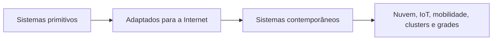
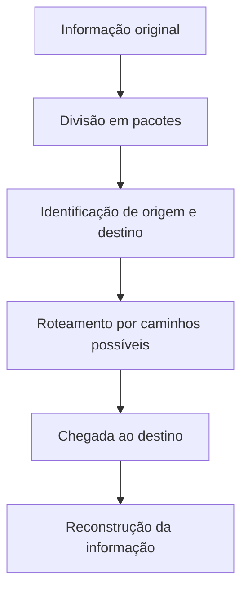
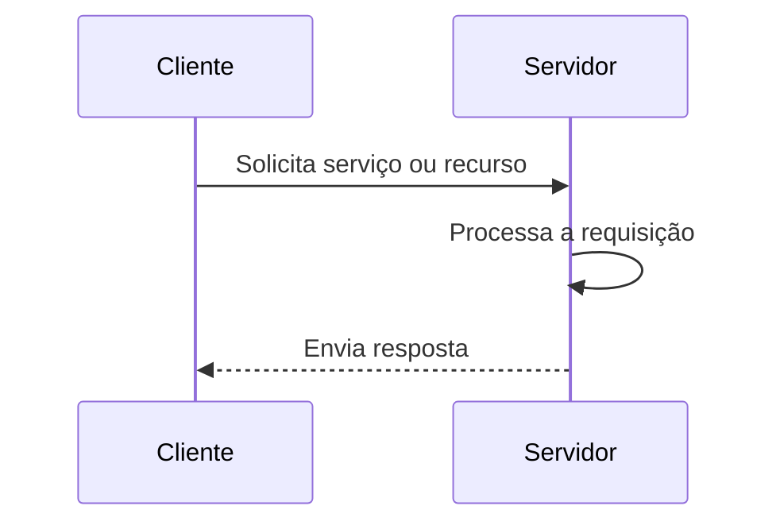

# Resumo 3.3 - Modelos físicos para sistemas distribuídos

# Modelos físicos para sistemas distribuídos

> [!info] Conceito
> Um **modelo físico** representa os elementos de hardware de um sistema distribuído e suas interconexões, abstraindo detalhes específicos dos computadores e das tecnologias de rede.

Sistemas distribuídos precisam funcionar em ambientes variados, com diferentes tecnologias, usuários, serviços, ameaças e dificuldades de projeto. Por isso, os modelos ajudam a descrever propriedades, problemas e decisões importantes. Entre os modelos estudados, o **modelo físico** foca na estrutura material do sistema: quais equipamentos existem, como estão conectados e como trocam mensagens pela rede.

Além dos modelos físicos, também existem modelos de arquitetura e modelos fundamentais. Os **modelos de arquitetura** tratam da organização das tarefas computacionais e da comunicação entre componentes. Já os **modelos fundamentais** descrevem problemas gerais enfrentados por sistemas distribuídos, de forma mais abstrata.

> [!tip] Resumindo
> O modelo físico mostra “do que o sistema é feito” e “como os elementos estão conectados”.

---

## Gerações dos modelos físicos

> [!info] Conceito
> Os modelos físicos evoluíram junto com as tecnologias de rede, passando de sistemas locais simples para sistemas globais, móveis, em nuvem e altamente heterogêneos.

O modelo físico básico de um sistema distribuído é formado por componentes de software e hardware interconectados em uma rede. Esses componentes se comunicam e coordenam suas ações por meio da troca de mensagens.

A evolução dos modelos físicos é organizada em três gerações principais: **sistemas distribuídos primitivos**, **sistemas distribuídos adaptados para a Internet** e **sistemas distribuídos contemporâneos**.

O diagrama representa a evolução dos modelos físicos, mostrando que cada geração aumenta a escala, a diversidade tecnológica e os desafios de projeto.

---

## Sistemas distribuídos primitivos

> [!info] Conceito
> Os sistemas distribuídos primitivos foram a primeira geração dos modelos físicos, baseados principalmente em redes locais e serviços simples.

Os sistemas distribuídos primitivos surgiram entre o final da década de 1970 e o início da década de 1980, acompanhando o crescimento das redes locais. Eram sistemas pequenos, normalmente formados por cerca de **10 a 100 nós** interconectados em uma rede local.

Essa geração tinha conectividade limitada e oferecia poucos serviços simples, como **impressoras locais** e **servidores de arquivos**. Em geral, os nós eram homogêneos, isto é, parecidos em termos de hardware, software e ambiente de execução.

Como eram sistemas menores e mais fechados, algumas ameaças externas, como negação de serviço e ataques por códigos móveis, eram consideradas nulas ou irrisórias nesse contexto. A qualidade de serviço ainda estava em estágio inicial.

> [!tip] Resumindo
> Sistemas primitivos eram pequenos, locais, simples, mais homogêneos e menos expostos a ameaças externas.

---

## Sistemas distribuídos adaptados para a Internet

> [!info] Conceito
> Os sistemas adaptados para a Internet ampliaram a escala dos sistemas distribuídos, conectando muitos nós, serviços e usuários em uma infraestrutura global.

A segunda geração surgiu a partir da década de 1990, com o crescimento da Internet. A Internet passou a ser explorada como infraestrutura para sistemas distribuídos maiores, com abrangência global e capacidade de ultrapassar limites organizacionais.

Nessa geração, os usuários passaram a acessar serviços como **web**, **e-mail** e **transferência de arquivos**, independentemente de sua localização. O número de nós, usuários, tecnologias e serviços aumentou muito em comparação com os sistemas primitivos.

Esse crescimento trouxe novos desafios. A **heterogeneidade** passou a ser significativa, pois o sistema passou a reunir diferentes plataformas, linguagens, sistemas operacionais, redes, dispositivos e implementações. Para lidar com essas diferenças, surgiu a importância do **middleware**, uma camada de software colocada entre as aplicações e as plataformas distribuídas.

O middleware ajuda a esconder diferenças entre tecnologias, facilitando a comunicação e a integração entre componentes distintos. Exemplos citados no material incluem **CORBA** e **web services**.

> [!warning] Atenção
> Middleware está diretamente relacionado ao desafio da **heterogeneidade**, pois sua função principal é ocultar diferenças entre plataformas e tecnologias.

Além disso, a **abertura de sistemas** ganhou importância. Um sistema aberto oferece serviços seguindo regras e interfaces padronizadas, permitindo maior interoperabilidade entre componentes. A qualidade de serviço também deixou de ser apenas uma preocupação inicial e passou a ser um requisito importante.

> [!tip] Resumindo
> A segunda geração cresceu com a Internet e trouxe como desafios centrais a escalabilidade, a heterogeneidade, a abertura e a qualidade de serviço.

---

## Sistemas distribuídos contemporâneos

> [!info] Conceito
> Os sistemas contemporâneos representam a terceira geração dos modelos físicos, marcada por mobilidade, computação ubíqua, computação em nuvem, IoT, clusters e grades.

Os sistemas distribuídos contemporâneos refletem avanços tecnológicos recentes. Um dos principais fatores dessa geração é a **computação móvel**, que permite a existência de nós independentes de localização, como notebooks e smartphones.

Essa geração também introduz a **computação ubíqua ou pervasiva**, que envolve o uso de vários dispositivos computacionais pequenos, baratos e presentes no ambiente físico dos usuários, como casas, escritórios e ruas. Objetos comuns, como máquinas de lavar e geladeiras, podem se tornar nós de um sistema distribuído.

Outro avanço importante é a **computação em nuvem**, entendida como um conjunto de serviços de aplicação, armazenamento e computação baseados na Internet. A nuvem permite que usuários acessem recursos remotamente, reduzindo a dependência de software e armazenamento locais.

Também fazem parte dessa geração os **clusters** e as **grades**, ligados ao suporte à computação. Os clusters normalmente apresentam maior homogeneidade, enquanto as grades lidam com maior heterogeneidade.

> [!tip] Resumindo
> A terceira geração amplia o sistema para uma escala muito maior, com dispositivos móveis, objetos conectados, serviços em nuvem e grande diversidade tecnológica.

---

## Comparativo entre as gerações

> [!info] Conceito
> As gerações dos modelos físicos podem ser comparadas por escala, heterogeneidade, abertura de sistema e qualidade de serviço.

A evolução dos modelos físicos aumentou a escala dos sistemas e, junto com ela, aumentaram também os desafios de projeto. Quanto maior o sistema, maior tende a ser a diversidade de tecnologias, serviços, usuários e requisitos.

| Aspecto | Sistemas primitivos | Adaptados para a Internet | Contemporâneos |
|---|---|---|---|
| **Escala** | Pequena | Grande | Ultragrande |
| **Heterogeneidade** | Limitada | Significativa | Prioritária |
| **Abertura de sistema** | Sem prioridade | Prioridade significativa | Prioridade elevada |
| **Qualidade de serviço** | Estágio inicial | Prioridade significativa | Prioridade elevada |

A **escala** se refere ao crescimento da infraestrutura, considerando nós, redes, recursos e usuários. Um sistema é escalável quando consegue crescer mantendo desempenho eficiente.

A **heterogeneidade** aparece quando o sistema reúne diferentes redes, hardwares, sistemas operacionais, linguagens e formas de implementação. Nos sistemas contemporâneos, ela se torna prioridade porque há muitos tipos de dispositivos e serviços.

A **abertura de sistema** está ligada ao uso de regras, padrões e interfaces bem definidas, permitindo que diferentes componentes interajam. Quanto mais complexo o sistema, maior a necessidade de padrões.

A **qualidade de serviço** envolve propriedades como confiabilidade, segurança, desempenho, disponibilidade, adaptabilidade e capacidade de atender às necessidades dos usuários em diferentes configurações.

> [!warning] Atenção
> Escala, heterogeneidade, abertura e qualidade de serviço crescem juntas: quando o sistema aumenta, os desafios também aumentam.

---

## Computação em nuvem e Internet das Coisas

> [!info] Conceito
> A computação em nuvem e a Internet das Coisas são tecnologias complementares dos sistemas distribuídos contemporâneos.

A **computação em nuvem** está relacionada à oferta de recursos virtuais e sob demanda pela Internet, como armazenamento, processamento e serviços de aplicação. Ela é ubíqua porque os recursos podem ser acessados de qualquer lugar.

A **Internet das Coisas**, também chamada de **IoT**, conecta objetos físicos à Internet. Esses objetos coletam, enviam e trocam dados, transformando elementos do mundo real em fontes de informação digital. A IoT é pervasiva porque as “coisas” conectadas podem estar em muitos lugares do ambiente cotidiano.

| Aspecto | Computação em nuvem | Internet das Coisas |
|---|---|---|
| **Características** | Recursos virtuais e disponíveis em qualquer lugar | Objetos físicos conectados e presentes no mundo real |
| **Processamento** | Capacidade computacional virtualmente ilimitada | Capacidade computacional limitada |
| **Armazenamento** | Armazenamento amplo ou virtualmente ilimitado | Armazenamento limitado ou inexistente |
| **Conectividade** | Usa a Internet para prestar serviços sob demanda | Usa a Internet como ponto de convergência |
| **Dados** | Armazena, acessa e gerencia dados | Gera grande volume de dados |

A relação entre as duas tecnologias é complementar. A IoT gera grande volume de dados, enquanto a computação em nuvem fornece infraestrutura para armazenar, processar, gerenciar e compartilhar esses dados.

O diagrama mostra que a IoT atua como fonte de dados e a nuvem atua como ambiente de tratamento, armazenamento e disponibilização desses dados.

> [!tip] Resumindo
> A IoT gera dados no mundo físico; a nuvem armazena, processa e disponibiliza esses dados pela Internet.

---

## Funcionamento básico da Internet

> [!info] Conceito
> A Internet é um exemplo de sistema distribuído formado por milhares de organizações e empresas independentes que precisam se interligar e colaborar.

Para usar a Internet, normalmente é necessário contratar um serviço de um provedor local. A partir dessa conexão, é possível acessar várias aplicações, como chats, videoconferências, jogos on-line, e-mail, web services e outros serviços.

A Internet utiliza uma infraestrutura de telecomunicações semelhante à de outros serviços, como televisão e telefonia, mas faz isso de maneira mais inteligente e inovadora. Como a Internet é complexa, seu funcionamento pode ser compreendido dividindo o sistema em partes menores.

Um dos componentes fundamentais da Internet é o **protocolo IP**. Ele possui duas funções centrais: identificar cada dispositivo da rede por meio de um endereço e dividir as informações em pacotes. Cada pacote recebe informações de origem e destino para que possa ser enviado pela rede.

A **comutação de pacotes** consiste em dividir uma informação em partes menores, que podem seguir por rotas diferentes até o destino. Isso evita a necessidade de reservar previamente recursos de comunicação. Como os pacotes podem seguir caminhos alternativos, a Internet se torna mais eficiente e tolerante a falhas.

O diagrama representa o fluxo geral da comutação de pacotes: a informação é dividida, identificada, enviada por rotas possíveis e reorganizada no destino.

> [!tip] Resumindo
> A Internet funciona com endereçamento, pacotes e roteamento, permitindo comunicação distribuída, eficiente e tolerante a falhas.

---

## Modelo cliente/servidor

> [!info] Conceito
> No modelo cliente/servidor, clientes solicitam serviços ou recursos, e servidores recebem, processam e respondem às solicitações.

O modelo **cliente/servidor** é um dos estilos arquitetônicos mais tradicionais e importantes em sistemas distribuídos. Nele, os recursos costumam ser centralizados em servidores, enquanto os clientes acessam esses recursos por meio de solicitações.

Os **clientes** são processos que acessam recursos e realizam pedidos. Os **servidores** são processos que aceitam esses pedidos e executam os serviços solicitados. Ambos podem assumir diferentes formas, como aplicações, web services, clusters e grades.

Uma característica importante do modelo cliente/servidor é a concorrência por recursos compartilhados. Vários clientes podem tentar acessar o mesmo servidor ou manipular dados ao mesmo tempo, o que exige cuidado com desempenho, confiabilidade, segurança e controle de acesso.

O diagrama mostra a lógica básica do modelo cliente/servidor: o cliente solicita, o servidor processa e a resposta retorna ao cliente.

> [!tip] Resumindo
> O cliente consome serviços; o servidor gerencia e fornece os recursos solicitados.

---

## Protocolos de comunicação no modelo cliente/servidor

> [!info] Conceito
> Um protocolo é um conjunto de regras que permite que dispositivos e sistemas diferentes troquem mensagens e se entendam.

No modelo cliente/servidor, a comunicação entre processos ocorre por meio da troca de mensagens. Os protocolos da camada de transporte analisados no material são **UDP** e **TCP**.

O **UDP** permite enviar pacotes, chamados de datagramas, sem estabelecer conexão prévia entre remetente e destino. Ele é mais simples e pode ser mais eficiente, pois não implementa controle de fluxo, controle de erros nem retransmissão de dados quando há perda ou inconsistência.

Por isso, o UDP pode ser útil em sistemas mais simples, com poucas mensagens e sem exigências rigorosas de controle. Em alguns casos, se uma solicitação ou resposta se perder, o cliente pode aguardar um tempo definido, chamado **timeout**, e tentar novamente.

O **TCP**, por outro lado, é orientado à conexão. Antes de transmitir dados, os processos precisam estabelecer um canal de comunicação bidirecional. Ele foi projetado para oferecer um fluxo confiável de bytes fim a fim, mesmo em uma inter-rede sujeita a falhas, atrasos e diferenças de tecnologia.

O TCP oferece mecanismos como controle de fluxo, retransmissão, verificação, maior tolerância a falhas e maior confiabilidade. Por isso, é mais adequado para aplicações que exigem integridade, segurança operacional e consistência das informações. Como consequência, sua implementação é mais complexa e pode ter custo maior de desempenho.

| Critério | UDP | TCP |
|---|---|---|
| **Conexão prévia** | Não exige | Exige |
| **Entrega confiável** | Não garante | Garante com mecanismos de controle |
| **Controle de fluxo** | Não oferece | Oferece |
| **Retransmissão** | Não oferece | Oferece |
| **Complexidade** | Menor | Maior |
| **Desempenho** | Tende a ser mais rápido | Pode ser mais lento |
| **Uso adequado** | Mensagens simples e aplicações menos críticas | Sistemas críticos, transacionais ou com dados sensíveis |

> [!warning] Atenção
> A escolha entre UDP e TCP depende dos requisitos da aplicação. Eficiência sozinha não basta quando há risco de perda, corrupção ou inconsistência de dados.

---

## Estudos de caso: banco e hospital

> [!info] Conceito
> Em sistemas distribuídos críticos, a escolha do protocolo deve equilibrar desempenho, confiabilidade, integridade e tolerância a falhas.

No estudo de caso bancário, o sistema do banco UBS precisava lidar com transações financeiras, preservando integridade dos dados, disponibilidade e confidencialidade. Como clientes reclamavam de lentidão, foi dada prioridade ao UDP para melhorar a eficiência. Porém, algumas transações não recebiam resposta dentro do tempo esperado, gerando inconsistências.

O caso mostra que protocolos não orientados à conexão podem ser eficientes, mas não são ideais quando mensagens não podem se perder ou chegar corrompidas. Em operações bancárias, como transferências, é necessário considerar mecanismos confiáveis, tratamento de mensagens perdidas, operações idempotentes, sincronização e protocolos orientados à conexão quando a aplicação exigir maior segurança operacional.

No estudo de caso hospitalar, o sistema distribuído seria usado em milhares de hospitais, com prontuários acessados por diferentes setores, como equipe médica, enfermaria, nutrição e diagnósticos. Como nem todas as informações podem ser lidas ou editadas por todas as equipes, também há preocupação com permissões e controle de acesso.

Nesse cenário, o protocolo recomendado é o **TCP**, pois os nodos estão interconectados pela Internet e os dados de prontuários não podem ser perdidos, chegar fora de ordem ou sofrer inconsistências durante a comunicação.

> [!warning] Atenção
> O TCP ajuda na confiabilidade da comunicação, mas o controle de permissões, autenticação, autorização e regras de leitura e escrita devem ser tratados pela aplicação.

Além do protocolo, o projetista deve considerar a concorrência, pois várias equipes podem acessar ou atualizar informações simultaneamente. Em sistemas hospitalares, uma atualização incorreta, perdida ou duplicada pode comprometer a integridade das informações clínicas.

> [!tip] Resumindo
> Em sistemas bancários e hospitalares, o TCP tende a ser mais adequado que o UDP porque a confiabilidade é mais importante do que apenas a velocidade.

---

## Pontos importantes para revisão

> [!info] Conceito
> Os exercícios reforçam os conceitos centrais da unidade e ajudam a diferenciar modelos, desafios e protocolos.

Os sistemas distribuídos primitivos consideravam algumas ameaças externas como nulas ou irrisórias, pois eram sistemas menores, mais locais e menos expostos. Já os sistemas adaptados para a Internet e os contemporâneos aumentam os desafios de segurança.

O middleware está diretamente relacionado à heterogeneidade, pois serve para separar aplicações das plataformas subjacentes e ocultar diferenças entre sistemas, linguagens, redes e implementações.

Clusters e grades são sistemas de suporte à computação. Em geral, clusters têm como característica principal a homogeneidade, enquanto grades lidam mais diretamente com heterogeneidade.

Computação em nuvem e IoT pertencem ao contexto dos sistemas distribuídos contemporâneos. A nuvem oferece recursos virtuais sob demanda, enquanto a IoT conecta objetos do mundo real e gera grande volume de dados. Elas são complementares.

O protocolo da camada de transporte que oferece controle de fluxo e soma de verificação de conteúdo é o TCP. Cliente/servidor e peer-to-peer são modelos arquiteturais, enquanto IP atua em outra camada da comunicação.

---

## Síntese final

> [!summary] Síntese
> Os modelos físicos para sistemas distribuídos mostram a evolução dos sistemas desde redes locais simples até ambientes globais, móveis, em nuvem e conectados por objetos inteligentes.

Os sistemas distribuídos primitivos eram pequenos, locais, simples e mais homogêneos. Com a Internet, os sistemas passaram a ter maior escala, abrangência global, heterogeneidade e necessidade de padrões. Nos sistemas contemporâneos, surgem mobilidade, computação ubíqua, IoT, computação em nuvem, clusters, grades e ambientes ultragrandes.

Essa evolução aumentou os desafios de projeto: escalabilidade, heterogeneidade, abertura de sistemas, qualidade de serviço e segurança. No modelo cliente/servidor, esses desafios aparecem especialmente na escolha dos protocolos de comunicação.

O UDP pode ser útil quando a simplicidade e a eficiência são mais importantes do que garantias rígidas de entrega. O TCP é mais adequado para sistemas críticos, como bancos e hospitais, pois oferece comunicação mais confiável, controle de fluxo e maior suporte à integridade dos dados. Assim, projetar sistemas distribuídos exige avaliar o domínio da aplicação, o risco de falhas, a criticidade dos dados e a necessidade de desempenho.