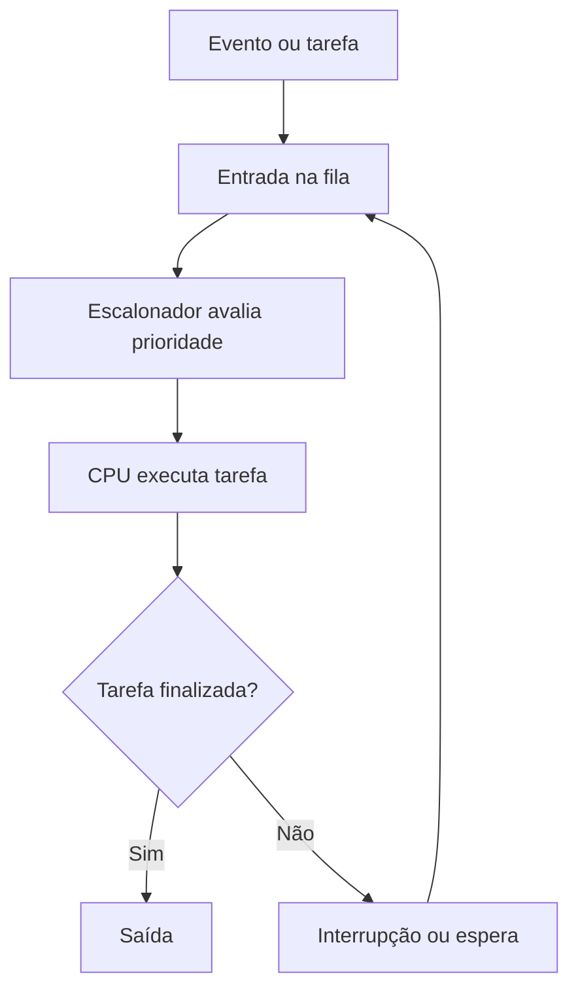
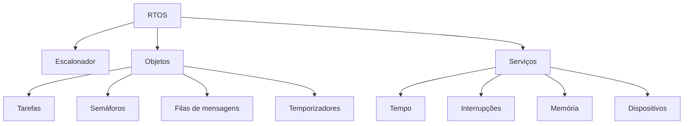
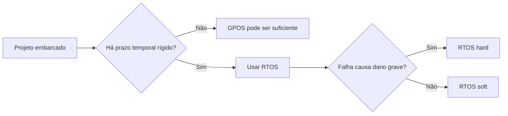
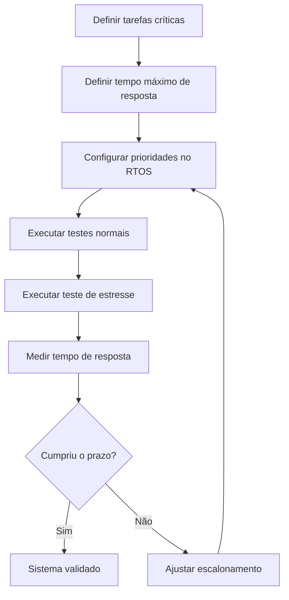

# Resumo 3.4 - Sistemas operacionais embarcados de tempo real

## 1. Conceito de RTOS

> [!info] Conceito
> Um **RTOS** é um sistema operacional de tempo real, desenvolvido para executar tarefas dentro de prazos previamente definidos.

Um **sistema operacional de tempo real** é usado quando uma aplicação precisa responder a eventos dentro de um tempo máximo determinado. O ponto principal não é simplesmente ser “mais rápido”, mas sim ser **previsível**. Isso significa que uma tarefa pode ter resposta imediata ou demorada, desde que seja executada dentro do prazo definido no projeto.

Em sistemas embarcados, essa previsibilidade é importante porque muitos dispositivos precisam monitorar sensores, controlar atuadores, responder a eventos externos e executar tarefas internas sem atrasos indevidos. Quando uma tarefa não cumpre seu prazo, ocorre uma falha no sistema, pois um requisito temporal deixou de ser atendido.

> [!warning] Atenção
> Em RTOS, tempo real não significa necessariamente “resposta instantânea”; significa **resposta dentro de um prazo conhecido e aceitável**.

Aplicações de tempo real costumam executar atividades repetidamente em intervalos fechados. Por isso, o RTOS deve organizar a execução das tarefas para evitar atrasos e garantir que as ações críticas recebam prioridade.

> [!tip] Resumindo
> O RTOS é indicado quando o sistema precisa responder com **previsibilidade**, respeitando prazos definidos para cada tarefa.

## 2. Escalonamento de tarefas

> [!info] Conceito
> O **escalonamento** é o mecanismo que define qual tarefa será executada pela CPU e em que momento.

Em sistemas embarcados simples, o controle das tarefas pode ser feito por um laço infinito com testes de condições, como ocorre em plataformas como Arduino, ESP8266 e ESP32. Nesse modelo, o programa permanece repetindo verificações, como leitura de sensores, acionamento de botões ou recebimento de requisições.

Esse tipo de implementação funciona em aplicações simples, mas se torna limitado quando há muitas tarefas concorrendo pelo processador. Em projetos mais complexos, é necessário usar algoritmos de escalonamento capazes de organizar prioridades, prazos e alternância entre processos.

O diagrama representa, de forma simplificada, como uma tarefa entra no sistema, é avaliada pelo escalonador e recebe tempo de CPU conforme sua prioridade ou condição de execução.

### 2.1 Flags e semáforos

> [!info] Conceito
> **Flags** e **semáforos** são mecanismos usados para sinalizar eventos ou controlar o acesso a recursos.

As **flags** funcionam como indicadores lógicos, semelhantes a um interruptor ligado/desligado. Normalmente usam valores como `0` e `1` para representar estados do programa, eventos ocorridos ou situações que precisam ser tratadas.

Os **semáforos** têm função parecida, mas são usados principalmente para controlar o acesso a recursos compartilhados em ambientes multitarefa. Eles ajudam a evitar que várias tarefas usem o mesmo recurso ao mesmo tempo de forma incorreta.

> [!tip] Resumindo
> Flags indicam estados ou eventos; semáforos ajudam a controlar recursos compartilhados entre tarefas.

## 3. Componentes de um RTOS

> [!info] Conceito
> Um RTOS é formado por elementos que organizam tarefas, comunicação, interrupções, memória, dispositivos e tempo.

De modo geral, um RTOS possui três grupos principais de componentes: **escalonador**, **objetos** e **serviços**. O escalonador decide qual tarefa será executada e quando isso acontecerá. Os objetos são elementos usados no desenvolvimento da aplicação, como tarefas, semáforos, eventos, temporizadores, filas de mensagens, mailboxes e pipes. Os serviços são operações executadas pelo kernel, como gerenciamento de tempo, interrupções, memória e dispositivos.

Esse diagrama resume os principais blocos que compõem um RTOS e mostra como eles se relacionam com a execução das aplicações embarcadas.

Alguns RTOS oferecem apenas o **kernel**, que contém a lógica mínima de funcionamento, como escalonador e gerenciador de recursos. Outros incluem módulos adicionais, como sistema de arquivos, protocolos de comunicação e componentes específicos da aplicação.

> [!tip] Resumindo
> O RTOS fornece uma base pronta para que o projetista não precise implementar manualmente toda a gerência de tarefas, memória, tempo e comunicação.

## 4. Por que usar RTOS?

> [!info] Conceito
> O RTOS é adotado quando o projeto precisa de controle rigoroso sobre tarefas, prioridades e prazos.

O uso de um RTOS facilita o desenvolvimento de aplicações embarcadas porque fornece funcionalidades pré-construídas. Assim, os projetistas podem se concentrar nas funções específicas da aplicação, sem precisar desenvolver do zero toda a lógica de gerenciamento do sistema.

Entre as razões funcionais para usar RTOS estão o uso de tarefas concorrentes, processos com prioridades diferentes, suporte a processos multinúcleo, gerenciamento de hardware e interface gráfica. Entre as razões não funcionais estão baixo custo de desenvolvimento, confiabilidade e portabilidade.

| Natureza | Critérios relacionados ao uso de RTOS |
|---|---|
| Funcional | Tarefas concorrentes, prioridades diferentes, processos multinúcleo, gerenciamento de hardware e interface gráfica |
| Não funcional | Baixo custo de desenvolvimento, confiabilidade e portabilidade |

> [!warning] Atenção
> É possível implementar um sistema de tempo real sem RTOS, mas isso não é recomendado em aplicações complexas, pois interações imprevistas podem impedir o atendimento dos processos prioritários.

## 5. Aplicações de RTOS

> [!info] Conceito
> RTOS é usado em aplicações nas quais atrasos podem comprometer segurança, operação ou confiabilidade.

O RTOS pode ser usado em qualquer situação que exija exatidão no tempo de resposta. Entre os exemplos apresentados estão aplicações médicas, aeronáuticas, modulação de voz e carros autônomos.

Em aplicações médicas, a prioridade pode ser responder rapidamente ao estado do paciente. Em aplicações aeronáuticas, a comunicação em tempo real com centrais de controle é essencial. Na modulação de voz, as mudanças precisam ser captadas e transmitidas em tempo real. Em carros autônomos, o sistema precisa perceber veículos e pessoas ao redor.

| Ambiente | Prioridade | Possível consequência da falha |
|---|---|---|
| Aplicações médicas | Resposta rápida ao estado do paciente | Agravamento do quadro ou morte |
| Aplicações aeronáuticas | Comunicação em tempo real | Colisão de aeronaves |
| Modulação de voz | Captura e transmissão em tempo real | Perda da captura do áudio |
| Carros autônomos | Percepção de veículos e pessoas | Colisão |

> [!tip] Resumindo
> Quanto maior o prejuízo causado por atrasos, maior tende a ser a necessidade de um RTOS.

## 6. GPOS e RTOS

> [!info] Conceito
> **GPOS** é um sistema operacional de uso geral; **RTOS** é um sistema operacional voltado ao cumprimento de prazos.

Os **GPOS** são sistemas operacionais de uso geral. Eles são desenvolvidos para atender ao maior número possível de ambientes e tarefas. Mesmo quando adaptados para sistemas embarcados, eles costumam manter recursos suficientes para atender a diferentes necessidades do usuário.

Já os **RTOS** são sistemas especializados em garantir tempo de resposta. Eles não buscam apenas executar muitas tarefas ao mesmo tempo; sua prioridade é garantir que tarefas críticas sejam executadas dentro do prazo estabelecido.

| Aspecto | GPOS | RTOS |
|---|---|---|
| Objetivo principal | Atender múltiplas tarefas e usos gerais | Cumprir prazos temporais definidos |
| Criticidade temporal | Normalmente não crítico no tempo | Crítico no tempo |
| Resposta | Pode variar conforme carga do sistema | Deve ser previsível |
| Escalonamento | Distribui fatias de tempo entre processos | Prioriza tarefas conforme importância e prazo |
| Restrições | Menos restritivo | Mais restritivo |
| Imagem do sistema | Pode ser maior | Geralmente menor e mais enxuta |

Exemplos de GPOS embarcados citados no material incluem **Raspberry OS**, **Arch Linux Arm** e **DietPi**. Esses sistemas podem ser úteis em dispositivos embarcados, mas não são a melhor escolha quando há requisitos temporais rígidos.

> [!warning] Atenção
> Em um GPOS, uma tarefa importante pode atrasar se houver muitos processos disputando a CPU. Em um RTOS, tarefas prioritárias devem assumir o controle do processador quando necessário.

## 7. Diferença principal entre GPOS e RTOS

> [!info] Conceito
> A diferença mais importante entre GPOS e RTOS está no modo como as tarefas são escalonadas.

No GPOS, o sistema tenta dividir o tempo do processador entre vários processos. Isso favorece a execução de muitas tarefas, mas não garante que uma tarefa crítica seja concluída dentro de um prazo específico.

No RTOS, as tarefas são executadas conforme prioridade. Quando uma tarefa de alta prioridade chega à fila, ela pode assumir rapidamente o controle da CPU se a tarefa atual tiver prioridade menor. A tarefa prioritária libera o processador quando termina sua execução ou quando outra tarefa ainda mais prioritária precisa ser executada.

Esse fluxo ajuda a visualizar a escolha básica entre GPOS, RTOS soft e RTOS hard conforme os requisitos temporais e as consequências de falha.

> [!tip] Resumindo
> GPOS prioriza uso geral e multitarefa; RTOS prioriza previsibilidade e cumprimento de prazos.

## 8. RTOS hard e RTOS soft

> [!info] Conceito
> RTOS pode ser classificado como **hard** ou **soft**, conforme a rigidez dos prazos e as consequências das falhas.

Um **RTOS hard** é usado em sistemas críticos, nos quais o não cumprimento do prazo pode causar danos graves, como prejuízos financeiros, danos a equipamentos, ferimentos ou mortes. Exemplos incluem sistemas médicos e controladores de voo. Nesse tipo de sistema, a flexibilidade é quase nula, pois o sistema precisa priorizar as funções com requisitos temporais rígidos.

Um **RTOS soft** é usado quando uma falha temporal pode prejudicar o funcionamento do software, mas sem causar dano físico imediato ou comprometer a integridade do sistema. Um exemplo apresentado é a leitura de velocidade em um carro autônomo: uma falha isolada pode ser corrigida por uma leitura seguinte, embora falhas consecutivas possam se tornar problemáticas.

| Característica | RTOS hard | RTOS soft |
|---|---|---|
| Tipo de sistema | Crítico | Brando |
| Consequência da falha | Pode causar danos graves | Pode gerar falha de software sem dano físico imediato |
| Imagem do sistema | Pequena | Maior |
| Tempo de resposta | Em milissegundos | Pode ser maior |
| Carga de pico | Previsível | Tolerável |
| Restrição | Muito restritivo | Menos restritivo |

> [!warning] Atenção
> Um RTOS soft ainda possui requisitos temporais, mas esses requisitos são menos rígidos do que em um RTOS hard.

## 9. Escalonadores usados em RTOS

> [!info] Conceito
> Os escalonadores organizam a ordem de execução das tarefas em um sistema de tempo real.

O material apresenta três métodos importantes de escalonamento: **RMS**, **EDF** e **FIFO**.

### 9.1 RMS — Escalonamento por taxas monotônicas

O **RMS** é um escalonamento preemptivo com prioridades fixas. A prioridade depende da frequência com que a tarefa é chamada. Quanto maior a frequência, maior a prioridade. Assim, tarefas com períodos menores tendem a ser executadas antes de tarefas com períodos maiores.

| Processo | Tempo de execução | Período |
|---|---:|---:|
| P1 | 1 | 4 |
| P2 | 2 | 6 |
| P3 | 3 | 12 |

> [!tip] Resumindo
> No RMS, a tarefa que ocorre com mais frequência recebe maior prioridade.

### 9.2 EDF — Prazo mais curto primeiro

O **EDF** é um algoritmo preemptivo que define a prioridade dinamicamente conforme o prazo da tarefa. Quanto menor o deadline, maior será a prioridade. Como os prazos mudam ao longo do tempo, a prioridade das tarefas também pode mudar.

> [!tip] Resumindo
> No EDF, a tarefa com o prazo mais urgente é executada primeiro.

### 9.3 FIFO — First In, First Out

O **FIFO** executa as tarefas conforme a ordem de chegada. A primeira tarefa que entra na fila é a primeira a ser executada. Ela só deixa o processador quando completa sua atividade ou quando uma tarefa de prioridade maior entra na fila.

> [!tip] Resumindo
> No FIFO, a ordem de chegada define a ordem de execução.

## 10. Troca de contexto e time slicing

> [!info] Conceito
> A **troca de contexto** permite alternar entre tarefas; o **time slicing** divide o tempo da CPU em fatias.

A **troca de contexto** é o ato de salvar o estado de uma tarefa e recuperá-lo depois. Isso permite interromper uma atividade e retomá-la posteriormente. Em um sistema com múltiplas tarefas, essa operação é importante para alternar entre processos, mas também pode gerar custo de processamento.

O **time slicing** é a divisão do tempo de uso do processador entre diferentes processos. Cada tarefa recebe uma fatia de tempo para executar. Esse método ajuda a dar a impressão de execução compartilhada, mas em sistemas de tempo real deve ser usado com cuidado, pois tarefas críticas não podem perder seus prazos.

> [!warning] Atenção
> A troca de contexto é útil, mas não é gratuita: o sistema gasta tempo salvando e restaurando informações das tarefas.

## 11. Exemplos de RTOS

> [!info] Conceito
> Existem diferentes RTOS no mercado, cada um com características próprias para tipos distintos de projeto.

O material apresenta exemplos de sistemas operacionais embarcados de tempo real, como **FreeRTOS**, **QNX**, **VxWorks** e **eCos**.

| RTOS | Características principais |
|---|---|
| FreeRTOS | Pequeno, simples, escrito em C, com suporte a threads, semáforos e timers |
| QNX | Sistema do tipo Unix, com arquitetura microkernel, multiusuário e multitarefa |
| VxWorks | Sistema de tempo real similar ao Unix, com recursos de memória, multiprocessador, depuração e monitoramento |
| eCos | RTOS de código aberto, adaptável a diferentes requisitos, hardwares e tempos de execução |

O **FreeRTOS** é destacado por seu baixo consumo de memória, baixa sobrecarga e rápida execução. Por ser leve, pode ser usado em plataformas como Arduino. O **QNX** prioriza estabilidade e segurança. O **VxWorks** oferece recursos como gerenciamento de memória compatível com POSIX, multiprocessamento, shells, depuradores e monitores de desempenho. O **eCos** é implementado em C e C++ e possui camada de compatibilidade com POSIX.

> [!tip] Resumindo
> A escolha do RTOS depende do tamanho do sistema, dos recursos disponíveis, da comunidade, do hardware e do tempo máximo de resposta exigido.

## 12. Critérios para escolher um RTOS

> [!info] Conceito
> A escolha de um RTOS deve considerar os requisitos da aplicação e as limitações do dispositivo embarcado.

Para selecionar um sistema operacional de tempo real, é necessário analisar vários aspectos do projeto. Um dos principais é o **tamanho do RTOS**, pois muitos microcontroladores têm armazenamento limitado. Quanto menor o sistema operacional, maior a possibilidade de usar dispositivos menos robustos.

Outro ponto importante é a existência de uma **comunidade ativa**. Uma comunidade grande ajuda na identificação de erros, correção de problemas e melhoria contínua do sistema.

Também é essencial conhecer o **tempo máximo de resposta** do sistema. Com esse valor, o escalonamento pode ser organizado para que as tarefas sejam executadas mesmo considerando o pior tempo possível.

> [!warning] Atenção
> A escolha do RTOS não deve ser feita apenas pelo nome do sistema; ela precisa considerar requisitos temporais, hardware, armazenamento, comunidade e previsibilidade.

## 13. RTOS em monitoramento médico crítico

> [!info] Conceito
> Em aplicações médicas críticas, o RTOS ajuda a garantir que sinais vitais sejam monitorados dentro de prazos seguros.

No desafio apresentado, a aplicação deve monitorar pacientes de alto risco durante hemodiálise, avaliando continuamente informações como pressão arterial, nível de açúcar e batimentos cardíacos. Por envolver saúde e segurança, o sistema possui grandes restrições temporais.

A garantia do tempo máximo de resposta deve ser feita com a definição dos prazos de cada tarefa e com a organização do escalonamento com base nesse tempo máximo. Tarefas críticas, como leitura de sinais vitais e emissão de alertas, devem ter prioridade maior do que tarefas secundárias, como registro de dados, comunicação com servidores ou atualização de interface.

Para testar esse tempo máximo, o sistema deve ser submetido a testes de estresse. Esses testes geram grande carga de trabalho e permitem medir quanto tempo o sistema demora para responder mesmo em condições de alto volume de ações.

O diagrama mostra o processo de validação de uma aplicação crítica: primeiro definem-se as tarefas e seus prazos; depois o RTOS é configurado; por fim, o sistema é testado e ajustado até cumprir o tempo máximo de resposta.

> [!summary] Síntese
> Em aplicações médicas críticas, o sistema precisa ser testado em condições de alta carga para comprovar que responde dentro do prazo máximo.

## 14. Estudo de caso: automação com Internet das coisas

> [!info] Conceito
> Projetos de automação com requisitos temporais rígidos podem exigir RTOS hard.

No caso apresentado, uma empresa de automação com Internet das coisas recebeu um projeto que exige extrema precisão. As ações da aplicação devem atender a requisitos temporais rígidos e, se falharem, podem causar grandes danos financeiros.

As opções consideradas foram firmware básico, sistemas de uso geral, sistemas de tempo real brandos e sistemas de tempo real críticos. Como o sistema não deve ser interrompido e precisa cumprir prazos rigorosos, a solução indicada é usar um **RTOS hard**.

Esse tipo de sistema é mais adequado porque é enxuto, otimizado e voltado ao cumprimento de prazos. Além disso, oferece recursos para usabilidade, escalonamento de atividades e controle temporal.

> [!tip] Resumindo
> Quando a falha temporal pode causar grandes prejuízos e o sistema não pode ser interrompido, a escolha mais adequada é um **RTOS hard**.

## 15. Pontos importantes dos exercícios

> [!info] Conceito
> Os exercícios reforçam as diferenças entre GPOS, RTOS soft, RTOS hard e aplicações críticas.

Os exercícios destacam que os RTOS podem ser classificados em **soft** e **hard**. O tipo soft atende requisitos temporais menos rígidos e pode tolerar atrasos ocasionais. O tipo hard é voltado a aplicações com prazos críticos e prioriza as atividades mais importantes.

Também é reforçado que os RTOS têm restrições de pacotes e tendem a ser mais enxutos. Eles não são otimizados para qualquer hardware de forma genérica; precisam ser escolhidos ou ajustados conforme o sistema embarcado utilizado.

Outro ponto importante é que sistemas embarcados não têm as mesmas funcionalidades de sistemas convencionais. Eles são reduzidos por causa das limitações de hardware, memória, processamento e consumo. Os RTOS são mais restritivos que os GPOS e normalmente possuem imagem menor.

Entre as aplicações em que RTOS é mais indicado estão **controle de tráfego aéreo** e **maca inteligente**, pois envolvem vidas e exigem controle temporal rigoroso. Micro-ondas e relógio de pulso são sistemas embarcados, mas não costumam exigir RTOS robusto em situações comuns.

> [!tip] Resumindo
> RTOS é mais indicado quando há tarefas críticas, prazos definidos e risco relevante caso o sistema atrase ou falhe.

## 16. Síntese final

> [!summary] Síntese
> Sistemas operacionais embarcados de tempo real são usados quando uma aplicação precisa cumprir prazos de execução com previsibilidade.

Um **RTOS** é um sistema operacional desenvolvido para aplicações em que o tempo de resposta é um requisito essencial. Sua função principal é garantir que tarefas importantes sejam executadas dentro de prazos definidos, usando escalonadores, prioridades, semáforos, temporizadores, filas de mensagens e serviços do kernel.

A principal diferença entre **GPOS** e **RTOS** está na finalidade. O GPOS busca atender usos gerais e múltiplas tarefas; o RTOS busca previsibilidade temporal. Dentro dos RTOS, há sistemas **hard**, usados em aplicações críticas, e sistemas **soft**, usados quando atrasos ocasionais podem ser tolerados.

Os escalonadores, como **RMS**, **EDF** e **FIFO**, organizam a execução das tarefas conforme frequência, prazo ou ordem de chegada. Recursos como troca de contexto e time slicing ajudam na alternância entre processos, mas precisam ser usados com atenção para não comprometer os prazos.

Na prática, a escolha de um RTOS depende dos requisitos temporais, das consequências de falha, do hardware disponível, do tamanho do sistema, da comunidade de suporte e do tempo máximo de resposta esperado. Em aplicações médicas, aeronáuticas, automação crítica e sistemas que lidam com vidas ou grandes prejuízos, o uso de RTOS se torna especialmente importante.