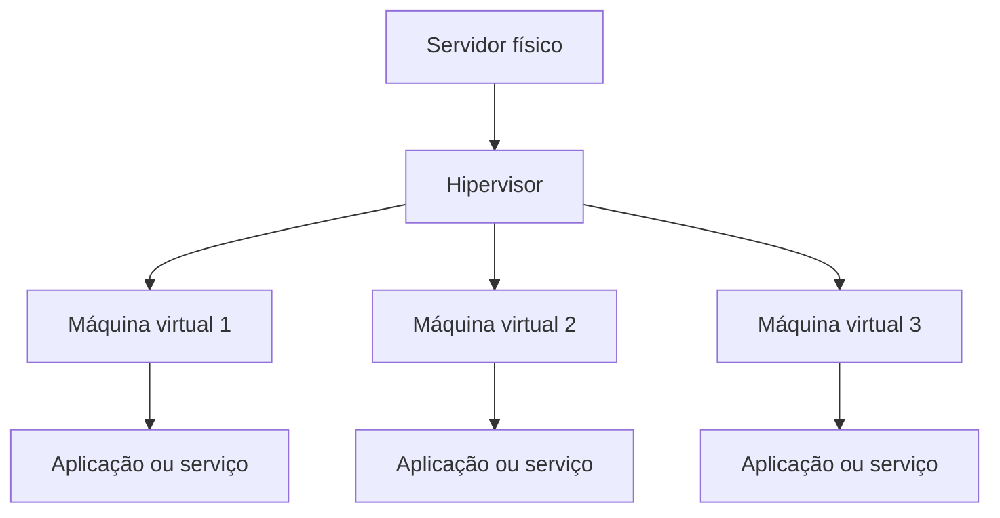
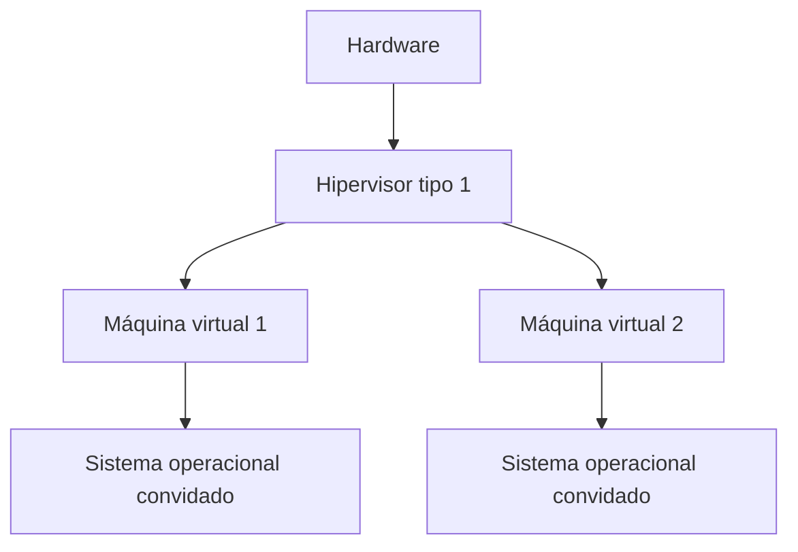
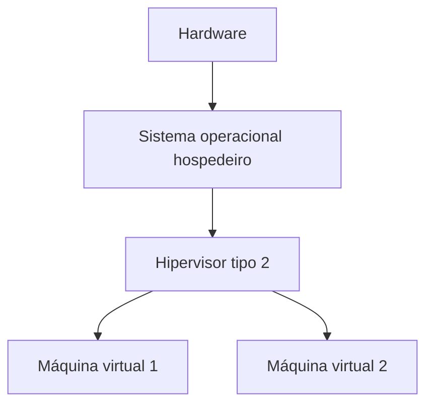
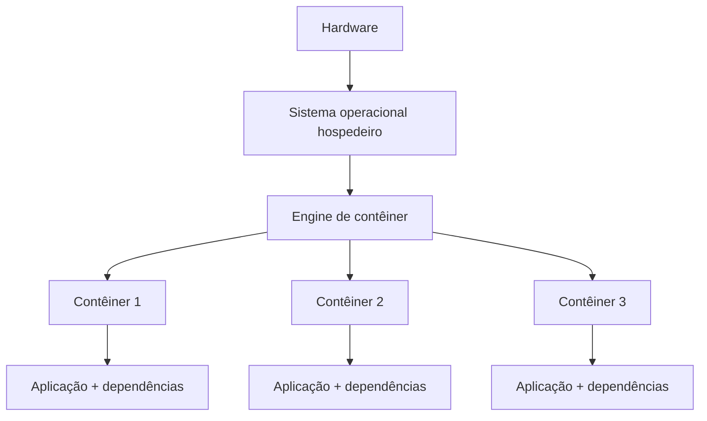
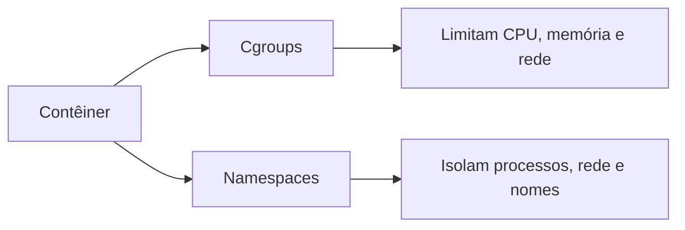
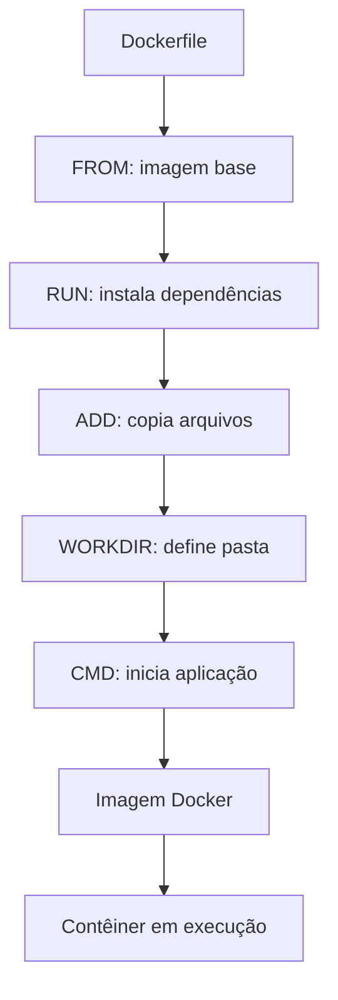
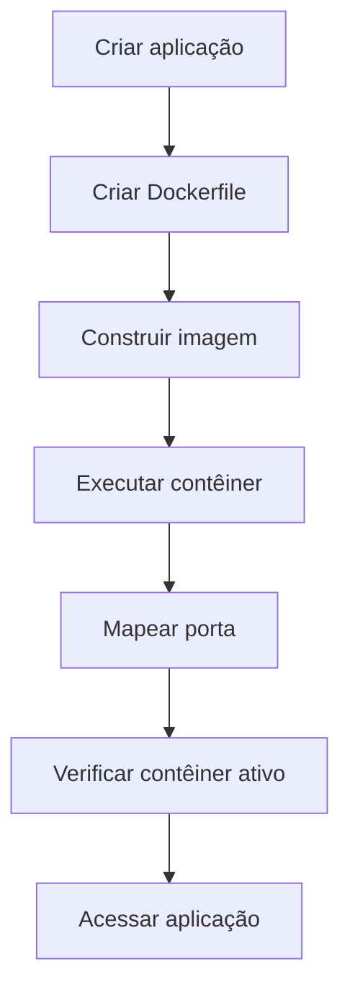
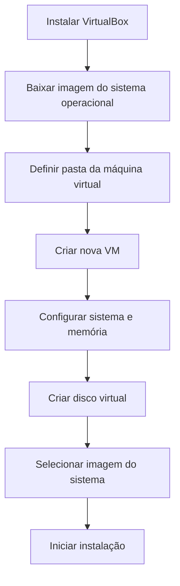
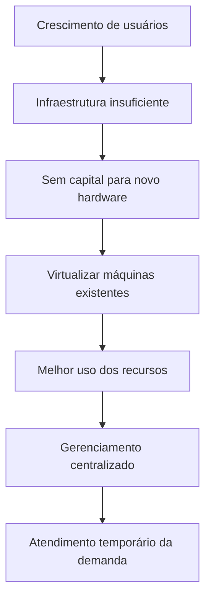
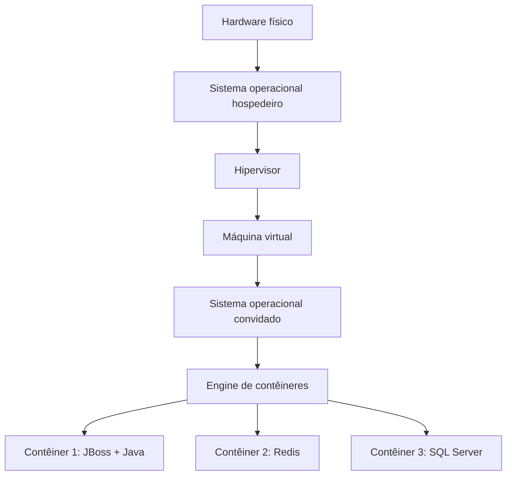

# Resumo 4.1 - Virtualização e containers para sistemas operacionais

## Objetivos da unidade

> [!info] Conceito
> A unidade estuda como máquinas virtuais e contêineres ajudam a administrar sistemas operacionais, servidores e aplicações com mais portabilidade, escalabilidade e facilidade de manutenção.

A virtualização e a conteinerização surgem como respostas a problemas comuns em ambientes computacionais: muitos servidores físicos, configurações repetidas, dificuldade de migração, expansão trabalhosa e custos elevados com _hardware_. Ambas as tecnologias permitem organizar melhor os recursos computacionais, mas fazem isso de formas diferentes. As máquinas virtuais criam computadores virtuais completos sobre uma máquina física, enquanto os contêineres empacotam aplicações com suas dependências para executá-las de forma isolada e mais leve.

> [!tip] Resumindo
> O objetivo central é entender quando usar máquinas virtuais, quando usar contêineres e como essas tecnologias podem ser combinadas.

---

## Contexto da virtualização

> [!info] Conceito
> Virtualizar significa criar uma camada de abstração entre os recursos físicos do computador e os sistemas que os utilizam.

Com o avanço dos sistemas computacionais, tornou-se comum a existência de muitos serviços disponíveis em rede. Administrar vários servidores diferentes, com _hardwares_ diferentes, serviços diferentes e muitos usuários simultâneos pode se tornar complexo e caro. A virtualização ajuda a centralizar servidores em uma infraestrutura menor, reduzindo a necessidade de várias máquinas físicas.

Historicamente, a necessidade de compartilhar tempo de processamento entre tarefas apareceu ainda nos sistemas multiprogramáveis e em lote. O uso de sistemas de tempo compartilhado abriu caminho para soluções que permitissem melhor aproveitamento dos recursos. Com o tempo, a virtualização evoluiu até soluções comerciais para arquiteturas x86, como o VMware.

Na prática, a virtualização faz com que um sistema ou aplicação tenha a sensação de estar executando em uma máquina real, mesmo que esteja dentro de uma máquina virtual. Isso é possível porque a tecnologia oferece um _hardware_ virtual, escondendo detalhes físicos da máquina real.

> [!tip] Resumindo
> A virtualização permite executar vários ambientes independentes sobre uma mesma máquina física, aumentando o aproveitamento dos recursos disponíveis.

---

## Máquinas virtuais

> [!info] Conceito
> Uma máquina virtual é um ambiente computacional completo criado sobre uma máquina física, capaz de virtualizar processador, memória, armazenamento e rede.

As máquinas virtuais permitem dividir uma máquina física em vários computadores virtuais. Cada máquina virtual pode ter seu próprio sistema operacional, suas aplicações, suas bibliotecas e suas configurações. Para a aplicação executada dentro da máquina virtual, o ambiente parece ser uma máquina real.

Essa tecnologia é útil porque permite consolidar vários servidores físicos em um único servidor hospedeiro. Em vez de manter uma máquina para cada serviço, como servidor de arquivos, impressão, e-mail, banco de dados ou servidor web, é possível executar vários desses serviços em máquinas virtuais diferentes dentro do mesmo _hardware_ físico.

O diagrama mostra a ideia básica da virtualização: um servidor físico executa um hipervisor, e o hipervisor gerencia várias máquinas virtuais independentes.

### Vantagens das máquinas virtuais

As máquinas virtuais ajudam a reduzir custos, simplificar instalações, aumentar a flexibilidade, melhorar o gerenciamento centralizado e facilitar a escalabilidade. Como cada máquina virtual fica isolada das demais, problemas em uma VM tendem a não afetar diretamente as outras. Esse isolamento também limita a propagação de ameaças dentro do servidor hospedeiro.

### Desvantagens das máquinas virtuais

Apesar das vantagens, máquinas virtuais costumam consumir muitos recursos. Elas podem ocupar bastante espaço em disco, utilizar muita memória RAM e apresentar desempenho inferior ao de uma execução direta sobre o _hardware_. Também pode haver dificuldade de acesso direto ao _hardware_ e acúmulo excessivo de máquinas virtuais quando não há boa administração.

> [!warning] Atenção
> Uma máquina virtual não é automaticamente mais segura em todos os cenários. A segurança depende do isolamento, da configuração e também da proteção do sistema hospedeiro e do hipervisor.

---

## Hipervisor

> [!info] Conceito
> O hipervisor, também chamado de monitor de máquina virtual, é a camada responsável por gerenciar as máquinas virtuais e controlar o acesso delas ao _hardware_.

Sem o hipervisor, várias máquinas virtuais tentariam controlar simultaneamente os mesmos recursos físicos, como processador, memória, armazenamento e rede. O hipervisor organiza esse acesso e faz a intermediação entre os sistemas operacionais convidados e o _hardware_ real.

Ele também pode executar ou simular instruções privilegiadas solicitadas pelo sistema operacional convidado. Isso é importante porque o sistema convidado não deve controlar diretamente o _hardware_ físico sem coordenação.

Existem dois tipos principais de hipervisores: **tipo 1** e **tipo 2**.

---

## Hipervisor do tipo 1

> [!info] Conceito
> O hipervisor do tipo 1 é executado diretamente sobre o _hardware_, sem depender de um sistema operacional hospedeiro abaixo dele.

O hipervisor do tipo 1 é considerado mais eficiente porque se comunica diretamente com os recursos físicos da máquina. Como não existe uma camada intermediária de sistema operacional hospedeiro entre ele e o _hardware_, há menos sobrecarga. Além disso, esse modelo tende a oferecer melhor isolamento, pois uma falha em uma máquina virtual pode ficar limitada a ela mesma.

> [!tip] Resumindo
> No tipo 1, a sequência é: _hardware_ → hipervisor → máquinas virtuais.

---

## Hipervisor do tipo 2

> [!info] Conceito
> O hipervisor do tipo 2 funciona como uma aplicação instalada sobre um sistema operacional hospedeiro.

No hipervisor do tipo 2, primeiro existe o _hardware_, depois o sistema operacional hospedeiro, depois o hipervisor e, por fim, as máquinas virtuais. Esse modelo costuma ser mais fácil de instalar, pois aproveita as configurações já feitas pelo sistema operacional hospedeiro, como rede e armazenamento.

Por outro lado, ele tende a ser menos eficiente que o tipo 1, porque as solicitações das máquinas virtuais passam pelo hipervisor e depois pelo sistema operacional hospedeiro antes de chegarem ao _hardware_. Também há um risco maior de indisponibilidade: se o sistema operacional hospedeiro precisar reiniciar ou falhar, as máquinas virtuais dependentes dele também podem ser afetadas.

> [!warning] Atenção
> No hipervisor tipo 2, uma falha ou reinicialização do sistema operacional hospedeiro pode afetar todas as máquinas virtuais em execução.

---

## Contêineres

> [!info] Conceito
> Um contêiner é um ambiente isolado que executa uma aplicação como processo do sistema operacional hospedeiro, reunindo o código, as configurações, as bibliotecas e as dependências necessárias.

Os contêineres representam uma forma de virtualização baseada no sistema operacional. Diferentemente das máquinas virtuais, eles não precisam de um sistema operacional completo próprio para cada aplicação. Em vez disso, compartilham o sistema operacional do hospedeiro e executam aplicações como processos isolados.

Essa característica torna os contêineres mais leves e rápidos. Eles geralmente são usados para empacotar funções específicas, como microsserviços, e podem ser transportados com facilidade entre ambientes diferentes, desde que exista uma engine de contêiner compatível.

O diagrama mostra que os contêineres compartilham o sistema operacional hospedeiro e são gerenciados por uma engine de contêiner, eliminando a necessidade de um sistema operacional completo para cada aplicação.

> [!tip] Resumindo
> Contêineres são mais leves que máquinas virtuais porque compartilham o sistema operacional do hospedeiro e isolam aplicações no nível de processo.

---

## Cgroups e namespaces

> [!info] Conceito
> Cgroups e namespaces são mecanismos do Linux que ajudam a limitar recursos e isolar ambientes de execução dos contêineres.

Os **cgroups**, ou grupos de controle, são mecanismos do kernel Linux usados para controlar a alocação de recursos. Com eles, o administrador pode limitar CPU, memória, rede e outros recursos disponíveis para cada contêiner. Isso impede que um contêiner consuma mais recursos do que deveria.

Os **namespaces** fornecem isolamento de recursos do kernel. Eles permitem que cada contêiner tenha a impressão de possuir seus próprios identificadores de processo, interfaces de rede, nomes de host e outros elementos. Assim, processos em contêineres diferentes podem coexistir sem conflito, mesmo quando usam identificadores semelhantes.

> [!tip] Resumindo
> Cgroups controlam quanto recurso o contêiner pode usar; namespaces controlam o que o contêiner consegue enxergar como ambiente próprio.

---

## Máquinas virtuais versus contêineres

> [!info] Conceito
> Máquinas virtuais e contêineres isolam ambientes de execução, mas diferem em peso, arquitetura, desempenho, segurança e velocidade de inicialização.

As máquinas virtuais virtualizam o _hardware_. Cada VM normalmente contém um sistema operacional completo, bibliotecas, dependências e aplicações. Por isso, são mais pesadas, ocupam mais espaço e tendem a iniciar mais lentamente. Em compensação, oferecem isolamento mais forte, pois cada ambiente é mais independente.

Os contêineres virtualizam o sistema operacional. Eles empacotam a aplicação e suas dependências, mas compartilham o kernel do hospedeiro. Por isso, são mais leves, iniciam mais rapidamente e são mais fáceis de transportar entre ambientes. Porém, seu isolamento ocorre no nível de processo, sendo geralmente considerado menos forte que o isolamento completo de uma máquina virtual.

| Critério | Máquinas virtuais | Contêineres |
|---|---|---|
| Tipo de virtualização | Nível de _hardware_ | Nível de sistema operacional |
| Peso | Mais pesadas | Mais leves |
| Tamanho comum | Gigabytes | Megabytes |
| Sistema operacional | Cada VM pode ter o seu | Compartilham o sistema operacional hospedeiro |
| Gerenciamento | Exigem hipervisor | Exigem engine de contêiner |
| Inicialização | Pode levar minutos | Pode levar milissegundos |
| Desempenho | Pode ser limitado pela virtualização | Mais próximo do desempenho nativo |
| Isolamento | Mais completo | No nível de processo |
| Portabilidade | Boa, mas com imagens maiores | Alta, com pacotes menores |

> [!warning] Atenção
> Contêiner não é o mesmo que máquina virtual. O contêiner não executa, em regra, um sistema operacional completo próprio; ele compartilha o sistema operacional do hospedeiro.

---

## Docker

> [!info] Conceito
> Docker é uma plataforma _open source_ usada para criar, administrar, empacotar e executar contêineres.

O Docker facilita a criação de ambientes isolados para aplicações. Ele foca na aplicação, e não na emulação completa do _hardware_. Por isso, reduz parte da complexidade existente em máquinas virtuais e melhora a portabilidade dos ambientes.

Com Docker, é possível criar uma imagem contendo a aplicação, suas configurações e dependências. Essa imagem pode ser transferida para outro host que tenha Docker instalado, permitindo executar a aplicação de forma semelhante em outro ambiente.

### Dockerfile

Um **Dockerfile** é um arquivo de definição que contém instruções para construir uma imagem Docker. Ele funciona como uma espécie de receita, descrevendo os passos necessários para preparar o ambiente da aplicação.

Alguns comandos importantes apresentados no material são:

- **FROM**: define a imagem base a partir da qual a nova imagem será criada;
- **RUN**: executa comandos durante a construção da imagem, como instalação de pacotes;
- **ADD**: adiciona arquivos locais ou arquivos vindos de uma URL para dentro da imagem;
- **WORKDIR**: define o diretório de trabalho dentro da imagem;
- **CMD**: define o comando executado quando um contêiner baseado naquela imagem for iniciado.

> [!tip] Resumindo
> O Dockerfile descreve como montar a imagem; a imagem serve de base para criar e executar contêineres.

---

## Criação e execução de imagem Docker

> [!info] Conceito
> O fluxo básico no Docker envolve criar uma aplicação, escrever um Dockerfile, construir uma imagem e executar um contêiner a partir dela.

A Dica do Professor apresenta um exemplo simples usando uma aplicação Flask. Primeiro, cria-se uma pasta para a aplicação e um arquivo com o código da aplicação. Depois, cria-se um Dockerfile com as instruções necessárias para montar a imagem. Em seguida, usa-se o comando de construção da imagem, como `docker build -t exemplo .`, em que o parâmetro `-t` adiciona uma _tag_ ou nome para a imagem, e o ponto indica que os arquivos estão na pasta atual.

Depois que a imagem é criada, ela pode ser executada com `docker run`. O parâmetro `-d` executa o contêiner em segundo plano, e o parâmetro `-p` mapeia uma porta do contêiner para uma porta acessível no hospedeiro. O comando `docker ps` permite visualizar os contêineres ativos.

> [!tip] Resumindo
> A imagem é construída uma vez e pode ser usada para criar contêineres em diferentes ambientes compatíveis.

---

## Instalação e uso básico do Docker no Linux

> [!info] Conceito
> Para usar contêineres no Linux, o material apresenta o Docker como ferramenta de criação e execução desses ambientes.

O processo apresentado começa pela atualização do sistema operacional com comandos como `sudo apt update` e `sudo apt upgrade`. Em seguida, são instalados pacotes necessários, como `curl`, `apt-transport-https`, `ca-certificates` e `software-properties-common`. Depois disso, adiciona-se o repositório do Docker ao sistema e instala-se o pacote `docker-ce`.

Após a instalação, o status do serviço pode ser verificado com `sudo systemctl status docker`. Com o Docker funcionando, é possível procurar imagens com `sudo docker search [palavra de busca]` e baixar imagens com `sudo docker pull [nome da imagem]`.

> [!warning] Atenção
> Os comandos de instalação dependem do sistema operacional e do repositório configurado. No material, o exemplo é voltado ao Linux com uso de `apt`.

---

## Kubernetes

> [!info] Conceito
> Kubernetes é um _framework_ de gerenciamento de contêineres usado para facilitar administração, escalabilidade e organização de aplicações conteinerizadas.

O Kubernetes aparece como uma tecnologia complementar aos contêineres. Enquanto o Docker é associado à criação e execução de contêineres, o Kubernetes é apresentado como uma ferramenta para gerenciar aplicações conteinerizadas em maior escala. Ele ajuda na administração e na escalabilidade de aplicações distribuídas em contêineres.

> [!tip] Resumindo
> Docker cria e executa contêineres; Kubernetes ajuda a gerenciar muitos contêineres em ambientes maiores.

---

## Configuração de máquinas virtuais com VirtualBox

> [!info] Conceito
> O VirtualBox é uma ferramenta que permite criar e configurar máquinas virtuais em diferentes sistemas operacionais.

O material apresenta o VirtualBox como exemplo de solução para criação de máquinas virtuais, ao lado de outras opções como VMware, RedHat KVM e Citrix XenServer. Para criar uma VM, é necessário baixar e instalar o VirtualBox, obter previamente a imagem do sistema operacional que será instalado e configurar os recursos da máquina virtual.

O processo envolve escolher a pasta padrão onde os arquivos da VM serão salvos, definir nome, tipo e versão do sistema operacional, escolher a quantidade de memória RAM, criar um disco rígido virtual, selecionar o formato VDI e decidir entre disco de tamanho fixo ou dinâmico. Por fim, a imagem do sistema operacional é vinculada ao armazenamento da VM, e a instalação do sistema é iniciada.

> [!warning] Atenção
> Máquinas virtuais podem ocupar muito espaço. Se forem salvas no disco do sistema hospedeiro sem planejamento, podem prejudicar o funcionamento do próprio hospedeiro.

---

## Aplicações práticas da virtualização

> [!info] Conceito
> A virtualização é útil quando uma empresa precisa aproveitar melhor recursos físicos existentes sem adquirir imediatamente novos servidores.

No caso prático da empresa Data Storage, a infraestrutura foi planejada para atender 2.000 pessoas, mas a aceitação do serviço cresceu e novos clientes começaram a surgir. Como não havia capital imediato para comprar mais _hardware_, a equipe de infraestrutura buscou uma solução de contorno.

A virtualização das máquinas existentes foi escolhida porque permitiria usar melhor os recursos computacionais, reduzir ociosidade, centralizar o gerenciamento e manter novos clientes temporariamente até a compra de novos recursos físicos.

> [!tip] Resumindo
> A virtualização pode funcionar como estratégia para ganhar eficiência e tempo enquanto a empresa planeja ampliar sua infraestrutura física.

---

## Arquitetura híbrida com máquinas virtuais e contêineres

> [!info] Conceito
> Uma arquitetura híbrida combina máquinas virtuais e contêineres para obter isolamento, segurança, rapidez e portabilidade.

O desafio apresenta uma situação em que a empresa já utiliza servidores para aplicação e banco de dados, mas precisa escalar o sistema e migrar para um servidor mais robusto. A solução proposta combina virtualização e conteinerização.

A arquitetura geral consiste em uma máquina virtual que executa vários contêineres. A camada física começa pelo _hardware_, passa pelo sistema operacional hospedeiro, pelo hipervisor e chega à máquina virtual. Dentro da máquina virtual, existe um sistema operacional convidado, uma engine de contêineres e, acima dela, os contêineres com os serviços da aplicação.

Essa arquitetura une benefícios das duas abordagens. A máquina virtual fornece isolamento em relação à infraestrutura física, enquanto os contêineres separam os serviços da aplicação, facilitando manutenção, portabilidade e escalabilidade.

> [!tip] Resumindo
> A arquitetura híbrida pode ser representada como: _hardware_ → sistema operacional hospedeiro → hipervisor → máquina virtual → sistema operacional convidado → engine de contêineres → contêineres.

---

## Casos de uso dos contêineres

> [!info] Conceito
> Contêineres são indicados para aplicações que precisam de portabilidade, implantação rápida e isolamento leve.

O material destaca alguns usos comuns de contêineres, como microsserviços, processamento em lotes, aplicativos híbridos, _machine learning_, plataforma como serviço e migração de aplicações em nuvem.

Esses casos combinam bem com contêineres porque normalmente exigem ambientes reproduzíveis, implantação ágil e facilidade para mover aplicações entre diferentes servidores ou ambientes.

> [!tip] Resumindo
> Contêineres são úteis quando a aplicação precisa ser empacotada com suas dependências e executada de forma previsível em diferentes ambientes.

---

## Pontos importantes para exercícios e revisão

> [!warning] Atenção
> Alguns erros comuns aparecem quando se confunde máquina virtual com contêiner ou quando se atribui ao hipervisor funções que ele não garante sozinho.

Uma desvantagem importante da virtualização é que vulnerabilidades ou falhas no sistema hospedeiro podem comprometer as máquinas virtuais que dependem dele. Em caso de migração, o sistema operacional da máquina virtual não é necessariamente perdido, pois ele fica encapsulado na imagem da VM.

Também é importante lembrar que existem hipervisores do tipo 1 e do tipo 2. O tipo 1 fica entre o _hardware_ e as máquinas virtuais. O tipo 2 depende de um sistema operacional hospedeiro. O hipervisor é o próprio monitor de máquina virtual, não uma camada separada abaixo dele.

Sobre Docker, a principal motivação de uso é a portabilidade dos contêineres. É possível criar uma imagem com a aplicação, configurações e dependências, e executá-la em outro host que tenha Docker instalado. Docker não é um gerenciador de máquinas virtuais e não usa hipervisor para virtualizar _hardware_ como uma VM tradicional.

O hipervisor fica disponível quando a máquina hospedeira está ativa e é responsável por controlar ou simular instruções privilegiadas solicitadas pelo sistema operacional convidado. Porém, ele não garante automaticamente que uma máquina virtual seja mais segura que uma máquina física.

> [!tip] Resumindo
> Para revisar: VM virtualiza _hardware_; contêiner virtualiza no nível do sistema operacional; hipervisor gerencia VMs; engine de contêiner gerencia contêineres; Docker favorece portabilidade.

---

## Síntese final

> [!summary] Síntese
> Máquinas virtuais e contêineres são soluções para melhorar a administração, a portabilidade, a escalabilidade e o aproveitamento dos recursos computacionais.

A virtualização permite criar máquinas virtuais completas sobre uma infraestrutura física. Ela é indicada quando se deseja maior isolamento, execução de sistemas operacionais distintos e consolidação de servidores. Seu principal componente é o hipervisor, que pode ser do tipo 1, executado diretamente sobre o _hardware_, ou do tipo 2, executado sobre um sistema operacional hospedeiro.

Os contêineres são ambientes mais leves, voltados ao empacotamento de aplicações com suas dependências. Eles compartilham o sistema operacional hospedeiro e são isolados por mecanismos como cgroups e namespaces. Por isso, tendem a iniciar mais rapidamente, ocupar menos espaço e facilitar a portabilidade.

Docker é a ferramenta apresentada para criação e execução de contêineres, enquanto Kubernetes aparece como ferramenta de gerenciamento e escalabilidade de aplicações conteinerizadas. Em projetos reais, máquinas virtuais e contêineres podem ser usados separadamente ou em conjunto, formando arquiteturas híbridas que combinam isolamento, organização, rapidez e portabilidade.

