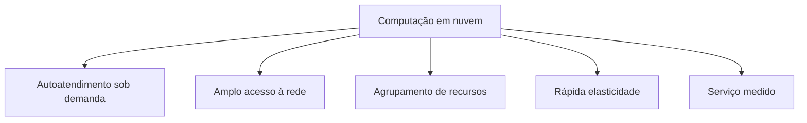
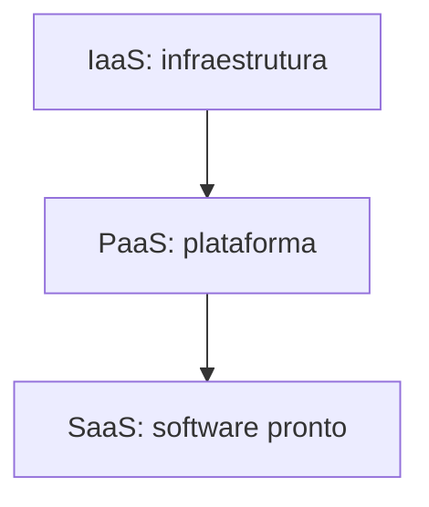
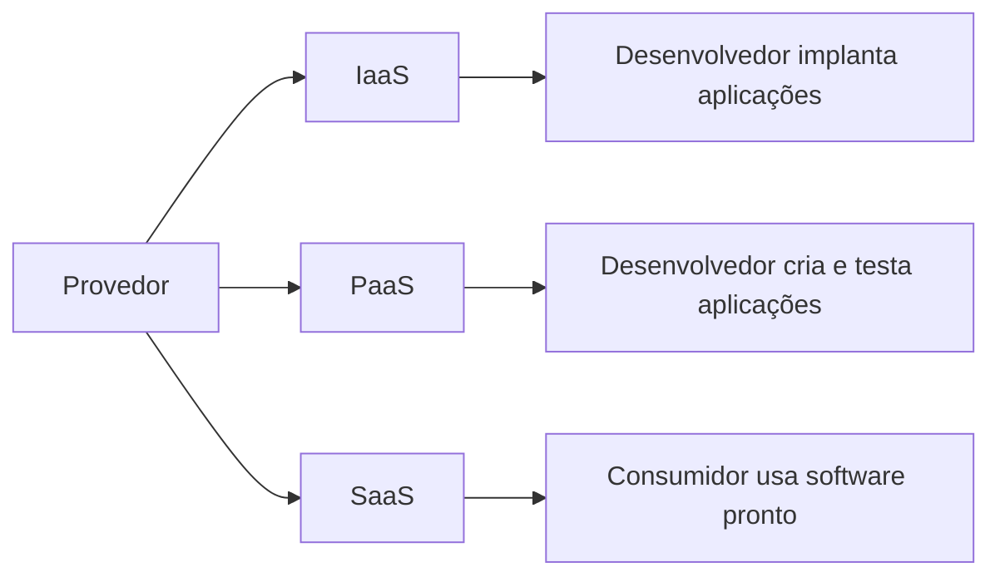
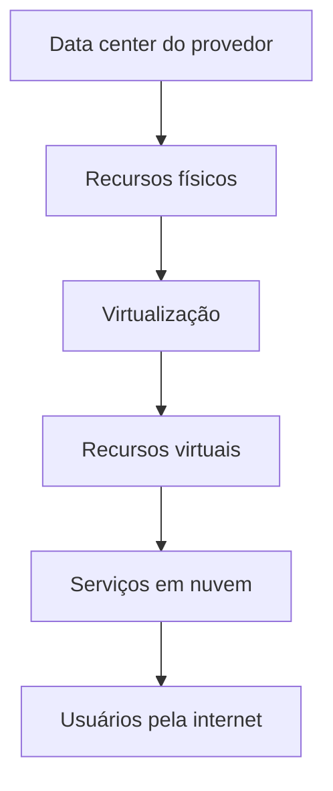
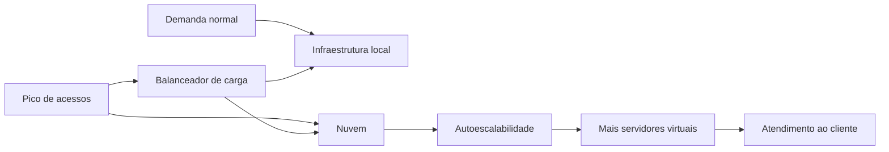
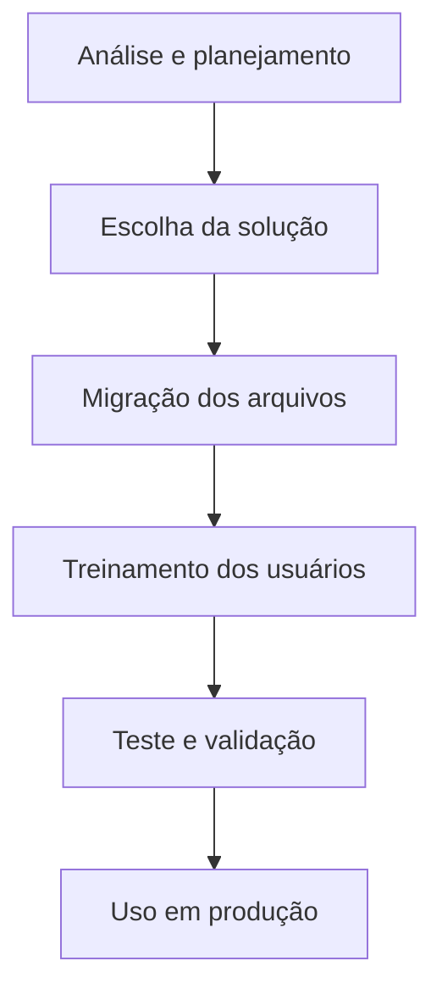

# Resumo 4.2 - Fundamentos de computação em nuvem

## 1. Visão geral da computação em nuvem

> [!info] Conceito
> Computação em nuvem é o fornecimento de recursos de TI pela internet, com uso flexível, escalável e geralmente pago conforme o consumo.

A computação em nuvem representa uma mudança importante na forma como empresas e usuários acessam recursos tecnológicos. Em vez de depender exclusivamente de servidores físicos, sistemas locais de armazenamento e equipes dedicadas à manutenção de _data centers_, a organização pode contratar recursos computacionais fornecidos por provedores especializados.

Esses recursos incluem servidores, armazenamento, bancos de dados, redes, plataformas e aplicações. A principal ideia é que a infraestrutura deixa de ser comprada como um conjunto fixo de equipamentos e passa a ser consumida como serviço, de acordo com a necessidade.

> [!tip] Resumindo
> A nuvem transforma infraestrutura de TI em serviço: o usuário acessa recursos pela internet, amplia ou reduz conforme a demanda e paga pelo uso.

---

## 2. Evolução e fundamentos da nuvem

> [!info] Conceito
> A computação em nuvem deriva da ideia de computação como utilidade, semelhante ao fornecimento de energia ou telefone.

O material apresenta a computação em nuvem como uma evolução do conceito de computação de utilidade. A ideia central é que recursos computacionais possam ser oferecidos sob demanda, como um serviço acessível pela rede.

Antes da nuvem, uma empresa precisava comprar equipamentos, instalar servidores, adquirir licenças, manter espaço físico, energia, refrigeração e equipes de suporte. Com a nuvem, parte dessas responsabilidades passa para o provedor, permitindo que a empresa concentre seus esforços no uso dos sistemas e não na manutenção da infraestrutura física.

A nuvem também está muito presente no cotidiano. Serviços de e-mail, armazenamento on-line, redes sociais, plataformas de vídeo e aplicações corporativas baseadas na web são exemplos de uso de recursos em nuvem.

---

## 3. Computação em nuvem como serviço e como plataforma

> [!info] Conceito
> Na nuvem, infraestrutura, plataformas, bancos de dados e softwares podem ser oferecidos como serviços.

A computação em nuvem pode ser entendida como um modelo em que praticamente tudo pode ser oferecido como serviço. Essa lógica é chamada de **XaaS**, ou seja, “tudo como serviço”. A letra “X” pode representar diferentes recursos, como infraestrutura, plataforma ou software.

A nuvem também pode ser vista como uma plataforma, pois a internet se torna o ambiente por meio do qual aplicações são executadas, acessadas e entregues aos usuários. Programas que antes dependiam de instalação local passaram a funcionar pela web, permitindo acesso remoto e uso em diferentes dispositivos.

> [!tip] Resumindo
> A nuvem não é apenas armazenamento remoto. Ela pode fornecer infraestrutura, ambiente de desenvolvimento, aplicações prontas e serviços completos pela internet.

---

## 4. Características essenciais da computação em nuvem

> [!info] Conceito
> Para ser considerada uma implementação real de nuvem, a solução deve apresentar características como autoatendimento, acesso amplo à rede, agrupamento de recursos, elasticidade e serviço medido.

O modelo apresentado no material destaca cinco características essenciais da computação em nuvem. Elas explicam por que a nuvem é mais flexível do que a infraestrutura tradicional.

O diagrama mostra as cinco características centrais que sustentam a computação em nuvem.

### 4.1 Autoatendimento sob demanda

O autoatendimento sob demanda permite que o usuário solicite recursos computacionais, como armazenamento ou processamento, sem precisar de intervenção manual do provedor a cada solicitação. Em vez de esperar dias ou semanas por uma liberação de infraestrutura, o usuário pode contratar ou ajustar recursos por meio de interfaces automatizadas.

### 4.2 Amplo acesso à rede

Os serviços em nuvem são acessados pela rede, normalmente pela internet. Isso permite que usuários utilizem aplicações e dados a partir de diferentes dispositivos, como computadores, celulares, tablets e notebooks.

> [!warning] Atenção
> O acesso pela internet é uma vantagem, mas também cria dependência da qualidade da conexão. Se a largura de banda for baixa, aplicações em nuvem podem apresentar lentidão.

### 4.3 Agrupamento de recursos

No agrupamento de recursos, o provedor utiliza uma infraestrutura compartilhada para atender vários consumidores. Os recursos físicos e virtuais são atribuídos e redistribuídos conforme a demanda.

O usuário normalmente não sabe exatamente em qual servidor físico seus dados ou aplicações estão, mas pode ter algum nível de escolha mais geral, como região, país ou _data center_.

### 4.4 Rápida elasticidade

A rápida elasticidade permite que os recursos sejam ampliados ou reduzidos rapidamente. Isso é essencial em situações de pico, como promoções, datas comemorativas ou aumento repentino de acessos.

Quando a demanda cresce, mais recursos podem ser provisionados. Quando a demanda cai, eles podem ser liberados, evitando desperdício.

### 4.5 Serviço medido

O serviço medido permite monitorar, controlar e relatar o uso dos recursos. Essa característica viabiliza o modelo de cobrança conforme o consumo.

Métricas como processamento, memória, armazenamento, largura de banda e uso de aplicações podem ser acompanhadas pelo provedor e pelo consumidor.

> [!tip] Resumindo
> A nuvem combina automação, acesso remoto, compartilhamento de infraestrutura, elasticidade e medição de consumo para oferecer recursos de TI de forma flexível.

---

## 5. Modelos de serviço: SaaS, PaaS e IaaS

> [!info] Conceito
> Os modelos de serviço definem o que o provedor entrega e qual nível de controle fica com o consumidor.

A computação em nuvem é organizada em três modelos principais de serviço: **SaaS**, **PaaS** e **IaaS**. Cada um oferece um nível diferente de abstração e responsabilidade.

O diagrama representa a relação entre os modelos: o IaaS fornece a base de infraestrutura, o PaaS usa essa base para oferecer ambiente de desenvolvimento e o SaaS entrega aplicações prontas ao usuário final.

| Modelo | O que oferece | Público principal | Controle do consumidor |
|---|---|---|---|
| **SaaS** | Software pronto acessado pela web | Usuário final | Baixo controle técnico |
| **PaaS** | Plataforma para criar, testar e implantar aplicações | Desenvolvedor | Controle sobre aplicações e configurações do ambiente |
| **IaaS** | Servidores virtuais, armazenamento, rede e infraestrutura | Arquiteto ou equipe de TI | Controle sobre sistema operacional, aplicações e parte da configuração |

### SaaS — Software como Serviço

No SaaS, o usuário utiliza uma aplicação pronta, normalmente acessada por navegador ou interface web. O consumidor não gerencia servidores, sistemas operacionais, armazenamento ou infraestrutura física.

Esse modelo é adequado quando a organização precisa usar um software já pronto, com pouca preocupação técnica sobre a infraestrutura.

### PaaS — Plataforma como Serviço

No PaaS, o provedor oferece um ambiente para desenvolvimento, teste e implantação de aplicações. O desenvolvedor não precisa gerenciar servidores físicos, sistema operacional ou infraestrutura básica.

Esse modelo é indicado para equipes que querem criar aplicações com mais agilidade, concentrando-se no código e nas funcionalidades.

### IaaS — Infraestrutura como Serviço

No IaaS, o consumidor contrata recursos fundamentais de infraestrutura, como processamento, armazenamento, redes e servidores virtuais. O provedor gerencia a infraestrutura física, mas o consumidor mantém controle sobre sistemas operacionais, aplicações e configurações.

Esse modelo é útil para empresas que precisam de flexibilidade e escalabilidade, mas ainda desejam manter maior controle técnico sobre o ambiente.

> [!warning] Atenção
> Quanto mais próximo do SaaS, maior é a responsabilidade do provedor. Quanto mais próximo do IaaS, maior é o controle técnico do consumidor, mas também maior sua responsabilidade de configuração e administração.

---

## 6. Modelos de implantação da nuvem

> [!info] Conceito
> Os modelos de implantação definem quem utiliza a nuvem e como sua infraestrutura é disponibilizada.

Além dos modelos de serviço, a computação em nuvem possui diferentes modelos de implantação: privada, comunitária, pública e híbrida.

| Modelo | Característica principal | Uso típico |
|---|---|---|
| **Nuvem privada** | Uso exclusivo de uma organização | Empresas que precisam de maior controle |
| **Nuvem comunitária** | Uso por organizações com interesses comuns | Grupos com requisitos semelhantes de segurança, missão ou conformidade |
| **Nuvem pública** | Uso aberto ao público em geral | Serviços amplamente disponíveis pela internet |
| **Nuvem híbrida** | Combinação de duas ou mais nuvens | Integração entre infraestrutura local, privada e pública |

A nuvem híbrida é especialmente importante em cenários empresariais, pois permite manter sistemas locais ou privados e, ao mesmo tempo, usar recursos de nuvem pública para escalar serviços quando necessário.

> [!tip] Resumindo
> A escolha do modelo de implantação depende das necessidades de controle, segurança, custo, flexibilidade e integração da organização.

---

## 7. Atores e responsabilidades na computação em nuvem

> [!info] Conceito
> A computação em nuvem envolve provedores, consumidores e desenvolvedores, cada um com responsabilidades específicas.

O material destaca que a adoção da nuvem exige clareza sobre os papéis de cada ator envolvido. Essa definição evita falhas de manutenção, lacunas de segurança e confusão sobre quem deve gerenciar cada parte do ambiente.

| Ator | Papel principal |
|---|---|
| **Provedor** | Fornece infraestrutura, plataforma ou software |
| **Consumidor** | Usa os serviços contratados |
| **Desenvolvedor** | Cria, adapta, testa ou implanta aplicações usando recursos da nuvem |

Nos modelos de serviço, as responsabilidades variam. No IaaS, o provedor cuida da infraestrutura física, mas o consumidor ou desenvolvedor administra sistemas e aplicações. No PaaS, o provedor entrega a plataforma, e o desenvolvedor foca na criação das aplicações. No SaaS, o provedor entrega o software pronto, e o consumidor apenas utiliza a aplicação.

O diagrama resume como os modelos de serviço se relacionam com os principais atores da nuvem.

> [!tip] Resumindo
> Entender os papéis de provedor, consumidor e desenvolvedor é essencial para definir responsabilidades técnicas, operacionais e de segurança.

---

## 8. Relação da nuvem com _data centers_, redes, armazenamento e virtualização

> [!info] Conceito
> A nuvem depende de grandes _data centers_, redes de comunicação, armazenamento remoto e virtualização para entregar recursos sob demanda.

A computação em nuvem não elimina a infraestrutura física. Ela transfere essa infraestrutura para grandes _data centers_ operados por provedores. Esses _data centers_ concentram servidores, armazenamento, equipamentos de rede e sistemas de segurança necessários para manter os serviços disponíveis.

A rede tem papel fundamental, pois é por meio dela que os usuários acessam os serviços. Sem conectividade, o acesso à nuvem fica comprometido.

O armazenamento em nuvem permite que dados deixem de depender apenas de discos locais. Arquivos, bancos de dados e aplicações podem ser armazenados em servidores do provedor e acessados remotamente.

A virtualização é uma das bases da computação em nuvem. Ela cria uma camada de abstração sobre os recursos físicos, permitindo que vários usuários utilizem a mesma infraestrutura de forma isolada e flexível.

O diagrama mostra que a nuvem depende de infraestrutura física, mas entrega ao usuário recursos virtualizados acessados pela rede.

> [!tip] Resumindo
> A nuvem combina infraestrutura física centralizada, virtualização e acesso remoto para entregar recursos flexíveis aos usuários.

---

## 9. Benefícios da computação em nuvem

> [!info] Conceito
> Os benefícios da nuvem estão ligados à redução de custos, flexibilidade, escalabilidade, disponibilidade e menor necessidade de gerenciar infraestrutura física.

A computação em nuvem oferece diversos benefícios para empresas e usuários. Um dos principais é a redução de investimentos iniciais, pois a organização não precisa comprar toda a infraestrutura antecipadamente.

Outro benefício é a escalabilidade. A empresa pode aumentar recursos em momentos de alta demanda e reduzi-los quando a demanda diminui. Isso evita manter servidores ociosos durante longos períodos.

A nuvem também melhora a acessibilidade, pois os dados e sistemas podem ser acessados de diferentes locais, desde que haja conexão com a internet.

Entre os principais benefícios apresentados no material, destacam-se:

- acesso a arquivos e sistemas de qualquer lugar;
- pagamento conforme o uso;
- redução de custos com infraestrutura própria;
- menor responsabilidade sobre manutenção física;
- rápida implantação de recursos;
- atualizações automáticas em aplicações fornecidas como serviço;
- maior disponibilidade;
- apoio a estratégias de backup e recuperação;
- redução de consumo de energia e equipamentos próprios.

> [!tip] Resumindo
> A nuvem permite que a empresa seja mais ágil, reduza desperdícios e use recursos tecnológicos de acordo com sua necessidade real.

---

## 10. Desafios e cuidados na adoção da nuvem

> [!warning] Atenção
> A nuvem oferece muitos benefícios, mas também exige atenção a segurança, dependência da internet, custos, portabilidade e conformidade legal.

Apesar das vantagens, a computação em nuvem apresenta desafios importantes. Um deles é a dependência da internet. Se a conexão falhar, os serviços e dados podem ficar inacessíveis.

Outro desafio é a segurança. Como os dados ficam em infraestrutura de terceiros, é necessário avaliar os controles adotados pelo provedor, as políticas de privacidade, os mecanismos de isolamento e as garantias contratuais.

Também existe risco de baixa portabilidade entre provedores. Aplicações criadas para uma nuvem específica podem ser difíceis de migrar para outra plataforma, gerando dependência tecnológica.

A interoperabilidade também pode ser um problema quando aplicações de fornecedores diferentes precisam trabalhar juntas, mas utilizam padrões incompatíveis.

Além disso, a localização dos _data centers_ pode gerar questões legais e de conformidade, principalmente quando dados são armazenados em outros países ou regiões.

### SLA — Acordo de Nível de Serviço

O SLA é um contrato que define os níveis de serviço esperados entre provedor e cliente. Ele pode incluir parâmetros como disponibilidade, tempo de resposta, taxa de transferência, tempo de inatividade e penalidades em caso de descumprimento.

> [!warning] Atenção
> Antes de contratar serviços em nuvem, é importante analisar cuidadosamente o SLA para evitar expectativas irreais sobre disponibilidade, desempenho e suporte.

---

## 11. Comparação entre _Grid Computing_ e _Cloud Computing_

> [!info] Conceito
> _Grid_ e nuvem usam recursos distribuídos, mas diferem na forma de gerenciar, escalar, proteger e disponibilizar esses recursos.

O _grid computing_ é formado por recursos computacionais e de comunicação distribuídos que trabalham em conjunto para executar aplicações. Para o usuário, o _grid_ pode parecer uma entidade única, mesmo sendo composto por diferentes recursos.

A computação em nuvem também usa recursos distribuídos, mas com foco maior em serviços sob demanda, elasticidade, isolamento e facilidade de uso.

| Aspecto | _Grid Computing_ | _Cloud Computing_ |
|---|---|---|
| Gestão | Mais descentralizada e colaborativa | Mais centralizada pelo provedor |
| Alocação de recursos | Compartilhamento colaborativo | Alocação sob demanda |
| Virtualização | Mais ligada a dados e computação | Abrange hardware, software e ambientes isolados |
| Segurança | Delegação de credenciais | Isolamento entre usuários |
| Escalabilidade | Crescimento por nós e locais de processamento | Crescimento dinâmico por recursos, nós, locais e hardware |
| Usabilidade | Mais difícil de gerenciar | Mais fácil para o usuário final |
| Pagamento | Mais rígido | Mais flexível |
| Aplicações | Mais dependentes do ambiente do _grid_ | Ambiente pode ser ajustado à aplicação |

> [!warning] Atenção
> Embora pareçam semelhantes, _grid_ e nuvem não são a mesma coisa. O _grid_ enfatiza colaboração entre recursos distribuídos; a nuvem enfatiza serviços flexíveis, isolados e sob demanda.

> [!tip] Resumindo
> O _grid_ é mais colaborativo e descentralizado. A nuvem é mais elástica, automatizada, orientada a serviço e mais simples para o usuário consumir.

---

## 12. Aplicação prática: empresa X Varejo

> [!info] Conceito
> Empresas com picos sazonais de acesso precisam de infraestrutura capaz de crescer em períodos de alta demanda e reduzir custos em períodos de baixa atividade.

O caso da empresa X Varejo mostra um problema comum em ambientes de _e-commerce_. A empresa possui _data center_ local e utiliza virtualização, mas enfrenta altos custos de manutenção e dificuldade para escalar rapidamente durante períodos de maior demanda.

A recomendação apresentada no material é adotar uma estratégia híbrida, mantendo parte da infraestrutura local para cargas previsíveis e migrando serviços variáveis ou críticos para a nuvem.

Entre as medidas recomendadas estão:

- uso de autoescalabilidade;
- balanceamento de carga;
- migração de aplicações de maior demanda para a nuvem;
- pagamento conforme o uso;
- monitoramento contínuo;
- backup e recuperação em nuvem;
- uso de cache e CDN;
- migração gradual para reduzir riscos.

O diagrama representa a ideia de uma arquitetura híbrida: a infraestrutura local atende cargas estáveis, enquanto a nuvem absorve os picos de acesso.

### Modelo mais adequado para a X Varejo

O modelo mais indicado inicialmente é o **IaaS**, pois permite contratar infraestrutura virtual, como servidores, armazenamento e redes, sem comprar novos equipamentos físicos.

Esse modelo é adequado porque a empresa já possui experiência com servidores e virtualização. Assim, ela mantém controle sobre sistemas operacionais e aplicações, mas reduz a dependência de infraestrutura física própria.

> [!tip] Resumindo
> Para a X Varejo, o IaaS em uma estratégia híbrida equilibra controle técnico, escalabilidade e redução de custos operacionais.

---

## 13. Aplicação prática: migração de _file server_ para a nuvem

> [!info] Conceito
> A migração de um servidor de arquivos local para a nuvem pode melhorar armazenamento, acesso remoto, segurança e gerenciamento de permissões.

O caso da ABC Marketing apresenta uma empresa que utilizava um _file server_ local defasado para armazenar propostas, apresentações e informações sensíveis de clientes. Com o crescimento da empresa e a abertura de novas filiais, o servidor passou a apresentar limitações.

Os principais problemas identificados foram:

- capacidade insuficiente de armazenamento;
- dificuldade de acesso remoto;
- alto custo de manutenção;
- risco de perda de dados;
- dificuldade de integração entre filiais.

A solução adotada foi migrar o _file server_ para o Office 365, utilizando o SharePoint como ferramenta de armazenamento e compartilhamento de arquivos.

O diagrama resume as etapas da migração do servidor local para uma solução em nuvem.

Com a migração, a empresa obteve maior capacidade de armazenamento, acesso global aos arquivos, redução de custos, melhoria na segurança e gerenciamento centralizado de permissões com integração ao Active Directory.

> [!tip] Resumindo
> A substituição do _file server_ local por uma solução em nuvem remove gargalos de armazenamento e facilita o crescimento da empresa.

---

## 14. Pontos reforçados pelos exercícios

> [!info] Conceito
> Os exercícios reforçam as características essenciais da nuvem e a escolha adequada dos modelos de serviço.

Os exercícios do material reforçam que uma das principais características da computação em nuvem é a capacidade de fornecer recursos sob demanda e escalá-los conforme a necessidade do usuário.

Também destacam que o consumidor não gerencia diretamente a infraestrutura física da nuvem. Essa responsabilidade fica com o provedor, enquanto o consumidor administra apenas os elementos permitidos pelo modelo contratado.

Outro ponto importante é o serviço medido. Na nuvem, os recursos podem ser monitorados, controlados e reportados, permitindo transparência para consumidor e provedor e favorecendo a cobrança proporcional ao uso.

Os exercícios também reforçam a diferença entre os modelos. No IaaS, o consumidor controla sistemas operacionais e aplicações, mas não a infraestrutura física. No SaaS, o consumidor usa um software pronto, sem gerenciar hardware ou sistema operacional. Já o PaaS é mais voltado ao desenvolvimento e implantação de aplicações.

> [!tip] Resumindo
> A nuvem se destaca por escalabilidade, pagamento conforme o uso, menor gestão de infraestrutura física e diferentes níveis de controle conforme o modelo adotado.

---

## 15. Síntese final

> [!summary] Síntese
> A computação em nuvem permite consumir recursos de TI pela internet de forma flexível, escalável e mensurável, reduzindo a dependência de infraestrutura física própria.

A computação em nuvem muda a lógica tradicional da infraestrutura de TI. Em vez de comprar e manter servidores próprios para todas as necessidades, empresas e usuários podem acessar recursos computacionais pela internet, contratando apenas o que precisam e ajustando a capacidade conforme a demanda.

Suas principais características são autoatendimento sob demanda, amplo acesso à rede, agrupamento de recursos, rápida elasticidade e serviço medido. Esses elementos tornam possível ampliar recursos em períodos de pico e reduzi-los em períodos de baixa utilização.

Os modelos SaaS, PaaS e IaaS oferecem diferentes níveis de controle e responsabilidade. O SaaS entrega software pronto, o PaaS entrega plataforma para desenvolvimento e o IaaS entrega infraestrutura virtualizada.

A nuvem depende de _data centers_, redes, armazenamento remoto e virtualização. Esses elementos permitem que recursos físicos sejam transformados em serviços acessíveis, escaláveis e compartilhados com segurança.

Apesar dos benefícios, a adoção da nuvem exige atenção a segurança, dependência da internet, SLA, custos, portabilidade, interoperabilidade e conformidade legal. Por isso, a escolha do modelo de serviço e do modelo de implantação deve considerar as necessidades reais da organização.

Em cenários como o da X Varejo, o IaaS em arquitetura híbrida permite lidar melhor com picos de demanda e reduzir custos. No caso da ABC Marketing, a migração de um _file server_ local para uma solução como SharePoint mostra como a nuvem pode melhorar armazenamento, colaboração, segurança e acesso remoto.

> [!summary] Ideia central
> A computação em nuvem não é apenas uma tecnologia de armazenamento remoto, mas um modelo completo de fornecimento de infraestrutura, plataformas e softwares como serviços flexíveis, escaláveis e orientados ao consumo real.