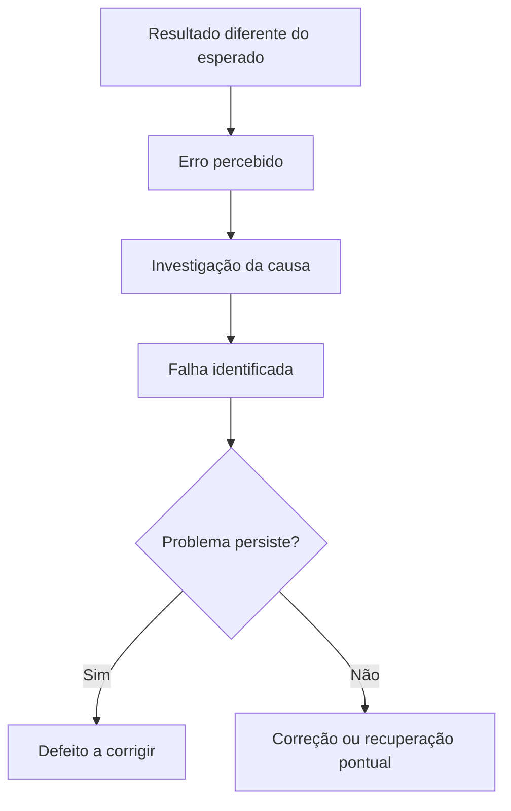
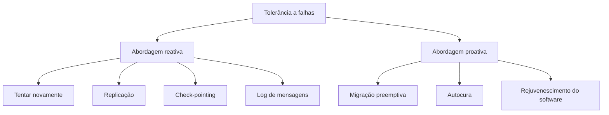
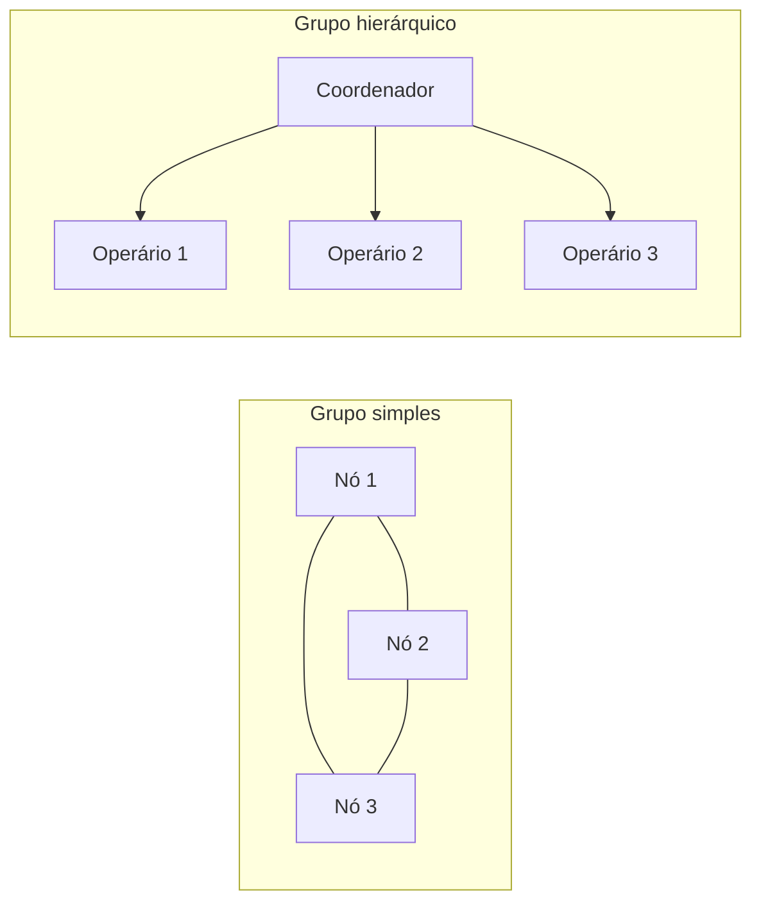
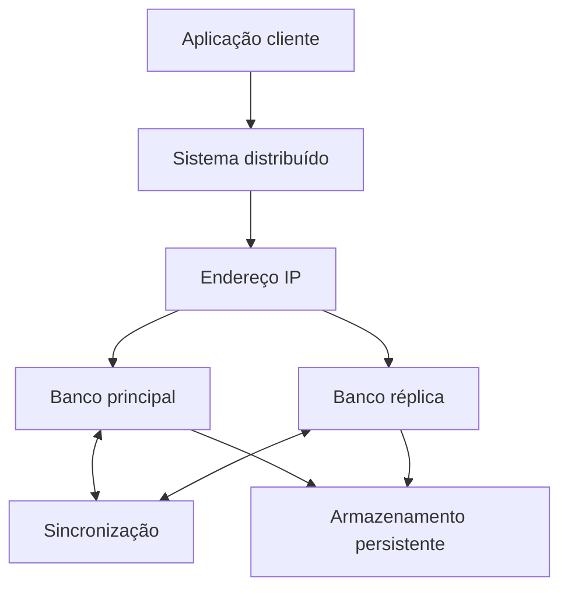
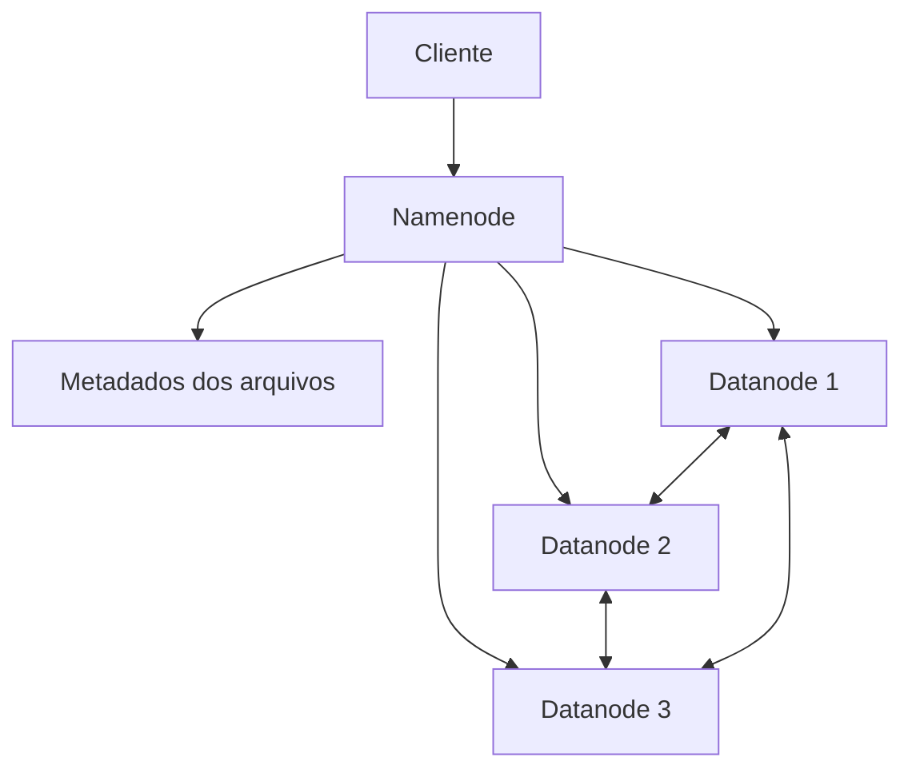
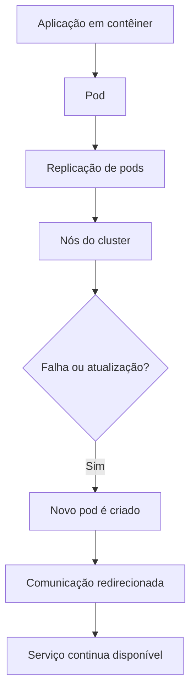
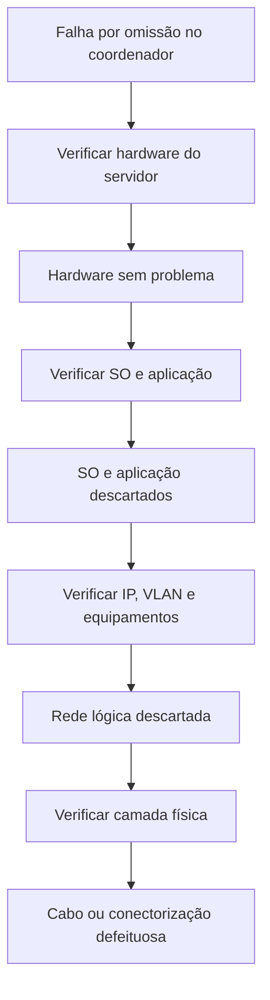

# Resumo 4.3 - Tolerância a falhas em sistemas distribuídos

> [!info] Conceito
> Tolerância a falhas é a capacidade de um sistema continuar funcionando mesmo quando algum componente apresenta problema.

Sistemas computacionais não são infalíveis. Eles podem falhar por problemas de _hardware_, instabilidade de rede, erros de _software_, incompatibilidade de bibliotecas, falhas de comunicação ou defeitos persistentes. Em sistemas distribuídos, esse problema se torna mais complexo porque vários computadores precisam trabalhar em conjunto para entregar uma mesma funcionalidade.

A ideia central da tolerância a falhas é evitar que uma falha localizada derrube todo o serviço. Para isso, o sistema precisa detectar problemas, reagir a eles, recuperar-se quando possível e manter a operação de forma transparente para o usuário.

> [!tip] Resumindo
> Um sistema distribuído tolerante a falhas deve continuar operando mesmo quando uma parte da infraestrutura falha.

---

## 1. Por que a tolerância a falhas é importante?

> [!info] Conceito
> Em sistemas distribuídos, a falha de um componente pode afetar vários usuários e serviços ao mesmo tempo.

A tolerância a falhas é importante porque sistemas distribuídos normalmente atendem muitos usuários, processam várias requisições e dependem de diferentes componentes de rede, servidores, bancos de dados e armazenamento. Se uma dessas partes falhar, o sistema pode ficar lento, indisponível ou entregar respostas incorretas.

Por isso, não basta que um sistema seja distribuído para escalar. Ele também precisa ser planejado para continuar funcionando diante de falhas. Esse planejamento envolve infraestrutura robusta, mecanismos de detecção, replicação, redundância, recuperação e monitoramento.

Um ponto essencial é a **transparência**. O usuário não deve precisar saber que um erro interno ocorreu, desde que o serviço consiga continuar funcionando corretamente. Informações internas sobre erros devem ficar restritas às pessoas que administram ou mantêm o sistema.

> [!warning] Atenção
> Transparência não significa esconder tudo do usuário. Se uma operação não puder ser concluída, o usuário deve ser informado de forma adequada para tomar uma ação, como reenviar uma requisição.

---

## 2. Erro, falha e defeito

> [!info] Conceito
> Erro, falha e defeito são conceitos relacionados, mas não significam exatamente a mesma coisa.

Um **erro** ocorre quando o sistema entrega um resultado diferente do esperado. Por exemplo, se um cálculo de datas ignora um ano bissexto, o resultado pode sair incorreto. Esse erro pode servir de base para outras operações e causar uma falha maior no sistema.

Uma **falha** é um comportamento inesperado que interrompe ou prejudica alguma tarefa. Ela pode surgir a partir de um ou vários erros. Em sistemas distribuídos, uma falha pode aparecer na aplicação, no sistema operacional, no _hardware_ ou na comunicação entre componentes.

Um **defeito** é uma falha persistente, ou seja, um problema que continua existindo e precisa ser corrigido para não gerar novos erros.

O diagrama mostra a relação entre erro, falha e defeito. Primeiro o erro é percebido, depois a causa é investigada. Se a falha for recorrente ou persistente, ela passa a ser tratada como defeito.

> [!tip] Resumindo
> O erro é percebido no comportamento do sistema; a falha é a ocorrência que causa o problema; o defeito é a falha persistente que precisa ser corrigida.

---

## 3. Troubleshooting e identificação de falhas

> [!info] Conceito
> _Troubleshooting_ é o processo de investigar um problema de forma lógica para chegar à sua causa.

Compreender uma falha em um sistema distribuído pode ser difícil porque existem muitas variáveis envolvidas: aplicação, sistema operacional, rede, _hardware_, APIs, protocolos, comunicação entre processos e algoritmos de tolerância a falhas.

Por isso, é importante manter registros de erros, histórico de problemas e possíveis soluções. Essa base ajuda a resolver falhas recorrentes com mais rapidez e pode permitir a automação de correções. Em sistemas distribuídos, automatizar respostas a problemas é importante porque a intervenção humana pode ser lenta e ainda inserir novos erros no ambiente.

A identificação de falhas deve responder a três perguntas básicas:

- **O que** falhou?
- **Quando** falhou?
- **Onde** falhou?

Também é útil separar a origem provável do problema em categorias como sistema, sistema operacional, _hardware_ e comunicação. Para problemas de rede, o modelo de camadas OSI ajuda a localizar a falha de forma mais organizada.

> [!warning] Atenção
> Muitas falhas que parecem ser de aplicação podem estar relacionadas à rede, cabos, equipamentos, endereçamento IP, VLANs ou comunicação entre servidores.

---

## 4. Características de sistemas confiáveis

> [!info] Conceito
> Sistemas tolerantes a falhas se aproximam do conceito de sistemas confiáveis, pois buscam continuidade, disponibilidade e funcionamento correto.

Um sistema distribuído tolerante a falhas apresenta características associadas a sistemas confiáveis. Entre elas estão disponibilidade, confiabilidade, segurança e manutenibilidade.

| Característica | Explicação simples |
|---|---|
| **Disponibilidade** | Capacidade de o sistema estar acessível para uso quando necessário. |
| **Confiabilidade** | Capacidade de funcionar continuamente, por longo período, sem falhas. |
| **Segurança** | Capacidade de operar corretamente mesmo diante de falhas, evitando eventos graves. |
| **Manutenibilidade** | Facilidade de reparar erros e restaurar o funcionamento normal. |

A manutenibilidade influencia diretamente a disponibilidade. Quanto mais fácil for corrigir um problema, menor tende a ser o tempo de indisponibilidade do sistema.

> [!tip] Resumindo
> Um sistema confiável não é aquele que nunca falha, mas aquele que é projetado para permanecer disponível, seguro e recuperável mesmo diante de falhas.

---

## 5. Classificação das falhas

> [!info] Conceito
> Classificar uma falha ajuda a escolher a melhor forma de tratamento e prevenção.

As falhas podem ter várias origens e comportamentos. Identificá-las corretamente é essencial para criar mecanismos de prevenção, recuperação e correção.

| Tipo de falha | Explicação |
|---|---|
| **Falha por queda** | O servidor, que funcionava corretamente, para de funcionar. |
| **Falha por omissão** | O servidor não consegue receber ou enviar mensagens. |
| **Falha de temporização** | A resposta chega fora do tempo máximo esperado. |
| **Falha de resposta** | O servidor responde, mas a resposta está incorreta. |
| **Falha arbitrária** | O servidor produz respostas imprevisíveis em momentos imprevisíveis. |

A falha por omissão é bastante comum em sistemas distribuídos porque eles dependem de comunicação por rede. Um cabo mal conectado, uma conexão instável ou um problema físico podem fazer um servidor deixar de receber ou enviar mensagens.

> [!warning] Atenção
> Quando um servidor deixa de responder, nem sempre ele caiu. Pode haver apenas uma falha de comunicação impedindo que ele receba ou envie mensagens.

---

## 6. Estratégias de tolerância a falhas

> [!info] Conceito
> As estratégias de tolerância a falhas podem ser reativas ou proativas.

As técnicas **reativas** são aplicadas quando a falha já ocorreu. Elas respondem ao problema para tentar manter ou restaurar o funcionamento do sistema.

As técnicas **proativas** buscam reduzir a chance de a falha acontecer. Elas monitoram, reorganizam ou renovam o sistema antes que o problema se torne crítico.

O diagrama resume a taxonomia apresentada no material: a abordagem reativa trata falhas depois que elas aparecem, enquanto a abordagem proativa tenta evitá-las ou reduzir sua probabilidade.

### Técnicas reativas

**Tentar novamente** consiste em repetir uma tarefa para verificar se a falha persiste. É uma técnica simples e comum, especialmente em falhas temporárias.

**Replicação** cria cópias de tarefas, processos, servidores ou serviços em diferentes _hosts_. Se um deles falhar, outro pode continuar a execução.

**Check-pointing** salva o estado do sistema periodicamente. Caso ocorra uma falha, o sistema pode reiniciar a partir de um estado válido anterior.

**Log das mensagens** armazena o histórico de mensagens trocadas entre os _hosts_. Isso permite reproduzir mensagens e tarefas em caso de falha.

### Técnicas proativas

**Migração preemptiva** monitora o sistema para antecipar problemas, como uso excessivo de memória ou processador, e migrar tarefas antes que a falha aconteça.

**Autocura** permite que o próprio sistema se reorganize, por exemplo, usando múltiplas instâncias para que uma assuma quando outra falhar.

**Rejuvenescimento do software** envolve reinícios, atualizações ou renovações periódicas para reduzir problemas acumulados ao longo do tempo.

> [!tip] Resumindo
> Técnicas reativas corrigem ou contornam falhas já ocorridas; técnicas proativas tentam evitar que as falhas aconteçam.

---

## 7. Replicação, redundância e mascaramento de falhas

> [!info] Conceito
> Replicação é a criação de cópias funcionais de recursos para que outro componente possa assumir quando o principal falha.

A replicação é uma das estratégias mais importantes em sistemas distribuídos tolerantes a falhas. Ela cria cópias de serviços, processos, dados ou recursos computacionais em locais diferentes. Assim, se um servidor ou instância falhar, outro recurso pode assumir a operação.

A replicação permite o **mascaramento de falhas**, isto é, o usuário continua usando o serviço sem perceber que houve uma troca interna de servidor, processo ou recurso.

A redundância pode existir em servidores, discos, conexões de rede e serviços. Porém, quanto maior a redundância, maior o custo operacional. Por isso, deve-se avaliar o equilíbrio entre custo, disponibilidade e necessidade real do sistema.

> [!warning] Backup não é replicação
> _Backup_ serve para recuperar dados depois de uma perda. Replicação mantém outro recurso ativo ou pronto para assumir a operação quando o recurso principal falha.

---

## 8. Organização dos nós: grupos simples e hierárquicos

> [!info] Conceito
> Em sistemas distribuídos, os computadores precisam ser organizados para cooperar e responder a falhas.

Quando vários computadores participam de um sistema distribuído, eles podem ser organizados em grupos simples ou hierárquicos.

No **grupo simples**, os nós se comunicam diretamente entre si, de forma semelhante a uma rede _full-mesh_. Cada nó pode assumir tarefas de outro, desde que tenha comunicação e capacidade para isso. Esse modelo aumenta a redundância, mas também pode aumentar o custo e a complexidade das conexões.

No **grupo hierárquico**, existe um nó coordenador, também chamado de mestre, que distribui tarefas para os nós operários. O coordenador precisa saber quais operários estão disponíveis, quanto podem processar e se estão respondendo corretamente.

O diagrama compara os dois modelos. No grupo simples, os nós se comunicam entre si. No grupo hierárquico, o coordenador centraliza a distribuição das tarefas.

Quando o coordenador de um grupo hierárquico falha e não há uma réplica direta, os nós operários podem realizar uma **eleição**. Nesse processo, métricas são usadas para escolher qual nó assumirá o papel de novo coordenador.

> [!warning] Atenção
> A eleição de um novo coordenador deve preservar a transparência para o usuário. O objetivo não é expor o erro, mas manter o serviço funcionando.

---

## 9. Detecção de falhas

> [!info] Conceito
> Só é possível reagir a uma falha se o sistema tiver mecanismos para detectá-la.

A detecção de falhas é indispensável para a tolerância a falhas. Sem detecção, o sistema não sabe quando deve reagir, migrar uma tarefa, reenviar uma mensagem, acionar uma réplica ou iniciar uma eleição.

Detectar falhas em sistemas distribuídos não é trivial. Um nó pode deixar de responder não porque parou de funcionar, mas porque a rede está instável, a mensagem se perdeu ou a resposta demorou mais do que o esperado.

Por isso, o sistema deve considerar que redes nem sempre são confiáveis. A ausência de resposta não deve ser interpretada automaticamente como queda definitiva de um servidor.

> [!tip] Resumindo
> Detecção de falhas exige cuidado: falta de resposta pode significar queda, atraso, perda de mensagem ou problema de comunicação.

---

## 10. Falhas de comunicação

> [!info] Conceito
> Falhas de comunicação são frequentes em sistemas distribuídos porque os componentes dependem de rede para cooperar.

Em sistemas distribuídos, muitos problemas surgem na comunicação entre cliente e servidor ou entre servidores. A comunicação ponto a ponto normalmente envolve TCP, um protocolo orientado à conexão. Depois que uma conexão é estabelecida com determinado servidor, ela não pode ser simplesmente transferida automaticamente para outro recurso se esse servidor falhar.

Também é comum o uso de **RPC**, ou chamada de procedimento remoto, para que clientes e servidores ou servidores entre si solicitem operações. Em sistemas hierárquicos, o nó coordenador pode usar chamadas RPC para controlar o que os operários devem processar.

As falhas de comunicação podem ser classificadas em cinco cenários principais:

| Cenário | Explicação |
|---|---|
| Cliente não localiza o servidor | O cliente não consegue encontrar servidor disponível. |
| Requisição do cliente se perde | A mensagem enviada pelo cliente não chega ao servidor. |
| Servidor cai após receber requisição | O servidor recebe a mensagem, mas falha antes de responder. |
| Resposta do servidor se perde | O servidor responde, mas a resposta não chega ao cliente. |
| Cliente cai após enviar requisição | O cliente envia a mensagem, mas cai antes de receber a resposta. |

Alguns desses cenários podem ser tratados com **temporizadores**, ou _timeouts_. Quando uma mensagem ou resposta não chega dentro do tempo esperado, o sistema pode reenviar a requisição ou tentar restabelecer a comunicação.

> [!warning] Atenção
> Temporizadores ajudam quando há troca de mensagens em andamento. Se o cliente nem consegue localizar o servidor, o problema exige outro tipo de tratamento.

---

## 11. Alta disponibilidade

> [!info] Conceito
> Alta disponibilidade busca manter o serviço acessível pelo maior tempo possível.

A alta disponibilidade está muito ligada à tolerância a falhas porque ambas usam redundância e mecanismos de substituição. Em sistemas de alta disponibilidade, busca-se atender o máximo de requisições possível, evitando interrupções.

No entanto, alta disponibilidade e tolerância a falhas não são exatamente a mesma coisa. A alta disponibilidade pode estar relacionada apenas ao balanceamento de carga, enquanto a tolerância a falhas exige que o serviço continue funcionando mesmo quando uma falha acontece.

Em ambientes de _cloud computing_, serviços de infraestrutura como serviço, ou **IaaS**, frequentemente oferecem opções de alta disponibilidade. Isso pode incluir instâncias replicadas, sincronização, balanceamento de carga e substituição automática em caso de falha.

> [!tip] Resumindo
> Alta disponibilidade reduz indisponibilidade; tolerância a falhas garante continuidade mesmo diante de falhas.

---

## 12. Estudo de caso: banco de dados em cloud

> [!info] Conceito
> Um único recurso computacional pode se tornar gargalo e ponto único de falha.

O material apresenta o caso de uma pequena _fintech_ que utiliza infraestrutura em _cloud_ para manter suas aplicações _on-line_. Em determinados horários, picos de acesso dos usuários e requisições da API do aplicativo sobrecarregam o banco de dados. A máquina virtual que hospeda o banco já está no limite máximo de capacidade, impossibilitando simplesmente aumentar seus recursos.

O problema é que a arquitetura depende de uma única instância de banco de dados. Se essa instância falhar ou ficar sobrecarregada, o serviço se torna inoperante.

A solução proposta é ativar a opção de **alta disponibilidade** no serviço de banco de dados. Com isso, o banco passa a ter uma instância principal e uma réplica sincronizada, usando o mesmo IP externo e armazenamento persistente. Esse modelo permite que outra instância assuma ou compartilhe a carga quando necessário.

O diagrama representa a arquitetura com alta disponibilidade: a aplicação acessa o sistema distribuído, que usa um endereço IP para chegar ao serviço de banco. O banco principal e a réplica mantêm sincronização e usam armazenamento persistente.

> [!warning] Atenção
> A alta disponibilidade aumenta a resiliência, mas também aumenta o custo, pois recursos em cloud são cobrados por utilização.

---

## 13. Exemplos de aplicação da tolerância a falhas

> [!info] Conceito
> A tolerância a falhas aparece em vários sistemas usados no dia a dia, mesmo quando o usuário não percebe.

Um exemplo comum são os **sistemas de arquivos distribuídos em nuvem**, como serviços de armazenamento on-line. Eles usam replicação para manter cópias dos arquivos em diferentes discos ou servidores. Se um recurso ficar indisponível, outra cópia pode ser usada.

O **DNS** também é um exemplo importante. Ele utiliza uma organização distribuída de servidores em níveis e regiões. Seu funcionamento não depende de um único servidor central físico, pois há organização lógica e replicação.

Os **sistemas multimídia distribuídos**, como voz sobre IP, vídeo sob demanda e plataformas de vídeo na web, também precisam de tolerância a falhas. Esses serviços devem manter qualidade e disponibilidade, aproximando conteúdo dos usuários por meio de servidores distribuídos e camadas de controle.

Em sistemas de **big data**, o Hadoop HDFS usa replicação e autocura. Ele adota uma arquitetura hierárquica com um **namenode**, que coordena metadados e indica onde os blocos de arquivos estão armazenados, e vários **datanodes**, que armazenam os blocos de dados. Cada bloco pode ser replicado em mais de um datanode.

O diagrama resume a ideia do HDFS: o namenode coordena os metadados, enquanto os datanodes armazenam blocos replicados. Se um datanode falhar, outros ainda podem conter cópias dos blocos.

> [!tip] Resumindo
> Sistemas de arquivos em nuvem, DNS, multimídia distribuída e HDFS usam distribuição e replicação para reduzir indisponibilidade e perda de dados.

---

## 14. Kubernetes, contêineres e tolerância a falhas

> [!info] Conceito
> Kubernetes é um orquestrador de contêineres que aplica conceitos de sistemas distribuídos, replicação e tolerância a falhas.

O Kubernetes é apresentado como uma tecnologia prática que usa fortemente conceitos de sistemas distribuídos. Ele administra contêineres, organiza aplicações e fornece recursos como comunicação, balanceamento de carga e replicação.

Um **contêiner** é semelhante à ideia de uma máquina virtual, mas sem a necessidade de virtualizar processadores, reservar memória ou instalar um sistema operacional completo para cada aplicação. Ele empacota a aplicação e seus recursos de forma mais leve.

No Kubernetes, aplicações podem ser organizadas em **pods**. Um pod pode conter uma aplicação ou aplicações que funcionam em conjunto, como um site e um banco de dados. Esses pods podem ser replicados em diferentes nós. A junção dos nós forma um **cluster**.

Quando um pod começa a falhar ou precisa ser atualizado, o Kubernetes pode criar um novo pod, aguardar que ele esteja pronto e redirecionar a comunicação para ele. Assim, busca-se manter pelo menos um pod disponível para atendimento.

O diagrama mostra o ciclo de continuidade no Kubernetes: a aplicação fica em um pod, o pod pode ser replicado em nós do cluster e, em caso de falha ou atualização, um novo pod pode assumir a comunicação.

Também é comum trabalhar com mais de um nó ativo no cluster. Em um cenário com três nós, um pode exercer papel de mestre e coordenar os demais. Caso haja falha, outro nó pode assumir a frente do cluster.

> [!tip] Resumindo
> Kubernetes combina replicação de pods e redundância de nós para manter aplicações disponíveis mesmo durante falhas ou atualizações.

---

## 15. Diagnóstico de falhas usando o modelo OSI

> [!info] Conceito
> O diagnóstico de falhas deve eliminar hipóteses até localizar a camada mais provável do problema.

O desafio do material apresenta uma empresa com um sistema financeiro de alto impacto em um pequeno _datacenter_. O sistema distribuído é hierárquico, com um servidor coordenador e servidores operários. O coordenador apresenta falhas por omissão de forma intermitente: deixa de responder, mas volta antes que os operários concluam a eleição de um substituto.

As informações indicam que:

- não há problema de aquecimento ou uso de _hardware_;
- os servidores foram escaneados contra vírus;
- o sistema foi reimplementado;
- roteadores e _switches_ foram testados;
- não existem conflitos de IP ou problemas de VLAN;
- os cabos de rede são físicos e do tipo UTP CAT-6;
- não foi informado teste dos cabos ou da conectorização.

A sequência lógica do diagnóstico elimina falhas internas do servidor, aplicação, sistema operacional, endereçamento IP, VLANs e equipamentos de rede. Como a falha é intermitente e por omissão, resta como causa provável a camada física da comunicação.

O diagrama representa o raciocínio do diagnóstico: as hipóteses são eliminadas até restar a causa mais provável, que é defeito no cabo de rede ou na conectorização do servidor coordenador.

> [!warning] Atenção
> O servidor pode não estar travando. Ele pode apenas ficar temporariamente inacessível por falha física na comunicação.

---

## 16. Pontos importantes dos exercícios

> [!info] Conceito
> Os exercícios reforçam os conceitos centrais de confiabilidade, eleição, tipos de falha, temporização e limites da replicação.

Os exercícios destacam que sistemas distribuídos tolerantes a falhas se relacionam diretamente com **sistemas confiáveis**, pois ambos buscam disponibilidade e continuidade mesmo diante de problemas.

Também reforçam que, em grupos hierárquicos, quando o coordenador falha e não há réplica direta, os nós operários podem realizar uma **eleição** para escolher um novo coordenador.

Outro ponto importante é a diferença entre os tipos de falha. Quando um sistema deixa de responder abruptamente e não consegue concluir a comunicação, trata-se de **falha por queda**.

Em falhas de comunicação, os cenários envolvendo perda de requisição, queda do servidor após receber requisição, perda da resposta do servidor e queda do cliente após enviar requisição podem ser tratados com temporizadores e reenvio. Já o cenário em que o cliente não consegue localizar o servidor não é resolvido diretamente por temporização, pois a comunicação nem chega a ser estabelecida.

Por fim, os exercícios mostram que a replicação consegue mascarar muitos problemas, mas possui limites. Em conexões orientadas por TCP, depois que a conexão foi estabelecida com um servidor específico, ela não pode ser simplesmente movida de forma automática para outro recurso se esse servidor falhar. O sistema pode precisar criar uma nova requisição ou restabelecer a conexão.

> [!tip] Resumindo
> A replicação ajuda muito, mas não elimina todos os problemas, especialmente quando há conexões já estabelecidas entre cliente e servidor.

---

## 17. Tecnologias e temas relacionados

> [!info] Conceito
> A tolerância a falhas se conecta a redes, microsserviços, contêineres, balanceamento de carga, escalonamento e replicação de dados.

O material recomenda aprofundar temas que complementam o estudo de sistemas distribuídos. O primeiro deles é redes de computadores, pois não existe sistema distribuído sem comunicação em rede. Entender protocolos, endereçamento, TCP/IP e camadas de rede ajuda a diagnosticar falhas com mais precisão.

Microsserviços e contêineres também são importantes porque muitas aplicações modernas são divididas em partes menores, executadas e replicadas em ambientes distribuídos.

O **load balancer**, ou balanceador de carga, é usado para distribuir requisições entre múltiplos recursos, permitindo que vários servidores apareçam ao usuário como um único serviço. Ele é muito importante quando há replicação.

O **escalonamento** também aparece como tema complementar. A replicação pode ajudar a escalar horizontalmente, adicionando mais instâncias ou servidores, e tornar falhas menos perceptíveis ao usuário.

Por fim, a replicação pode existir também em _hardware_, como em técnicas de RAID para discos. A ideia continua sendo a mesma: criar redundância para reduzir risco de perda ou indisponibilidade.

> [!tip] Resumindo
> Tolerância a falhas não depende apenas de código. Ela envolve infraestrutura, rede, armazenamento, balanceamento, replicação e operação.

---

## Síntese final

> [!summary] Síntese
> Sistemas distribuídos tolerantes a falhas são projetados para continuar funcionando mesmo quando parte da estrutura apresenta problemas.

A tolerância a falhas em sistemas distribuídos depende de vários elementos combinados. Primeiro, é preciso compreender a diferença entre erro, falha e defeito. Depois, é necessário classificar o tipo de falha, detectar sua ocorrência e escolher a melhor estratégia de resposta.

As principais técnicas envolvem tentativa de reexecução, replicação, check-pointing, log de mensagens, migração preemptiva, autocura e rejuvenescimento de software. A replicação é uma das estratégias mais importantes, pois permite mascarar falhas e manter serviços disponíveis.

A alta disponibilidade está fortemente relacionada à tolerância a falhas, mas não é exatamente a mesma coisa. Ela busca manter o serviço acessível pelo maior tempo possível, enquanto a tolerância a falhas busca garantir continuidade mesmo diante de problemas.

Os exemplos estudados mostram que esses conceitos aparecem em serviços de armazenamento em nuvem, DNS, sistemas multimídia, Hadoop HDFS, Kubernetes e bancos de dados em _cloud_. Em todos os casos, a ideia central é reduzir o impacto das falhas e manter o serviço funcionando de forma transparente para o usuário.

> [!summary] Ideia central
> Um sistema distribuído tolerante a falhas combina detecção, redundância, replicação, recuperação e monitoramento para transformar falhas locais em eventos controláveis, sem comprometer todo o serviço.