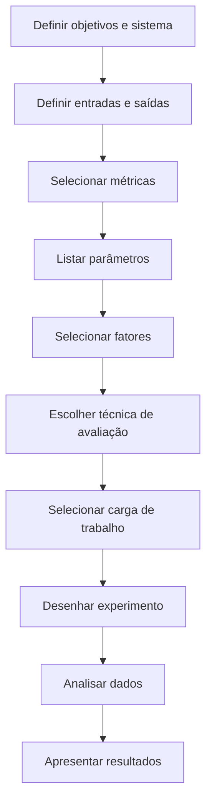
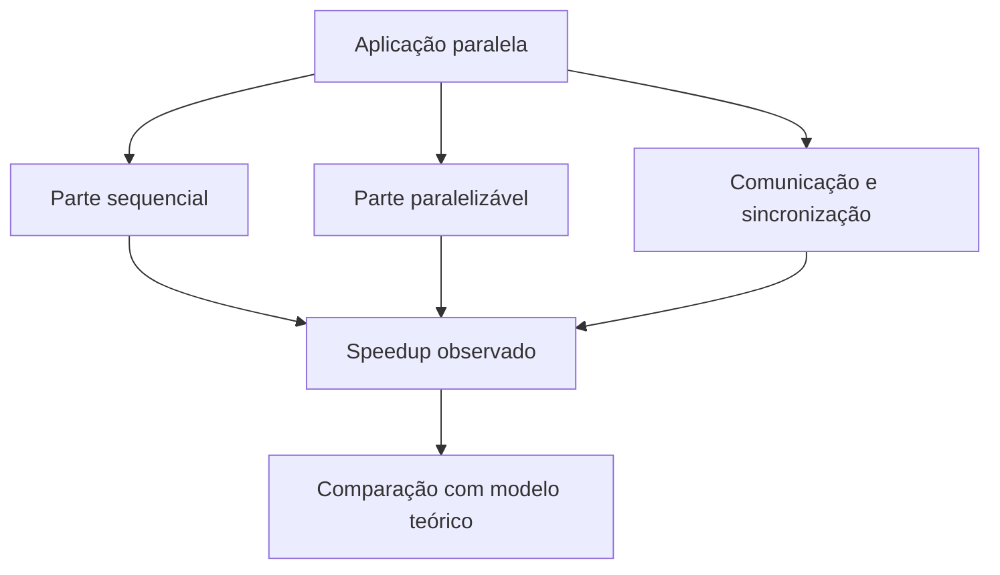
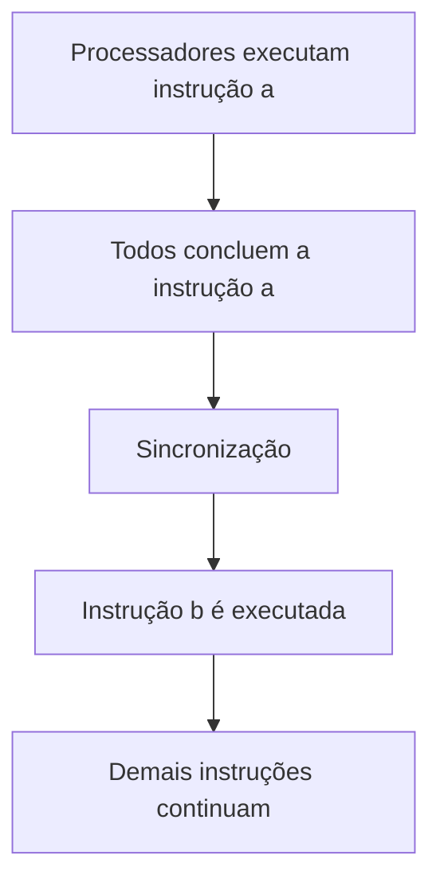

# Resumo 4.4 - Métricas de desempenho na programação paralela

# Métricas de desempenho na programação paralela

## 1. Conceito geral

> [!info] Conceito
> Métricas de desempenho são usadas para avaliar se uma aplicação paralela realmente melhora a execução de uma tarefa quando comparada à execução sequencial.

A programação paralela consiste em dividir a computação entre vários processadores, núcleos ou máquinas que executam tarefas simultaneamente. Seu objetivo é reduzir o tempo de execução, aproveitar melhor os recursos computacionais e resolver problemas que exigem grande capacidade de processamento.

As métricas de desempenho permitem medir esse comportamento de forma objetiva. Elas ajudam a comparar a execução com um único processador e a execução com vários processadores, avaliando fatores como tempo de execução, eficiência, uso de memória, latência, taxa de transferência, escalabilidade, portabilidade, requisitos de hardware e custos.

> [!tip] Resumindo
> O desempenho paralelo não deve ser avaliado apenas pela quantidade de processadores, mas pelo ganho real obtido em relação ao uso dos recursos.

---

## 2. Por que medir desempenho em programação paralela?

> [!info] Conceito
> Medir desempenho permite identificar se a aplicação está usando bem os recursos disponíveis ou se existem gargalos que reduzem o ganho obtido com o paralelismo.

Em sistemas paralelos, nem sempre adicionar mais processadores significa obter melhor desempenho. O ganho pode ser limitado por comunicação entre processos, espera por sincronização, acesso à memória, uso do disco, tamanho da entrada de dados ou pela própria estrutura do algoritmo.

A medição de desempenho também ajuda a identificar funções, blocos de instruções ou partes do programa que precisam ser melhoradas. Assim, o programador pode ajustar a aplicação para reduzir atrasos, melhorar o balanceamento de carga e evitar subutilização dos recursos.

> [!warning] Atenção
> Um sistema paralelo pode ter muitos processadores e ainda assim apresentar baixo desempenho se houver muita comunicação, sincronização excessiva ou divisão inadequada do trabalho.

---

## 3. Fatores analisados pelas métricas

> [!info] Conceito
> As métricas avaliam diferentes aspectos do comportamento da aplicação paralela, não apenas sua velocidade final.

Entre os principais fatores usados na avaliação de desempenho estão:

| Fator | Explicação simples |
|---|---|
| Tempo de execução | Tempo necessário para o algoritmo concluir sua tarefa. |
| Eficiência paralela | Grau de aproveitamento dos processadores usados. |
| Necessidade de memória | Quantidade de memória exigida para resolver o problema. |
| Taxa de transferência | Quantidade de dados ou tarefas processadas por unidade de tempo. |
| Latência | Tempo mínimo de resposta ou comunicação entre componentes. |
| Requisitos de hardware | Recursos mínimos necessários para executar a aplicação. |
| Escalabilidade | Capacidade de manter ou melhorar o desempenho ao aumentar os processadores. |
| Portabilidade | Capacidade de executar a aplicação em diferentes ambientes. |
| Custos | Recursos computacionais, financeiros ou operacionais envolvidos. |

O tempo de execução depende do tamanho da entrada de dados e da arquitetura do computador, especialmente do número de processadores. Já a escalabilidade indica se o sistema consegue aumentar o fator de aceleração conforme mais processadores são adicionados.

> [!tip] Resumindo
> A avaliação de desempenho deve considerar o problema, o algoritmo, a arquitetura e a forma como os recursos são utilizados.

---

## 4. Classes de métricas de desempenho

> [!info] Conceito
> As métricas podem avaliar tanto o desempenho dos processadores quanto o desempenho das aplicações paralelas.

As métricas de desempenho para processadores medem a relação entre velocidade e quantidade de operações realizadas em determinado tempo. Elas estão mais ligadas à capacidade do hardware.

As métricas de desempenho para aplicações paralelas analisam o comportamento do programa quando executado com múltiplos processadores, comparando esse resultado com a execução feita em apenas um processador.

| Classe | O que mede |
|---|---|
| Métricas para processadores | Velocidade e número de operações realizadas em determinado tempo. |
| Métricas para aplicações paralelas | Ganho obtido ao comparar execução sequencial e execução paralela. |

> [!tip] Resumindo
> Uma métrica pode olhar para o poder do processador ou para o ganho real da aplicação paralela.

---

## 5. Sistemática da medição de desempenho

> [!info] Conceito
> A medição de desempenho deve seguir uma sequência organizada para que os resultados sejam confiáveis.

A avaliação de desempenho começa pela definição dos objetivos e do sistema que será analisado. Depois, devem ser definidos os dados de entrada e saída, as métricas, os parâmetros, os fatores de estudo, a técnica de avaliação, a carga de trabalho, o desenho do experimento, a análise dos dados e a apresentação dos resultados.

O diagrama abaixo resume essa sequência.

Os parâmetros são valores que podem mudar durante a medição, como número de processos, número de linhas executadas, quantidade de buffers e configuração de compilação. Os fatores representam variações desses parâmetros e são importantes quando se deseja comparar cenários diferentes.

> [!warning] Atenção
> Mesmo repetindo um experimento com os mesmos parâmetros, fatores e métricas, os resultados podem variar, pois aplicações paralelas podem sofrer influência da carga, comunicação, sincronização e uso de recursos.

---

## 6. Técnicas e modelos de avaliação

> [!info] Conceito
> Os modelos de avaliação ajudam a gerar medidas de desempenho a partir de diferentes abordagens.

As medidas de desempenho podem ser produzidas por modelos analíticos, estatísticos, empíricos ou por simulação. Cada modelo possui vantagens e limitações.

| Modelo | Característica principal | Vantagem | Limitação |
|---|---|---|---|
| Analítico | Usa estimativas de tempo em trechos do programa. | Simplicidade na coleta das medidas. | Depende da qualidade das estimativas. |
| Estatístico | Estima o comportamento esperado para diversos parâmetros. | Flexibilidade. | Pode ter menor precisão e maior custo. |
| Empírico | Mede trechos representativos de programas e operações comuns. | Baseia-se em medições reais. | Depende da forma como a aplicação foi construída. |
| Simulação | Emula o comportamento de uma arquitetura ou aplicação. | Permite maior controle dos parâmetros. | Pode exigir a criação de simuladores específicos. |

A escolha da técnica depende do conhecimento disponível sobre o sistema e do tipo de comportamento que se deseja observar.

> [!tip] Resumindo
> Modelos analíticos são mais simples, modelos estatísticos são flexíveis, modelos empíricos usam medições reais e simulações permitem maior controle do experimento.

---

## 7. Speedup

> [!info] Conceito
> _Speedup_ mede quantas vezes a execução paralela é mais rápida que a execução sequencial.

O _speedup_, ou aceleração, compara o tempo de execução de um algoritmo sequencial com o tempo de execução do mesmo problema em paralelo. Ele é útil para verificar se a paralelização realmente trouxe ganho de desempenho.

A fórmula básica é:

$$
S(p) = \frac{T(1)}{T(p)}
$$

Onde:

- `S(p)` é o _speedup_ com `p` processadores;
- `T(1)` é o tempo de execução com um processador;
- `T(p)` é o tempo de execução com `p` processadores.

Exemplo de medição:

| Métrica | 1 CPU | 2 CPUs | 4 CPUs | 8 CPUs | 16 CPUs |
|---|---:|---:|---:|---:|---:|
| `T(p)` | 1000 | 520 | 280 | 160 | 100 |
| `S(p)` | 1 | 1,92 | 3,57 | 6,25 | 10,00 |

Nesse exemplo, com 16 CPUs, a execução ficou 10 vezes mais rápida em relação à execução com 1 CPU. Porém, o ganho não foi de 16 vezes, o que mostra que existem perdas no paralelismo.

> [!warning] Atenção
> Usar mais processadores não garante ganho proporcional. O _speedup_ real depende da parte paralelizável do algoritmo e dos custos de comunicação e sincronização.

---

## 8. Redundância

> [!info] Conceito
> Redundância mede o aumento da quantidade de operações realizadas na execução paralela em relação à execução sequencial.

A redundância indica se a versão paralela está realizando mais trabalho do que a versão sequencial. Isso pode acontecer por causa de comunicação, controle, sincronização ou repetição de operações necessárias para coordenar os processadores.

A fórmula pode ser representada como:

$$
R(p) = \frac{O(p)}{O(1)}
$$

Onde:

- `R(p)` é a redundância com `p` processadores;
- `O(p)` é o número de operações com `p` processadores;
- `O(1)` é o número de operações com um processador.

Exemplo:

| Métrica | 1 CPU | 2 CPUs | 4 CPUs | 8 CPUs | 16 CPUs |
|---|---:|---:|---:|---:|---:|
| `O(p)` | 1000 | 1025 | 1100 | 1225 | 1500 |
| `R(p)` | 1 | 1,03 | 1,10 | 1,23 | 1,50 |

Quanto maior a redundância, maior é o volume de operações extras realizadas pela execução paralela.

> [!tip] Resumindo
> A redundância mostra se o paralelismo está exigindo trabalho adicional para coordenar a execução.

---

## 9. Eficiência

> [!info] Conceito
> Eficiência mede o grau de aproveitamento dos processadores usados na execução paralela.

A eficiência indica a fração do tempo em que os processadores estão sendo realmente usados em computação útil. Ela relaciona o _speedup_ obtido com a quantidade de processadores utilizados.

A fórmula é:

$$
E(p) = \frac{S(p)}{p} = \frac{T(1)}{p \times T(p)}
$$

Onde:

- `E(p)` é a eficiência;
- `S(p)` é o _speedup_;
- `p` é a quantidade de processadores;
- `T(1)` é o tempo com um processador;
- `T(p)` é o tempo com `p` processadores.

Exemplo:

| Métrica | 1 CPU | 2 CPUs | 4 CPUs | 8 CPUs | 16 CPUs |
|---|---:|---:|---:|---:|---:|
| `S(p)` | 1 | 1,92 | 3,57 | 6,25 | 10,00 |
| `E(p)` | 1 | 0,96 | 0,89 | 0,78 | 0,63 |

A eficiência tende a diminuir quando mais processadores são adicionados, pois surgem custos de comunicação, sincronização e coordenação.

> [!tip] Resumindo
> Eficiência alta indica bom aproveitamento dos processadores; eficiência baixa indica perda de desempenho ou subutilização.

---

## 10. Qualidade

> [!info] Conceito
> Qualidade mede a importância e a efetividade do uso da programação paralela para determinado problema.

A qualidade de um algoritmo paralelo considera a fração do tempo de atividade dos processadores e também a escalabilidade. Ela não depende apenas da quantidade de processadores, pois envolve a relação entre aceleração, eficiência e redundância.

A fórmula pode ser representada como:

$$
Q(p) = \frac{S(p) \times E(p)}{R(p)}
$$

Onde:

- `Q(p)` é a qualidade;
- `S(p)` é o _speedup_;
- `E(p)` é a eficiência;
- `R(p)` é a redundância.

Exemplo:

| Métrica | 1 CPU | 2 CPUs | 4 CPUs | 8 CPUs | 16 CPUs |
|---|---:|---:|---:|---:|---:|
| `S(p)` | 1 | 1,92 | 3,57 | 6,25 | 10,00 |
| `E(p)` | 1 | 0,96 | 0,89 | 0,78 | 0,63 |
| `R(p)` | 1 | 1,03 | 1,10 | 1,23 | 1,50 |
| `Q(p)` | 1 | 1,79 | 2,89 | 3,96 | 4,20 |

> [!warning] Atenção
> O cálculo da qualidade não é simples e não considera apenas a quantidade de processadores. Ele também depende do ganho obtido, do aproveitamento dos recursos e do trabalho extra produzido pela execução paralela.

---

## 11. Métrica de Karp-Flatt

> [!info] Conceito
> A métrica de Karp-Flatt avalia o grau de paralelização de um código com base no _speedup_ obtido.

A métrica de Karp-Flatt é usada para compreender se o ganho de desempenho está realmente associado à paralelização ou se existem limitações que reduzem a eficiência. Ela considera a quantidade de processadores e o _speedup_ medido.

Quando `p > 1`, utiliza-se:

$$
e = \frac{\frac{1}{S(p)} - \frac{1}{p}}{1 - \frac{1}{p}}
$$

Onde:

- `e` representa a fração serial aparente;
- `S(p)` representa o _speedup_;
- `p` representa a quantidade de processadores.

> [!tip] Resumindo
> Karp-Flatt ajuda a identificar limitações do paralelismo a partir do _speedup_ observado.

---

## 12. Isoeficiência

> [!info] Conceito
> Isoeficiência relaciona o tamanho do problema, a quantidade de processadores e a memória necessária para manter a eficiência.

A eficiência de uma aplicação paralela não depende apenas da quantidade de processadores. Ela também depende do tamanho do problema, da comunicação entre processadores e da memória disponível.

A ideia da isoeficiência é analisar como o problema precisa crescer para que a eficiência seja mantida quando mais processadores são adicionados. Se o crescimento exigido for muito alto, pode chegar a um limite de memória e a eficiência tende a cair.

Algumas relações apresentadas no material são:

$$
T_0(p) = p \times C_{seq} + p \times C_{com}
$$

$$
n \geq f(p)
$$

$$
n \geq M(f(p))
$$

$$
\frac{M(f(p))}{p}
$$

Essas expressões relacionam o tempo de execução adicional, o tamanho do problema, o número de processadores e a memória necessária por processador.

> [!warning] Atenção
> A eficiência pode cair quando o aumento de processadores exige mais memória, comunicação ou sincronização do que o sistema consegue suportar.

---

## 13. Speedup superlinear

> [!info] Conceito
> _Speedup_ superlinear ocorre quando o ganho obtido parece superar a proporção esperada em relação ao número de processadores.

O _speedup_ superlinear é usado para analisar situações em que dois sistemas processam o mesmo problema e uma arquitetura apresenta melhoria de velocidade superior ao esperado. Ele representa um caso especial de ganho de desempenho, no qual a execução paralela parece superar a relação direta entre número de processadores e tempo de execução.

> [!tip] Resumindo
> O _speedup_ superlinear indica um ganho excepcional, mas precisa ser analisado com cuidado para verificar se o resultado é realmente consequência da paralelização.

---

## 14. Regras de verificação do comportamento paralelo

> [!info] Conceito
> As regras de verificação ajudam a comparar o desempenho observado com limites teóricos ou modelos esperados.

Ao analisar uma aplicação paralela, é comum comparar seu comportamento com um referencial. Para isso, podem ser usadas leis como a Lei de Amdahl e a Lei de Gustafson.

Essas leis ajudam a entender os limites do paralelismo, principalmente quando parte da aplicação não pode ser paralelizada ou quando o tamanho do problema aumenta junto com os recursos disponíveis.

O diagrama mostra que o desempenho final depende da parte sequencial, da parte paralelizável e dos custos de comunicação e sincronização.

> [!tip] Resumindo
> As leis de verificação ajudam a entender até onde o paralelismo pode melhorar o desempenho.

---

## 15. Lei de Amdahl

> [!info] Conceito
> A Lei de Amdahl mede o limite de ganho de desempenho considerando a parte sequencial da aplicação.

A Lei de Amdahl é usada como referência para medir o desempenho de programas paralelos. Ela compara a execução com um processador e com vários processadores, considerando que uma parte da aplicação pode ser paralela e outra parte pode continuar obrigatoriamente sequencial.

Essa lei é útil para analisar o _speedup_ máximo possível. Mesmo que muitos processadores sejam usados, a parte sequencial limita o ganho total.

Dois problemas comuns observados nessa análise são:

| Problema | Explicação |
|---|---|
| Envio e recepção tardios de mensagens | Um processo fica ocioso esperando uma mensagem necessária para continuar. |
| Granularidade incorreta | A divisão do trabalho é inadequada e aumenta o tempo de comunicação ou execução. |

> [!warning] Atenção
> A Lei de Amdahl tem limitações, pois ignora custos de comunicação e sincronização associados ao paralelismo.

---

## 16. Lei de Gustafson

> [!info] Conceito
> A Lei de Gustafson reavalia a Lei de Amdahl considerando um tempo de execução fixo e o aumento do tamanho do problema.

A Lei de Gustafson, também chamada de Lei de Gustafson-Barsis, calcula a aceleração teórica da execução quando o sistema usa recursos aprimorados. Ela parte da ideia de que, com mais processadores, pode ser possível resolver problemas maiores no mesmo intervalo de tempo.

A formulação apresentada no material é:

$$
S(l) = 1 - p + sp
$$

Onde:

- `S(l)` é a aceleração da latência na execução da tarefa;
- `s` representa a aceleração da parte que se beneficia dos recursos;
- `p` representa o percentual da carga de trabalho beneficiada.

Essa lei também tem limitações, pois usa o tempo de execução paralelo como ponto de partida e assume que, com um único processador, a execução seria proporcionalmente mais lenta. Essa suposição nem sempre é verdadeira, especialmente quando a memória de um único processador não é suficiente.

> [!tip] Resumindo
> Amdahl destaca o limite imposto pela parte sequencial; Gustafson considera que problemas maiores podem aproveitar melhor mais processadores.

---

## 17. Aplicação prática: eficiência em múltiplas threads

> [!info] Conceito
> A eficiência mostra se o uso de múltiplos processadores realmente melhora o desempenho de uma aplicação com várias tarefas.

No exemplo prático, Juca cria uma aplicação com múltiplas _threads_ para ser executada em ambiente multiprocessador. O algoritmo possui várias instruções, mas a instrução `b` só pode ser executada quando todos os processadores terminam a instrução `a`.

Esse comportamento indica sincronização: uma etapa precisa esperar a conclusão de outra por todos os processadores envolvidos.

Ao usar 4 processadores, Juca obteve:

| Métrica | 1 CPU | 4 CPUs |
|---|---:|---:|
| `S(p)` | 1 | 3,57 |
| `E(p)` | 1 | 0,89 |

Esse resultado indica bom aproveitamento dos processadores, embora não ideal. Ainda existem fatores que podem afetar o desempenho, como latência, largura de banda e espera por sincronização.

> [!warning] Atenção
> Sincronização excessiva pode deixar processadores ociosos, reduzindo a eficiência da aplicação paralela.

---

## 18. Aplicação prática: comparação entre execução sequencial e paralela

> [!info] Conceito
> O _speedup_ permite comprovar numericamente o ganho de desempenho entre uma execução sequencial e uma execução paralela.

No cenário do desafio, um sistema processa informações financeiras em massa. O volume de dados cresce diariamente e o tempo de processamento também aumenta.

A execução sequencial leva 10 minutos. Como 10 minutos equivalem a 600 segundos, esse tempo pode ser comparado ao tempo obtido com uma máquina paralela de 8 processadores.

A fórmula usada é:

$$
Speedup = \frac{Tempo\ sequencial}{Tempo\ paralelo}
$$

Se a execução paralela levar 60 segundos, por exemplo:

$$
Speedup = \frac{600}{60} = 10
$$

Isso significa que a versão paralela foi 10 vezes mais rápida.

> [!tip] Resumindo
> Para comprovar o ganho, é necessário medir o tempo exato da execução paralela. Sem esse valor, é possível afirmar que houve melhoria, mas não calcular o _speedup_ com precisão.

---

## 19. Principais riscos de interpretação

> [!warning] Atenção
> Algumas métricas são parecidas, mas medem aspectos diferentes do desempenho paralelo.

| Confusão comum | Correção |
|---|---|
| Achar que _speedup_ mede quantidade de operações | _Speedup_ mede a razão entre tempo sequencial e tempo paralelo. |
| Achar que redundância mede tempo | Redundância mede operações extras na execução paralela. |
| Achar que eficiência depende apenas de processadores | Eficiência depende do _speedup_ e da quantidade de processadores. |
| Achar que qualidade é simples | Qualidade envolve _speedup_, eficiência, redundância e escalabilidade. |
| Achar que mais processadores sempre melhoram o desempenho | Comunicação, sincronização e memória podem limitar o ganho. |
| Achar que os resultados sempre se repetem | Experimentos paralelos podem variar mesmo com os mesmos parâmetros. |

> [!tip] Resumindo
> O desempenho paralelo precisa ser interpretado por um conjunto de métricas, não por um único número isolado.

---

## 20. Síntese final

> [!summary] Síntese
> Métricas de desempenho na programação paralela permitem comparar execução sequencial e paralela, medir ganhos reais, identificar gargalos e avaliar se os recursos computacionais estão sendo bem utilizados.

A programação paralela é uma estratégia importante para resolver problemas de alto custo computacional, reduzir o tempo de execução e evitar subutilização de recursos. Porém, seu uso precisa ser avaliado cuidadosamente, pois o ganho de desempenho pode ser limitado por comunicação, sincronização, memória, granularidade incorreta ou partes sequenciais do algoritmo.

As principais métricas estudadas são _speedup_, redundância, eficiência, qualidade, Karp-Flatt, isoeficiência e _speedup_ superlinear. Além delas, leis como Amdahl e Gustafson ajudam a verificar o comportamento de aplicações paralelas em relação a modelos teóricos.

Em resumo, medir desempenho é essencial para saber se o paralelismo realmente compensa. Uma boa aplicação paralela não é apenas aquela que usa muitos processadores, mas aquela que consegue transformar esses recursos em ganho real, eficiente e escalável.