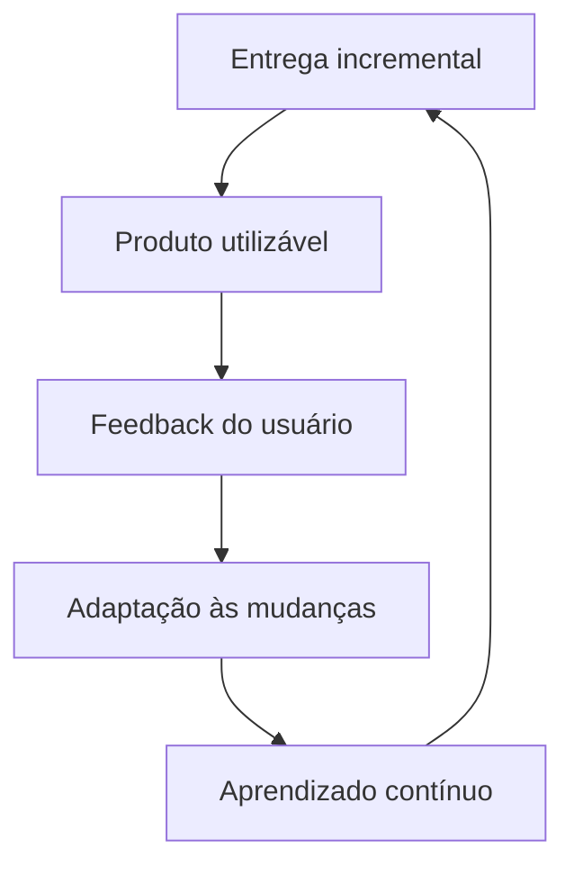
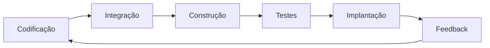

# Manifesto Ágil e práticas da cultura DevOps

## Manifesto Ágil

> [!info] Conceito
> O Manifesto Ágil orienta o desenvolvimento de software por meio de quatro valores e doze princípios que priorizam pessoas, colaboração, entregas funcionais e adaptação às mudanças.

A cultura DevOps é apresentada como uma extensão dos valores do Manifesto Ágil, publicado em 2001. O manifesto não rejeita processos, ferramentas, documentação, contratos ou planejamento, mas estabelece que certos elementos devem receber maior prioridade durante o desenvolvimento de software.

### Os quatro valores do Manifesto Ágil

1. **Indivíduos e interações** mais que processos e ferramentas.
2. **Software em funcionamento** mais que documentação abrangente.
3. **Colaboração com o cliente** mais que negociação de contratos.
4. **Responder a mudanças** mais que seguir um plano.

Esses valores defendem que o desenvolvimento deve ser orientado pelas pessoas envolvidas, pelas necessidades reais do cliente e pela entrega de resultados úteis. Processos e documentos continuam sendo importantes, mas não devem impedir a comunicação, a adaptação e a produção de software funcional.

> [!warning] Atenção
> O Manifesto Ágil não afirma que processos, ferramentas, documentação, contratos e planos sejam dispensáveis. Ele apenas prioriza os elementos situados à esquerda de cada valor.

### Os doze princípios ágeis

Os doze princípios complementam os valores e funcionam como um guia para as equipes:

1. Satisfazer o cliente por meio da entrega antecipada e contínua de software.
2. Aceitar mudanças nos requisitos, permitindo que o cliente obtenha vantagens competitivas.
3. Entregar frequentemente versões simples e utilizáveis do produto.
4. Promover a cooperação permanente entre profissionais de negócios e desenvolvedores.
5. Proporcionar um ambiente adequado e manter a equipe motivada.
6. Realizar conversas diretas e frequentes para transmitir informações com eficiência.
7. Considerar o software funcionando como a principal medida de progresso.
8. Manter um ritmo constante e sustentável de desenvolvimento.
9. Buscar excelência técnica e um bom projeto de software.
10. Valorizar a simplicidade e produzir soluções objetivas e funcionais.
11. Trabalhar com equipes auto-organizáveis, capazes de produzir melhores arquiteturas, requisitos e projetos.
12. Avaliar regularmente o trabalho para que a equipe se torne mais efetiva e competente.

> [!tip] Resumindo
> A agilidade envolve entregas frequentes, colaboração, simplicidade, excelência técnica, melhoria contínua e capacidade de responder às mudanças.

## Agile como mentalidade

> [!info] Conceito
> *Agile* representa uma mentalidade de desenvolvimento fundamentada em entrega incremental, colaboração, planejamento adaptável e aprendizado contínuo.

Na entrega incremental, cada nova versão acrescenta funcionalidades e aperfeiçoamentos à versão anterior. Essa forma de trabalho permite disponibilizar partes utilizáveis do produto antes da conclusão total do projeto, receber feedback dos usuários e realizar ajustes durante o desenvolvimento.

Não existe uma única abordagem adequada para todas as situações. Por isso, o termo *Agile* passou a abranger diferentes métodos e práticas alinhados aos valores e princípios do Manifesto Ágil.

O fluxo representa a natureza iterativa do desenvolvimento ágil: a equipe entrega uma versão utilizável, obtém feedback, adapta o produto e aplica o aprendizado nas entregas seguintes.

## Cultura DevOps

> [!info] Conceito
> DevOps reúne desenvolvimento e operações em uma cultura baseada em integração, colaboração, automação e responsabilidade compartilhada.

DevOps é um conjunto de procedimentos que combina os processos de desenvolvimento e operações de TI. Essa cultura integra práticas, filosofias e ferramentas para ampliar a capacidade de uma organização fornecer aplicações e serviços.

Em uma estrutura DevOps, uma equipe integrada participa do desenvolvimento, dos testes e das operações. Essa aproximação reduz os conflitos entre áreas isoladas e facilita a colaboração durante todo o ciclo de vida do software.

A discussão sobre DevOps começou em 2008, quando Patrick Debois propôs a busca por novos métodos para enfrentar os conflitos recorrentes entre as equipes de desenvolvimento e operações.

> [!tip] Resumindo
> DevOps procura transformar desenvolvimento, testes e operações em partes integradas de um mesmo processo de entrega de software.

## Desenvolvimento ágil de software

> [!info] Conceito
> O desenvolvimento ágil divide o projeto em partes entregáveis e favorece colaboração, adaptação, feedback e ciclos curtos de lançamento.

O desenvolvimento ágil é uma das primeiras práticas necessárias à implantação da cultura DevOps. Ele substitui modelos tradicionais por uma abordagem na qual o projeto é dividido em subprojetos ou incrementos que podem ser entregues ao usuário antes da conclusão do produto inteiro.

Com versões antecipadas do sistema, o usuário pode experimentar o que já foi desenvolvido e fornecer feedback. A equipe utiliza essas informações para corrigir problemas, alterar requisitos e adequar o produto com maior rapidez.

Entre as metodologias utilizadas para concretizar o desenvolvimento ágil estão:

- **Scrum:** organiza o trabalho em ciclos curtos, com entregas periódicas e avaliação contínua.
- **Kanban:** permite visualizar e acompanhar o fluxo de trabalho ao longo das etapas do processo.

## Integração e entrega contínuas

> [!info] Conceito
> Integração contínua e entrega contínua automatizam etapas que vão da codificação à disponibilização do software.

O desenvolvimento ágil possibilita a adoção da **integração contínua** e da **entrega contínua**. Essas práticas automatizam os processos de construção do software, desde a integração do código produzido pelos desenvolvedores até sua implantação.

A automação contribui para reduzir custos operacionais e erros humanos. Também permite realizar entregas com maior frequência e manter o processo de desenvolvimento mais consistente.

O material menciona algumas ferramentas relacionadas a essas práticas:

- **Git:** empregado no controle de versões do código.
- **Jenkins:** utilizado na automação dos processos de integração e entrega.
- **Docker:** permite organizar aplicações em ambientes padronizados.
- **Kubernetes:** auxilia no gerenciamento dos ambientes utilizados pelas aplicações.

Esse fluxo mostra como a automação conecta o desenvolvimento à implantação e permite que o feedback seja incorporado às versões posteriores.

> [!tip] Resumindo
> A integração e a entrega contínuas tornam as mudanças menores, frequentes e automatizadas, reduzindo falhas manuais durante a produção do software.

## Controle de versões

> [!info] Conceito
> O controle de versões registra revisões e modificações realizadas no código ao longo do desenvolvimento.

O controle de versões permite gerenciar o código e preservar um histórico das alterações. Quando uma atualização apresenta falhas, a equipe pode retornar a uma versão anterior de forma eficiente.

Essa prática também ajuda a identificar alterações específicas, resolver conflitos entre contribuições e administrar as mudanças feitas pelos integrantes da equipe de maneira pontual. Por essas características, o controle de versões é indispensável para a implantação da cultura DevOps.

> [!tip] Resumindo
> O histórico de versões oferece rastreabilidade, facilita a colaboração e permite recuperar estados anteriores do software quando uma atualização falha.

## Infraestrutura como serviço

> [!info] Conceito
> A infraestrutura como serviço permite construir e manter os ambientes de desenvolvimento de maneira programática e escalável.

Ao tratar a infraestrutura como um recurso que pode ser configurado programaticamente, a organização consegue criar e manter ambientes de desenvolvimento de forma mais padronizada. Essa abordagem favorece a automação e permite ampliar os ambientes conforme as necessidades do projeto.

Sua adoção está alinhada à cultura DevOps porque aproxima a administração da infraestrutura das práticas utilizadas no desenvolvimento do software.

## Benefícios da cultura DevOps

> [!info] Conceito
> A aplicação de DevOps melhora a cooperação entre equipes e torna o processo de entrega mais rápido, contínuo e seguro.

Entre os benefícios apresentados estão:

- maior colaboração entre os times;
- integração contínua;
- entrega contínua;
- melhoria contínua;
- obtenção mais rápida de feedback;
- aumento da segurança do sistema;
- redução de custos operacionais;
- diminuição de erros humanos;
- maior capacidade de fornecer aplicações e serviços de TI.

Esses benefícios estão relacionados. A colaboração facilita a automação e a integração; as entregas frequentes geram feedback mais rápido; e o feedback alimenta a melhoria contínua do produto e do processo.

## Materiais complementares

> [!info] Conceito
> Os materiais complementares permitem aprofundar os aspectos históricos, culturais e práticos relacionados à tecnologia e ao DevOps.

O filme *Piratas do Vale do Silício* (1999) dramatiza o surgimento da informática acessível, apresenta os primeiros modelos de computadores e aborda a rivalidade entre empresas que se tornaram importantes no setor tecnológico.

O site DevOps.com reúne artigos, postagens, notícias e outros conteúdos relacionados à cultura DevOps. O artigo *DevOps: a Historical Review and Future Works*, de Mayank Gokarna e Singh Raju, apresenta uma revisão histórica de DevOps e perspectivas para trabalhos futuros.

O livro *Jornada DevOps: unindo cultura ágil, Lean e tecnologia para entrega de software com qualidade*, de Antonio Muniz e colaboradores, aborda os conceitos básicos de DevOps por meio de exemplos práticos.

## Síntese final

> [!summary] Síntese
> DevOps amplia os valores ágeis ao integrar pessoas, processos e ferramentas durante o desenvolvimento, os testes e as operações.

A cultura DevOps combina desenvolvimento e operações para melhorar a capacidade de entrega de aplicações e serviços de TI. Sua implantação depende de colaboração entre equipes, desenvolvimento ágil, automação, integração e entrega contínuas, controle de versões e gerenciamento programático da infraestrutura.

O Manifesto Ágil oferece a base cultural dessa abordagem ao priorizar indivíduos, software funcional, colaboração com o cliente e adaptação às mudanças. Em conjunto, Agile e DevOps promovem entregas incrementais, feedback rápido, aprendizado contínuo, excelência técnica e melhoria constante do processo e do produto.

# Questionário — dúvidas frequentes

# 1

> [!question] O que é DevOps?
>
>> [!question]- Resposta
>>
>> É um conjunto de procedimentos ágeis que combina os processos de desenvolvimento e operações em TI.

# 2

> [!question] Desde quando a cultura DevOps vem sendo discutida dentro da comunidade?
>
>> [!question]- Resposta
>>
>> Desde 2008, quando Patrick Debois propôs uma pauta para a discussão de novos métodos destinados a solucionar os constantes conflitos entre as equipes de desenvolvimento e de operações em TI.

# 3

> [!question] Qual é o objetivo da prática de desenvolvimento ágil de software?
>
>> [!question]- Resposta
>>
>> O desenvolvimento ágil de software tem como objetivo concentrar-se na colaboração em equipe, com maior adaptabilidade às mudanças de demanda, ao feedback do usuário e aos ciclos de lançamento mais curtos.

# 4

> [!question] Quais são os benefícios da aplicação da cultura DevOps em uma empresa?
>
>> [!question]- Resposta
>>
>> A aplicação da cultura DevOps auxilia na colaboração entre as equipes, na integração contínua, na entrega contínua, na melhoria contínua, na obtenção de feedback mais rápido e na segurança do sistema.