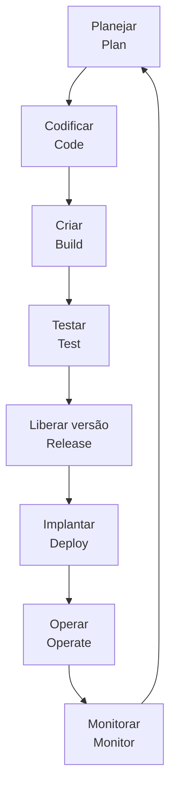

# Pipeline de implantação em DevOps

## 1. Conceito de pipeline

> [!info] Conceito
> Em informática, uma **pipeline** é uma canalização formada por etapas organizadas para processar dados e aumentar o rendimento de um sistema digital.

No contexto de **DevOps**, a pipeline corresponde a um conjunto integrado de processos e ferramentas, geralmente automatizados, por meio dos quais desenvolvedores e profissionais de operações colaboram na criação, no teste, na implantação e no acompanhamento do software em produção.

A pipeline consolida as práticas da cultura DevOps em um fluxo contínuo, aproximando as equipes de desenvolvimento (**Dev**) e de operações (**Ops**).

> [!tip] Resumindo
> A pipeline transforma o desenvolvimento e a implantação de software em um processo integrado, repetível e automatizado.

---

## 2. Ciclo contínuo da pipeline DevOps

> [!info] Conceito
> A pipeline DevOps é representada como um ciclo em forma de infinito, indicando que o desenvolvimento, a operação e a melhoria do software acontecem continuamente.

A pipeline apresentada possui oito etapas:

| Lado Dev | Lado Ops |
|---|---|
| Planejamento (*plan*) | Versão (*release*) |
| Codificação (*code*) | Implantação (*deploy*) |
| Criação ou compilação (*build*) | Operação (*operate*) |
| Teste (*test*) | Monitoramento (*monitor*) |

O formato cíclico demonstra que as informações obtidas durante a operação e o monitoramento retornam ao planejamento, permitindo corrigir problemas e aperfeiçoar continuamente o produto.

---

## 3. Etapas do lado Dev

### 3.1 Planejamento — *plan*

> [!info] Conceito
> O planejamento identifica os requisitos e as funcionalidades que deverão ser construídos nas próximas iterações, *sprints* ou versões do sistema.

Nessa etapa, a equipe organiza o trabalho que será realizado. Metodologias ágeis, como **Scrum** e **Extreme Programming (XP)**, auxiliam na adaptação do projeto a partir de feedbacks recebidos em tempo real.

A adoção dessas metodologias pode reduzir atividades que levariam semanas ou meses para ciclos de dias ou horas.

> [!tip] Resumindo
> A etapa de planejamento define o que será desenvolvido e organiza sua execução em ciclos curtos.

### 3.2 Codificação — *code*

> [!info] Conceito
> A codificação é a etapa em que os requisitos selecionados são transformados em código-fonte.

Os desenvolvedores escolhem as funcionalidades que serão implementadas durante um período determinado. Normalmente, esse período dura até um mês e busca produzir uma versão mínima utilizável do sistema.

As decisões relacionadas ao produto, ao prazo e às atividades são tomadas durante as reuniões da equipe, especialmente nas *sprints*. A colaboração entre os integrantes favorece a adoção de ferramentas comuns e a produção de um código coerente e compatível.

### 3.3 Infraestrutura como código — IaC

> [!info] Conceito
> **Infraestrutura como código**, ou **IaC (*Infrastructure as Code*)**, é a prática de gerenciar e provisionar a infraestrutura por meio de arquivos de código, substituindo configurações exclusivamente manuais.

A IaC permite fornecer rapidamente recursos de infraestrutura às equipes. Também contribui para que os ambientes de desenvolvimento, teste e produção permaneçam atualizados e consistentes.

Essa equivalência reduz erros causados por diferenças entre ambientes, como uma aplicação funcionar corretamente durante os testes, mas apresentar falhas quando executada em produção.

> [!warning] Atenção
> A IaC não é uma fase isolada da pipeline. Trata-se de uma prática que apoia diferentes etapas, principalmente a preparação e a padronização dos ambientes.

### 3.4 Criação ou compilação — *build*

> [!info] Conceito
> A etapa de *build* prepara a aplicação e suas dependências para que o código possa ser testado e posteriormente implantado.

O código-fonte é registrado em um repositório utilizando ferramentas de controle de versão, como o **Git**. Ao concluir uma alteração, o desenvolvedor envia uma solicitação de integração, como uma *pull request*.

Essa solicitação passa por uma revisão realizada por outros integrantes da equipe. A revisão por pares ajuda a encontrar problemas antecipadamente, reduzindo custos e esforços de correção.

Depois da aprovação, inicia-se a compilação automatizada e são executados testes, como os testes de unidade. Se ocorrer uma falha, o desenvolvedor deve ser notificado e corrigir rapidamente o código para impedir que outros profissionais utilizem uma versão quebrada.

### 3.5 Teste — *test*

> [!info] Conceito
> A etapa de teste verifica se o sistema funciona corretamente e se atende aos requisitos de qualidade antes de chegar à produção.

Os testes podem avaliar:

- funcionamento das funcionalidades;
- desempenho;
- capacidade de carga;
- segurança;
- nível de aceitação do usuário;
- comportamento da aplicação em tempo de execução.

O ambiente de testes deve ser configurado de maneira semelhante ao ambiente de produção. Essa aproximação aumenta a possibilidade de identificar previamente problemas que poderiam afetar o usuário final.

> [!tip] Resumindo
> O lado Dev transforma requisitos em código, prepara a aplicação e verifica sua qualidade antes da liberação.

---

## 4. Etapas do lado Ops

### 4.1 Versão — *release*

> [!info] Conceito
> A etapa de *release* controla a versão do sistema que foi aprovada nos testes e está pronta para ser implantada.

Cada versão liberada representa um ponto importante da pipeline. Nesse momento, as alterações desenvolvidas já passaram pelos testes e podem seguir para o ambiente de produção.

A maneira como a versão será disponibilizada ao usuário deve ser definida desde o levantamento dos requisitos. A liberação pode seguir uma estratégia de:

- **Entrega Contínua (EC):** o sistema permanece pronto para ser implantado, mas a disponibilização em produção pode depender de uma decisão ou autorização;
- **Implantação Contínua (IC):** as alterações aprovadas seguem automaticamente para produção.

As ferramentas de gerenciamento de versões também devem permitir:

- controlar interdependências;
- manter, revisar e atualizar o código-fonte;
- atualizar as configurações da infraestrutura;
- acompanhar a aplicação após a implantação;
- coletar feedback para futuras adaptações.

### 4.2 Implantação — *deploy*

> [!info] Conceito
> O *deploy* é a disponibilização do sistema ou de uma nova funcionalidade no ambiente de produção, tornando-a acessível ao usuário final.

O ambiente de produção é o servidor ou conjunto de recursos que hospeda a aplicação utilizada pelos usuários. Quando o *deploy* acontece, as etapas anteriores da pipeline já foram concluídas.

Mesmo quando desenvolvimento, testes e produção são semelhantes, ainda podem ocorrer falhas durante a implantação. Uma funcionalidade aprovada nos testes pode não se comportar da mesma maneira em produção.

Por isso, o controle de versões é fundamental. Se uma nova versão apresentar problemas, a equipe pode retornar à última versão estável enquanto realiza as correções necessárias.

> [!warning] Atenção
> O sucesso nos testes reduz riscos, mas não garante que nenhuma falha ocorrerá em produção. É necessário manter uma estratégia de reversão para a última versão estável, conhecida como *rollback*.

### 4.3 Operação — *operate*

> [!info] Conceito
> A operação envolve a manutenção do sistema em produção e a correção rápida dos problemas encontrados durante seu uso.

Depois do *deploy*, a equipe de operações acompanha constantemente elementos como:

- rede;
- servidores;
- segurança;
- conexões e acessos;
- disponibilidade da aplicação;
- desempenho do sistema.

Os problemas devem ser corrigidos rapidamente para evitar prejuízos à experiência do usuário. Para isso, podem ser empregados serviços em nuvem, ferramentas de segurança, recursos de virtualização e outras tecnologias operacionais.

### 4.4 Monitoramento — *monitor*

> [!info] Conceito
> O monitoramento é a observação contínua do sistema e dos dados gerados durante seu funcionamento.

Embora seja apresentado como uma etapa específica, o monitoramento deve estar incorporado a todas as fases da pipeline. Os diferentes fluxos de dados são reunidos e analisados para identificar problemas, avaliar resultados e melhorar continuamente o processo DevOps.

A principal diferença em relação à operação é que:

| Operação | Monitoramento |
|---|---|
| Mantém o sistema funcionando em produção | Coleta e analisa continuamente informações sobre o sistema |
| Corrige falhas que afetam o usuário | Identifica tendências, comportamentos e oportunidades de melhoria |
| Concentra-se na infraestrutura e no funcionamento atual | Produz feedback para todas as etapas da pipeline |

> [!tip] Resumindo
> O lado Ops libera, implanta, mantém e monitora o sistema, gerando informações que alimentam novamente o planejamento.

---

## 5. Automação da pipeline DevOps

> [!info] Conceito
> A automação permite executar de maneira padronizada as atividades da pipeline, desde o envio do código ao repositório até a implantação e o monitoramento da aplicação.

As ferramentas DevOps procuram tornar o fluxo de desenvolvimento mais seguro e simples. Algumas soluções abrangem todo o ciclo do projeto, automatizando compilação, testes, implantação, notificações e acompanhamento.

A automação proporciona benefícios como:

- redução do trabalho manual;
- execução mais rápida das etapas;
- padronização dos processos;
- identificação antecipada de falhas;
- redução de erros humanos;
- maior frequência de entregas;
- melhoria da colaboração;
- ganho de tempo no desenvolvimento.

---

## 6. Ferramentas de compilação e infraestrutura

### 6.1 Docker

> [!info] Conceito
> O **Docker** organiza aplicações em contêineres, permitindo executar o software e suas dependências de maneira padronizada em diferentes ambientes.

Os contêineres funcionam como componentes separados de software e facilitam a movimentação da aplicação entre desenvolvimento, testes e produção.

Seu principal benefício é reduzir problemas de compatibilidade entre ambientes. O Docker também pode ser empregado em práticas relacionadas à infraestrutura como código.

> [!tip] Resumindo
> O Docker empacota a aplicação com os recursos necessários para que ela se comporte de maneira consistente em diferentes ambientes.

### 6.2 Bitbucket

> [!info] Conceito
> O **Bitbucket** é uma plataforma de hospedagem e versionamento de código baseada em Git.

A ferramenta possui recursos de permissão que permitem aos administradores controlar quais usuários podem alterar o código. Também oferece integração, por meio de APIs, com serviços e plataformas como **Slack** e **AWS**.

---

## 7. Ferramentas de automação

### 7.1 Jenkins

> [!info] Conceito
> O **Jenkins** é um servidor de automação de código aberto utilizado para criar, testar e implantar produtos de software.

Entre suas características estão:

- arquitetura distribuída;
- grande quantidade de *plugins*;
- integração com outras ferramentas e plataformas;
- possibilidade de extensão;
- facilidade de instalação;
- suporte à construção e ao gerenciamento de projetos, incluindo projetos baseados em Java.

### 7.2 CircleCI

> [!info] Conceito
> O **CircleCI** é uma ferramenta de integração contínua que automatiza o percurso do código pelas diferentes etapas da pipeline.

A ferramenta permite:

- criar fluxos de trabalho;
- executar testes automatizados;
- trabalhar com diferentes ambientes;
- enviar notificações sobre falhas e erros;
- conduzir o código desde as primeiras etapas até a implantação.

### 7.3 Comparação entre as ferramentas

| Ferramenta | Finalidade principal |
|---|---|
| Docker | Padronizar e transportar aplicações por meio de contêineres |
| Bitbucket | Hospedar e versionar código com Git |
| Jenkins | Automatizar a criação, os testes e a implantação |
| CircleCI | Implementar fluxos de integração contínua e testes automatizados |

---

## 8. Desafios da adoção de DevOps

> [!warning] Atenção
> A adoção de DevOps não depende apenas da instalação de ferramentas. Ela exige mudanças organizacionais, técnicas e culturais.

Muitos ambientes operacionais ainda encontram dificuldades para adotar DevOps porque a transformação pode exigir a avaliação, alteração ou remoção de equipes, ferramentas e processos já utilizados pela organização.

A empresa precisa construir uma infraestrutura que dê autonomia às equipes para:

- criar produtos;
- realizar implantações;
- administrar aplicações;
- acompanhar o funcionamento dos sistemas;
- reduzir dependências de equipes externas.

Apesar dos desafios, os benefícios são significativos. A automação da pipeline reduz o tempo necessário para desenvolver e entregar software. Por isso, a aplicação de metodologias ágeis deve ser acompanhada pela integração das práticas DevOps ao projeto.

---

## 9. Recursos complementares

O conteúdo recomenda dois recursos para ampliar o estudo:

- **Filme — *A Rede Social* (2010):** apresenta a trajetória inicial do Facebook e os problemas enfrentados durante a criação do projeto;
- **Livro — *Jornada DevOps*:** mostra como as práticas DevOps oferecem uma visão colaborativa, segura e integrada, favorecendo a implantação contínua de software com qualidade.

---

## 10. Síntese final

> [!summary] Síntese
> A pipeline DevOps integra desenvolvimento e operações em um ciclo contínuo formado por planejamento, codificação, criação, testes, liberação, implantação, operação e monitoramento. A automação dessas etapas aumenta a velocidade das entregas, melhora a qualidade do software e reduz erros. Práticas como infraestrutura como código, testes automatizados, controle de versões e monitoramento contínuo aproximam os ambientes de desenvolvimento e produção. Ferramentas como Docker, Bitbucket, Jenkins e CircleCI apoiam diferentes partes desse fluxo. Entretanto, uma adoção efetiva de DevOps também exige mudanças culturais e organizacionais que proporcionem colaboração e autonomia às equipes.

# Questionário — Dúvidas frequentes

# 1

> [!question] O que representa um pipeline em informática?
>
>> [!question]- Resposta
>>
>> Em informática, o termo **pipeline** refere-se à segmentação de dados ou à criação de canalizações virtuais destinadas a dividir um processo em etapas e aumentar o rendimento de um sistema digital.

# 2

> [!question] O que significa um pipeline em DevOps?
>
>> [!question]- Resposta
>>
>> Em DevOps, uma pipeline é um conjunto de processos e ferramentas automatizados por meio dos quais desenvolvedores de software e profissionais de operações colaboram na criação e na implementação de código em um ambiente de produção.

# 3

> [!question] O que significa fazer o *deploy* do sistema?
>
>> [!question]- Resposta
>>
>> O *deploy* acontece quando o sistema está desenvolvido e a compilação está pronta para ser enviada ao ambiente de produção. Fazer o *deploy* significa que as etapas anteriores da pipeline foram concluídas e que o usuário já pode acessar o sistema ou as novas funcionalidades implementadas.

# 4

> [!question] O que é a ferramenta Docker?
>
>> [!question]- Resposta
>>
>> O Docker é uma ferramenta que permite organizar o software em componentes chamados contêineres. Esses componentes podem ser transportados de maneira padronizada entre os ambientes de desenvolvimento, teste e produção, reduzindo problemas de compatibilidade.