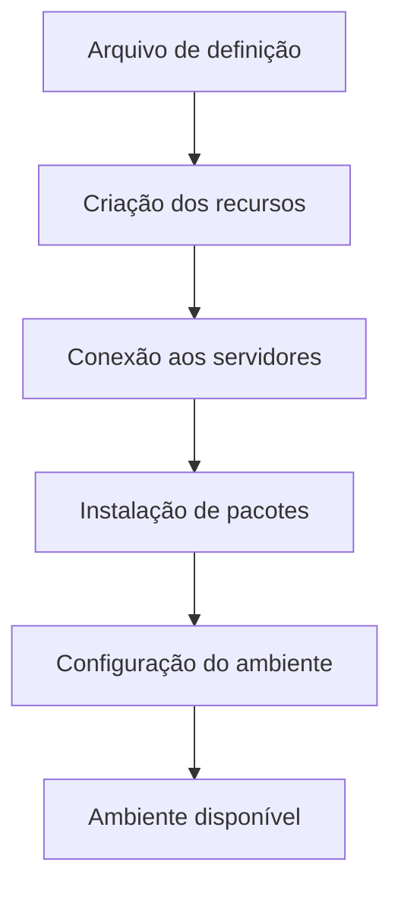
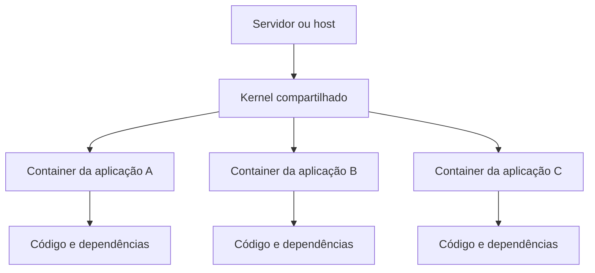

# Infraestrutura como Código e Containers em DevOps

## Objetivos da leitura

> [!info] Objetivo
> Compreender a infraestrutura como código, a automação de ambientes operacionais, suas principais ferramentas e o uso de containers em projetos DevOps.

A leitura apresenta a **Infraestrutura como Código (IaC)** como uma metodologia voltada à automação da infraestrutura de TI. Também aborda os benefícios da automatização dos ambientes, algumas ferramentas empregadas nesse processo e a importância dos containers para o desenvolvimento, os testes e a disponibilização de aplicações.

**Palavras-chave:** infraestrutura como código, automação, scripts de automação, ambiente operacional e containers.

---

## 1. Infraestrutura como Código

> [!info] Conceito
> Infraestrutura como Código é uma metodologia que permite configurar e administrar ambientes de TI por meio de arquivos de código.

A **Infraestrutura como Código**, conhecida pela sigla **IaC**, proveniente de *Infrastructure as Code*, permite que os times de DevOps forneçam uma infraestrutura gerenciável e automatizada. Nesse contexto, infraestrutura corresponde ao conjunto de configurações necessárias para que um software seja desenvolvido, testado e disponibilizado aos usuários.

A IaC pode ser aplicada a recursos físicos ou virtuais, como servidores, máquinas virtuais e serviços em nuvem. Por meio de códigos, torna-se possível configurar e gerenciar os serviços e as aplicações hospedadas nesses ambientes.

Essa metodologia faz parte da cultura ágil porque reduz o tempo e o esforço dedicados às tarefas manuais. Em vez de realizar repetidamente as mesmas configurações, os profissionais podem programar o ambiente para assumir o estado necessário ao funcionamento de cada sistema.



> [!tip] Resumindo
> A IaC transforma a configuração da infraestrutura em um processo programável, automatizado, reproduzível e escalável.

---

## 2. Scripts de automação

> [!info] Scripts
> Scripts são arquivos com comandos interpretados por um programa, como um *shell*, para executar tarefas automaticamente.

Os códigos utilizados no gerenciamento da infraestrutura são semelhantes aos scripts de programação empregados na automação de tarefas executadas em servidores. Esses arquivos podem conter comandos de configuração, monitoramento e manutenção.

Um exemplo apresentado no material é um *shell script* que consulta o estado de um servidor por meio de uma requisição. Se o servidor não retornar o código HTTP 200, indicativo de que respondeu adequadamente à verificação, o script registra o problema e executa um comando para reiniciar o serviço.

```bash
#!/bin/bash

codigo_http=$(curl --write-out %{http_code} --silent --output /dev/null www.app.com.br)

if [ $codigo_http -ne 200 ]; then
    echo "Houve um problema com o servidor, tentando reiniciá-lo"
    systemctl restart httpd
fi
```

Esse tipo de script pode ser executado periodicamente para verificar se as aplicações continuam disponíveis. A automatização diminui a necessidade de acompanhamento manual e reduz a ocorrência de erros humanos durante tarefas repetitivas.

Um script isolado pode atender à configuração ou ao monitoramento de tarefas simples em um único servidor. Entretanto, ambientes corporativos geralmente possuem vários servidores. Por isso, a IaC procura automatizar a configuração de todo o ambiente sem exigir que o administrador acesse individualmente cada máquina.

> [!warning] Atenção
> A IaC não se limita a executar um script em um servidor. Seu propósito mais amplo é automatizar, de maneira coordenada e escalável, o provisionamento de toda a infraestrutura.

---

## 3. Provisionamento automatizado

> [!info] Provisionamento
> Provisionar significa preparar os recursos e as configurações necessários para que um ambiente possa ser utilizado.

O **provisionamento com infraestrutura como código** consiste em criar e configurar ambientes de maneira automática e escalável. Entre as atividades automatizadas estão:

- criação de servidores;
- conexão aos servidores;
- instalação de pacotes;
- configuração de programas e serviços;
- preparação dos ambientes de desenvolvimento, testes e produção.

Essas etapas podem ser descritas em um único arquivo de definição do ambiente. Assim, o arquivo passa a determinar como a infraestrutura deve ser criada e configurada, evitando que cada tarefa seja realizada manualmente.

A própria definição em código também funciona como um registro confiável das alterações realizadas pelo time de operações. Isso simplifica a documentação e amplia a **rastreabilidade**, isto é, a possibilidade de acompanhar as modificações efetuadas ao longo do projeto.

> [!tip] Resumindo
> Na IaC, o código não apenas executa a configuração: ele também documenta como o ambiente deve ser construído.

---

## 4. Benefícios da Infraestrutura como Código

> [!info] Benefícios
> A IaC torna o gerenciamento da infraestrutura mais rápido, consistente, escalável e menos sujeito a erros manuais.

O fornecimento tradicional de infraestrutura para ambientes de desenvolvimento e produção costuma ser manual, caro e demorado. Com a cultura DevOps, as metodologias ágeis, a virtualização, os containers e a computação em nuvem, esse modelo rígido passa a ser substituído por uma infraestrutura mais flexível e automatizada.

Entre os principais benefícios da IaC estão:

- redução do tempo necessário para preparar os ambientes;
- diminuição do esforço manual;
- padronização das configurações;
- redução de erros humanos;
- aumento da segurança e da consistência;
- possibilidade de reconstruir ambientes com rapidez;
- escalabilidade dos recursos;
- documentação mais confiável;
- maior rastreabilidade das alterações;
- melhor colaboração entre desenvolvimento e operações.

A escalabilidade permite fornecer os recursos necessários conforme a quantidade de aplicações vinculadas ao ambiente. Como as configurações são definidas em código, o mesmo processo pode ser repetido de maneira consistente em diferentes servidores.

---

## 5. IaC e entrega contínua

> [!info] Relação com a entrega contínua
> A entrega contínua depende da automação para testar e preparar frequentemente novas versões do software.

A IaC é um importante facilitador da **entrega contínua (EC)**. Em um processo de desenvolvimento no qual novas partes do código são liberadas frequentemente, diferentes testes podem ser iniciados automaticamente para verificar o funcionamento das alterações e sua integração ao código principal.

A infraestrutura necessária aos ambientes de desenvolvimento, testes e produção também pode ser instalada e configurada por código. Cada ambiente recebe comandos específicos, evitando a preparação manual dos servidores e a escolha individual das versões de software que devem ser instaladas nas máquinas.


A IaC também integra práticas de **integração contínua (IC)** e entrega contínua, pois permite reconstruir rapidamente os ambientes utilizados ao longo do fluxo de desenvolvimento.

> [!tip] Resumindo
> A IaC fornece ambientes padronizados e automatizados para que integração, testes e entrega possam ocorrer com maior frequência e confiabilidade.

---

## 6. Ferramentas de Infraestrutura como Código

> [!info] Ferramentas
> As ferramentas de IaC ajudam a configurar e manter diversos sistemas e servidores sem depender da execução manual das tarefas.

### 6.1 Chef

O **Chef** é um sistema de gerenciamento baseado em políticas. Ele permite administrar diferentes sistemas operacionais e utiliza uma linguagem de programação declarativa, na qual se descreve o estado desejado para a infraestrutura.

### 6.2 Puppet

O **Puppet** simplifica o gerenciamento de vários fluxos de trabalho por meio de blocos de programação reutilizáveis. Seu gerenciamento é orientado a modelos, possui capacidade de expansão e pode ser executado em diferentes sistemas operacionais.

### 6.3 Ansible

O **Ansible** utiliza uma linguagem simples, permitindo criar serviços de automação de maneira rápida. Suas tarefas são executadas na ordem em que foram escritas, e a conexão com os servidores de aplicações é realizada por meio do protocolo **SSH**.

| Ferramenta | Características principais |
|---|---|
| Chef | Gerenciamento baseado em políticas, suporte a diferentes sistemas operacionais e linguagem declarativa |
| Puppet | Blocos reutilizáveis, gerenciamento orientado a modelos, escalabilidade e execução em diferentes sistemas |
| Ansible | Linguagem simples, execução sequencial das tarefas e conexão por SSH |

Essas ferramentas evitam que administradores de rede e equipes de operações precisem realizar manualmente configurações e verificações recorrentes.

> [!warning] Atenção
> A implantação de IaC exige treinamento e compreensão de todos os times envolvidos; não depende apenas da escolha de uma ferramenta.

---

## 7. Containers

> [!info] Conceito
> Container é uma unidade executável que reúne uma aplicação, suas bibliotecas e suas dependências em um ambiente isolado.

Em computação, um **container** é uma unidade executável de software na qual uma parte do sistema é empacotada com todas as bibliotecas e dependências necessárias ao seu funcionamento. Os containers compartilham o mesmo *kernel* do sistema operacional, mas mantêm os processos das aplicações isolados.

Cada container pode assumir uma responsabilidade específica. Dessa maneira, um problema ocorrido em determinado container tende a não prejudicar os outros componentes da aplicação, impedindo que seus processos interfiram diretamente nos demais.



No desenvolvimento, os containers permitem empacotar aplicações com suas dependências, deixando-as menos dependentes das características da infraestrutura, como sistema operacional, segurança e rede. Para o time de operações, representam processos isolados executados sobre um *kernel* compartilhado, sendo mais simples do que manter uma máquina virtual completa para cada aplicação.

> [!tip] Resumindo
> Containers oferecem isolamento, portabilidade e simplificação da manutenção sem exigir um sistema operacional completo para cada aplicação.

---

## 8. Docker

> [!info] Docker
> Docker é uma plataforma de código aberto destinada à criação e administração de ambientes isolados por meio de containers.

O **Docker** é uma plataforma *open source* desenvolvida em Go. A tecnologia permite utilizar recursos isolados em vez de criar uma máquina virtual completa, com um sistema operacional próprio, para cada aplicação.

Com o Docker, pode-se empacotar um ambiente de desenvolvimento, testes ou produção, assim como uma aplicação individual. Esse pacote pode ser transferido para outro *host* ou servidor que possua o Docker instalado.

Entre as vantagens apresentadas estão:

- criação de ambientes isolados;
- empacotamento da aplicação e de suas dependências;
- portabilidade entre servidores;
- maior flexibilidade para migração;
- manutenção simplificada;
- menor necessidade de administrar sistemas operacionais completos para cada aplicação.

> [!warning] Container e máquina virtual
> Um container compartilha o *kernel* do sistema hospedeiro, enquanto uma máquina virtual normalmente requer um sistema operacional completo para cada ambiente virtualizado.

---

## 9. Desafios da adoção de IaC

> [!info] Desafios
> A implantação da IaC depende de colaboração entre os times e de profissionais capacitados para desenvolver e manter os scripts de configuração.

A ausência de uma metodologia ágil pode fazer com que desenvolvimento e operações trabalhem de forma isolada, cada equipe preocupada apenas com sua própria parte do projeto. Essa falta de colaboração dificulta a disponibilização eficiente das aplicações.

Outro desafio é a necessidade de conhecimento para desenvolver scripts de configuração. Falhas nesses scripts ou erros durante a implantação nos servidores podem comprometer os ambientes. Portanto, a empresa precisa investir em treinamento, comunicação e compreensão compartilhada dos processos.

Quando corretamente implantada, a IaC ajuda a aproximar os times de desenvolvimento e operações, reduzindo atividades manuais e permitindo que os projetos sejam concluídos com maior agilidade.

---

## 10. Síntese final

> [!summary] Síntese
> A Infraestrutura como Código aplica automação ao provisionamento e à configuração dos ambientes de TI. Seus arquivos tornam a infraestrutura reproduzível, escalável, documentada e menos sujeita a erros. Ferramentas como Chef, Puppet e Ansible apoiam esse gerenciamento. Os containers, especialmente por meio do Docker, complementam essa abordagem ao empacotar aplicações e dependências em unidades isoladas e portáveis. Em conjunto, essas tecnologias fortalecem a cultura DevOps, a integração contínua e a entrega contínua.

---

# Questionário — Dúvidas frequentes

# 1

> [!question] O que é a infraestrutura como código?
>
>> [!question]- Resposta
>>
>> É uma metodologia de automação da infraestrutura de TI que permite aos times de DevOps fornecer uma infraestrutura gerenciável e automatizada.

# 2

> [!question] Quais são os benefícios de um ambiente operacional automatizado?
>
>> [!question]- Resposta
>>
>> Um ambiente operacional automatizado permite instalar e configurar ambientes de desenvolvimento, testes e produção por meio de códigos com comandos específicos para cada um. Isso substitui a configuração manual dos servidores e das versões de software que deveriam ser instaladas em cada máquina.

# 3

> [!question] O que é um container em computação?
>
>> [!question]- Resposta
>>
>> Um container representa uma unidade executável de software na qual uma parte do código do sistema é empacotada juntamente com suas bibliotecas e todas as dependências necessárias.

# 4

> [!question] O que é Docker?
>
>> [!question]- Resposta
>>
>> Docker é uma plataforma que facilita a criação e a administração de ambientes isolados. Ela possibilita empacotar um ambiente ou uma aplicação dentro de um container, tornando-o portátil para outro *host* ou servidor que tenha o Docker instalado.