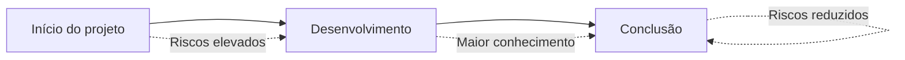
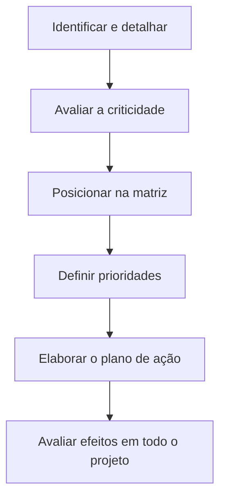

# Gerenciamento de riscos em projetos de software

## Objetivos da leitura

> [!info] Objetivo
> Compreender o conceito de risco em computação e analisar como os riscos podem ser identificados, classificados, tratados e monitorados durante o desenvolvimento e a entrega de um software.

O gerenciamento de riscos permite reconhecer antecipadamente acontecimentos incertos que podem afetar um projeto. Esses acontecimentos podem representar ameaças, quando prejudicam seus resultados, ou oportunidades, quando contribuem para melhorar o desempenho.

**Palavras-chave:** gerenciamento de riscos, desenvolvimento de software, identificação de riscos, monitoramento de riscos e categorização dos riscos.

---

## 1. Riscos em computação

> [!info] Conceito
> Risco é qualquer componente de incerteza capaz de afetar positiva ou negativamente os resultados de um projeto.

Os riscos não se limitam a acontecimentos prejudiciais. Uma oportunidade que possa aumentar o desempenho, reduzir custos ou favorecer a entrega também constitui um risco, pois seu acontecimento não é garantido.

Embora provoquem incerteza, os riscos podem ser identificados, qualificados e quantificados. Isso possibilita estimar dois elementos fundamentais:

- **Probabilidade:** possibilidade de o risco ocorrer;
- **Impacto:** consequência que sua ocorrência produzirá sobre o projeto.

> [!tip] Resumindo
> O risco resulta da combinação entre a incerteza de um acontecimento e os efeitos que ele pode produzir no projeto.

---

## 2. Gerenciamento de riscos

> [!info] Conceito
> Gerenciamento de riscos é o processo de compreender as incertezas do projeto e planejar maneiras de aproveitá-las ou reduzir seus efeitos.

Gerenciar riscos significa identificar as causas das incertezas, analisar suas consequências e propor respostas adequadas. Para que esse processo seja eficiente, o projeto deve possuir um ciclo de vida claramente definido, com início, desenvolvimento e encerramento.

No começo do projeto, normalmente são utilizados poucos recursos, mas o grau de incerteza é elevado. À medida que o trabalho avança, mais recursos são empregados e o conhecimento sobre o projeto aumenta, reduzindo progressivamente os riscos.

> [!warning] Atenção
> Os riscos tendem a ser maiores no início do projeto porque ainda existem muitas informações desconhecidas e fatores capazes de inviabilizar o desenvolvimento.

---

## 3. Identificação de riscos

> [!info] Conceito
> A identificação de riscos consiste no levantamento sistemático das ameaças e oportunidades que podem surgir durante o desenvolvimento ou a vida útil do software.

A identificação deve envolver o gerente, os integrantes da equipe, especialistas, outros gerentes e os *stakeholders*. A participação conjunta amplia a capacidade de detectar acontecimentos que possam afetar diferentes áreas do projeto.

Depois do levantamento, cada risco deve ser analisado detalhadamente para determinar seu grau de criticidade e suas possíveis consequências. Também é necessário prever quais decisões serão tomadas caso o risco realmente aconteça.

Os riscos podem provocar, entre outras consequências:

- atrasos na entrega;
- aumento dos custos;
- perda de profissionais qualificados;
- falhas técnicas;
- problemas de integração;
- redução da segurança;
- indisponibilidade de equipamentos ou infraestrutura.

A documentação do gerenciamento de riscos deve registrar as ocorrências identificadas, sua classificação, as possíveis respostas e os responsáveis pelo acompanhamento. Essas informações precisam ser conhecidas por toda a equipe responsável pela gestão do projeto.

---

## 4. Análises qualitativa e quantitativa

> [!info] Conceito
> A análise qualitativa avalia a natureza e a importância dos efeitos do risco, enquanto a análise quantitativa estima numericamente suas consequências.

| Tipo de análise | Finalidade | Exemplos |
|---|---|---|
| **Qualitativa** | Determinar como o risco pode afetar o projeto e estabelecer prioridades | Classificar o risco como baixo, médio ou alto |
| **Quantitativa** | Mensurar numericamente os possíveis efeitos do risco | Estimar dias de atraso ou custos adicionais |

As duas análises são complementares. A análise qualitativa permite reconhecer os riscos que merecem maior atenção, enquanto a quantitativa ajuda a calcular os recursos, custos e prazos envolvidos em seu tratamento.

> [!tip] Resumindo
> A análise qualitativa responde principalmente **como e quanto o risco é relevante**; a quantitativa estima **quanto ele pode custar ou atrasar o projeto**.

---

## 5. Processo de gerenciamento de riscos

A leitura apresenta seis processos principais para controlar os riscos que podem surgir durante um projeto:

![[Pasted image 20260910182500.png]]

### 5.1 Planejamento do gerenciamento

Define como as atividades relacionadas aos riscos serão executadas. Nessa etapa, estabelecem-se responsabilidades, procedimentos, critérios de classificação e recursos necessários.

### 5.2 Identificação dos riscos

Reconhece e documenta as ameaças e oportunidades capazes de afetar o projeto.

### 5.3 Análise qualitativa

Avalia os riscos segundo critérios como probabilidade, impacto e criticidade, permitindo estabelecer prioridades.

### 5.4 Análise quantitativa

Estima numericamente os efeitos dos riscos, como custos adicionais, perdas financeiras ou atrasos no cronograma.

### 5.5 Planejamento de respostas

Determina as ações que deverão ser executadas para reduzir ameaças, aproveitar oportunidades ou lidar com as consequências dos riscos.

### 5.6 Monitoramento e controle

Acompanha os riscos identificados, detecta novos riscos e verifica se as respostas adotadas estão produzindo os resultados esperados.

> [!info] Monitoramento contínuo
> O gerenciamento não termina depois da identificação. Os riscos e a eficácia das respostas precisam ser acompanhados durante todo o projeto.

Ferramentas específicas podem automatizar o monitoramento e apoiar a tomada de decisão. Elas auxiliam no acompanhamento dos riscos conhecidos, na identificação de novas ocorrências e na avaliação das medidas adotadas.

---

## 6. Categorização dos riscos

> [!info] Conceito
> A categorização agrupa riscos semelhantes para facilitar sua análise e orientar as decisões de tratamento.

A definição das categorias depende do escopo do projeto e dos recursos disponíveis na organização. Entretanto, projetos de software apresentam algumas categorias recorrentes.

| Categoria | Exemplos de riscos |
|---|---|
| **Técnica** | Falhas, configuração do ambiente operacional, complexidade dos sistemas, integração entre interfaces e segurança |
| **Programática** | Indisponibilidade de pessoal capacitado, impactos ambientais, falhas de comunicação e mudanças nas políticas da empresa |
| **Suporte** | Segurança do sistema, equipamentos, recursos humanos, interoperabilidade, suporte computacional e infraestrutura |
| **Custo** | Erros de estimativa, gastos extras com recursos técnicos ou suporte, atrasos e contratação de pessoal qualificado |
| **Cronograma** | Erros na estimativa dos prazos, perda de profissionais, atrasos no treinamento e indisponibilidade de recursos técnicos |

Um mesmo acontecimento pode afetar mais de uma categoria. A perda de um profissional especializado, por exemplo, pode comprometer o cronograma, elevar os custos e produzir dificuldades técnicas.

---

## 7. Classificação e priorização dos riscos

Nakashima e Carvalho (2004) sintetizam a identificação e a classificação dos riscos em três passos.

### 7.1 Passo 1 — identificar, documentar e pontuar

Os riscos devem ser registrados com a maior quantidade possível de informações. Depois disso, sua criticidade é avaliada mediante uma pontuação:

| Classificação | Pontuação |
|---|---:|
| **Baixa** | 1 a 3 |
| **Média** | 4 a 6 |
| **Alta** | 7 a 9 |

A documentação detalhada facilita a compreensão das causas, dos efeitos e das possíveis respostas para cada ocorrência.

### 7.2 Passo 2 — posicionar os riscos na matriz

Os identificadores dos riscos são inseridos em uma matriz que relaciona seu impacto com sua magnitude. A posição ocupada indica a prioridade de gerenciamento.

![[Pasted image 20260910182508.png]]

| Região da matriz | Nível do risco | Tratamento |
|---|---|---|
| **Vermelha** | Alto ou crítico | Deve ser gerenciado imediatamente |
| **Intermediária** | Médio | Deve ser monitorado de perto |
| **Azul** | Baixo | Não exige tratamento imediato, mas deve continuar registrado |

A matriz permite visualizar rapidamente quais riscos exigem maior atenção. Os riscos de impacto e magnitude elevados ficam na região crítica, enquanto os de menor relevância permanecem nas áreas de acompanhamento.

> [!warning] Atenção
> Um risco classificado como baixo não deve ser ignorado definitivamente. Mudanças no projeto podem aumentar sua probabilidade, seu impacto ou sua magnitude.

### 7.3 Passo 3 — elaborar o plano de ação

O plano de ação estabelece como cada risco será tratado. A análise deve considerar todas as interfaces do projeto, pois uma medida adotada para solucionar um problema pode provocar consequências negativas em outra área.

> [!tip] Resumindo
> Um gerenciamento claro depende de três atividades: registrar detalhadamente os riscos, classificá-los segundo sua importância e elaborar respostas que considerem o projeto como um todo.

---

## 8. Monitoramento e automação

> [!info] Conceito
> Monitorar riscos significa acompanhar continuamente sua evolução, identificar novas ocorrências e avaliar a eficácia das respostas planejadas.

A identificação não é uma atividade isolada. Durante o desenvolvimento, riscos existentes podem se alterar e novos riscos podem surgir. Por isso, o monitoramento deve ocorrer ao longo de todo o projeto.

Ferramentas automatizadas podem contribuir para:

- acompanhar riscos já identificados;
- detectar novas ameaças e oportunidades;
- registrar mudanças de probabilidade ou impacto;
- alertar os responsáveis;
- avaliar a eficácia das decisões;
- apoiar a tomada de decisão.

Processos exclusivamente manuais estão mais sujeitos a falhas e omissões. A automação melhora o controle, mas não elimina a necessidade de análise humana e participação da equipe.

---

## 9. Segurança como exemplo de risco

O filme *Invasores: nenhum sistema está a salvo* (2014) demonstra como pequenas vulnerabilidades, aparentemente insignificantes, podem ser exploradas para invadir sistemas, manipular dispositivos e roubar informações.

Esse exemplo reforça a importância de reconhecer precocemente falhas de segurança. Uma brecha pequena pode produzir consequências graves quando não é identificada, avaliada e tratada adequadamente.

---

## 10. Leituras indicadas

- **Artigo:** NAKASHIMA, Daniel Toshimitsu Vieira; CARVALHO, Marly Monteiro de. *Identificação de riscos em projetos de TI*. O trabalho apresenta métodos para identificar riscos em projetos de software.
- **Livro:** NOGUEIRA, Marcelo. *Engenharia de software: um framework para a gestão de riscos em projetos de software*. A obra apresenta uma estrutura para gestão de riscos e uma relação de riscos universais que podem ser tratados preventivamente.

---

## Síntese final

> [!summary] Síntese
> O gerenciamento de riscos identifica e trata acontecimentos incertos capazes de ameaçar ou beneficiar um projeto. O processo envolve planejamento, identificação, análises qualitativa e quantitativa, planejamento de respostas e monitoramento contínuo.

Os riscos devem ser levantados de forma colaborativa, documentados detalhadamente e classificados conforme sua criticidade. Categorias como técnica, programática, suporte, custo e cronograma ajudam a organizar o processo.

A matriz de impacto e magnitude permite estabelecer prioridades: riscos críticos exigem intervenção imediata, riscos médios devem ser acompanhados de perto e riscos baixos podem permanecer sob monitoramento. O plano de ação deve considerar os efeitos de cada resposta sobre todas as áreas do projeto.

A participação da equipe, dos especialistas, dos gerentes e dos *stakeholders*, associada ao uso de ferramentas de automação, torna o gerenciamento mais confiável e reduz a possibilidade de falhas que prejudiquem a entrega do software.

---

# Questionário — Dúvidas frequentes

# 1

> [!question] O que é risco em computação?
>
>> [!question]- Resposta
>>
>> Risco é qualquer ocorrência capaz de afetar o resultado de um projeto. Ele compreende todos os componentes de incerteza relacionados ao projeto, tanto negativa quanto positivamente. Além das ameaças que podem prejudicar ou inviabilizar a entrega, as oportunidades também são consideradas riscos porque podem proporcionar melhor desempenho.

# 2

> [!question] Como é possível categorizar os riscos?
>
>> [!question]- Resposta
>>
>> A categorização depende do escopo do projeto e dos recursos disponíveis na empresa. Entre as categorias comuns aos projetos de software estão os riscos técnicos, programáticos, de suporte, de custo e de cronograma.

# 3

> [!question] Quais são os passos ou etapas do gerenciamento de riscos?
>
>> [!question]- Resposta
>>
>> De acordo com Santos (2002), as etapas são: planejamento do gerenciamento de riscos, identificação de riscos, análise qualitativa de riscos, análise quantitativa de riscos, planejamento de respostas aos riscos e monitoramento e controle de riscos.

# 4

> [!question] O que representam as três áreas da matriz de impacto x magnitude?
>
>> [!question]- Resposta
>>
>> As três áreas indicam a prioridade de gerenciamento. A região vermelha reúne os riscos críticos, que receberam as maiores pontuações e devem ser tratados imediatamente. A região intermediária contém os riscos médios, que precisam ser monitorados de perto. A região azul representa os riscos baixos, que não exigem gerenciamento imediato porque podem ser solucionados com o tempo ou causar poucos danos caso ocorram.