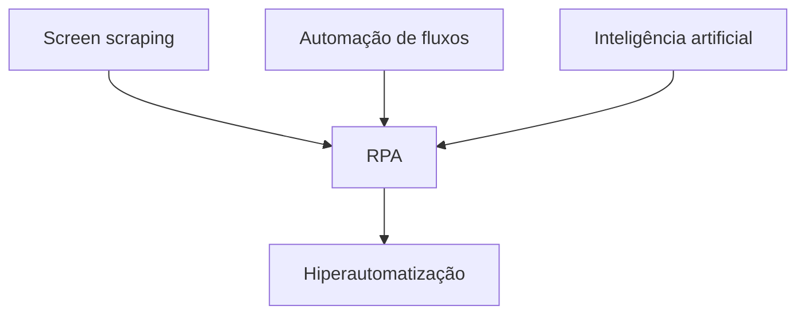

# Hiperautomatização

## Objetivo da aprendizagem

> [!info] Objetivo
> Compreender o funcionamento da hiperautomatização, suas tecnologias fundamentais, seus benefícios e sua relação com a automação robótica de processos.

A hiperautomatização combina diferentes ferramentas de automação com inteligência artificial (IA), aprendizagem de máquina (*Machine Learning*) e automação robótica de processos (RPA). Seu propósito é automatizar não apenas tarefas repetitivas, mas também processos mais amplos que envolvem análise de dados, integração de sistemas e apoio à tomada de decisão.

**Palavras-chave:** hiperautomatização, inteligência artificial, RPA, *Machine Learning* e automatização de processos.

## Da automação à hiperautomatização

> [!info] Conceito
> A hiperautomatização é uma evolução da automação tradicional baseada na integração de tecnologias capazes de executar, analisar e aperfeiçoar processos.

A automação tradicional utiliza softwares para substituir atividades manuais, repetitivas ou baseadas em regras. Isso aumenta a produtividade e libera os colaboradores para tarefas que exigem planejamento, criatividade e conhecimento especializado.

No desenvolvimento de software, a automação também ajuda a enfrentar problemas como a sobrecarga dos desenvolvedores, a necessidade contínua de novas funcionalidades e a rotatividade das equipes. Ferramentas automatizadas e *frameworks* podem reduzir o trabalho operacional, preservar a continuidade dos processos e acelerar a entrega de produtos.

A cultura DevOps amplia esse uso ao integrar pessoas, processos e tecnologias ao longo do projeto. Nesse contexto, a hiperautomatização surge como uma infraestrutura formada pela combinação de ferramentas capazes de automatizar tarefas operacionais, analisar processos e auxiliar decisões.

Diferentemente de uma ferramenta de automação utilizada isoladamente, a hiperautomatização integra diversos recursos tecnológicos. A IA amplia essa capacidade ao permitir que os sistemas processem dados, reconheçam padrões e executem algumas tarefas cognitivas anteriormente dependentes da intervenção humana.

> [!warning] Atenção
> A hiperautomatização não corresponde a uma única tecnologia. Ela resulta da integração coordenada de diferentes ferramentas de automação, gerenciamento, inteligência artificial e análise de dados.

> [!tip] Resumindo
> A automação executa tarefas específicas; a hiperautomatização conecta tecnologias e processos para automatizar fluxos mais amplos e apoiar decisões.

## Fluxo da hiperautomatização

> [!info] Evolução do processo
> A hiperautomatização é alcançada pela ampliação gradual da automação, desde tarefas baseadas em regras até operações digitais apoiadas por inteligência.

A evolução apresentada no material começa com a automação de tarefas, baseada em regras e RPA. Em seguida, avança para a automação de processos completos, por meio de fluxos de trabalho, até alcançar a operação digital dos negócios.

Essa trajetória é sustentada por três grupos de recursos:

- processamento de eventos, arquiteturas adaptativas e APIs;
- experiência conversacional, como *chatbots* e assistentes virtuais;
- inteligência artificial, aprendizagem de máquina e algoritmos avançados.

O fluxo demonstra que a hiperautomatização não elimina a automação básica. Em vez disso, incorpora tarefas automatizadas a processos maiores, adicionando integração, capacidade de adaptação, interfaces conversacionais e inteligência para apoiar as operações do negócio.

> [!tip] Resumindo
> A hiperautomatização representa a convergência entre automação de tarefas, automação de processos e inteligência aplicada às operações digitais.

## Benefícios da hiperautomatização

> [!info] Benefícios
> A hiperautomatização aumenta a produtividade, amplia a análise de dados, integra recursos tecnológicos e melhora a execução dos processos organizacionais.

### Aumento da produtividade

As máquinas podem executar tarefas complexas em menor tempo e manter a operação de serviços repetitivos. Isso permite que as equipes concentrem seus esforços em atividades estratégicas, intelectuais e de planejamento.

Um exemplo é o *chatbot*, software capaz de conversar com pessoas por meio de linguagem natural. Utilizado em aplicativos de mensagens, sites e outras plataformas, ele pode receber solicitações, oferecer respostas iniciais e direcionar cada pedido ao setor responsável. Dessa maneira, melhora o atendimento e reduz o trabalho manual das equipes.

### Apoio à tomada de decisão

A aprendizagem de máquina permite que sistemas aprendam com os dados, identifiquem padrões e apoiem decisões com pouca ou nenhuma intervenção humana. No ambiente corporativo, essa capacidade pode tornar determinadas decisões baseadas em dados mais rápidas, eficientes e consistentes.

### Análise de dados

A análise dos dados produzidos pela organização permite estabelecer metas de curto, médio e longo prazo. Também pode contribuir para otimizar entregas, conquistar clientes, melhorar produtos e oferecer atendimento mais pontual e personalizado.

Para produzir resultados adequados, essa análise precisa considerar o fluxo completo do projeto. Por isso, a integração de ferramentas é importante para reunir e processar informações originadas em diferentes etapas.

### Integração tecnológica

A hiperautomatização conecta recursos tecnológicos mesmo quando eles são empregados em atividades diferentes. Essa integração permite centralizar informações, documentos, tarefas e requisitos, tornando possível automatizar processos que anteriormente permaneciam isolados.

> [!warning] Atenção
> Sistemas baseados em IA dependem dos dados usados em sua operação. A tomada de decisão automatizada apresentada no material está fundamentada na capacidade de aprender com dados e reconhecer padrões.

> [!tip] Resumindo
> Os principais benefícios são maior produtividade, decisões orientadas por dados, análise integrada das informações e conexão entre diferentes tecnologias e processos.

## Automação Robótica de Processos — RPA

> [!info] Conceito
> RPA é o uso de robôs de software para interagir com sistemas e aplicações, automatizando atividades e reduzindo a carga de trabalho humano.

A sigla RPA vem de *Robotic Process Automation*, ou automação robótica de processos. Seus robôs são programas desenvolvidos para executar ações em sistemas e aplicações, principalmente em tarefas repetitivas e operacionais.

A trajetória da RPA está relacionada a três tecnologias principais:

| Tecnologia | Características |
|---|---|
| *Screen scraping* | Raspagem de dados utilizada como ponte entre sistemas atuais e sistemas legados incompatíveis com integrações. Pode exigir trabalho manual e profissionais qualificados. |
| *Workflow automation* | Automação de fluxos de trabalho formados por uma sequência de ações. Suas origens remontam à organização dos processos da Revolução Industrial e sua aplicação foi ampliada pelas ferramentas de automação e robótica. |
| Inteligência artificial | Capacidade de realizar tarefas normalmente associadas aos seres humanos, como analisar informações e tomar decisões, permitindo automatizar fluxos mais complexos. |

A RPA busca integrar e automatizar tarefas antes executadas manualmente. Quando enriquecida com técnicas de IA e aprendizagem de máquina, torna-se uma tecnologia habilitadora da hiperautomatização.

Essa combinação acrescenta flexibilidade e permite tratar processos que a automação convencional não consegue atender adequadamente. Entre os exemplos estão processos antigos e sem documentação ou atividades que dependem de dados não estruturados, cujos tipos e dimensões de entrada não podem ser previstos com facilidade.

> [!warning] Atenção
> RPA e hiperautomatização não são sinônimos. A RPA automatiza interações e tarefas, enquanto a hiperautomatização combina RPA, IA e outras tecnologias para integrar e automatizar processos mais abrangentes.

> [!tip] Resumindo
> A RPA fornece robôs de software para executar tarefas; associada à IA, ela passa a atender fluxos mais complexos e contribui para a hiperautomatização.

## Tecnologias associadas

> [!info] Infraestrutura tecnológica
> A hiperautomatização reúne técnicas avançadas para identificar, integrar, executar e aperfeiçoar processos automatizáveis.

Entre as tecnologias associadas à hiperautomatização estão:

- automação robótica de processos;
- inteligência artificial;
- aprendizagem de máquina;
- automação de fluxos de trabalho;
- processamento de eventos;
- APIs e arquiteturas adaptativas;
- *chatbots* e assistentes virtuais;
- mineração de processos;
- algoritmos avançados;
- ferramentas de gestão de projetos e processos.

A mineração de processos e as ferramentas de gerenciamento podem reconhecer como os fluxos de negócio funcionam e ajudar a estabelecer os meios necessários para automatizá-los. Assim, processos já automatizados podem ser combinados com outros fluxos, ampliando a automação para o projeto ou para a organização como um todo.

## Aplicação nas organizações

> [!info] Transformação do trabalho
> A hiperautomatização transfere atividades burocráticas e manuais para as máquinas, permitindo maior dedicação humana às partes estratégicas do projeto.

Nas empresas de desenvolvimento de software, a hiperautomatização pode fortalecer as equipes ao reduzir o tempo gasto com operações repetitivas. Os profissionais passam a dedicar maior atenção às partes complexas e significativas do projeto, enquanto os sistemas executam tarefas burocráticas, manuais ou orientadas por regras e dados.

Esse conceito ainda é relativamente novo e permanece em evolução. À medida que surgem novas tecnologias e ferramentas de automação, novas possibilidades de integração e aplicação são incorporadas ao ambiente corporativo.

A hiperautomatização pode, portanto, ser entendida como uma infraestrutura tecnológica que avalia e amplia as capacidades de automação de uma organização. Em vez de automatizar apenas atividades isoladas, ela conecta processos e tecnologias para alcançar uma operação mais integrada.

## Síntese final

> [!summary] Síntese
> A hiperautomatização combina automação, RPA, inteligência artificial, aprendizagem de máquina e outras tecnologias para integrar processos, analisar dados e reduzir o trabalho manual.

A automação tradicional concentra-se principalmente em tarefas específicas e baseadas em regras. A hiperautomatização amplia esse alcance, conectando tarefas, fluxos de trabalho e operações digitais em uma infraestrutura integrada.

A RPA desempenha um papel central ao utilizar robôs de software para interagir com sistemas e aplicações. Quando associada à IA e à aprendizagem de máquina, passa a atender situações mais complexas, incluindo processos com dados não estruturados ou com pouca documentação.

Entre os principais resultados estão o aumento da produtividade, a integração de recursos tecnológicos, a melhoria da análise de dados e o apoio às decisões. Dessa forma, as equipes podem concentrar-se em planejamento e atividades intelectuais, enquanto as máquinas assumem parte do trabalho operacional.

# Questionário — Dúvidas frequentes

## 1

> [!question] O que é hiperautomatização?
>
>> [!question]- Resposta
>>
>> A hiperautomatização é uma infraestrutura de tecnologias avançadas que combina técnicas de automação com inteligência artificial, aprendizagem de máquina e outros recursos. Seu objetivo é integrar e automatizar tarefas e processos mais amplos dentro da organização.

## 2

> [!question] Quais são os benefícios da hiperautomatização em um ambiente operacional?
>
>> [!question]- Resposta
>>
>> No ambiente operacional, a inteligência artificial permite que decisões baseadas em dados sejam tomadas de maneira mais eficiente e eficaz. A hiperautomatização também possibilita integrar diferentes ferramentas, analisar grandes fluxos de dados, aumentar a produtividade e reduzir a execução manual de tarefas repetitivas.

## 3

> [!question] O que é RPA?
>
>> [!question]- Resposta
>>
>> *Robotic Process Automation* (RPA), ou automação robótica de processos, é o uso de robôs de software criados para interagir com sistemas e aplicações. Esses robôs automatizam atividades, potencializam os processos e reduzem a carga de trabalho humano.

## 4

> [!question] O que é inteligência artificial (IA)?
>
>> [!question]- Resposta
>>
>> Inteligência artificial é a capacidade de uma máquina realizar tarefas normalmente executadas por seres humanos, como analisar informações e tomar decisões. Seu uso permite automatizar fluxos completos de trabalho com maior rapidez e eficiência.