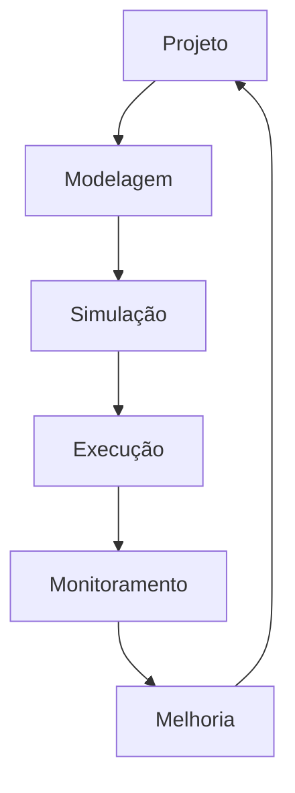
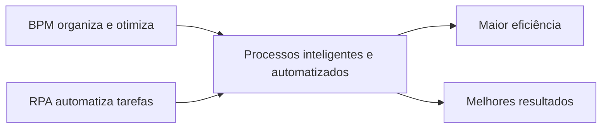

# Gerenciamento de Processos de Negócios e Automação Robótica

## Gestão de processos de negócios — BPM

> [!info] Conceito
> O *Business Process Management* (BPM) permite analisar, modelar, medir, aperfeiçoar e otimizar os processos de uma organização.

Uma organização funciona como um sistema formado por diversos processos de negócio. Esses processos organizam logicamente as atividades que precisam ser executadas, definem como o trabalho deve ser realizado e contribuem para alcançar os resultados desejados. Eles podem gerar valor diretamente para os clientes ou apoiar e gerenciar outras atividades organizacionais.

O BPM promove a revisão e o redesenho contínuos dos processos. Com isso, pode simplificar fluxos de trabalho, aumentar a eficiência, reduzir custos e melhorar a tomada de decisão. O monitoramento constante, associado à análise de indicadores, permite identificar problemas e alinhar as operações aos objetivos estratégicos.

> [!tip] Resumindo
> BPM é uma abordagem contínua para compreender, controlar e melhorar a maneira como o trabalho é realizado dentro de uma organização.

## Tipos de processos de negócio

> [!info] Classificação
> Os processos de negócio podem ser primários, de suporte ou de gerenciamento, conforme a função desempenhada na organização.

### Processos primários

São as atividades essenciais que geram valor diretamente para o cliente. Representam as operações responsáveis pela percepção que o cliente desenvolve sobre os produtos ou serviços oferecidos e proporcionam uma visão completa do funcionamento do negócio.

### Processos de suporte

Apoiam a execução dos processos primários e de gerenciamento, sem entregar valor diretamente ao cliente. Também podem oferecer suporte uns aos outros e ser organizados em diferentes níveis, como processos de segundo ou terceiro nível.

### Processos de gerenciamento

São responsáveis por medir, monitorar, controlar e orientar as atividades organizacionais. Seu objetivo é garantir o cumprimento das metas de desempenho e dos requisitos operacionais, financeiros e regulatórios.

| Tipo de processo | Função principal | Relação com o cliente |
|---|---|---|
| Primário | Executar atividades essenciais e gerar valor | Direta |
| Suporte | Apoiar outros processos | Indireta |
| Gerenciamento | Medir, controlar e orientar a organização | Indireta |

> [!tip] Resumindo
> Os processos primários entregam valor; os processos de suporte viabilizam essa entrega; e os processos de gerenciamento asseguram que tudo permaneça alinhado às metas.

## Tipos de gerenciamento de processos

> [!info] Formas de gerenciamento
> O gerenciamento de processos pode ser centrado na integração, no ser humano ou em documentos.

### Centrado na integração

Abrange processos com pouca participação humana, baseados principalmente em APIs e mecanismos responsáveis pela troca de dados entre sistemas, como plataformas de recursos humanos e de relacionamento com clientes.

Uma API, ou interface de programação de aplicação, é um recurso que permite que diferentes sistemas se comuniquem e compartilhem dados ou funcionalidades.

### Centrado no ser humano

Depende intensamente da participação das pessoas. Por isso, exige interfaces intuitivas e recursos que orientem os responsáveis durante todas as etapas do processo.

### Centrado em documentos

Organiza-se em torno de um documento específico, como um contrato, que precisa passar por diferentes aprovações até que seja firmado um acordo entre cliente e fornecedor.

> [!warning] Atenção
> Essa classificação considera o elemento central do gerenciamento: integração entre sistemas, participação humana ou circulação de documentos.

## Ciclo de vida do BPM

> [!info] Processo cíclico
> O BPM é desenvolvido em seis etapas contínuas: projeto, modelagem, simulação, execução, monitoramento e melhoria.

### Projeto

É a etapa de planejamento e elaboração da estratégia. Define o que será executado e como isso ocorrerá, procurando relacionar os objetivos organizacionais às necessidades dos clientes e ao futuro da organização.

### Modelagem

Busca compreender detalhadamente a situação atual do processo. Para isso, reúne informações e documentos, constrói um modelo do processo e verifica como os objetivos existentes estão sendo cumpridos.

### Simulação

Representa antecipadamente como o processo poderá funcionar no futuro. Permite prever acontecimentos e identificar fatores capazes de afetar as metas, as estratégias organizacionais e a satisfação dos clientes.

### Execução

Corresponde à publicação e à realização dos processos previamente planejados, modelados e simulados. Inclui o treinamento das equipes e dos clientes para utilização das ferramentas e execução das atividades.

Nessa etapa também podem ser medidos indicadores de desempenho, avaliados os resultados e verificado o nível de alcance das metas organizacionais.

### Monitoramento

Analisa fatores como duração, riscos, custos, capacidade produtiva, qualidade, erros e anomalias que possam prejudicar as entregas aos clientes.

O monitoramento pode utilizar o *Business Activity Monitoring* (BAM), sistema que acompanha indicadores de desempenho em tempo real e favorece decisões mais rápidas.

### Melhoria

Compara os resultados alcançados com as metas estabelecidas. A partir dessa comparação, os processos são refinados, alinhados à estratégia e otimizados, considerando sua eficiência e eficácia.

> [!tip] Resumindo
> O ciclo BPM transforma o conhecimento obtido durante a execução e o monitoramento em melhorias que alimentam um novo planejamento.

## Automação Robótica de Processos — RPA

> [!info] Conceito
> A *Robotic Process Automation* (RPA) utiliza robôs de software, chamados *bots*, para executar tarefas repetitivas anteriormente realizadas por pessoas.

Os *bots* podem realizar atividades rotineiras como transferir dados de um banco de dados para uma planilha, enviar mensagens, efetuar ligações, fazer cobranças e prestar atendimento por meio de chats. Embora cada robô execute tarefas relativamente simples, a atuação conjunta de vários *bots* pode proporcionar benefícios significativos.

Entre as principais vantagens da RPA estão a simplicidade de implantação, o baixo custo e o reduzido risco. Em determinados casos, o próprio usuário final pode treinar e implantar um robô sem possuir conhecimentos de desenvolvimento de sistemas. Essas características favorecem um elevado retorno sobre o investimento.

A RPA também libera os profissionais de tarefas demoradas e repetitivas, permitindo que se dediquem a atividades de maior relevância.

> [!tip] Resumindo
> RPA automatiza atividades operacionais repetitivas e baseadas em regras, aumentando a produtividade das equipes.

## Integração entre BPM e RPA

> [!info] Complementaridade
> O BPM organiza e aperfeiçoa os processos completos, enquanto a RPA automatiza tarefas específicas executadas dentro deles.

O BPM modela, analisa e otimiza processos de ponta a ponta para atender aos objetivos estratégicos. Ele procura substituir práticas *ad hoc*, isto é, soluções personalizadas e estruturadas apenas para necessidades específicas, por processos contínuos e organizados de melhoria.

A RPA complementa essa abordagem automatizando tarefas repetitivas, previsíveis, baseadas em regras ou já em execução. Quando as duas tecnologias são combinadas, torna-se possível melhorar tanto a estrutura geral do processo quanto sua execução operacional.

> [!tip] Resumindo
> A combinação entre BPM e RPA permite administrar processos de maneira estratégica e executar automaticamente suas atividades rotineiras.

## RPA associada à Inteligência Artificial

> [!info] Automação inteligente
> A Inteligência Artificial amplia a capacidade dos robôs de software ao permitir que reconheçam alterações e aprendam novos caminhos.

Os robôs tradicionais de RPA seguem um conjunto de tarefas repetitivas e regras previamente definidas. Em geral, eles não aprendem enquanto trabalham. Quando ocorre alguma mudança na atividade automatizada, precisam ser treinados novamente.

Ao incorporar algoritmos de Inteligência Artificial, o robô pode identificar alterações no ambiente, prever ou construir novas regras e aprender maneiras diferentes de executar uma tarefa. Essa integração possibilita atendimentos mais personalizados e maior agilidade nas atividades diárias.

Os robôs também podem ser empregados no monitoramento de bancos de dados, servidores, infraestruturas e redes. Dessa maneira, a união de BPM, RPA e Inteligência Artificial favorece processos mais inteligentes, produtos mais atrativos e serviços mais diversificados.

> [!warning] Atenção
> Um robô de RPA comum apenas segue regras; a capacidade de identificar mudanças e aprender novos caminhos depende da incorporação de recursos de Inteligência Artificial.

## Conteúdos complementares

O curta-metragem de ficção científica *Sunspring* foi escrito por uma máquina, incluindo o roteiro e a trilha sonora. Para isso, uma rede neural foi alimentada com roteiros de filmes famosos. A produção ficou entre os dez finalistas de um concurso do *Sci-Fi London*.

Como leitura complementar, o artigo *O processo de negócio do sistema de transações financeiras Bitcoin* apresenta a modelagem do protocolo Bitcoin e detalha seu processo primário de gerenciamento de pagamentos.

## Síntese final

> [!summary] Síntese
> BPM estrutura, monitora e melhora continuamente os processos de negócio; RPA automatiza tarefas repetitivas; e a Inteligência Artificial permite que os robôs reconheçam mudanças e desenvolvam novas formas de atuação.

A gestão inteligente de processos depende da integração entre planejamento estratégico, modelagem, execução, monitoramento e melhoria contínua. Nesse contexto, a RPA reduz o trabalho operacional repetitivo, enquanto a Inteligência Artificial acrescenta capacidade de adaptação. A combinação dessas tecnologias pode elevar a eficiência, a agilidade e a qualidade dos produtos e serviços oferecidos pelas organizações.

# 1

> [!question] O que é BPM?
>
>> [!question]- Resposta
>>
>> O gerenciamento de processos de negócios, ou *Business Process Management* (BPM), é uma ferramenta empresarial que permite realizar análises, descobertas, modelagem, medição de métricas, melhorias e otimização de estratégias em processos de negócios.

# 2

> [!question] Quais são os benefícios do BPM?
>
>> [!question]- Resposta
>>
>> O BPM beneficia as operações e contribui para melhores resultados de negócio porque permite gerenciar os processos de forma automatizada, seguindo um ciclo de vida organizado e planejado.

# 3

> [!question] O que é RPA?
>
>> [!question]- Resposta
>>
>> A automação robótica de processos, ou RPA, consiste no uso de robôs digitais ou robôs de software, chamados *bots*, para executar tarefas repetitivas anteriormente realizadas por pessoas. Essa tecnologia é utilizada, por exemplo, no atendimento ao cliente por meio de chats.

# 4

> [!question] RPA e BPM podem trabalhar juntos?
>
>> [!question]- Resposta
>>
>> Sim. A RPA aumenta a eficiência das equipes ao liberar os funcionários de tarefas rotineiras e demoradas. O BPM modela, analisa e otimiza processos de negócio de ponta a ponta para atender aos objetivos estratégicos. A integração entre ambos permite automatizar, otimizar e aprimorar os processos de forma mais completa.