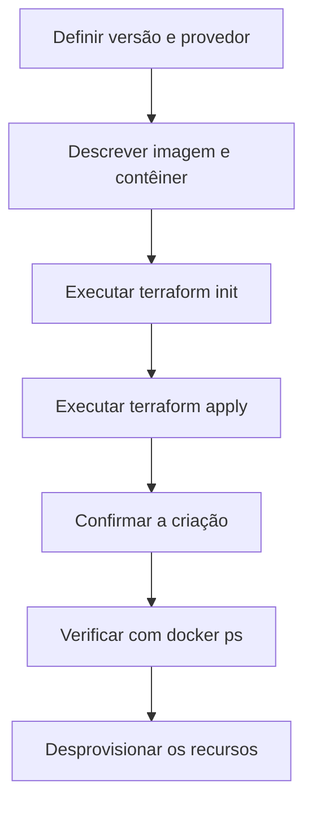
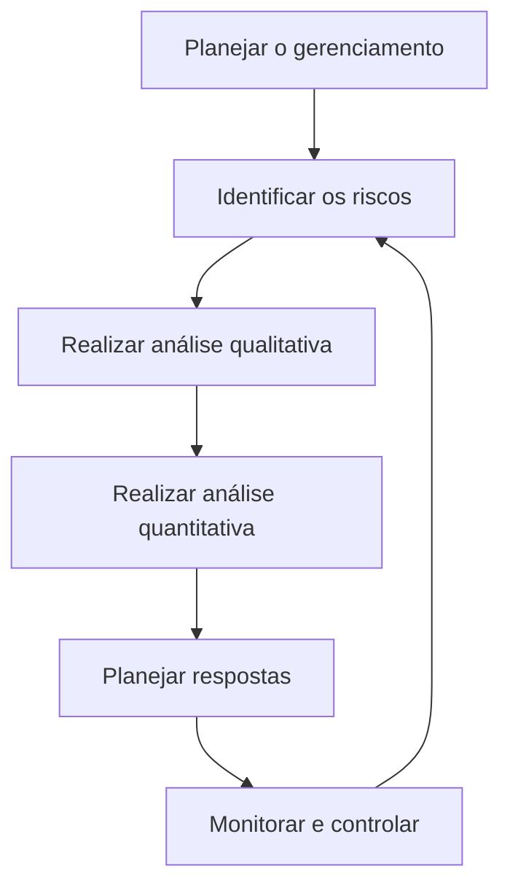
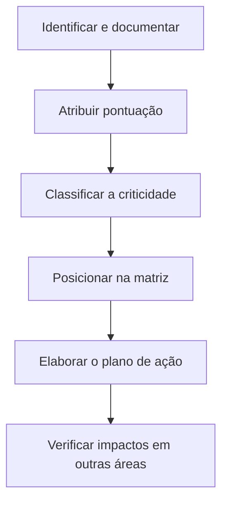
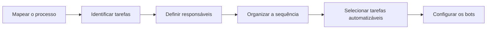
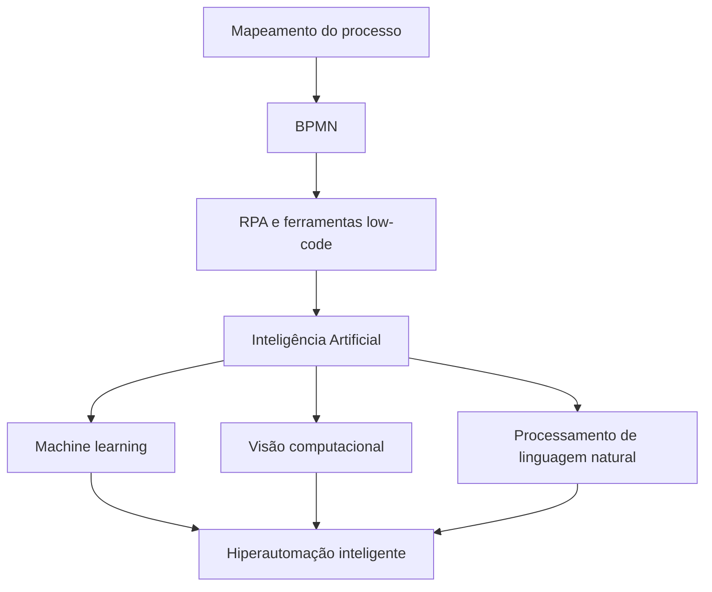

# Estrutura DevOps: infraestrutura como código, gerenciamento de riscos e hiperautomação

## 1. Infraestrutura como código

> [!info] Conceito
> Infraestrutura como código é uma metodologia de automação de TI na qual servidores, ambientes e recursos computacionais são configurados e provisionados por meio de arquivos de código.

A **infraestrutura como código**, também conhecida pela sigla **IaC** (*Infrastructure as Code*), promove uma cultura ágil na entrega e na implantação de software. Em vez de configurar os ambientes manualmente, utilizam-se scripts que contêm comandos de monitoramento e instruções para configurar servidores ou provisionar recursos.

Com essa abordagem, a configuração da infraestrutura torna-se documentada, reproduzível e passível de controle de versão. Isso reduz a dependência de intervenções manuais e facilita a criação de ambientes padronizados.

### 1.1 Benefícios da infraestrutura como código

Os principais benefícios apresentados são:

- **Automação:** reduz a execução manual de tarefas repetitivas na entrega e na implantação do software.
- **Flexibilidade:** permite selecionar configurações previamente definidas conforme a situação.
- **Escalabilidade:** possibilita provisionar recursos dinamicamente à medida que forem necessários.
- **Consistência:** produz ambientes configurados de maneira uniforme e previsível.
- **Agilidade:** acelera o processo de preparação, entrega e implantação dos sistemas.

> [!tip] Resumindo
> A IaC transforma a infraestrutura em uma configuração automatizada, reproduzível e padronizada, contribuindo para entregas mais rápidas e confiáveis.

### 1.2 Ferramentas de infraestrutura como código

A aula apresenta quatro ferramentas relacionadas à automação da infraestrutura:

| Ferramenta | Aplicação apresentada |
|---|---|
| **Chef** | Gerenciamento de configurações baseado em políticas. |
| **Puppet** | Gerenciamento de fluxos de trabalho orientado a modelos. |
| **Ansible** | Automação sequencial de tarefas. |
| **Terraform** | Definição e provisionamento da infraestrutura de datacenters como código. |

O **Terraform** utiliza uma linguagem declarativa, principalmente a **HCL** (*HashiCorp Configuration Language*), podendo também trabalhar com configurações representadas em JSON. Na abordagem declarativa, descreve-se o estado desejado da infraestrutura, e a ferramenta determina as ações necessárias para alcançá-lo.

## 2. Contêineres

> [!info] Conceito
> Contêineres são unidades executáveis que reúnem a aplicação, suas bibliotecas e dependências em um pacote isolado.

Um contêiner contém o código necessário para executar uma aplicação, juntamente com suas bibliotecas e dependências. Ele promove o isolamento dos processos da aplicação em relação ao restante do sistema operacional.

Esse isolamento ajuda a evitar conflitos entre aplicações e torna a execução mais consistente em diferentes ambientes. A ferramenta de contêineres destacada na aula é o **Docker**.

A relação entre infraestrutura como código e contêineres pode ser representada da seguinte forma:


A infraestrutura como código automatiza a criação do ambiente, enquanto os contêineres empacotam e executam o software em unidades menores e isoladas. Essa combinação facilita a implantação e o gerenciamento de problemas.

## 3. Simulação com Terraform e Docker

> [!info] Exemplo prático
> A aula demonstra o provisionamento de um contêiner Docker por meio de uma configuração declarativa do Terraform.

A simulação foi realizada em um ambiente disponibilizado pela **HashiCorp**, empresa responsável pela manutenção do Terraform. O exemplo utiliza dois arquivos principais:

- `terraform.tf`: define a versão do Terraform e o provedor que será utilizado.
- `main.tf`: descreve os recursos que deverão ser criados.

### 3.1 Definição da versão e do provedor

No arquivo `terraform.tf`, é especificada a versão do Terraform utilizada na atividade, indicada como **1.7**, além do provedor Docker e de sua respectiva versão.

O **provedor** funciona como a integração entre o Terraform e a tecnologia que será gerenciada. Nesse caso, ele permite que o Terraform envie instruções ao Docker para criar e administrar imagens e contêineres.

### 3.2 Configuração da imagem e do contêiner

No arquivo principal, a configuração seleciona o provedor Docker e define uma imagem do servidor **Nginx** em sua versão mais recente.

A configuração mostrada contempla:

- o provedor Docker;
- a imagem `nginx:latest`;
- o nome atribuído à imagem;
- a criação de um contêiner;
- o nome do contêiner;
- o mapeamento de portas;
- a associação entre a porta interna do contêiner e a porta externa do ambiente.

O exemplo apresentado possui estrutura semelhante à seguinte:

```hcl
provider "docker" {}

resource "docker_image" "nginx" {
  name         = "nginx:latest"
  keep_locally = false
}

resource "docker_container" "nginx" {
  image = docker_image.nginx.image_id
  name  = "tutorial"

  ports {
    internal = 80
    external = 8000
  }
}
```

A porta interna `80`, utilizada pelo Nginx, é disponibilizada externamente pela porta `8000`.

### 3.3 Inicialização e aplicação da configuração

Para iniciar o projeto, utiliza-se o comando:

```bash
terraform init
```

Esse comando inicializa o ambiente Terraform e prepara o provedor Docker definido nos arquivos de configuração.

Em seguida, utiliza-se:

```bash
terraform apply
```

O Terraform analisa a configuração, apresenta as alterações previstas e solicita uma confirmação. Após a confirmação, cria o ambiente e o contêiner conforme o estado declarado no código.

Quando a mensagem `Apply complete` é apresentada, significa que a criação dos recursos foi concluída.

### 3.4 Verificação e desprovisionamento

Para verificar se o contêiner está em execução, emprega-se o comando:

```bash
docker ps
```

Esse comando lista os contêineres ativos e permite conferir informações como imagem utilizada, tempo de criação, estado de execução e portas configuradas.

Ao final, a infraestrutura pode ser desprovisionada, destruindo os recursos criados anteriormente. O fluxo geral da demonstração é:



> [!tip] Resumindo
> O Terraform descreve e provisiona a infraestrutura, enquanto o Docker executa a aplicação em um contêiner isolado. Os arquivos de configuração permitem recriar o ambiente de maneira consistente.

## 4. Riscos no processo de entrega

> [!info] Conceito
> Riscos são eventos incertos que podem ou não ocorrer, mas cujas probabilidades e consequências podem ser analisadas e tratadas.

Mesmo com a automação, os processos de entrega e implantação continuam sujeitos a problemas. Esses problemas são tratados como **riscos**, isto é, componentes de incerteza que podem afetar o projeto.

Os riscos possuem as seguintes características:

- podem ser quantificados e qualificados;
- podem ser previstos e tratados;
- podem ser gerenciados.

A infraestrutura como código e os contêineres facilitam o gerenciamento de problemas, mas não eliminam a necessidade de identificar e acompanhar os riscos relacionados à entrega do software.

## 5. Identificação e análise de riscos

> [!info] Identificação
> Identificar riscos significa registrar possíveis eventos que possam comprometer os resultados, classificando sua probabilidade, impacto e criticidade.

A identificação de riscos envolve:

- definição dos níveis de risco;
- documentação dos riscos encontrados;
- análise quantitativa;
- análise qualitativa.

A **análise quantitativa** procura representar numericamente as consequências do risco, como o tempo de atraso ou o custo adicional que ele poderá provocar.

A **análise qualitativa** examina a natureza e a criticidade do risco, avaliando de que maneira ele poderá afetar o andamento do projeto.

A documentação é importante para manter os riscos mapeados e permitir seu acompanhamento durante toda a execução do projeto.

## 6. Processo de gerenciamento de riscos

> [!info] Processo contínuo
> O gerenciamento de riscos não termina com a identificação: também exige análise, planejamento de respostas, monitoramento e controle.

Os processos de gerenciamento de riscos apresentados na aula são:

1. planejamento do gerenciamento de riscos;
2. identificação dos riscos;
3. análise qualitativa;
4. análise quantitativa;
5. planejamento das respostas aos riscos;
6. monitoramento e controle.



O caráter cíclico representa a necessidade de reavaliar continuamente os riscos, pois novos eventos podem surgir e os riscos existentes podem mudar de intensidade durante o projeto.

## 7. Categorias de riscos

> [!info] Classificação
> A categorização organiza os riscos conforme a área do projeto que poderá ser afetada, facilitando a definição das respostas adequadas.

Os riscos podem ser classificados nas seguintes categorias:

### 7.1 Riscos técnicos

Relacionam-se à tecnologia, à configuração e ao funcionamento do ambiente. Entre os exemplos estão:

- detecção de falhas;
- configuração do ambiente operacional;
- complexidade de sistemas;
- integração entre interfaces;
- segurança.

### 7.2 Riscos programáticos

Estão associados às condições organizacionais ou externas que influenciam a execução do projeto, como:

- disponibilidade de pessoal capacitado;
- impactos ambientais;
- problemas de comunicação entre equipes;
- mudanças de políticas da empresa.

### 7.3 Riscos de suporte

Relacionam-se aos recursos necessários para manter o projeto em funcionamento, incluindo:

- segurança do sistema;
- equipamentos;
- recursos humanos;
- interoperabilidade;
- suporte aos recursos computacionais;
- infraestrutura adequada ao desenvolvimento do projeto.

### 7.4 Riscos de custo

Decorrem de problemas financeiros, como:

- erro na estimativa dos custos;
- custos adicionais;
- gastos extras;
- recursos técnicos ou de suporte não previstos.

### 7.5 Riscos de cronograma

Relacionam-se ao cumprimento dos prazos, podendo decorrer de:

- estimativas incorretas do tempo de entrega;
- indisponibilidade de pessoal qualificado;
- atrasos no treinamento da equipe;
- perdas de recursos técnicos.

> [!warning] Atenção
> Um mesmo evento pode afetar mais de uma categoria. Por exemplo, a falta de pessoal qualificado pode provocar problemas técnicos, aumento de custos e atrasos no cronograma.

## 8. Técnicas para identificar o impacto dos riscos

> [!info] Avaliação
> Os riscos devem ser descritos com clareza, classificados por criticidade e posicionados em uma matriz que indique sua prioridade.

A técnica apresentada é organizada em três passos.

### Passo 1 — Identificar, documentar e classificar

Os riscos devem ser identificados e anotados com a maior riqueza de detalhes possível. Em seguida, são classificados quanto à criticidade, considerando os impactos e atribuindo-se uma pontuação.

A escala apresentada é:

- **baixo:** pontuação de 1 a 3;
- **médio:** pontuação de 4 a 6;
- **alto:** pontuação de 7 a 9.

### Passo 2 — Construir a matriz de impacto e magnitude

Cria-se uma matriz na qual cada risco é representado por seu identificador. Os riscos são distribuídos pelas áreas da matriz conforme o nível de impacto e magnitude, permitindo classificá-los como baixos, médios ou altos.

A matriz facilita a visualização das prioridades:

- riscos de menor impacto e magnitude exigem acompanhamento proporcional à sua criticidade;
- riscos intermediários requerem atenção e medidas de controle;
- riscos com impacto e magnitude elevados precisam de respostas prioritárias.

### Passo 3 — Elaborar o plano de ação

O plano de ação deve examinar o projeto em todas as suas interfaces. O objetivo é impedir que a ação adotada para solucionar um risco provoque uma reação negativa em outra parte do projeto.



> [!tip] Resumindo
> A matriz de impacto e magnitude transforma uma lista de riscos em uma visão de prioridades, apoiando a escolha das ações que devem ser executadas primeiro.

## 9. Robotic Process Automation

> [!info] Conceito
> RPA utiliza robôs de software para executar tarefas que anteriormente precisariam ser realizadas por pessoas.

A **Robotic Process Automation — RPA** emprega agentes de software, também chamados de **robôs** ou **bots**, para interagir com sistemas e executar tarefas pertencentes a processos de negócio.

Essas automações podem ser construídas por meio de ferramentas **low-code**, que permitem montar visualmente os fluxos, reduzindo a necessidade de escrever grandes quantidades de código.

A automação inteligente de processos foi apresentada como uma das principais tendências tecnológicas apontadas pelo Gartner em 2022, com expansão para organizações de diferentes áreas de negócio.

## 10. Mapeamento dos processos para automação

> [!info] Preparação
> Antes de automatizar um processo, é necessário compreender suas tarefas, seus responsáveis, sua ordem de execução e suas regras.

O desenvolvimento de uma automação começa pelo **mapeamento do processo de negócio**. Esse mapeamento identifica:

- as tarefas que compõem o processo;
- quem deve executar cada tarefa;
- a ordem em que as tarefas devem ocorrer;
- quais atividades podem ser automatizadas.

Nem todas as tarefas necessariamente devem ser executadas por robôs. O mapeamento permite separar as atividades automatizáveis daquelas que ainda dependem da participação humana.



## 11. Exemplo de automação do lançamento de notas fiscais

> [!info] Estudo de caso
> A automação foi aplicada a um processo repetitivo de lançamento de notas fiscais após a entrada física dos produtos no estoque.

O lançamento de notas fiscais é uma atividade repetitiva e, por isso, sujeita a erros de digitação. Essas falhas podem gerar impactos financeiros para a organização.

No estudo apresentado, o processo foi inicialmente mapeado e as tarefas passíveis de execução por robôs foram identificadas. Os resultados foram:

- **oito tarefas** identificadas no processo;
- **seis tarefas automatizadas**;
- automação de **75% do processo**;
- redução de **cinco para duas pessoas** envolvidas;
- economia superior a **R\$ 130.000 por ano** em força de trabalho.

O exemplo demonstra que a automação não se limita à substituição integral das pessoas. Parte do fluxo permanece sob responsabilidade humana, enquanto tarefas repetitivas e padronizadas são direcionadas aos bots.

## 12. Benefícios da hiperautomação

> [!info] Hiperautomação
> A hiperautomação amplia o alcance da RPA mediante a integração entre automação de processos, ferramentas de modelagem e técnicas de inteligência artificial.

Os benefícios apresentados são:

- **liberação da força de trabalho:** as pessoas podem dedicar-se a atividades mais produtivas e menos repetitivas;
- **maior eficiência:** os processos passam a ser executados com maior regularidade;
- **menor incidência de erros:** reduz falhas como erros de digitação;
- **maior assertividade:** aumenta a precisão dos resultados;
- **maior velocidade:** diminui o tempo necessário para executar o processo.

> [!tip] Resumindo
> A hiperautomação direciona tarefas repetitivas para sistemas automatizados e permite que as pessoas se concentrem em atividades que exigem análise, decisão e conhecimento do negócio.

## 13. Desafios da hiperautomação

> [!warning] Atenção
> A adoção da hiperautomação não é apenas uma mudança tecnológica; ela também modifica funções, equipes e formas de trabalho.

Os principais desafios apontados são:

### 13.1 Gestão de pessoas

A organização precisa administrar a aceitação das mudanças, pois determinadas equipes ou funções podem deixar de existir na forma atual, enquanto novas atividades e responsabilidades poderão surgir.

### 13.2 Método de desenvolvimento e implantação

É necessário adotar um método adequado para desenvolver e implantar as automações. Esse processo envolve pesquisa, experimentação e adaptação das práticas à realidade da organização.

### 13.3 Escassez de literatura

A pesquisa e a experimentação podem ser dificultadas pela escassez de materiais que explorem detalhadamente determinadas técnicas que sustentam a RPA.

## 14. Tecnologias utilizadas na hiperautomação

> [!info] Tecnologias
> A hiperautomação combina a modelagem estruturada dos processos com tecnologias capazes de interpretar informações e apoiar decisões.

### 14.1 BPMN

A **BPMN — Business Process Model and Notation** é uma técnica utilizada para representar graficamente os processos de negócio.

Ao permitir o desenho das tarefas, responsáveis, decisões e sequências do processo, a BPMN facilita a compreensão do fluxo e sua posterior automação por ferramentas low-code.

### 14.2 Inteligência artificial

A RPA clássica pode ser enriquecida com técnicas de inteligência artificial, como:

- **machine learning:** permite identificar padrões a partir de dados;
- **visão computacional:** possibilita interpretar imagens e informações visuais;
- **processamento de linguagem natural:** permite interpretar e processar textos e linguagem humana.

A incorporação dessas técnicas resulta na **hiperautomação inteligente de processos**, capaz de lidar com situações mais complexas do que a simples repetição de comandos predefinidos.



## Síntese final

> [!summary] Síntese
> A aula relaciona automação da infraestrutura, gerenciamento de riscos e automação dos processos de negócio como elementos que elevam a eficiência e a confiabilidade das entregas.

A **infraestrutura como código** utiliza scripts para configurar e provisionar ambientes de forma automatizada, flexível, escalável e consistente. O exemplo com **Terraform e Docker** demonstra como a infraestrutura pode ser descrita em arquivos, aplicada por comandos e verificada por meio da execução de um contêiner Nginx.

A automação não elimina os riscos. Por isso, é necessário identificá-los, documentá-los, analisá-los qualitativa e quantitativamente, classificá-los em categorias e posicioná-los em uma matriz de impacto e magnitude. Com base nessa avaliação, elabora-se um plano de ação que considere os efeitos das respostas em todas as interfaces do projeto.

Por fim, a **RPA** automatiza tarefas repetitivas por meio de robôs de software. Quando integrada à BPMN, a ferramentas low-code e a técnicas de inteligência artificial, evolui para a **hiperautomação inteligente**, proporcionando maior eficiência, velocidade e precisão. Sua implantação, entretanto, depende de um mapeamento cuidadoso dos processos, de métodos adequados e de uma gestão de pessoas capaz de conduzir as mudanças organizacionais.