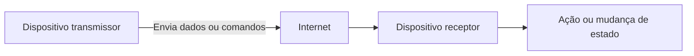
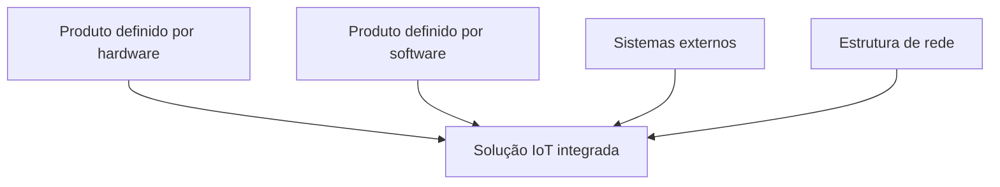
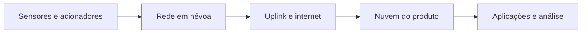

# Internet das Coisas: conceitos, aplicações e tecnologias

## 1. Conceito de Internet das Coisas

> [!info] Conceito
> A Internet das Coisas conecta objetos físicos à internet para que eles coletem, transmitam e recebam dados, permitindo monitoramento e controle a distância.

A sigla **IoT** vem da expressão inglesa *Internet of Things*, traduzida como **Internet das Coisas**. Seu funcionamento depende da **conectividade**, isto é, da capacidade de computadores, máquinas, sensores e outros equipamentos eletrônicos se interligarem para trocar dados e informações.

Diferentemente do uso tradicional da internet, centrado na comunicação entre pessoas, a IoT enfatiza a **interconexão digital de objetos**. Esses dispositivos podem coletar informações do ambiente, transmiti-las pela rede e executar ações comandadas remotamente por microcontroladores ou microprocessadores.

Os produtos IoT também são chamados de **produtos conectados** ou **produtos inteligentes**. Por sua capacidade de comunicação e processamento, podem aumentar a eficiência de atividades cotidianas e apoiar novos modelos de negócio.

Eles podem assumir diferentes formas:

- **Objetos independentes:** um único equipamento conectado, como uma secadora de roupas;
- **Sistemas:** conjunto de equipamentos e serviços integrados, como um sistema de telemática para transportes;
- **Ambientes:** espaços compostos por vários dispositivos conectados, como edifícios inteligentes.

> [!tip] Resumindo
> A IoT transforma objetos comuns em componentes de uma rede capaz de perceber condições, trocar informações e responder a comandos.

## 2. Estrutura básica da IoT

> [!info] Componentes essenciais
> Uma solução IoT precisa de um meio de comunicação, um dispositivo transmissor e um dispositivo receptor responsável pela execução do comando.

A estrutura básica da Internet das Coisas compreende:

1. **Meio de propagação:** normalmente a internet, utilizada para transportar os dados;
2. **Dispositivo transmissor eletrônico:** equipamento com capacidade de emitir sinais, como um telefone celular;
3. **Dispositivo receptor:** equipamento controlado pelos sinais recebidos, geralmente baseado em um microcontrolador.

Essa estrutura permite controlar objetos a distância, verificar seu funcionamento e alterar seu estado. Assim, eletrodomésticos, relógios, alarmes, automóveis, piscinas e equipamentos médicos podem ser integrados a uma rede inteligente.

A IoT também pode empregar **mineração de dados** para identificar padrões em grandes volumes de informações e utilizar métodos preditivos para estimar valores ou acontecimentos futuros.

## 3. Aplicações práticas da IoT

> [!info] Foco no usuário
> O desenvolvimento de um produto IoT deve considerar as necessidades dos usuários finais e sua utilidade no cotidiano.

Os dispositivos IoT precisam ter objetivos claros para serem significativos na vida das pessoas. Entre os exemplos práticos estão os **smartwatches**, que acompanham atividades físicas e condições do usuário, e os **veículos autônomos**, que usam sensores para reconhecer o ambiente e monitorar sua posição.

Em cidades inteligentes, veículos e equipamentos urbanos podem trocar informações para apoiar a mobilidade, a segurança e a gestão dos serviços. Nas residências, aplicativos instalados em celulares ou tablets permitem acompanhar e controlar eletrodomésticos e outros dispositivos conectados.

> [!tip] Resumindo
> A utilidade da IoT não está apenas em conectar objetos, mas em empregar essa conexão para resolver necessidades concretas dos usuários.

## 4. Categorias de produtos IoT

> [!info] Áreas de aplicação
> A IoT pode ser classificada conforme seu contexto de uso: consumo, comércio, indústria ou infraestrutura.

### 4.1 IoT de consumo

A **IoT de consumo** abrange produtos presentes no cotidiano das pessoas. Nas residências inteligentes, esses dispositivos auxiliam na segurança, na gestão de energia e na convivência. Entre os exemplos estão eletrodomésticos, camas e escovas de dentes conectadas.

No corpo humano, relógios e outros dispositivos monitoram o organismo e o ambiente. Nos transportes, os automóveis passam a incorporar níveis crescentes de autonomia.

### 4.2 IoT comercial

A **IoT comercial** atende às necessidades de empresas e prestadores de serviços. Entre suas aplicações estão:

- telemática para gestão de frotas;
- monitoramento e prevenção de doenças na assistência médica;
- avaliação de riscos por seguradoras, relacionando comportamento humano e comportamento das máquinas.

### 4.3 IoT industrial

A **IoT industrial** utiliza sensores, equipamentos autônomos e análise de dados para melhorar processos produtivos. No setor de petróleo e gás, auxilia na extração, no processamento e na distribuição. Na mineração, permite acompanhar o rendimento e a segurança das operações.

Na agricultura, os dados coletados podem ser analisados com técnicas de **aprendizado de máquina** (*machine learning*) para avaliar e melhorar o rendimento das safras.

### 4.4 IoT de infraestrutura

A **IoT de infraestrutura** integra equipamentos e serviços urbanos. Em cidades inteligentes, conecta os equipamentos da cidade aos habitantes. Em redes elétricas inteligentes, contribui para distribuir eletricidade com maior eficiência.

| Categoria | Principais aplicações |
|---|---|
| IoT de consumo | Residências inteligentes, dispositivos corporais e automóveis |
| IoT comercial | Frotas, assistência médica e avaliação de riscos |
| IoT industrial | Petróleo e gás, mineração e agricultura |
| IoT de infraestrutura | Cidades e centrais elétricas inteligentes |

## 5. Visões profissionais para o desenvolvimento de IoT

> [!info] Trabalho multidisciplinar
> A criação de produtos IoT exige a integração das perspectivas de redes, design e negócios.

Os prestadores de serviços de IoT atuam desde a elaboração de desenhos industriais até o desenvolvimento de aplicativos móveis. Para que os diferentes componentes trabalhem de forma padronizada, o material destaca três perspectivas: a do **integrador de sistemas**, a do **escritório de design** e a de **negócios**.

### 5.1 Visão do integrador de sistemas

O engenheiro de rede interpreta a solução IoT como uma **pilha de rede** (*networking stack*). Essa pilha reúne formatos de dados, protocolos de aplicação, transporte, roteamento e comunicação física.

| Camada ou função           | Tecnologias e protocolos apresentados       |
| -------------------------- | ------------------------------------------- |
| Formato dos dados          | Binário, ISOM e CBOR                        |
| Aplicações                 | MQTT, CoAP, DSS e XMPP                      |
| Transporte                 | UDP                                         |
| Intranet ou rede           | IPv6/IP e 6LoWPAN                           |
| Rede, enlace e meio físico | IEEE 802.15.4 MAC e IEEE 802.15.4 PHY/Rádio |

 **ISOM** -> International Specification for Orienteering Maps -> Especificação de mapas

**CBOR** -> Concise Binary Object Representation -> Organiza informações de forma semelhante ao JSON, mas em binários compactos.

**MQTT** -> Message Queuing Telemetry Transport -> Protocolo leve de mensagens para comunicação entre maquinas e dispositivos IoT

**CoAP** -> Constrained Application Protocol -> Protocolo de transferência de dados (UDP) da camada de aplicação desenvolvido para dispositivos com recursos limitados na IoT (Pouca memoria e internet com perda de pacotes)

**DSS** -> Decision Support Systems -> sistema de informação computadorizado que ajuda líderes e gestores a tomar decisões estratégicas baseadas em dados de sensores.

Os protocolos definem regras para a comunicação entre dispositivos e sistemas. Eles permitem transferir os dados originados nos sensores até os aplicativos que os utilizarão.

**XMPP** -> Extensible Messaging and Presence Protocol  -> protocolo de comunicação aberto e descentralizado, baseado em XML, usado para troca de mensagens instantâneas e informações de presença em tempo real e IoT

### 5.2 Visão do escritório de design

O designer organiza a experiência e os pontos de interação da solução IoT em duas áreas:

| Área | Função |
|---|---|
| **Front-end** | Reúne os pontos de contato do usuário e a infraestrutura capacitadora |
| **Back-end** | Reúne os pontos de contato administrativos |

O **front-end** corresponde à parte com a qual o usuário final interage. O **back-end** sustenta os processos administrativos e a infraestrutura necessária para que a solução funcione.

### 5.3 Visão de negócios

A perspectiva de negócios reúne sistemas ciberfísicos e redes definidas por software. Uma solução IoT deve considerar quatro partes:

- produto definido por software;
- produto definido por hardware;
- sistemas externos conectados;
- estrutura da rede, também chamada de *network fabric*.

> [!tip] Resumindo
> O integrador viabiliza a comunicação, o designer organiza as interfaces e os pontos de contato, e a visão de negócios integra o produto ao ecossistema empresarial.

## 6. Tecnologias dos produtos IoT

> [!info] Organização tecnológica
> Um produto IoT combina software, hardware, sistemas externos e infraestrutura de rede.

O desenvolvimento técnico começa pelo produto definido por software e pela análise de dados. O sistema recebe informações do hardware e de fontes externas, enquanto a estrutura da rede garante a comunicação entre os componentes.

### 6.1 Produto definido por software

O produto definido por software reúne um **cibermodelo** e um **aplicativo**.

O cibermodelo é formado por algoritmos responsáveis pelo funcionamento do aplicativo e pela análise dos dados. Ele pode ser entendido como um **gêmeo digital** do produto físico, pois representa e orienta seu comportamento em diferentes condições e ambientes.

O aplicativo contém os programas que permitem a interação entre pessoas, serviços e outros aplicativos. Ele executa o modelo, analisa os dados e ajuda a construir comparações e soluções com base no conhecimento técnico adotado pelo fabricante.

### 6.2 Produto definido por hardware

O produto definido por hardware inclui:

- **sensores conectados**, responsáveis pela coleta de informações;
- **acionadores conectados**, que executam comandos ou provocam mudanças;
- **sistemas embarcados**, que realizam funções específicas dentro do equipamento.

Esses componentes podem fazer parte de projetos novos ou ser incorporados a sistemas legados. Um exemplo é o hardware do sistema de freios ABS, empregado para evitar o travamento das rodas em frenagens bruscas.

### 6.3 Sistemas externos

Os sistemas externos complementam os dados internos coletados pelos sensores. A conexão ocorre por meio da internet e de programas on-line.

| Sistema externo | Responsabilidade |
|---|---|
| **Análise de dados (*data analytics*)** | Interpreta dados passados, prevê dados futuros, compara modelos e procura melhorar os resultados |
| **Serviços de dados de internet (*data services*)** | Fornece dados brutos por meio de pequenos serviços e APIs, como informações de clima, preços e estoques |
| **Sistemas de negócios (*business systems*)** | Integra produtos IoT a sistemas CRM, ERP, PLM e SCM |
| **Produtos IoT** | Comunicam-se com outros produtos IoT com base nas técnicas destinadas aos resultados desejados |

Os sistemas de negócios podem envolver:

- **CRM:** gestão do relacionamento com o cliente;
- **ERP:** planejamento dos recursos empresariais;
- **PLM:** gestão do ciclo de vida do produto;
- **SCM:** gestão da cadeia de suprimentos.

> [!warning] Atenção
> Os sensores não precisam trabalhar apenas com os dados coletados pelo próprio produto. Serviços externos podem fornecer informações complementares importantes para a tomada de decisão.

## 7. Estruturas de rede para IoT

> [!info] Infraestrutura de comunicação
> As estruturas de rede transportam os dados entre sensores, produtos, aplicações e ambientes de armazenamento.

### 7.1 Rede em névoa

A **rede em névoa** (*fog network*) inclui redes de Tecnologia de Operações e Tecnologia da Informação:

- **Tecnologia de Operações — TO:** encontra-se dentro do produto IoT e comunica-se com sensores e acionadores;
- **Tecnologia da Informação — TI:** localiza-se externamente ao produto e integra seus dados a outros sistemas.

>[!tip] Rede em Névoa (Fog Network)
> É a camada de rede intermediária local, composta por dispositivos como roteadores inteligentes, switches e _gateways_ de IoT localizados próximos aos sensores físicos.
> 
> Segundo Sinclair, a rede em névoa (ou rede OT/TI) serve para processar e filtrar os dados localmente (na borda) antes de enviá-los para níveis mais distantes. Ela reduz drasticamente a latência e economiza largura de banda de internet, pois permite que decisões urgentes e automações rápidas aconteçam sem precisar viajar até a nuvem centralizada.

### 7.2 Rede em nuvem pública

A rede em nuvem pública, denominada no material como **uplink**, conecta os dispositivos à internet por ondas de rádio e por protocolos da pilha de rede. Ela inclui:

- **camada de mídia:** Bluetooth, Wi-Fi, IEEE 802.15.4, LPWAN e redes celulares;
- **camada de rede:** protocolos de internet e protocolos proprietários de TO;
- **camada de aplicação:** MQTT, CoAP e DSS.

Essas camadas permitem transportar e transformar os dados coletados em metadados utilizados pelos aplicativos.

> [!tip] Rede em Nuvem Pública (_Public Cloud_)
> Refere-se à internet convencional e à infraestrutura de servidores globais compartilhados pertencentes a grandes provedores terceiros (como AWS, Google Cloud ou Microsoft Azure)
> 
> Segundo Sinclair, é o "meio de transporte" genérico e em larga escala. Ela hospeda serviços de ampla conectividade e recursos elásticos sob demanda. Na arquitetura de IoT, a nuvem pública atua como a espinha dorsal conectora que viabiliza a comunicação entre as redes de névoa locais e as nuvens privadas focadas no produto.

### 7.3 Nuvem do produto

A **nuvem do produto** (*product cloud*) armazena e processa os dados da solução IoT. Esses dados podem permanecer:

- **on-premise:** localmente, na rede privada da empresa;
- **em data center externo:** fora da infraestrutura física da organização.

> [!tip] Nuvem do Produto (_Product Cloud_)
> É um ambiente em nuvem **privado, dedicado e específico para o produto IoT** da empresa (onde reside a "plataforma de IoT")
> 
> Segundo Sinclair, é o "cérebro" central do ecossistema do produto. Enquanto a nuvem pública é apenas a estrada, a nuvem do produto é o destino final onde os dados coletados de todos os dispositivos são permanentemente armazenados, consolidados e analisados a longo prazo. É nela onde roda o Gêmeo Digital (a versão em software do produto físico) e onde acontecem as análises profundas de dados (Big Data Analytics) e a integração com sistemas de negócios corporativos.

## 8. Protocolos IPv4 e IPv6

> [!info] Endereçamento
> Os protocolos IP identificam a origem e o destino dos pacotes enviados pela internet.

O **IPv4** é a quarta versão do Protocolo de Internet e permite que computadores, smartphones e outros dispositivos se conectem à rede. O **IPv6** é a versão mais recente apresentada no material e sucede o IPv4.

Durante a comunicação, as informações são divididas em **pacotes**. Cada pacote contém endereços que identificam quem envia e quem recebe os dados, possibilitando que eles sejam encaminhados ao destino correto.

## Síntese final

> [!summary] Síntese
> A IoT conecta objetos físicos, software, serviços externos e redes para coletar dados, analisá-los e executar ações. Seu desenvolvimento exige integração entre engenharia de redes, design e negócios.

A Internet das Coisas amplia a conectividade para além de computadores e celulares, incorporando eletrodomésticos, veículos, equipamentos industriais, dispositivos médicos e infraestruturas urbanas. Seu funcionamento depende de transmissores, receptores, sensores, acionadores, sistemas embarcados, aplicativos e meios de comunicação.

Os produtos IoT podem ser aplicados ao consumo, comércio, indústria e infraestrutura. Sua arquitetura combina produtos definidos por software e hardware, serviços externos de dados, sistemas empresariais e diferentes estruturas de rede. Essa integração permite monitoramento remoto, automação, análise de dados e criação de produtos e serviços inteligentes.

# Questionário — Dúvidas frequentes

## 1

> [!question] O que significa, em inglês e português, a sigla IoT?
>
>> [!question]- Resposta
>>
>> Em inglês, IoT significa *Internet of Things* e, em português, **Internet das Coisas**.

## 2

> [!question] Qual é a estrutura básica para obter o funcionamento da IoT?
>
>> [!question]- Resposta
>>
>> É necessário ter um meio de propagação, normalmente a internet; um dispositivo transmissor, como um telefone celular; e um dispositivo receptor que realize o controle com base nos sinais recebidos, como um equipamento baseado em microcontrolador.

## 3

> [!question] Quais são os sistemas externos usados pelos produtos IoT?
>
>> [!question]- Resposta
>>
>> Os sistemas externos são: análise de dados (*data analytics*), serviços de dados de internet (*data services*), sistemas de negócios (*business systems*) e produtos IoT.

## 4

> [!question] Quais são as estruturas de rede usadas na IoT?
>
>> [!question]- Resposta
>>
>> As estruturas são: rede em névoa (*fog network*), rede de nuvem pública com a internet (*uplink*) e rede de nuvem do produto (*product cloud*).