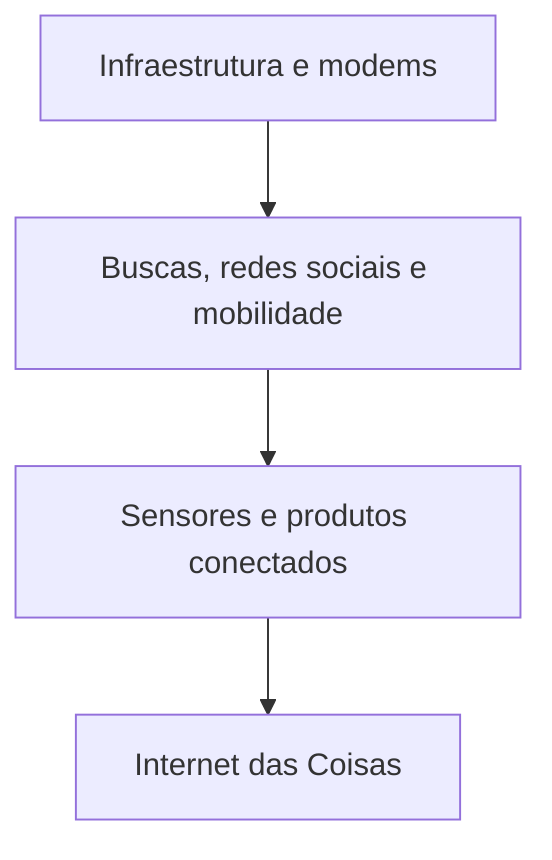
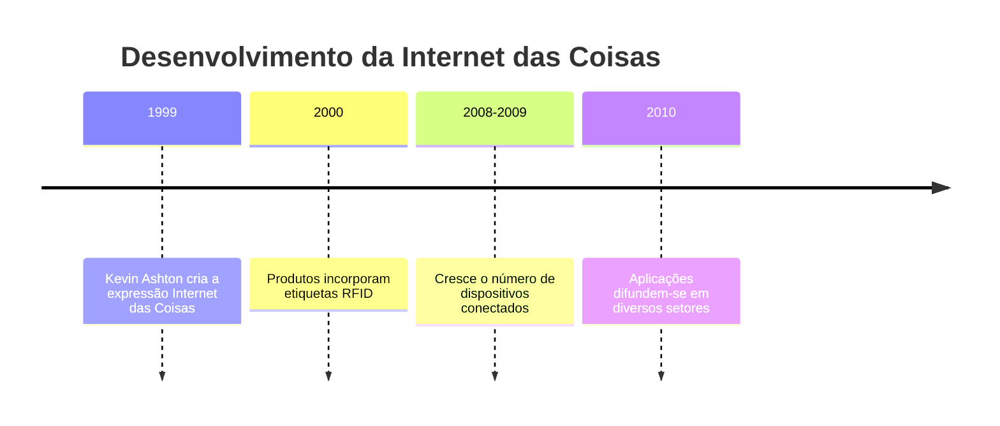
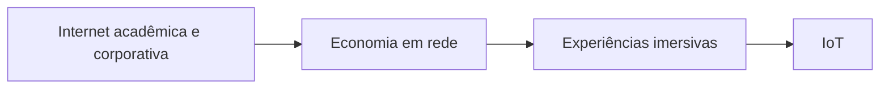
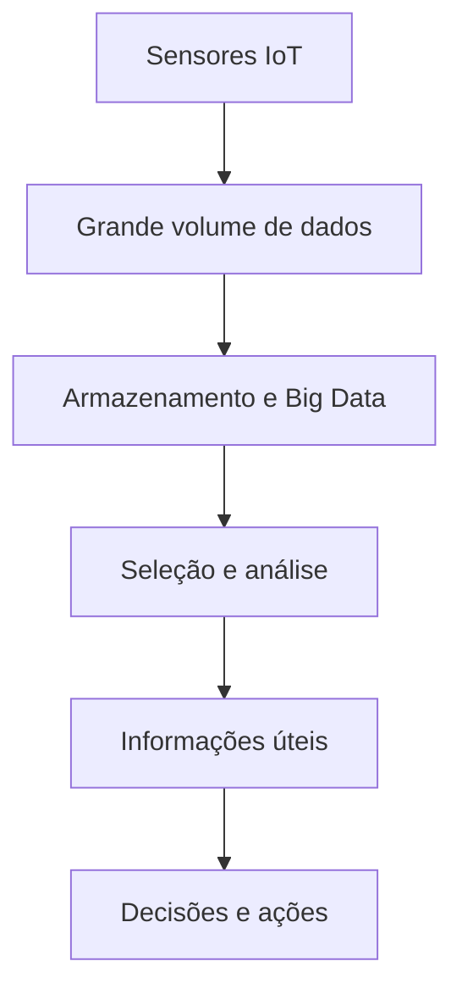

# Internet das Coisas: evolução, aplicações e relação com Big Data

## 1. Conceito de Internet das Coisas

> [!info] Conceito
> A Internet das Coisas conecta objetos físicos à internet para que eles coletem, transmitam e utilizem dados.

A **Internet das Coisas**, conhecida pela sigla **IoT** (*Internet of Things*), representa uma importante transformação tecnológica baseada na ideia de **“conectar o desconectado”**. Sua finalidade é aproximar três dimensões:

- o **mundo físico**, formado pelos objetos;
- o **mundo biológico**, representado pelas pessoas;
- o **mundo digital**, constituído pela computação e pelas redes.

Por meio de sensores, dispositivos e sistemas conectados, objetos físicos podem monitorar condições, trocar informações e apoiar decisões ou ações automatizadas.

> [!tip] Resumindo
> A IoT integra pessoas, objetos e sistemas digitais por meio da conectividade e do compartilhamento de dados.

## 2. Transformações globais e evolução da internet

> [!info] Contexto histórico
> O desenvolvimento da IoT está relacionado às transformações da sociedade e à evolução da própria internet.

Alvin Toffler descreveu a evolução humana por meio de três grandes ondas:

1. **Primeira onda:** advento da agricultura e formação de uma sociedade agrícola sedentária.
2. **Segunda onda:** Revolução Industrial, produção e distribuição em massa.
3. **Terceira onda:** Era da Informação, marcada pela revolução digital e comunicacional.

Com base especialmente na Era da Informação, Case organizou a evolução da internet em três ondas tecnológicas.

| Onda da internet | Características | Empresas e exemplos |
|---|---|---|
| **Primeira onda: uso do modem** | Construção da infraestrutura e das bases de uma conectividade global; desenvolvimento de hardware, software e redes capazes de viabilizar o acesso à internet; alto custo das companhias telefônicas | Cisco Systems, Sprint, HP, Sun Microsystems, Microsoft, Apple, IBM e AOL |
| **Segunda onda: inovação sobre os alicerces da internet** | Desenvolvimento dos mecanismos de busca; surgimento das redes sociais; expansão da conectividade móvel por smartphones e tablets | iPhone da Apple, Android do Google, Amazon, eBay, Twitter, Instagram e Waze |
| **Terceira onda: produtos conectados** | Expansão da IoT, com sensores e produtos conectados à rede; estabelecimento de parcerias entre os setores público e privado | Startups |

> [!warning] Atenção
> As ondas de transformação global de Toffler e as ondas de evolução da internet apresentadas por Case são classificações relacionadas, mas não idênticas: uma descreve mudanças amplas da humanidade e a outra enfatiza o desenvolvimento da internet.

## 3. Linha do tempo da IoT

> [!info] Formação histórica
> A expressão IoT surgiu antes da popularização dos dispositivos conectados atuais.

Em **1999**, Kevin Ashton cunhou a expressão **“Internet das Coisas”** durante uma apresentação para a empresa P&G sobre o emprego da identificação por radiofrequência.

Em meados dos anos **2000**, começaram a ser desenvolvidos produtos com etiquetas de **RFID** (*Radio Frequency Identification*). Essa tecnologia utiliza radiofrequência para identificar e acompanhar objetos.

Segundo Hanes et al., a IoT consolidou-se por volta de **2008 e 2009**, quando o número de dispositivos conectados à internet aumentou significativamente. Em **2010**, já existiam aplicações em áreas como vigilância, segurança, saúde, transporte, segurança dos alimentos e gerenciamento de documentos.

## 4. Crescimento e tendências da IoT

> [!info] Expansão tecnológica
> O mercado investe em IoT para desenvolver produtos e serviços dotados de conectividade digital.

As principais tendências relacionadas à IoT são:

- localização de pessoas e objetos;
- utilização de objetos autônomos capazes de monitorar e comunicar informações;
- miniaturização dos dispositivos;
- disponibilidade de conexão de banda larga para transmissão de dados;
- gerenciamento remoto de objetos;
- integração entre os mundos real e virtual.

Essas tendências ampliam a presença da IoT em residências, empresas, cidades, meios de transporte, hospitais e áreas rurais.

> [!tip] Resumindo
> O crescimento da IoT depende da combinação entre dispositivos menores, conectividade eficiente, monitoramento remoto e integração de dados.

## 5. Fases da internet e relação com os usuários

> [!info] Sociedade da informação
> A sociedade da informação combina comunicação digital com avanços em microeletrônica, optoeletrônica e multimídia.

A **microeletrônica** envolve a produção de circuitos eletrônicos miniaturizados. A **optoeletrônica** reúne dispositivos responsáveis por fornecer, detectar ou controlar a luz. A **multimídia** integra diferentes formas de conteúdo, como áudio, vídeo e animação.

Nesse contexto, a relação entre a internet e seus usuários pode ser dividida em quatro fases:

| Fase | Características |
|---|---|
| **Primeira fase: advento da internet** | Internet predominante em universidades e corporações, com e-mail, acesso analógico e modems *dial-up*. Os usuários começam a se comunicar pela rede. |
| **Segunda fase: economia em rede** | Conectividade eficiente voltada à geração de lucro, surgimento do comércio eletrônico e integração digital das cadeias de suprimentos. Os usuários realizam compras on-line. |
| **Terceira fase: experiências imersivas** | Expansão das redes sociais e da conectividade em smartphones, tablets e computadores portáteis. A interação ocorre em grande escala por texto, voz e vídeo. |
| **Quarta fase: IoT** | Máquinas e objetos passam a se conectar entre si e também com os usuários. |

> [!tip] Resumindo
> A internet evoluiu da comunicação entre usuários para uma rede na qual pessoas, máquinas e objetos interagem continuamente.

## 6. Potencial da IoT para pequenas e médias empresas

> [!info] Aplicações empresariais
> A IoT permite coletar dados em tempo real, reduzir custos, antecipar falhas e aperfeiçoar produtos e serviços.

### 6.1 Design e marketing de produtos

Sensores podem registrar onde, quando e como um produto é utilizado. Essas informações ajudam a conhecer o comportamento do consumidor e podem acelerar pesquisas de mercado e o desenvolvimento de produtos.

### 6.2 Manutenção de produtos

A IoT fornece informações sobre o desgaste dos componentes e ajuda a identificar possíveis falhas antes que elas interrompam o funcionamento dos equipamentos. A manutenção preventiva pode reduzir despesas operacionais, custos com técnicos especializados e penalidades provocadas por atrasos.

### 6.3 Vendas de produtos

Os dados coletados ajudam a prever a necessidade de peças de reposição e a garantir que os itens corretos estejam disponíveis no estoque.

### 6.4 Engenharia de produto

O acompanhamento das condições, configurações e formas de uso das máquinas permite identificar ajustes necessários. Esses dados também orientam futuras escolhas de materiais e alterações no projeto dos produtos.

### 6.5 Logística

Sensores fornecem dados em tempo real sobre a localização, a frequência de utilização e as condições de cargas e contêineres. Isso pode aumentar a eficiência logística, acelerar entregas e melhorar o atendimento ao consumidor.

### 6.6 Processos de fabricação

A IoT monitora as condições, configurações e formas de utilização dos equipamentos de produção. Ao detectar um problema, o sistema pode iniciar ações corretivas, aumentando a disponibilidade das máquinas e a eficiência produtiva.

### 6.7 Manutenção de frotas

Em frotas de transporte ou serviços de campo, os dispositivos conectados podem monitorar:

- velocidade;
- consumo em quilômetros por litro;
- quilometragem;
- quantidade de paradas;
- condições do motor.

Essas informações auxiliam a administração dos veículos e o planejamento da manutenção.

### 6.8 Transporte e cidades inteligentes

Pontos de ônibus inteligentes podem apresentar horários de chegada e atualizações em tempo real por meio de painéis sensíveis ao toque. Essa aplicação melhora o acesso dos usuários às informações do transporte público.

### 6.9 Agricultura

Sensores agrícolas podem monitorar:

- temperatura do ar e do solo;
- velocidade do vento;
- umidade do ar e das folhas;
- radiação solar;
- probabilidade de chuva;
- coloração das frutas.

Com esses dados, os agricultores podem ajustar o horário e o volume da irrigação e determinar períodos mais adequados para a colheita.

### 6.10 Medicina

Hospitais e profissionais da saúde podem coletar e organizar dados em tempo real. Entre as tecnologias utilizadas estão os **wearables**, dispositivos vestíveis como relógios inteligentes, e os monitores de saúde instalados nas residências. O objetivo é oferecer informações que contribuam para diagnósticos e tratamentos mais eficazes.

> [!tip] Resumindo
> Nas empresas, a IoT transforma dados captados por sensores em informações úteis para manutenção, produção, logística, vendas, transporte, agricultura e saúde.

## 7. Plataformas e softwares de controle da IoT

> [!info] Controle de eventos
> Plataformas de nuvem recebem, armazenam e processam mensagens, eventos, registros e dados produzidos pelos dispositivos conectados.

### 7.1 Computação em nuvem

A **computação em nuvem** fornece capacidade computacional escalável e elástica. Isso significa que seus recursos podem aumentar ou diminuir conforme a necessidade. No contexto da IoT, ela oferece:

- armazenamento expansível;
- integração de aplicações que trabalham com grandes volumes de dados;
- desenvolvimento de ferramentas e plataformas de controle;
- gerenciamento de mensagens, eventos e registros de dispositivos.

### 7.2 AWS IoT

A **Amazon Web Services (AWS)** disponibiliza recursos para conectar e controlar dispositivos inteligentes na nuvem. Entre suas características estão:

- conexão facilitada e segura;
- capacidade de expansão para bilhões de dispositivos;
- roteamento confiável de mensagens entre a AWS e os dispositivos conectados.

Um **endpoint** é o ponto de extremidade de uma conexão utilizado para o compartilhamento de informações entre sistemas ou dispositivos.

### 7.3 Microsoft IoT Hub

O **Microsoft IoT Hub**, baseado na nuvem Microsoft Azure, é uma plataforma para execução de aplicativos e serviços conectados. Ele recebe a **telemetria** dos dispositivos, isto é, medições realizadas e transmitidas remotamente, e permite utilizar esses dados na manutenção preventiva.

> [!tip] Resumindo
> A nuvem oferece a infraestrutura necessária para conectar dispositivos, receber dados e controlar aplicações de IoT em grande escala.

## 8. Big Data e IoT

> [!info] Relação entre tecnologias
> A IoT produz grandes quantidades de dados, enquanto o Big Data fornece recursos para armazená-los, selecioná-los e analisá-los.

A multiplicação de sensores e dispositivos conectados gera um volume elevado de dados, muitas vezes medido em **terabytes**. Um terabyte corresponde a **1.024 gigabytes**.

Para aproveitar o potencial da IoT, as organizações precisam enfrentar três desafios principais:

1. coletar os dados produzidos pelos dispositivos;
2. transformar esses dados em informações úteis;
3. preparar a arquitetura de tecnologia da informação para trabalhar com grandes volumes de dados.

Uma parte considerável dos dados da IoT apresenta formato **não estruturado**, ou seja, não segue necessariamente uma organização fixa em tabelas ou campos padronizados.

O **Big Data** permite processar esses dados complexos utilizando ciência de dados, aprendizado de máquina e algoritmos sofisticados. Seu propósito é selecionar rapidamente os dados relevantes, aumentar a confiabilidade das informações e apoiar a tomada de decisões.

> [!warning] Atenção
> Coletar muitos dados não é suficiente. O valor da IoT depende da capacidade de selecionar, analisar e transformar os registros em informações úteis.

## 9. Síntese final

> [!summary] Síntese
> A IoT resulta da evolução da internet e conecta objetos, pessoas e sistemas para coletar e utilizar dados em tempo real.

A Internet das Coisas desenvolveu-se a partir da expansão da conectividade, da identificação por radiofrequência, da miniaturização dos dispositivos e do aumento do número de objetos conectados. A evolução da internet passou pelo acesso com modems, pela economia em rede, pelas experiências imersivas e chegou à conexão direta entre máquinas, objetos e usuários.

Seu potencial alcança diversos setores, incluindo design, marketing, manutenção, engenharia, fabricação, logística, transporte, agricultura e medicina. Para administrar os dispositivos e os dados produzidos, são utilizadas plataformas de computação em nuvem, como AWS IoT e Microsoft IoT Hub. Como a IoT gera grandes volumes de dados, sua utilização está diretamente relacionada às tecnologias de Big Data, ciência de dados e aprendizado de máquina.

# Questionário — Dúvidas frequentes

## 1

> [!question] De acordo com Case, ao mencionar a visão de Toffler, quais são as características, as empresas e os exemplos de tecnologias de cada onda da evolução da internet na transformação global da sociedade?
>
>> [!question]- Resposta
>>
>> São apresentadas três ondas:
>>
>> - **Primeira onda:** relacionada à construção da infraestrutura e das bases da conectividade global, com desenvolvimento de hardware, software e redes e utilização de modems. Destacaram-se Cisco Systems, Sprint, HP, Sun Microsystems, Microsoft, Apple, IBM e AOL.
>> - **Segunda onda:** caracterizada pela inovação construída sobre os alicerces da internet, com mecanismos de busca, redes sociais e conectividade móvel por smartphones e tablets. Destacaram-se o iPhone da Apple, o Android do Google, Amazon, eBay, Twitter, Instagram e Waze.
>> - **Terceira onda:** corresponde à Era da Informação e ao uso de produtos conectados à internet, sensores e tecnologias de IoT. Nessa fase, destacam-se as startups e as parcerias entre os setores público e privado.

## 2

> [!question] Segundo Marçula e Benini-Filho (2019), qual tecnologia de IoT teve destaque em 2000?
>
>> [!question]- Resposta
>>
>> Em 2000, destacaram-se as etiquetas de **RFID**, também conhecidas como tecnologia de identificação por radiofrequência (*Radio Frequency Identification*).

## 3

> [!question] Quem criou e como foi criada a expressão “Internet das Coisas”?
>
>> [!question]- Resposta
>>
>> A expressão foi criada por **Kevin Ashton**, em **1999**, durante uma apresentação para a empresa P&G sobre o uso da identificação por radiofrequência.

## 4

> [!question] Quais são as fases categorizadas da internet quanto à tecnologia e ao seu uso no surgimento da IoT?
>
>> [!question]- Resposta
>>
>> A evolução é dividida em quatro fases:
>>
>> 1. **Advento da internet:** predomínio do uso em universidades e corporações, com acesso analógico, modems *dial-up* e comunicação por e-mail.
>> 2. **Economia em rede:** expansão do comércio eletrônico, das cadeias de suprimentos conectadas e das compras on-line.
>> 3. **Experiências imersivas:** desenvolvimento das redes sociais e da conectividade em diversas plataformas, com interação por texto, voz e vídeo.
>> 4. **Internet das Coisas:** máquinas e objetos passam a se conectar entre si e com os usuários.

