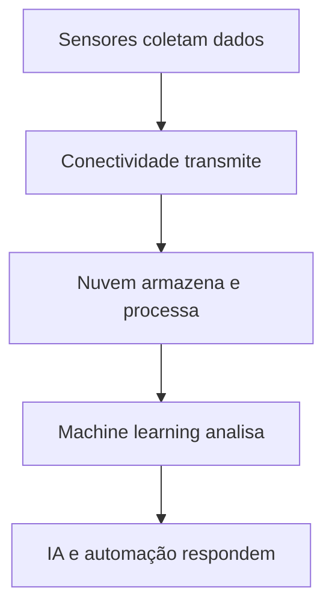
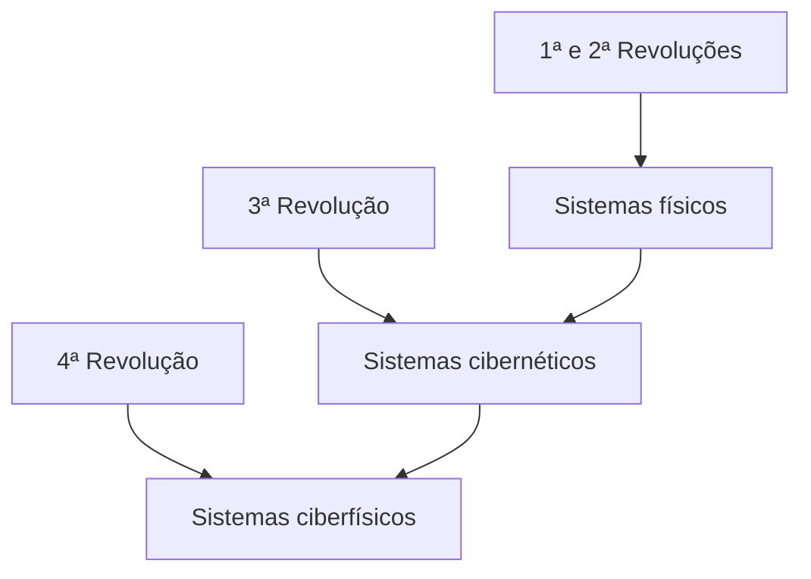
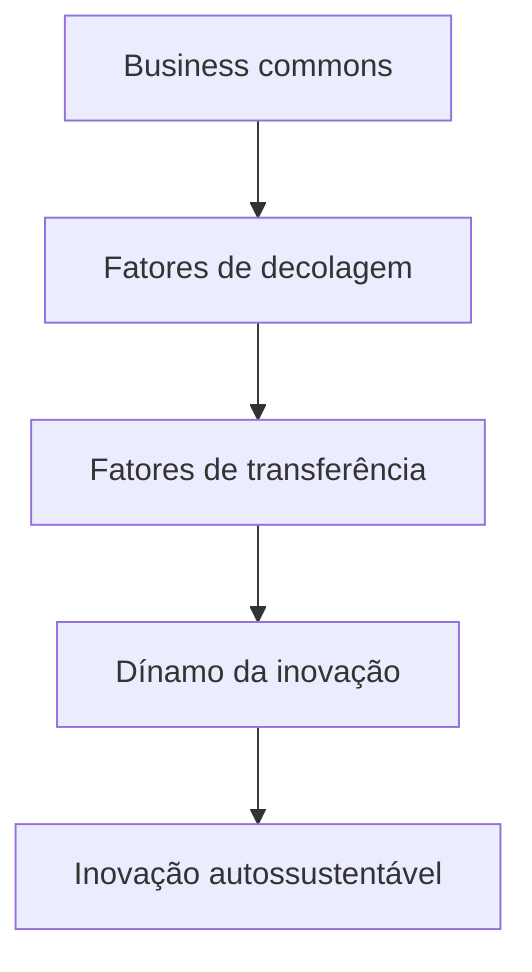
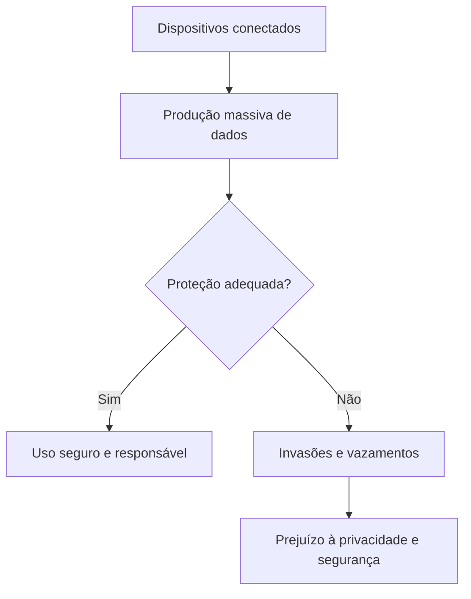

# Brasil e Internet das Coisas

## Conceito e fundamentos da IoT

> [!info] Internet das Coisas
> A Internet das Coisas (IoT) conecta pessoas, processos e objetos para coletar, transmitir e analisar dados com pouca intervenção humana.

A **Internet das Coisas**, ou IoT, é uma das tecnologias mais relevantes do século XXI. Ela combina dispositivos conectados, computação em nuvem, grandes volumes de dados, análise avançada e tecnologias móveis. Essa integração permite que objetos físicos compartilhem informações e executem funções automatizadas.

Os carros conectados exemplificam essa transformação: além de trocar informações com outros sistemas, podem receber atualizações de software e manter uma relação contínua entre fabricantes, veículos e clientes.

### Tecnologias que viabilizam a IoT

Segundo o material, a IoT depende de cinco tecnologias práticas:

1. **Sensores de baixo custo e baixo consumo:** coletam informações do ambiente e tornam a IoT acessível a um número maior de fabricantes.
2. **Conectividade:** utiliza protocolos de rede para comunicar sensores, dispositivos, plataformas e serviços em nuvem.
3. **Computação em nuvem:** oferece infraestrutura escalável sem que empresas e usuários precisem administrar todos os recursos físicos.
4. **Aprendizagem de máquina e análise avançada:** processam grandes quantidades de dados e identificam padrões que apoiam decisões e automações.
5. **Inteligência artificial conversacional:** permite que dispositivos compreendam e respondam à linguagem humana, como ocorre com Alexa, Cortana e Siri.

A aprendizagem de máquina envolve processos como mineração de dados, classificação, algoritmos de aprendizagem, redes neurais, aprendizagem profunda, inteligência artificial e automatização.

> [!tip] Resumindo
> Sensores captam informações, as redes transmitem os dados, a nuvem os armazena e técnicas de análise e inteligência artificial produzem respostas ou decisões.

## Políticas públicas brasileiras para a IoT

> [!info] Plano Nacional de IoT
> O Brasil criou políticas destinadas a estimular a pesquisa, a segurança, a inovação e a adoção de sistemas conectados.

Em 2019, o **Decreto nº 9.854** instituiu o Plano Nacional de Internet das Coisas. Entre as ações públicas relacionadas à implantação da IoT no país estão:

- aprovação, pela União Internacional de Telecomunicações, de orientação baseada no plano brasileiro para políticas de IoT;
- implantação de um centro de referência em IoT e tecnologias 4.0;
- cooperação entre Brasil e União Europeia para usar IoT no combate à obesidade infantil e na melhoria da qualidade de vida;
- redução a zero das taxas de fiscalização de instalação e funcionamento dos sistemas de comunicação máquina a máquina;
- participação do MCTI no lançamento do BNDES Crédito e Serviços 4.0;
- pesquisa do GT Arquimedes, da RNP/MCTI, para uma implantação segura da IoT no Brasil;
- desenvolvimento de sistemas inteligentes de iluminação pública pela EMBRAPII/MCTI.

Essas iniciativas demonstram que a adoção da IoT depende não apenas de dispositivos, mas também de políticas públicas, pesquisa, financiamento, infraestrutura e normas de segurança.

## Mercado eletroeletrônico e perspectivas nacionais

> [!info] Potencial econômico
> O mercado eletroeletrônico fornece parte da infraestrutura necessária à expansão da IoT e da indústria 4.0.

O Brasil apresenta condições para desenvolver e produzir tecnologias destinadas a diversas aplicações de IoT. A Associação Brasileira da Indústria Elétrica e Eletrônica (ABINEE), criada em 1963, representa empresas nacionais e internacionais dos setores elétrico e eletrônico.

Em 2022, o setor eletroeletrônico faturou aproximadamente **R\$ 220,4 bilhões**, com crescimento nominal de 4% em relação a 2021. Quando considerada a inflação, porém, ocorreu uma redução real de 2%. O nível de emprego passou de 264 mil pessoas, em dezembro de 2021, para 270 mil em 2022, representando aumento de 2%.

As exportações cresceram 16%, passando de US\$ 5,7 bilhões para US\$ 6,6 bilhões. As importações aumentaram 14%, de US\$ 40,2 bilhões para US\$ 45,9 bilhões.

### Faturamento por área tecnológica

| Área tecnológica | 2021 (R\$ milhões) | 2022 GTD (R\$ milhões) | Variação nominal | Variação real pelo IPP |
|---|---:|---:|---:|---:|
| Automação industrial | 7.040 | 8.356 | 19% | 12% |
| Componentes | 13.933 | 13.580 | -3% | -3% |
| Equipamentos industriais | 36.308 | 42.190 | 16% | 10% |
| GTD | 20.781 | 24.968 | 20% | 13% |
| Informática | 47.345 | 44.504 | -6% | -6% |
| Material de instalação | 12.213 | 12.870 | 5% | -1% |
| Telecomunicações | 44.562 | 46.478 | 4% | 0% |
| Utilidades domésticas | 29.126 | 27.495 | -6% | -11% |
| **Total** | **211.308** | **220.441** | **4%** | **-2%** |

A diferença entre crescimento nominal e real ocorre porque a variação real considera o **Índice de Preços ao Produtor (IPP)**. Assim, embora o faturamento total tenha crescido em valores correntes, o resultado deflacionado revelou retração.

> [!warning] Atenção
> O aumento nominal de 4% não significou crescimento efetivo do setor: após o ajuste pelo IPP, houve queda real de 2%.

## Potencial brasileiro de liderança em IoT

> [!info] Cooperação tecnológica
> A liderança brasileira depende da capacidade de criar tecnologias, integrar instituições e superar barreiras de infraestrutura e inovação.

O Brasil ainda produz, integra ou monta parte dos equipamentos de IoT fora do país, mas participa de projetos tecnológicos baseados em cooperação internacional. Um exemplo é o **Subutai Blockchain Router**, desenvolvido de maneira colaborativa pelo LSI-TEC, CITI-USP e OptDyn.

Esse equipamento reúne funções de:

- roteador doméstico;
- servidor de nuvem P2P;
- *gateway* de IoT;
- minerador de criptomoedas de baixo consumo energético.

Um **gateway** é uma porta de comunicação entre redes distintas. Seu desenvolvimento seguro pode favorecer novos projetos associados à indústria 4.0.

## Indústria 4.0 e sistemas ciberfísicos

> [!info] Indústria 4.0
> A quarta revolução industrial integra objetos físicos, sistemas digitais, inteligência artificial, robótica, nuvem e IoT.

A indústria 4.0 promove automação industrial com menor necessidade de intervenção humana direta. Seu desafio é integrar tecnologias como inteligência artificial, robótica, Internet das Coisas e computação em nuvem.

A evolução das revoluções industriais pode ser compreendida por seus principais tipos de implementação:

Nas duas primeiras revoluções predominaram os **sistemas físicos**, associados às máquinas e aos processos industriais. A terceira introduziu os **sistemas cibernéticos**, baseados em computação e automação digital. A quarta reúne as duas dimensões em **sistemas ciberfísicos**, nos quais elementos físicos e digitais comunicam-se e atuam conjuntamente por meio da IoT.

Essa transformação também exige repensar os sistemas econômicos, políticos e sociais, além de promover o empreendedorismo e o desenvolvimento de produtos inovadores e de baixo custo.

## Cidades inteligentes

> [!info] Cidade inteligente
> É uma cidade que usa tecnologias conectadas de modo estratégico para melhorar a infraestrutura, os serviços públicos e a qualidade de vida.

As cidades inteligentes empregam dados e sistemas automatizados para administrar diferentes áreas da vida urbana. Entre as aplicações possíveis estão:

- agricultura inteligente;
- casas inteligentes;
- educação;
- energia inteligente;
- governo inteligente;
- saúde inteligente;
- transporte e mobilidade inteligente;
- varejo inteligente;
- iluminação pública;
- dados abertos.

Um exemplo é a parceria entre a **Huawei e a PUC do Rio Grande do Sul**, voltada ao desenvolvimento de um sistema de iluminação pública capaz de detectar quando uma luminária está queimada ou próxima de falhar.

Outro exemplo é o **Inatel Smart Campus**, que desenvolve projetos de IoT e redes de conectividade nas quais diferentes tecnologias, como sistemas de iluminação inteligente, podem se comunicar.

> [!tip] Resumindo
> Uma cidade torna-se inteligente quando integra informações de diferentes setores para melhorar decisões, serviços, infraestrutura e qualidade de vida.

## Benefícios da IoT para o Brasil

> [!info] Competitividade e inovação
> A IoT pode abrir mercados, aumentar a produtividade, reduzir custos e estimular o desenvolvimento tecnológico nacional.

O Brasil necessita melhorar seu desempenho em competitividade e inovação. Em 2016, ocupava a 57ª posição no índice de competitividade mundial e a 69ª posição no índice global de inovação citado no material.

Entre os principais benefícios esperados da IoT estão:

- abertura de novos mercados;
- incentivo à inovação;
- aumento da produtividade;
- redução e otimização de custos;
- melhor aproveitamento de equipamentos e recursos;
- aperfeiçoamento de produtos e serviços com base nas necessidades dos usuários.

Nesse processo, o trabalho de **UX/UI Designer** é importante. A experiência do usuário, ou UX, analisa como uma pessoa interage com um produto ou serviço. A interface do usuário, ou UI, trata dos elementos pelos quais essa interação ocorre. Os retornos dos usuários ajudam a aperfeiçoar as soluções de IoT.

## Capacidade Nacional de Absorção

> [!info] Capacidade Nacional de Absorção
> É a capacidade de um país incorporar uma tecnologia, disseminá-la pela economia e transformá-la em inovação sustentável.

A **Capacidade Nacional de Absorção (CNA)** possui quatro pilares:

1. **Business commons:** ambiente de negócios e recursos disponíveis para que as empresas realizem suas operações.
2. **Fatores de decolagem:** condições que criam massa crítica e permitem que a tecnologia ultrapasse mercados de nicho.
3. **Fatores de transferência:** mecanismos pelos quais a tecnologia se estabelece profundamente na economia e modifica comportamentos de empresas, consumidores e sociedade.
4. **Dínamo da inovação:** estágio no qual a tecnologia passa a gerar inovação e desenvolvimento autossustentáveis.

Para ampliar sua capacidade de absorção, o Brasil precisa observar:

- a interoperabilidade entre máquinas e sistemas de diferentes fornecedores;
- a ética na comunicação máquina a máquina, ou M2M;
- a proteção dos dados pessoais conforme a LGPD;
- o sistema nacional de patentes e a transferência de tecnologia;
- a reavaliação contínua do desenvolvimento tecnológico;
- o diagnóstico e aperfeiçoamento das políticas públicas.

A **interoperabilidade** é a capacidade de equipamentos e programas distintos trabalharem em conjunto. A comunicação **M2M** ocorre quando máquinas trocam informações em tempo real sem depender continuamente da intervenção humana.

## Riscos e aspectos negativos da IoT

> [!warning] Atenção
> Quanto maior o número de dispositivos conectados, maiores são os riscos relacionados à vigilância, privacidade, segurança e uso indevido dos dados.

### Pax technica e sociotecnocracia

O conceito de **pax technica** descreve um cenário no qual sistemas de governo e grandes organizações utilizam dados produzidos por dispositivos conectados para conhecer comportamentos, hábitos e crenças sociais. Isso pode originar **sociotecnocracias**, nas quais a tecnologia e o controle de dados exercem forte influência sobre a organização da sociedade.

Smartphones, tablets e televisores inteligentes estão entre os dispositivos capazes de gerar e transmitir essas informações. Como consequência, governos e empresas passam a exercer maior impacto sobre a privacidade, a segurança e a relação entre consumidores, máquinas e organizações.

### Segurança de Big Data

A IoT produz grandes volumes de dados, inclusive em setores sensíveis como saúde e meio ambiente. Por isso, é necessário proteger o **Big Data**, entendido como conjuntos de dados muito extensos e variados que exigem tecnologias específicas de armazenamento e análise.

Os principais problemas de segurança mencionados são:

- falhas de privacidade;
- autorizações insuficientes;
- ausência de criptografia no transporte dos dados;
- interfaces web inseguras;
- programas de proteção inadequados.

### Ataques a dispositivos conectados

Hackers podem invadir e interferir em sistemas de IoT. Entre os riscos apresentados estão:

- perda do controle de veículos conectados por meio de GPS, câmeras e comandos de voz;
- captura não autorizada de conversas e hábitos de usuários de smart TVs;
- sobrecarga da largura de banda dos servidores;
- bloqueio de informações por códigos maliciosos do tipo **ransomware**.

O ransomware é um programa malicioso que impede o acesso às informações ou aos sistemas, normalmente com o objetivo de exigir alguma forma de pagamento para liberá-los.

> [!tip] Medidas necessárias
> É preciso realizar testes contínuos de vulnerabilidade, atualizar ferramentas de segurança, usar criptografia, controlar autorizações e orientar os usuários.

Os setores público e privado devem equilibrar os benefícios da IoT com a proteção dos direitos constitucionais. Isso inclui promover consumidores mais cautelosos, fortalecer direitos democráticos, aperfeiçoar os instrumentos jurídicos e avaliar continuamente os efeitos sociais e econômicos das inovações.

## Síntese final

> [!summary] Síntese
> O Brasil possui mercado, projetos e políticas capazes de impulsionar a IoT, mas sua liderança depende de inovação, interoperabilidade, infraestrutura, proteção de dados e segurança digital.

A Internet das Coisas pode contribuir para o crescimento econômico, a produtividade, a redução de custos, a indústria 4.0 e a criação de cidades inteligentes. Projetos nacionais de iluminação, conectividade e equipamentos multifuncionais demonstram o potencial brasileiro.

Entretanto, os resultados econômicos mostram que o crescimento nominal não representa necessariamente expansão real. Além disso, a disseminação da IoT amplia riscos ligados à vigilância, à sociotecnocracia, à vulnerabilidade dos dispositivos, aos ataques cibernéticos e ao tratamento de grandes volumes de dados.

A consolidação da IoT no Brasil exige cooperação entre universidades, empresas e Estado, além de políticas públicas, investimentos em pesquisa, proteção jurídica, segurança da informação e respeito à privacidade.

# Questionário — Dúvidas frequentes

> [!question] Quais são as tecnologias práticas da IoT mencionadas pela empresa Oracle?
>
>> [!question]- Resposta
>>
>> As tecnologias práticas são: acesso a sensores de baixo custo e baixa potência; conectividade; plataformas de computação em nuvem; aprendizagem de máquina e análise avançada; e inteligência artificial conversacional.

> [!question] Defina cidades inteligentes e cite exemplos existentes.
>
>> [!question]- Resposta
>>
>> Cidades inteligentes são projetos de IoT nos quais as cidades usam tecnologias de forma estratégica para melhorar a infraestrutura e a qualidade de vida dos habitantes. Entre os exemplos estão agricultura inteligente, energia inteligente, casa inteligente, varejo inteligente, mobilidade inteligente, saúde inteligente e iluminação pública inteligente.

> [!question] Quanto à indústria 4.0, cite os três grandes marcos das revoluções industriais tecnológicas e suas implementações.
>
>> [!question]- Resposta
>>
>> A 1ª e a 2ª Revoluções Industriais implementaram sistemas físicos; a 3ª Revolução Industrial implementou sistemas cibernéticos; e a 4ª Revolução Industrial passou a integrar a IoT na criação de sistemas ciberfísicos.

> [!question] Explique o que é o fenômeno *pax technica*.
>
>> [!question]- Resposta
>>
>> É o fenômeno em que os atuais sistemas de governo podem originar sociotecnocracias, pois dispositivos de IoT geram e transmitem dados sobre os comportamentos, hábitos e crenças da sociedade.