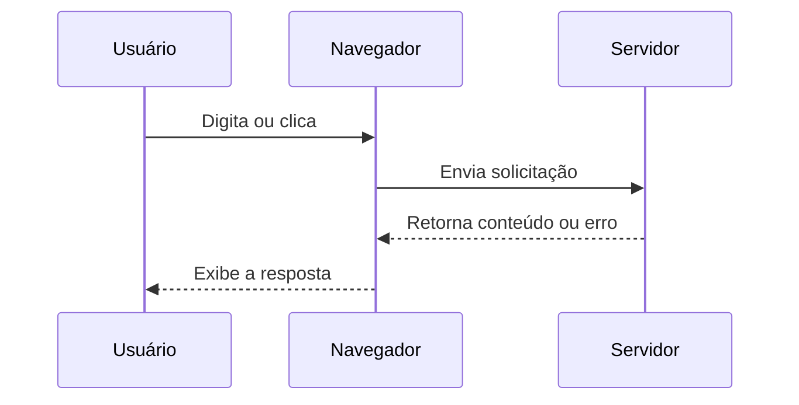
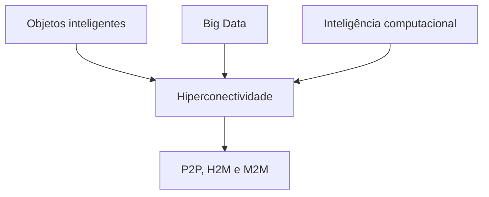
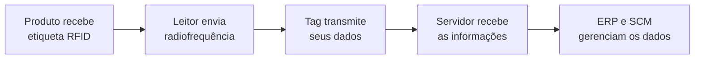

# IoT e a variedade de sistemas

> [!info] Objetivo
> Compreender a evolução da interação com a internet e conhecer os principais componentes da Internet das Coisas (IoT), como sensores, atuadores, sistemas embarcados, redes sem fio e identificação por radiofrequência (RFID).

**Palavras-chave:** Internet das Coisas (IoT), computação ubíqua, hiperconectividade, rede de sensores sem fio (WSN), sensores, atuadores, sistemas embarcados, RFID, NFC e aplicações inteligentes.

## Evolução da interação com a internet

> [!info] Interação tradicional
> Na interação simples com a internet, o usuário envia uma solicitação por meio de um navegador e recebe uma resposta produzida pelo servidor.

Os navegadores ou *browsers* permitem que computadores, notebooks, tablets e smartphones enviem solicitações a servidores. O usuário interage digitando informações, clicando em links ou selecionando comandos. Em resposta, o servidor fornece o conteúdo solicitado ou informa algum problema, como ocorre com a mensagem de erro 404, que indica que uma página ou endereço não está disponível.

A *World Wide Web* — WWW ou simplesmente web — é apenas uma das ferramentas de acesso à internet, ao lado de serviços como e-mail, FTP e mensagens instantâneas. Sua função é permitir o compartilhamento de arquivos, como documentos HTML, usando o navegador como meio de acesso e o protocolo HTTP para a transferência das informações.

A estrutura básica da web compreende:

- **Navegador:** programa usado para acessar e apresentar o conteúdo;
- **HTML, CSS e JavaScript:** linguagens empregadas na construção das páginas;
- **Servidor web:** ambiente no qual os arquivos e serviços são hospedados.

> [!tip] Resumindo
> A web é uma aplicação da internet formada por navegadores, linguagens de desenvolvimento, servidores e protocolos de comunicação.

## Evolução das versões da web

> [!info] Gerações da web
> As versões da web distinguem-se principalmente pelo grau de interação, integração e inteligência oferecido aos usuários.

A **Web 1.0**, chamada de “web do conhecimento”, caracterizou-se pelo aumento da quantidade de informações disponíveis. A **Web 2.0**, ou “web da comunicação”, ampliou a interatividade das plataformas e a comunicação entre as pessoas.

A **Web 3.0**, também denominada web semântica ou inteligente, utiliza conexões e cruzamentos de dados para permitir a interação entre pessoas, sistemas e objetos. Essa evolução está diretamente associada ao desenvolvimento da Internet das Coisas.

A Web 3.0 envolve:

- conectividade onipresente;
- redes integradas e descentralizadas;
- computação em nuvem e redes P2P;
- tecnologias de código aberto;
- dados abertos;
- cadastros integrados entre diferentes serviços.

As tendências indicam ainda o desenvolvimento da **Web 4.0 ou Web 5.0**, apresentada como uma web simbiótica, capaz de integrar sentimentos e emoções humanas à tecnologia ou de funcionar de maneira semelhante a um cérebro.

## Sistemas de Internet das Coisas

> [!info] IoT
> A Internet das Coisas conecta sensores, equipamentos e objetos cotidianos às redes digitais, permitindo coletar dados, trocar informações e executar ações.

A IoT modificou o fluxo tradicional de interação com a internet porque a comunicação deixou de ocorrer somente entre pessoas, navegadores e servidores. Sensores, eletrodomésticos, veículos, dispositivos vestíveis e equipamentos industriais também passaram a participar desse processo.

Entre os exemplos de sistemas IoT estão:

- **Automação residencial:** controla iluminação, aquecimento, portas e outros equipamentos por rede local, internet, Wi-Fi ou smartphone;
- **Monitoramento aberto de radiação:** utiliza conjuntos ou *arrays* de sensores, como os sistemas SafeCast desenvolvidos após o desastre nuclear de Fukushima;
- **Projetos do movimento *maker*:** empregam smartphones, termostatos inteligentes, acelerômetros, GPS e relógios inteligentes para criar soluções de baixo custo;
- **Kits para projetos IoT:** oferecem ambientes modulares de hardware e software, como os baseados em Arduino e o Photon, fabricado pela Particle.

> [!tip] Resumindo
> Um sistema IoT combina objetos físicos, sensores, conectividade, processamento de dados e mecanismos capazes de apresentar informações ou atuar no ambiente.

## Computação ubíqua e hiperconectividade

> [!info] Computação ubíqua
> É a integração natural e onipresente das tecnologias ao cotidiano das pessoas, com dispositivos disponíveis em diferentes lugares e situações.

A IoT integra um processo gradual de desenvolvimento de tecnologias de baixo custo e baixo consumo de energia. Por isso, constitui parte da **computação ubíqua ou pervasiva**, na qual os recursos computacionais tornam-se incorporados ao cotidiano.

A **hiperconectividade** é o cenário digital formado pela relação entre objetos inteligentes, grandes volumes de dados e inteligência computacional. Esse cenário também pode ser explicado pelo chamado **ABC das TICs**:

- **A — *Analytics*:** análise dos dados;
- **B — *Big Data*:** grandes conjuntos de dados;
- **C — *Cloud computing*:** computação em nuvem.

A hiperconectividade permite diferentes modalidades de comunicação:

- **P2P (*person-to-person*):** comunicação entre pessoas;
- **H2M (*human-to-machine*):** comunicação entre pessoas e máquinas;
- **M2M (*machine-to-machine*):** comunicação direta entre máquinas.

## Tecnologias associadas à IoT

> [!info] Infraestrutura tecnológica
> A IoT depende de tecnologias que identificam objetos, coletam dados, estabelecem conexões e processam informações.

A **identificação por radiofrequência (RFID)** utiliza etiquetas eletrônicas para identificar objetos automaticamente.

As **redes de sensores sem fio (WSN)** são formadas por nós sensores capazes de detectar, processar e transmitir dados sem fio. O processamento pode ocorrer de maneira independente ou coordenada com nós vizinhos, que encaminham as informações aos usuários ou aos **nós processadores**, chamados de *sink nodes*. Essas redes variam desde dispositivos minúsculos, como o *smart dust*, até estações meteorológicas equipadas com GPS.

Os padrões **ZigBee, Z-Wave, ANT e Bluetooth** permitem criar redes de pequena escala, como sistemas domésticos, ou de grande escala, como redes de monitoramento industrial.

A **computação em nuvem** permite compartilhar, coletar, armazenar e processar informações em servidores acessados pela internet. Desse modo, aplicações IoT podem consultar bancos de dados remotos em tempo real.

A **comunicação de campo próximo (NFC)** é uma tecnologia sem fio de curta distância, operada na frequência de 13,56 MHz. Ela permite transações bidirecionais e sem contato entre dispositivos, como pagamentos realizados pela aproximação de um smartphone a um terminal eletrônico.

> [!warning] Atenção
> RFID, WSN, Bluetooth, NFC e computação em nuvem desempenham funções diferentes, embora possam ser combinados em uma mesma solução IoT.

## Produtos de hardware IoT e aplicações SMART

> [!info] Sistema embarcado
> Um sistema embarcado combina hardware e software para executar uma tarefa específica dentro de um produto ou equipamento.

O produto físico IoT é constituído principalmente por **sensores, atuadores e sistemas embarcados**. Esses componentes permitem captar condições do ambiente, processar os dados e realizar alguma ação.

As aplicações **SMART** estão presentes em diferentes segmentos:

- **Casa inteligente (*smart home*):** usa um servidor *gateway* para estabelecer a comunicação entre dispositivos ou redes. O controle pode ser feito por smartphones ou assistentes virtuais;
- **Saúde inteligente (*smart health*):** emprega sensores para medir pressão arterial, temperatura e glicose, enviando os resultados para interpretação remota;
- **Carro inteligente (*smart car*):** utiliza geolocalização, gerenciamento do motor e recursos para localizar o veículo em caso de roubo ou acidente;
- **Logística inteligente:** utiliza etiquetas RFID para rastrear pedidos, controlar frotas e acompanhar a temperatura de produtos;
- **Cidade inteligente (*smart city*):** aplica infraestrutura e serviços de TIC à governança, administração pública, planejamento urbano, meio ambiente, economia, coesão social e qualidade de vida.

## Sensores de IoT

> [!info] Sensores
> Sensores detectam condições físicas ou químicas e convertem os estímulos recebidos em sinais que podem ser interpretados por sistemas eletrônicos.

Os sensores podem fazer parte do projeto original de um produto ou ser incorporados a sistemas legados, inclusive equipamentos antigos. Nesse caso, um sistema embarcado converte os sinais analógicos em dados digitais e os transmite pela rede.

Os dados coletados podem ser enviados para aplicativos, analisados e processados para orientar ações locais ou remotas. Relógios inteligentes, dispositivos vestíveis, automóveis, iluminação LED e máquinas industriais são exemplos de equipamentos que usam sensores.

No sistema de freios antitravamento **ABS**, os sensores detectam o acionamento e as condições de frenagem. O sistema embarcado coleta os dados e envia comandos aos atuadores, que controlam os freios para evitar o travamento das rodas.

### Principais tecnologias de sensores

- **Sensores de presença:** detectam pessoas ou objetos sem contato físico, usando infravermelho, ultrassom ou micro-ondas;
- **Sensores de proximidade:** identificam a aproximação de objetos por ondas de rádio ou sonoras e por mecanismos indutivos, capacitivos, fotoelétricos ou ultrassônicos;
- **Encoders:** usam transdutores para medir deslocamentos angulares ou lineares e informar velocidade e posição;
- **Fotossensores:** detectam presença ou ausência de luz e transformam o estímulo luminoso em sinal elétrico;
- **Acelerômetros:** identificam variações de velocidade, vibrações, choques e impactos;
- **Sensores de pressão e temperatura:** acompanham processos industriais e podem atuar como recursos de segurança.

## Atuadores na IoT

> [!info] Atuadores
> Atuadores recebem sinais ou comandos eletrônicos e realizam intervenções no ambiente físico.

A relação entre sensores e atuadores pode ser comparada ao corpo humano: olhos, ouvidos, nariz, língua e pele funcionam como sensores, enquanto os músculos desempenham o papel dos atuadores, executando as ações.

Os atuadores fazem parte dos **sistemas ciberfísicos (CPS)**, nos quais recursos computacionais interagem diretamente com componentes físicos. Esses sistemas aparecem em leitores ópticos, RFID, códigos de barras, QR Codes, veículos autônomos e robôs.

Os principais tipos de atuadores são:

- **Válvulas solenoides:** usam sinais elétricos para abrir ou fechar válvulas hidráulicas ou pneumáticas;
- **Servomotores:** utilizam realimentação eletroeletrônica para controlar posição, força e torque;
- **Motores de passo:** realizam movimentos discretos em pequenos ângulos;
- **Relés:** empregam um sinal de baixa intensidade para controlar circuitos com correntes mais elevadas;
- **Aquecedores e resfriadores:** provocam alterações térmicas no ambiente ou equipamento.

> [!tip] Sensores e atuadores
> O sensor percebe e produz dados; o atuador recebe comandos e modifica o meio físico.

## RFID: leitores, antenas e etiquetas

> [!info] Identificação por radiofrequência
> RFID é uma tecnologia que utiliza ondas eletromagnéticas para identificar objetos e obter informações sobre estado, localização, quantidade ou alterações ambientais.

Dois acontecimentos contribuíram para o desenvolvimento dos objetos conectados: na década de 1990, Bill Joy criou o conceito de conexão direta entre dispositivos, conhecido como D2D; em 1999, Kevin Ashton criou o termo Internet das Coisas.

Um sistema RFID conecta objetos e equipamentos cotidianos a grandes bases de dados. As informações ficam armazenadas em um microchip associado a uma antena. O leitor utiliza ondas eletromagnéticas para acessar esses dados e encaminhá-los aos sistemas responsáveis pelo processamento.

O funcionamento apresentado no material ocorre em quatro etapas:

1. Os produtos recebem etiquetas RFID contendo seus dados e uma antena para receber e transmitir sinais;
2. Antenas, leitores, portais e prateleiras usam sinais de radiofrequência para localizar os produtos etiquetados;
3. O leitor identifica os dados das etiquetas e os envia ao computador, que os integra ao servidor ERP;
4. Os sistemas ERP e SCM controlam e gerenciam as informações recebidas.

O RFID não deve ser entendido simplesmente como sucessor do código de barras. Além da identificação, ele pode registrar informações sobre estado, localização, quantidade e mudanças na qualidade física dos produtos por meio de tecnologias sensoriais.

## Antenas RFID

> [!info] Função das antenas
> As antenas direcionam a transmissão ou captam a recepção da radiação eletromagnética usada na comunicação RFID.

As antenas podem ser classificadas como:

- **Eletricamente pequenas:** possuem dimensão física menor que o comprimento da onda na frequência de operação;
- **Ressonantes:** apresentam uma dimensão equivalente à metade do comprimento da onda;
- **De banda larga:** operam em uma faixa ampla de frequências;
- **De abertura:** possuem uma região aberta responsável pela propagação das ondas eletromagnéticas.

## Etiquetas ou tags RFID

> [!info] Transponder
> A etiqueta RFID também é chamada de transponder porque armazena dados e responde aos sinais recebidos por meio de um microchip e uma antena.

A escolha da etiqueta deve considerar sua memória, fonte de energia e frequência de operação.

Quanto à memória, as tags podem ser:

- **RO (*read only*):** apenas leitura;
- **WORM (*write once/read many*):** permite uma gravação e várias leituras;
- **RW (*read/write*):** permite leitura e gravação.

Quanto à alimentação, classificam-se em:

- **Passivas:** não possuem bateria e recebem energia do campo eletromagnético criado pelo leitor;
- **Semipassivas:** possuem uma bateria de baixo custo, empregada para suportar maior armazenamento de dados;
- **Ativas:** possuem bateria e transmissor próprios.

### Faixas de frequência

| Faixa | Frequência | Alcance | Aplicações apresentadas |
|---|---:|---:|---|
| **LF** | 125 a 134 kHz | Menos de 0,5 m | Rastreamento de animais, controle de acesso, imobilização de veículos, autenticação de produtos, bagagens, carros inteligentes e bibliotecas |
| **HF** | 13,56 MHz | Menos de 1 m | Identificação de itens, bagagens, carros inteligentes e bibliotecas |
| **UHF** | 860 a 960 MHz | Até 9 m | Controle de fornecimento e logística |
| **Micro-ondas** | 2,45 a 5,8 GHz | Acima de 10 m | Logística e pedágio eletrônico |

> [!warning] Frequência e alcance
> A frequência influencia o alcance e as aplicações da etiqueta. Por isso, a tag deve ser selecionada conforme a distância de leitura e a finalidade do sistema.

## Leitores RFID e middleware

> [!info] Leitor RFID
> O leitor cria, amplia e envia sinais de radiofrequência, recebe as respostas das etiquetas e prepara os dados para envio ao servidor.

O leitor identifica, organiza, filtra e agrega os dados obtidos das tags. O serviço intermediário de comunicação e controle que liga os dispositivos RFID aos sistemas de informação é chamado de **middleware RFID**.

Os principais modelos são:

- **Leitor portátil:** possui tela e é aproximado do produto durante a captura dos dados;
- **Leitor de posição fixa:** permanece instalado em pontos estratégicos, como portas, docas de carregamento e esteiras automáticas;
- **Leitor embutido ou embarcado:** é integrado à placa de circuito de outro equipamento, como GPS ou leitor de código de barras.

## Síntese final

> [!summary] Síntese
> A Internet das Coisas amplia a conectividade ao integrar pessoas, objetos, sensores, sistemas embarcados, atuadores e plataformas digitais.

A evolução da web e a expansão dos smartphones favoreceram o surgimento de sistemas capazes de coletar, transmitir e processar dados continuamente. Nesse contexto, a computação ubíqua torna a tecnologia presente no cotidiano, enquanto a hiperconectividade relaciona objetos inteligentes, análise de dados, Big Data e computação em nuvem.

Os sensores detectam condições ambientais e produzem dados; os sistemas embarcados processam essas informações; e os atuadores executam ações no meio físico. Tecnologias como WSN, ZigBee, Z-Wave, Bluetooth, NFC e RFID fornecem diferentes formas de identificação e comunicação.

No RFID, etiquetas armazenam informações, antenas viabilizam a comunicação eletromagnética e leitores encaminham os dados aos servidores. Sistemas empresariais, como ERP e SCM, utilizam essas informações para controlar e gerenciar objetos, estoques e processos logísticos.

# Questionário — Dúvidas frequentes

> [!question] Defina *embedded systems* na IoT.
>
>> [!question]- Resposta
>>
>> São sistemas embarcados que combinam hardware e software para executar uma tarefa específica.

> [!question] Explique e exemplifique aplicações SMART em diferentes segmentos de mercado.
>
>> [!question]- Resposta
>>
>> As aplicações SMART utilizam dispositivos conectados e recursos computacionais para tornar diferentes ambientes e serviços mais inteligentes. A casa inteligente usa um servidor *gateway* para comunicar dispositivos ou redes e pode incluir sensores, segurança, aquecimento e entretenimento. A saúde inteligente utiliza sensores para medir pressão arterial, temperatura e glicose, enviando os dados para interpretação remota dos médicos. O carro inteligente emprega geolocalização para gerenciar o motor e localizar o veículo em casos de roubo ou acidente. A logística inteligente utiliza etiquetas RFID para rastrear pedidos, controlar frotas e acompanhar a temperatura dos produtos.

> [!question] Cite características e aplicações das faixas de frequência das etiquetas ou tags RFID mais utilizadas.
>
>> [!question]- Resposta
>>
>> A baixa frequência (LF) opera entre 125 e 134 kHz, possui alcance inferior a 0,5 m e pode ser usada no rastreamento de animais, controle de acesso, imobilização de veículos, autenticação de produtos, identificação de itens, bagagens, carros inteligentes e bibliotecas. A alta frequência (HF) opera em 13,56 MHz, alcança menos de 1 m e é indicada para identificação de itens, bagagens, carros inteligentes e bibliotecas. A ultra-alta frequência (UHF) opera entre 860 e 960 MHz, alcança até 9 m e é indicada para controle de fornecimento logístico. As micro-ondas operam entre 2,45 e 5,8 GHz, possuem alcance superior a 10 m e são usadas em logística e pedágios eletrônicos.

> [!question] Qual é a diferença entre sensores e atuadores?
>
>> [!question]- Resposta
>>
>> Os sensores detectam condições físicas ou químicas e geram dados que podem ser analisados e processados para orientar ações locais ou remotas. Os atuadores recebem sinais ou comandos eletrônicos e realizam intervenções no meio físico. Em síntese, o sensor percebe uma condição, enquanto o atuador executa uma ação.

