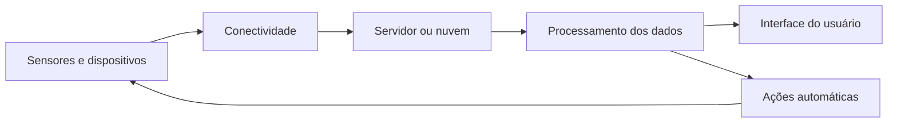
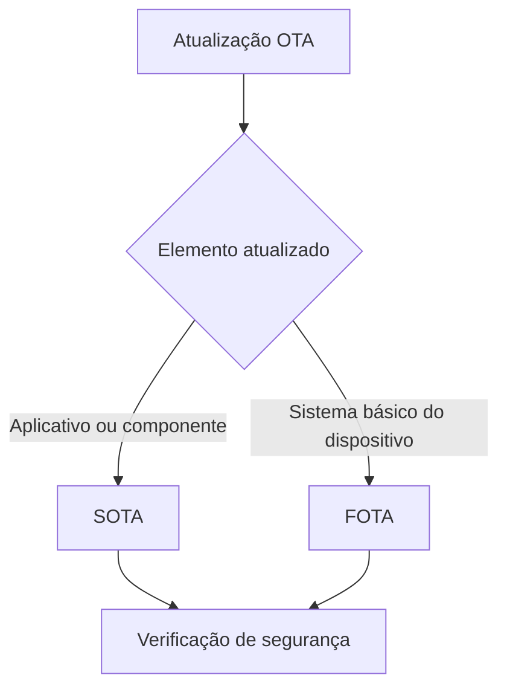

# Plataformas e tecnologias para Internet das Coisas

## Conceito de plataforma IoT

> [!info] Plataforma IoT
> É o conjunto de recursos de hardware, conectividade e software que permite coletar, transmitir, processar, armazenar e apresentar dados produzidos por dispositivos conectados.

A Internet das Coisas (IoT) ampliou a interação com a internet ao possibilitar que sensores, eletrodomésticos e outros objetos físicos sejam conectados à rede. Nesse contexto, o movimento *maker*, baseado na ideia de “faça você mesmo” (*do it yourself* — DIY), estimula a criação de produtos por meio de kits tecnológicos modulares e acessíveis.

Plataformas de código aberto, também chamadas de *open source*, permitem acesso, modificação e distribuição do código-fonte. Sua utilização pode facilitar a prototipagem, reduzir o tempo necessário para ampliar uma solução e favorecer a integração entre hardware e software.

Um sistema IoT possui quatro requisitos fundamentais:

- **Hardware:** sensores e dispositivos responsáveis pela coleta de dados físicos ou virtuais.
- **Conectividade:** roteadores ou *gateways* que transmitem dados e recebem comandos de servidores locais ou em nuvem.
- **Software:** programas que coletam, armazenam e processam os dados, apoiando a tomada de decisões.
- **Interface de usuário:** recurso, como um aplicativo móvel ou *dashboard*, que apresenta informações e permite a interação humana com o sistema.

O funcionamento básico de uma solução IoT pode ser representado pelo seguinte fluxo:

> [!tip] Resumindo
> A plataforma IoT conecta dispositivos, processa seus dados e transforma as informações obtidas em visualizações, decisões ou comandos automáticos.

## Funcionalidades das plataformas IoT

> [!info] Funções principais
> Uma plataforma IoT administra a comunicação com os dispositivos e oferece recursos para armazenamento, análise, automação e visualização de dados.

As principais funcionalidades de uma plataforma IoT são:

- oferecer uma ou mais formas de conectividade para receber dados dos dispositivos;
- armazenar grandes volumes de dados em bancos de dados;
- fornecer ferramentas de análise para extrair informações relevantes;
- empregar inteligência artificial para identificar padrões menos evidentes;
- disparar ações automáticas, inclusive em situações emergenciais;
- controlar automaticamente outros dispositivos;
- apresentar informações de maneira compreensível por meio de *dashboards*.

Essas funções permitem que os dados coletados deixem de ser apenas registros e sejam convertidos em informações úteis para monitoramento, tomada de decisões e automação.

## Protocolos de comunicação

> [!info] Protocolos
> Protocolos estabelecem as regras usadas pelos dispositivos para trocar informações por uma rede.

### MQTT

O *Message Queuing Telemetry Transport* (MQTT) é um protocolo de comunicação máquina a máquina, ou M2M. Utiliza a base TCP/IP e possui bibliotecas para diferentes linguagens de programação. Pode aplicar SSL e TLS para proteger a comunicação. Para meios de transporte como UDP ou Bluetooth, pode ser empregada sua variação MQTT-SN.

Por produzir menor processamento adicional, o MQTT é adequado para dispositivos IoT com recursos limitados e para a transmissão eficiente de mensagens. Também pode ser usado em dispositivos móveis conectados por redes 3G e 4G.

### HTTP

O *HyperText Transfer Protocol* (HTTP) possibilita a comunicação entre dispositivos e sistemas de informação pela internet ou pela *World Wide Web*. Possui amplo suporte em linguagens de programação, mas apresenta maior *overhead* do que o MQTT. O termo *overhead* corresponde ao processamento adicional necessário para realizar uma tarefa.

O HTTP pode ser utilizado em dispositivos móveis sem limitações relevantes quanto ao volume de dados trafegados por redes como 3G e 4G.

### HTTPS

O *HyperText Transfer Protocol Secure* (HTTPS) é a forma protegida do HTTP. A comunicação é criptografada, aumentando a segurança dos dados transmitidos. Assim como o HTTP, possui bibliotecas para diversas linguagens e maior *overhead* em comparação ao MQTT.

| Protocolo | Característica central | Consideração principal |
|---|---|---|
| MQTT | Comunicação M2M leve e baseada em TCP/IP | Menor processamento adicional |
| HTTP | Comunicação comum entre dispositivos e sistemas web | Maior *overhead* que o MQTT |
| HTTPS | Comunicação HTTP criptografada | Maior segurança, mas mantém o *overhead* do HTTP |

> [!warning] Atenção
> HTTP e HTTPS são amplamente suportados, mas o maior *overhead* pode ser relevante em dispositivos com pouca memória, capacidade de processamento ou energia disponível.

## Tipos de plataformas IoT

> [!info] Classificação
> As plataformas IoT podem concentrar-se em nuvem, conectividade, dados ou oferecer uma solução completa de ponta a ponta.

| Tipo | Características |
|---|---|
| **Cloud** | Reduz a complexidade da construção de pilhas de rede e fornece recursos de *back-end* para monitorar dispositivos. |
| **Connectivity** | Oferece conectividade de baixo custo, geralmente por Wi-Fi e redes celulares como 3G, 4G e LTE. |
| **Data** | Disponibiliza ferramentas para roteamento, gerenciamento, análise e visualização de dados, além de bancos de dados. |
| **End-to-end** | Integra hardware, software, conectividade, segurança, gerenciamento, monitoramento, nuvem e atualizações remotas de *firmware*. |

As plataformas *end-to-end* reúnem recursos necessários para administrar milhões de conexões simultâneas, sendo mais abrangentes do que as plataformas especializadas em apenas uma camada.

## Atualizações OTA, SOTA e FOTA

> [!info] Atualização remota
> A tecnologia OTA permite modificar programas de dispositivos por meio de um servidor central, sem contato físico com o equipamento.

As atualizações *over the air* (OTA) são realizadas remotamente pela rede. Elas se dividem principalmente em:

- **SOTA (*software over the air*):** usada para atualizar aplicativos e componentes de software não críticos.
- **FOTA (*firmware over the air*):** utilizada em alterações mais complexas que afetam o sistema básico ou *firmware* do dispositivo.

Durante essas operações, devem ser preservadas a integridade da atualização, a autorização de acesso, a privacidade da comunicação entre cliente e servidor e a autenticidade do pacote, normalmente verificada por assinatura.

> [!tip] Resumindo
> SOTA atualiza componentes de software, enquanto FOTA altera o sistema básico do dispositivo; ambas são modalidades de atualização remota OTA.

## Avaliação de uma plataforma IoT

> [!info] Critérios de escolha
> A plataforma deve ser escolhida considerando a capacidade atual da solução, seu crescimento e as exigências técnicas e financeiras do projeto.

Os principais fatores de avaliação são:

- **Escalabilidade:** capacidade de acompanhar o aumento das necessidades e da quantidade de dispositivos.
- **Confiabilidade:** funcionamento seguro da arquitetura, do tráfego e do processamento de dados.
- **Personalização:** disponibilidade de APIs e bibliotecas para integrações específicas.
- **Operações:** acesso a estatísticas, informações de hardware, módulos e serviços, além de protocolos e formatos como MQTT, WebSockets, REST, CoAP, JSON e XML.
- **Suporte de hardware e nuvem:** possibilidade de implantação em nuvem, no ambiente local ou de forma híbrida.
- **Suporte técnico:** manutenção do *back-end*, atualizações regulares, correções de erros e aplicação de *patches* de segurança.
- **Arquitetura de sistemas:** compatibilidade com as estruturas, ferramentas e linguagens necessárias.
- **Segurança:** comunicação protegida por SSL/TLS entre dispositivos e aplicações.
- **Despesas operacionais:** custos por nó, dispositivo ativo, volume de mensagens, recursos utilizados e suporte contratado.

A confiabilidade também envolve o **failover**, mecanismo pelo qual outro servidor assume um serviço quando o servidor principal apresenta problemas. Isso reduz a interrupção da plataforma e aumenta sua disponibilidade.

> [!warning] Atenção
> A melhor plataforma não é necessariamente a que oferece mais recursos, mas aquela que atende aos requisitos técnicos, à escala e ao orçamento do projeto.

## Tecnologias para desenvolvimento de projetos IoT

> [!info] Integração
> A escolha da tecnologia deve considerar a integração entre hardware e software e o tipo de processamento exigido pela aplicação.

Entre as tecnologias empregadas na criação de produtos IoT, destacam-se Arduino, Raspberry Pi e BeagleBone. O Arduino é uma placa microcontrolada muito utilizada em protótipos e sistemas de controle. Raspberry Pi e BeagleBone são computadores de placa única capazes de executar sistemas operacionais.

## Arduino

> [!info] Microcontrolador
> O Arduino é uma plataforma de baixo consumo destinada principalmente ao controle de circuitos eletrônicos por meio de portas de entrada e saída.

O Arduino UNO é um dos modelos mais usados em projetos. Seu microcontrolador Atmel AVR reúne um computador de baixo consumo em um único chip. Seus pinos permitem conectar e controlar circuitos por portas digitais e analógicas. A placa também possui temporizadores internos, regulação de tensão e, conforme o modelo, interfaces USB *slave* e OTG.

A programação pode ser realizada com a linguagem *Wiring* ou com linguagem C, apoiada por bibliotecas que facilitam a criação de diferentes projetos. No Tinkercad é possível montar circuitos virtuais com Arduino e *breadboard*, programá-los e simular seu funcionamento.

A **breadboard**, também chamada de placa de ensaio ou protoboard, permite montar circuitos eletrônicos sem soldagem. Isso facilita a experimentação e a alteração de componentes durante a prototipagem.

### Arduino sem conexão IoT

Um Arduino sem conexão de rede possui menor custo e pode ser empregado em projetos locais. Seu hardware é aberto, o software fica embarcado na placa e a programação é realizada em um ambiente de desenvolvimento integrado. Placas de expansão chamadas **shields** podem acrescentar recursos como telas e acionadores de motores.

### Arduino como dispositivo IoT

Modelos especializados possuem conexão com a internet, o que aumenta seu custo. Essa conectividade pode ser integrada, como no Arduino Ethernet e no Arduino Yun, ou adicionada por *shields* Wi-Fi e Ethernet. Alguns modelos também oferecem Bluetooth.

### Principais diferenças entre modelos

| Modelo | Portas digitais | Portas PWM | Portas analógicas | Memória | *Clock* | Tensão |
|---|---:|---:|---:|---:|---:|---:|
| UNO | 14 | 6 | 6 | 32 KB | 16 MHz | 5 V |
| Mega 2560 | 54 | 15 | 16 | 256 KB | 16 MHz | 5 V |
| Leonardo | 20 | 7 | 12 | 32 KB | 16 MHz | 5 V |
| Due | 54 | 12 | 12 | 512 KB | 84 MHz | 3,3 V |
| ADK | 54 | 15 | 16 | 256 KB | 16 MHz | 5 V |
| Nano | 14 | 6 | 8 | 16 ou 32 KB | 16 MHz | 5 V |
| Pro Mini | 14 | 6 | 8 | 16 KB | 8 ou 16 MHz | 3,3 ou 5 V |
| Esplora | Não informado | Não informado | Não informado | 32 KB | 16 MHz | 5 V |

O Mega 2560 e o ADK oferecem maior número de portas e mais memória do que o UNO. O Due apresenta o maior *clock* e a maior memória entre os modelos comparados, mas opera em 3,3 V. Nano e Pro Mini são alternativas mais compactas, embora possuam limitações de conexão e alimentação externa.

As principais desvantagens do Arduino em aplicações IoT são suas limitações de memória, processamento, quantidade de linhas de entrada e saída e tratamento de sinais com grande volume de dados.

> [!tip] Resumindo
> O Arduino é apropriado para protótipos e controle direto de sensores e atuadores, mas pode ser limitado quando a aplicação exige muito processamento ou armazenamento.

## Raspberry Pi e BeagleBone

> [!info] Computadores de placa única
> Raspberry Pi e BeagleBone possuem dimensões reduzidas, executam Linux e podem funcionar como computadores completos.

O Raspberry Pi foi desenvolvido no Reino Unido pela Fundação Raspberry Pi. Seu baixo custo e o uso de um cartão SD para instalar o sistema operacional e armazenar dados favorecem sua aplicação em projetos educacionais, industriais e de IoT.

Raspberry Pi e BeagleBone têm aproximadamente o tamanho de um cartão de crédito. Ambas as plataformas executam Linux e oferecem portas USB e saída de vídeo HDMI ou para monitores LCD. Assim, podem receber teclado, mouse e monitor e operar como computadores.

Em aplicações IoT, podem utilizar adaptadores USB Wi-Fi e pinos de entrada e saída para controlar circuitos e interagir com sensores.

### Evolução dos modelos Raspberry Pi

| Modelo | CPU/*clock* | Núcleos | RAM | Wi-Fi | Bluetooth |
|---|---|---:|---:|---|---|
| Raspberry Pi A+ | ARM1176JZF-S, 700 MHz | 1 | 256 MB | Não | Não |
| Raspberry Pi B | ARM1176JZF-S, 700 MHz | 1 | 512 MB | Não | Não |
| Raspberry Pi 2 | Cortex-A7, 900 MHz | 4 | 1 GB | Não | Não |
| Raspberry Pi Zero | ARM1176JZF-S, 1 GHz | 1 | 512 MB | Não | Não |
| Raspberry Pi Zero W | ARM1176JZF-S, 1 GHz | 1 | 512 MB | 802.11n | 4.1 |
| Raspberry Pi 3 | Cortex-A53 64 bits, 1,2 GHz | 4 | 1 GB | 802.11n | 4.1 |
| Raspberry Pi 3 B+ | Cortex-A53 64 bits, 1,4 GHz | 4 | 1 GB | 802.11n em 2,4 e 5 GHz | 4.1 |

Os primeiros modelos apresentados — A+, B, 2 e Zero — não possuem Wi-Fi nem Bluetooth integrados. O Zero W acrescentou as duas tecnologias. Os modelos Raspberry Pi 3 e 3 B+ oferecem processadores de quatro núcleos, arquitetura de 64 bits e conectividade sem fio integrada.

A primeira versão do Raspberry Pi foi baseada no sistema em um chip **Broadcom BCM2835**, que reúne processador ARM de 700 MHz, GPU VideoCore IV e memória RAM. Modelos posteriores ampliaram a capacidade de processamento, a memória e os recursos de conectividade.

Diferentemente do Arduino, o Raspberry Pi permite instalar um sistema operacional e apresenta melhor desempenho no processamento de grandes volumes de dados. Por isso, pode atender a aplicações IoT industriais mais complexas.

| Aspecto | Arduino | Raspberry Pi e BeagleBone |
|---|---|---|
| Categoria | Placa microcontrolada | Computadores de placa única |
| Sistema operacional | Software embarcado | Linux |
| Uso principal | Controle de sensores, atuadores e circuitos | Processamento, aplicações e serviços |
| Capacidade de processamento | Mais limitada | Mais elevada |
| Armazenamento | Memória interna reduzida | Cartão SD |
| Interfaces | Portas digitais e analógicas; expansão por *shields* | USB, vídeo, rede e pinos de entrada e saída |
| Indicação geral | Projetos simples e controle eletrônico | Aplicações que exigem sistema operacional e maior processamento |

> [!tip] Resumindo
> Arduino prioriza o controle eletrônico direto, enquanto Raspberry Pi e BeagleBone oferecem recursos semelhantes aos de um computador e atendem melhor a tarefas com maior volume de dados.

## Síntese final

> [!summary] Síntese
> Plataformas IoT integram dispositivos, redes, processamento e interfaces para transformar dados em informações e ações. Sua escolha depende dos protocolos, da segurança, da escalabilidade, dos custos e da capacidade de hardware exigida pela aplicação.

A construção de uma solução IoT exige a integração entre sensores, conectividade, software e interface de usuário. MQTT, HTTP e HTTPS podem transportar os dados, com diferenças de processamento e segurança. As plataformas podem especializar-se em nuvem, conectividade ou dados, ou oferecer uma solução completa *end-to-end*.

As atualizações OTA facilitam a manutenção remota por meio de SOTA e FOTA, desde que sejam garantidas integridade, privacidade e autenticidade. Na escolha da plataforma, devem ser avaliados fatores como escalabilidade, confiabilidade, personalização, suporte, arquitetura, segurança e despesas operacionais.

Quanto ao hardware, o Arduino é indicado para controle de circuitos e prototipagem de baixo consumo, enquanto Raspberry Pi e BeagleBone executam Linux e possuem maior capacidade de processamento. O Tinkercad complementa o aprendizado ao permitir a montagem e simulação virtual de projetos com Arduino e *breadboard*.

# Questionário

> [!question] Defina *failover*, termo associado à confiabilidade da plataforma IoT.
>
>> [!question]- Resposta
>>
>> *Failover* é a disponibilidade de outro servidor para assumir determinado serviço caso o servidor principal apresente problemas.

> [!question] Quais fatores podem ser usados para avaliar uma plataforma IoT?
>
>> [!question]- Resposta
>>
>> Os fatores são: escalabilidade, confiabilidade, personalização, operações, suporte de hardware, tecnologia de nuvem, suporte técnico, arquitetura de sistemas, segurança e despesas operacionais.

> [!question] Liste as características da placa Arduino UNO.
>
>> [!question]- Resposta
>>
>> O Arduino UNO é uma das placas mais utilizadas em projetos. Trata-se de uma placa microcontrolada formada por um computador de baixo consumo contido em um chip, que permite conectar circuitos eletrônicos aos seus pinos de entrada e saída.

> [!question] As placas Raspberry Pi e BeagleBone apresentam características técnicas em comum. Quais são elas?
>
>> [!question]- Resposta
>>
>> Ambas são computadores de placa única com aproximadamente o tamanho de um cartão de crédito. Executam o sistema operacional Linux e possuem portas USB e saída de vídeo HDMI para conectar teclado, mouse e monitor, podendo funcionar como computadores.