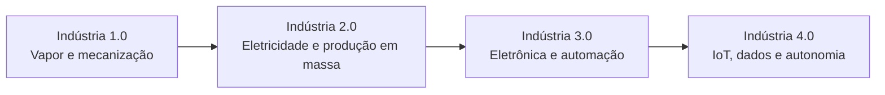
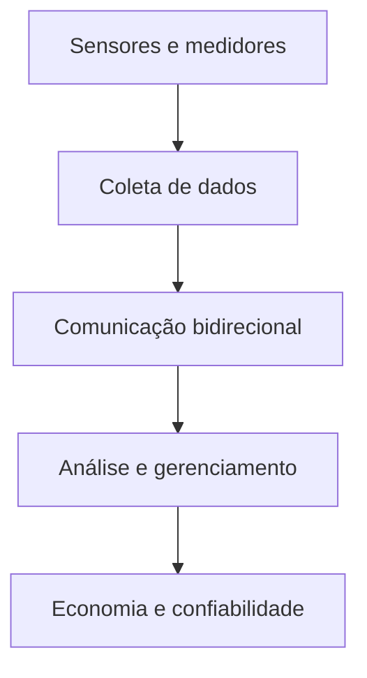
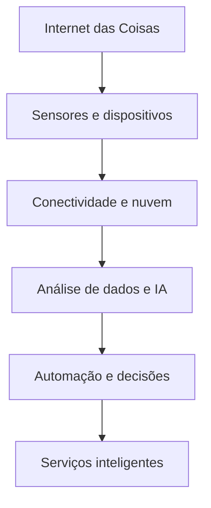

# Estudos de caso em IoT: segmentos inteligentes, mobilidade urbana e Indústria 4.0

> [!info] Objetivo
> Compreender as principais aplicações da Internet das Coisas em cidades, residências, saúde, fábricas, energia, edifícios, transportes e agricultura.

A Internet das Coisas (IoT) permite conectar sensores, equipamentos, sistemas e usuários para coletar, transmitir e analisar dados. Essas capacidades dão origem aos segmentos *smart*, nos quais informações em tempo real são empregadas para automatizar processos, melhorar decisões, reduzir custos e utilizar recursos com maior eficiência.

## IoT e as revoluções industriais

> [!info] Evolução industrial
> As revoluções industriais mostram a passagem da mecanização para sistemas inteligentes, conectados e capazes de tomar decisões.

A **Indústria 1.0** introduziu a mecanização da manufatura por meio do vapor e da energia hidráulica. A **Indústria 2.0** incorporou a eletricidade e as linhas de montagem para viabilizar a produção em massa. Na **Indústria 3.0**, eletrônica, controladores lógicos programáveis, sistemas de TI e robótica permitiram automatizar a produção.

A **Indústria 4.0** corresponde à fábrica inteligente. Nela, sistemas ciberfísicos, IoT, computação em nuvem, aprendizado de máquina e análise de *Big Data* promovem interoperabilidade e decisões autônomas.

> [!tip] Resumindo
> A IoT é uma das bases da Indústria 4.0 porque integra máquinas, dados e sistemas em ambientes produtivos inteligentes.

## Cidades inteligentes — *smart cities*

> [!info] Conceito
> Uma cidade inteligente utiliza tecnologias e dados para planejar, monitorar e aperfeiçoar serviços urbanos.

As *smart cities* aplicam recursos de IoT nas esferas social, ambiental, econômica e política. Entre seus campos estão economia, edifícios, mobilidade, energia, planejamento e governança inteligentes.

A **mobilidade inteligente** melhora o fluxo urbano e fornece informações em tempo real aos cidadãos. Seus resultados incluem melhores condições de viagem, acessibilidade, redução de custos e diminuição das emissões de CO₂. A infraestrutura de comunicação, especialmente a disponibilidade de Wi-Fi, possibilita a conexão dos dispositivos.

Entre as principais soluções urbanas estão:

| Solução | Funcionamento | Benefícios |
|---|---|---|
| Transporte público inteligente | Coleta e analisa dados dos transportes | Otimiza rotas e horários, reduz atrasos e prevê manutenções |
| Tráfego inteligente | Sensores monitoram veículos e pedestres | Indica melhores rotas e economiza tempo e custos |
| Estacionamento inteligente | Sensores identificam vagas e permitem escolha ou pagamento | Reduz o tempo de procura, o combustível consumido e as emissões |
| Sinalização inteligente | Emite notificações e avisos em tempo real | Atualiza dados de trânsito e meteorologia e transmite avisos personalizados |

### Estudos de caso em cidades inteligentes

- Em **Recife**, um dispositivo capta sons relacionados a arrombamentos, disparos de armas e quedas de pacientes.
- Em **Vitória**, o botão do pânico auxilia na proteção de vítimas de violência doméstica.
- Em **São Bernardo do Campo**, o Centro Integrado de Monitoramento utiliza 400 câmeras em pontos estratégicos.
- No **Rio de Janeiro**, a ferramenta *Status* cruza dados para emitir alertas e apoiar decisões sobre riscos urbanos.
- O **Bigbelly** monitora reservatórios de lixo alimentados por energia solar, ajudando a planejar a coleta.
- O **Hikob** usa sensores sem fio para gerenciar tráfego e estacionamento.
- A tecnologia **V2I** transmite aos veículos informações sobre o estado dos semáforos.
- O **MetroBus**, nos Estados Unidos, coleta dados dos ônibus para antecipar manutenções e reduzir falhas.
- O **CivicSmart** conecta parquímetros a aplicativos.
- O sistema **Estapar** registra a movimentação de veículos e informa vagas disponíveis.

> [!tip] Resumindo
> A cidade inteligente transforma dados urbanos em ações voltadas à segurança, à mobilidade, à manutenção e ao uso eficiente dos recursos.

## Casas inteligentes — *smart homes*

> [!info] Conceito
> Uma casa inteligente conecta sistemas e objetos para automatizar o ambiente e controlar o consumo de recursos.

A *smart home* combina Tecnologias de Informação e Comunicação com políticas de consumo sustentável. Pode controlar iluminação, aquecimento, ar-condicionado, câmeras, assistentes de voz, televisores, computadores e eletrodomésticos.

Sensores e atuadores conectam-se a uma central ou *hub*. O usuário controla os dispositivos por uma unidade móvel ligada à nuvem, mesmo quando os equipamentos pertencem a fabricantes diferentes. As soluções permitem acompanhar o consumo, otimizar os sistemas, modernizar a residência, aumentar a segurança, melhorar a eficiência energética e reduzir despesas operacionais.

A automação residencial pode envolver:

- **Sensores de movimento e abertura:** acionam alarmes e enviam notificações ao smartphone.
- **Câmeras inteligentes:** gravam imagens, permitem comunicação bidirecional e podem armazenar dados localmente ou na nuvem.
- **Controle universal:** reúne o comando de vários equipamentos conectados à rede Wi-Fi.
- ***Smart plug*:** programa aparelhos, mede o consumo e identifica sobrecargas.
- **Lâmpada inteligente:** controla cor, brilho e acionamento por voz.
- **Robô aspirador:** utiliza bateria e sensores para limpar o ambiente de maneira autônoma.

O uso de serviços digitais também produz **vestígios digitais**. Pesquisas, compras, locais visitados e interações em redes sociais formam grandes conjuntos de dados que podem ser analisados para gerar informações e anúncios personalizados.

> [!warning] Atenção
> A coleta de vestígios digitais amplia a personalização dos serviços, mas envolve grande armazenamento de informações sobre o comportamento dos usuários.

## Saúde inteligente — *smart health*

> [!info] Conceito
> A saúde inteligente emprega IoT e inteligência artificial para acompanhar pacientes e apoiar diagnósticos e tratamentos.

A *smart health* utiliza dispositivos implantáveis, sensores e tecnologias vestíveis para controlar e monitorar pacientes em tempo real. Seu propósito é favorecer prevenção não invasiva, diagnóstico precoce e assistência médica mais eficiente.

Entre as aplicações apresentadas estão:

| Solução | Funcionamento e benefício |
|---|---|
| Marcapassos cardíacos | Enviam informações sobre o estado de saúde e permitem monitorar o sistema cardiovascular |
| Monitoramento de Parkinson | Sensores residenciais registram movimentos e ajudam a compreender doenças degenerativas com IA |
| Monitor contínuo de glicose | Envia dados e alertas ao smartphone, permitindo acompanhamento pelo paciente e pelos cuidadores |
| Registros de exames | Equipamentos armazenam e enviam dados, facilitando o recebimento digital dos resultados |
| Sensores ingeríveis | Nanocâmeras ou nanossensores captam informações do trato gastrointestinal de maneira menos invasiva |

Essas soluções dependem de conectividade sem fio, sensores fisiológicos, algoritmos de inteligência artificial, *gateways* e armazenamento local ou em nuvem. Com essa estrutura, é possível coletar e processar dados fisiológicos, acompanhar doenças crônicas, reduzir internações e melhorar a qualidade de vida.

### Tecnologias vestíveis e estudos de caso

Os ***wearables*** são dispositivos usados no corpo. *Smartwatches*, roupas inteligentes e *patches* podem acompanhar funções corporais e transmitir informações em tempo real. Sensores termoelétricos também podem converter o calor corporal em energia para alimentar dispositivos.

Outros exemplos incluem:

- Sensores ambientais da **Aclima** instalados em veículos do Google *Street View*.
- A **casa de Parkinson**, da Pfizer e IBM, equipada com sensores para estudar atividades cotidianas.
- O dispositivo **Loop**, que monitora sinais vitais em camas hospitalares e transmite dados pela nuvem.
- O **Sleep Coach**, integrado a um colchão inteligente, que analisa o sono e pode conectar-se a luzes e fechaduras.

> [!tip] Resumindo
> Na medicina inteligente, sensores coletam dados do paciente e sistemas conectados transformam esses registros em acompanhamento e suporte à decisão.

## Fábricas inteligentes — *smart factories*

> [!info] Conceito
> Fábricas inteligentes integram sensores, dados de produção e sistemas preditivos para aumentar a eficiência.

Nas *smart factories*, dados da produção são combinados, em tempo real, com sistemas de gerenciamento de compras e estoque. O *machine learning* analisa automaticamente as informações coletadas por sensores instalados nos equipamentos e identifica oportunidades de melhoria.

Aplicativos e sistemas digitais tornam a produção mais ágil, flexível e orientada por dados. No setor automotivo, por exemplo, veículos da Tesla conectam-se a smartphones para informar a situação da bateria, localização por GPS e condições de climatização.

A interoperabilidade entre produtos IoT também depende de padrões comuns. A **Open Interconnect Consortium**, posteriormente transformada na **Open Connectivity Foundation**, desenvolveu padrões e certificações. A **AllSeen Alliance** fornecia a estrutura aberta AllJoyn e depois se uniu à fundação, que também patrocina o projeto IoTivity.

> [!tip] Resumindo
> A fábrica inteligente não apenas automatiza máquinas: ela conecta produção, estoque, manutenção e análise de dados.

## Energia inteligente — *smart energy*

> [!info] Conceito
> Energia inteligente aplica conectividade e dados à geração, distribuição e utilização dos recursos energéticos.

O foco da *smart energy*, também chamada de **energia 4.0**, é melhorar a distribuição de energia e a circulação de informações nos sistemas de geração e transmissão. Em uma residência, lâmpadas, tomadas e interruptores inteligentes ajudam a controlar o consumo.

- **Lâmpadas inteligentes:** podem ser ligadas ou desligadas por um dispositivo conectado à internet.
- **Tomadas inteligentes:** controlam o fluxo de energia e permitem conectar ou carregar equipamentos.
- **Interruptores inteligentes:** podem responder a sensores de presença ou a comandos enviados pelo smartphone.

Um exemplo do movimento *maker* consiste em programar uma placa Arduino para ler o estado de um botão e fazer um LED piscar. O projeto demonstra como entradas, processamento e saídas podem ser combinados em uma automação simples.

Soluções mais amplas incluem monitoramento on-line de linhas elétricas, medição inteligente, gerenciamento da eficiência energética, integração de fontes distribuídas e recarga de veículos elétricos.

Entre os estudos de caso estão redes inteligentes para água, luz e gás no Paraná; o sistema de Detecção e Vazamento de Água Potável em São Paulo, baseado em pressão, vazão e ruído; e a instalação de 55 mil postes de iluminação inteligente em Oslo.

### *Smart grid*

> [!info] Rede inteligente
> Uma *smart grid* é uma rede elétrica digital com comunicação bidirecional entre o sistema e os consumidores.

A *smart grid* busca reduzir os impactos de desastres naturais, melhorar a confiabilidade das linhas de transmissão e diminuir perdas. Medidores, inversores solares inteligentes, sistemas de monitoramento, alimentadores de subestações e interfaces de rede trocam dados em tempo real.

A CPFL estuda programas de geração de créditos e fornecimento de tensão conforme o consumo, em modelo semelhante ao empregado em outros países.

### *Smart utility*

> [!info] Serviço inteligente
> A *smart utility* integra os serviços de eletricidade, gás e água por meio de dispositivos conectados.

Esses sistemas ampliam a coleta de dados, auxiliam a gestão de preços e suprimentos e permitem analisar recursos. Medidores automatizados tornam o faturamento mais preciso, enquanto equipamentos solares, conexão e desconexão remotas e monitoramento da geração ajudam as organizações a reduzir gastos.

## Edifícios inteligentes — *smart build*

> [!info] Conceito
> O edifício inteligente emprega automação para monitorar equipamentos, ambientes, materiais e instalações.

A *smart build* abrange a construção de edifícios e componentes e até a fabricação de móveis. A tecnologia **RFID**, identificação por radiofrequência, permite controlar estoques e localizar pessoas. A robótica pode transportar componentes pesados, como vigas de aço.

O **Building Automation System (BAS)** monitora e controla os equipamentos mecânicos e elétricos de uma edificação.

Entre os estudos de caso estão:

- **Connect Data:** automação de canteiros para reduzir perdas de materiais.
- **Controller:** gerenciamento de produção, mão de obra, equipamentos, horários e turnos.
- **ConstruCode:** controle das metas de produtividade da obra.
- **ANSS:** sensores e acelerômetros que analisam movimentos e acompanham a saúde estrutural dos edifícios em tempo real.

> [!tip] Resumindo
> Em edifícios inteligentes, sensores e sistemas de automação apoiam o controle de materiais, instalações, produtividade e segurança estrutural.

## Transporte inteligente — *smart transport*

> [!info] Conceito
> O transporte inteligente aplica conectividade e dados à organização da mobilidade urbana.

As bicicletas são beneficiadas pela implantação de ciclovias, ciclofaixas, sinalização e estacionamentos específicos. Nos veículos automotivos, destaca-se a evolução dos modelos híbridos e elétricos.

Cidades planas, como Amsterdã e Copenhague, facilitam a expansão da infraestrutura para ciclistas e pedestres. Em cidades de relevo acidentado, como São Paulo e Belo Horizonte, essa implantação exige investimentos maiores.

Entre os novos serviços encontram-se:

- Aplicativos de ***shuttle*** para transporte ou locação.
- Serviços de ***car sharing*** para compartilhamento e gestão de frotas.
- Aplicativos de carona, como BlaBlaCar, Waze Carpool e Bynd.
- Plataformas de intermediação entre passageiros e condutores, como 99 e Uber.

Os **novos modais urbanos**, também chamados de *rethinking*, abrangem quatro grupos: transporte inteligente, estacionamentos e traslados, conectividade e infraestrutura inteligente.

## Agricultura inteligente — *smart farming*

> [!info] Conceito
> Agricultura inteligente é a gestão da produção agrícola com dados, sensores e sistemas automatizados.

Na *smart farming*, o *Big Data* auxilia no plantio, cultivo e colheita. Sistemas digitais aumentam a precisão da irrigação, enquanto satélites apoiam o manejo do campo. Sensores analisam a qualidade e os nutrientes do solo; drones controlam pragas e vigiam propriedades; e a inteligência artificial produz informações úteis ao agricultor.

Veículos autônomos também podem ser utilizados em tratores, plantadeiras e colheitadeiras.

Entre os estudos de caso estão:

- **2-Trap:** armadilha inteligente que captura insetos e ajuda a prever pragas.
- **WaterBee:** sistema de irrigação que otimiza o uso da água.
- Primeira *smart farming* brasileira, desenvolvida em Ponta Grossa em 2020.
- **Banco de Dados Colaborativo do Agricultor:** armazena na nuvem informações produzidas por sensores e equipamentos no campo.

> [!tip] Resumindo
> A agricultura inteligente combina dados e automação para empregar água, máquinas e insumos com maior precisão.

## Integração dos segmentos inteligentes

Os diferentes segmentos seguem uma lógica comum: sensores observam o ambiente, redes transmitem informações, sistemas armazenam e analisam os dados e, por fim, pessoas ou equipamentos tomam decisões. O que muda é o campo de aplicação, que pode ser urbano, residencial, médico, industrial, energético, construtivo, logístico ou agrícola.

## Síntese final

> [!summary] Síntese
> A IoT transforma objetos e sistemas isolados em redes capazes de coletar dados, comunicar-se e apoiar decisões em tempo real.

Os estudos de caso demonstram que a IoT pode melhorar mobilidade, segurança, saúde, produção, consumo energético, construção e agricultura. Seus principais benefícios são automação, manutenção preventiva, economia de recursos, redução de custos, acompanhamento remoto e decisões fundamentadas em dados.

# Questionário

## 1
> [!question] O que vem a ser “novos modais urbanos”?
>
>> [!question]- Resposta
>>
>> Novos modais urbanos, ou *rethinking*, referem-se a quatro grupos da IoT: transporte inteligente, estacionamentos e traslados, conectividade e infraestrutura inteligente.

## 2
> [!question] Quais são as quatro revoluções industriais e suas características?
>
>> [!question]- Resposta
>>
>> As quatro revoluções industriais são:
>>
>> - **Indústria 1.0:** início da Revolução Industrial, com mecanização da manufatura e introdução do vapor e da energia hidráulica.
>> - **Indústria 2.0:** desenvolvimento de linhas de montagem e da produção em massa com energia elétrica.
>> - **Indústria 3.0:** produção automatizada com controladores lógicos programáveis, sistemas de TI e robótica.
>> - **Indústria 4.0:** implantação da fábrica inteligente, com decisões autônomas de sistemas ciberfísicos, aprendizado de máquina, análise de *Big Data*, IoT e computação em nuvem.

## 3
> [!question] A qual segmento pertence a sinalização inteligente, como ela funciona e quais são seus benefícios?
>
>> [!question]- Resposta
>>
>> A sinalização inteligente pertence ao segmento de *smart cities*. Ela emite notificações e avisos em tempo real. Seus benefícios incluem atualizações sobre trânsito e meteorologia, além da transmissão de anúncios personalizados, notícias e eventos.

## 4
> [!question] Do que se trata o estudo de caso chamado sistema Estapar?
>
>> [!question]- Resposta
>>
>> O sistema Estapar pode ser utilizado por proprietários de estacionamentos para registrar a movimentação dos veículos e informar os espaços disponíveis ao longo do dia.