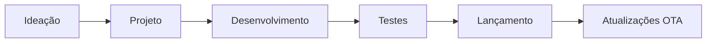
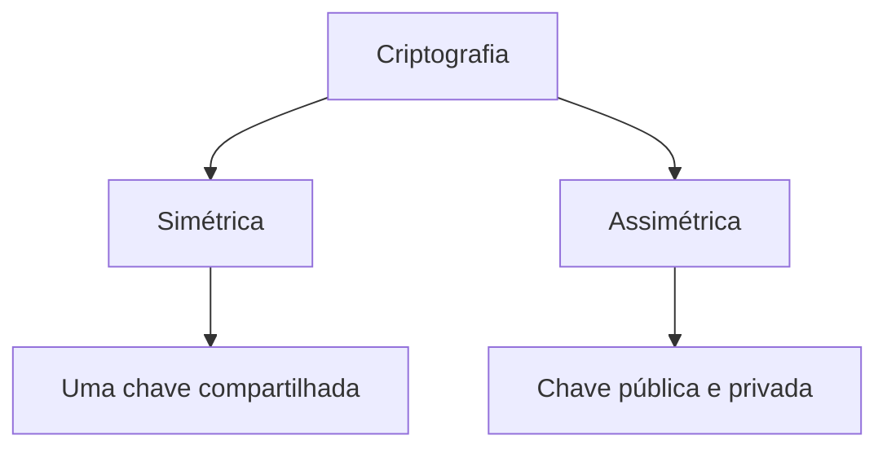
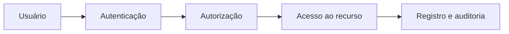
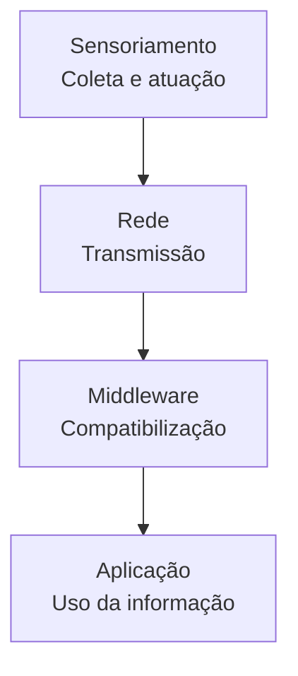
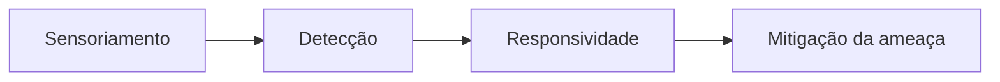

# Segurança e privacidade em Internet das Coisas

## 1. Riscos de segurança e privacidade em IoT

> [!info] Conceito
> A segurança em IoT procura proteger dispositivos, redes e dados contra acessos indevidos, alterações, interrupções e usos não autorizados.

A expansão da Internet das Coisas aumenta a quantidade de objetos conectados e o volume de dados coletados. Esses dados podem ser combinados para construir perfis detalhados dos usuários, formando um ecossistema informacional que exige proteção durante a coleta, o armazenamento, o processamento e o compartilhamento.

As falhas de segurança não afetam apenas o dispositivo invadido. Um equipamento comprometido pode permitir acesso a informações pessoais, interferir em outros dispositivos e prejudicar toda a infraestrutura da rede.

Entre as principais boas práticas de segurança estão:

- testar regularmente as vulnerabilidades de softwares e sistemas;
- manter ferramentas de segurança e _firmwares_ atualizados;
- proteger o armazenamento em servidores e _data centers_;
- definir a responsabilidade das empresas envolvidas na cadeia de produtos IoT;
- controlar o tratamento de grandes volumes de dados, especialmente nas áreas de saúde e meio ambiente;
- utilizar criptografia no transporte dos dados;
- disponibilizar interfaces web seguras;
- proteger adequadamente os softwares;
- planejar a atualização dos dispositivos durante todo o seu ciclo de vida.

> [!warning] Atenção
> Dispositivos compactos, com pouca memória, baixo poder de processamento e energia limitada, podem não suportar mecanismos complexos de proteção.

### 1.1 Riscos em aplicações específicas

Nos veículos conectados, invasores podem explorar aplicativos, GPS, comandos de voz, câmeras, smartphones e o computador central do automóvel. Um comprometimento grave pode permitir acesso a dados de motoristas e passageiros ou interferência em funções como freios e acelerador.

As _smart TVs_ podem registrar programas assistidos e captar conversas por meio de comandos de voz. Já as etiquetas RFID podem ser consultadas à distância e apresentar riscos quando não existem barreiras adequadas de leitura ou quando sua autenticação é frágil.

Outros riscos relacionados à privacidade incluem:

- **identificação:** combinação de dados dos sensores para reconhecer uma pessoa;
- **rastreamento:** determinação da localização do usuário no espaço e no tempo;
- **_profiling_:** criação de perfis ou dossiês a partir de informações correlacionadas;
- **privacidade no ciclo de vida dos dados:** exposição durante o descarte, a alteração, o empréstimo ou a transferência das informações.

Três condições favorecem falhas e invasões:

1. inexperiência técnica no desenvolvimento de _hardware_ e _software_;
2. limitação de bateria e processamento dos dispositivos;
3. ausência de planejamento para atualizações de segurança.

Também são riscos recorrentes o roubo ou a perda de dispositivos, credenciais permanentes, ausência de perímetro de segurança, equipamentos sem atualização, ataques DDoS e exploração de portas de comunicação.

### 1.2 Segurança no ciclo de desenvolvimento

O Ciclo de Vida de Desenvolvimento de Software — SDLC — compreende ideação, projeto, desenvolvimento, testes e lançamento. A segurança deve ser incorporada em todas essas etapas por meio de segmentação de redes, criptografia de ponta a ponta, atualizações OTA, avaliação das competências internas e testes de penetração realizados de forma ética.

> [!tip] Resumindo
> A proteção não deve ser acrescentada somente depois que o produto estiver pronto; ela precisa acompanhar todo o ciclo de vida do dispositivo.

## 2. Fundamentos da segurança da informação

> [!info] Conceito
> A segurança da informação combina princípios, políticas e tecnologias para proteger ativos contra ameaças e vulnerabilidades.

Os serviços de segurança em IoT incluem:

- **disponibilidade:** manutenção dos serviços em funcionamento, inclusive com servidores de reserva em arquitetura _hot stand-by_;
- **não repúdio:** associação de uma operação ao usuário que a realizou;
- **prevenção de ameaças:** uso de políticas de segurança, proteção física, redundância energética, _firewalls_, antivírus e sistemas de detecção de intrusão;
- **gestão contínua:** implementação, operação, manutenção e revisão dos controles de segurança;
- **auditoria:** verificação do cumprimento das políticas definidas.

A ISO 27001 estabelece padrões para a gestão e a melhoria contínua da segurança da informação nas organizações.

Os principais conceitos de risco são:

| Conceito | Significado |
|---|---|
| Ativo | Recurso que possui valor, como dados, programas, propriedade intelectual e segredos de negócio. |
| Vulnerabilidade | Fraqueza que pode comprometer um produto ou sistema. |
| Ameaça | Evento ou ação capaz de explorar uma vulnerabilidade e causar violação, alteração ou destruição. |
| Risco | Possibilidade de uma ameaça explorar uma vulnerabilidade e provocar danos. |

## 3. Blockchain aplicado à IoT

> [!info] Conceito
> A _blockchain_ registra informações em um livro-razão distribuído e rastreável, contribuindo para a confiabilidade e a integridade dos registros.

A aplicação de _blockchain_ em IoT demanda descentralização, identificação, confiabilidade, segurança, autonomia e escalabilidade. Entretanto, seus algoritmos podem exigir recursos computacionais que determinados dispositivos IoT não possuem.

O mecanismo **PoW — _Proof of Work_** distribui a responsabilidade pela validação entre os nós da rede durante a mineração.

Entre as aplicações mencionadas estão:

- **Wabi:** token utilizado em um sistema de rastreamento de produtos com RFID;
- **Modum:** solução aberta destinada a preservar a integridade dos dados em cadeias de suprimentos;
- **Ambrosus:** ecossistema que integra _hardware_, _software_ e aplicações para verificar origem, qualidade e autenticidade de alimentos e medicamentos.

A LGPD também deve ser considerada nos sistemas IoT, pois regulamenta o tratamento de dados e protege a privacidade dos usuários.

## 4. Confidencialidade e criptografia

> [!info] Conceito
> Confidencialidade significa impedir que pessoas ou sistemas não autorizados tenham acesso aos dados.

A criptografia transforma um **texto claro**, ainda desprotegido, em **texto cifrado**. A operação utiliza uma chave criptográfica, necessária para cifrar ou recuperar a informação.

### 4.1 Algoritmos simétricos e assimétricos

| Tipo | Funcionamento | Exemplos |
|---|---|---|
| Simétrico | Utiliza uma chave compartilhada para cifrar e decifrar os dados. Exige uma troca segura da chave entre as partes. | DES, 3DES e AES |
| Assimétrico | Utiliza duas chaves relacionadas: uma pública e outra privada. | RSA, Diffie-Hellman e curvas elípticas |

O **DES** é um algoritmo de cifra por blocos. O **3DES** executa o DES três vezes com chaves diferentes e utiliza chave simétrica de 168 bits. O **AES** passou a substituir o 3DES em muitas aplicações e pode utilizar chaves de até 256 bits.

O **RSA** emprega chaves públicas e privadas geradas com base em números primos grandes, sendo usado na troca de chaves e em assinaturas digitais. O **Diffie-Hellman** permite estabelecer uma chave simétrica por um canal inseguro. A criptografia de **curvas elípticas** utiliza o problema do logaritmo discreto em curvas para troca de chaves e assinaturas digitais.

> [!tip] Resumindo
> A criptografia simétrica é baseada em uma chave compartilhada; a assimétrica utiliza um par de chaves.

## 5. Integridade e funções hash

> [!info] Conceito
> Integridade é a garantia de que dados e mensagens não foram alterados indevidamente durante o processamento, o armazenamento ou a transmissão.

Uma função _hash_ transforma uma entrada de tamanho variável em um valor de tamanho fixo. O emissor calcula o _hash_ da mensagem e o destinatário repete o cálculo. Se os resultados forem diferentes, a mensagem foi modificada.

| Algoritmo | Característica |
|---|---|
| MD5 | Criado em 1991 por Ronald Rivest, produz um _hash_ fixo de 128 bits e foi usado em assinaturas digitais e trocas de chaves. |
| SHA | Família de funções _hash_, com variantes como SHA-224, SHA-256, SHA-384 e SHA-512. |
| HMAC | Função de autenticação de mensagens que combina uma função _hash_ com uma chave. |

> [!warning] Atenção
> A criptografia protege o conteúdo contra leitura não autorizada, enquanto o _hash_ ajuda a verificar se o conteúdo foi alterado.

## 6. Autenticação, autorização e auditoria

> [!info] Conceito
> O modelo AAA reúne Autenticação, Autorização e Auditoria para controlar identidades, permissões e registros de atividade.

A **autenticação** confirma a identidade do usuário. A **autorização** determina quais recursos e operações ele pode acessar. A **auditoria** registra e examina suas ações para verificar o cumprimento da política de segurança.

A identidade pode ser verificada mediante:

1. **senha forte:** informação conhecida pelo usuário;
2. **token ou cartão:** objeto possuído pelo usuário, como OTP ou _smartcard_;
3. **biometria:** característica pessoal, como impressão digital, íris ou face.

A auditoria analisa registros de transações, atividades manuais, processos e aplicações. Plataformas **SIEM** podem centralizar os registros e automatizar notificações quando ocorrem eventos contrários à política de segurança.

## 7. Segurança de IoT em nuvem

> [!info] Conceito
> A segurança em nuvem protege o armazenamento e o processamento dos grandes volumes de dados produzidos pelos dispositivos IoT.

Os dados podem ser hospedados em uma **nuvem pública**, mantida por terceiros, ou em uma **nuvem privada**, pertencente ao próprio cliente.

### 7.1 Modelos de serviço

| Modelo | Nível de controle | Exemplos |
|---|---|---|
| SaaS — _Software as a Service_ | O usuário altera apenas configurações específicas da aplicação. | E-mail, redes sociais e gestão de documentos. |
| PaaS — _Platform as a Service_ | Permite controlar aplicações e parte do ambiente de hospedagem. | Bancos de dados, desenvolvimento e integração. |
| IaaS — _Infrastructure as a Service_ | Oferece maior controle de aplicações e ambiente, embora alguns componentes de rede permaneçam sob responsabilidade do provedor. | _Backup_, armazenamento e gerenciamento de serviços. |

### 7.2 Atores da computação em nuvem

| Ator | Função |
|---|---|
| Consumidor | Utiliza os serviços oferecidos pelo provedor conforme o SLA. |
| Fornecedor | Provisiona os serviços e os recursos computacionais. |
| _Carrier_ | Fornece conexão e transporte entre consumidor e fornecedor. |
| _Broker_ | Intermedeia relações comerciais e organiza pacotes de serviços. |
| Auditor | Verifica a conformidade e o enquadramento dos serviços. |

### 7.3 Camadas da arquitetura IoT

A arquitetura de um sistema IoT pode ser organizada em quatro camadas:

- **sensoriamento:** reúne sensores, atuadores e dispositivos responsáveis pela coleta e atuação;
- **rede:** transmite os dados coletados;
- **_middleware_:** compatibiliza os formatos e intermedeia rede e aplicação;
- **aplicação:** transforma os dados em informações úteis aos sistemas.

## 8. Cloud Security Alliance e mecanismos de controle

> [!info] Conceito
> A Cloud Security Alliance — CSA — publica orientações para avaliar riscos e proteger sistemas IoT hospedados em nuvem.

O _framework_ da CSA avalia confidencialidade, integridade e disponibilidade. Os controles de segurança podem ser classificados de acordo com sua finalidade, implementação e frequência.

Quanto à finalidade, podem ser:

- **preventivos:** procuram impedir que o ataque ocorra;
- **detectivos:** identificam e caracterizam incidentes;
- **corretivos:** reduzem os impactos após a detecção.

Quanto à implementação, podem ser:

- **manuais:** executados por pessoas, geralmente com validação humana;
- **automáticos:** executados sem supervisão humana;
- **semiautomáticos:** combinam ações humanas e automáticas.

A frequência depende dos riscos e das exigências de conformidade, podendo ser anual, mensal, semanal, diária, eventual ou contínua.

> [!tip] Resumindo
> Um sistema completo combina prevenção, detecção e correção, com controles ajustados ao nível de risco.

## 9. Desafios da segurança IoT em nuvem

> [!info] Conceito
> A diversidade e as limitações dos dispositivos dificultam a adoção uniforme de controles de segurança.

| Desafio | Consequência |
|---|---|
| Dispositivos limitados | Sensores e atuadores podem não possuir memória ou processamento para operações complexas. |
| Energia limitada | Equipamentos alimentados por bateria possuem restrições de consumo. |
| Escalabilidade | O crescimento do número de dispositivos aumenta também o tráfego de dados. |
| Mobilidade | _Wearables_ e outros dispositivos podem mudar constantemente de localização. |
| Heterogeneidade | A arquitetura precisa integrar protocolos e tecnologias como Bluetooth, Wi-Fi e RFID. |
| Gestão de dispositivos | Inclusões e remoções de equipamentos devem ocorrer de maneira segura. |

## 10. Ataques e ameaças em IoT e nuvem

> [!warning] Atenção
> Um ataque pode atingir o dispositivo, a comunicação, a aplicação, a nuvem ou os dados processados.

Os ataques mais comuns são:

- **roubo de credenciais:** obtenção de nomes de usuário e senhas por _phishing_, força bruta ou exploração de senhas fracas e padrões de fábrica;
- **DoS:** indisponibilização de um sistema por consumo dos seus recursos;
- **DDoS:** ataque distribuído realizado em grande escala, geralmente por uma _botnet_, como Mirai, Hajime ou Reaper;
- **_man-in-the-middle_:** interceptação da comunicação entre duas entidades legítimas;
- **injeção SQL:** inserção de código SQL malicioso para consultar ou modificar bancos de dados;
- **personificação em nuvem:** tentativa de se passar por uma entidade legítima;
- **_Evil Twin_:** criação de uma rede Wi-Fi falsa semelhante à legítima para obter SSID e senha.

Em uma comunicação MQTT do tipo _Publish/Subscribe_, um _broker_ controlado pelo atacante pode atrasar, alterar ou apagar mensagens sem que os dispositivos percebam.

Os vetores de ataque podem estar na segurança física, nas interfaces de depuração, nos _bootloaders_, no _firmware_, nos sensores, atuadores e _gateways_, bem como nas redes, serviços web, aplicativos, APIs, dispositivos móveis e sistemas integrados.

As consequências podem envolver violação de privacidade, perda de propriedade intelectual, danos à reputação, alterações indevidas no funcionamento dos produtos, indisponibilidade dos serviços, quebra de contratos e despesas judiciais ou financeiras.

## 11. Segurança em casas conectadas

> [!info] Conceito
> Uma casa conectada integra sensores, atuadores, redes, aplicações e serviços para controlar e monitorar o ambiente residencial.

As principais áreas de aplicação são:

- economia de energia, como automação da iluminação;
- gestão de energia renovável e armazenamento de energia;
- cuidado de residentes, incluindo monitoramento médico domiciliar;
- sistemas multimídia controlados por voz;
- vigilância, alarmes e segurança patrimonial.

Uma arquitetura residencial segura deve considerar vulnerabilidades, impactos físicos e psicológicos, disponibilidade dos serviços, tolerância a falhas, identidade e controle de acesso.

Sua proteção pode ser organizada em três blocos:

O **sensoriamento** observa o ambiente. A **detecção** identifica anomalias conhecidas ou diferenças entre o comportamento esperado e o observado. A **responsividade** reúne as ações adotadas depois que a ameaça é reconhecida.

No ambiente residencial permanecem desafios como limitação dos dispositivos, escalabilidade, heterogeneidade tecnológica e gestão segura da inclusão ou remoção de equipamentos.

### 11.1 Smart speakers e middleware

O _smart speaker_ recebe comandos de voz e pode utilizar um _middleware_, como um _hub_, para se comunicar com os dispositivos. Esse intermediário pode:

- encaminhar comandos para um atuador;
- consultar um dispositivo;
- receber informações e gerar notificações para o usuário.

Como é um equipamento compartilhado, o _smart speaker_ pode captar conversas privadas dos moradores e visitantes, apresentando riscos diferentes daqueles encontrados em dispositivos pessoais.

### 11.2 Vulnerabilidades da casa conectada

Três pontos exigem atenção:

- **_onboarding_:** processo inicial de inclusão e configuração, no qual um atacante pode assumir o controle do dispositivo;
- **_middleware_:** intermediário que pode se tornar um ponto único de falha;
- **atualização de _firmware_:** processo que pode ser explorado para inserir códigos maliciosos durante a distribuição da atualização.

As falhas podem provocar danos físicos, emocionais e prejuízos à experiência do usuário. Entre os ataques mencionados estão:

- **Bluetooth Cayla Doll:** ataque de repetição que reutiliza comandos antigos e produz ações indevidas;
- **_Evil Twin_:** rede Wi-Fi falsa que se apresenta como legítima para capturar credenciais.

O serviço de **_data liveness_**, combinado com **_timestamps_**, ajuda a confirmar que os dados são atuais e a evitar ataques de repetição.

## 12. Síntese final

> [!summary] Síntese
> A segurança em IoT depende da proteção conjunta dos dispositivos, comunicações, aplicações, serviços em nuvem e dados durante todo o ciclo de vida.

A proteção dos sistemas IoT exige práticas contínuas de prevenção, detecção, correção e auditoria. Confidencialidade, integridade, disponibilidade, autenticação e autorização são apoiadas por criptografia, funções _hash_, gestão de identidades, registros de auditoria e políticas de segurança.

Na nuvem, os modelos de serviço, os atores envolvidos e as camadas da arquitetura distribuem responsabilidades que precisam ser claramente definidas. Nas casas conectadas, a limitação dos dispositivos, a diversidade de protocolos e a presença de componentes intermediários ampliam a superfície de ataque. Portanto, segurança e privacidade devem ser planejadas desde a concepção, mantidas por atualizações e avaliadas continuamente.

# Questionário — Dúvidas frequentes

## 1

> [!question] Cite três motivos suscetíveis a falhas de segurança e invasões de hackers.
>
>> [!question]- Resposta
>>
>> 1. Inexperiência técnica na elaboração de objetos IoT e no desenvolvimento de _software_ e _hardware_.
>> 2. Construção de objetos IoT compactos, com bateria insuficiente para processar sistemas complexos de segurança de dados.
>> 3. Falta de planejamento para a atualização dos sistemas de segurança dos objetos IoT.

## 2

> [!question] O que é a Cia Triad?
>
>> [!question]- Resposta
>>
>> A Cia Triad refere-se aos três princípios fundamentais de segurança da informação: confidencialidade, integridade e autorização.

## 3

> [!question] Quais são os principais tipos de ataques de IoT em _cloud_?
>
>> [!question]- Resposta
>>
>> 1. **Roubo de credenciais:** obtenção de login e senha por _phishing_, força bruta ou exploração de senhas padrão, fracas ou não modificáveis.
>> 2. **DoS e DDoS:** indisponibilização de um sistema pelo consumo de seus recursos. No DDoS, o ataque é distribuído e possui escala maior, podendo envolver _botnets_ como Mirai, Hajime e Reaper.
>> 3. **_Man-in-the-middle_:** interceptação da comunicação entre entidades legítimas. Em MQTT, um _broker_ controlado pode atrasar, alterar ou excluir mensagens sem que os dispositivos percebam.
>> 4. **Injeção SQL:** utilização de código SQL malicioso para obter dados privados ou modificar registros.
>> 5. **Personificação em nuvem:** tentativa do atacante de se passar por uma entidade legítima.

## 4

> [!question] Quais são os três pontos dos sistemas IoT relacionados à vulnerabilidade de uma casa conectada?
>
>> [!question]- Resposta
>>
>> 1. **_Onboarding_:** o atacante pode assumir o controle do dispositivo durante sua inclusão ou configuração.
>> 2. **_Middleware_:** o intermediário pode constituir um ponto único de falha, cujo comprometimento afeta todo o sistema.
>> 3. **Atualização de _firmware_:** o atacante pode inserir códigos maliciosos durante a distribuição da atualização entre o fornecedor e o _hub_.