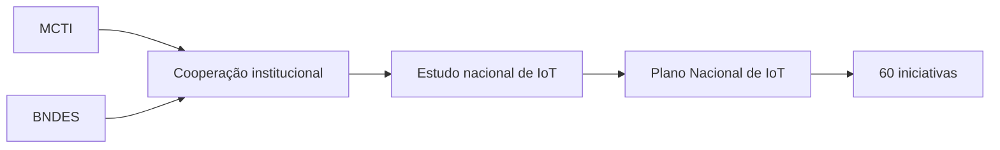
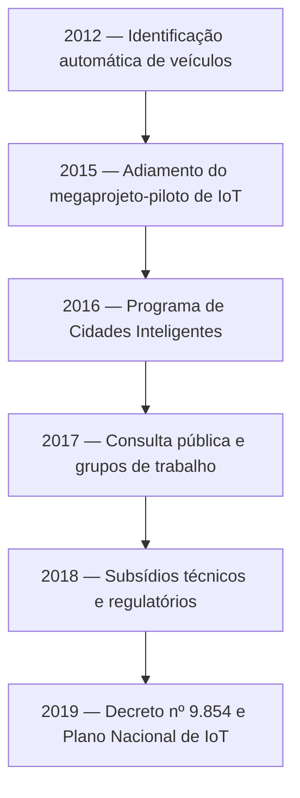
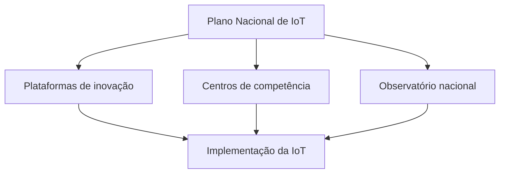

# IoT no setor público brasileiro

## Objetivos da leitura

> [!info] Propósito
> Compreender como os órgãos públicos brasileiros vêm estruturando políticas, projetos, investimentos e normas para implantar a Internet das Coisas.

A leitura apresenta a atuação do Ministério da Ciência, Tecnologia e Inovações (MCTI) e do Banco Nacional de Desenvolvimento Econômico e Social (BNDES), a evolução das políticas públicas brasileiras de IoT, os principais aspectos do Plano Nacional de Internet das Coisas e conceitos técnicos essenciais de IoT e Web das Coisas (WoT).

**Palavras-chave:** Plano Nacional de Internet das Coisas, IoT, WoT, MCTI, BNDES e *advocacy*.

---

## MCTI e BNDES

### Ministério da Ciência, Tecnologia e Inovações

> [!info] MCTI
> Órgão federal responsável por promover ciência, tecnologia, inovação e comunicações em favor do desenvolvimento sustentável e da qualidade de vida.

O MCTI integra a administração pública federal e atua por meio de unidades de pesquisa, entidades vinculadas e organizações sociais. Sua missão envolve produzir conhecimento e riquezas para o Brasil, além de contribuir para a qualidade de vida da população. Sua visão é tornar-se protagonista do desenvolvimento sustentável por meio da ciência, da tecnologia e da inovação.

Entre os valores do órgão estão ética, transparência, conhecimento, integração, efetividade, compaixão, valorização das pessoas, responsabilidade socioambiental e inovação.

### Banco Nacional de Desenvolvimento Econômico e Social

> [!info] BNDES
> Instituição pública federal que financia investimentos de longo prazo em diferentes segmentos da economia brasileira.

Criado em 1952, o BNDES está associado ao Ministério do Desenvolvimento, Indústria, Comércio e Serviços. Sua estrutura compreende:

- o BNDES e suas subsidiárias;
- a BNDES Participações S.A. (BNDESPAR), voltada ao mercado de capitais;
- a Agência Especial de Financiamento Industrial (FINAME), dedicada ao financiamento da produção e da comercialização de máquinas e equipamentos.

As sete missões estratégicas de longo prazo do banco são:

1. infraestrutura;
2. desenvolvimento social;
3. sustentabilidade ambiental;
4. apoio às micro, pequenas e médias empresas;
5. fortalecimento da estrutura produtiva;
6. modernização do Estado;
7. atuação emergencial.

Essas missões empregam vertentes como estruturação de projetos, modelagem, apoio financeiro, inovação, exportação e *advocacy*. No material, *advocacy* corresponde a estratégias de influência e articulação entre setores ou pessoas relevantes da sociedade.

### Cooperação entre MCTI e BNDES

MCTI e BNDES firmaram um acordo de cooperação para conduzir o estudo de Internet das Coisas contratado por meio do Fundo de Estruturação de Projetos nº 01/2016. Esse trabalho resultou no Plano Nacional de IoT, composto por 60 iniciativas propostas pela equipe responsável pelo estudo.

> [!tip] Resumindo
> O MCTI fornece a direção científica e tecnológica, enquanto o BNDES contribui para a estruturação e o financiamento de iniciativas de desenvolvimento.

---

## Evolução da IoT nas políticas públicas brasileiras

> [!info] Perspectiva federal
> A implantação da IoT no Brasil ocorreu progressivamente, passando por projetos-piloto, consultas públicas, estudos técnicos e regulamentação nacional.

Entre as iniciativas previstas estava o Sistema Nacional de Identificação Automática de Veículos (Siniav), projeto baseado em identificação por radiofrequência (RFID) para monitoramento, fiscalização e repressão de irregularidades envolvendo veículos de carga. Também foram formuladas medidas para criar modelos de IoT aplicáveis aos setores automobilístico, agropecuário e urbanístico.

### Linha do tempo

Em 2016, o Decreto nº 8.776 estabeleceu uma nova fase do Programa Nacional de Banda Larga, relacionada ao Programa de Cidades Inteligentes e à Plataforma de Estrutura Aberta de Tecnologias para Internet das Coisas e suas Aplicações. Em 2018, o CPQD e a consultoria McKinsey contribuíram para a obtenção de subsídios destinados à elaboração do plano. Em 2019, o Decreto nº 9.854 instituiu formalmente o Plano Nacional de Internet das Coisas.

---

## Programa Brasil Inteligente

> [!info] Conectividade e serviços públicos
> O Programa Brasil Inteligente procura ampliar o acesso à banda larga e utilizar tecnologias conectadas para melhorar a prestação de serviços públicos.

Segundo o material, o programa tinha como objetivo levar conexão de banda larga a 95% da população, contribuindo para a universalização do acesso à internet.

Seus principais projetos são:

| Projeto | Responsáveis | Objetivo |
|---|---|---|
| Minha Escola Mais Inteligente | Eletrobras e MCTIC | Instalar redes de fibra óptica em 30 mil escolas e elevar a velocidade de acesso de 2 Mbps para 78 Mbps |
| Cidades Inteligentes com Plataforma de Estrutura Aberta de Tecnologias para IoT e suas Aplicações | Gestões municipais | Avaliar 172 projetos municipais interessados em redes de fibra óptica e soluções tecnológicas |
| Fundo Garantidor para Provedores Regionais | MCTIC e BNDES, com administração da ABGF | Implementar IoT para aprimorar os serviços públicos oferecidos |

### Aplicações em segurança pública

A IoT já foi empregada em diferentes cidades brasileiras:

- em Recife, um dispositivo capaz de captar sons auxilia na identificação de arrombamentos, disparos de armas e quedas de pacientes em hospitais;
- em Vitória, o “botão do pânico” foi desenvolvido para proteger vítimas de violência doméstica;
- em São Bernardo do Campo, o Centro Integrado de Monitoramento utiliza 400 câmeras instaladas em pontos estratégicos, transmitindo imagens continuamente.

> [!warning] Segurança dos dados
> A expansão da IoT exige governança adequada, protocolos de segurança, alteração de senhas padronizadas e controle das vulnerabilidades introduzidas por novas tecnologias.

---

## Marco legal brasileiro da IoT

> [!info] Decreto nº 9.854/2019
> O decreto instituiu o Plano Nacional de Internet das Coisas e regulamentou a Câmara responsável por acompanhar os sistemas máquina a máquina e as aplicações de IoT.

### Conceitos legais fundamentais

O artigo 2º apresenta quatro definições:

- **Internet das Coisas (IoT):** infraestrutura que integra serviços de valor adicionado e possibilita a conexão física ou virtual de objetos, utilizando tecnologias de informação e comunicação com interoperabilidade;
- **coisas:** objetos físicos ou digitais que podem ser identificados e integrados às redes de comunicação;
- **dispositivos:** equipamentos ou partes de equipamentos com comunicação obrigatória e capacidades opcionais de sensoriamento, atuação, coleta, armazenamento e processamento de dados;
- **serviço de valor adicionado:** atividade que acrescenta novas utilidades a um serviço de telecomunicações, como acesso, armazenamento, apresentação, movimentação ou recuperação de informações.

### Objetivos do Plano Nacional de IoT

O artigo 3º estabelece cinco objetivos:

1. melhorar a qualidade de vida e aumentar a eficiência dos serviços;
2. capacitar profissionais e gerar empregos na economia digital;
3. elevar a produtividade e a competitividade das empresas brasileiras de IoT;
4. promover parcerias entre os setores público e privado;
5. ampliar a integração internacional do Brasil em padronização, pesquisa, inovação e internacionalização de soluções.

### Áreas prioritárias e critérios

O artigo 4º prevê a definição de áreas prioritárias, como saúde, cidades, indústria e meio rural. A priorização deve considerar oferta, demanda e capacidade de desenvolvimento local.

Os projetos selecionados podem receber:

- mecanismos de incentivo à pesquisa, ao desenvolvimento tecnológico e à inovação;
- apoio ao empreendedorismo de base tecnológica.

Órgãos e entidades públicas também podem aderir ao plano mediante acordo de cooperação técnica com o MCTI.

### Temas necessários à implementação

Conforme o artigo 5º, o plano deve desenvolver soluções relacionadas a:

- ciência, tecnologia e inovação;
- inserção internacional;
- educação e capacitação profissional;
- infraestrutura de conectividade e interoperabilidade;
- regulação, segurança e privacidade;
- viabilidade econômica.

Essas ações devem estar alinhadas à Estratégia Brasileira para a Transformação Digital.

### Projetos mobilizadores

O artigo 6º estabelece três projetos coordenados pelo MCTI:

1. Plataformas de Inovação em Internet das Coisas;
2. Centros de Competência para Tecnologias Habilitadoras em IoT;
3. Observatório Nacional para o Acompanhamento da Transformação Digital.

---

## Câmara IoT

> [!info] Governança
> A Câmara IoT é o órgão de assessoramento encarregado de acompanhar a implantação do Plano Nacional de Internet das Coisas.

Entre suas competências estão:

- monitorar e avaliar as iniciativas do plano;
- fomentar parcerias entre entidades públicas e privadas;
- discutir os temas do plano de ação com órgãos públicos;
- apoiar e propor projetos mobilizadores;
- estimular conjuntamente o uso e o desenvolvimento de soluções de IoT.

A Câmara é um colegiado não deliberativo, presidido pelo MCTI e formado por representantes das áreas de economia, agricultura, saúde e desenvolvimento regional. Reúne-se ordinariamente a cada semestre e extraordinariamente quando convocada por seu presidente.

Cada membro possui um suplente. Representantes de entidades públicas, privadas e associações podem ser convidados. A participação é considerada serviço público relevante e não remunerado, e não é permitida a criação de subcolegiados.

---

## Comunicação máquina a máquina

> [!info] Sistemas M2M
> A comunicação máquina a máquina permite transmitir dados a aplicações remotas para monitorar, medir ou controlar dispositivos e ambientes.

O artigo 8º define os sistemas máquina a máquina como redes de telecomunicações, incluindo seus dispositivos de acesso, utilizadas para enviar dados a aplicações remotas. Máquinas de cartão de débito ou crédito não são incluídas nessa definição.

Cabe à Agência Nacional de Telecomunicações regulamentar e fiscalizar esses sistemas, observando as normas do MCTI.

Os artigos finais do decreto estabelecem que:

- o MCTI pode editar regras complementares para implementar o plano;
- o Decreto nº 8.234/2014 foi revogado;
- o Decreto nº 9.854 entrou em vigor na data de sua publicação.

---

## Incentivos legais à IoT

> [!info] Lei nº 14.108/2020
> A legislação reduziu encargos e dispensou determinadas estações máquina a máquina de licenciamento prévio, incentivando a implantação da IoT.

A Lei nº 14.108/2020 estabeleceu benefícios tributários para estações de telecomunicações integrantes de sistemas máquina a máquina. Segundo o material, os incentivos vigoraram até 31 de dezembro de 2025 e incluíram valor igual a zero para:

- Taxa de Fiscalização de Instalação;
- Taxa de Fiscalização de Funcionamento;
- Contribuição para o Fomento da Radiodifusão Pública;
- Contribuição para o Desenvolvimento da Indústria Cinematográfica Nacional (Condecine).

A lei também dispensou essas estações da obrigação de licenciamento prévio de funcionamento, conforme regulamentação aplicável.

> [!tip] Resumindo
> O Decreto nº 9.854/2019 organizou a política nacional de IoT, enquanto a Lei nº 14.108/2020 ofereceu incentivos para reduzir os custos de implantação dos sistemas máquina a máquina.

---

## Fundamentos técnicos de IoT e WoT

> [!info] IoT e WoT
> A IoT conecta objetos e dispositivos; a WoT utiliza tecnologias e padrões da Web para organizar o acesso, a comunicação e a interação com esses objetos.

O desenvolvimento de soluções de IoT e WoT requer conhecimentos sobre conectividade, protocolos, comunicação orientada a eventos, plataformas, interfaces, desempenho e segurança.

### Protocolos de comunicação para objetos

Os *mashups* são aplicações da Web 2.0 criadas pela composição de recursos disponíveis na Web. Os *physical mashups* ampliam essa integração para objetos e componentes físicos conectados.

Também são relevantes conceitos como endereçamento IP para objetos inteligentes, identificadores uniformes de recursos (URI) e integração entre os objetos e a Web tradicional.

### HTTP como suporte à WoT

A arquitetura orientada a recursos (ROA) emprega os princípios REST e as tecnologias da Web para organizar os recursos conectados. Em uma arquitetura RESTful, os recursos são identificados e acessados por URIs.

O HATEOAS vincula recursos por meio de links fornecidos durante a interação. Entre os métodos HTTP destacados estão:

- **HEAD:** obtém metadados sobre um recurso;
- **OPTIONS:** informa quais métodos HTTP são aceitos pelo recurso.

### Recomendações e boas práticas

As principais referências indicadas são:

1. IEEE-SA IoT Ecosystem Study;
2. ITU-T Y.2060;
3. IETF CoAP;
4. Open Mobile Alliance (OMA);
5. World Wide Web Consortium (W3C).

O **CoAP** é um protocolo de aplicação criado para ambientes com recursos limitados, incluindo redes congestionadas. Ele segue o modelo de requisição e resposta: o cliente solicita um recurso identificado por uma URI e o servidor responde. Associado ao UDP, pode ser usado em:

- **broadcast:** transmissão de uma mensagem para todos os receptores;
- **multicast:** envio simultâneo de um pacote para vários destinos selecionados.

### Comunicação orientada a eventos

O modelo **Comet** permite comunicação assíncrona na Web e o envio de dados do servidor ao cliente, embora aumente o consumo de recursos do servidor.

O **EPCIS** captura e comunica eventos de negócios, apoiando o rastreamento de produtos por meio de interfaces padronizadas para representação e troca de dados.

Um **sistema ciberfísico (CPS)** integra computação, comunicação, controle, redes e processos físicos para representar e controlar elementos do mundo real em ambientes digitais.

### Plataformas, interfaces e prototipação

Entre as plataformas e ferramentas mencionadas estão Eclipse IoT, *frameworks* para *gateways*, M2M Labs, Arduino, ZigBee e Sun SPOT. A Sun SPOT é uma plataforma de dispositivos embarcados programáveis.

A **interface de usuário (UI)** corresponde aos elementos pelos quais uma pessoa interage com uma aplicação, página Web ou programa. Na WoT, também são importantes as ontologias, que organizam conceitos e relações entre dados, e as linguagens usadas para descrever interfaces.

O **WeIO** reúne hardware e software em uma plataforma aberta destinada à prototipação de aplicações com recursos multimídia, motores, sensores e atuadores.

### Desempenho e segurança

O desempenho das aplicações deve ser avaliado por meio de testes relacionados a escalabilidade, concorrência, uso de *cache* e tolerância a falhas.

A segurança abrange:

- sigilo e privacidade;
- criptografia;
- protocolos seguros de comunicação;
- autenticação;
- autorização;
- controle de acesso.

> [!warning] Atenção
> A conectividade amplia as possibilidades de automação, mas também aumenta a superfície de exposição a falhas, acessos indevidos e vazamento de dados.

---

## Síntese final

> [!summary] Síntese
> A política brasileira de IoT combina atuação institucional, financiamento, infraestrutura, regulamentação, governança, capacitação, segurança e cooperação entre os setores público e privado.

O MCTI e o BNDES tiveram papel central na formulação do Plano Nacional de IoT. O Decreto nº 9.854/2019 estabeleceu seus conceitos, objetivos, áreas prioritárias, projetos mobilizadores e mecanismos de acompanhamento, enquanto a Câmara IoT assumiu funções de monitoramento, articulação e estímulo às soluções conectadas.

Os projetos nacionais mostram como a IoT pode ampliar a conectividade de escolas e cidades e melhorar serviços públicos, inclusive na segurança. Entretanto, sua implantação depende de interoperabilidade, protocolos adequados, capacitação profissional, viabilidade econômica, proteção de dados e segurança dos dispositivos.

No campo técnico, a WoT aproxima os objetos conectados das tecnologias tradicionais da Web por meio de HTTP, REST, URIs e padrões de comunicação. Plataformas de prototipação, comunicação orientada a eventos, interfaces, desempenho e controle de acesso completam os conhecimentos necessários ao desenvolvimento de aplicações responsáveis.

---

# Questionário — dúvidas frequentes

## 1. Quais são os principais projetos nacionais de IoT?

> [!question] Cite e explique os principais projetos nacionais IoT.
>
>> [!question]- Resposta
>>
>> Os principais projetos nacionais são:
>>
>> - **Minha Escola Mais Inteligente:** gerenciado pela Eletrobras em parceria com o MCTI, objetiva instalar redes de fibra óptica em 30 mil escolas, selecionadas conforme o índice de avaliação e o menor custo de implantação. Pretende elevar a velocidade de acesso de 2 Mbps para 78 Mbps.
>> - **Cidades Inteligentes com a Plataforma de Estrutura Aberta de Tecnologias para Internet das Coisas e suas Aplicações:** gerenciado pelas administrações municipais, busca avaliar 172 projetos de municípios interessados na implantação de redes de fibra óptica e soluções tecnológicas.
>> - **Fundo Garantidor para Provedores Regionais:** gerenciado pelo MCTI e pelo BNDES e administrado pela Associação Brasileira Gestora de Fundos Garantidores e Garantias (ABGF), pretende implementar IoT para melhorar os serviços públicos oferecidos.

## 2. Quais são as competências da Câmara IoT?

> [!question] Quais as competências em relação à implementação da IoT e ao Plano Nacional IoT com a Câmara IoT?
>
>> [!question]- Resposta
>>
>> Compete à Câmara IoT:
>>
>> 1. monitorar e avaliar as iniciativas de implementação do Plano Nacional de Internet das Coisas;
>> 2. promover e fomentar parcerias entre entidades públicas e privadas;
>> 3. discutir com os órgãos e entidades públicas os temas do plano de ação;
>> 4. apoiar e propor projetos mobilizadores;
>> 5. atuar com órgãos e entidades públicas para estimular o uso e o desenvolvimento de soluções de IoT.

## 3. Quais empresas compõem o BNDES?

> [!question] O BNDES é composto por quais empresas?
>
>> [!question]- Resposta
>>
>> O BNDES é composto por três empresas: o próprio BNDES e suas subsidiárias; a BNDES Participações S.A. (BNDESPAR), que atua no mercado de capitais; e a Agência Especial de Financiamento Industrial (FINAME), voltada ao fomento da produção e da comercialização de máquinas e equipamentos.

## 4. Quais são as recomendações de boas práticas de IoT e WoT?

> [!question] De acordo com Flatschart (2017), cite cinco recomendações de boas práticas de IoT e WoT.
>
>> [!question]- Resposta
>>
>> As cinco recomendações são:
>>
>> 1. IEEE-SA IoT Ecosystem Study;
>> 2. ITU-T Y.2060;
>> 3. IETF CoAP;
>> 4. Open Mobile Alliance (OMA);
>> 5. World Wide Web Consortium (W3C).