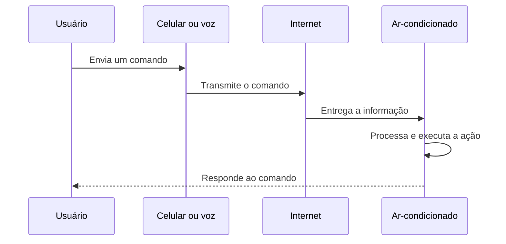
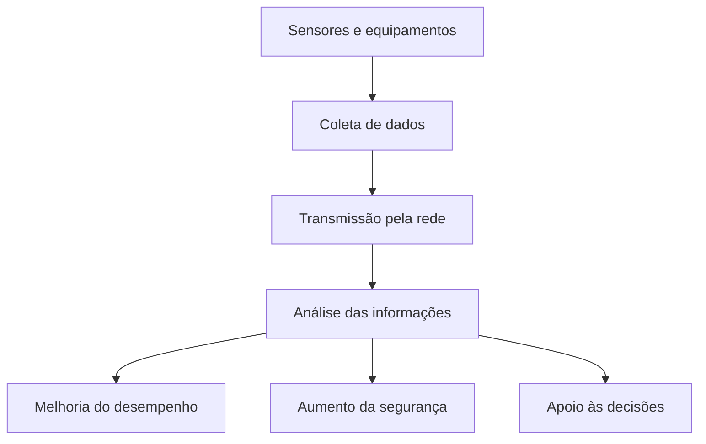
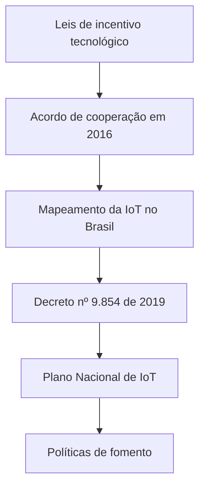

# Internet das Coisas: conceitos, estrutura, aplicações e cenário brasileiro

## 1. Conceito de Internet das Coisas

> [!info] Conceito
> Internet das Coisas é a interconexão digital de objetos físicos do cotidiano por meio da internet.

A **Internet das Coisas**, do inglês *Internet of Things* (**IoT**), consiste na conexão de objetos físicos à internet para que eles possam coletar, transmitir e receber dados. Esses objetos geralmente utilizam sensores, componentes eletrônicos e recursos de comunicação para interagir com usuários, outros dispositivos ou sistemas computacionais.

A IoT pode ser aplicada a diferentes níveis de organização:

- **objetos independentes**, como um aparelho de ar-condicionado conectado;
- **sistemas**, como o controle de tráfego de uma cidade;
- **ambientes**, como uma casa inteligente com automação de iluminação, segurança e equipamentos eletroeletrônicos.

A conexão permite controlar os objetos a distância, verificar seu funcionamento e modificar seu estado ou suas configurações. Um usuário pode, por exemplo, ligar um equipamento pelo celular, ajustar sua temperatura ou enviar um comando de voz.

> [!tip] Resumindo
> Na IoT, objetos físicos tornam-se capazes de coletar dados, comunicar-se pela internet e responder a comandos.

## 2. Estrutura básica de uma solução de IoT

> [!info] Conceito
> Uma solução de IoT depende de comunicação entre um dispositivo transmissor, um meio de propagação e um dispositivo receptor.

A estrutura básica apresentada na aula possui três elementos:

1. **Meio de propagação:** canal utilizado para transmitir os dados e comandos, geralmente a internet.
2. **Dispositivo transmissor:** equipamento pelo qual o usuário envia o comando, como um telefone celular.
3. **Dispositivo receptor:** equipamento que recebe e processa o sinal, normalmente baseado em um microcontrolador.

O **microcontrolador** é um componente eletrônico programável capaz de processar informações e controlar as funções de um dispositivo. Em uma aplicação de IoT, ele interpreta os comandos recebidos e executa as ações correspondentes.

Esse fluxo também pode ocorrer no sentido contrário. O objeto pode coletar dados por meio de sensores e transmiti-los ao usuário ou a outro sistema pela internet.

> [!warning] Atenção
> IoT não significa apenas controlar um aparelho remotamente. A tecnologia também envolve coleta, transmissão e utilização de dados.

## 3. Exemplo de funcionamento: ar-condicionado conectado

> [!info] Conceito
> Um aparelho conectado pode receber comandos remotos e ter seus parâmetros alterados por diferentes interfaces.

O aparelho de ar-condicionado apresentado na aula constitui um exemplo de dispositivo IoT. Ele se conecta à internet por meio de uma rede Wi-Fi e pode ser integrado a uma solução de automação residencial.

Por meio do telefone celular, o usuário consegue:

- ligar e desligar o aparelho;
- alterar a temperatura;
- modificar outros parâmetros de funcionamento;
- controlar o equipamento por comandos de voz.

O aparelho recebe o comando enviado pela rede, processa a informação e executa a ação solicitada. Esse exemplo demonstra como a IoT permite a interação remota e a alteração do estado de objetos físicos.

## 4. Categorias de aplicação da IoT

> [!info] Conceito
> As aplicações da IoT podem ser classificadas de acordo com o contexto em que os dispositivos e os dados são utilizados.

A aula apresenta uma tendência de crescimento da IoT em quatro grandes áreas: consumo, uso comercial, indústria e infraestrutura.

| Categoria | Finalidade | Exemplos apresentados |
|---|---|---|
| IoT de consumo | Facilitar atividades do cotidiano do consumidor | Casas inteligentes, dispositivos vestíveis e veículos inteligentes |
| IoT comercial | Apoiar serviços e atividades empresariais | Logística, saúde e seguros |
| IoT industrial | Monitorar, analisar e melhorar operações produtivas | Petróleo e gás, mineração e agronegócio |
| IoT de infraestrutura | Administrar serviços e recursos urbanos | Tráfego, energia e prevenção de desastres naturais |

## 5. IoT de consumo

> [!info] Conceito
> A IoT de consumo reúne produtos conectados utilizados diretamente pelas pessoas em seu cotidiano.

As **casas inteligentes**, ou *smart homes*, utilizam dispositivos conectados para automatizar tarefas e administrar funções como segurança, consumo de energia, iluminação e equipamentos eletroeletrônicos.

Os **dispositivos vestíveis**, também chamados de *wearables*, são equipamentos eletrônicos usados no corpo, como os relógios inteligentes (*smartwatches*).

Os **veículos inteligentes** podem utilizar conexão com a internet, monitoramento em tempo real e sistemas de assistência ao motorista. Essa assistência pode ser acionada a partir de determinados eventos, como a ocorrência de um acidente.

> [!tip] Resumindo
> Na IoT de consumo, objetos presentes no cotidiano tornam-se conectados, monitoráveis e controláveis.

## 6. IoT de uso comercial

> [!info] Conceito
> A IoT comercial utiliza dispositivos e dados conectados para melhorar a prestação de serviços e a gestão empresarial.

Na **logística**, a IoT pode ser utilizada por meio da telemática para administrar frotas de transporte. A **telemática** reúne tecnologias de telecomunicação e informática para transmitir e processar informações sobre veículos e operações.

Na **saúde**, dispositivos vestíveis podem apoiar a assistência médica preventiva. Os dados coletados pelos equipamentos ajudam a acompanhar determinadas condições e a orientar ações de cuidado.

No setor de **seguros**, os dados podem auxiliar na avaliação de riscos, relacionando o comportamento humano ao funcionamento e aos registros das máquinas.

## 7. IoT industrial

> [!info] Conceito
> Na indústria, sensores e equipamentos conectados produzem dados que ajudam a melhorar o desempenho, a segurança e a tomada de decisões.

No setor de **petróleo e gás**, sensores coletam dados que podem ser analisados para melhorar a extração e o processamento dos produtos.

Na **mineração**, a IoT pode contribuir para a análise do rendimento e para a segurança das operações, inclusive mediante o emprego de equipamentos autônomos.

No **agronegócio**, os dados coletados podem ser utilizados para avaliar o rendimento das safras. A aula relaciona essa aplicação ao **aprendizado de máquina**, técnica que permite aos sistemas identificar padrões nos dados e apoiar análises ou decisões.

## 8. IoT de infraestrutura

> [!info] Conceito
> A IoT de infraestrutura aplica dispositivos conectados à gestão de cidades e de serviços coletivos.

Nas **cidades inteligentes**, dispositivos, sensores e sistemas conectados podem apoiar:

- o controle de tráfego;
- as estratégias de economia de energia;
- a prevenção de desastres naturais.

O objetivo é utilizar dados provenientes da infraestrutura para monitorar situações, planejar intervenções e responder a eventos de maneira mais eficiente.

> [!tip] Resumindo
> A infraestrutura inteligente utiliza dados e conectividade para melhorar a administração dos recursos e serviços urbanos.

## 9. Desenvolvimento da IoT no Brasil

> [!info] Conceito
> O desenvolvimento da IoT no Brasil está relacionado a instrumentos legais, políticas públicas e investimentos em pesquisa, inovação e transformação digital.

A aula menciona como importantes instrumentos legais relacionados aos investimentos empresariais em pesquisa, desenvolvimento e inovação no setor tecnológico:

- **Lei nº 8.248/1991**;
- **Lei nº 13.969/2019**;
- **Decreto nº 10.356/2020**.

Em 2016, foi realizado um acordo de cooperação entre o ministério responsável pela ciência e tecnologia e o **Banco Nacional de Desenvolvimento Econômico e Social (BNDES)**. Esse trabalho envolveu o mapeamento das possibilidades de desenvolvimento da IoT no Brasil.

Posteriormente, o **Decreto nº 9.854/2019** instituiu o Plano Nacional de Internet das Coisas. Sua finalidade é implementar e desenvolver a IoT no país com base:

- na livre concorrência;
- na livre circulação de dados;
- na segurança da informação;
- na proteção dos dados pessoais.

> [!warning] Atenção
> A livre circulação de dados deve ocorrer juntamente com medidas de segurança da informação e proteção de dados pessoais.

## 10. Políticas de fomento à demanda

> [!info] Conceito
> O fomento da demanda procura estimular empresas e organizações a contratar, adotar e utilizar soluções tecnológicas baseadas em IoT.

Entre as iniciativas apresentadas está o **BNDES Crédito Serviços 4.0**, uma linha de financiamento que contempla a IoT entre as categorias classificadas como serviços tecnológicos.

Outra iniciativa é a **Jornada de Transformação Digital**, programa de consultoria e treinamento promovido pela Federação das Indústrias do Estado de São Paulo, pelo SENAI de São Paulo e pelo Sebrae de São Paulo.

Essas ações procuram facilitar a incorporação de tecnologias digitais pelas organizações, criando condições para que novas soluções sejam efetivamente utilizadas.

## 11. Políticas de fomento à oferta

> [!info] Conceito
> O fomento da oferta busca apoiar quem pesquisa, desenvolve e disponibiliza tecnologias e soluções de IoT.

A aula apresenta as seguintes iniciativas:

- **Edital Finep/MCTI para seleção de projetos de inovação:** direcionado às áreas de Agro 4.0, cidades inteligentes, Indústria 4.0 e Saúde 4.0. Em 2020, foram destinados R\$ 50 milhões a essas áreas.
- **Seleção pública Finep/MCTI de subvenção econômica à inovação:** destinada a empresas e startups que atuam em tecnologias habilitadoras, incluindo nanotecnologia, fotônica, acústica, materiais avançados e robótica.
- **Programa Prioritário em IoT/Manufatura 4.0 da EMBRAPII:** iniciativa vinculada ao desenvolvimento da Internet das Coisas e da manufatura avançada.

A **subvenção econômica** é uma forma de apoio financeiro público à inovação. Nesse modelo, recursos são direcionados às empresas para estimular o desenvolvimento de produtos, processos ou tecnologias.

| Tipo de fomento | Foco principal | Exemplos |
|---|---|---|
| Fomento da demanda | Incentivar a adoção de tecnologias | BNDES Crédito Serviços 4.0 e Jornada de Transformação Digital |
| Fomento da oferta | Incentivar o desenvolvimento de soluções | Editais Finep/MCTI e programa da EMBRAPII |

> [!tip] Resumindo
> O fomento da demanda apoia quem utiliza a tecnologia, enquanto o fomento da oferta apoia quem desenvolve e fornece as soluções.

## Síntese final

> [!summary] Síntese
> A Internet das Coisas conecta objetos físicos à internet para coletar dados, transmitir informações e executar comandos. Sua estrutura básica envolve um transmissor, um meio de propagação e um receptor, frequentemente controlado por microcontrolador. As aplicações abrangem produtos de consumo, atividades comerciais, processos industriais e infraestrutura urbana. No Brasil, o desenvolvimento da IoT é orientado por instrumentos legais, pelo Plano Nacional de Internet das Coisas e por políticas de fomento destinadas tanto à adoção quanto à criação de novas soluções tecnológicas.

A IoT amplia a capacidade de monitorar e controlar objetos, sistemas e ambientes. Seu valor não está apenas na conexão dos dispositivos, mas principalmente no uso dos dados para automatizar tarefas, aperfeiçoar serviços, melhorar processos produtivos, aumentar a segurança e apoiar decisões. Ao mesmo tempo, sua expansão exige atenção à segurança da informação e à proteção dos dados pessoais.