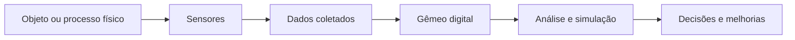
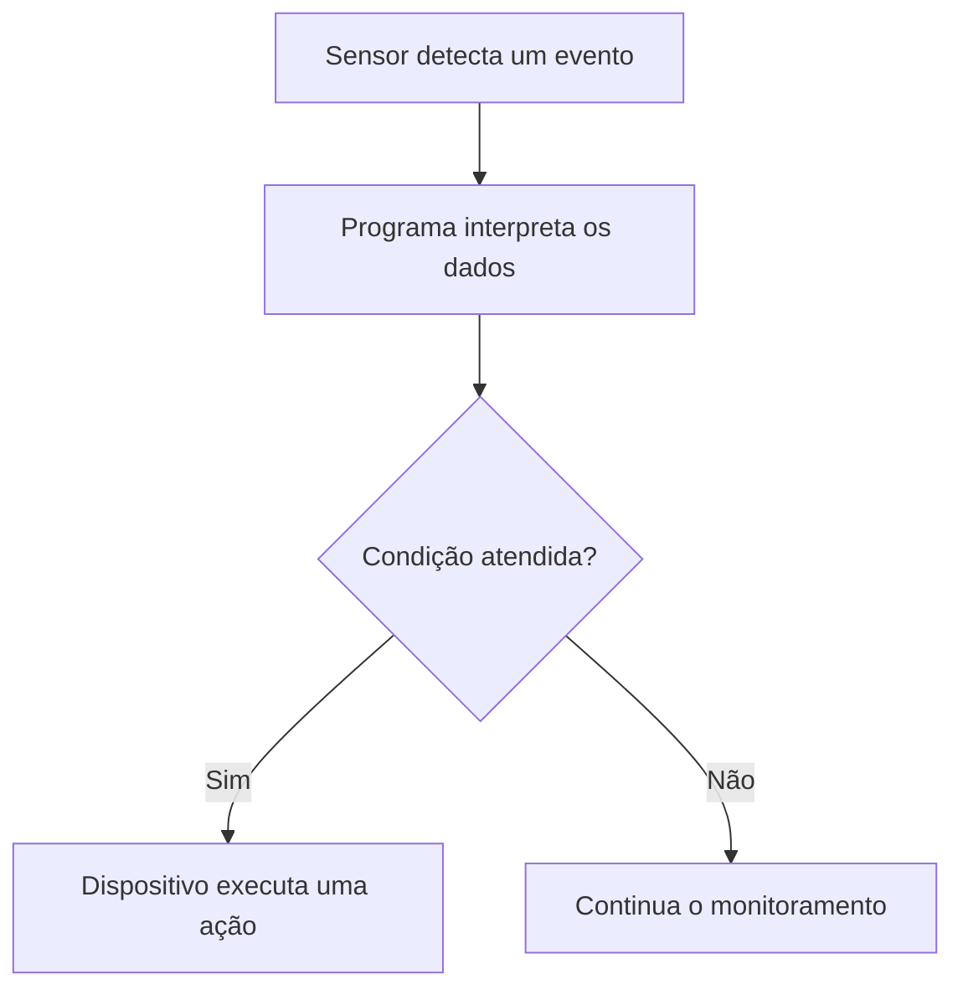
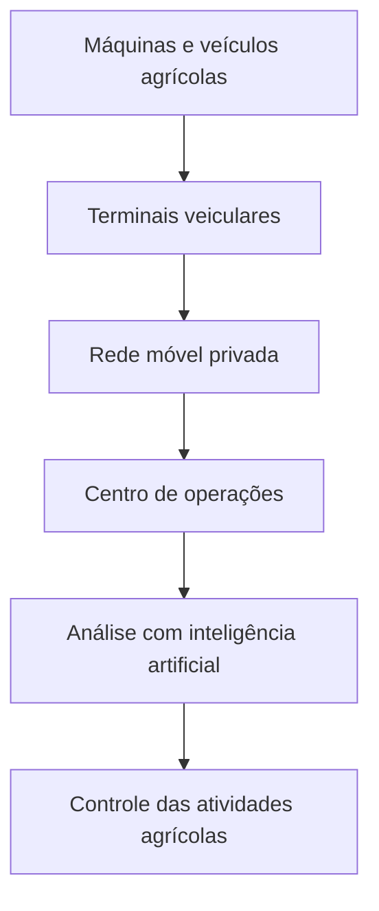
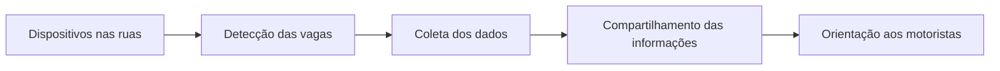
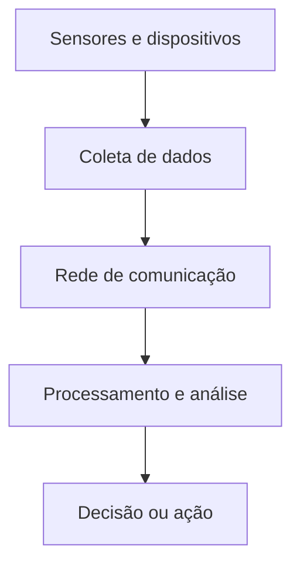

# Internet das Coisas: plataformas, simuladores e aplicações no Brasil

## 1. Plataformas para Internet das Coisas

> [!info] Conceito
> As plataformas de Internet das Coisas fornecem os recursos de hardware e software necessários para desenvolver, programar e testar dispositivos conectados.

Existem diferentes tecnologias que permitem criar e inovar com produtos de IoT. A escolha da plataforma depende da complexidade do projeto, da capacidade de processamento necessária, dos tipos de sensores utilizados e das formas de conectividade desejadas.

Entre as plataformas apresentadas na aula estão:

- **Arduino**;
- **Raspberry Pi**;
- **BeagleBone**.

### 1.1. Arduino

O Arduino é uma plataforma bastante utilizada na prototipagem de circuitos eletrônicos e dispositivos de IoT. Dependendo do modelo ou dos módulos acrescentados, pode oferecer conexão com a internet por meio de:

- Wi-Fi;
- Bluetooth;
- Ethernet.

A placa pode ser usada em conjunto com uma **protoboard**, permitindo montar circuitos experimentais sem a necessidade de soldar os componentes. Dessa maneira, sensores, atuadores e outros dispositivos podem ser conectados e testados rapidamente.

O Arduino é especialmente adequado para:

- aprendizagem de eletrônica e programação;
- automação de tarefas simples;
- leitura de sensores;
- acionamento de motores, lâmpadas e outros atuadores;
- construção de protótipos de dispositivos conectados.

### 1.2. Raspberry Pi

O Raspberry Pi é uma plataforma mais flexível e com maior capacidade computacional do que o Arduino. Trata-se de um computador de pequeno porte capaz de executar um sistema operacional e aplicações mais complexas.

Assim como o Arduino, ele pode ser conectado a sensores e componentes eletrônicos com o auxílio de uma protoboard.

Entre suas possibilidades de aplicação estão:

- processamento local de dados;
- execução de servidores;
- integração de diferentes sensores;
- comunicação com serviços em nuvem;
- automação residencial;
- sistemas multimídia;
- projetos de visão computacional.

### 1.3. BeagleBone

A BeagleBone é outra plataforma computacional utilizada no desenvolvimento de sistemas embarcados e soluções de IoT. Sua proposta é semelhante à do Raspberry Pi, permitindo programar aplicações e conectar sensores, atuadores e outros componentes.

### 1.4. Comparação geral das plataformas

| Plataforma | Característica principal | Aplicações típicas |
|---|---|---|
| Arduino | Microcontrolador voltado ao controle direto de componentes eletrônicos | Leitura de sensores, controle de atuadores e prototipagem |
| Raspberry Pi | Computador de placa única com maior capacidade de processamento | Servidores, automação, análise de dados e aplicações complexas |
| BeagleBone | Computador de placa única direcionado a sistemas embarcados | Automação, controle e integração de dispositivos |

> [!tip] Resumindo
> Arduino, Raspberry Pi e BeagleBone permitem desenvolver soluções de IoT, mas apresentam diferentes capacidades de processamento e diferentes possibilidades de integração com sensores e serviços computacionais.

---

## 2. Simuladores para Internet das Coisas

> [!info] Conceito
> Os simuladores de IoT são programas que permitem criar e testar virtualmente dispositivos, sensores, redes e situações do mundo real.

A simulação possibilita desenvolver algoritmos e verificar a integração entre diferentes componentes antes da implantação física do sistema.

Em um ambiente simulado, é possível testar:

- sensores;
- dispositivos conectados;
- servidores;
- redes de comunicação;
- algoritmos;
- fluxos de dados;
- comportamentos programados;
- cenários baseados em situações reais.

Essa abordagem ajuda a reduzir custos, antecipar problemas e avaliar o funcionamento de uma solução sem exigir imediatamente todos os equipamentos físicos.

Os simuladores mencionados na aula são:

- **Thinger.io**;
- **AWS IoT Device Simulator**;
- **CupCarbon**.

### 2.1. Thinger.io

O Thinger.io é uma plataforma que permite criar fluxos de trabalho para soluções de IoT por meio de recursos de desenvolvimento com baixo uso de código, isto é, utilizando uma abordagem **low-code**.

Essa abordagem facilita a criação e a integração de processos, especialmente quando o objetivo é conectar dispositivos, organizar dados e definir comportamentos sem programar todos os componentes desde o início.

### 2.2. AWS IoT Device Simulator

O AWS IoT Device Simulator é uma ferramenta integrada à infraestrutura de nuvem da Amazon Web Services.

Sua finalidade é simular dispositivos de IoT e testar como eles se comunicariam com serviços hospedados na nuvem. Isso permite avaliar o comportamento de uma solução mesmo antes de todos os dispositivos físicos estarem disponíveis.

### 2.3. CupCarbon

O CupCarbon é um simulador de Internet das Coisas desenvolvido em Java. Ele permite construir cenários relacionados a:

- redes de sensores sem fio;
- dispositivos conectados;
- cidades inteligentes;
- monitoramento urbano;
- sistemas de tráfego;
- automação baseada em sensores.

A ferramenta oferece recursos para representar virtualmente ambientes físicos e simular a atuação de diferentes dispositivos.

> [!warning] Atenção
> A simulação não elimina a necessidade de testes físicos. Ela ajuda a antecipar comportamentos e falhas, mas fatores reais — como interferências, limitações dos sensores, condições ambientais e falhas de comunicação — também precisam ser avaliados posteriormente.

---

## 3. Gêmeos digitais no contexto da IoT

> [!info] Conceito
> Um gêmeo digital (*digital twin*) é uma representação virtual que funciona como contrapartida digital, atualizada em tempo real, de um objeto, sistema ou processo físico.

No contexto da Internet das Coisas, sensores instalados no ambiente físico coletam dados e os enviam para uma representação digital. Essa representação pode ser usada para observar, analisar e simular o comportamento do sistema.

O conceito permite:

- acompanhar o funcionamento de objetos físicos;
- visualizar informações coletadas por sensores;
- testar comportamentos;
- prever possíveis problemas;
- avaliar cenários;
- apoiar decisões;
- otimizar processos.

O CupCarbon aplica esse conceito ao possibilitar a criação de uma representação virtual de dispositivos e processos de IoT, especialmente em cenários urbanos e redes de sensores.

> [!tip] Resumindo
> O gêmeo digital conecta o mundo físico ao ambiente virtual, permitindo acompanhar e testar digitalmente o comportamento de objetos e processos reais.

---

## 4. Demonstração do CupCarbon

Durante a aula, o CupCarbon foi apresentado como uma ferramenta robusta para simular ambientes de Internet das Coisas e cidades inteligentes.

### 4.1. Sensores e dispositivos

O simulador permite incluir diferentes tipos de sensores, entre eles:

- sensor de movimento;
- sensor de calor;
- sensor de gás;
- sensores sem fio;
- outros dispositivos de IoT.

Esses elementos podem ser distribuídos em um cenário virtual e configurados de acordo com o objetivo da simulação.

### 4.2. Programação dos dispositivos

Os dispositivos inseridos na simulação são programáveis. É possível escrever códigos para modificar seu comportamento utilizando:

- **Python**;
- uma linguagem de script própria do CupCarbon.

A programação permite, por exemplo, determinar que um dispositivo:

- acenda ou pisque;
- responda à presença de movimento;
- envie informações;
- altere seu estado;
- comunique-se com outros sensores;
- execute uma ação quando determinada condição for satisfeita.

### 4.3. Criação de cenários complexos

O CupCarbon pode ser usado na elaboração de cenários simples ou extremamente complexos. Um dos exemplos citados é o **gerenciamento de tráfego com sensores de movimento**.

Nesse cenário, sensores podem detectar a movimentação de veículos e fornecer dados para controlar ou avaliar:

- semáforos;
- circulação de veículos;
- congestionamentos;
- ocupação das vias;
- fluxos de mobilidade urbana.

A ferramenta, portanto, não se limita à simulação isolada de um sensor. Ela pode representar conjuntos de dispositivos que interagem em um sistema maior.

---

## 5. Estudos de caso de IoT no Brasil

> [!info] Conceito
> Os estudos de caso demonstram como a Internet das Coisas pode ser aplicada na mineração, agricultura, logística e gestão de cidades.

A aula apresentou quatro áreas brasileiras nas quais soluções de IoT já produzem resultados concretos:

1. mineração;
2. agricultura;
3. monitoramento de cargas;
4. cidades inteligentes.

---

## 6. IoT na mineração: o caso da Vale

A Vale utiliza veículos e equipamentos autônomos em suas atividades de mineração.

### 6.1. Caminhões autônomos na Mina de Brucutu

Na Mina de Brucutu, localizada em São Gonçalo do Rio Abaixo, Minas Gerais, a empresa utiliza caminhões autônomos controlados por sistemas informatizados.

Esses caminhões empregam tecnologias como:

- GPS;
- radares;
- sistemas computacionais;
- inteligência artificial.

A integração dessas tecnologias permite que os veículos executem atividades sem a condução direta de um motorista.

### 6.2. Ganhos de segurança

O principal benefício destacado é o aumento da segurança. Segundo o conteúdo apresentado, não foram registrados acidentes envolvendo esses caminhões autônomos na operação mencionada.

A ausência de operadores dentro dos veículos também reduz a exposição humana aos riscos presentes no ambiente de mineração.

### 6.3. Economia de recursos

A automação também gerou benefícios relacionados à manutenção dos equipamentos:

- aumento de aproximadamente **25% na vida útil dos pneus**;
- aumento de aproximadamente **25% na vida útil dos motores**.

Esses resultados estão associados à condução automatizada, que tende a reduzir variações bruscas e operar os equipamentos de maneira mais regular.

### 6.4. Perfuratrizes autônomas em Itabira

Em Itabira, também em Minas Gerais, a Vale utiliza perfuratrizes autônomas.

Segundo a aula, esses equipamentos proporcionaram uma redução superior a **7% no consumo de combustível**.

| Aplicação | Local | Resultado destacado |
|---|---|---|
| Caminhões autônomos | Mina de Brucutu, São Gonçalo do Rio Abaixo–MG | Maior segurança e aumento de 25% na vida útil de pneus e motores |
| Perfuratrizes autônomas | Itabira–MG | Redução superior a 7% no consumo de combustível |

> [!tip] Resumindo
> Na mineração, a associação entre IoT, GPS, radar e inteligência artificial aumenta a segurança e melhora a eficiência operacional dos equipamentos.

---

## 7. IoT na agricultura: projeto AgroTIC

O Centro de Pesquisa e Desenvolvimento em Telecomunicações — **CPqD** — desenvolveu, com apoio institucional e financeiro, o projeto AgroTIC.

O projeto criou uma **rede móvel privada de banda larga** destinada a propriedades agrícolas e áreas remotas.

### 7.1. Estrutura da rede

A rede é constituída principalmente por:

- uma estação ou rádio base;
- terminais instalados em veículos;
- equipamentos de comunicação;
- sistemas de coleta e processamento de dados.

Essa infraestrutura permite que máquinas e veículos agrícolas transmitam informações mesmo em regiões com acesso limitado às redes convencionais de telecomunicações.

### 7.2. Aplicação no Grupo São Martinho

A solução é utilizada pelo Grupo São Martinho no controle de um centro de operações agrícolas relacionado às usinas de cana-de-açúcar.

A rede possibilita:

- coletar dados das operações;
- acompanhar veículos e máquinas;
- transmitir informações das áreas agrícolas;
- centralizar o controle das atividades;
- utilizar inteligência artificial na análise dos dados;
- melhorar a tomada de decisão.

A aplicação demonstra como redes privadas podem levar conectividade a áreas remotas e viabilizar a agricultura digital.

---

## 8. IoT no monitoramento de cargas

O Centro de Pesquisas Avançadas Wernher von Braun desenvolveu tecnologias destinadas à identificação, autenticação e ao rastreamento de bens e veículos.

### 8.1. Tags utilizadas em pedágios

Uma das soluções mencionadas é uma **tag** utilizada por milhares de veículos em pedágios brasileiros.

A tag permite identificar o veículo e automatizar procedimentos associados à passagem pelo pedágio.

### 8.2. Sensores para bens e cargas

A instituição também desenvolveu sensores capazes de:

- identificar bens;
- rastrear objetos;
- autenticar equipamentos e mercadorias;
- acompanhar cargas transportadas por veículos.

As soluções incorporam recursos avançados de criptografia, importantes para proteger as informações transmitidas e impedir falsificações ou acessos indevidos.

O instituto também participou da elaboração de uma norma internacional relacionada ao uso dessas tecnologias, mencionada na aula como a série **ISO 29167**.

### 8.3. Mobilidade como serviço

Foi desenvolvido um modelo de negócio baseado no conceito de **mobilidade como serviço**. A proposta aproveita equipamentos de rede já disponíveis para viabilizar o rastreamento de cargas nas rodovias brasileiras.

Essa infraestrutura pode permitir:

- comissionamento de equipamentos de rede;
- localização de veículos;
- rastreamento de cargas;
- autenticação dos bens transportados;
- compartilhamento seguro de informações;
- redução dos riscos logísticos.

### 8.4. Compatibilidade com a LGPD

A solução foi apresentada como compatível com a **Lei Geral de Proteção de Dados Pessoais — LGPD**.

Essa compatibilidade é relevante porque sistemas de IoT podem coletar, transmitir e processar grandes volumes de informações. Assim, a segurança e a privacidade precisam ser consideradas desde a concepção do sistema.

### 8.5. Benefícios esperados

O rastreamento pode contribuir para:

- reduzir o risco de roubo de cargas;
- aumentar a segurança dos veículos;
- melhorar a gestão logística;
- reduzir perdas;
- diminuir custos associados ao transporte;
- contribuir para a redução do preço final de determinados produtos.

> [!warning] Atenção
> A coleta de dados por dispositivos de IoT precisa respeitar requisitos de segurança, privacidade e proteção de dados. A conectividade amplia as possibilidades de monitoramento, mas também cria riscos que precisam ser controlados.

---

## 9. IoT em cidades inteligentes: São José dos Campos

São José dos Campos foi apresentada como a primeira cidade inteligente certificada do Brasil.

Um dos serviços implantados no município é o **SigPark**, destinado ao monitoramento de vagas públicas de estacionamento.

### 9.1. Funcionamento do SigPark

O sistema utiliza mais de **4.000 dispositivos** para identificar a disponibilidade de vagas nas ruas da cidade.

Os dados coletados são compartilhados com os motoristas, permitindo descobrir as regiões que apresentam maior concentração de vagas livres.

### 9.2. Benefícios para a mobilidade urbana

A solução pode proporcionar:

- redução do tempo gasto procurando estacionamento;
- melhor aproveitamento das vagas disponíveis;
- diminuição da circulação desnecessária de veículos;
- redução de congestionamentos;
- melhoria da experiência dos motoristas;
- geração de informações para a gestão urbana.

O caso demonstra como sensores distribuídos pela cidade podem produzir dados úteis tanto para os cidadãos quanto para o poder público.

---

## 10. Comparação dos estudos de caso

| Área | Organização ou local | Tecnologias ou recursos | Principal finalidade |
|---|---|---|---|
| Mineração | Vale | GPS, radar, inteligência artificial e veículos autônomos | Aumentar a segurança e a eficiência operacional |
| Agricultura | CPqD e Grupo São Martinho | Rede móvel privada, terminais veiculares e inteligência artificial | Conectar áreas remotas e controlar operações agrícolas |
| Monitoramento de cargas | Centro Wernher von Braun | Tags, sensores, rastreamento e criptografia | Identificar, autenticar e rastrear bens e veículos |
| Cidade inteligente | São José dos Campos | Mais de 4.000 dispositivos conectados | Identificar e informar a disponibilidade de vagas |

Os casos apresentam uma estrutura comum:

Embora as aplicações sejam diferentes, todas dependem da integração entre dispositivos físicos, conectividade, processamento de informações e tomada de decisão.

---

## 11. Desafios da Internet das Coisas

Apesar dos resultados positivos, a Internet das Coisas ainda apresenta desafios que precisam ser superados no Brasil e no restante do mundo.

Os principais desafios mencionados são:

- segurança;
- privacidade;
- legislação;
- regulação.

### 11.1. Segurança

A conexão de equipamentos à internet cria novos pontos de acesso que podem ser explorados indevidamente. Por isso, é necessário proteger:

- dispositivos;
- sensores;
- redes;
- servidores;
- dados transmitidos;
- sistemas de controle.

### 11.2. Privacidade

Os dispositivos de IoT podem registrar informações sobre pessoas, veículos, propriedades e atividades.

O tratamento desses dados deve respeitar:

- a finalidade da coleta;
- a necessidade das informações;
- a transparência;
- o controle de acesso;
- a proteção contra vazamentos;
- a legislação aplicável.

### 11.3. Legislação e regulação

A disseminação da IoT exige normas que orientem aspectos como:

- responsabilidades dos fornecedores;
- proteção dos usuários;
- padronização tecnológica;
- tratamento de dados;
- segurança dos equipamentos;
- utilização de frequências e redes de comunicação.

> [!warning] Atenção
> O avanço tecnológico precisa ser acompanhado pelo desenvolvimento de mecanismos de segurança, regras de proteção de dados e regulamentações adequadas.

---

## 12. Perspectivas para o Brasil

A aula destaca que o Brasil possui condições para se tornar uma liderança internacional em Internet das Coisas.

Para que isso aconteça, é necessário:

- ampliar os casos de sucesso;
- transformar projetos pontuais em soluções de maior escala;
- fomentar a adoção da IoT pelas pequenas e médias empresas;
- ampliar o uso das soluções em empreendimentos agrícolas;
- superar os desafios de segurança e privacidade;
- desenvolver legislação e regulação adequadas;
- estimular pesquisa, inovação e capacitação.

O país já possui exemplos relevantes de aplicação da IoT em diferentes setores. O desafio é fazer com que essas iniciativas deixem de ser isoladas e se tornem amplamente acessíveis.

> [!tip] Resumindo
> O potencial brasileiro não depende apenas da criação de novas tecnologias, mas principalmente da capacidade de escalar soluções bem-sucedidas e promover sua adoção por empresas de diferentes portes.

---

## 13. Síntese final

> [!summary] Síntese
> A Internet das Coisas integra sensores, dispositivos, redes, sistemas computacionais e análise de dados para acompanhar ambientes físicos e produzir ações ou decisões. Plataformas como Arduino, Raspberry Pi e BeagleBone permitem desenvolver protótipos, enquanto simuladores como Thinger.io, AWS IoT Device Simulator e CupCarbon possibilitam testar soluções virtualmente. Os casos brasileiros apresentados demonstram aplicações concretas na mineração, agricultura, logística e gestão urbana. Apesar dos benefícios de segurança, eficiência e redução de custos, a expansão da IoT depende da superação de desafios relacionados à segurança, privacidade, legislação e regulação.

Os principais pontos da aula são:

1. Arduino, Raspberry Pi e BeagleBone são plataformas utilizadas na criação de dispositivos de IoT.
2. Simuladores permitem testar sensores, algoritmos, redes e situações reais antes da implantação física.
3. O CupCarbon possibilita programar sensores e construir cenários complexos de cidades inteligentes.
4. O conceito de gêmeo digital estabelece uma representação virtual de objetos ou processos físicos.
5. A Vale utiliza veículos autônomos para melhorar a segurança e a eficiência da mineração.
6. O projeto AgroTIC utiliza uma rede móvel privada para conectar operações agrícolas em áreas remotas.
7. Tags e sensores possibilitam identificar, autenticar e rastrear veículos, bens e cargas.
8. São José dos Campos utiliza milhares de dispositivos para informar a disponibilidade de vagas de estacionamento.
9. Segurança, privacidade, legislação e regulação são desafios centrais da IoT.
10. O Brasil pode assumir uma posição de liderança se conseguir ampliar os projetos bem-sucedidos e promover sua adoção por pequenas e médias empresas e pelo setor agrícola.