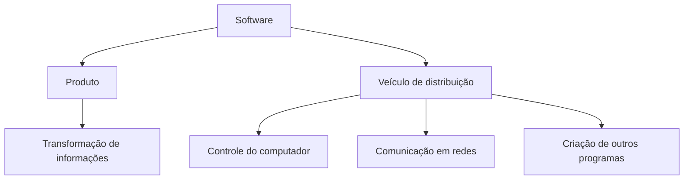
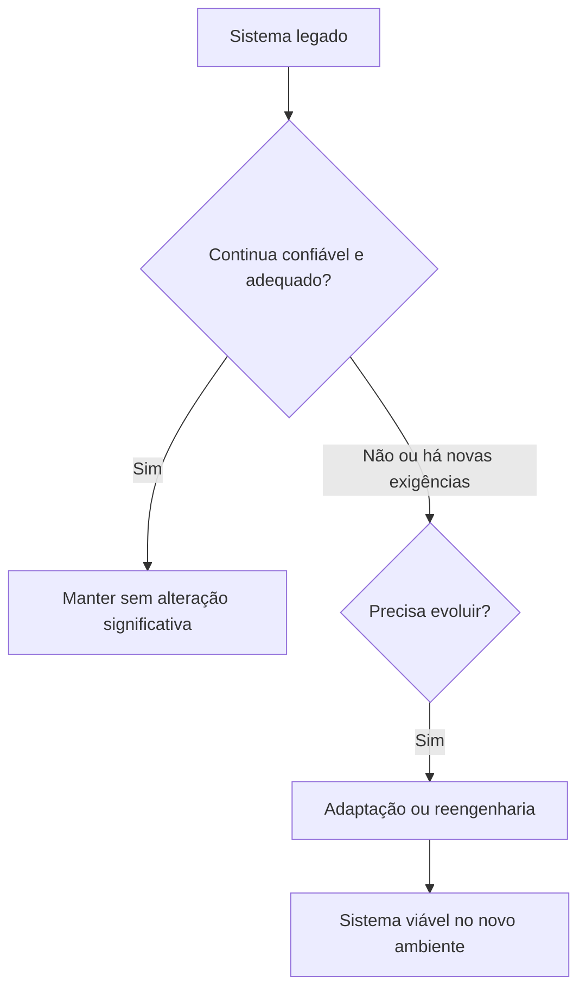
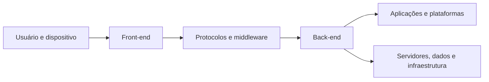
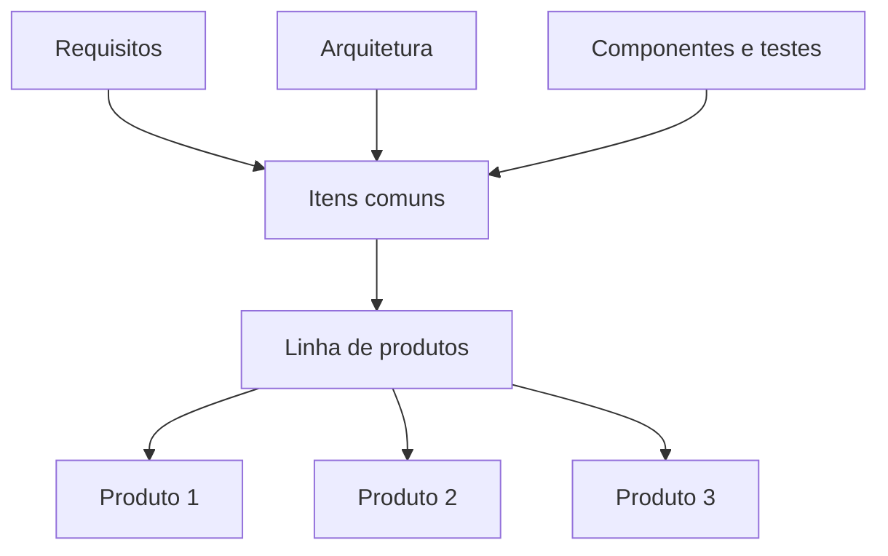

# Capítulo 1 — A natureza do software

## 1. Software e Engenharia de Software

> [!info] Conceito
> Software é o produto desenvolvido e mantido por profissionais para atender necessidades específicas de pessoas e organizações.

O software está presente em praticamente todos os aspectos da vida moderna. Ele influencia atividades comerciais, científicas, industriais, culturais, médicas, militares, educacionais e de entretenimento. Também possibilita o funcionamento de tecnologias como computadores pessoais, smartphones, telecomunicações, redes, automóveis, equipamentos médicos e sistemas corporativos.

O capítulo apresenta a Engenharia de Software como uma estrutura composta por **processos, métodos e ferramentas** destinada a orientar as pessoas responsáveis pelo desenvolvimento e pela manutenção de programas.

O desenvolvimento envolve, de maneira geral, três grupos:

- os clientes e demais envolvidos expressam suas necessidades;
- os engenheiros de software constroem o produto;
- os usuários utilizam o software para resolver problemas ou atender necessidades.

O resultado esperado é um programa que funcione em um ou mais ambientes específicos e atenda às necessidades de seus usuários.

> [!tip] Resumindo
> A Engenharia de Software procura transformar necessidades em produtos confiáveis, utilizando processos, métodos e ferramentas apropriados.

## 2. Disciplina adaptada ao contexto

> [!info] Conceito
> As práticas de Engenharia de Software podem ser adaptadas às características e às necessidades de cada projeto.

O capítulo começa com o exemplo de uma empresa responsável por um jogo eletrônico composto por mais de três milhões de linhas de código. O desenvolvimento exige traduzir as ideias dos profissionais criativos — relacionadas à história, aos personagens e à jogabilidade — em requisitos técnicos que possam orientar a construção do produto.

A equipe aproveita e amplia a arquitetura da versão anterior do jogo, implementa o código com base nos requisitos e realiza testes por meio de construções diárias. Embora não siga todas as técnicas de maneira rígida, ela adapta um subconjunto de práticas de Engenharia de Software às suas necessidades.

O exemplo demonstra que empresas de diferentes setores não precisam aplicar as técnicas exatamente da mesma forma. Entretanto, quanto maiores e mais complexos forem os produtos e quanto mais apertados forem os cronogramas, maior será a necessidade de disciplina no desenvolvimento.

> [!warning] Atenção
> Adaptar as práticas ao contexto não significa desenvolver sem método. A adaptação deve preservar o objetivo de produzir software de alta qualidade de maneira consistente.

## 3. Importância do software

> [!info] Conceito
> O software tornou-se uma tecnologia indispensável e uma das principais forças de transformação da sociedade.

Nas últimas décadas, o software deixou de ser apenas uma ferramenta especializada para análise de informações e resolução de problemas. Ele se transformou em uma indústria própria e em um componente essencial de produtos, serviços e infraestruturas.

O software:

- apoia negócios, ciência e engenharia;
- possibilita o surgimento de novas tecnologias;
- amplia as capacidades de tecnologias existentes;
- modifica setores tradicionais, como mídia e telecomunicações;
- sustenta a computação pessoal e os dispositivos móveis;
- viabiliza serviços fornecidos por navegadores Web;
- controla sistemas de transporte, medicina, indústria e defesa;
- transforma a maneira como as pessoas pesquisam, compram, comunicam-se e se relacionam.

O capítulo associa essa evolução à **lei das consequências não intencionais**: as tecnologias podem produzir efeitos que não foram previstos quando surgiram. Muitas das aplicações atuais do software não poderiam ter sido antecipadas nas primeiras décadas da computação, e novos efeitos ainda poderão aparecer.

Ao mesmo tempo, a sociedade passou a depender do software para decisões, segurança, trabalho, conforto e entretenimento. Essa dependência aumenta a responsabilidade das pessoas que o desenvolvem.

> [!warning] Atenção
> Os benefícios do software são acompanhados por riscos. A mesma tecnologia que distribui informações pode ameaçar a privacidade e permitir ações criminosas.

## 4. Manutenção e evolução

> [!info] Conceito
> A manutenção reúne atividades de correção, adaptação e ampliação realizadas depois — e até mesmo antes — da primeira entrega do software.

Milhões de programas precisam ser continuamente corrigidos, adaptados e ampliados. Segundo o capítulo, essas atividades consomem mais pessoas e recursos do que o esforço empregado na criação de novos softwares.

À medida que a importância do software aumenta, busca-se desenvolver tecnologias que tornem sua criação e manutenção:

- mais fáceis;
- mais rápidas;
- menos caras;
- mais capazes de assegurar qualidade.

Algumas tecnologias são direcionadas a campos específicos, como o desenvolvimento de sites. Outras se concentram em determinados paradigmas, como sistemas orientados a objetos. Há ainda tecnologias de aplicação ampla, como os sistemas operacionais.

Entretanto, não existe uma tecnologia única capaz de resolver todos os problemas do desenvolvimento. Por isso, a Engenharia de Software combina diferentes processos, métodos e ferramentas.

> [!tip] Resumindo
> Desenvolver a primeira versão é apenas uma parte do trabalho. O software normalmente continuará sendo corrigido e modificado durante grande parte de sua vida.

## 5. O duplo papel do software

> [!info] Conceito
> O software atua simultaneamente como produto e como veículo para distribuir produtos e informações.

Como **produto**, o software fornece o potencial computacional do hardware ou de uma rede de computadores. Ele pode residir em um smartphone, tablet, computador pessoal, servidor ou mainframe.

Nesse papel, funciona como um **transformador de informações**, realizando operações como:

- produzir;
- adquirir;
- gerenciar;
- modificar;
- exibir;
- transmitir informações.

Essas informações podem variar de um único bit a apresentações multimídia produzidas a partir de diversas fontes.

Como **veículo de distribuição**, o software fornece a base para:

- controlar o computador, por meio dos sistemas operacionais;
- comunicar informações, por meio das redes;
- criar e controlar outros programas, por meio de ferramentas e ambientes de software.

O software também distribui um dos produtos mais importantes da atualidade: a **informação**. Ele transforma dados pessoais, gerencia informações comerciais, oferece acesso à Internet e permite obter informações em diferentes formatos.

> [!tip] Resumindo
> O software não apenas realiza tarefas: também controla equipamentos, conecta sistemas e distribui informações.

## 6. Questões fundamentais do desenvolvimento

> [!info] Conceito
> Mesmo com os avanços tecnológicos, persistem dificuldades relacionadas a prazo, custo, qualidade, manutenção e medição.

O aumento do desempenho do hardware, da capacidade de armazenamento e da variedade dos dispositivos permitiu a criação de sistemas cada vez mais sofisticados. Contudo, essa sofisticação também aumentou a complexidade enfrentada pelas equipes de desenvolvimento.

O programador solitário foi substituído por equipes de especialistas, mas várias questões históricas permanecem:

- Por que a conclusão de um software leva tanto tempo?
- Por que os custos de desenvolvimento são tão altos?
- Por que não é possível encontrar todos os erros antes da entrega?
- Por que a manutenção de programas existentes consome tanto tempo e esforço?
- Por que é difícil medir o progresso do desenvolvimento e da manutenção?

Essas perguntas expressam uma preocupação não apenas com o produto final, mas também com **a maneira como o software é desenvolvido**. Essa preocupação levou à adoção das práticas da Engenharia de Software.

## 7. Definição de software

> [!info] Conceito
> Software é formado por programas, estruturas de dados e informações descritivas.

O capítulo define software por meio de três elementos:

1. **Instruções ou programas:** quando executados, fornecem as funções, características e o desempenho desejados.
2. **Estruturas de dados:** possibilitam que os programas representem e manipulem informações adequadamente.
3. **Informações descritivas:** documentação impressa ou virtual que explica a operação e a utilização dos programas.

Portanto, software não corresponde apenas ao código-fonte ou ao arquivo executável. Os dados e a documentação também fazem parte do produto.

> [!warning] Atenção
> Considerar software apenas como código produz uma visão incompleta, pois ignora os dados manipulados e as informações necessárias para compreender e utilizar o sistema.

## 8. Natureza lógica do software

> [!info] Conceito
> Software é um elemento lógico, e não um componente físico; por isso, seu comportamento ao longo do tempo difere do comportamento do hardware.

### 8.1 Desgaste do hardware

O hardware apresenta uma relação entre taxa de defeitos e tempo conhecida como **curva da banheira**.

No início de sua vida, a taxa de defeitos pode ser alta devido a problemas de projeto ou fabricação. À medida que esses defeitos são corrigidos, a taxa diminui e permanece relativamente estável.

Com o passar do tempo, fatores como poeira, vibração, impactos e temperaturas extremas deterioram os componentes físicos. A taxa de defeitos volta a aumentar, caracterizando o desgaste.

Quando um componente físico se desgasta, ele pode ser substituído por uma peça nova.

### 8.2 Deterioração do software

O software não está exposto aos fatores ambientais que provocam o desgaste físico. Defeitos existentes no início são descobertos e corrigidos, fazendo com que sua taxa diminua.

Entretanto, durante sua vida, o software sofre alterações. Cada modificação pode introduzir novos erros ou produzir efeitos colaterais. Antes que a taxa de defeitos volte ao nível anterior, outra mudança pode ser solicitada, gerando um novo aumento.

Mudanças sucessivas podem elevar gradualmente o nível mínimo da taxa de defeitos. Nesse sentido, o software **não se desgasta**, mas **se deteriora devido às modificações**.

Não existem peças de reposição para software. Cada defeito está relacionado a um problema no projeto ou no processo utilizado para transformar o projeto em código executável. Por essa razão, a manutenção de software é mais complexa do que a simples substituição de um componente físico.

Os métodos de Engenharia de Software procuram reduzir:

- a quantidade de erros introduzidos pelas mudanças;
- a intensidade dos aumentos na taxa de defeitos;
- a deterioração acumulada ao longo do tempo.

| Aspecto | Hardware | Software |
|---|---|---|
| Natureza | Física | Lógica |
| Problema ao longo do tempo | Desgaste ambiental e material | Deterioração decorrente de mudanças |
| Correção comum | Substituição de componentes | Modificação do projeto ou do código |
| Peças de reposição | Existem | Não existem |
| Origem dos defeitos | Projeto, fabricação ou desgaste | Projeto ou processo de implementação |

> [!tip] Resumindo
> O hardware envelhece fisicamente. O software deteriora-se quando alterações introduzem erros, efeitos colaterais e complexidade adicional.

## 9. Campos de aplicação

> [!info] Conceito
> As aplicações são organizadas em sete grandes categorias, cada uma com finalidades e desafios próprios.

### 9.1 Software de sistema

É um conjunto de programas criado para atender outros programas. Inclui:

- compiladores;
- editores;
- utilitários para gerenciamento de arquivos;
- componentes de sistemas operacionais;
- drivers;
- software de rede;
- processadores de telecomunicações.

Alguns desses sistemas processam estruturas de informação cuja ordem e periodicidade são previsíveis. Outros processam dados cuja ordem e momento de entrada, processamento e saída não podem ser antecipados.

### 9.2 Software de aplicação

Reúne programas independentes destinados a resolver necessidades específicas de negócio. Esses programas processam dados comerciais ou técnicos para facilitar operações, decisões administrativas e decisões técnicas.

### 9.3 Software de engenharia ou científico

Abrange programas que executam grandes volumes de cálculos. Suas aplicações incluem:

- astronomia;
- vulcanologia;
- análise de tensões automotivas;
- dinâmica orbital;
- projeto auxiliado por computador;
- biologia molecular;
- análise genética;
- meteorologia.

### 9.4 Software embarcado

É instalado em um produto ou sistema para implementar ou controlar suas funções. Pode desempenhar tarefas limitadas, como controlar o painel de um forno de micro-ondas, ou executar funções importantes em automóveis, como:

- controlar o nível de combustível;
- operar painéis digitais;
- controlar sistemas de freio.

### 9.5 Software para linha de produtos

É desenvolvido para oferecer uma capacidade específica a diferentes clientes. Pode atender um mercado limitado, como sistemas de controle de inventário, ou ser direcionado ao mercado de consumo em massa.

### 9.6 Aplicações Web e aplicativos móveis

Essa categoria abrange aplicações executadas ou acessadas por redes, incluindo programas utilizados em navegadores e software instalado em dispositivos móveis.

### 9.7 Software de inteligência artificial

Utiliza algoritmos não numéricos para resolver problemas complexos que não permitem computação ou análise direta. Entre as aplicações citadas estão:

- robótica;
- sistemas especialistas;
- reconhecimento de imagens e voz;
- redes neurais artificiais;
- demonstração de teoremas;
- jogos.

| Categoria | Finalidade principal |
|---|---|
| Software de sistema | Atender e controlar outros programas |
| Software de aplicação | Resolver necessidades específicas de negócio |
| Engenharia ou científico | Executar cálculos e análises técnicas |
| Software embarcado | Controlar funções de produtos e equipamentos |
| Linha de produtos | Atender vários clientes com capacidades relacionadas |
| Web e móvel | Oferecer aplicações conectadas ou executadas em dispositivos móveis |
| Inteligência artificial | Resolver problemas complexos por técnicas não numéricas |

> [!tip] Resumindo
> As categorias possuem objetivos diferentes, mas todas apresentam desafios de construção, correção, adaptação e evolução.

## 10. Software legado

> [!info] Conceito
> Software legado é um sistema antigo, continuamente modificado, que permanece relevante por sustentar funções importantes para uma organização.

Os sistemas legados foram desenvolvidos há muitos anos e adaptados às mudanças nos requisitos de negócio e nas plataformas computacionais. Eles são caracterizados principalmente por:

- **longevidade**, porque permanecem em funcionamento por muito tempo;
- **criticidade**, porque sustentam funções vitais e, em muitos casos, indispensáveis.

Alguns sistemas legados apresentam baixa qualidade segundo os critérios modernos da Engenharia de Software. Entre os problemas possíveis estão:

- arquitetura ou projeto difícil de ampliar;
- código de difícil entendimento;
- documentação deficiente ou inexistente;
- casos e resultados de testes não documentados;
- histórico de alterações mal gerenciado;
- alto custo de manutenção;
- riscos elevados durante a evolução.

Entretanto, um software legado confiável que continua atendendo seus usuários não precisa ser modificado apenas por ser antigo. Se não está apresentando problemas e não há necessidade de alteração significativa, pode ser mais adequado mantê-lo como está.

> [!warning] Atenção
> Antiguidade não é suficiente para justificar a substituição de um sistema. A decisão deve considerar seu funcionamento, sua importância para o negócio e a necessidade real de mudança.

### 10.1 Motivos para evolução

Um sistema legado pode precisar evoluir quando:

- deve funcionar em novos ambientes ou tecnologias computacionais;
- precisa implementar novos requisitos de negócio;
- necessita operar com bancos de dados ou sistemas mais modernos;
- precisa ter sua arquitetura reorganizada para permanecer viável.

Quando essas mudanças se tornam necessárias, pode-se realizar a **reengenharia**, isto é, a análise e a transformação do sistema para melhorar sua estrutura e permitir sua continuidade.

O capítulo ressalta que as mudanças fazem parte da natureza do software. Os sistemas evoluem continuamente e novos produtos podem ser construídos com base nos anteriores.

> [!tip] Resumindo
> O desafio não é simplesmente eliminar sistemas antigos, mas evoluí-los de maneira segura quando as necessidades do negócio ou da tecnologia exigirem.

## 11. A natureza mutante do software

> [!info] Conceito
> O setor é influenciado pela rápida evolução das aplicações Web, dos aplicativos móveis, da computação em nuvem e das linhas de produtos.

### 11.1 WebApps

Nos primeiros anos da World Wide Web, aproximadamente entre 1990 e 1995, os sites eram conjuntos de arquivos de hipertexto interligados, com informações apresentadas por textos e recursos gráficos limitados.

Com o crescimento da HTML e de tecnologias como XML e Java, os sistemas Web passaram a oferecer capacidade de processamento além da simples apresentação de informações. Surgiram, assim, os sistemas e aplicações baseados na Web, denominados **WebApps**.

Atualmente, as WebApps:

- oferecem funções especializadas;
- integram-se a bancos de dados corporativos;
- conectam-se a aplicações de negócio;
- combinam comunicação, computação, conteúdo e tecnologia;
- disponibilizam funcionalidades complexas e conteúdo multimídia.

As tecnologias relacionadas à Web Semântica ampliaram as possibilidades de representação flexível dos dados, estabelecimento de conexões entre informações e acesso externo por interfaces de programação.

> [!tip] Resumindo
> As WebApps evoluíram de páginas informativas para sistemas completos, integrados a dados e processos organizacionais.

### 11.2 Aplicativos móveis

Um aplicativo móvel é projetado especificamente para funcionar em uma plataforma como:

- iOS;
- Android;
- Windows Mobile.

Esses aplicativos normalmente apresentam:

- interface adaptada aos mecanismos de interação do dispositivo;
- interoperabilidade com recursos disponíveis na Web;
- processamento local;
- coleta, análise e formatação de informações;
- armazenamento persistente no próprio dispositivo.

#### Aplicação Web móvel e aplicativo móvel

Uma **aplicação Web móvel** permite acessar conteúdo da Web por meio de um navegador adaptado às características da plataforma.

Um **aplicativo móvel** pode acessar diretamente componentes do dispositivo, como o acelerômetro e a localização por GPS, além de utilizar processamento e armazenamento locais.

| Aspecto | Aplicação Web móvel | Aplicativo móvel |
|---|---|---|
| Forma de acesso | Navegador móvel | Programa instalado ou residente no dispositivo |
| Conteúdo principal | Baseado na Web | Pode combinar recursos locais e remotos |
| Acesso ao hardware | Dependente das capacidades do navegador | Acesso direto aos recursos do dispositivo |
| Processamento e armazenamento local | Mais limitado | Integrado às capacidades da plataforma |

A diferença tende a diminuir conforme os navegadores móveis se tornam mais sofisticados e obtêm maior acesso aos recursos dos dispositivos.

> [!warning] Atenção
> WebApp móvel e aplicativo móvel não são exatamente a mesma coisa, embora a evolução dos navegadores esteja aproximando os dois modelos.

### 11.3 Computação em nuvem

> [!info] Conceito
> A computação em nuvem é uma infraestrutura que permite compartilhar e acessar recursos computacionais em grande escala a partir de diferentes lugares e dispositivos.

Os dispositivos permanecem fora da nuvem e acessam os recursos disponíveis nela. Esses recursos podem incluir:

- aplicações;
- plataformas;
- infraestrutura;
- bancos de dados;
- armazenamento;
- servidores;
- redes;
- serviços de processamento.

Em sua forma mais simples, um dispositivo acessa a nuvem por meio de um navegador ou programa semelhante. O usuário pode consultar dados e executar aplicações hospedadas remotamente, em vez de depender apenas dos programas instalados localmente.

A arquitetura da nuvem possui duas partes principais:

- **front-end:** dispositivo do usuário e software utilizado para acessar a nuvem, como o navegador;
- **back-end:** servidores, aplicações, recursos computacionais, sistemas de armazenamento, bancos de dados e mecanismos administrativos.

Entre essas partes, o **middleware** coordena e monitora o tráfego, enquanto os protocolos definem como o acesso aos recursos deve ocorrer.

O acesso pode variar de estruturas públicas, abertas a muitos usuários, a nuvens privadas, disponíveis somente para pessoas autorizadas.

> [!tip] Resumindo
> A nuvem separa o dispositivo usado pelo usuário da infraestrutura que armazena dados e executa aplicações.

### 11.4 Linha de produtos de software

> [!info] Conceito
> Uma linha de produtos reúne sistemas relacionados que compartilham recursos, arquitetura e componentes básicos.

Uma linha de produtos de software é formada por sistemas que:

- compartilham um conjunto comum de recursos;
- atendem necessidades de determinado mercado ou missão;
- são desenvolvidos a partir de itens básicos comuns;
- seguem uma forma de construção previamente definida.

Os produtos da linha podem compartilhar:

- requisitos;
- arquitetura;
- padrões de projeto;
- componentes reutilizáveis;
- casos de teste;
- outros produtos do trabalho de Engenharia de Software.

A reutilização desses elementos possibilita criar vários produtos relacionados, aproveitando atributos comuns e aumentando potencialmente a eficiência do desenvolvimento.

> [!tip] Resumindo
> Em vez de desenvolver cada sistema desde o início, uma linha de produtos reutiliza uma base comum para construir diferentes soluções relacionadas.

## 12. Relação entre o capítulo e a aula

> [!info] Conceito
> O capítulo fundamenta e amplia os conceitos apresentados na aula introdutória.

A aula e o capítulo abordam em comum:

- a importância da Engenharia de Software;
- as dificuldades de prazo, custo, qualidade e manutenção;
- a definição de software;
- a diferença entre desgaste do hardware e deterioração do software;
- os campos de aplicação;
- os sistemas legados;
- as WebApps;
- os aplicativos móveis;
- a computação em nuvem.

O capítulo acrescenta detalhes importantes, como:

- o software como produto e veículo de distribuição;
- a informação como principal produto distribuído;
- a distinção entre WebApp móvel e aplicativo móvel;
- a organização da nuvem em front-end e back-end;
- a linha de produtos de software;
- os critérios para decidir quando modificar um sistema legado;
- a reengenharia como alternativa para manter sistemas antigos viáveis;
- a necessidade de adaptar as práticas de Engenharia de Software ao contexto.

## 13. Questões para reflexão

> [!info] Conceito
> As questões propostas ao final do capítulo estimulam a aplicação crítica dos conceitos estudados.

O capítulo sugere refletir sobre:

1. exemplos de consequências não intencionais provocadas pelo software;
2. impactos positivos e negativos do software na sociedade;
3. possíveis respostas para os problemas de custo, prazo, erros, manutenção e medição;
4. maneiras de construir sistemas que reduzam a deterioração causada pelas mudanças;
5. possibilidade de aplicar a mesma abordagem de Engenharia de Software às sete categorias de aplicação.

Essas questões destacam que os princípios gerais precisam ser avaliados de acordo com o contexto, a finalidade, a complexidade e os riscos de cada sistema.

## 14. Síntese final

> [!summary] Síntese
> Software é uma tecnologia lógica, mutável e essencial, formada por programas, dados e documentação. Sua construção e evolução exigem práticas disciplinadas de Engenharia de Software.

O software passou de ferramenta especializada a elemento central da economia e da vida social. Ele atua como produto, oferecendo capacidade computacional, e como veículo de distribuição, controlando equipamentos, conectando sistemas e transformando informações.

Por ser lógico, não se desgasta como o hardware. Entretanto, alterações sucessivas podem introduzir erros e efeitos colaterais, provocando sua deterioração. Esse comportamento torna a manutenção e a evolução atividades complexas e permanentes.

O software está presente em sete grandes campos: sistemas, aplicações de negócio, engenharia e ciência, sistemas embarcados, linhas de produtos, aplicações Web e móveis e inteligência artificial. Em todas essas categorias, novos sistemas convivem com programas antigos que precisam ser corrigidos, adaptados e aperfeiçoados.

Os sistemas legados merecem atenção especial porque frequentemente sustentam funções vitais. Eles não devem ser modificados apenas por serem antigos, mas podem precisar de adaptação ou reengenharia quando surgirem novos requisitos, tecnologias ou necessidades de integração.

A natureza do software continua mudando. WebApps tornaram-se sistemas sofisticados; aplicativos móveis passaram a combinar recursos locais e remotos; a computação em nuvem alterou a distribuição de aplicações e infraestrutura; e as linhas de produtos passaram a explorar arquiteturas e componentes reutilizáveis.

Apesar de todos os avanços, a indústria ainda enfrenta dificuldades para produzir software de qualidade dentro do prazo e do orçamento. A Engenharia de Software responde a esse desafio oferecendo processos, métodos e ferramentas que devem ser aplicados com disciplina e adaptados ao contexto de cada projeto.