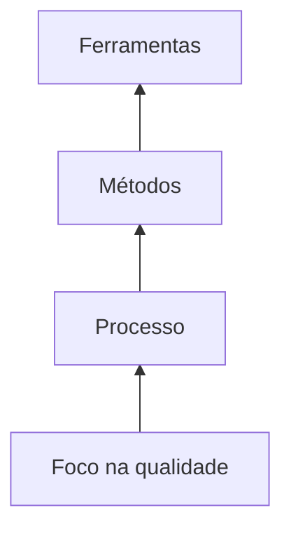
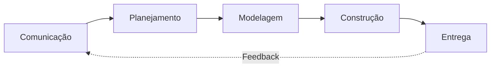
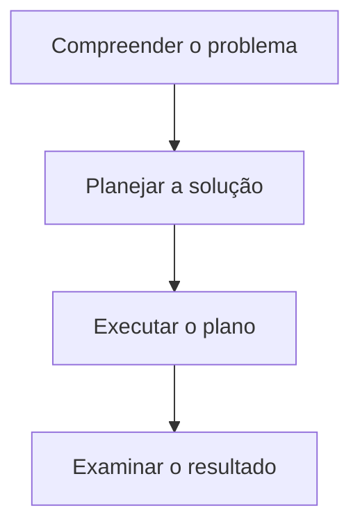
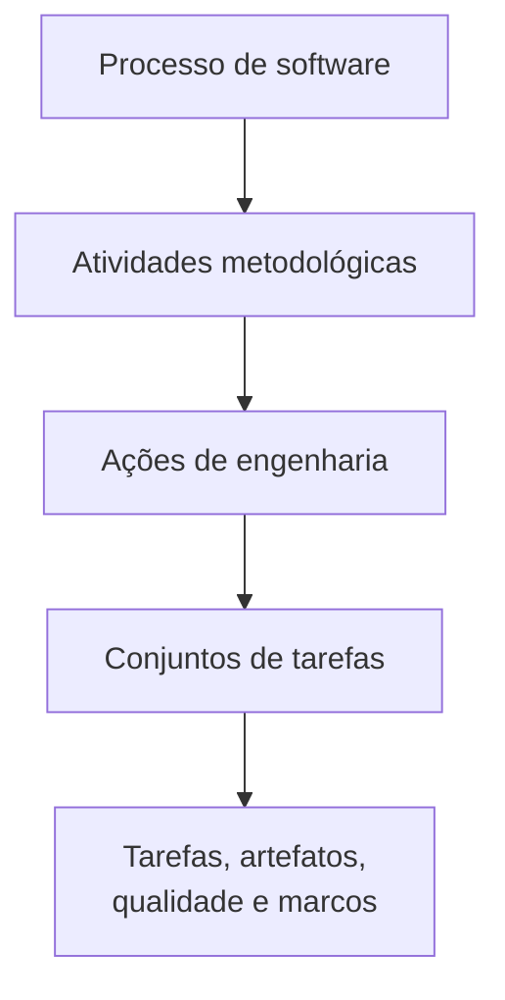
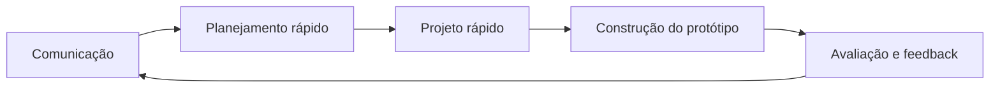
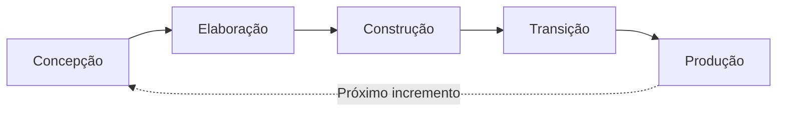
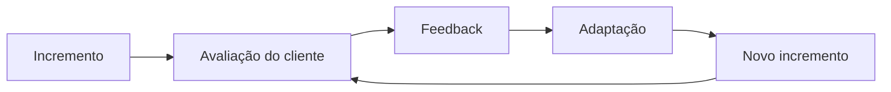
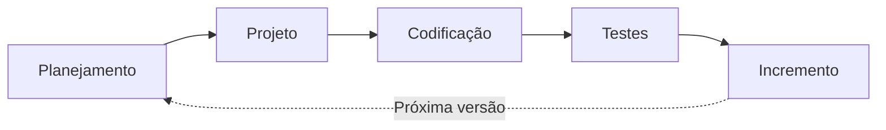
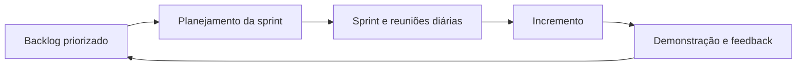

# Engenharia de Software, Processos, Modelos Tradicionais e Desenvolvimento Ágil

## Visão geral dos capítulos 2 a 5

> [!info] Conceito
> Os capítulos apresentam a engenharia de software como uma disciplina baseada em qualidade, processos, métodos e ferramentas, descrevendo desde sua estrutura fundamental até os modelos tradicionais e ágeis de desenvolvimento.

O software está incorporado em praticamente todos os setores da sociedade. Pessoas, empresas e governos dependem dele para executar operações e tomar decisões, enquanto os sistemas se tornam cada vez maiores e mais complexos. Por isso, o desenvolvimento não deve ser tratado apenas como programação: é necessário compreender o problema, projetar a solução, controlar a qualidade e preparar o produto para mudanças futuras.

Os quatro capítulos desenvolvem uma sequência lógica:

- O **Capítulo 2** define engenharia de software, processo, prática e princípios.
- O **Capítulo 3** detalha como o processo é estruturado e adaptado.
- O **Capítulo 4** apresenta diferentes modelos de processo.
- O **Capítulo 5** explica agilidade e os principais modelos ágeis.

# Capítulo 2 — Engenharia de software

## 1. Necessidade da engenharia de software

> [!info] Conceito
> Engenharia de software é necessária porque sistemas complexos precisam ser construídos com qualidade, dentro dos prazos e preparados para manutenção e evolução.

A importância da engenharia de software decorre de quatro constatações:

1. O software está presente em praticamente todos os aspectos da vida, aumentando o número de pessoas interessadas em suas funções. Portanto, é necessário compreender o problema antes de desenvolver a solução.
2. Os requisitos tecnológicos tornam-se mais complexos, e os sistemas são desenvolvidos por equipes cada vez maiores. Por isso, projetar a solução tornou-se uma atividade essencial.
3. Pessoas e organizações dependem do software para atividades importantes. Uma falha pode causar desde pequenos inconvenientes até consequências catastróficas, tornando indispensável a qualidade.
4. Sistemas valiosos geralmente permanecem em uso por mais tempo e recebem mais solicitações de adaptação. Consequentemente, o software precisa ser passível de manutenção.

> [!tip] Resumindo
> Compreensão do problema, projeto adequado, qualidade e facilidade de manutenção são necessidades centrais da engenharia de software.

## 2. Definição de engenharia de software

> [!info] Conceito
> Engenharia de software é a aplicação de uma abordagem sistemática, disciplinada e quantificável ao desenvolvimento, à operação e à manutenção de software.

Uma abordagem sistemática organiza o trabalho; uma abordagem disciplinada utiliza práticas e critérios definidos; e uma abordagem quantificável emprega medições para avaliar processo, projeto e produto.

Essa disciplina precisa combinar **rigor e adaptabilidade**. Um processo adequado para uma grande aplicação crítica pode ser excessivamente pesado para um sistema pequeno. Assim, a engenharia de software não exige que todos os projetos sejam conduzidos da mesma maneira.

## 3. Engenharia de software como tecnologia em camadas

> [!info] Conceito
> A engenharia de software é formada por camadas interdependentes, sustentadas pelo compromisso organizacional com a qualidade.

As camadas são:

- **Foco na qualidade:** constitui a base de toda a engenharia de software e promove o aperfeiçoamento contínuo.
- **Processo:** organiza o desenvolvimento, estabelece o contexto do trabalho técnico, controla o projeto e permite gerenciar mudanças.
- **Métodos:** fornecem as orientações técnicas para comunicação, análise de requisitos, projeto, programação, testes e suporte.
- **Ferramentas:** oferecem apoio automatizado ou semiautomatizado aos processos e métodos.

Quando diferentes ferramentas são integradas e conseguem compartilhar informações, forma-se um ambiente de engenharia de software auxiliada por computador.

> [!warning] Atenção
> Ferramentas não substituem processos e métodos. Elas apenas apoiam a execução de um trabalho que precisa ser tecnicamente organizado.

## 4. Processo de software

> [!info] Conceito
> Processo é um conjunto de atividades, ações e tarefas realizadas para produzir algum artefato.

Esses elementos possuem níveis diferentes de abrangência:

- **Atividade:** procura atingir um objetivo amplo, como comunicar-se com os envolvidos.
- **Ação:** reúne tarefas relacionadas à produção de um artefato importante, como elaborar o projeto arquitetural.
- **Tarefa:** possui um objetivo menor e bem definido, como executar um teste de unidade.

O processo não deve ser entendido como uma receita rígida. Ele constitui uma abordagem adaptável, por meio da qual a equipe seleciona as ações e tarefas adequadas ao projeto.

## 5. Metodologia genérica do processo

> [!info] Conceito
> Uma metodologia de processo estabelece atividades gerais que podem ser aplicadas a qualquer projeto, independentemente de seu tamanho ou complexidade.

A metodologia genérica é formada por cinco atividades:

1. **Comunicação:** colaboração com clientes e demais envolvidos para compreender os objetivos e levantar os requisitos.
2. **Planejamento:** definição das tarefas, riscos, recursos, produtos resultantes e cronograma.
3. **Modelagem:** criação de representações que permitam compreender o problema e projetar sua solução.
4. **Construção:** geração do código e realização dos testes necessários para identificar erros.
5. **Entrega:** disponibilização do software completo ou de um incremento para avaliação do cliente e obtenção de feedback.

As atividades podem ser repetidas em várias iterações. Cada repetição produz um incremento que torna o sistema mais completo.

## 6. Atividades de apoio

> [!info] Conceito
> Atividades de apoio atravessam todo o processo e ajudam a controlar o andamento, a qualidade, os riscos e as mudanças.

As principais atividades de apoio são:

- **Controle e acompanhamento do projeto:** compara o progresso com o planejamento e permite corrigir desvios.
- **Administração de riscos:** identifica e avalia acontecimentos que possam afetar o projeto ou o produto.
- **Garantia da qualidade:** define e executa ações destinadas a assegurar a qualidade do software.
- **Revisões técnicas:** avaliam os artefatos para localizar erros antes que se propaguem.
- **Medição:** coleta dados do processo, do projeto e do produto para orientar decisões.
- **Gerenciamento da configuração:** controla as alterações realizadas nos artefatos.
- **Gerenciamento da reutilização:** estabelece critérios e mecanismos para reaproveitar componentes e outros artefatos.
- **Produção de artefatos:** compreende a criação de modelos, documentos, registros, formulários e listas.

## 7. Adaptação do processo

> [!info] Conceito
> O processo precisa ser adaptado ao problema, ao projeto, à equipe e à cultura da organização.

A adaptação pode modificar:

- o fluxo das atividades e suas dependências;
- o nível de detalhamento das ações e tarefas;
- os artefatos exigidos;
- os procedimentos de garantia da qualidade;
- o acompanhamento e controle;
- o rigor da descrição do processo;
- o envolvimento do cliente;
- a autonomia da equipe;
- a forma de organização do grupo.

Um processo excessivamente rígido pode gerar burocracia, mas a ausência de organização pode produzir descontrole. O objetivo é encontrar o nível de disciplina adequado ao contexto.

## 8. Prática da engenharia de software

> [!info] Conceito
> A prática da engenharia de software pode ser entendida como uma atividade estruturada de resolução de problemas.

A essência dessa prática é composta por quatro etapas:

### 8.1. Compreender o problema

Antes de começar a programar, a equipe deve identificar:

- quem possui interesse na solução;
- quais dados, funções e recursos são necessários;
- se o problema pode ser dividido em partes menores;
- se pode ser representado por um modelo.

Escutar os envolvidos é fundamental para compreender corretamente o problema.

### 8.2. Planejar a solução

A equipe deve investigar:

- se existem problemas semelhantes;
- se há padrões reconhecíveis;
- se componentes ou soluções anteriores podem ser reutilizados;
- se o problema pode ser dividido em subproblemas;
- se a solução pode ser representada em um modelo de projeto.

### 8.3. Executar o plano

O projeto serve como um mapa para a construção. A implementação deve permanecer relacionada ao modelo, e suas partes precisam ser revistas para verificar sua correção.

### 8.4. Examinar o resultado

A equipe deve testar cada parte da solução e validar o software em relação às necessidades dos envolvidos.

> [!tip] Resumindo
> A prática segura consiste em compreender antes de resolver, planejar antes de programar, executar de forma controlada e verificar o resultado.

## 9. Princípios gerais da engenharia de software

> [!info] Conceito
> Princípios estabelecem uma forma de pensar que orienta decisões técnicas e organizacionais.

### 9.1. A razão de existir

O software deve agregar valor aos usuários. Antes de acrescentar uma função, requisito ou tecnologia, deve-se verificar se isso contribui efetivamente para o sistema.

### 9.2. KISS — não complique

O projeto deve ser tão simples quanto possível, mas não simplista. Simplicidade não significa improvisação: geralmente exige reflexão e refinamento. Sistemas simples são mais compreensíveis, menos propensos a erros e mais fáceis de manter.

### 9.3. Mantenha a visão

O projeto precisa conservar uma visão arquitetural coerente. Sem integridade conceitual, o sistema pode se transformar em um conjunto de soluções incompatíveis.

### 9.4. O que um produz, outros consomem

O software, o código, os modelos e os documentos serão utilizados por outras pessoas. Por isso, devem ser compreensíveis para usuários, desenvolvedores, responsáveis pela manutenção e demais interessados.

### 9.5. Esteja aberto para o futuro

O sistema deve estar preparado para adaptações, pois requisitos e tecnologias mudam. Entretanto, projetar para possibilidades futuras não deve ser levado ao extremo, pois uma generalização excessiva pode aumentar custos e reduzir a eficiência.

### 9.6. Planeje visando à reutilização

A reutilização pode economizar tempo e esforço, mas não ocorre automaticamente. Componentes reutilizáveis exigem planejamento e podem custar mais para serem inicialmente desenvolvidos.

### 9.7. Pense

Refletir cuidadosamente antes de agir melhora os resultados e permite reconhecer limitações de conhecimento. Mesmo quando uma decisão refletida se mostra incorreta, ela pode produzir aprendizagem útil.

## 10. Mitos do desenvolvimento de software

> [!warning] Atenção
> Mitos são crenças aparentemente razoáveis que geram expectativas incorretas e decisões prejudiciais.

### 10.1. Mitos de gerenciamento

| Mito | Realidade |
|---|---|
| Um manual de padrões contém tudo o que a equipe precisa. | O documento pode estar desatualizado, incompleto, desconhecido, pouco utilizado ou inadequado ao projeto. |
| Acrescentar programadores recuperará um projeto atrasado. | Novos integrantes precisam ser treinados e aumentam a comunicação necessária, podendo atrasar ainda mais o projeto. |
| Ao terceirizar, a contratante pode deixar todo o controle com a fornecedora. | Uma organização que não sabe administrar projetos internos também terá dificuldades para controlar projetos terceirizados. |

### 10.2. Mitos dos clientes

| Mito | Realidade |
|---|---|
| Uma definição geral dos objetivos é suficiente; os detalhes podem ser acrescentados depois. | Objetivos ambíguos aumentam o risco. Requisitos claros são obtidos por comunicação contínua e refinamento iterativo. |
| Mudanças são fáceis porque o software é flexível. | O custo da mudança depende do momento em que ela ocorre e tende a aumentar após o comprometimento da arquitetura e da implementação. |

### 10.3. Mitos dos profissionais

| Mito | Realidade |
|---|---|
| O trabalho termina quando o programa entra em uso. | Grande parte do esforço acontece depois da primeira entrega, durante suporte, correções e evolução. |
| A qualidade só pode ser avaliada quando o programa estiver executando. | Revisões técnicas permitem identificar defeitos desde os primeiros artefatos. |
| O único produto entregável é o programa funcionando. | Modelos, planos, documentos e outros artefatos também sustentam o desenvolvimento e a manutenção. |
| Engenharia de software significa produzir documentação excessiva. | Seu objetivo é produzir software de qualidade; menos defeitos reduzem retrabalho e podem diminuir o prazo total. |

## 11. Origem de um projeto

> [!info] Conceito
> Todo projeto de software começa com uma necessidade de negócio.

Essa necessidade pode envolver:

- corrigir um defeito;
- adaptar um sistema legado;
- ampliar funções existentes;
- criar um produto, serviço ou sistema.

Inicialmente, a necessidade pode ser expressa informalmente. Contudo, o sucesso do produto dependerá da transformação dessa ideia em requisitos compreendidos, planejados e implementados adequadamente.

# Capítulo 3 — Estrutura do processo de software

## 12. Finalidade do processo

> [!info] Conceito
> O processo de software é um roteiro adaptável que proporciona estabilidade, controle e organização ao desenvolvimento.

Um processo eficaz deve orientar a equipe sem exigir atividades e artefatos desnecessários. Sua qualidade pode ser avaliada por resultados como:

- qualidade do produto;
- cumprimento dos prazos;
- atendimento às necessidades do cliente;
- sustentabilidade do software no longo prazo.

O processo não é sinônimo de toda a engenharia de software, pois esta também abrange métodos técnicos, ferramentas e pessoas.

## 13. Hierarquia do trabalho

> [!info] Conceito
> O processo é decomposto progressivamente em atividades, ações e conjuntos de tarefas.

Cada conjunto de tarefas identifica:

- o trabalho a ser realizado;
- os artefatos produzidos;
- as verificações de qualidade;
- os marcos utilizados para avaliar o progresso.

## 14. Fluxos de processo

> [!info] Conceito
> Fluxo de processo descreve como atividades, ações e tarefas se relacionam no tempo e na sequência.

| Fluxo | Característica |
|---|---|
| **Linear** | As atividades são executadas sequencialmente, da comunicação à entrega. |
| **Iterativo** | Uma ou mais atividades são repetidas antes do avanço para a próxima. |
| **Evolucionário** | Todas as atividades formam ciclos, e cada ciclo produz uma versão mais completa. |
| **Paralelo** | Diferentes atividades ou partes do produto são trabalhadas simultaneamente. |

> [!tip] Resumindo
> O conteúdo básico do processo pode permanecer semelhante, enquanto sua organização temporal muda conforme o modelo adotado.

## 15. Definição das atividades e dos conjuntos de tarefas

> [!info] Conceito
> Projetos diferentes exigem conjuntos de tarefas com níveis diferentes de formalidade e profundidade.

Em um projeto pequeno, a comunicação pode consistir em conversar com um único interessado, registrar os requisitos e solicitar aprovação. Em um projeto complexo, ela pode envolver:

- identificação dos envolvidos;
- entrevistas;
- reuniões facilitadas;
- levantamento e negociação de requisitos;
- criação de cenários de uso;
- definição de prioridades;
- identificação de restrições;
- planejamento da validação.

Os dois conjuntos de tarefas procuram atingir o mesmo objetivo, mas possuem diferentes níveis de rigor. A equipe deve escolher aquele que conserve simultaneamente qualidade e agilidade.

## 16. Padrões de processo

> [!info] Conceito
> Um padrão de processo registra uma solução comprovada para um problema recorrente do desenvolvimento.

Um padrão descreve:

- **nome:** identificação do padrão;
- **forças:** ambiente e fatores que influenciam o problema;
- **tipo:** nível de abstração;
- **contexto inicial:** condições existentes antes de sua aplicação;
- **problema:** situação que precisa ser resolvida;
- **solução:** modo de aplicação;
- **contexto resultante:** condições após a solução;
- **padrões relacionados:** outros padrões associados;
- **usos conhecidos:** situações em que foi aplicado.

Há três tipos principais:

1. **Padrão de estágio:** relacionado a uma atividade metodológica, como comunicação.
2. **Padrão de tarefa:** relacionado a uma ação ou tarefa específica, como levantamento de requisitos.
3. **Padrão de fase:** define uma sequência de atividades, como prototipação ou modelo espiral.

Os padrões podem funcionar como blocos reutilizáveis para compor um processo adequado ao projeto. Um exemplo é aplicar prototipação quando os envolvidos reconhecem o problema, mas ainda não conseguem detalhar os requisitos.

## 17. Avaliação e aperfeiçoamento do processo

> [!info] Conceito
> A existência de um processo não garante bons resultados; ele precisa ser avaliado e continuamente aperfeiçoado.

O capítulo apresenta diferentes abordagens:

- **SCAMPI:** utiliza o CMMI como base e organiza a avaliação em início, diagnóstico, estabelecimento, atuação e aprendizado.
- **CBA IPI:** diagnostica a maturidade do processo interno com base na CMM.
- **SPICE — ISO/IEC 15504:** estabelece requisitos para avaliar objetivamente a eficácia do processo.
- **ISO 9001:2000:** padrão genérico de qualidade aplicável às organizações de software.

A avaliação procura compreender o estado atual do processo e identificar oportunidades de melhoria.

# Capítulo 4 — Modelos de processo

## 18. Modelos prescritivos

> [!info] Conceito
> Modelos prescritivos estruturam atividades, tarefas, artefatos, verificações de qualidade e controles de mudança por meio de um fluxo definido.

Todos os modelos podem utilizar comunicação, planejamento, modelagem, construção e entrega. A diferença está na maneira como essas atividades são organizadas e enfatizadas.

## 19. Modelo cascata

> [!info] Conceito
> O modelo cascata organiza o desenvolvimento de maneira sequencial e sistemática.

O modelo é mais adequado quando os requisitos são bem compreendidos e permanecem estáveis.

Suas principais limitações são:

- projetos reais raramente seguem um fluxo inteiramente sequencial;
- alterações podem provocar confusão;
- clientes frequentemente não conseguem definir antecipadamente todas as necessidades;
- uma versão operacional costuma aparecer apenas perto do final;
- erros importantes podem ser identificados tardiamente;
- tarefas dependentes podem gerar períodos de espera e bloqueio.

### 19.1. Modelo V

O **modelo V** associa as etapas de definição e projeto às respectivas etapas de teste:

| Desenvolvimento | Verificação ou validação correspondente |
|---|---|
| Modelagem de requisitos | Teste de aceitação |
| Projeto da arquitetura | Teste de sistema |
| Projeto dos componentes | Teste de integração |
| Geração de código | Teste de unidade |

O modelo V não é fundamentalmente diferente do cascata; sua principal contribuição é evidenciar a relação entre cada representação produzida e sua posterior verificação.

## 20. Modelo incremental

> [!info] Conceito
> O modelo incremental entrega o sistema em versões sucessivas, cada uma acrescentando novas funcionalidades.

O primeiro incremento geralmente constitui um **produto essencial**, que atende aos requisitos básicos. O cliente utiliza ou avalia essa versão e fornece feedback para o planejamento seguinte.

O modelo é útil quando:

- o sistema completo não pode ser entregue imediatamente;
- algumas funções precisam ser disponibilizadas rapidamente;
- os requisitos básicos são conhecidos;
- funcionalidades complementares podem ser refinadas posteriormente.

Cada incremento pode empregar um fluxo linear, mas os diferentes incrementos se desenvolvem de forma escalonada.

## 21. Modelos evolucionários

> [!info] Conceito
> Modelos evolucionários reconhecem que os requisitos e o produto mudam durante o desenvolvimento.

Esses modelos são iterativos e produzem versões progressivamente mais completas.

### 21.1. Prototipação

A prototipação é indicada quando os objetivos gerais são conhecidos, mas os requisitos detalhados, algoritmos, tecnologias ou formas de interação ainda são incertos.

O protótipo permite:

- esclarecer requisitos;
- antecipar a interface;
- demonstrar funcionalidades;
- obter feedback;
- reduzir incertezas.

Entretanto, há riscos:

- o cliente pode confundir o protótipo com o produto final;
- decisões temporárias podem se tornar permanentes;
- ferramentas, algoritmos ou arquiteturas inadequadas podem ser mantidos;
- a qualidade e a manutenibilidade podem ser comprometidas.

> [!warning] Atenção
> As regras devem ser definidas antecipadamente: o protótipo pode ser descartado ou evoluir, mas o produto final precisa ser arquitetado para alcançar qualidade.

### 21.2. Modelo espiral

O modelo espiral combina a natureza iterativa da prototipação com o controle sistemático do cascata. Ele é **dirigido a riscos**: a cada volta, a equipe amplia a definição e a implementação do sistema enquanto procura reduzir riscos.

Cada ciclo pode envolver:

- comunicação;
- planejamento, estimativas e análise de riscos;
- modelagem;
- construção e testes;
- entrega e feedback.

As primeiras iterações podem produzir modelos ou protótipos, enquanto as seguintes geram versões mais completas. Custos, cronograma e quantidade de iterações são ajustados com base no aprendizado.

O modelo pode acompanhar todo o ciclo de vida, desde a concepção até a manutenção. Suas limitações são a dificuldade de estimar o número de ciclos, a necessidade de competência em análise de riscos e a possível resistência de clientes que desejam planos contratuais fixos.

### 21.3. Modelo concorrente

> [!info] Conceito
> O modelo concorrente representa atividades que existem simultaneamente, mas se encontram em diferentes estados.

Uma atividade pode estar:

- inativa;
- em desenvolvimento;
- em revisão;
- aguardando modificações;
- em exame;
- concluída.

Eventos provocam transições entre os estados. Por exemplo, uma alteração de requisito pode mover a modelagem de “em desenvolvimento” para “aguardando modificações”.

O modelo é adequado para projetos em que diferentes equipes trabalham simultaneamente em partes relacionadas do produto.

## 22. Limitações dos processos evolucionários

> [!warning] Atenção
> Iteração e flexibilidade não eliminam a necessidade de planejamento, qualidade e controle.

Entre os possíveis problemas estão:

- dificuldade de prever quantos ciclos serão necessários;
- evolução rápida demais, gerando caos;
- evolução lenta demais, reduzindo a produtividade;
- priorização excessiva de flexibilidade e velocidade em detrimento da qualidade.

O desafio é equilibrar velocidade, extensibilidade, qualidade e satisfação do cliente.

## 23. Modelos especializados

### 23.1. Desenvolvimento baseado em componentes

> [!info] Conceito
> Esse modelo constrói aplicações pela integração de componentes de software previamente desenvolvidos.

Suas etapas são:

1. pesquisar e avaliar componentes disponíveis;
2. analisar questões de integração;
3. projetar uma arquitetura que os comporte;
4. integrar os componentes;
5. realizar testes completos.

A reutilização pode reduzir custos e tempo de desenvolvimento, desde que se torne parte da cultura e seja adequadamente planejada.

### 23.2. Métodos formais

Os métodos formais empregam notação matemática rigorosa para especificar, desenvolver e verificar sistemas. Eles ajudam a revelar ambiguidades, inconsistências e incompletudes.

São particularmente relevantes para sistemas críticos, como equipamentos médicos e sistemas de voo. Suas limitações incluem:

- custo e tempo elevados;
- necessidade de profissionais especializados;
- treinamento extensivo;
- dificuldade de comunicação com clientes sem formação matemática.

### 23.3. Desenvolvimento orientado a aspectos

> [!info] Conceito
> Aspectos representam preocupações que atravessam diversos componentes e funções do sistema.

Segurança, tolerância a falhas, regras de negócio, sincronização e gerenciamento de memória são exemplos de preocupações transversais.

O desenvolvimento orientado a aspectos procura definir, especificar, projetar e construir mecanismos que concentrem essas preocupações. Sua abordagem tende a combinar características evolucionárias e concorrentes.

## 24. Processo Unificado

> [!info] Conceito
> O Processo Unificado é dirigido por casos de uso, centrado na arquitetura, iterativo e incremental.

Ele procura combinar características dos modelos tradicionais com princípios compatíveis com a agilidade.

As fases são:

### 24.1. Concepção

Identifica necessidades do negócio, requisitos fundamentais, casos de uso preliminares, riscos, recursos, cronograma e uma arquitetura inicial.

### 24.2. Elaboração

Refina os casos de uso e amplia a arquitetura por meio dos modelos de:

- casos de uso;
- análise;
- projeto;
- implementação;
- disponibilização.

Pode produzir uma base arquitetural executável que demonstra a viabilidade da arquitetura e continuará sendo ampliada.

### 24.3. Construção

Implementa ou adquire componentes, conclui os modelos, desenvolve funcionalidades e realiza testes de unidade, integração e aceitação.

### 24.4. Transição

Entrega o incremento aos usuários, realiza testes beta, coleta feedback, corrige defeitos e produz materiais de apoio e instalação.

### 24.5. Produção

Monitora o uso contínuo, oferece suporte e administra relatórios de defeitos e solicitações de mudança.

As fases podem ocorrer de forma escalonada: enquanto um incremento está em produção, outro já pode estar sendo construído. O processo deve ser adaptado para que somente as tarefas e artefatos necessários sejam aplicados.

## 25. Processos pessoal e de equipe

### 25.1. Processo de Software Pessoal — PSP

> [!info] Conceito
> O PSP emprega disciplina e métricas para melhorar o trabalho individual do engenheiro de software.

Entre suas atividades estão:

- planejamento;
- projeto de alto nível;
- revisão do projeto;
- desenvolvimento;
- autópsia do processo.

O profissional registra medidas, acompanha defeitos e avalia o próprio desempenho. A identificação precoce dos erros permite desenvolver estratégias para evitá-los.

O PSP pode melhorar produtividade e qualidade, mas exige treinamento, comprometimento e uma cultura favorável à medição.

### 25.2. Processo de Software de Equipe — TSP

> [!info] Conceito
> O TSP amplia os princípios do PSP para formar equipes autodirigidas e orientadas por dados.

Uma equipe autodirigida:

- compreende seus objetivos;
- define papéis e responsabilidades;
- adapta o processo;
- controla seu plano e cronograma;
- acompanha produtividade e qualidade;
- administra riscos;
- analisa métricas;
- melhora continuamente.

O TSP utiliza atividades como lançamento, projeto de alto nível, implementação, integração, testes e autópsia. Roteiros, formulários e padrões orientam a execução.

## 26. Tecnologia de processos

> [!info] Conceito
> Ferramentas de tecnologia de processos ajudam a representar, analisar, executar e controlar os processos de software.

Elas podem:

- modelar atividades e fluxos;
- organizar conjuntos de tarefas;
- associar artefatos e verificações;
- acompanhar cronogramas;
- controlar o progresso;
- administrar a qualidade;
- coordenar outras ferramentas técnicas.

## 27. Dualidade entre produto e processo

> [!info] Conceito
> Produto e processo não são elementos concorrentes, mas dimensões complementares do desenvolvimento.

Um processo fraco prejudica o produto, mas a preocupação obsessiva com o processo também pode ser prejudicial. O desenvolvimento precisa valorizar tanto a forma como o trabalho é realizado quanto o resultado entregue.

# Capítulo 5 — Desenvolvimento ágil

## 28. Origem e finalidade da agilidade

> [!info] Conceito
> Desenvolvimento ágil é uma resposta à mudança constante nos mercados, nos requisitos, nas tecnologias e nas equipes.

Nem sempre é possível definir completamente os requisitos antes do início do projeto. As necessidades dos usuários, as condições comerciais e as ameaças competitivas podem mudar rapidamente.

O desenvolvimento ágil procura:

- responder rapidamente às mudanças;
- facilitar a colaboração;
- entregar software funcional com frequência;
- reduzir artefatos intermediários;
- integrar o cliente à equipe;
- manter o planejamento flexível;
- reduzir o custo das alterações.

> [!warning] Atenção
> Agilidade não significa improvisação, ausência de processo ou abandono da disciplina. Também não significa deixar de produzir qualquer documentação, mas conservar aquela que terá valor.

## 29. Agilidade e custo das mudanças

> [!info] Conceito
> Práticas ágeis procuram reduzir o crescimento do custo das mudanças realizadas nas fases avançadas do projeto.

Nos processos convencionais, mudanças tardias podem exigir alterações arquiteturais, novos componentes e novos testes, fazendo o custo aumentar rapidamente.

A abordagem ágil procura achatar essa curva por meio de:

- entregas incrementais;
- testes contínuos;
- integração frequente;
- programação em pares;
- feedback rápido;
- adaptação em ciclos curtos.

A redução do custo não significa que a mudança se torne gratuita, mas que seu impacto possa ser mais bem controlado.

## 30. Características do processo ágil

> [!info] Conceito
> Um processo ágil combina adaptabilidade, desenvolvimento incremental e feedback frequente.

Ele parte de três constatações:

1. É difícil prever quais requisitos permanecerão estáveis.
2. Projeto e construção frequentemente precisam ocorrer de maneira intercalada.
3. Análise, projeto, construção e testes não são totalmente previsíveis.

A adaptabilidade precisa produzir progresso. Por isso, o software é desenvolvido em incrementos entregues em períodos curtos. O cliente avalia cada incremento, fornece feedback e influencia as adaptações seguintes.

## 31. Princípios da agilidade

> [!info] Conceito
> Os doze princípios traduzem os valores do Manifesto Ágil em orientações para a execução dos projetos.

1. Satisfazer o cliente por meio de entregas antecipadas e contínuas.
2. Aceitar mudanças, mesmo em fases avançadas.
3. Entregar software funcionando frequentemente.
4. Manter colaboração diária entre profissionais de negócio e desenvolvedores.
5. Construir projetos em torno de pessoas motivadas, apoiadas e confiáveis.
6. Priorizar a conversa direta na comunicação da equipe.
7. Utilizar software funcionando como principal medida de progresso.
8. Manter um ritmo sustentável.
9. Buscar continuamente excelência técnica e bons projetos.
10. Praticar a simplicidade, evitando trabalho desnecessário.
11. Permitir que arquiteturas, requisitos e projetos surjam de equipes auto-organizadas.
12. Refletir regularmente sobre o desempenho e ajustar o comportamento.

Os métodos ágeis não atribuem necessariamente o mesmo peso a todos os princípios, mas compartilham seu espírito geral.

## 32. Agilidade e engenharia de software tradicional

> [!warning] Atenção
> Não é necessário escolher entre agilidade e engenharia de software.

O debate não deve ser tratado como oposição absoluta entre métodos tradicionais e ágeis. Processos convencionais oferecem disciplina, previsibilidade e controle; processos ágeis oferecem adaptação, colaboração e entregas rápidas.

Uma abordagem adequada pode aproveitar os melhores elementos de ambas, conforme as características do produto, do projeto, da equipe e da organização.

## 33. Extreme Programming — XP

> [!info] Conceito
> XP é um processo ágil orientado a objetos organizado em planejamento, projeto, codificação e testes.

### 33.1. Planejamento

O planejamento começa pela escuta do cliente e pela criação de **histórias de usuário**, que descrevem funcionalidades ou resultados desejados.

O cliente atribui valor de negócio às histórias, enquanto a equipe estima seu custo. Histórias muito grandes devem ser divididas. Em seguida, cliente e desenvolvedores escolhem quais serão incluídas na próxima versão.

A ordem pode priorizar:

- implementação imediata de todas as histórias selecionadas;
- histórias de maior valor;
- histórias de maior risco.

Após a primeira entrega, calcula-se a **velocidade do projeto**, correspondente à quantidade de histórias implementadas. Essa informação auxilia na estimativa das próximas versões e na correção de compromissos excessivos.

### 33.2. Projeto

O projeto segue o princípio KISS e procura representar apenas o necessário para implementar as histórias atuais.

A XP utiliza:

- **cartões CRC:** identificam classes, responsabilidades e colaboradores;
- **soluções pontuais:** protótipos destinados a investigar problemas técnicos específicos;
- **refatoração:** melhoria da estrutura interna sem alterar o comportamento externo.

O projeto não ocorre apenas antes da codificação; ele é continuamente melhorado durante o desenvolvimento.

### 33.3. Codificação

Antes da implementação, são preparados testes de unidade relacionados às histórias. Em seguida, o código é produzido com foco em fazer esses testes passarem.

A **programação em pares** coloca duas pessoas trabalhando juntas. Enquanto uma se concentra nos detalhes da implementação, a outra pode observar padrões, qualidade e adequação aos testes. Isso cria revisão contínua e compartilhamento de conhecimento.

O código é integrado frequentemente. A **integração contínua** reduz incompatibilidades e ajuda a revelar erros cedo.

### 33.4. Testes

Os testes de unidade devem ser automatizados para que possam ser repetidos sempre que o código for modificado. Isso permite realizar testes de regressão e verificar se alterações prejudicaram funções anteriores.

Os **testes de aceitação**, derivados das histórias de usuário, são definidos pelo cliente e verificam as funcionalidades visíveis do sistema.

## 34. Industrial XP — IXP

> [!info] Conceito
> A IXP amplia a XP para projetos de maior porte e grandes organizações.

Ela acrescenta:

- avaliação inicial da preparação da equipe;
- formação de uma comunidade de projeto;
- análise da justificativa de negócio;
- gerenciamento orientado a resultados mensuráveis;
- retrospectivas;
- aprendizagem contínua.

A IXP preserva o caráter minimalista, orientado ao cliente e baseado em testes, mas amplia o envolvimento gerencial e adapta funções e responsabilidades.

## 35. Scrum

> [!info] Conceito
> Scrum organiza o desenvolvimento em ciclos curtos, com prioridades explícitas, comunicação diária e demonstração frequente dos resultados.

Seus principais elementos são:

### 35.1. Backlog do produto

Lista priorizada de requisitos e funcionalidades que geram valor para o cliente. Novos itens podem ser acrescentados e suas prioridades podem ser revistas.

### 35.2. Sprint

Unidade de trabalho com prazo fixo para implementar itens selecionados do backlog. Durante a sprint, procura-se manter estabilidade, evitando a introdução de novas alterações no trabalho já definido.

### 35.3. Reuniões diárias

São reuniões curtas, geralmente de aproximadamente 15 minutos, nas quais cada integrante responde:

1. O que realizou desde a última reunião?
2. Quais obstáculos está enfrentando?
3. O que realizará até a próxima reunião?

O **Scrum Master** conduz o encontro e ajuda a revelar problemas. As reuniões também promovem o compartilhamento de conhecimento e a auto-organização.

### 35.4. Demonstração

No final da sprint, o incremento é demonstrado ao cliente para avaliação. A versão pode não conter tudo o que havia sido inicialmente imaginado, mas deve apresentar o que foi efetivamente concluído no prazo.

## 36. Método de Desenvolvimento de Sistemas Dinâmicos — DSDM

> [!info] Conceito
> DSDM utiliza prototipação incremental em um ambiente controlado para atender a prazos apertados.

O processo começa por:

1. **estudo de viabilidade:** identifica requisitos básicos e restrições;
2. **estudo do negócio:** identifica necessidades funcionais e informacionais.

Depois, emprega três ciclos:

- **Iteração de modelos funcionais:** cria protótipos incrementais e coleta feedback.
- **Iteração de projeto e desenvolvimento:** transforma os protótipos em soluções capazes de oferecer valor operacional.
- **Implementação:** instala a versão no ambiente real.

Os protótipos do DSDM são construídos para evoluir até a aplicação final. O método pode ser combinado com práticas da XP.

## 37. Modelagem Ágil — AM

> [!info] Conceito
> Modelagem Ágil utiliza modelos e documentação de maneira leve, prática e orientada a objetivos.

Seus princípios incluem:

- **Modelar com um objetivo:** todo modelo deve responder a uma necessidade concreta.
- **Usar vários modelos:** diferentes representações mostram aspectos diferentes do sistema.
- **Viajar leve:** somente os modelos com valor duradouro devem ser conservados.
- **Priorizar conteúdo:** a informação transmitida é mais importante que a perfeição da notação.
- **Conhecer modelos e ferramentas:** é necessário compreender seus pontos fortes e limitações.
- **Adaptar localmente:** a modelagem deve atender às necessidades específicas da equipe.

> [!warning] Atenção
> Modelo “suficientemente bom” não significa modelo descuidado. Significa produzir o nível de precisão e detalhamento necessário para alcançar seu objetivo.

## 38. Processo Unificado Ágil — AUP

> [!info] Conceito
> O AUP preserva uma visão ampla sequencial do Processo Unificado, mas aplica iterações dentro de cada fase.

Ele utiliza as fases de concepção, elaboração, construção e transição. Dentro delas, são executadas iterativamente:

- modelagem;
- implementação;
- testes;
- entrega;
- gerenciamento de configuração;
- gerenciamento de projetos;
- gerenciamento do ambiente.

Os modelos devem ser suficientemente adequados para permitir que o desenvolvimento avance, e cada iteração deve produzir um incremento relevante.

## 39. Ferramentas para processos ágeis

> [!info] Conceito
> Ferramentas ágeis incluem recursos tecnológicos, físicos e sociais que facilitam comunicação, compreensão e coordenação.

Podem ser utilizadas para:

- planejamento;
- histórias de usuário e casos de uso;
- levantamento de requisitos;
- projeto rápido;
- geração de código;
- testes;
- visualização do progresso;
- colaboração entre equipes distribuídas.

Quadros, cartões, lembretes, espaços de reunião e programação em pares também podem ser considerados ferramentas quando facilitam o trabalho. O foco está no rápido fluxo de informações, e não necessariamente na sofisticação tecnológica.

# Comparação integrada dos modelos

> [!info] Conceito
> Nenhum modelo é universalmente superior; sua adequação depende dos requisitos, dos riscos, do tamanho do projeto, da equipe e do ambiente.

| Modelo | Estrutura predominante | Indicado quando | Principal atenção |
|---|---|---|---|
| Cascata | Sequencial | Requisitos estáveis e bem definidos | Dificuldade para absorver mudanças |
| Modelo V | Sequencial com testes correspondentes | É necessário relacionar desenvolvimento e validação | Mantém limitações do cascata |
| Incremental | Entregas sucessivas | É preciso liberar funções progressivamente | Integração e planejamento dos incrementos |
| Prototipação | Iterativa | Requisitos estão pouco claros | Não confundir protótipo com produto final |
| Espiral | Iterativa e dirigida a riscos | Projetos grandes e arriscados | Exige competência em análise de riscos |
| Concorrente | Atividades simultâneas | Várias equipes ou frentes trabalham em paralelo | Coordenação dos estados e eventos |
| Componentes | Reutilização e integração | Existem componentes adequados | Compatibilidade e qualidade da integração |
| Métodos formais | Especificação matemática | Sistemas críticos | Custo, especialização e comunicação |
| Processo Unificado | Iterativo, incremental e arquitetural | Sistemas complexos orientados a casos de uso | Necessidade de adaptação |
| XP | Ciclos curtos e práticas técnicas | Equipes capazes de interação intensa | Risco de subestimar análise e projeto |
| Scrum | Sprints, backlog e feedback | Requisitos mutáveis e prioridades frequentes | Disciplina na sprint e no backlog |
| DSDM | Prototipação incremental controlada | Prazo apertado | Controle da evolução dos protótipos |
| AM | Modelagem leve | Modelos são necessários, mas devem permanecer enxutos | Conservar somente artefatos valiosos |
| AUP | Fases amplas com iterações internas | Deseja-se combinar PU e agilidade | Evitar excesso de formalismo |

# Relação dos capítulos com a aula

> [!info] Conceito
> A aula apresentou uma síntese dos temas aprofundados nos capítulos 2 a 5.

A definição da engenharia de software como tecnologia em camadas vem do Capítulo 2. O mesmo capítulo fundamenta as atividades de comunicação, planejamento, modelagem, construção e entrega.

O Capítulo 3 explica que essas atividades podem ser organizadas em fluxos lineares, iterativos, evolucionários ou paralelos. Isso esclarece por que as mesmas atividades aparecem tanto nos modelos tradicionais quanto nos ágeis.

O Capítulo 4 aprofunda os modelos citados na aula:

- cascata;
- incremental;
- prototipação;
- espiral.

Também acrescenta modelos concorrentes, especializados, pessoais, de equipe e o Processo Unificado.

O Capítulo 5 aprofunda os valores e princípios ágeis e detalha:

- XP;
- Scrum;
- DSDM;
- Modelagem Ágil;
- Processo Unificado Ágil.

Embora o Kanban tenha sido apresentado na aula como método visual de acompanhamento, ele não recebe uma seção própria no trecho fornecido dos capítulos 2 a 5.

# Síntese final

> [!summary] Síntese
> Engenharia de software é a aplicação disciplinada, adaptável e mensurável de processos, métodos e ferramentas para produzir software de qualidade e valor.

A engenharia de software é sustentada pelo foco na qualidade. Seu processo básico contém comunicação, planejamento, modelagem, construção e entrega, complementadas por atividades contínuas de acompanhamento, controle, medição, gerenciamento de riscos, qualidade e mudanças.

Essas atividades podem ser organizadas de diferentes maneiras. O modelo cascata emprega um fluxo predominantemente linear; o incremental entrega funcionalidades gradualmente; a prototipação esclarece requisitos; o espiral orienta as iterações pelos riscos; e o concorrente representa trabalhos simultâneos.

Os modelos especializados atendem a necessidades específicas, como reutilização de componentes, verificação matemática e tratamento de preocupações transversais. O Processo Unificado combina casos de uso, arquitetura, iteração e desenvolvimento incremental. PSP e TSP levam disciplina, medição e aperfeiçoamento para indivíduos e equipes.

O desenvolvimento ágil reconhece que requisitos, tecnologias e prioridades mudam. Por isso, enfatiza adaptação, colaboração, incrementos funcionais, feedback e equipes auto-organizadas. Agilidade não rejeita a engenharia de software: procura torná-la adequada a ambientes de mudança rápida.

XP prioriza histórias de usuário, simplicidade, refatoração, testes, programação em pares e integração contínua. Scrum organiza o trabalho por backlog, sprints, reuniões diárias e demonstrações. DSDM emprega prototipação incremental controlada, a Modelagem Ágil mantém apenas representações úteis e o AUP combina as fases do Processo Unificado com iterações ágeis.

A escolha do processo deve considerar o problema, os riscos, o produto, a equipe e a organização. O melhor resultado não decorre da adesão rígida a um modelo, mas da seleção e adaptação consciente de práticas que permitam entregar software com qualidade, dentro das necessidades do cliente e preparado para evoluir.