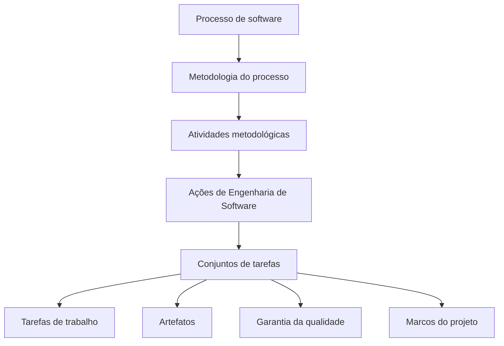
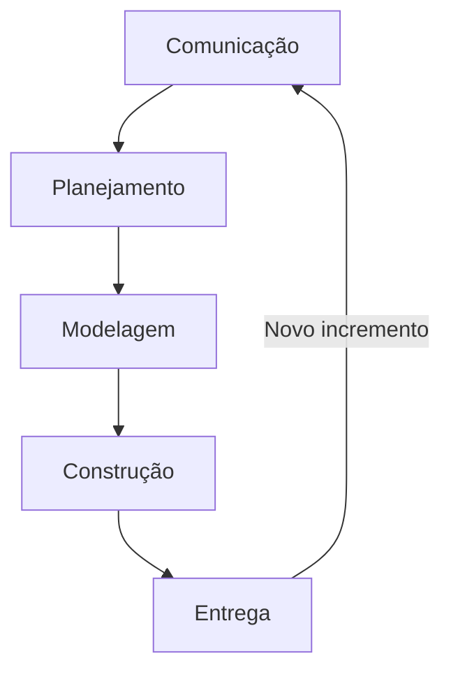
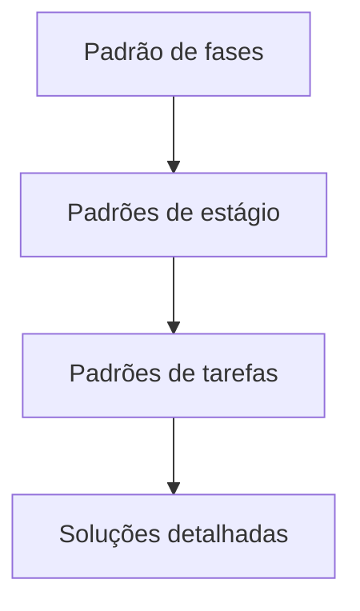
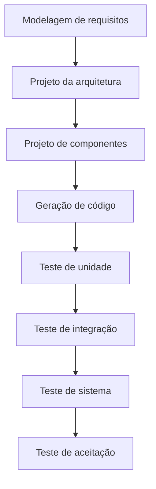
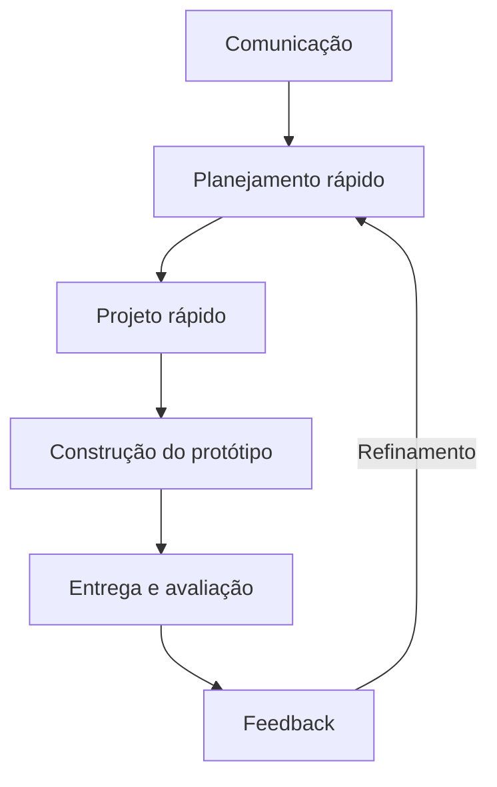
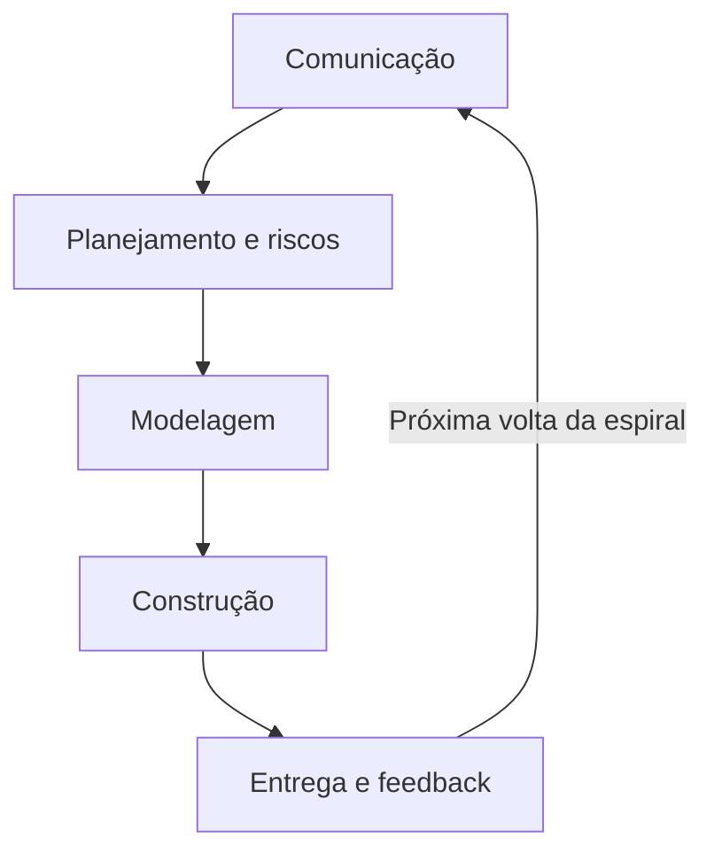
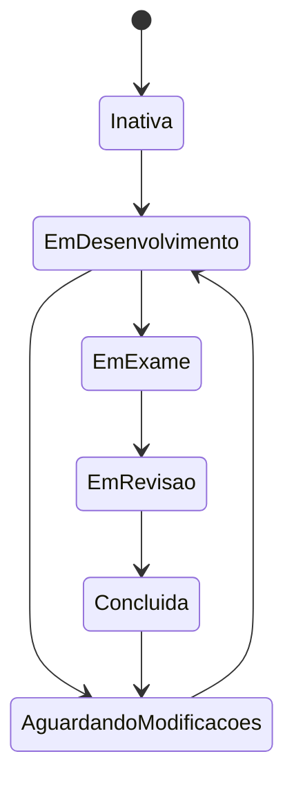

# Estrutura e Modelos do Processo de Software

## Introdução

> [!info] Visão geral
> Os capítulos 3 e 4 aprofundam a estrutura do processo de software apresentada na aula e explicam como diferentes modelos organizam as atividades de desenvolvimento.

O desenvolvimento de software é apresentado como um **processo social e iterativo de aprendizagem**. Durante o projeto, conhecimentos inicialmente dispersos, implícitos ou incompletos são coletados por meio da interação entre usuários, desenvolvedores e tecnologias. Esses conhecimentos são progressivamente organizados e incorporados ao produto.

Do ponto de vista técnico, o processo de software é uma metodologia que reúne as atividades, ações e tarefas necessárias para desenvolver software de alta qualidade. Ele proporciona estabilidade, controle e organização a uma atividade que poderia se tornar caótica. Entretanto, deve ser adaptável: um processo moderno não deve impor atividades, controles ou documentos que não sejam apropriados ao projeto e à equipe.

---

# Capítulo 3 — Estrutura do Processo de Software

## 1. Processo de software e Engenharia de Software

> [!info] Conceito
> O processo define como o software será desenvolvido, enquanto a Engenharia de Software também inclui pessoas, métodos técnicos e ferramentas.

Um **processo de software** é um conjunto organizado de atividades de trabalho, ações e tarefas executadas para criar artefatos de software. Esses artefatos incluem programas, documentos, modelos e dados produzidos ao longo do desenvolvimento.

Processo de software e Engenharia de Software são conceitos relacionados, mas não totalmente equivalentes. O processo define a ==abordagem adotada para desenvolver o produto==. A Engenharia de Software, por sua vez, também abrange:

- métodos técnicos;
- ferramentas automatizadas;
- tecnologias de desenvolvimento;
- profissionais responsáveis pelo trabalho.

As pessoas continuam sendo fundamentais, pois devem adaptar o processo às características do produto, às necessidades do mercado, aos riscos e à realidade da equipe.

> [!tip] Resumindo
> O processo fornece o roteiro; os métodos e as ferramentas oferecem os meios técnicos; e as pessoas adaptam e executam o trabalho.

---

## 2. Modelo genérico de processo

> [!info] Conceito
> O modelo genérico organiza o processo em atividades metodológicas, ações de Engenharia de Software e conjuntos de tarefas.

A estrutura de trabalho do processo de software possui diferentes níveis. No nível mais amplo estão as **atividades metodológicas**. Cada atividade contém ações de Engenharia de Software, e cada ação é realizada por meio de um conjunto de tarefas.

Um conjunto de tarefas pode definir:

- tarefas de trabalho que devem ser executadas;
- artefatos que serão produzidos;
- fatores de garantia da qualidade;
- marcos usados para indicar o progresso do projeto.

A metodologia genérica apresentada no livro contém cinco atividades:

1. **Comunicação:** entendimento das necessidades e interação com os envolvidos.
2. **Planejamento:** definição de estimativas, recursos, riscos, cronograma e acompanhamento.
3. **Modelagem:** análise dos requisitos e projeto da solução.
4. **Construção:** codificação e testes.
5. **Entrega:** disponibilização, suporte e obtenção de feedback.

Além delas, existem atividades de apoio aplicadas durante todo o processo, como acompanhamento e controle, administração de riscos, garantia da qualidade, gerenciamento de configurações e revisões técnicas.

> [!warning] Atenção
> As cinco atividades não precisam ocorrer uma única vez nem obrigatoriamente em uma sequência rígida. Sua organização depende do fluxo de processo adotado.

---

## 3. Fluxos de processo

> [!info] Conceito
> Fluxo de processo é a forma como as atividades, ações e tarefas são organizadas em relação à sequência e ao tempo.

O capítulo apresenta quatro tipos gerais de fluxo:

### Fluxo linear

As atividades são executadas sequencialmente. O processo começa pela comunicação e avança até a entrega.

Esse fluxo é mais adequado quando existe previsibilidade e os requisitos são relativamente estáveis.

### Fluxo iterativo

Uma ou mais atividades são repetidas antes que o processo avance. A repetição permite revisar o trabalho e incorporar conhecimentos adquiridos durante o desenvolvimento.

### Fluxo evolucionário

As atividades são realizadas de maneira circular. Cada passagem pelo ciclo gera uma versão mais completa do software.

### Fluxo paralelo

Uma ou mais atividades ocorrem simultaneamente. A modelagem de uma parte do sistema, por exemplo, pode ser realizada enquanto outra parte está sendo construída.

> [!tip] Resumindo
> O fluxo linear prioriza sequência; o iterativo permite repetição; o evolucionário gera versões sucessivas; e o paralelo possibilita atividades simultâneas.

---

## 4. Definição das atividades metodológicas

> [!info] Conceito
> Uma mesma atividade deve ser adaptada ao tamanho, à complexidade, às pessoas e às necessidades do projeto.

Conhecer apenas as cinco atividades genéricas não é suficiente. A equipe precisa determinar quais ações e tarefas são adequadas às condições específicas do trabalho.

Em um projeto pequeno, solicitado por uma única pessoa e com requisitos simples, a comunicação pode envolver apenas:

1. contatar o interessado;
2. discutir os requisitos e fazer anotações;
3. transformar as anotações em uma relação resumida de requisitos;
4. enviar o documento para revisão e aprovação.

Em um projeto complexo, com muitos envolvidos e requisitos possivelmente conflitantes, a comunicação pode conter ações de:

- concepção;
- levantamento;
- elaboração;
- negociação;
- especificação;
- validação.

Cada uma dessas ações pode incluir diversas tarefas e produzir vários artefatos.

> [!warning] Atenção
> Aplicar o mesmo nível de formalidade a todos os projetos pode gerar dois problemas: um processo insuficiente para projetos complexos ou burocracia desnecessária em projetos simples.

---

## 5. Identificação dos conjuntos de tarefas

> [!info] Conceito
> Um conjunto de tarefas define o trabalho necessário para alcançar o objetivo de determinada ação de Engenharia de Software.

Uma ação, como o levantamento de requisitos, pode ser executada por conjuntos de tarefas diferentes. A escolha deve considerar:

- tamanho e complexidade do projeto;
- quantidade de envolvidos;
- experiência da equipe;
- grau de incerteza;
- necessidade de documentação;
- riscos existentes.

Em um projeto simples, o levantamento pode consistir em reunir os envolvidos, solicitar as funcionalidades desejadas, discutir as necessidades, organizar os requisitos por prioridade e identificar incertezas.

Em projetos maiores, pode ser necessário entrevistar os envolvidos separadamente, realizar reuniões facilitadas, elaborar cenários de uso, analisar feedback, priorizar requisitos, agrupá-los em incrementos, registrar restrições e definir métodos de validação.

Os dois conjuntos podem alcançar o mesmo objetivo, mas apresentam níveis diferentes de profundidade e formalidade.

> [!tip] Resumindo
> A equipe deve escolher tarefas suficientes para alcançar o objetivo e preservar a qualidade, sem comprometer a agilidade.

---

## 6. Padrões de processo

> [!info] Conceito
> Um padrão de processo descreve um problema recorrente do desenvolvimento e apresenta uma ou mais soluções comprovadas.

Durante o desenvolvimento, as equipes encontram problemas que podem já ter ocorrido em outros projetos. Os **padrões de processo** permitem registrar e reutilizar soluções para essas situações.

Um padrão identifica:

- o problema;
- o ambiente no qual ele ocorre;
- as condições existentes;
- uma solução comprovada;
- o resultado esperado.

Os padrões podem ser combinados como blocos de construção para criar um processo personalizado.

### Tipos de padrão

| Tipo | Finalidade | Exemplo |
|---|---|---|
| Padrão de estágio | Trata um problema relacionado a uma atividade metodológica completa | Estabelecimento da comunicação |
| Padrão de tarefas | Trata um problema relacionado a uma ação ou tarefa específica | Levantamento de requisitos |
| Padrão de fases | Define a sequência das atividades do processo | Prototipação ou modelo espiral |

Os padrões formam uma estrutura hierárquica: um padrão de fases pode conter padrões de estágio, e cada padrão de estágio pode ser detalhado por padrões de tarefas.

---

## 7. Estrutura de um padrão de processo

> [!info] Conceito
> A descrição padronizada permite registrar uma solução de forma compreensível e reutilizável.

O modelo apresentado para descrever um padrão contém:

- **Nome do padrão:** identifica o padrão de forma significativa.
- **Intuito:** apresenta seu objetivo.
- **Forças:** descreve o ambiente e as questões que influenciam o problema e sua solução.
- **Tipo:** classifica o padrão como padrão de estágio, tarefas ou fases.
- **Contexto inicial:** indica as condições que precisam existir antes de sua aplicação.
- **Problema:** define aquilo que deve ser resolvido.
- **Solução:** explica como implementar o padrão.
- **Contexto resultante:** descreve o estado esperado após sua execução.
- **Padrões relacionados:** apresenta outros padrões associados.
- **Usos conhecidos e exemplos:** registra situações nas quais o padrão pode ser aplicado.

O capítulo apresenta como exemplo o padrão **RequisitosImprecisos**. Ele se aplica quando os envolvidos reconhecem o problema, mas não conseguem detalhar o software necessário. A solução é desenvolver iterativamente um protótipo para esclarecer os requisitos. Depois disso, o protótipo pode evoluir até se tornar o sistema final ou ser descartado para que o software definitivo seja construído com outro processo.

> [!tip] Resumindo
> Padrões preservam experiências úteis e ajudam a equipe a construir processos adequados a problemas recorrentes.

---

## 8. Avaliação e aperfeiçoamento de processos

> [!info] Conceito
> A avaliação procura compreender a situação atual do processo para identificar oportunidades de aperfeiçoamento.

A simples existência de um processo não garante:

- entrega dentro do prazo;
- atendimento às necessidades do cliente;
- qualidade técnica;
- viabilidade do produto em longo prazo.

O processo deve ser combinado com práticas confiáveis de Engenharia de Software e avaliado de acordo com critérios reconhecidos.

O capítulo menciona as seguintes abordagens:

### SCAMPI

O **Standard CMMI Assessment Method for Process Improvement** utiliza o CMMI como base e apresenta cinco fases:

1. início;
2. diagnóstico;
3. estabelecimento;
4. atuação;
5. aprendizado.

### CBA IPI

A **CMM-Based Appraisal for Internal Process Improvement** é uma técnica de diagnóstico que avalia a maturidade relativa da organização com base na CMM.

### SPICE

O **SPICE**, relacionado à ISO/IEC 15504, estabelece requisitos para avaliar objetivamente a eficácia de processos de software.

### ISO 9001:2000 para software

É um padrão genérico destinado a organizações que pretendem melhorar a qualidade global dos produtos, sistemas ou serviços fornecidos. Pode ser aplicado às organizações de software.

> [!warning] Atenção
> Maturidade do processo é importante, mas os melhores indicadores de eficácia continuam sendo a qualidade do produto, o cumprimento dos prazos e sua viabilidade em longo prazo.

---

# Capítulo 4 — Modelos de Processo

## 9. Finalidade dos modelos de processo

> [!info] Conceito
> Um modelo de processo fornece um guia específico para organizar as atividades, ações, tarefas, artefatos, iterações e controles do desenvolvimento.

Os modelos de processo foram criados para trazer ordem ao desenvolvimento de software. Eles contribuem para estruturar o trabalho, mas devem encontrar um equilíbrio entre dois extremos:

- **ordem excessiva**, que pode impedir adaptações;
- **caos excessivo**, que dificulta a coordenação e a coerência.

Todos os modelos podem incluir as cinco atividades genéricas — comunicação, planejamento, modelagem, construção e entrega —, mas cada um determina uma forma diferente de relacioná-las.

> [!tip] Resumindo
> O melhor modelo não é necessariamente o mais rígido ou o mais flexível, mas aquele que organiza o trabalho sem impedir mudanças necessárias.

---

## 10. Modelos de processo prescritivo

> [!info] Conceito
> Modelos prescritivos definem previamente os elementos do processo e o fluxo de trabalho esperado.

Os modelos prescritivos, também chamados de tradicionais, procuram estruturar e ordenar o desenvolvimento. Eles prescrevem:

- atividades metodológicas;
- ações;
- tarefas;
- artefatos;
- garantia da qualidade;
- mecanismos de controle de mudanças;
- fluxo do processo.

Esses modelos favorecem a consistência e a previsibilidade. Entretanto, sua aplicação precisa considerar que o desenvolvimento moderno está sujeito a mudanças frequentes.

---

## 11. Modelo cascata

> [!info] Conceito
> O modelo cascata organiza o desenvolvimento de maneira predominantemente sequencial e sistemática.

O modelo cascata, também chamado de **ciclo de vida clássico**, começa pela especificação das necessidades do cliente e avança por:

1. comunicação;
2. planejamento;
3. modelagem;
4. construção;
5. entrega e suporte.

Ele é mais adequado quando os requisitos estão bem definidos, são estáveis e o trabalho pode ser executado linearmente. Pode ser útil, por exemplo, em adaptações bem delimitadas de um sistema existente.

### Limitações do modelo cascata

O capítulo destaca três dificuldades principais:

1. Projetos reais raramente seguem um fluxo totalmente sequencial.
2. O cliente frequentemente não consegue definir antecipadamente todas as necessidades.
3. Uma versão operacional somente aparece perto do final, podendo atrasar a descoberta de erros importantes.

Também podem ocorrer **estados de bloqueio**, nos quais integrantes da equipe precisam aguardar a conclusão de tarefas dependentes. Em alguns casos, o tempo de espera pode superar o tempo produtivo.

> [!warning] Atenção
> O modelo cascata não é inútil, mas tende a ser inadequado quando existem mudanças contínuas, incerteza significativa ou necessidade de entregas rápidas.

---

## 12. Modelo V

> [!info] Conceito
> O modelo V evidencia a relação entre as atividades de especificação e projeto e os testes que verificam e validam seus resultados.

No lado esquerdo do V, os requisitos são progressivamente refinados até se transformarem em representações técnicas e código. No lado direito, são realizados testes correspondentes aos modelos produzidos anteriormente.

| Desenvolvimento | Verificação e validação correspondente |
|---|---|
| Modelagem de requisitos | Teste de aceitação |
| Projeto da arquitetura | Teste de sistema |
| Projeto de componentes | Teste de integração |
| Geração de código | Teste de unidade |

O modelo V não é fundamentalmente diferente do cascata. Sua principal contribuição é tornar mais visível a associação entre cada produto da engenharia e sua respectiva atividade de teste.

---

## 13. Modelo incremental

> [!info] Conceito
> O modelo incremental entrega o software em versões sucessivas, cada uma contendo mais funcionalidades.

Esse modelo é apropriado quando os requisitos básicos estão razoavelmente definidos, mas o sistema completo não precisa ou não pode ser entregue de uma só vez.

Cada sequência de desenvolvimento produz um **incremento entregável**. O primeiro costuma representar o produto essencial, com as funções básicas. Após sua utilização e avaliação, o feedback do cliente orienta o planejamento do próximo incremento.

O modelo combina características dos fluxos linear e paralelo. Cada incremento pode seguir internamente uma sequência de comunicação, planejamento, modelagem, construção e entrega, enquanto diferentes atividades e preparações se sobrepõem ao longo do cronograma.

### Vantagens

- disponibiliza rapidamente uma versão funcional;
- permite priorizar recursos essenciais;
- incorpora feedback entre as entregas;
- reduz o tempo até o usuário receber algum valor;
- possibilita ajustar os incrementos posteriores.

> [!tip] Resumindo
> O desenvolvimento incremental não entrega partes desconectadas: cada incremento deve ser uma versão operacional que amplia a funcionalidade disponível.

---

## 14. Modelos evolucionários

> [!info] Conceito
> Modelos evolucionários produzem versões progressivamente mais completas do software e aceitam que os requisitos mudem durante o projeto.

Sistemas complexos evoluem com o tempo. Requisitos de negócio, funcionalidades e expectativas dos usuários podem mudar durante o desenvolvimento. Além disso, pressões comerciais podem exigir que uma versão limitada seja disponibilizada antes que o produto completo esteja pronto.

Os modelos evolucionários são iterativos e foram criados para lidar com essas condições. Os dois modelos principais apresentados são a prototipação e o modelo espiral.

---

## 15. Prototipação

> [!info] Conceito
> A prototipação cria uma representação preliminar do sistema para compreender melhor requisitos ainda vagos ou incertos.

A prototipação é indicada quando:

- o cliente possui objetivos gerais, mas não consegue detalhar os requisitos;
- o desenvolvedor tem dúvidas sobre um algoritmo;
- há incerteza sobre a adaptação ao ambiente operacional;
- a interação entre usuário e sistema ainda precisa ser definida.

O processo começa com a comunicação. Em seguida, realiza-se um planejamento rápido e um projeto concentrado nos aspectos visíveis ao usuário. O protótipo é construído, entregue e avaliado. O feedback obtido refina os requisitos e orienta uma nova iteração.

O protótipo pode ser:

- descartado após cumprir sua finalidade de esclarecer os requisitos;
- aproveitado parcialmente;
- evoluído até se transformar no produto operacional.

### Riscos da prototipação

O cliente pode considerar o protótipo como produto final, sem perceber que ele foi construído rapidamente e talvez não possua qualidade interna suficiente. O desenvolvedor também pode conservar decisões inadequadas adotadas apenas para acelerar sua construção, como linguagens, algoritmos ou estruturas impróprias.

> [!warning] Atenção
> As regras devem ser definidas no início. Se o protótipo for descartável, todos precisam compreender que o produto final será posteriormente construído com arquitetura e qualidade adequadas.

---

## 16. Modelo espiral

> [!info] Conceito
> O modelo espiral combina a natureza iterativa da prototipação com o controle sistemático do cascata, mantendo o foco na identificação e redução de riscos.

Proposto originalmente por Barry Boehm, o modelo espiral desenvolve o software por meio de ciclos. Cada volta produz um resultado mais completo e reduz parte da incerteza existente.

As atividades podem incluir:

- comunicação;
- planejamento;
- análise de riscos;
- modelagem;
- construção;
- entrega e feedback.

Nas primeiras iterações, o produto pode ser apenas um modelo ou protótipo. Nas iterações posteriores, surgem versões cada vez mais completas.

A cada passagem, o planejamento é revisto. Custos, cronograma e quantidade de iterações são ajustados com base nos riscos e no feedback dos envolvidos.

### Vantagens

- adequação a sistemas complexos e de grande escala;
- avaliação explícita dos riscos;
- uso da prototipação para reduzir incertezas;
- adaptação durante todo o ciclo de vida;
- incorporação progressiva de funcionalidades.

### Limitações

- exige experiência na identificação e avaliação de riscos;
- pode ser difícil demonstrar seu controle ao cliente;
- custos e cronogramas podem precisar de revisões sucessivas;
- riscos importantes não identificados podem comprometer o projeto.

O modelo pode acompanhar o software desde o desenvolvimento do conceito até sua manutenção e retirada de operação.

---

## 17. Modelo concorrente

> [!info] Conceito
> O modelo concorrente representa atividades que existem simultaneamente, mas podem se encontrar em diferentes estados.

Em vez de obrigar todas as atividades a seguir uma sequência única, o modelo concorrente define uma rede de processos. Cada atividade, ação ou tarefa pode estar em um estado, como:

- inativa;
- em desenvolvimento;
- aguardando modificações;
- em exame;
- em revisão;
- concluída.

Eventos provocam transições entre os estados. Uma alteração solicitada pelo cliente, por exemplo, pode fazer uma atividade que estava concluída voltar ao estado de aguardando modificações.

Esse modelo fornece uma visão mais precisa do estado atual do projeto e é particularmente útil quando diferentes equipes trabalham paralelamente em diferentes partes de um produto.

---

## 18. Limitações dos processos evolucionários

> [!info] Conceito
> A flexibilidade dos modelos evolucionários precisa ser equilibrada com planejamento, controle e qualidade.

Apesar das vantagens, os modelos evolucionários apresentam preocupações:

1. O número de ciclos necessários pode ser difícil de prever.
2. Uma evolução rápida demais pode conduzir ao caos.
3. Uma evolução lenta demais pode reduzir a produtividade.
4. A busca por velocidade, flexibilidade e extensibilidade pode prejudicar a qualidade.

O objetivo deve continuar sendo o desenvolvimento iterativo ou incremental de software de alta qualidade. A equipe e os gestores devem equilibrar:

- velocidade;
- flexibilidade;
- extensibilidade;
- qualidade;
- satisfação do cliente.

> [!warning] Atenção
> Iterar não significa modificar indefinidamente sem controle. Cada ciclo precisa produzir aprendizado, valor ou redução de riscos.

---

## 19. Modelos de processo especializado

> [!info] Conceito
> Modelos especializados adaptam características dos modelos tradicionais a abordagens técnicas específicas.

Esses modelos são utilizados quando o projeto emprega uma estratégia de Engenharia de Software especializada ou de aplicação mais restrita.

### Desenvolvimento baseado em componentes

O desenvolvimento baseado em componentes utiliza componentes existentes, inclusive componentes comerciais de prateleira, que oferecem funcionalidades e interfaces bem definidas.

O processo é evolucionário e iterativo. A equipe procura componentes que atendam aos requisitos, avalia sua adequação e os integra ao sistema. A reutilização pode reduzir o tempo e o custo do desenvolvimento, mas depende da existência de componentes compatíveis, confiáveis e integráveis.

### Modelo de métodos formais

Os métodos formais utilizam especificações matemáticas para representar o software. Eles permitem analisar e, em determinados casos, demonstrar propriedades como consistência, correção e ausência de certos defeitos.

Podem ser úteis em sistemas críticos, nos quais falhas provocariam consequências graves. Entretanto, apresentam limitações:

- desenvolvimento caro e demorado;
- necessidade de profissionais especializados;
- dificuldade de comunicação com clientes sem formação técnica;
- pouca adoção como abordagem de uso geral.

### Desenvolvimento de software orientado a aspectos

O desenvolvimento orientado a aspectos trata **preocupações transversais**, isto é, características que afetam várias partes do sistema, como:

- segurança;
- tolerância a falhas;
- sincronização;
- gerenciamento de memória;
- aplicação de regras de negócio.

Essas preocupações são representadas como aspectos para evitar que fiquem dispersas por diversos componentes. A abordagem pode combinar características evolucionárias e concorrentes.

---

## 20. Processo Unificado

> [!info] Conceito
> O Processo Unificado é dirigido por casos de uso, centrado na arquitetura, iterativo e incremental.

O Processo Unificado procura aproveitar características dos modelos tradicionais e incorporar princípios adequados ao desenvolvimento moderno. Ele enfatiza:

- comunicação com o cliente;
- casos de uso;
- arquitetura;
- desenvolvimento iterativo;
- entregas incrementais.

Um **caso de uso** descreve uma função do sistema do ponto de vista do usuário. Ele ajuda a representar as necessidades e serve como base para a análise, o projeto e os testes.

A arquitetura organiza os principais componentes do sistema e procura favorecer a compreensão, a reutilização e futuras mudanças.

> [!warning] Atenção
> UML e Processo Unificado não são a mesma coisa. A UML é uma linguagem de modelagem; o Processo Unificado é um processo de desenvolvimento que pode utilizar a UML para representar seus modelos.

---

## 21. Fases do Processo Unificado

> [!info] Conceito
> O Processo Unificado distribui o desenvolvimento pelas fases de concepção, elaboração, construção, transição e produção.

### Concepção

Compreende principalmente comunicação e planejamento. Nessa fase:

- identificam-se as necessidades de negócio;
- elaboram-se casos de uso preliminares;
- propõe-se uma arquitetura inicial;
- identificam-se recursos;
- avaliam-se os riscos principais;
- define-se um cronograma.

### Elaboração

Refina os casos de uso e amplia a arquitetura. Podem ser desenvolvidas diferentes visões do sistema:

- modelo de casos de uso;
- modelo de análise;
- modelo de projeto;
- modelo de implementação;
- modelo de disponibilização.

A elaboração pode produzir uma base arquitetural executável para demonstrar a viabilidade da arquitetura. Essa base não é necessariamente descartável: ela pode ser ampliada durante a construção.

### Construção

Os componentes são desenvolvidos ou adquiridos, integrados e testados. Os modelos de análise e projeto são concluídos, as funcionalidades do incremento são implementadas e os casos de uso orientam os testes de aceitação.

### Transição

O software é entregue aos usuários para testes beta. O feedback revela defeitos e mudanças necessárias. Também são preparados:

- manuais;
- procedimentos de instalação;
- guias de solução de problemas;
- informações de suporte.

Ao final, o incremento transforma-se em uma versão utilizável.

### Produção

O uso contínuo do software é monitorado. A equipe fornece suporte ao ambiente operacional e avalia relatos de defeitos e solicitações de mudança.

As fases podem ocorrer de forma concomitante e escalonada. Enquanto um incremento está em produção, o seguinte pode já estar em construção ou elaboração.

> [!tip] Resumindo
> O Processo Unificado não trata as fases como etapas estritamente isoladas: os fluxos de trabalho atravessam as fases com diferentes intensidades.

---

## 22. Processo de Software Pessoal — PSP

> [!info] Conceito
> O PSP é um processo disciplinado e baseado em métricas para aperfeiçoar o trabalho individual do desenvolvedor.

Todo desenvolvedor utiliza algum processo pessoal, mesmo que ele não esteja claramente definido. O **Personal Software Process — PSP** torna esse processo explícito e mensurável.

O PSP responsabiliza o profissional por:

- planejar o trabalho;
- estimar tamanho, recursos, custos e cronograma;
- medir os artefatos produzidos;
- acompanhar os defeitos;
- avaliar e controlar a qualidade.

Suas atividades são:

1. **Planejamento:** identificação de requisitos, estimativas, tarefas e cronograma.
2. **Projeto de alto nível:** elaboração das especificações e do projeto dos componentes.
3. **Revisão do projeto de alto nível:** aplicação de técnicas de verificação para encontrar erros.
4. **Desenvolvimento:** refinamento do projeto, codificação, revisão, compilação e testes.
5. **Autópsia:** análise das métricas para avaliar e aperfeiçoar o processo.

O PSP enfatiza a identificação precoce dos defeitos e a compreensão dos tipos de erro que o profissional costuma cometer.

Embora possa melhorar a produtividade e a qualidade, exige treinamento, disciplina, comprometimento e coleta rigorosa de métricas, fatores que dificultaram sua ampla adoção.

---

## 23. Processo de Software de Equipe — TSP

> [!info] Conceito
> O TSP amplia os princípios do PSP para formar equipes autodirigidas e orientadas por qualidade e métricas.

O **Team Software Process — TSP** procura criar equipes capazes de:

- planejar e acompanhar o próprio trabalho;
- estabelecer metas;
- definir papéis e responsabilidades;
- controlar cronogramas;
- avaliar continuamente os riscos;
- medir produtividade e qualidade;
- aperfeiçoar o processo.

Uma equipe autodirigida compreende os objetivos do projeto, seleciona o processo adequado, estabelece padrões locais e acompanha quantitativamente seu desempenho.

As principais atividades do TSP são:

1. lançamento do projeto;
2. projeto de alto nível;
3. implementação;
4. integração e testes;
5. autópsia.

O processo utiliza roteiros, formulários e padrões para orientar atividades gerais e tarefas detalhadas, como planejamento, requisitos, gerenciamento de configurações e testes de unidade.

> [!warning] Atenção
> Assim como o PSP, o TSP exige compromisso integral da equipe e treinamento adequado para produzir benefícios consistentes.

---

## 24. Tecnologia de processos

> [!info] Conceito
> Ferramentas de tecnologia de processos ajudam a representar, analisar, acompanhar e controlar o processo de software.

Essas ferramentas permitem construir modelos automatizados das:

- atividades metodológicas;
- ações;
- tarefas;
- atividades de apoio;
- relações do fluxo de trabalho.

Depois de modelado, o processo pode ser analisado para identificar alternativas capazes de reduzir custos e prazos.

As ferramentas também podem:

- distribuir tarefas;
- acompanhar o progresso;
- controlar atividades;
- relacionar responsáveis e artefatos;
- registrar pontos de garantia da qualidade;
- coordenar outras ferramentas de Engenharia de Software;
- apoiar estimativas, cronogramas e controle do projeto.

> [!tip] Resumindo
> A tecnologia de processos não substitui o julgamento da equipe, mas facilita a compreensão e a gestão do fluxo de trabalho.

---

## 25. Dualidade entre produto e processo

> [!info] Conceito
> Produto e processo não devem ser vistos como conceitos opostos, mas como dimensões inseparáveis do desenvolvimento de software.

Um processo fraco pode prejudicar o produto final. Entretanto, confiar excessivamente no processo também pode desviar a atenção do valor e da qualidade do produto.

O desenvolvimento gera artefatos que são simultaneamente:

- produtos de uma atividade concluída;
- entradas para atividades posteriores;
- resultados potencialmente reutilizáveis.

A Engenharia de Software alternou historicamente o foco entre tecnologias do produto e métodos do processo. O capítulo argumenta que nenhum dos lados, isoladamente, explica completamente o desenvolvimento.

Os profissionais podem obter satisfação tanto do processo criativo quanto do resultado final. Manter essa dualidade ajuda a preservar o envolvimento das pessoas e favorece a reutilização dos conhecimentos e dos artefatos.

---

## 26. Comparação dos principais modelos

> [!info] Conceito
> Cada modelo atende melhor a determinadas condições; por isso, a escolha deve considerar requisitos, riscos, prazos, complexidade e necessidade de mudanças.

| Modelo | Característica central | Mais adequado quando | Principal limitação |
|---|---|---|---|
| Cascata | Sequência linear | Requisitos definidos e estáveis | Dificuldade para absorver mudanças |
| Modelo V | Relação entre desenvolvimento e testes | Verificação e validação precisam ser claramente planejadas | Mantém a natureza predominantemente sequencial |
| Incremental | Entregas funcionais sucessivas | É necessário entregar valor rapidamente | Exige planejamento adequado dos incrementos |
| Prototipação | Esclarecimento de requisitos | Requisitos estão vagos ou incertos | Protótipo pode ser confundido com o produto final |
| Espiral | Iterações orientadas a riscos | Sistemas grandes, complexos e arriscados | Exige experiência em análise de riscos |
| Concorrente | Atividades simultâneas em estados diferentes | Várias equipes ou atividades trabalham paralelamente | Controle da rede de estados pode ser complexo |
| Baseado em componentes | Integração e reutilização | Existem componentes adequados e disponíveis | Dependência da compatibilidade dos componentes |
| Métodos formais | Especificação matemática | Sistemas críticos exigem elevada correção | Alto custo e necessidade de especialistas |
| Processo Unificado | Casos de uso, arquitetura e incrementos | Sistemas complexos e orientados a objetos | Precisa ser adaptado para não se tornar excessivamente pesado |
| PSP | Disciplina e métricas individuais | Busca-se aperfeiçoamento pessoal mensurável | Elevado esforço de medição e treinamento |
| TSP | Equipes autodirigidas e métricas | Equipes comprometidas com melhoria quantitativa | Requer treinamento e forte adesão coletiva |

---

# Síntese final

> [!summary] Síntese
> Um processo eficaz fornece organização e controle, mas deve ser adaptado ao projeto, às pessoas e ao produto, preservando a capacidade de responder às mudanças.

O capítulo 3 apresenta a estrutura fundamental do processo de software. Atividades metodológicas contêm ações, que são realizadas por conjuntos de tarefas e produzem artefatos, controles de qualidade e marcos. As cinco atividades genéricas — comunicação, planejamento, modelagem, construção e entrega — podem ser organizadas em fluxos lineares, iterativos, evolucionários ou paralelos.

Os conjuntos de tarefas devem variar conforme o tamanho e a complexidade do projeto. Padrões de processo permitem reutilizar soluções para problemas recorrentes, enquanto métodos de avaliação procuram diagnosticar e aperfeiçoar a maturidade e a eficácia dos processos.

O capítulo 4 demonstra que diferentes modelos organizam as mesmas atividades de maneiras distintas. Cascata e modelo V favorecem a sequência e a previsibilidade; o incremental produz versões operacionais sucessivas; prototipação e espiral acomodam incerteza e evolução; e o modelo concorrente representa atividades simultâneas.

Modelos especializados atendem a contextos particulares, como reutilização de componentes, métodos formais e orientação a aspectos. O Processo Unificado combina casos de uso, arquitetura, iterações e incrementos. PSP e TSP aplicam disciplina, métricas e aperfeiçoamento ao trabalho individual e coletivo.

Em continuidade à aula, os capítulos demonstram que o ciclo de vida não é uma simples lista fixa de fases. Ele é uma estrutura adaptável na qual atividades recebem entradas, executam tarefas, produzem artefatos e fornecem resultados para as etapas ou iterações seguintes. A escolha do modelo deve equilibrar ordem e flexibilidade, processo e produto, velocidade e qualidade.