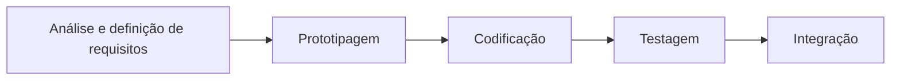
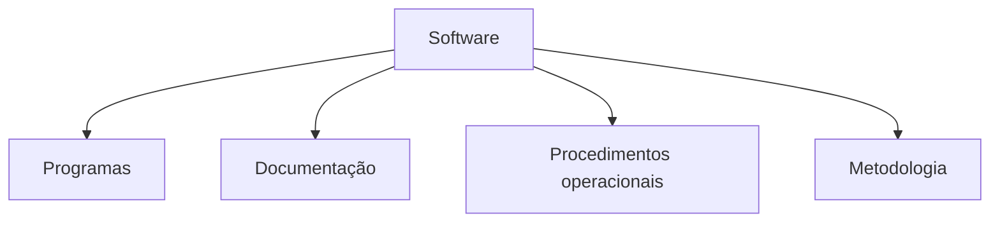
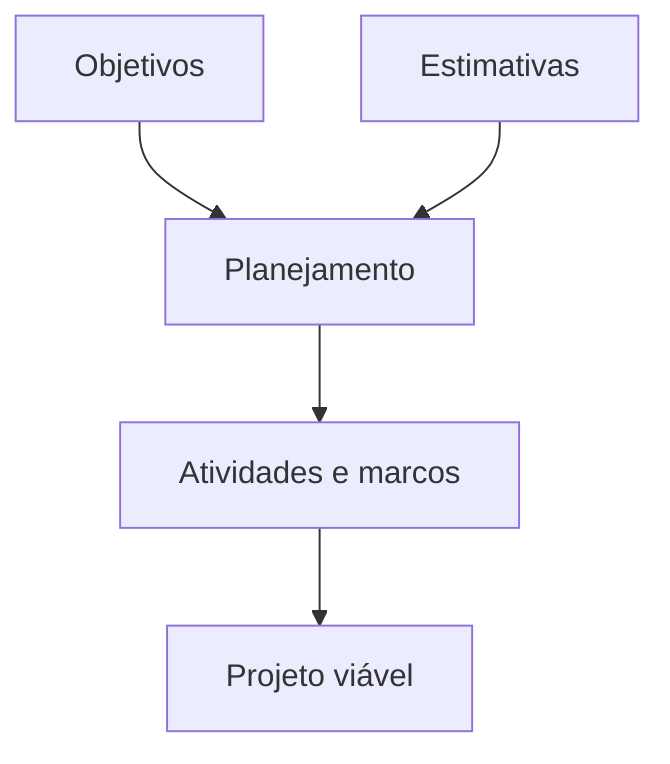
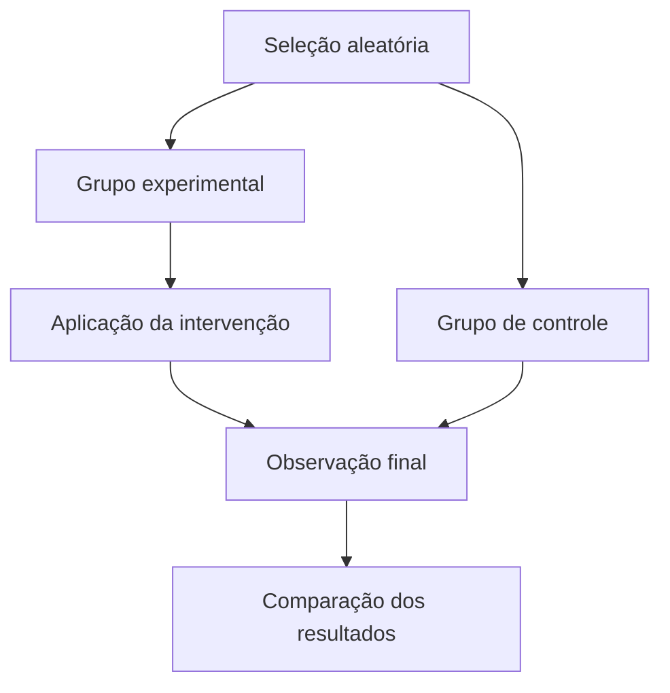

# Introdução à Engenharia de Software

## Visão geral

> [!info] Conceito
> A engenharia de software aplica princípios, métodos, técnicas e ferramentas ao desenvolvimento, à operação e à manutenção de software.

A engenharia de software surgiu da necessidade de tornar o desenvolvimento de sistemas mais organizado, previsível, econômico e confiável. Sua atuação abrange todo o ciclo de vida do software, desde a identificação das necessidades do cliente até a descontinuação do sistema.

A unidade estudada está organizada em quatro eixos principais:

1. histórico da engenharia de software;
2. conceitos e importância;
3. princípios de desenvolvimento;
4. áreas de conhecimento relacionadas ao desenvolvimento de software.

---

## Histórico da Engenharia de Software

> [!info] Crise do software
> A crise do software revelou que sistemas complexos não poderiam ser desenvolvidos adequadamente sem processos, documentação, testes e métodos bem definidos.

A engenharia de software consolidou-se no contexto da chamada **crise do software**, ocorrida principalmente a partir das décadas de 1960 e 1970. À medida que os computadores se tornaram mais acessíveis e os sistemas mais complexos, aumentaram os problemas relacionados à ==ausência de padronização, metodologias, documentação, rastreabilidade e técnicas de teste==.

A Association for Computing Machinery associou a crise a problemas recorrentes nos projetos:

- descumprimento de prazos;
- custos superiores aos orçamentos previstos;
- requisitos ausentes, incompletos ou não atendidos;
- códigos confusos e difíceis de manter;
- baixa qualidade dos produtos desenvolvidos.

A solução exigia a adoção de métodos, técnicas, ferramentas especializadas e treinamento das pessoas envolvidas no desenvolvimento. O objetivo era aumentar a produtividade, controlar custos e produzir sistemas mais confiáveis.

### Ciclo de vida do software

O **ciclo de vida do software** compreende os ==processos, atividades e tarefas== realizados ==desde a concepção do sistema até o encerramento de seu uso==. Embora as etapas possam variar conforme o modelo de desenvolvimento adotado, o material apresenta cinco atividades fundamentais:

- **Análise e definição de requisitos:** levantamento das necessidades, funcionalidades e restrições do sistema.
- **Prototipagem:** elaboração de modelos preliminares para representar e validar a solução.
- **Codificação:** implementação do sistema em uma linguagem de programação.
- **Testagem:** preparação do ambiente, identificação de falhas e verificação do comportamento do software.
- **Integração:** implantação, treinamento dos usuários e conexão do software com os demais sistemas.

> [!warning] Atenção
> Essas atividades não precisam ocorrer sempre de maneira estritamente linear. Elas podem ser repetidas, incrementadas ou adaptadas conforme o modelo de desenvolvimento.

### Questões para a evolução dos processos

Diante da diversidade tecnológica e da necessidade de melhorar os processos, Mafra e Travassos apresentam questões importantes:

- Em qual tecnologia investir?
- Como medir custos, tempo e esforço?
- Como calcular o retorno sobre o investimento?
- Em quais circunstâncias determinada tecnologia deve ser adotada?

Essas questões mostram que a engenharia de software não se limita à programação. Ela também envolve avaliação econômica, planejamento, gestão, seleção tecnológica e análise de riscos.

### Eixos históricos

O histórico da engenharia de software pode ser compreendido por quatro eixos:

1. **Profissionalização:** definição das funções, competências e responsabilidades dos profissionais.
2. **Participação das mulheres:** reconhecimento das contribuições femininas para a computação.
3. **Estrutura processual:** organização do desenvolvimento em fluxos, processos, atividades e tarefas.
4. **Custos de software e hardware:** medição do esforço, das funcionalidades e dos gastos de desenvolvimento e manutenção.

Grace Hopper contribuiu para os primeiros compiladores, para a concepção de linguagens independentes de máquina e para a criação do COBOL. Margaret Hamilton teve participação relevante na engenharia de software do MIT. Esses exemplos demonstram a importância histórica das mulheres na computação, apesar de a área ter sido considerada predominantemente masculina durante muito tempo.

Na dimensão processual, um **processo** pode representar tanto a divisão do desenvolvimento em grandes fases quanto estruturas codificadas em nível mais específico. Em ambos os casos, ==entradas, atividades e saídas precisam estar alinhadas às funcionalidades esperadas==.

Na dimensão econômica, medir o tamanho das funcionalidades acrescentadas ao sistema facilita a estimativa dos custos de manutenção. O gasto total pode aumentar enquanto o custo por unidade funcional diminui, caso o sistema cresça proporcionalmente mais que as despesas.

### Linha do tempo

Entre 1945 e 1965 surgiram o termo e as primeiras concepções da engenharia de software. Entre 1965 e 1985, a crise evidenciou a necessidade de métodos mais rigorosos. De 1985 a 1989, ganharam destaque os projetos de software, os processos definidos e a documentação detalhada. Na década de 1990, a Internet impulsionou sistemas conectados. A partir dos anos 2000, difundiram-se as metodologias ágeis, com maior atenção à produtividade, à colaboração e à adaptação.

> [!tip] Resumindo
> A engenharia de software nasceu para enfrentar problemas de **qualidade, prazo, custo e manutenção** provocados pelo crescimento da complexidade dos sistemas.

---

## Conceitos fundamentais

> [!info] Definição
> Engenharia de software é a aplicação ==sistemática, disciplinada e mensurável== de princípios de engenharia ao desenvolvimento, à operação e à manutenção de software.

### Software e engenharia

**Software** é o conjunto de componentes lógicos e instruções que processam dados e controlam o funcionamento dos computadores e sistemas. Inclui sistemas operacionais, aplicações e outros programas.

**Engenharia** é a área que emprega conhecimentos científicos, técnicos ou empíricos, juntamente com regras, métodos, técnicas e ferramentas, para construir soluções.

A combinação desses conceitos permite definir engenharia de software como o conjunto de ==métodos, técnicas e ferramentas== empregados no desenvolvimento, na gestão, na arquitetura, nos testes, na operação e na manutenção de software.

Para Pressman, trata-se de uma ==abordagem sistemática, disciplinada e quantificável==. Bauer acrescenta que seus princípios devem permitir a produção de software economicamente viável, confiável e eficiente em máquinas reais.

O profissional da área precisa dominar teorias, modelos e técnicas para analisar e desenvolver artefatos de qualidade. Também precisa compreender gerenciamento de projetos, objetivos conflitantes, questões organizacionais, trabalho em equipe, liderança, negociação e resolução de conflitos.

### Teoria, abstração e design

A relação entre ciência da computação e engenharia de software envolve três eixos, atravessados pelas estruturas de dados:

  <svg
    width="481"
    height="382"
    viewBox="0 0 481 382"
    xmlns="http://www.w3.org/2000/svg"
    font-family="Arial, sans-serif"
    preserveAspectRatio="xMidYMid meet"
    class="network-diagram"
    role="img"
    aria-label="Diagrama de Venn relacionando Ciência da Computação, Teoria, Abstração, Design e Estrutura de dados"
    style="
      display: block;
      width: 100%;
      height: auto;
      aspect-ratio: 481 / 382;
    "
  >
    <rect width="481" height="382" fill="transparent"/>
    <!-- ===== Título superior ===== -->
    <text x="240.5" y="28" text-anchor="middle" fill="#D6F0FB" font-size="18" font-weight="600">CIÊNCIA DA COMPUTAÇÃO</text>
    <!-- ===== Campos principais ===== -->
    <circle cx="168" cy="134" r="88" fill="#1A4A5E" fill-opacity="0.6" stroke="#7FCFF0" stroke-width="1.5" vector-effect="non-scaling-stroke"/>
    <circle cx="300" cy="134" r="88" fill="#1A4A5E" fill-opacity="0.6" stroke="#7FCFF0" stroke-width="1.5" vector-effect="non-scaling-stroke"/>
    <!-- ===== Campo secundário ===== -->
    <circle cx="229" cy="245" r="88" fill="#1A4A5E" fill-opacity="0.3" stroke="#7FCFF0" stroke-width="1.5" vector-effect="non-scaling-stroke"/>
    <!-- ===== Área central de conteúdo ===== -->
    <circle cx="234" cy="181" r="51" fill="#3C3489" fill-opacity="0.85" stroke="#A89CF5" stroke-width="1.5" vector-effect="non-scaling-stroke"/>
    <!-- ===== Rótulos principais ===== -->
    <text x="138" y="141" text-anchor="middle" fill="#eeeeee" font-size="20" font-weight="600">Teoria</text>
    <text x="329" y="136" text-anchor="middle" fill="#eeeeee" font-size="20" font-weight="600">Abstração</text>
    <text x="229" y="273" text-anchor="middle" fill="#eeeeee" font-size="20" font-weight="600">Design</text>
    <!-- ===== Rótulo central ===== -->
    <text x="234" y="178" text-anchor="middle" fill="#D6F0FB" font-size="15" font-weight="600">
      <tspan x="234" dy="0">Estrutura</tspan>
      <tspan x="234" dy="17">de dados</tspan>
    </text>
    <!-- ===== Título inferior ===== -->
    <text x="240.5" y="365" text-anchor="middle" fill="#D6F0FB" font-size="18" font-weight="600">ENGENHARIA DE SOFTWARE</text>
  </svg>

- **Teoria:** conceitos, axiomas, provas e interpretações que fundamentam as soluções.
- **Abstração:** modelos e simplificações utilizados para compreender problemas complexos.
- **Design:** requisitos, especificações, modelagem e testes que estruturam a solução.
- **Estruturas de dados:** mecanismos de organização dos dados para garantir seu processamento adequado.

A estrutura de dados relaciona os três eixos porque ==uma solução depende simultaneamente de fundamentos teóricos, modelos abstratos e decisões de projeto==.

### Diferença entre programa e software

Um **programa** é um conjunto de códigos, instruções e rotinas, escrito em determinada linguagem, que executa comandos no computador.

O **software** é mais abrangente. Além do código executável, inclui:

- documentação de concepção e estrutura;
- modelos de dados;
- explicações sobre funcionalidades;
- manuais e procedimentos operacionais;
- informações necessárias à manutenção;
- elementos que favorecem integração, adaptação e escalabilidade.

O software também sofre alterações ao longo do tempo devido às mudanças tecnológicas, às necessidades dos usuários e às condições externas. Portanto, deve ser pensado como um produto evolutivo.

> [!warning] Atenção
> Programa e software não são sinônimos perfeitos: o programa corresponde principalmente ao código executável, enquanto o software inclui também documentação, procedimentos e condições de evolução.

---

## Princípios de desenvolvimento de software

> [!info] Princípios
> Os princípios orientam as decisões técnicas e organizacionais durante todo o ciclo de vida do software.

A engenharia de software adota metodologias clássicas e ágeis, ferramentas apropriadas e profissionais especializados. O material destaca oito premissas de apoio ao desenvolvimento:

1. formalidade;
2. ausência de conflitos de interesse;
3. modularização;
4. abstração;
5. mudanças preditivas;
6. requisitos;
7. generalidade;
8. incremento.

Além dessas premissas, Hooker apresenta sete princípios gerais aplicáveis às diferentes camadas da engenharia de software.

### 1. A razão pela qual tudo existe

O software deve possuir um propósito claro e entregar valor ao cliente. Os requisitos funcionais e não funcionais expressam suas necessidades, mas ==cabe à engenharia analisar a viabilidade técnica== e distinguir o que é essencial do que é supérfluo.

Uma funcionalidade sem valor comprovado não deve consumir os esforços que poderiam ser direcionados aos requisitos realmente importantes.

### 2. Mantenha as coisas simples

A simplicidade reduz burocracia e facilita compreensão, uso e manutenção. Manter algo simples não significa ignorar a complexidade do problema, mas ==evitar complicações desnecessárias==.

O sistema deve entregar aquilo de que o cliente precisa de forma clara, integrada e compatível com a infraestrutura tecnológica da organização.

### 3. Mantenha o estilo e a visão

O desenvolvimento deve preservar a identidade conceitual do requisitante e manter coerência com os demais serviços tecnológicos da organização. A arquitetura precisa orientar o sistema de modo consistente, evitando decisões isoladas que prejudiquem a visão global.

### 4. O que você produz, outros consumirão

O código será utilizado, lido e modificado por outras pessoas durante o ciclo de vida do software. Por isso, deve ser:

- claro;
- organizado;
- reutilizável;
- documentado;
- fácil de manter;
- preparado para atualizações e crescimento.

### 5. Esteja aberto para o futuro

O software precisa estar preparado para mudanças tecnológicas e novas necessidades. Isso exige condições de portabilidade, escalabilidade, integração, modularização e reuso.

A tecnologia também possui efeitos sociais. Seu avanço deve ser acompanhado por iniciativas que reduzam desigualdades e ampliem o acesso à informação.

### 6. Planeje com antecedência, visando ao reuso

==Modelar e planejar antes da implementação== reduz retrabalho e melhora a compreensão do sistema. O planejamento deve analisar custos, esforços, módulos, integrações, reaproveitamento e possibilidades futuras.

Essa visão permite avaliar o retorno sobre o investimento e o legado tecnológico que o sistema deixará para a organização.

### 7. Pense

Analisar, refletir, experimentar e testar são ações essenciais. Uma modelagem bem pensada favorece sistemas complexos, eficientes, modulares, integráveis, reutilizáveis e com ciclo de vida estável.

> [!tip] Resumindo
> Os sete princípios podem ser condensados em uma orientação central: produzir valor com simplicidade, coerência, planejamento, responsabilidade e abertura à evolução.

---

## Planejamento, objetivos e estimativas

> [!info] Planejamento
> Um projeto viável precisa conciliar as necessidades externas do cliente com as capacidades internas da organização.

A definição inicial de um projeto estabelece uma relação entre **objetivos**, **estimativas** e **planejamento**.

Os **objetivos** representam ==fatores externos==, como necessidades do negócio, exemplos, requisitos funcionais e não funcionais, expectativas e custos aceitáveis.

As **estimativas** consideram ==aspectos internos==, como restrições, dependências, incertezas, escopo, esforço e duração.

O **planejamento** divide os objetivos em atividades e marcos, relaciona metas e estimativas e favorece uma negociação de benefício mútuo entre clientes e desenvolvedores. Essa abordagem ganha-ganha fortalece a parceria, a previsibilidade e a fidelização.

---

## Áreas de conhecimento do SWEBOK

> [!info] SWEBOK
> O SWEBOK organiza o corpo de conhecimento da engenharia de software e ajuda a delimitar suas disciplinas profissionais.

O **Guide to the Software Engineering Body of Knowledge — SWEBOK** é mantido pela comunidade da área e regulado pela IEEE Computer Society. O guia reúne conceitos, métodos, ferramentas, práticas e fundamentos relacionados ao ==ciclo de vida do software==.

A versão apresentada no material é a 3.0, reconhecida internacionalmente pelo relatório técnico ISO 19759. O guia define quinze áreas de conhecimento:

1. Requisitos de software.
2. Desenho de software.
3. Construção de software.
4. Testes de software.
5. Manutenção de software.
6. Gestão de configuração de software.
7. Gestão de engenharia de software.
8. Processos de engenharia de software.
9. Métodos e modelos de engenharia de software.
10. Qualidade de software.
11. Prática profissional de engenharia de software.
12. Economia na engenharia de software.
13. Fundamentos de computação.
14. Fundamentos de matemática.
15. Fundamentos de engenharia.

As dez primeiras áreas estão diretamente relacionadas à produção e à evolução do software. As cinco últimas ampliam a formação profissional por meio de fundamentos práticos, econômicos, computacionais, matemáticos e de engenharia.

### Requisitos de software

Identifica, analisa e documenta requisitos funcionais e não funcionais. Envolve atores, processos de gestão, suporte, qualidade, propriedades emergentes, prototipagem e validação.

### Desenho de software

Define a estrutura da solução e sua interação com os usuários. Abrange interfaces, acessibilidade, ergonomia, localização, internacionalização, padrões arquitetônicos, concorrência, eventos e persistência de dados.

### Construção de software

Transforma especificações em código. Busca reduzir a complexidade, antecipar mudanças e produzir componentes verificáveis, padronizados e reutilizáveis. Inclui APIs, tratamento de exceções, tolerância a falhas, middleware, desempenho, ambientes de desenvolvimento, interfaces e testes unitários.

### Testes de software

Define **critérios, níveis, objetivos, alvos e técnicas** de verificação. Os testes podem ser **baseados em código, falhas, uso ou modelos** e procuram identificar problemas antes que afetem os usuários.

### Manutenção de software

Abrange compreensão do programa, correção, adaptação, reengenharia, engenharia reversa, migração e avaliação da descontinuidade do sistema.

### Gestão de configuração de software

Controla os itens e as alterações do sistema. Inclui planejamento, premissas, restrições, solicitações de mudança, avaliações, aprovações e auditorias funcionais e físicas.

### Gestão de engenharia de software

Gerencia iniciação, escopo, requisitos, riscos, qualidade, recursos e esforços. Também envolve implementação, aquisição, contratação, fornecimento e avaliação de terceiros.

### Processos de engenharia de software

Define e administra a infraestrutura de processos e os modelos de ciclo de vida, buscando consistência e qualidade no desenvolvimento.

### Métodos e modelos de engenharia de software

Abrange modelagens estruturais e comportamentais, sintaxe, semântica, condições, pré-condições e pós-condições. Seu objetivo é contribuir para sistemas completos, corretos e rastreáveis.

### Qualidade de software

Avalia o software por critérios como custo, prazo, escopo, segurança, cultura e ética. A qualidade precisa ser verificada por técnicas objetivas e critérios claramente definidos.

> [!tip] Resumindo
> O SWEBOK mostra que desenvolver software envolve muito mais que codificar: é necessário administrar requisitos, arquitetura, construção, testes, mudanças, processos, riscos, custos e qualidade.

---

# Artigo complementar: experimentação e programação em par

## Objetivo do artigo

> [!info] Proposta
> O artigo identifica ameaças que podem comprometer experimentos sobre programação em par e apresenta exemplos práticos dessas ameaças.

O artigo de Lima, Seca Neto e Emer analisa a validade de experimentos relacionados à **programação em par**, uma prática ágil associada ao Extreme Programming — XP. Seu objetivo é orientar pesquisadores na realização de avaliações mais abrangentes e detalhadas das ameaças à validade experimental.

Os autores partem do problema de que as descrições gerais encontradas na literatura podem não contemplar todas as situações específicas de experimentos envolvendo programação em par.

---

## Programação em par

> [!info] Conceito
> Na programação em par, duas pessoas trabalham juntas e continuamente sobre o mesmo código, alternando os papéis de piloto e navegador.

O **piloto** controla o computador e escreve o código. O **navegador** acompanha ativamente o trabalho, identifica possíveis defeitos, pensa em alternativas, busca recursos e avalia as implicações estratégicas das decisões. Os papéis devem ser trocados periodicamente.

Entre os benefícios esperados estão:

- melhoria da qualidade do projeto e do código;
- comunicação constante;
- compartilhamento do conhecimento;
- fortalecimento do trabalho em equipe;
- maior robustez do código;
- aumento da produtividade no médio e longo prazo;
- combinação favorável com práticas como desenvolvimento orientado a testes.

Entre os desafios estão o relacionamento humano, diferenças de ferramentas e padrões de codificação e a formação de pares desequilibrados, nos quais um participante assume permanentemente a posição de professor e o outro de estudante.

---

## Investigação experimental

> [!info] Experimento
> Um experimento manipula determinadas variáveis e observa seus efeitos em um ambiente controlado.

Na engenharia de software, o experimento oferece maior controle sobre execução, medição, investigação e repetição. Entretanto, também pode apresentar custos e riscos elevados.

As principais formas de investigação experimental mencionadas são:

- experimento;
- estudo de caso;
- survey.

Um processo experimental passa pelas etapas de definição, planejamento, avaliação, execução, análise e interpretação. Paralelamente, ocorre o empacotamento dos resultados. A definição e o planejamento orientam todas as etapas seguintes.

As variáveis podem ser:

- **independentes ou fatores:** representam a causa manipulada no experimento;
- **dependentes:** representam a saída ou o efeito observado;
- **tratamento:** valor atribuído à variável independente;
- **resultado:** valor observado na variável dependente.

---

## Tipos de validade

> [!info] Validade experimental
> A validade representa o grau de confiança que pode ser atribuído ao processo experimental, às medições e às conclusões.

### Validade de construção

Verifica se existe correspondência adequada entre teoria e observação. Analisa se o tratamento realmente representa a causa estudada e se o resultado representa corretamente o efeito.

As ameaças mais comuns relacionam-se à definição inadequada da base teórica, ao desenho do experimento e aos fatores humanos ou sociais.

### Validade interna

Avalia se a relação observada entre tratamento e resultado é realmente causal, e não consequência de outro fator não controlado.

Entre as ameaças estão:

- instrumentação inadequada;
- aprendizagem causada pela repetição dos testes;
- maturação ou desmotivação dos participantes;
- acontecimentos externos;
- seleção desigual dos participantes;
- abandono seletivo;
- contaminação entre os grupos;
- comportamentos competitivo ou compensatório;
- regressão à média;
- expectativas dos participantes;
- expectativas do pesquisador;
- efeito provocado apenas por parte da intervenção.

### Validade de conclusão

Verifica se a análise permite chegar corretamente a uma conclusão sobre a relação entre tratamento e resultado. Depende da análise estatística apropriada, do tamanho da amostra, da confiabilidade das medidas e da aplicação consistente dos tratamentos.

### Validade externa

Avalia até que ponto os resultados podem ser generalizados para a prática industrial. Pode ser ameaçada por participantes não representativos, restrições artificiais de tempo ou configurações experimentais distantes do ambiente real.

| Tipo de validade | Pergunta central |
|---|---|
| Construção | Os conceitos teóricos foram representados e medidos corretamente? |
| Interna | O tratamento realmente causou o resultado observado? |
| Conclusão | A análise e as medidas sustentam a conclusão? |
| Externa | O resultado pode ser generalizado para outros contextos? |

---

## Desenho experimental

> [!info] Controle
> A seleção aleatória e a existência de um grupo de controle reduzem determinadas ameaças, mas não eliminam todos os riscos.

O desenho considerado verdadeiramente experimental possui dois grupos, seleção aleatória e observação após a intervenção:

Quando existe grupo de controle, mas a seleção não é aleatória, tem-se um **quase experimento**. Quando não existe grupo de controle, o desenho é **pré-experimental** ou não experimental.

Mesmo um experimento controlado não elimina ameaças relacionadas à instrumentação, contaminação, comportamento competitivo, expectativas, participantes, tempo, configuração, construção, análise estatística e confiabilidade das medidas.

> [!warning] Atenção
> A escolha de um desenho experimental rigoroso reduz determinadas ameaças, mas o pesquisador ainda precisa identificá-las, justificá-las e adotar mecanismos de proteção.

---

## Método e estudos analisados

O artigo selecionou dois experimentos controlados:

- **Estudo A:** realizado com 70 estudantes de engenharia de software na Grécia, investigando os efeitos de temperamento e personalidade sobre comunicação, desempenho e colaboração.
- **Estudo B:** realizado com 120 desenvolvedores, graduados ou graduandos nos Estados Unidos, comparando programação em pares e trabalho individual em tarefas de diferentes complexidades.

As ameaças encontradas foram relacionadas à literatura de quatro maneiras:

- **Correlação total:** tipo, nome e definição coincidem com a literatura.
- **Correlação parcial:** tipo e definição coincidem, mas o nome não corresponde integralmente.
- **Reclassificação:** o tipo atribuído no estudo não corresponde à literatura.
- **Correlação por definição:** a ameaça não foi explicitamente nomeada, sendo identificada pela descrição da validade ou das limitações.

---

## Resultados e ameaças práticas

> [!info] Resultado principal
> Foram relacionadas 21 ameaças possíveis, com exemplos práticos identificados para 17 delas, ou seja, mais de 80%.

Entre as situações que podem comprometer experimentos sobre programação em par estão:

1. dificuldade dos participantes em lembrar a sintaxe da linguagem;
2. diferenças de experiência, desempenho e produtividade;
3. falta de familiaridade com programação em par;
4. ausência de um período de adaptação das duplas;
5. desmotivação provocada pelos instrumentos utilizados;
6. aplicação incorreta da prática de programação em par;
7. inadequações na análise estatística dos dados.

Um mecanismo criado para reduzir uma ameaça também pode produzir ou intensificar outra. Por exemplo, fornecer documentação da linguagem pode diminuir a dificuldade com a sintaxe, mas seu uso pode interferir na motivação ou no comportamento dos participantes.

O artigo também apresenta uma comparação mais rigorosa entre **pares reais** e **pares nominais**. Um par nominal é formado artificialmente pela combinação dos resultados de duas pessoas que programaram individualmente. O desempenho dos pares reais pode ser comparado com o melhor integrante, o segundo melhor integrante ou ambos os participantes dos pares nominais.

O uso de estudantes em experimentos não provoca necessariamente uma ameaça à validade. Sua adequação depende das condições da investigação e da correspondência entre os estudantes selecionados e a população que o estudo pretende representar.

---

## Conclusões do artigo

> [!summary] Conclusão
> Experimentos sobre práticas ágeis exigem desenho adequado, análise ampla das ameaças e mecanismos explícitos para reduzir seus efeitos.

A realização de experimentos de qualidade sobre programação em par é custosa e arriscada devido à quantidade e à diversidade das ameaças. Desconsiderar uma ameaça relevante pode tornar os resultados pouco úteis ou inválidos, exigindo alterações ou até a repetição completa do experimento.

Para reduzir os riscos, o pesquisador deve:

- escolher corretamente o desenho experimental;
- utilizar um catálogo amplo e detalhado de ameaças;
- analisar as ameaças antes da execução;
- explicar quando determinada ameaça não se aplica;
- reconhecer as ameaças que permanecem;
- definir mecanismos de proteção;
- avaliar se um mecanismo de proteção pode causar outra ameaça;
- empregar medidas e métodos estatísticos confiáveis.

Como trabalhos futuros, os autores sugerem ampliar a lista de ameaças por meio da análise de outros estudos e aplicar o mesmo método a outras práticas ágeis, como o desenvolvimento orientado a testes.

---

# Síntese final

> [!summary] Síntese
> A engenharia de software transforma o desenvolvimento de sistemas em uma atividade planejada, disciplinada, mensurável e orientada à qualidade.

A crise do software demonstrou que apenas escrever código não era suficiente para produzir sistemas confiáveis. A **engenharia de software** surgiu para organizar o ciclo de vida por meio de ==processos, métodos, documentação, planejamento, testes e gestão==.

Seus princípios orientam a produção de soluções úteis, simples, coerentes, reutilizáveis e preparadas para mudanças. O SWEBOK amplia essa perspectiva ao estruturar áreas que incluem requisitos, projeto, construção, testes, manutenção, configuração, gestão, processos, métodos, qualidade e fundamentos profissionais.

O artigo complementar demonstra que a própria engenharia de software também precisa ser estudada cientificamente. Ao avaliar práticas como programação em par, não basta observar resultados aparentes: é necessário controlar variáveis, escolher o desenho experimental adequado e analisar ameaças às validades de construção, interna, de conclusão e externa.

Assim, o conteúdo apresenta duas dimensões complementares da área: a engenharia de software como disciplina para produzir sistemas de qualidade e a engenharia de software experimental como meio de avaliar, com rigor, os métodos e práticas empregados nesse desenvolvimento.