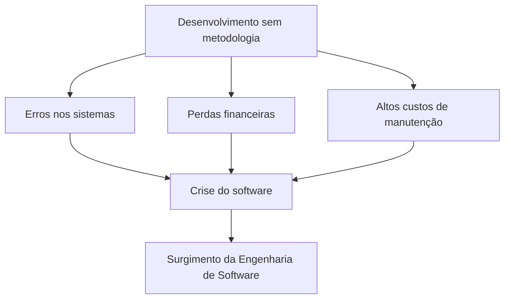
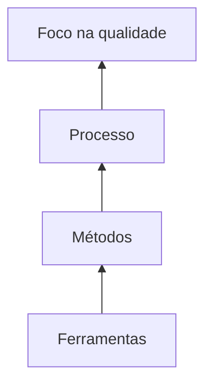
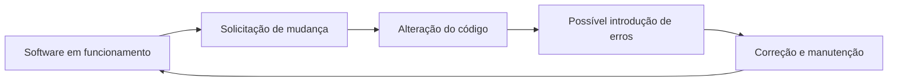
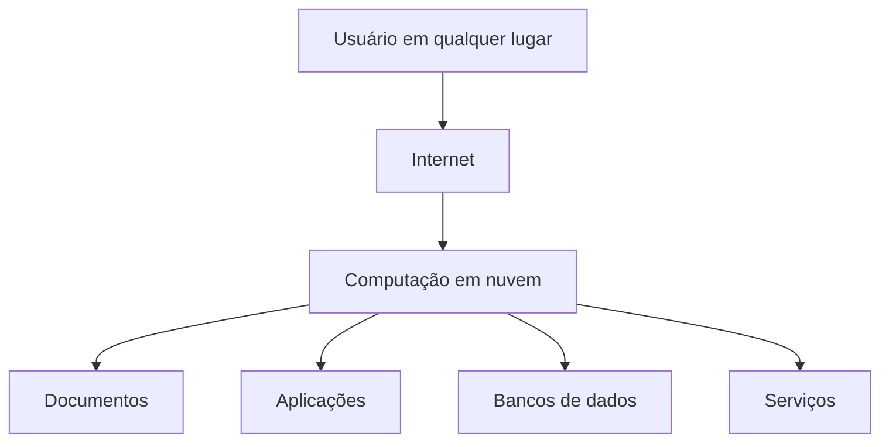

# Introdução à Engenharia de Software

## 1. O cenário anterior à Engenharia de Software

> [!info] Conceito
> A Engenharia de Software surgiu como resposta aos problemas provocados pelo desenvolvimento de programas sem métodos, processos ou técnicas bem definidos.

Antes da consolidação da Engenharia de Software, os programas eram frequentemente produzidos **sem uma metodologia estruturada**. Essa forma de trabalho favorecia a ocorrência de erros nos sistemas, perdas financeiras, custos elevados de manutenção e dificuldades para concluir os projetos.

O conjunto desses problemas ficou conhecido como **crise do software**. A crise estava relacionada principalmente à dificuldade de desenvolver sistemas cada vez mais complexos de maneira organizada, previsível e confiável.

A preocupação deixou de estar concentrada apenas no funcionamento do programa e passou a abranger também **a maneira como o software era desenvolvido**.

> [!tip] Resumindo
> A crise do software demonstrou que apenas saber programar não era suficiente: também era necessário organizar e controlar o processo de desenvolvimento.

## 2. Surgimento da Engenharia de Software

> [!info] Conceito
> A Engenharia de Software aplica princípios de engenharia, métodos e técnicas à criação, operação e manutenção de programas.

A Engenharia de Software surgiu por volta de **1967**, como resposta à crise do software. Sua proposta era aplicar princípios de engenharia e utilizar metodologias e técnicas no processo de criação dos sistemas.

Seus principais objetivos são:

- produzir software de qualidade;
- respeitar o custo previsto;
- cumprir o prazo estimado;
- aumentar a confiabilidade do produto;
- tornar o desenvolvimento mais racional e planejado.

A qualidade constitui o foco central da Engenharia de Software. Para alcançá-la, utiliza-se um **processo de desenvolvimento**, que organiza o trabalho em atividades. Esse processo adota **métodos**, os quais são apoiados por **ferramentas**.

As ferramentas auxiliam a execução do trabalho; os métodos orientam como as atividades devem ser realizadas; o processo organiza essas atividades; e todos esses elementos devem contribuir para a qualidade do software.

> [!warning] Atenção
> Engenharia de Software não significa apenas usar ferramentas de programação. Ela envolve processos, métodos, planejamento, controle e preocupação contínua com a qualidade.

## 3. Problemas enfrentados no desenvolvimento

> [!info] Conceito
> Os desafios do desenvolvimento não se limitam à escrita do código, pois também envolvem custo, prazo, qualidade, manutenção e medição do progresso.

A aula apresenta alguns questionamentos recorrentes:

- Por que a conclusão de um software leva tanto tempo?
- Por que os custos de desenvolvimento são tão altos?
- Por que nem todos os erros são encontrados antes da entrega ao cliente?
- Por que a manutenção de programas existentes exige tanto tempo e esforço?
- Por que é difícil medir o progresso do desenvolvimento e da manutenção?

Essas questões estão relacionadas, entre outros fatores, à falta de uma metodologia adequada. Sem um processo organizado, torna-se mais difícil estimar prazos e custos, acompanhar o progresso, controlar mudanças e encontrar defeitos antes da entrega.

> [!tip] Resumindo
> Uma metodologia não elimina automaticamente todos os problemas, mas fornece uma estrutura para planejar, acompanhar e melhorar o desenvolvimento.

## 4. O que é software?

> [!info] Conceito
> Software não corresponde somente ao código executável: também abrange as estruturas de dados e as informações que explicam sua operação e seu uso.

O material apresenta três componentes que integram o conceito de software:

1. **Instruções:** quando executadas, fornecem as características, funções e o desempenho desejados.
2. **Estruturas de dados:** permitem que os programas manipulem informações adequadamente.
3. **Informações descritivas:** documentação impressa ou virtual que descreve a operação e o uso dos programas.

De maneira simplificada, o software pode ser entendido como um ==programa executado em uma máquina==, como um computador, servidor ou dispositivo móvel. Entretanto, sua definição completa inclui também os **dados** utilizados e a **documentação** necessária para compreender seu funcionamento.

> [!warning] Atenção
> Reduzir software apenas ao código ignora elementos importantes, como as estruturas de dados e a documentação.

## 5. Diferenças entre hardware e software

> [!info] Conceito
> O hardware sofre desgaste físico, enquanto o software não se desgasta materialmente, mas pode deteriorar-se em consequência de alterações e manutenções.

Durante o projeto e a fabricação de um hardware, muitos defeitos podem ser identificados e corrigidos. Depois dessa fase inicial, a taxa de defeitos tende a se estabilizar. Com o passar do tempo, porém, componentes físicos podem apresentar problemas devido a poeira, vibração, temperaturas extremas e envelhecimento.

Quando ocorre uma falha no hardware, muitas vezes é possível substituir a peça danificada e recuperar seu funcionamento. Portanto, o hardware está sujeito ao **desgaste físico**.

No software, os erros também são corrigidos, fazendo com que a taxa de defeitos diminua. Contudo, os clientes podem solicitar alterações ou novas funcionalidades. Cada modificação pode introduzir novos erros, elevando novamente a taxa de defeitos.

Esse comportamento produz sucessivos ciclos de alteração e correção:

Assim, afirma-se que o software **não se desgasta**, pois não é um objeto físico, mas pode **se deteriorar** à medida que mudanças sucessivas tornam seu código mais complexo, mais difícil de compreender e mais sujeito a defeitos.

| Aspecto | Hardware | Software |
|---|---|---|
| Principal causa de problemas ao longo do tempo | Desgaste físico | Alterações e introdução de erros |
| Exemplos | Poeira, vibração e temperaturas extremas | Mudanças, ajustes e novas funcionalidades |
| Forma comum de correção | Substituição de peças | Manutenção do código |
| Comportamento | Desgasta-se | Deteriora-se |

> [!tip] Resumindo
> O hardware envelhece fisicamente; o software tende a se deteriorar quando mudanças sucessivas introduzem erros ou aumentam sua complexidade.

## 6. Aplicações de software

> [!info] Conceito
> Os programas podem ser classificados de acordo com a finalidade, o ambiente em que operam e os recursos que utilizam.

A aula apresenta diferentes categorias de software:

- **Software de sistema:** inclui compiladores, drivers e componentes de sistemas operacionais.
- **Software de aplicação:** atende atividades específicas, como sistemas diversos, planilhas e editores de texto.
- **Software científico:** auxilia cálculos e análises, como aplicações voltadas à astronomia e à meteorologia.
- **Software embarcado:** funciona incorporado a equipamentos, como micro-ondas e veículos.
- **Aplicações Web e móveis:** funcionam por meio da Web ou de dispositivos como celulares.
- **Software de inteligência artificial:** pode realizar reconhecimento de padrões e utilizar redes neurais.

Essas categorias demonstram que o software pode executar funções muito diferentes, desde controlar componentes básicos de um computador até analisar dados científicos, operar equipamentos ou oferecer serviços pela internet.

## 7. Software legado

> [!info] Conceito
> Software legado é um sistema desenvolvido há muitos anos e continuamente modificado para acompanhar mudanças tecnológicas e requisitos de negócio.

Um software legado pode precisar evoluir para:

- funcionar em novos ambientes;
- acompanhar novas tecnologias;
- atender novos requisitos de negócio;
- adaptar-se a mudanças nas plataformas computacionais.

Apesar de continuar útil, sua manutenção costuma apresentar dificuldades. Entre os principais problemas estão:

- código de difícil entendimento;
- documentação deficiente ou inexistente;
- alto custo de manutenção;
- evolução arriscada;
- uso de tecnologias ou linguagens antigas;
- dificuldade para encontrar profissionais familiarizados com essas tecnologias.

A modificação é arriscada porque uma nova funcionalidade pode introduzir erros em partes do sistema que já estavam funcionando corretamente.

Entretanto, esses sistemas não são simplesmente abandonados porque muitas vezes **continuam funcionando bem** e sustentam atividades importantes das organizações.

> [!warning] Atenção
> Um sistema antigo não é necessariamente inútil. O problema central é equilibrar sua importância operacional com o custo e o risco de modificá-lo.

> [!tip] Resumindo
> Sistemas legados permanecem em uso porque cumprem funções importantes, embora sua manutenção seja cara, complexa e arriscada.

## 8. Evolução das aplicações Web

> [!info] Conceito
> As aplicações Web evoluíram de páginas voltadas à transferência de arquivos para sistemas integrados a bancos de dados e processos de negócio.

Nos primórdios da Web, predominava a transferência de arquivos de hipertexto acompanhados de figuras. Com o desenvolvimento das tecnologias, esse modelo evoluiu para aplicações capazes de se integrar a bancos de dados e executar funções relacionadas aos negócios das organizações.

Para apoiar essa evolução, surgiram diversas linguagens, bibliotecas e tecnologias, entre elas:

- PHP;
- Java e Spring Boot;
- JavaScript;
- AngularJS;
- React;
- Node.js;
- Vue.js.

As aplicações Web deixaram, portanto, de funcionar apenas como páginas de consulta e passaram a oferecer serviços interativos e integrados.

> [!tip] Resumindo
> A Web evoluiu da simples apresentação de documentos para a execução de sistemas completos, conectados a dados e atividades de negócio.

## 9. Aplicativos móveis

> [!info] Conceito
> Aplicativos móveis são programas desenvolvidos para dispositivos portáteis e capazes de utilizar recursos específicos desses equipamentos.

A aula cita plataformas móveis como:

- Android;
- iOS;
- Windows Mobile.

Essas aplicações podem acessar recursos existentes no próprio dispositivo, como:

- GPS;
- câmera;
- mecanismos de interação da plataforma móvel, como a tela sensível ao toque.

Além de utilizar recursos locais, os aplicativos móveis também podem acessar a Web, comunicar-se com servidores e consumir serviços externos.

> [!tip] Resumindo
> Aplicativos móveis combinam recursos do dispositivo com conteúdos e serviços disponibilizados pela Web.

## 10. Computação em nuvem

> [!info] Conceito
> A computação em nuvem permite acessar recursos computacionais pela rede sem que o usuário precise saber exatamente onde eles estão armazenados.

A ideia central da computação em nuvem é possibilitar que o usuário acesse recursos de qualquer lugar. A localização física em que esses recursos estão armazenados não é o aspecto mais importante para quem utiliza o serviço.

Entre os recursos que podem ser disponibilizados na nuvem estão:

- documentos;
- aplicações;
- bancos de dados;
- serviços.

Aplicações de edição de textos e planilhas que armazenam arquivos remotamente exemplificam esse modelo. O usuário interage com a aplicação pela rede, enquanto os dados e parte do processamento permanecem em uma infraestrutura externa.

> [!tip] Resumindo
> Na nuvem, o usuário acessa recursos remotamente sem precisar conhecer ou controlar diretamente sua localização física.

## 11. Desafios e processo da Engenharia de Software

> [!info] Conceito
> A Engenharia de Software propõe uma abordagem sistemática, disciplinada e quantificável para desenvolver, operar e manter programas.

De acordo com a definição apresentada na aula, a Engenharia de Software envolve a aplicação de uma abordagem:

- **sistemática**, porque organiza o trabalho segundo um sistema ou processo;
- **disciplinada**, porque exige práticas e procedimentos definidos;
- **quantificável**, porque busca medir características como progresso, custos, defeitos e qualidade.

Essa abordagem aplica-se ao **desenvolvimento**, à **operação** e à **manutenção** do software. Seu propósito é promover uma maneira racional e planejada de produzir sistemas.

Uma das principais soluções oferecidas pela área é o **processo de desenvolvimento de software**, composto por atividades como:

1. levantamento de requisitos;
2. projeto;
3. implementação;
4. testes;
5. implantação.

O **levantamento de requisitos** procura identificar as necessidades que o sistema deverá atender. O **projeto** define como a solução será estruturada. A **implementação** transforma o projeto em código. Os **testes** verificam o comportamento do sistema e procuram encontrar defeitos. A **implantação** disponibiliza o software para utilização.

> [!warning] Atenção
> As etapas apresentadas organizam as atividades fundamentais do desenvolvimento. O material não afirma que todos os projetos precisem executá-las de uma única maneira rígida.

> [!tip] Resumindo
> O processo de desenvolvimento transforma necessidades em um software implantado, passando por requisitos, projeto, implementação e testes.

## 12. Síntese final

> [!summary] Síntese
> A Engenharia de Software surgiu para enfrentar a crise provocada pelo desenvolvimento sem metodologia e busca produzir sistemas de qualidade por meio de processos, métodos e ferramentas.

A aula introduz a Engenharia de Software a partir dos problemas históricos que motivaram seu surgimento. A ausência de metodologias provocava erros, perdas financeiras, atrasos e altos custos de manutenção. Como resposta, a área passou a aplicar princípios de engenharia ao desenvolvimento de sistemas, procurando controlar qualidade, prazo, custo e confiabilidade.

Software não é apenas código: também inclui estruturas de dados e documentação. Diferentemente do hardware, ele não sofre desgaste físico, mas pode deteriorar-se quando alterações sucessivas introduzem erros e aumentam sua complexidade.

O software está presente em sistemas operacionais, aplicações de uso geral, atividades científicas, equipamentos embarcados, inteligência artificial, aplicações Web, dispositivos móveis e serviços em nuvem. Uma atenção especial deve ser dada aos sistemas legados, que continuam importantes, embora apresentem manutenção cara e arriscada.

Por fim, a Engenharia de Software procura tornar o desenvolvimento racional, planejado, disciplinado e mensurável. Para isso, estrutura o trabalho em um processo que envolve levantamento de requisitos, projeto, implementação, testes e implantação.

## Bibliografia indicada

PRESSMAN, Roger S.; MAXIM, Bruce R. *Engenharia de software: uma abordagem profissional*. 8. ed. Rio de Janeiro: McGraw-Hill, 2016.

**Leitura recomendada:** Capítulo 1.

