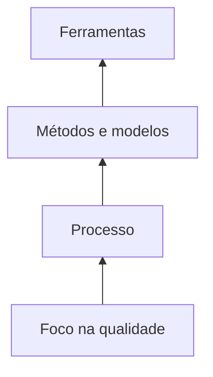
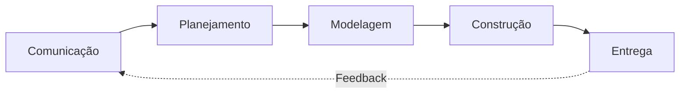
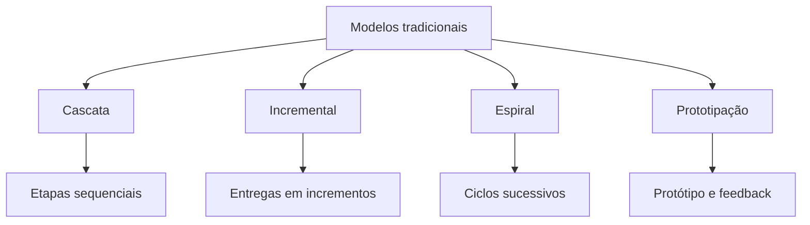
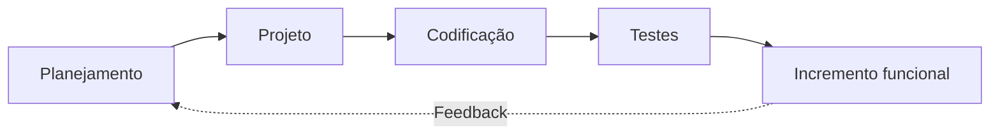
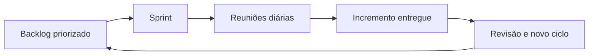
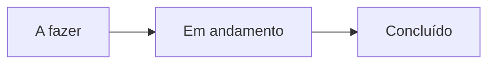
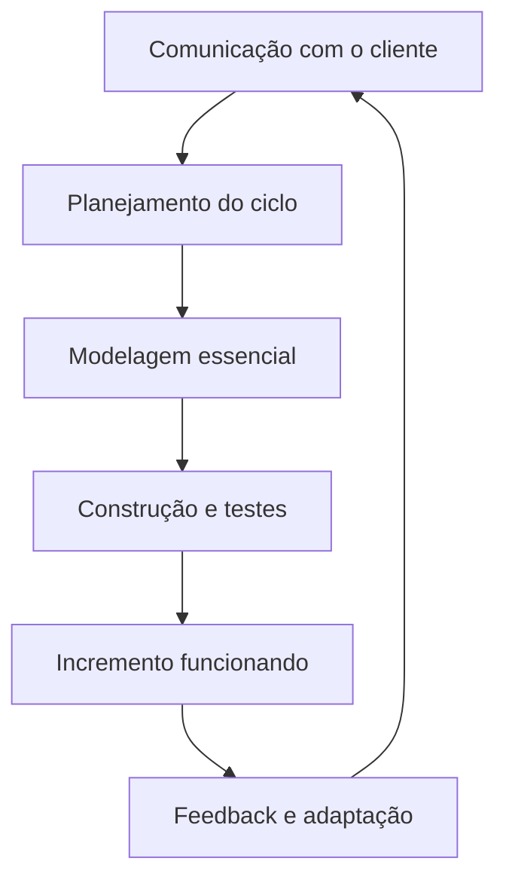

# Métodos Ágeis e Modelos Tradicionais de Desenvolvimento de Software

## 1. Engenharia de software como tecnologia em camadas

> [!info] Conceito
> Engenharia de software é a aplicação de uma abordagem sistemática, disciplinada e quantificável ao desenvolvimento, à operação e à manutenção de software.

A engenharia de software pode ser compreendida como uma **tecnologia organizada em camadas**. Sua base é o **foco na qualidade**, que deve orientar todas as decisões do projeto. Sobre essa base encontra-se o **processo**, responsável por organizar as atividades do desenvolvimento. Os **métodos ou modelos** determinam como essas atividades serão realizadas, enquanto as **ferramentas** oferecem suporte técnico para a execução e a automação do trabalho.

As camadas possuem as seguintes funções:

- **Foco na qualidade:** orienta o processo para a produção de software que atenda às necessidades dos usuários.
- **Processo:** organiza o conjunto de atividades do desenvolvimento.
- **Métodos ou modelos:** estabelecem como o software será desenvolvido.
- **Ferramentas:** apoiam e, quando possível, automatizam a execução do processo e dos métodos.

> [!tip] Resumindo
> A qualidade sustenta a engenharia de software; o processo organiza o trabalho; os métodos orientam sua execução; e as ferramentas fornecem apoio técnico.

## 2. Processo de engenharia de software

> [!info] Conceito
> Processo é um conjunto de atividades, ações e tarefas realizadas para criar um produto de trabalho.

Uma **metodologia de processo** estabelece o alicerce para o desenvolvimento de software. Ela identifica um ==conjunto de atividades estruturais aplicáveis aos projetos==, independentemente de seu tamanho ou de sua complexidade.

A metodologia genérica apresentada na aula é composta por cinco atividades:

1. **Comunicação:** contato com o cliente para compreender suas necessidades e levantar os requisitos do sistema.
2. **Planejamento:** definição do que será feito, de como será realizado e de quando cada atividade deverá acontecer.
3. **Modelagem:** representação organizada do problema e da solução com base nas informações coletadas.
4. **Construção:** produção do código e realização dos testes.
5. **Entrega:** disponibilização do produto ao cliente e obtenção de feedback.

Essas atividades estão presentes tanto nos modelos tradicionais quanto nos métodos ágeis. O que muda é a maneira como são organizadas, repetidas e documentadas.

## 3. Modelos tradicionais de processo

> [!info] Conceito
> Os modelos de processo definem a sequência e a forma de repetição das atividades utilizadas para produzir o software.

A aula apresenta quatro modelos tradicionais: **cascata, incremental, espiral e prototipação**. Todos empregam, de diferentes maneiras, as atividades de comunicação, planejamento, modelagem, construção e entrega.

### 3.1. Modelo em cascata

No **modelo em cascata**, as atividades são executadas de maneira predominantemente sequencial. A comunicação é seguida pelo planejamento, pela modelagem, pela construção e, finalmente, pela entrega. O projeto avança de uma etapa para a seguinte conforme o trabalho é concluído.

### 3.2. Modelo incremental

No **modelo incremental**, o produto é desenvolvido e entregue em partes chamadas **incrementos**. Cada incremento percorre as atividades fundamentais do processo e acrescenta novas funcionalidades ao software.

Em vez de aguardar a conclusão de todo o sistema, o cliente recebe versões progressivamente mais completas.

### 3.3. Modelo espiral

O **modelo espiral** organiza o desenvolvimento em ciclos sucessivos. As atividades reaparecem a cada volta da espiral, permitindo que o produto seja gradualmente analisado, construído, avaliado e aperfeiçoado.

### 3.4. Prototipação

Na **prototipação**, produz-se uma representação inicial do sistema para facilitar a compreensão dos requisitos e a obtenção de feedback. Após a avaliação do protótipo, um novo ciclo pode ser iniciado para melhorar a solução.

> [!warning] Atenção
> “Tradicional” não significa que todos os modelos sejam estritamente lineares. O incremental, o espiral e a prototipação repetem atividades em novos ciclos.

## 4. Surgimento do movimento ágil

> [!info] Conceito
> O movimento ágil surgiu para tornar o desenvolvimento de software menos burocrático, mais colaborativo e mais aberto às mudanças.

O marco do movimento foi o **Manifesto Ágil**, publicado em 2001 e assinado por desenvolvedores, autores e consultores de software. O documento reuniu ideias destinadas a tornar o desenvolvimento mais adaptável e colaborativo.

O Manifesto apresenta quatro valores:

1. **Indivíduos e interações** acima de processos e ferramentas.
2. **Software em funcionamento** acima de documentação completa.
3. **Colaboração com o cliente** acima de negociação contratual.
4. **Resposta às mudanças** acima de seguir rigidamente um plano.

Esses valores não significam que processos, ferramentas, documentação, contratos e planos sejam inúteis. O manifesto afirma que, embora esses elementos tenham valor, os itens relacionados a pessoas, funcionamento, colaboração e adaptação devem receber maior prioridade.

> [!warning] Atenção
> Agilidade não significa ausência de processo, planejamento ou documentação. Significa empregar somente as tarefas e os artefatos necessários para entregar valor e responder às mudanças.

## 5. Princípios do Manifesto Ágil

> [!info] Conceito
> Os doze princípios transformam os valores do Manifesto Ágil em orientações práticas para o desenvolvimento de software.

### 5.1. Satisfação do cliente e entregas frequentes

A maior prioridade é **satisfazer o cliente por meio da entrega antecipada e contínua de software funcionando**. Em vez de esperar muito tempo por uma única entrega completa, o cliente recebe resultados progressivos.

Mudanças nos requisitos devem ser bem recebidas, inclusive quando o desenvolvimento já estiver adiantado. Os processos ágeis procuram aproveitar essas mudanças para aumentar a vantagem competitiva do cliente.

O software deve ser entregue frequentemente, em intervalos que podem variar de algumas semanas a alguns meses, dando-se preferência aos períodos mais curtos.

### 5.2. Colaboração e pessoas motivadas

Profissionais da área comercial e desenvolvedores devem trabalhar em conjunto diariamente durante todo o projeto. Essa aproximação reduz falhas de comunicação e ajuda a manter o produto alinhado às necessidades do cliente.

Os projetos devem ser construídos em torno de pessoas motivadas. A equipe deve receber o ambiente e o apoio necessários, além da confiança para realizar corretamente o trabalho.

A forma mais eficiente e efetiva de transmitir informações dentro de uma equipe é a **conversa aberta e presencial**, pois ela favorece decisões rápidas e entendimento compartilhado.

### 5.3. Software funcionando e ritmo sustentável

O **software em funcionamento** é a principal medida de progresso. O avanço do projeto deve ser avaliado pelo valor efetivamente produzido, e não apenas pela quantidade de documentos ou atividades realizadas.

Os processos ágeis promovem o **desenvolvimento sustentável**. Clientes, desenvolvedores e usuários devem conseguir manter um ritmo constante de trabalho por tempo indeterminado, evitando um esforço excessivo que não possa ser sustentado.

### 5.4. Excelência técnica e simplicidade

A atenção contínua à **excelência técnica** e à qualidade do projeto aumenta a agilidade. Um software tecnicamente bem construído é mais fácil de compreender, modificar e ampliar.

A **simplicidade** é definida como a capacidade de maximizar o trabalho que não precisa ser realizado. A equipe deve concentrar-se no que é essencial e evitar funcionalidades, documentos ou tarefas sem valor suficiente para o produto.

### 5.5. Auto-organização e melhoria contínua

As melhores arquiteturas, requisitos e projetos surgem de **equipes auto-organizadas**, isto é, equipes capazes de tomar decisões e organizar o próprio trabalho.

Em intervalos regulares, a equipe deve refletir sobre como pode se tornar mais eficiente e, com base nessa avaliação, ajustar seu comportamento e sua forma de trabalho.

> [!tip] Resumindo
> Os princípios ágeis priorizam valor para o cliente, entregas frequentes, aceitação de mudanças, colaboração, sustentabilidade, excelência técnica, simplicidade, autonomia e aperfeiçoamento contínuo.

## 6. Filosofia do movimento ágil

> [!info] Conceito
> A filosofia ágil procura entregar valor rapidamente com equipes colaborativas, autônomas e capazes de se adaptar.

A filosofia apresentada na aula possui as seguintes características:

- satisfação do cliente;
- entrega incremental e antecipada;
- equipes pequenas e altamente motivadas;
- utilização de métodos mais informais;
- produção mínima de artefatos de engenharia de software;
- simplicidade no desenvolvimento;
- prioridade para a entrega em relação ao excesso de análise, projeto e documentação;
- comunicação ativa e contínua entre desenvolvedores e clientes;
- participação de gerentes, clientes e usuários na equipe;
- equipes que se auto-organizam e controlam seu próprio trabalho;
- valorização do incremento de software funcionando como principal artefato.

As atividades básicas — comunicação, planejamento, modelagem, construção e entrega — continuam existindo. Entretanto, são executadas com o mínimo necessário de tarefas e artefatos.

O movimento ágil não elimina as práticas da engenharia de software. Ele busca torná-las mais leves, frequentes e orientadas à produção de valor.

## 7. Métodos tradicionais versus métodos ágeis

> [!info] Conceito
> A principal diferença está no grau de adaptação, na distribuição das decisões, na documentação produzida e na frequência das entregas.

| Aspecto | Métodos tradicionais | Métodos ágeis |
|---|---|---|
| Foco principal | Processo | Cliente e seus requisitos |
| Documentação | Mais documentação | Menos documentação |
| Mudanças | Menor capacidade de adaptação | Maior abertura às mudanças |
| Decisões | Geralmente centralizadas | Tomadas pela equipe |
| Organização | Maior orientação por planos e processos | Equipes autogerenciáveis |
| Comunicação | Mais formal | Frequente e colaborativa |
| Responsabilidade | Pode ser dividida por funções | Produto como responsabilidade de todos |
| Entregas | Tendem a ocorrer em intervalos maiores | Rápidas, contínuas e frequentes |
| Desenvolvimento | Pode seguir etapas mais rígidas | Iterativo e incremental |

Os métodos ágeis incentivam maior trabalho em equipe, auto-organização, comunicação frequente, foco no cliente e entrega de valor. A equipe assume responsabilidade coletiva pelo produto e recebe autonomia para tomar decisões.

As entregas contínuas e frequentes refletem a essência do desenvolvimento **iterativo e incremental**:

- **Iterativo:** a solução é revista e melhorada em ciclos sucessivos.
- **Incremental:** novas partes funcionais são acrescentadas ao produto em cada entrega.

> [!warning] Atenção
> A diferença não consiste simplesmente em “ter” ou “não ter” processo. Ambos possuem atividades organizadas, mas os métodos ágeis procuram executá-las em ciclos menores e com maior capacidade de adaptação.

## 8. Principais métodos ágeis

> [!info] Conceito
> Os métodos ágeis aplicam os valores e princípios do movimento por meio de práticas específicas de organização, desenvolvimento e entrega.

A aula cita como exemplos:

- **Extreme Programming (XP);**
- **Scrum;**
- **Kanban;**
- **ASD;**
- **FDD.**

### 8.1. Extreme Programming — XP

O **Extreme Programming**, ou XP, é um método ágil que enfatiza práticas técnicas destinadas a melhorar continuamente o código e permitir entregas frequentes.

Entre as práticas apresentadas estão:

- **Testes de unidade antes das funções:** os testes são preparados antes ou durante a implementação para verificar pequenas unidades do código.
- **Programação em pares:** dois desenvolvedores trabalham juntos na produção do código.
- **Refatoração:** o código já escrito é reorganizado e aperfeiçoado sem alteração de seu comportamento esperado.
- **Entrega contínua:** incrementos funcionais do software são disponibilizados com frequência.

O fluxo do XP combina planejamento, projeto, codificação e testes em ciclos contínuos. O resultado de cada ciclo é uma versão funcional ou um incremento do produto, que pode receber feedback e originar novo planejamento.

### 8.2. Scrum

O **Scrum** divide o projeto em períodos curtos chamados **sprints**, nos quais são produzidas pequenas entregas do software. Cada sprint reúne atividades relacionadas aos requisitos, à análise, ao projeto, à evolução e à entrega.

O **backlog** contém a lista priorizada dos requisitos ou trabalhos que precisam ser realizados. Durante o desenvolvimento, os itens são selecionados e transformados em funcionalidades do produto.

O Scrum também utiliza reuniões diárias de aproximadamente 15 minutos. Essas reuniões permitem acompanhar o andamento do trabalho, identificar dificuldades e alinhar as próximas ações da equipe.

### 8.3. Kanban

O **Kanban** controla visualmente o progresso das tarefas. Os trabalhos são representados por cartões ou papéis colocados em um quadro, e cada cartão é movimentado conforme a tarefa avança até sua finalização.

Uma representação básica pode conter etapas como:

O quadro permite que a equipe visualize o fluxo do trabalho, identifique o estado de cada atividade e acompanhe o progresso geral do projeto.

## 9. Relação entre métodos ágeis e engenharia de software

> [!info] Conceito
> Os métodos ágeis são formas de organizar o processo de engenharia de software, e não uma substituição da engenharia de software.

Comunicação, planejamento, modelagem, construção e entrega continuam sendo necessárias no desenvolvimento ágil. A principal diferença é que essas atividades são realizadas repetidamente, em ciclos curtos e com entregas frequentes.

O feedback do cliente influencia o ciclo seguinte, permitindo que requisitos, prioridades e soluções sejam ajustados ao longo do projeto.

Desse modo, os métodos ágeis procuram equilibrar organização e flexibilidade. Existe um processo, mas ele deve ser suficientemente adaptável para acompanhar as necessidades do cliente e as mudanças percebidas durante o desenvolvimento.

## Síntese final

> [!summary] Síntese
> A engenharia de software organiza o desenvolvimento por meio de processos, métodos e ferramentas sustentados pelo foco na qualidade. Os métodos ágeis preservam as atividades fundamentais desse processo, mas as executam em ciclos menores, com entregas frequentes, colaboração constante e abertura às mudanças.

Os modelos tradicionais organizam as atividades de diferentes formas: o cascata utiliza uma sequência mais definida; o incremental entrega o produto em partes; o espiral trabalha com ciclos sucessivos; e a prototipação utiliza versões iniciais para esclarecer requisitos e obter feedback.

O movimento ágil, formalizado pelo Manifesto Ágil de 2001, prioriza pessoas e interações, software funcionando, colaboração com o cliente e resposta às mudanças. Seus princípios valorizam entregas contínuas, equipes motivadas e auto-organizadas, ritmo sustentável, excelência técnica, simplicidade e melhoria contínua.

Métodos como XP, Scrum e Kanban materializam essa filosofia por meio de práticas específicas. O XP enfatiza testes, programação em pares, refatoração e entrega contínua; o Scrum organiza o trabalho em sprints e backlogs; e o Kanban permite acompanhar visualmente o fluxo das tarefas.

Assim, a essência da abordagem ágil está na combinação de **trabalho em equipe, autonomia, comunicação frequente, adaptação, foco no cliente e entrega contínua de valor por meio de software funcionando**.