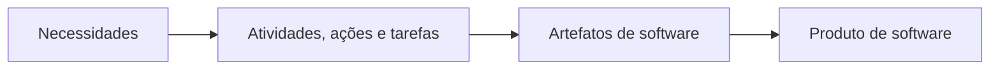
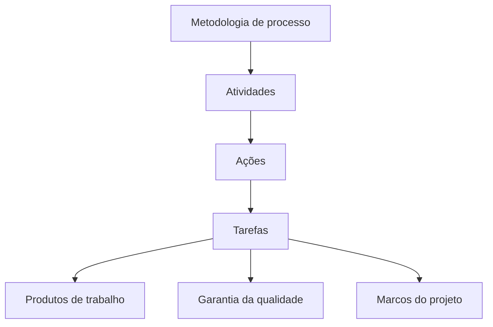
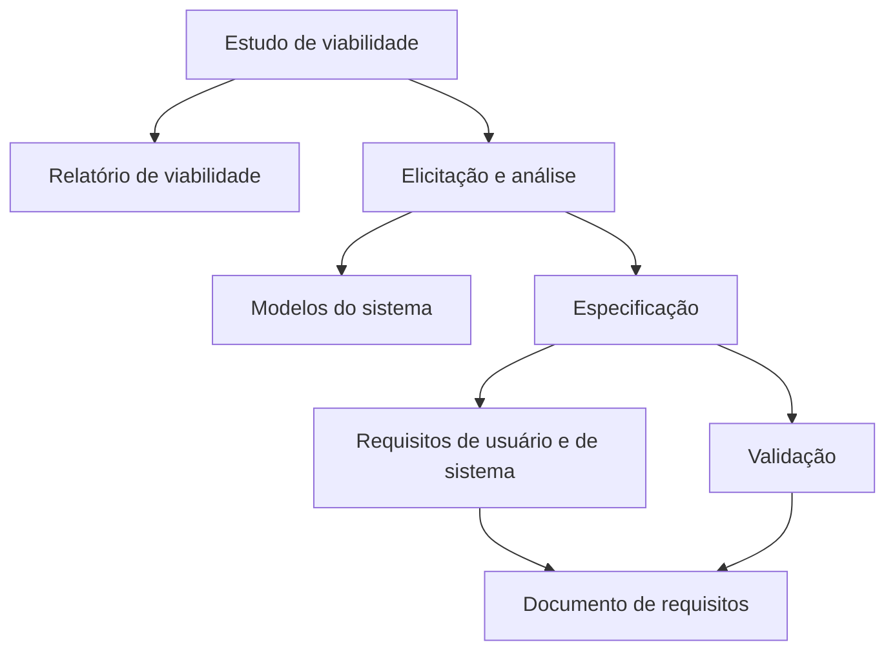
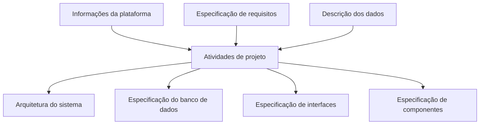
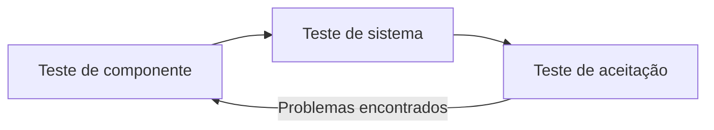
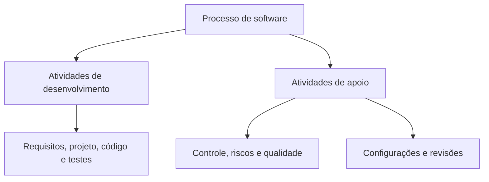
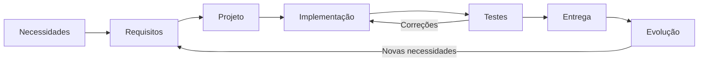

# Fases do Ciclo de Vida do Software

## 1. A necessidade de técnicas para produzir software

> [!info] Conceito
> A adoção de processos e metodologias procura tornar o desenvolvimento de software mais organizado, previsível e controlável.

O desenvolvimento de software apresenta desafios recorrentes: demora para concluir o produto, custos elevados, erros descobertos somente depois da entrega, grande esforço de manutenção e dificuldade para medir o progresso do projeto. Esses problemas estão relacionados, principalmente, à ausência de um processo definido e de uma metodologia adequada para orientar o trabalho.

Sem uma organização sistemática, as atividades podem ser realizadas de maneira improvisada, dificultando o acompanhamento do projeto, a prevenção de falhas e a avaliação dos resultados. Por isso, a Engenharia de Software utiliza técnicas, processos e modelos de ciclo de vida que estruturam a produção do software.

> [!tip] Resumindo
> Processos e metodologias ajudam a controlar custos, prazos, qualidade, manutenção e evolução do software.

---

## 2. Processo de Engenharia de Software

> [!info] Conceito
> Processo é um conjunto de atividades, ações e tarefas realizadas para criar um produto de trabalho.

Um **processo de software** é o conjunto de atividades relacionadas que levam à produção de um produto de software. Ele define o trabalho necessário para transformar uma necessidade ou ideia inicial em um sistema que possa ser entregue e utilizado.

As atividades desenvolvidas durante o processo geram diferentes produtos de trabalho, também chamados de **artefatos de software**. Entre os exemplos apresentados estão:

- especificação de requisitos;
- diagrama de casos de uso;
- diagrama de classes;
- código-fonte.

Um artefato é, portanto, um resultado produzido durante o desenvolvimento. Ele pode servir como documentação do projeto, representação do sistema, entrada para uma atividade posterior ou parte do próprio software.

O processo de Engenharia de Software pode ser compreendido como uma estrutura composta por processos, métodos e ferramentas, tendo como finalidade manter o foco na qualidade do produto.

> [!warning] Atenção
> Processo não é somente programação. Ele também envolve comunicação, planejamento, modelagem, testes, entrega, controle e documentação.

---

## 3. Metodologia de processo

> [!info] Conceito
> A metodologia estabelece o alicerce utilizado para organizar e executar o processo de Engenharia de Software.

Uma **metodologia de processo** organiza o desenvolvimento por meio de um conjunto de atividades estruturais aplicáveis aos projetos de software, independentemente do tamanho ou da complexidade do produto.

Dentro de cada atividade podem existir:

- ações de Engenharia de Software;
- conjuntos de tarefas;
- produtos de trabalho;
- pontos de garantia da qualidade;
- marcos do projeto.

As atividades, ações e tarefas são distribuídas conforme a metodologia ou o modelo adotado. Dessa forma, a metodologia determina como o trabalho será organizado, quais resultados deverão ser produzidos e como o andamento do projeto será acompanhado.

> [!tip] Resumindo
> A metodologia transforma o processo geral em uma forma organizada de trabalhar, relacionando atividades, tarefas, controles e artefatos.

---

## 4. Modelos tradicionais de processo

> [!info] Conceito
> Um modelo de processo representa uma maneira de organizar as atividades do desenvolvimento de software.

Entre os modelos tradicionais mencionados estão:

- modelo em cascata;
- modelo incremental;
- modelo evolutivo;
- prototipação;
- modelo espiral;
- modelo em V;
- RAD;
- modelo de ciclo de vida associado ao RUP.

No **modelo em cascata**, as atividades são organizadas em uma sequência predominantemente linear, passando por comunicação, planejamento, modelagem, construção e entrega.

No **modelo incremental**, o produto é desenvolvido e entregue em partes. Cada incremento acrescenta novas funcionalidades até que o sistema seja completado.

Na **prototipação**, uma versão preliminar do produto é construída para ajudar na comunicação, na compreensão das necessidades e na obtenção de feedback. Esse retorno pode conduzir a novos ajustes nos requisitos e no protótipo.

No **modelo espiral**, o desenvolvimento ocorre em ciclos sucessivos. Cada ciclo pode envolver comunicação, planejamento, análise de riscos, modelagem, construção e entrega.

Embora possuam organizações diferentes, esses modelos procuram estruturar as atividades necessárias à construção do software.

> [!warning] Atenção
> Os termos **modelo de processo** e **modelo de ciclo de vida** podem aparecer como equivalentes, dependendo do autor utilizado.

---

## 5. Modelos de ciclo de vida e diferentes classificações

> [!info] Conceito
> O modelo de ciclo de vida define o conjunto e a organização das atividades que abrangem a construção do software.

A aula apresenta diferentes formas de classificar as atividades do desenvolvimento. Apesar das diferenças de terminologia, as classificações descrevem tarefas semelhantes.

### Pressman

Pressman apresenta um modelo genérico com as seguintes atividades:

1. **Comunicação:** interação com os interessados e compreensão das necessidades do projeto.
2. **Planejamento:** definição das atividades, recursos, prazos e forma de acompanhamento.
3. **Modelagem:** análise do problema e elaboração do projeto da solução.
4. **Construção:** produção do código e realização dos testes.
5. **Entrega:** disponibilização do produto e obtenção de feedback.

### Sommerville

Sommerville organiza o processo em quatro atividades fundamentais:

1. especificação de software;
2. projeto e implementação;
3. validação de software;
4. evolução de software.

### Rational Unified Process — RUP

O RUP distribui o trabalho em disciplinas como:

- modelagem de negócios;
- requisitos;
- análise e design;
- implementação;
- teste;
- implantação.

Ele também contempla disciplinas de apoio, como gerenciamento de configuração e mudanças, gerenciamento de projetos e ambiente.

### Outros autores

Outras classificações podem apresentar:

- levantamento de necessidades;
- análise;
- projeto;
- implementação.

Apesar das diferenças entre os autores, é possível identificar um núcleo comum formado por levantamento de requisitos, projeto, implementação, testes e entrega.

| Referência | Principais atividades |
|---|---|
| Pressman | Comunicação, planejamento, modelagem, construção e entrega |
| Sommerville | Especificação, projeto e implementação, validação e evolução |
| RUP | Modelagem de negócios, requisitos, análise e design, implementação, teste e implantação |
| Outros autores | Levantamento de necessidades, análise, projeto e implementação |

> [!tip] Resumindo
> Os nomes e agrupamentos variam, mas todos os modelos procuram organizar a transformação das necessidades do usuário em um software implementado, validado e entregue.

---

## 6. Especificação de software

> [!info] Conceito
> A especificação de software busca compreender, analisar, documentar e validar aquilo que o sistema deverá realizar.

A atividade de especificação pode ser dividida em etapas menores. Ela pode começar por um **estudo de viabilidade**, que avalia se o projeto pode ser realizado dentro das condições existentes.

Esse estudo produz um relatório de viabilidade e fornece informações para a **elicitação e análise de requisitos**. A elicitação corresponde ao levantamento das necessidades e expectativas dos usuários e demais interessados.

Com base nesse levantamento, são produzidos modelos do sistema e uma especificação dos requisitos. Os requisitos podem ser documentados como:

- requisitos de usuário, apresentados de modo compreensível para quem utilizará ou contratará o sistema;
- requisitos de sistema, que descrevem o comportamento e as características técnicas esperadas.

A especificação passa por uma atividade de **validação**, na qual se verifica se os requisitos representam corretamente as necessidades identificadas. O principal produto dessa atividade é o documento de requisitos.

A especificação não precisa ocorrer de maneira totalmente linear. A análise e a validação podem revelar problemas e provocar revisões nos requisitos já documentados.

> [!warning] Atenção
> Validar requisitos significa verificar se foi especificado o sistema de que os interessados realmente necessitam, antes de avançar para etapas mais dispendiosas.

---

## 7. Projeto e implementação de software

> [!info] Conceito
> O projeto transforma os requisitos em uma descrição técnica da solução que orientará a implementação.

A atividade de projeto e implementação recebe como entrada os produtos gerados anteriormente, como informações da plataforma, especificação de requisitos e descrição dos dados.

A partir dessas entradas, podem ser realizadas as seguintes atividades:

- **projeto de arquitetura:** define a organização geral do sistema e seus principais componentes;
- **projeto de interface:** determina como ocorrerá a interação entre componentes, sistemas ou usuários;
- **projeto de componentes:** detalha as partes responsáveis pelas funcionalidades;
- **projeto de banco de dados:** organiza a estrutura de armazenamento dos dados.

Como resultado, são gerados artefatos como:

- arquitetura do sistema;
- especificação do banco de dados;
- especificação das interfaces;
- especificação dos componentes.

O projeto demonstra uma característica geral do processo de software: uma atividade recebe entradas, executa um conjunto de tarefas e produz saídas. Essas saídas podem se tornar entradas para as atividades seguintes, como a codificação e os testes.

> [!tip] Resumindo
> O projeto estabelece como o software será estruturado; a implementação utiliza essa estrutura para produzir o código do sistema.

---

## 8. Validação de software

> [!info] Conceito
> A validação verifica se o software atende aos requisitos e às necessidades para as quais foi desenvolvido.

A validação pode ser organizada em diferentes níveis de teste:

1. **Teste de componente:** verifica individualmente unidades ou componentes do software.
2. **Teste de sistema:** avalia o funcionamento do sistema integrado.
3. **Teste de aceitação:** verifica se o produto completo atende às necessidades e expectativas do usuário ou cliente.

Os resultados dos testes podem gerar correções e novas verificações. Portanto, mesmo quando os níveis são apresentados em sequência, existe a possibilidade de retorno às atividades anteriores.

> [!warning] Atenção
> Testar componentes isoladamente não substitui o teste do sistema integrado nem a avaliação de aceitação pelo cliente.

---

## 9. Evolução do software

> [!info] Conceito
> A evolução corresponde às modificações realizadas no software depois de sua construção inicial para mantê-lo adequado às necessidades existentes.

O software não permanece necessariamente inalterado depois da entrega. Mudanças nas necessidades dos usuários, correção de problemas e novas demandas podem exigir sua evolução.

Essa atividade relaciona-se à manutenção dos sistemas existentes, um dos pontos que mais consomem tempo e esforço quando o desenvolvimento não possui processos, documentação e artefatos adequados.

Os produtos gerados durante as etapas anteriores — como requisitos, modelos, arquitetura, especificações e código-fonte — ajudam a compreender o sistema e facilitam futuras modificações.

> [!tip] Resumindo
> A evolução mantém o software útil ao longo do tempo, enquanto uma documentação adequada reduz a dificuldade de realizar mudanças.

---

## 10. Atividades de apoio ao processo

> [!info] Conceito
> Atividades de apoio acompanham todo o desenvolvimento e ajudam a controlar o projeto, os riscos, as mudanças e a qualidade.

Além das atividades diretamente relacionadas à criação do software, o processo pode incluir atividades de apoio, como:

- acompanhamento e controle do projeto;
- administração de riscos;
- garantia da qualidade;
- gerenciamento das configurações;
- revisões técnicas.

O **acompanhamento e controle** permite comparar o andamento real com o que foi planejado. A **administração de riscos** procura identificar e tratar acontecimentos que possam prejudicar o projeto.

A **garantia da qualidade** verifica se os processos e produtos atendem aos critérios definidos. O **gerenciamento das configurações** controla versões e mudanças nos artefatos, evitando que alterações sejam realizadas de maneira desorganizada. As **revisões técnicas** avaliam os produtos de trabalho para identificar defeitos e oportunidades de melhoria.

No RUP, aparecem como disciplinas de apoio o gerenciamento de configuração e mudanças, o gerenciamento de projetos e as atividades relacionadas ao ambiente de desenvolvimento. Essas disciplinas acompanham as fases de iniciação, elaboração, construção e transição com intensidades diferentes.

> [!tip] Resumindo
> As atividades de apoio não produzem apenas funcionalidades, mas criam as condições para que o software seja desenvolvido com controle, rastreabilidade e qualidade.

---

## 11. Relação entre as atividades do ciclo de vida

> [!info] Conceito
> As atividades do ciclo de vida estão relacionadas porque os produtos de uma etapa normalmente alimentam as etapas seguintes.

De modo geral, o processo começa pela compreensão das necessidades, passa pela especificação dos requisitos, pelo projeto da solução, pela implementação e pelos testes, chegando à implantação ou entrega. Depois disso, o produto pode continuar evoluindo.

O diagrama representa uma visão geral, mas a organização concreta depende do modelo adotado. Alguns modelos enfatizam uma sequência mais linear, enquanto outros utilizam incrementos, protótipos ou ciclos iterativos.

Durante todo o ciclo, as atividades de apoio contribuem para o gerenciamento do projeto, o controle das mudanças, a redução dos riscos e a garantia da qualidade.

---

## Síntese final

> [!summary] Síntese
> O ciclo de vida organiza o desenvolvimento do software em atividades relacionadas, nas quais necessidades são transformadas em requisitos, projetos, código, testes, entregas e posteriores evoluções.

Um processo de software reúne atividades, ações e tarefas que produzem artefatos e conduzem à criação do produto. A metodologia fornece a estrutura usada para organizar esse processo, enquanto os modelos de processo ou de ciclo de vida determinam como as atividades serão distribuídas e relacionadas.

Pressman, Sommerville, o RUP e outros autores utilizam classificações diferentes, mas apresentam elementos comuns: levantamento de necessidades, especificação, projeto, implementação, validação, entrega e evolução.

Cada atividade recebe entradas, executa tarefas e gera produtos que podem ser utilizados nas etapas seguintes. Paralelamente, atividades de apoio — como controle do projeto, administração de riscos, garantia da qualidade, gerenciamento de configurações e revisões técnicas — mantêm o processo organizado e ajudam a enfrentar problemas de prazo, custo, qualidade, manutenção e medição do progresso.

A leitura recomendada para aprofundamento corresponde aos **capítulos 3 e 4** da obra *Engenharia de Software: uma abordagem profissional*, de Roger S. Pressman e Bruce R. Maxim.