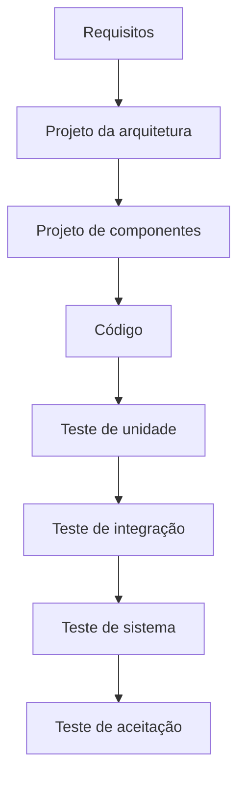
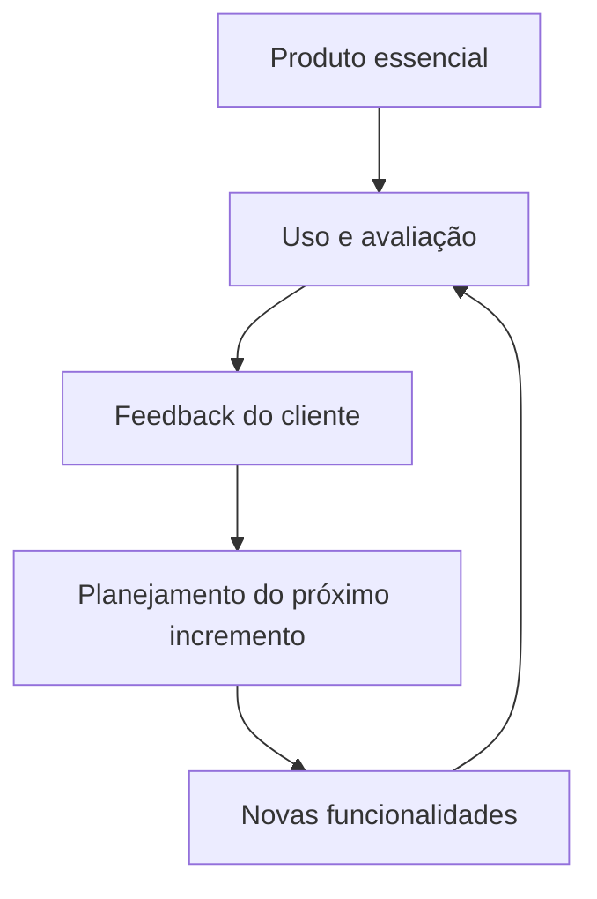
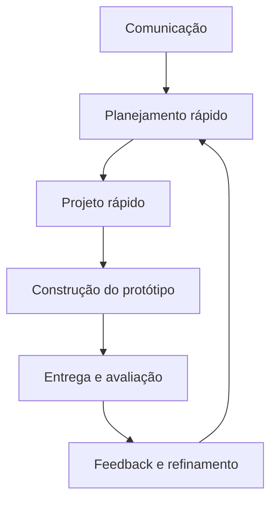
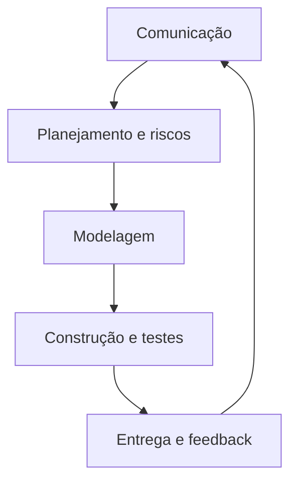
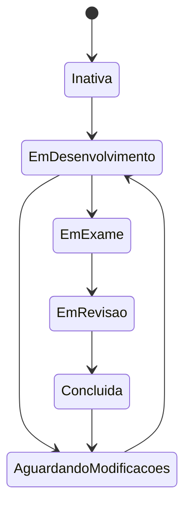

# Capítulo 4 — Modelos de Processo de Software

## 1. Finalidade dos modelos de processo

> [!info] Conceito
> Um modelo de processo orienta como as atividades, tarefas, artefatos, controles e participantes do desenvolvimento de software devem ser organizados.

Os modelos de processo surgiram para introduzir ordem, controle e coordenação em uma atividade que pode se tornar caótica. Eles oferecem um roteiro para o trabalho de engenharia de software, definindo o fluxo das atividades, o grau de iteração, os artefatos produzidos e a organização do trabalho.

O desafio consiste em equilibrar dois extremos. Um processo rígido demais dificulta adaptações; um processo pouco estruturado pode prejudicar a coordenação e a coerência. Por isso, um processo moderno deve manter organização suficiente para orientar o projeto e flexibilidade suficiente para responder às mudanças.

Os engenheiros de software e seus gerentes adaptam o modelo às necessidades do projeto e do produto. Os clientes e demais envolvidos também participam da definição, construção e avaliação do software.

A eficácia do processo pode ser observada principalmente por seus resultados:

- qualidade do produto;
- cumprimento dos prazos;
- controle dos custos;
- capacidade de manutenção;
- viabilidade do software em longo prazo.

> [!tip] Resumindo
> O modelo de processo organiza o desenvolvimento, mas deve ser adaptável às características do projeto, da equipe e do produto.

## 2. Modelos de processo prescritivos

> [!info] Conceito
> Modelos prescritivos estabelecem antecipadamente atividades, tarefas, artefatos, controles de qualidade e mecanismos de gestão de mudanças.

Esses modelos procuram estruturar e ordenar o desenvolvimento. Eles prescrevem os elementos do processo e o fluxo de trabalho, isto é, a maneira pela qual as atividades e tarefas se relacionam.

Embora todos possam incluir as atividades metodológicas genéricas — comunicação, planejamento, modelagem, construção e disponibilização —, cada modelo atribui pesos e sequências diferentes a elas.

O caráter prescritivo não significa que todos os projetos devam seguir exatamente o mesmo processo. A equipe deve ajustar as ações, tarefas e artefatos às necessidades concretas do trabalho.

## 3. Modelo cascata

> [!info] Conceito
> O modelo cascata propõe um desenvolvimento sequencial e sistemático, no qual uma fase conduz à seguinte.

Também chamado de **ciclo de vida clássico**, o modelo cascata começa pela especificação dos requisitos e avança por planejamento, modelagem, construção e disponibilização, chegando ao suporte contínuo do software.

Ele é mais adequado quando os requisitos são bem compreendidos, claramente definidos e relativamente estáveis. Pode ser útil, por exemplo, em adaptações específicas de um sistema existente decorrentes de uma mudança normativa bem delimitada.

### 3.1 Limitações do modelo cascata

Projetos reais raramente seguem um fluxo perfeitamente sequencial. Mudanças podem ocorrer durante o desenvolvimento e provocar confusão, retrabalho ou retorno a fases anteriores.

Também é difícil para o cliente definir todas as suas necessidades no início. O modelo cascata lida mal com essa incerteza porque depende de requisitos antecipadamente estabelecidos.

Outra limitação é a demora para disponibilizar uma versão operacional. O cliente precisa esperar até as etapas finais para utilizar o software, e um erro grave pode permanecer oculto durante grande parte do projeto.

O fluxo sequencial também pode criar **estados de bloqueio**, nos quais uma pessoa ou equipe precisa aguardar a conclusão de uma tarefa anterior. Em alguns casos, o tempo de espera pode superar o tempo dedicado ao trabalho produtivo.

> [!warning] Atenção
> O modelo cascata não é inadequado em todas as situações. Ele continua útil quando os requisitos são fixos e o trabalho pode avançar linearmente até a conclusão.

## 4. Modelo V

> [!info] Conceito
> O modelo V evidencia a correspondência entre as etapas de especificação e projeto e os testes usados para verificá-las e validá-las.

No lado esquerdo do V, os requisitos são progressivamente refinados em representações mais técnicas. Na base, ocorre a geração do código. No lado direito, são executados testes relacionados aos modelos produzidos anteriormente.

| Desenvolvimento | Verificação ou validação correspondente |
|---|---|
| Modelagem de requisitos | Teste de aceitação |
| Projeto da arquitetura | Teste de sistema |
| Projeto de componentes | Teste de integração |
| Geração de código | Teste de unidade |

Não existe diferença fundamental entre o modelo V e o ciclo de vida clássico. Sua principal contribuição é representar visualmente como as ações de verificação e validação se relacionam com as etapas anteriores da engenharia.

## 5. Modelo incremental

> [!info] Conceito
> O modelo incremental produz o software por meio de sucessivas versões entregáveis, cada uma adicionando novas funcionalidades ao produto.

O modelo incremental é apropriado quando os requisitos iniciais são razoavelmente conhecidos, mas o tamanho ou o escopo do projeto inviabiliza um processo puramente linear. Também pode ser empregado quando é necessário disponibilizar rapidamente um conjunto funcional e expandi-lo posteriormente.

Ele combina fluxos lineares e paralelos. Cada sequência de desenvolvimento gera um incremento utilizável, enquanto diferentes incrementos podem ser escalonados ou trabalhados simultaneamente.

O primeiro incremento costuma representar o **produto essencial**: atende aos requisitos básicos, mas ainda não contém todos os recursos complementares. Depois de utilizá-lo ou avaliá-lo, o cliente fornece informações para o planejamento do incremento seguinte. O processo se repete até a obtenção do produto completo.

Um incremento também pode incorporar prototipação quando existirem requisitos que precisem ser esclarecidos.

### 5.1 Exemplo de processador de textos

O exemplo do capítulo coincide com o apresentado na videoaula:

| Incremento | Funcionalidades |
|---|---|
| **1** | Gerenciamento de arquivos, edição e produção básica de documentos |
| **2** | Recursos mais sofisticados de edição e produção |
| **3** | Revisão ortográfica e gramatical |
| **4** | Recursos avançados de formatação de página |

Cada entrega acrescenta funcionalidades ao sistema existente. Portanto, o produto se torna progressivamente mais completo.

### 5.2 Relação com a videoaula

A aula destacou que cada execução das atividades de engenharia constitui uma **iteração**, enquanto o resultado incorporado ao produto é um **incremento**. O capítulo reforça essa ideia ao mostrar que cada sequência produz uma versão entregável.

Os materiais também convergem nos seguintes aspectos:

- os incrementos podem ocorrer de forma escalonada ou paralela;
- o software cresce com cada nova entrega;
- o cliente pode avaliar o produto essencial;
- o feedback orienta os incrementos posteriores;
- alterações podem ser incorporadas ao planejamento das versões seguintes;
- funcionalidades críticas podem ser desenvolvidas antecipadamente para avaliar a arquitetura e reduzir riscos.

> [!tip] Resumindo
> O modelo incremental entrega valor desde as primeiras versões e utiliza a experiência obtida com cada entrega para orientar a evolução do produto.

## 6. Modelos de processo evolucionário

> [!info] Conceito
> Modelos evolucionários são iterativos e produzem versões progressivamente mais completas à medida que requisitos e necessidades se tornam mais claros.

O software evolui ao longo do tempo. Os requisitos de negócio e do produto podem mudar durante o projeto, tornando inadequado um planejamento completamente linear.

Os modelos evolucionários são indicados quando:

- os requisitos gerais são conhecidos, mas os detalhes ainda precisam ser definidos;
- o produto deve ser colocado rapidamente no mercado;
- uma versão limitada precisa ser entregue antes do sistema completo;
- mudanças são esperadas durante o desenvolvimento.

Os dois modelos evolucionários principais apresentados são a **prototipação** e o **modelo espiral**.

## 7. Prototipação

> [!info] Conceito
> A prototipação constrói uma representação inicial do software para esclarecer requisitos e melhorar a compreensão do produto.

Ela é especialmente útil quando o cliente conhece os objetivos gerais, mas não consegue detalhar funções e recursos, ou quando o desenvolvedor tem dúvidas sobre algoritmos, tecnologias ou interação com o usuário.

O processo começa pela comunicação com os envolvidos. A equipe identifica objetivos gerais, requisitos conhecidos e pontos que precisam ser mais bem definidos. Em seguida, realiza um planejamento rápido, produz um projeto concentrado nos aspectos visíveis ao usuário e constrói o protótipo.

O feedback obtido é utilizado para refinar os requisitos e ajustar o protótipo. O ciclo se repete até que os envolvidos compreendam melhor o sistema que deve ser construído.

### 7.1 Protótipo descartável e evolucionário

O protótipo pode ser:

- **descartável:** construído apenas para esclarecer requisitos e depois abandonado;
- **evolucionário:** progressivamente aperfeiçoado até se transformar no sistema real.

Idealmente, quando o protótipo é criado rapidamente e sem uma arquitetura adequada, ele deve ser descartado. O software definitivo deve ser reconstruído com foco em qualidade e manutenção.

### 7.2 Riscos da prototipação

Os usuários podem confundir o protótipo com um produto quase concluído e pressionar a equipe para transformá-lo diretamente no sistema final. Isso pode preservar uma estrutura desorganizada e comprometer a qualidade e a manutenção.

Os desenvolvedores também podem adotar tecnologias, linguagens ou algoritmos inadequados apenas para colocar o protótipo em funcionamento rapidamente. Com o tempo, essas decisões provisórias podem permanecer no produto.

> [!warning] Atenção
> Antes de iniciar, todos devem compreender se o protótipo será descartado ou evoluído. Transformar apressadamente um protótipo de baixa qualidade em produto final pode gerar problemas duradouros.

## 8. Modelo espiral

> [!info] Conceito
> O modelo espiral é um processo evolucionário orientado a riscos que combina a iteração da prototipação com a organização sistemática do modelo cascata.

Proposto por Barry Boehm, o modelo espiral desenvolve o software em sucessivas voltas. Nas primeiras iterações, o resultado pode ser uma especificação, um modelo ou um protótipo. Nas posteriores, são produzidas versões progressivamente mais completas.

Cada volta inclui atividades como:

- comunicação;
- planejamento;
- estimativas;
- elaboração de cronograma;
- análise de riscos;
- modelagem;
- construção;
- testes;
- entrega e feedback.

A cada circuito, riscos são identificados e tratados. Marcos de controle, chamados **pontos-âncora**, demonstram que determinadas condições foram atendidas e ajudam a confirmar o compromisso dos envolvidos com uma solução viável.

O planejamento é revisto depois das entregas. Custos, cronograma e número de iterações podem ser ajustados de acordo com o feedback e com o conhecimento adquirido.

### 8.1 Aplicação ao ciclo de vida

O modelo espiral pode acompanhar o software desde o desenvolvimento do conceito até sua retirada de operação. Diferentes voltas podem representar:

- desenvolvimento do conceito;
- desenvolvimento do produto;
- aperfeiçoamento;
- manutenção e evolução.

### 8.2 Benefícios e limitações

A consideração direta dos riscos torna o modelo adequado a sistemas grandes e complexos. A prototipação pode ser aplicada em qualquer etapa para reduzir incertezas.

Entretanto, a abordagem exige conhecimento especializado em avaliação de riscos. Se um risco importante não for identificado e administrado, o projeto poderá enfrentar problemas graves. Também pode ser difícil demonstrar aos clientes, especialmente em contratos rígidos, que um processo evolucionário permanece controlável.

> [!tip] Resumindo
> A espiral organiza a evolução do produto em ciclos controlados nos quais planejamento, desenvolvimento, feedback e análise de riscos são continuamente revistos.

## 9. Modelo de desenvolvimento concorrente

> [!info] Conceito
> O modelo concorrente representa atividades de engenharia executadas simultaneamente, cada uma em determinado estado.

Nesse modelo, comunicação, modelagem, construção e outras atividades coexistem. Em vez de limitar o trabalho a uma sequência única, ele representa uma rede de processos.

Uma atividade pode assumir estados como:

- inativa;
- em desenvolvimento;
- aguardando modificações;
- em exame;
- em revisão;
- concluída.

Eventos provocam transições entre esses estados. Por exemplo, uma alteração solicitada pelo cliente pode fazer a modelagem sair de “em desenvolvimento” e passar para “aguardando modificações”. A descoberta de uma inconsistência pode reabrir uma análise já concluída.

O modelo fornece uma visão realista do estado atual do projeto e é particularmente adequado quando diferentes equipes de engenharia trabalham paralelamente.

## 10. Limitações gerais dos processos evolucionários

> [!warning] Atenção
> A flexibilidade dos modelos evolucionários precisa ser equilibrada com planejamento, controle e qualidade.

Os processos evolucionários apresentam três preocupações principais:

1. **Quantidade incerta de ciclos:** pode ser difícil prever quantas iterações serão necessárias para concluir o produto.
2. **Velocidade da evolução:** mudanças rápidas demais podem conduzir ao caos; mudanças lentas demais podem prejudicar a produtividade.
3. **Equilíbrio entre flexibilidade e qualidade:** a busca por extensibilidade e velocidade não deve comprometer a qualidade do software.

O objetivo continua sendo produzir software de alta qualidade de maneira iterativa ou incremental. A equipe e os gerentes precisam equilibrar velocidade, flexibilidade, extensibilidade, qualidade e satisfação do cliente.

## 11. Modelos de processo especializados

> [!info] Conceito
> Modelos especializados aplicam características dos modelos tradicionais a necessidades específicas da engenharia de software.

O capítulo apresenta três abordagens especializadas:

- desenvolvimento baseado em componentes;
- métodos formais;
- desenvolvimento orientado a aspectos.

### 11.1 Desenvolvimento baseado em componentes

> [!info] Conceito
> Essa abordagem constrói aplicações mediante a seleção, adaptação, integração e reutilização de componentes previamente desenvolvidos.

Componentes comerciais de prateleira, conhecidos como **COTS**, fornecem funcionalidades prontas e interfaces definidas para integração.

O processo é evolucionário e segue as etapas:

1. pesquisar e avaliar componentes disponíveis;
2. examinar as necessidades de integração;
3. projetar uma arquitetura capaz de acomodá-los;
4. integrar os componentes;
5. executar testes completos.

A reutilização pode reduzir o tempo do ciclo de desenvolvimento e os custos do projeto, principalmente quando passa a integrar a cultura organizacional.

### 11.2 Modelo de métodos formais

> [!info] Conceito
> Métodos formais utilizam notação e análise matemática rigorosas para especificar, desenvolver e verificar sistemas.

Essa abordagem facilita a identificação de ambiguidades, incompletudes e inconsistências. Os modelos matemáticos também fornecem uma base para verificar o código e descobrir erros que poderiam passar despercebidos em revisões convencionais.

Apesar da promessa de software com poucos ou nenhum defeito, existem limitações:

- elaboração demorada e cara;
- necessidade de treinamento especializado;
- escassez de profissionais qualificados;
- dificuldade de comunicação com clientes sem formação técnica.

Por isso, métodos formais são especialmente relevantes para sistemas críticos de segurança, como software de aeronaves e equipamentos médicos, ou para aplicações em que falhas possam provocar grandes prejuízos econômicos.

### 11.3 Desenvolvimento orientado a aspectos

> [!info] Conceito
> O desenvolvimento orientado a aspectos trata preocupações transversais que afetam diferentes funções e componentes do sistema.

Certas propriedades não ficam restritas a um único módulo. Segurança, tolerância a falhas, regras de negócio, sincronização e gerenciamento de memória podem atravessar toda a arquitetura.

Essas propriedades são chamadas de **preocupações transversais**. Os aspectos procuram localizar e representar tais preocupações, evitando que sua implementação permaneça dispersa pelo sistema.

O processo orientado a aspectos ainda não atingiu plena maturidade, mas tende a combinar características evolucionárias e concorrentes. Os aspectos podem ser desenvolvidos independentemente dos componentes, embora tenham impacto direto sobre eles, exigindo coordenação e comunicação entre as atividades.

## 12. Processo Unificado

> [!info] Conceito
> O Processo Unificado é dirigido a casos de uso, centrado na arquitetura, iterativo e incremental.

O Processo Unificado, ou PU, aproveita características de modelos tradicionais e incorpora princípios compatíveis com o desenvolvimento ágil. Ele valoriza:

- comunicação com o cliente;
- descrição das necessidades por casos de uso;
- arquitetura de software;
- reutilização;
- capacidade de receber mudanças;
- desenvolvimento iterativo e incremental.

Um **caso de uso** descreve uma função ou recurso do sistema do ponto de vista do usuário. Ele ajuda a transformar as necessidades dos envolvidos em modelos de análise e desenvolvimento.

### 12.1 Processo Unificado e UML

A UML surgiu da unificação dos métodos de análise e projeto orientados a objetos desenvolvidos por James Rumbaugh, Grady Booch e Ivar Jacobson. Ela oferece uma notação para modelar sistemas orientados a objetos.

> [!warning] Atenção
> UML e Processo Unificado não são a mesma coisa. A UML é uma linguagem de modelagem; o PU é um processo de desenvolvimento que pode utilizar a UML para representar requisitos e projetos.

### 12.2 Fases do Processo Unificado

#### Concepção

Na concepção, a equipe se comunica com os envolvidos, identifica as necessidades do negócio, formula casos de uso preliminares, propõe uma arquitetura inicial e desenvolve o planejamento do projeto.

Também são avaliados recursos, riscos, cronograma e bases para os incrementos posteriores.

#### Elaboração

A elaboração refina os casos de uso e amplia a arquitetura. São desenvolvidas diferentes visões do software:

- modelo de casos de uso;
- modelo de análise;
- modelo de projeto;
- modelo de implementação;
- modelo de disponibilização.

Essa fase pode produzir uma base arquitetural executável, que demonstra a viabilidade da arquitetura. Ela não é um protótipo descartável, pois será ampliada durante a construção.

O plano também é revisto para verificar escopo, riscos e datas de entrega.

#### Construção

A construção desenvolve ou adquire os componentes necessários para tornar os casos de uso operacionais. Os modelos de análise e projeto são concluídos, o código é implementado e são executados testes de unidade e integração.

Os casos de uso ajudam a elaborar os testes de aceitação.

#### Transição

Na transição, o software é entregue aos usuários para testes beta. O feedback revela defeitos e mudanças necessárias. A equipe também prepara manuais, guias de solução de problemas e instruções de instalação.

Ao final, o incremento torna-se uma versão utilizável.

#### Produção

Na produção, a equipe acompanha o uso contínuo do software, oferece suporte à infraestrutura operacional e avalia relatórios de defeitos e solicitações de mudanças.

As fases não precisam ocorrer de maneira estritamente sequencial. Enquanto construção, transição e produção de um incremento estão em andamento, o incremento seguinte pode já ter começado.

> [!tip] Resumindo
> O Processo Unificado aplica fases concomitantes e escalonadas para produzir sucessivos incrementos orientados pelos casos de uso e sustentados pela arquitetura.

## 13. Processos pessoal e de equipe

> [!info] Conceito
> Um processo organizacional somente será eficaz se puder ser adaptado às pessoas e equipes responsáveis pelo trabalho.

Watts Humphrey propôs o **Processo de Software Pessoal (PSP)** e o **Processo de Software de Equipe (TSP)**. Ambos exigem disciplina, treinamento, coordenação e utilização de métricas.

### 13.1 Processo de Software Pessoal — PSP

O PSP procura ajudar cada desenvolvedor a planejar seu trabalho, medir resultados, controlar a qualidade e aperfeiçoar continuamente seu próprio processo.

Suas atividades estruturais são:

1. **Planejamento:** levantamento dos requisitos, estimativas de tamanho, recursos e defeitos, definição de tarefas e cronograma.
2. **Projeto de alto nível:** elaboração das especificações e do projeto dos componentes; protótipos são utilizados quando há incerteza.
3. **Revisão do projeto:** aplicação de técnicas de verificação para encontrar erros.
4. **Desenvolvimento:** refinamento do projeto, codificação, revisão, compilação e testes.
5. **Autópsia:** análise das métricas para avaliar a eficácia do processo e orientar melhorias.

O PSP enfatiza a descoberta precoce de erros e a compreensão dos tipos de falha que o profissional costuma cometer. Seus benefícios incluem melhoria da produtividade e da qualidade, mas sua adoção é dificultada pelo treinamento prolongado, pelos custos e pela resistência cultural à medição rigorosa.

### 13.2 Processo de Software de Equipe — TSP

> [!info] Conceito
> O TSP amplia os princípios do PSP para formar equipes autodirigidas, responsáveis por seus planos, metas, processos e resultados.

Uma equipe autodirigida:

- compreende suas metas globais;
- define papéis e responsabilidades;
- acompanha produtividade e qualidade;
- seleciona um processo apropriado;
- estabelece padrões locais;
- avalia riscos continuamente;
- controla o cronograma;
- produz relatórios sobre o projeto;
- melhora continuamente sua forma de trabalhar.

As atividades do TSP incluem lançamento do projeto, projeto de alto nível, implementação, integração, testes e autópsia.

Roteiros, formulários e padrões orientam as atividades da equipe. Assim como o PSP, o TSP exige comprometimento integral e treinamento adequado, mas pode produzir benefícios mensuráveis de produtividade e qualidade.

## 14. Tecnologia de processos

> [!info] Conceito
> Ferramentas de tecnologia de processos ajudam a modelar, analisar, executar, monitorar e aperfeiçoar os processos de software.

Essas ferramentas permitem representar atividades, ações, tarefas, artefatos, marcos e controles de qualidade em um modelo automatizado, normalmente apresentado como uma rede.

A representação pode ser analisada para:

- compreender o fluxo de trabalho;
- avaliar estruturas alternativas;
- reduzir custos e tempo;
- distribuir tarefas;
- monitorar o progresso;
- controlar a qualidade;
- coordenar outras ferramentas de engenharia de software.

Cada profissional pode consultar as tarefas sob sua responsabilidade, os artefatos que deverá produzir e as atividades de garantia da qualidade que precisará executar.

> [!tip] Resumindo
> A tecnologia de processos transforma o modelo adotado em um mecanismo operacional para orientar e acompanhar o trabalho da equipe.

## 15. Dualidade entre produto e processo

> [!info] Conceito
> Produto e processo não são elementos opostos; são dimensões complementares e inseparáveis do desenvolvimento de software.

Um processo fraco prejudica o produto final. Entretanto, uma confiança obsessiva no processo também pode ser danosa. O desenvolvimento não deve alternar entre valorizar somente os artefatos produzidos ou somente os métodos usados para produzi-los.

O produto resulta de um processo e pode ser reutilizado como entrada em outras atividades. Da mesma maneira, o processo ganha significado por meio dos resultados que produz.

A reutilização reforça essa dualidade: um artefato reutilizável é simultaneamente produto de uma atividade anterior e elemento de um novo processo.

Os profissionais também podem obter satisfação tanto no trabalho criativo quanto no resultado concluído. Manter esse equilíbrio ajuda a preservar o envolvimento das pessoas na evolução da engenharia de software.

## 16. Comparação dos principais modelos

| Modelo | Organização principal | Indicação | Limitação ou cuidado |
|---|---|---|---|
| Cascata | Sequência linear | Requisitos estáveis e bem definidos | Baixa adaptação a mudanças e entrega tardia |
| Modelo V | Sequência ligada a níveis de teste | Projetos que precisam evidenciar verificação e validação | Conserva as limitações fundamentais do cascata |
| Incremental | Entregas sucessivas | Necessidade de versões funcionais progressivas | Requer planejamento da integração e dos incrementos |
| Prototipação | Ciclos de avaliação e refinamento | Requisitos obscuros ou interface incerta | Protótipo precário pode ser indevidamente transformado em produto |
| Espiral | Iterações orientadas a riscos | Projetos grandes, complexos ou arriscados | Exige experiência na avaliação de riscos |
| Concorrente | Atividades simultâneas em diferentes estados | Várias equipes ou fluxos paralelos | Demanda coordenação dos eventos e estados |
| Baseado em componentes | Reutilização e integração | Existência de componentes adequados | Depende de compatibilidade arquitetural e integração |
| Métodos formais | Especificação matemática | Sistemas críticos ou de alto impacto | Alto custo e necessidade de especialistas |
| Orientado a aspectos | Tratamento de preocupações transversais | Propriedades que atravessam vários componentes | Abordagem ainda em amadurecimento |
| Processo Unificado | Casos de uso, arquitetura e incrementos | Sistemas orientados a objetos e evolutivos | Precisa ser adaptado ao projeto |
| PSP | Disciplina e métricas individuais | Melhoria do processo pessoal | Treinamento, esforço de medição e resistência cultural |
| TSP | Autodireção e métricas de equipe | Equipes comprometidas com melhoria contínua | Requer treinamento e adesão de todos |

## Síntese final

> [!summary] Síntese
> Não existe um único modelo adequado a todos os projetos. A escolha deve considerar estabilidade dos requisitos, necessidade de entregas rápidas, riscos, tamanho do sistema, organização das equipes, criticidade do produto e capacidade de adaptação.

Os modelos cascata e V oferecem organização linear e são aplicáveis quando os requisitos permanecem estáveis. O modelo incremental, tema da videoaula, combina sequências de desenvolvimento com entregas progressivas, permitindo colocar um produto essencial em uso e ampliá-lo conforme o feedback.

Os modelos evolucionários reconhecem que o software muda. A prototipação esclarece necessidades pouco definidas, enquanto a espiral organiza a evolução em torno da análise de riscos. O modelo concorrente representa atividades simultâneas em diferentes estados.

Os modelos especializados atendem necessidades particulares: reutilização de componentes, verificação matemática e tratamento de preocupações transversais. O Processo Unificado integra casos de uso, arquitetura, iteração e incrementos. PSP e TSP aproximam o processo das pessoas e das equipes por meio de planejamento, métricas, autodireção e melhoria contínua.

Por fim, o capítulo mostra que processo e produto formam uma dualidade. Um processo disciplinado deve favorecer a produção de software de qualidade, mas precisa permanecer flexível, adaptável e compatível com as necessidades reais da equipe, do cliente e do projeto.