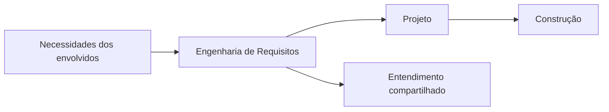
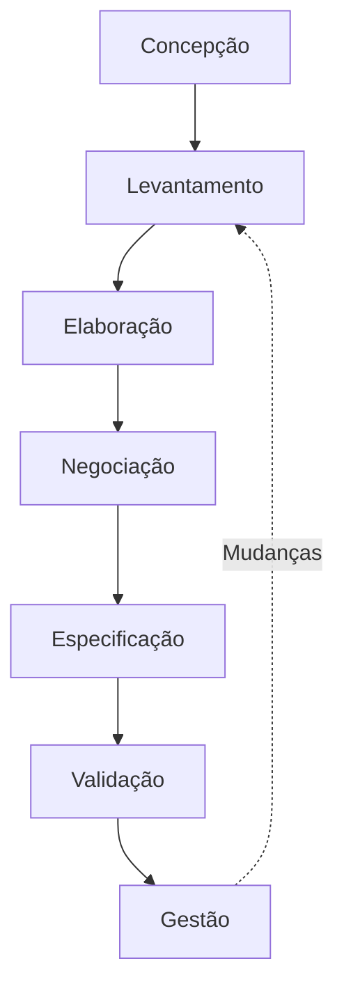
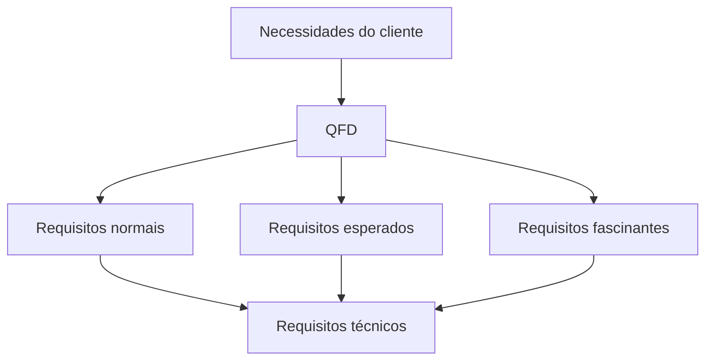
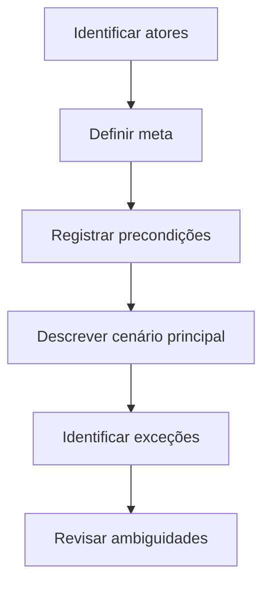
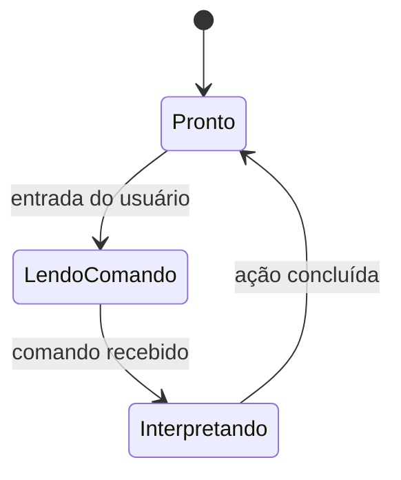

# Capítulo 8 — Entendendo os Requisitos

## 1. A dificuldade de compreender os requisitos

> [!info] Conceito
> Compreender requisitos significa descobrir o impacto do software no negócio, o que os clientes necessitam e como os usuários interagirão com o sistema.

Entender os requisitos está entre as tarefas mais difíceis da Engenharia de Software. Clientes e usuários nem sempre sabem exatamente o que precisam, podem ter dificuldade para explicar suas necessidades e frequentemente alteram suas expectativas durante o projeto.

Mesmo quando os envolvidos conseguem expressar aquilo que desejam, os requisitos podem ser registrados de maneira desorganizada, interpretados incorretamente ou pouco verificados. Também é comum que as mudanças controlem o projeto, em vez de serem administradas por mecanismos adequados.

O desenvolvimento de um programa tecnicamente elegante não possui valor quando o software resolve o problema errado. Por isso, antes do projeto e da construção, é necessário estabelecer um entendimento compartilhado sobre o problema e a solução esperada.

> [!warning] Atenção
> Nenhuma implementação tecnicamente correta compensa requisitos que representam incorretamente as necessidades do cliente.

---

## 2. Engenharia de Requisitos

> [!info] Conceito
> Engenharia de Requisitos é o conjunto de tarefas e técnicas utilizadas para compreender, documentar, validar e administrar as necessidades relacionadas ao software.

A Engenharia de Requisitos começa durante a comunicação com o cliente e continua na atividade de modelagem. Ela estabelece uma ponte entre as necessidades dos envolvidos e as atividades de projeto e construção do software.

Esse processo permite compreender:

- o contexto do trabalho que será realizado;
- as necessidades que deverão ser atendidas;
- as prioridades que determinam a ordem do desenvolvimento;
- as informações manipuladas pelo sistema;
- as funções que deverão ser oferecidas;
- os comportamentos esperados;
- as restrições que influenciam a solução.

A maneira de executar a Engenharia de Requisitos deve ser adaptada ao processo, ao projeto, ao produto e às pessoas envolvidas. Em projetos pequenos e simples, algumas práticas podem ser menos formais. Entretanto, à medida que o tamanho e a complexidade aumentam, torna-se mais arriscado iniciar a construção sem compreender adequadamente os requisitos.

Mudanças tecnológicas também afetam os requisitos. A computação incorporada a objetos do cotidiano e a interligação desses objetos podem produzir perfis de usuário mais completos, aumentando as preocupações com segurança e privacidade. Ao mesmo tempo, ciclos de desenvolvimento menores pressionam as equipes a obter respostas rápidas, precisas e suficientemente estáveis dos envolvidos.

---

## 3. Tarefas da Engenharia de Requisitos

> [!info] Conceito
> A Engenharia de Requisitos compreende sete tarefas: concepção, levantamento, elaboração, negociação, especificação, validação e gestão.

Essas tarefas não precisam acontecer de forma estritamente sequencial. Algumas podem ocorrer paralelamente e todas devem ser ajustadas às características do projeto.

### 3.1. Concepção

A concepção começa quando uma necessidade de negócio, um novo serviço ou uma oportunidade de mercado dá origem ao projeto. Os envolvidos podem elaborar uma visão inicial do negócio, estimar o mercado, realizar uma análise preliminar de viabilidade e definir aproximadamente a abrangência do produto.

Nessa etapa, procura-se estabelecer:

- um entendimento básico do problema;
- quem necessita da solução;
- a natureza da solução desejada;
- a abrangência inicial do projeto;
- a qualidade da comunicação e da colaboração entre os envolvidos e a equipe técnica.

As informações da concepção ainda podem mudar, mas devem ser suficientes para iniciar uma discussão produtiva.

### 3.2. Levantamento

O levantamento, também chamado de elicitação, procura descobrir os objetivos do sistema, aquilo que ele deverá realizar, como atenderá às necessidades da organização e como será utilizado no cotidiano.

Embora pareça suficiente perguntar ao cliente o que ele deseja, essa tarefa é difícil porque podem existir problemas de escopo, entendimento e volatilidade. Os limites do sistema podem estar mal definidos, os usuários podem omitir informações, diferentes envolvidos podem apresentar necessidades conflitantes e os requisitos podem mudar com o tempo.

Uma atividade importante é identificar as metas do negócio e incentivar os envolvidos a compartilhá-las com clareza. Essas metas podem ser funcionais ou não funcionais e ajudam a explicar, priorizar, elaborar, validar, negociar e acompanhar os requisitos.

### 3.3. Elaboração

Na elaboração, as informações obtidas durante a concepção e o levantamento são expandidas e refinadas. A equipe desenvolve um modelo de requisitos que representa informações, funções e comportamentos do sistema.

Como a compreensão evolui durante o projeto, o modelo de requisitos também muda. Alguns elementos tornam-se estáveis e servem de base para o projeto, enquanto outros permanecem voláteis e indicam que ainda existem dúvidas ou entendimentos incompletos.

### 3.4. Negociação

A negociação procura conciliar as necessidades dos envolvidos com restrições reais de prazo, orçamento, pessoal, tecnologia e tempo de entrada no mercado. Funcionalidades, desempenho e outras características precisam ser priorizados e comparados com seus respectivos custos e riscos.

### 3.5. Especificação

A especificação pode assumir diferentes formas:

- documento escrito;
- conjunto de cenários de uso;
- coleção de histórias ou jornadas de usuário;
- modelos gráficos;
- protótipo;
- combinação desses artefatos.

Projetos grandes, complexos ou críticos podem exigir uma especificação formal. Em projetos menores e inseridos em ambientes técnicos bem compreendidos, um conjunto de cenários pode ser suficiente.

### 3.6. Validação

A validação avalia a qualidade dos artefatos produzidos. Ela procura confirmar que os requisitos estão claros, completos, consistentes, viáveis, testáveis e de acordo com os padrões adotados.

### 3.7. Gestão

A gestão de requisitos identifica, controla e acompanha as necessidades e suas mudanças durante o projeto e ao longo da vida do sistema. Projetos grandes, com centenas de requisitos, podem exigir uma gestão formal; projetos pequenos podem empregar mecanismos mais simples.

> [!tip] Resumindo
> A Engenharia de Requisitos não termina depois do levantamento: os requisitos precisam ser refinados, negociados, especificados, validados e administrados continuamente.

---

## 4. Estabelecimento da base de trabalho

> [!info] Conceito
> Antes de levantar requisitos detalhados, é necessário identificar os envolvidos, reconhecer seus diferentes pontos de vista e criar condições para a colaboração.

Em uma situação ideal, clientes, usuários e engenheiros trabalham como uma única equipe. Na prática, os envolvidos podem estar geograficamente separados, possuir pouco tempo, apresentar conhecimento técnico limitado ou discordar sobre o sistema que deverá ser desenvolvido.

### 4.1. Identificação dos envolvidos

Um envolvido, ou *stakeholder*, é qualquer pessoa que tenha interesse direto ou que se beneficie direta ou indiretamente do sistema. Entre os possíveis envolvidos estão:

- gerentes de operações e de produto;
- profissionais de marketing;
- clientes internos e externos;
- usuários;
- consultores;
- engenheiros de produto e de software;
- equipes de suporte e manutenção.

Cada envolvido possui uma visão particular, espera benefícios diferentes e está exposto a riscos distintos caso o projeto fracasse. A equipe deve criar uma lista inicial de participantes e perguntar a cada pessoa quem mais deveria ser consultado.

### 4.2. Diversidade de pontos de vista

O setor de marketing pode priorizar funcionalidades capazes de atrair compradores. Os gerentes podem concentrar-se em orçamento e prazo. Os usuários podem desejar facilidade de aprendizagem e utilização. Engenheiros de software podem preocupar-se com infraestrutura, enquanto a equipe de suporte pode priorizar a facilidade de manutenção.

Esses pontos de vista podem revelar requisitos complementares, mas também inconsistências e conflitos. As informações devem ser organizadas para permitir que os responsáveis pelas decisões escolham um conjunto internamente coerente de requisitos.

### 4.3. Colaboração

A função do engenheiro de requisitos é identificar:

- áreas de concordância;
- áreas de conflito;
- inconsistências;
- prioridades dos participantes.

Colaboração não significa necessariamente que todas as decisões serão tomadas por um comitê. Os envolvidos podem apresentar suas perspectivas, enquanto uma pessoa com responsabilidade sobre o produto toma a decisão final.

Uma técnica de priorização consiste em distribuir determinada quantidade de pontos entre os participantes. Cada envolvido “gasta” seus pontos nos requisitos que considera mais importantes. A soma dos pontos fornece uma classificação comparativa da importância atribuída a cada requisito.

> [!warning] Atenção
> Metas imprecisas, prioridades divergentes, suposições não declaradas e interpretações diferentes são fontes recorrentes de problemas.

---

## 5. Questões iniciais

> [!info] Conceito
> Perguntas livres de contexto ajudam a compreender o problema sem induzir prematuramente uma solução técnica.

O primeiro grupo de perguntas identifica clientes, usuários, benefícios e metas:

- Quem está por trás da solicitação?
- Quem utilizará a solução?
- Qual será o benefício econômico de uma solução bem-sucedida?
- Já existe outra fonte para a solução necessária?

O segundo grupo procura compreender o problema e a percepção do cliente:

- Como seria uma boa saída produzida pela solução?
- Quais problemas a solução deverá resolver?
- Em que ambiente de negócio ela será utilizada?
- Existem restrições de desempenho?

O terceiro grupo é formado por metaperguntas, isto é, perguntas sobre a própria comunicação:

- A pessoa entrevistada possui autoridade para fornecer respostas oficiais?
- As perguntas são relevantes?
- Estão sendo feitas perguntas em excesso?
- Existem outras pessoas que possam fornecer informações?
- Há alguma pergunta importante que ainda não foi feita?

Essas questões ajudam a iniciar a comunicação, mas o levantamento não deve permanecer apenas no formato de perguntas e respostas. Depois dos primeiros encontros, deve-se adotar uma abordagem que combine solução de problemas, colaboração, negociação e especificação.

---

## 6. Requisitos não funcionais

> [!info] Conceito
> Requisitos não funcionais descrevem atributos de qualidade, desempenho, segurança ou restrições gerais do sistema.

Os envolvidos frequentemente enfatizam as funcionalidades e têm dificuldade para expressar requisitos não funcionais. Entretanto, um sistema pode apresentar todas as funções solicitadas e ainda ser pouco útil se não possuir segurança, usabilidade, confiabilidade, facilidade de teste ou manutenção adequadas.

Uma abordagem para identificar requisitos não funcionais possui duas fases:

1. estabelecer diretrizes de Engenharia de Software relacionadas a boas práticas, arquitetura e padrões de projeto;
2. listar e priorizar requisitos não funcionais, avaliando suas relações com as diretrizes.

Uma matriz pode indicar se cada combinação é:

- complementar;
- sobreposta;
- conflitante;
- independente.

Depois dessa análise, a equipe decide quais diretrizes serão implementadas e quais serão rejeitadas, procurando formar um conjunto coerente de requisitos não funcionais.

> [!warning] Atenção
> Concentrar-se apenas no que o sistema faz pode ocultar qualidades essenciais para que ele seja seguro, confiável e utilizável.

---

## 7. Rastreabilidade

> [!info] Conceito
> Rastreabilidade é o mapeamento documentado das relações entre requisitos e outros artefatos de Engenharia de Software.

Uma matriz de rastreabilidade pode apresentar requisitos nas linhas e elementos do projeto, casos de teste ou outros artefatos nas colunas. Uma célula marcada indica a existência de vínculo entre os dois elementos.

| Requisito | Elemento de projeto | Caso de teste | Outro artefato |
|---|---:|---:|---:|
| Requisito A | X | X |  |
| Requisito B | X |  | X |
| Requisito C |  | X | X |

A rastreabilidade ajuda a:

- manter a continuidade entre as fases;
- verificar se todos os requisitos foram considerados;
- relacionar requisitos com projeto e testes;
- avaliar o impacto das mudanças;
- acompanhar a evolução do produto.

Quanto maior o número de requisitos e artefatos, mais difícil se torna manter a matriz atualizada. Mesmo assim, é necessário criar mecanismos capazes de monitorar a evolução e os impactos das alterações.

---

## 8. Levantamento colaborativo de requisitos

> [!info] Conceito
> O levantamento colaborativo reúne engenheiros de software e demais envolvidos para identificar problemas, propor soluções, negociar alternativas e especificar requisitos preliminares.

As reuniões podem ser presenciais ou virtuais e devem seguir algumas diretrizes:

- participação da equipe técnica e dos demais envolvidos;
- regras de preparação e participação;
- agenda formal o suficiente para cobrir os assuntos importantes;
- liberdade suficiente para estimular novas ideias;
- presença de um facilitador;
- utilização de mecanismos de registro e comunicação.

Planilhas, quadros, adesivos, fóruns e salas virtuais podem ser utilizados para registrar definições. O facilitador dirige a reunião, mantém o foco e impede que conflitos prejudiquem os objetivos.

### 8.1. Preparação e consolidação das informações

Antes da reunião, pode ser distribuído um pedido de produto contendo a descrição inicial da solução. Cada participante prepara listas com sua percepção sobre:

- objetos do ambiente;
- objetos produzidos ou utilizados pelo sistema;
- serviços e funções;
- restrições;
- critérios de desempenho.

Durante a reunião, as listas são combinadas. Entradas repetidas são eliminadas e novas ideias podem ser adicionadas. Inicialmente, deve-se evitar rejeitar sugestões como caras ou inviáveis, pois o objetivo é compreender e consolidar as necessidades antes da negociação.

Após a discussão, o grupo procura produzir uma lista consensual de objetos, serviços, restrições e critérios de desempenho. Elementos que necessitam de mais explicações podem receber miniespecificações ou ser descritos por casos de uso. Questões que não puderem ser resolvidas são registradas para tratamento posterior.

### 8.2. Representatividade dos participantes

Se o sistema atenderá muitos usuários, os requisitos devem ser levantados com uma amostra representativa deles. Permitir que apenas um usuário determine todas as necessidades aumenta o risco de rejeição do produto.

---

## 9. Disponibilização da Função de Qualidade — QFD

> [!info] Conceito
> A QFD traduz as necessidades do cliente em requisitos técnicos, procurando maximizar sua satisfação.

A *Quality Function Deployment* concentra-se no que possui valor para o cliente e leva esses valores ao processo de Engenharia de Software. Os requisitos são classificados em três categorias:

### Requisitos normais

Correspondem aos objetivos e às metas explicitamente declarados pelo cliente. Sua presença proporciona satisfação.

### Requisitos esperados

São tão básicos ou evidentes que podem não ser mencionados. Sua ausência, entretanto, provoca grande insatisfação.

### Requisitos fascinantes

Ultrapassam as expectativas do cliente e podem produzir elevada satisfação quando presentes.

A QFD pode empregar observação, entrevistas, pesquisas e dados históricos, como relatórios de problemas. As informações formam uma tabela chamada “voz do cliente”, revisada com os envolvidos. Diagramas, matrizes e métodos de avaliação ajudam a descobrir requisitos implícitos e oportunidades de superar expectativas.

> [!warning] Atenção
> Requisitos fascinantes podem diferenciar o produto, mas sua inclusão descontrolada também pode provocar aumento indevido do escopo.

---

## 10. Cenários, jornadas e artefatos do levantamento

> [!info] Conceito
> Cenários descrevem como diferentes classes de usuários utilizarão as funções e características do sistema.

Os cenários apresentam roteiros de utilização e ajudam a aproximar as necessidades dos usuários das atividades técnicas de desenvolvimento. Eles são frequentemente representados por casos de uso.

Os principais artefatos produzidos no levantamento podem incluir:

1. declaração de necessidade e viabilidade;
2. declaração da abrangência do sistema;
3. lista de clientes, usuários e outros envolvidos;
4. descrição do ambiente técnico;
5. lista organizada de requisitos e restrições do domínio;
6. cenários de utilização em diferentes condições operacionais;
7. protótipos utilizados para esclarecer requisitos.

Todos esses artefatos devem ser revisados pelas pessoas que participaram do levantamento.

### 10.1. Levantamento ágil

Em processos ágeis, os envolvidos podem criar jornadas ou histórias de usuário. Cada história descreve um requisito simples sob o ponto de vista do usuário. Elas podem ser registradas em cartões, facilitando a escolha dos requisitos que integrarão o próximo incremento.

Essa abordagem favorece a comunicação direta e a implementação incremental. Entretanto, pode tratar de maneira incompleta as metas comerciais globais e os requisitos não funcionais. Isso pode gerar retrabalho para incorporar posteriormente aspectos como segurança e desempenho. Histórias isoladas também podem ser insuficientes para sustentar a evolução de longo prazo do sistema.

### 10.2. Métodos orientados a serviços

No desenvolvimento orientado a serviços, o sistema é entendido como um conjunto de serviços prestados aos usuários. O levantamento concentra-se na definição desses serviços e dos pontos de contato pelos quais o usuário interage com o sistema.

Podem ser utilizados:

- estudos etnográficos;
- oficinas de inovação;
- protótipos iniciais de alta fidelidade;
- jornadas de usuário;
- análise da percepção da marca;
- identificação das qualidades desejadas na experiência do usuário.

Cada requisito de um ponto de contato deve ser rastreável ao serviço global que ele ajuda a oferecer.

---

## 11. Desenvolvimento de casos de uso

> [!info] Conceito
> Um caso de uso descreve, sob o ponto de vista de um ator, como o sistema responde a uma solicitação em determinadas condições.

Um caso de uso representa uma narrativa organizada sobre a interação entre um ator e o sistema. Pode ser apresentado como texto, descrição de tarefas, modelo ou diagrama.

### 11.1. Atores

Ator é uma pessoa, dispositivo ou entidade externa que se comunica com o sistema. Ele representa um papel, não necessariamente um usuário específico.

Uma mesma pessoa pode desempenhar diferentes papéis e, consequentemente, representar vários atores. Um operador de máquina, por exemplo, pode atuar como programador, testador, monitorador ou diagnosticador.

Os atores podem ser:

- **primários:** interagem diretamente e com frequência para alcançar uma meta e obter um benefício;
- **secundários:** oferecem suporte para que os atores primários realizem suas atividades.

### 11.2. Questões para elaborar um caso de uso

Um caso de uso deve permitir responder:

- Quem é o ator primário?
- Quais são os atores secundários?
- Qual é a meta do ator?
- Quais são as precondições?
- Quais tarefas principais são realizadas?
- Quais exceções podem ocorrer?
- Quais variações de interação são possíveis?
- Quais informações o ator consulta, produz ou modifica?
- Que alterações do ambiente devem ser informadas ao sistema?
- Quais informações o ator deseja receber?
- Como o ator será informado sobre acontecimentos inesperados?

### 11.3. Estrutura detalhada

Um caso de uso detalhado pode apresentar:

- nome;
- ator primário;
- meta no contexto;
- precondições;
- disparador;
- cenário principal;
- exceções;
- prioridade;
- incremento em que estará disponível;
- frequência de uso;
- canal de interação;
- atores secundários;
- canais dos atores secundários;
- questões em aberto.

### 11.4. Exemplo do CasaSegura

No sistema CasaSegura, o proprietário pode consultar sensores, verificar zonas de segurança, acionar um botão de pânico e ativar ou desativar o sistema.

No caso de uso de ativação:

1. o proprietário verifica se o sistema está pronto;
2. introduz uma senha;
3. escolhe o modo “em casa” ou “fora de casa”;
4. observa a indicação de que o sistema foi ativado.

Entre as exceções estão sensores abertos, senha incorreta e senha não reconhecida. O modo “em casa” ativa somente sensores periféricos, enquanto o modo “fora de casa” ativa todos os sensores.

> [!tip] Resumindo
> Casos de uso não descrevem apenas o fluxo normal: também registram condições iniciais, alternativas, exceções e resultados da interação.

---

## 12. Elaboração do modelo de requisitos

> [!info] Conceito
> O modelo de requisitos representa os aspectos informacionais, funcionais e comportamentais do sistema em determinado momento.

O modelo evolui à medida que a equipe aprende mais sobre o problema e os envolvidos compreendem melhor aquilo que desejam. Por isso, ele não é uma representação imutável, mas uma reprodução do entendimento disponível naquele estágio do projeto.

Utilizar diferentes formas de representação ajuda a examinar os requisitos sob perspectivas distintas e pode revelar omissões, inconsistências e ambiguidades.

### 12.1. Elementos baseados em cenários

Representam o sistema sob o ponto de vista dos usuários. Os casos de uso costumam ser os primeiros elementos criados e fornecem informações para outras formas de modelagem.

### 12.2. Elementos baseados em classes

Os cenários revelam objetos manipulados durante as interações. Objetos com atributos e comportamentos semelhantes são agrupados em classes.

Uma classe pode apresentar:

- nome;
- atributos;
- operações;
- relações com outras classes.

No CasaSegura, uma classe `Sensor` pode possuir atributos como nome, tipo, localização, área e características, além de operações como identificar, habilitar, desabilitar e reconfigurar.

### 12.3. Elementos comportamentais

Representam os estados do sistema e os eventos que provocam mudanças entre eles. Estado é um modo de comportamento externamente observável. Um diagrama de estados também pode indicar as ações executadas em resposta aos eventos.

### 12.4. Padrões de análise

Padrões de análise representam soluções reutilizáveis para problemas recorrentes de determinado domínio. Eles podem sugerir classes, funções ou comportamentos já empregados em outras aplicações.

Seus principais benefícios são:

- acelerar a construção do modelo;
- reutilizar experiências comprovadas;
- explicitar vantagens e limitações;
- facilitar a transformação do modelo de análise em modelo de projeto;
- sugerir padrões de projeto e soluções confiáveis.

Os padrões podem ser identificados pelo nome e armazenados em repositórios para pesquisa e reutilização.

---

## 13. Engenharia de Requisitos ágil e sistemas autoadaptativos

> [!info] Conceito
> Abordagens diferentes adaptam a Engenharia de Requisitos à volatilidade, ao desenvolvimento incremental e às características especiais do sistema.

### 13.1. Engenharia de Requisitos ágil

A abordagem ágil procura transferir diretamente as ideias dos envolvidos para a equipe, sem depender de artefatos de análise muito extensos. Os requisitos podem surgir e ser refinados no começo de cada iteração.

Depois de compreender as funcionalidades críticas em nível geral, a equipe detalha as jornadas relevantes para o próximo incremento. Os elementos prioritários podem ser implementados e testados mais cedo por meio de protótipos funcionais.

Essa abordagem ajuda em projetos caracterizados por:

- requisitos voláteis;
- conhecimento tecnológico incompleto;
- clientes que só conseguem esclarecer suas necessidades depois de observar um protótipo;
- desenvolvimento incremental.

Nesse contexto, as atividades de requisitos e projeto são intercaladas.

### 13.2. Requisitos de sistemas autoadaptativos

Sistemas autoadaptativos podem reconfigurar-se, ampliar funcionalidades, proteger-se e recuperar-se de falhas, ocultando dos usuários grande parte de sua complexidade interna.

Seus requisitos precisam registrar a variabilidade ou flexibilidade esperada, considerando fatores como:

- incerteza temporal;
- diferentes perfis de usuário;
- mudanças de comportamento segundo o domínio;
- comportamentos predefinidos;
- alterações no ambiente.

Quanto maior a variabilidade permitida, maior tende a ser a complexidade necessária para atendê-la.

---

## 14. Negociação de requisitos

> [!info] Conceito
> A negociação busca produzir um plano realista que satisfaça as principais necessidades dos envolvidos e respeite as limitações do projeto.

Os requisitos desejados frequentemente excedem os recursos disponíveis. Por isso, funcionalidades, desempenho e outras características devem ser avaliados em relação a custo, prazo, orçamento, pessoal e oportunidade de mercado.

O resultado desejado é uma negociação ganha-ganha:

- os envolvidos obtêm um sistema que satisfaz a maior parte de suas necessidades;
- a equipe trabalha com orçamento e prazo possíveis de cumprir.

As atividades fundamentais são:

1. identificar os principais envolvidos;
2. determinar as condições de ganho de cada um;
3. negociar essas condições até alcançar benefícios mútuos.

### 14.1. Diretrizes para negociação

- compreender que não se trata de uma competição;
- planejar previamente a estratégia;
- ouvir ativamente;
- concentrar-se nos interesses da outra parte;
- evitar transformar o conflito em questão pessoal;
- buscar soluções criativas;
- comprometer-se com o acordo alcançado.

### 14.2. Handshake

O *handshake*, ou aperto de mão, substitui a simples transferência de uma especificação por uma comunicação bidirecional. A equipe propõe soluções, explica seus impactos e comunica seus objetivos aos representantes dos clientes.

Os clientes analisam as propostas, identificam recursos ausentes e solicitam esclarecimentos. Os requisitos são considerados suficientemente bons quando os representantes aceitam a solução proposta.

Essa abordagem ajuda a:

- delegar o detalhamento para as equipes;
- melhorar a aceitação do produto;
- identificar e avaliar alternativas;
- favorecer acordos mutuamente vantajosos.

---

## 15. Monitoramento de requisitos

> [!info] Conceito
> O monitoramento verifica continuamente se o software em evolução permanece alinhado às especificações, às metas dos usuários e aos objetivos do negócio.

O desenvolvimento incremental envolve evolução dos casos de uso, criação de novos testes e integração contínua do código. Nesse contexto, o monitoramento de requisitos abrange cinco tarefas:

1. **depuração distribuída:** revela erros e identifica suas causas;
2. **verificação em tempo de execução:** avalia se o software atende à especificação;
3. **validação em tempo de execução:** verifica se o sistema em evolução satisfaz as metas do usuário;
4. **monitoramento da atividade comercial:** examina se o sistema atende às metas do negócio;
5. **evolução e projeto colaborativo:** fornece informações aos envolvidos durante a evolução.

Como o desenvolvimento é incremental, a validação também deve ser incremental. O feedback dos usuários pode orientar os aprimoramentos dos próximos incrementos.

---

## 16. Validação de requisitos

> [!info] Conceito
> A validação confirma se o modelo de requisitos representa corretamente as necessidades dos envolvidos e oferece uma base segura para o projeto.

Os artefatos devem ser examinados em busca de:

- ambiguidades;
- omissões;
- inconsistências;
- conflitos;
- erros de interpretação;
- requisitos impossíveis;
- requisitos não testáveis.

A revisão técnica pode contar com engenheiros de software, clientes, usuários e outros envolvidos.

### 16.1. Qualidade da redação dos requisitos

Um requisito como “o software deve ser amigável” é vago, porque não define objetivamente o significado de amigável. Para ser validado, precisa ser qualificado ou quantificado.

Um requisito quantitativo também pode ser problemático quando sua verificação é difícil ou dispendiosa. Portanto, não basta incluir um número: é necessário confirmar se ele é realista, relevante e testável.

Quanto mais crítico for um requisito qualitativo, maior será a necessidade de expressá-lo de forma mensurável. Requisitos menos críticos podem ser avaliados por métodos qualitativos, como pesquisas com usuários ou listas de verificação.

### 16.2. Questões para revisão

A validação deve verificar se:

- os requisitos estão de acordo com os objetivos globais;
- foram escritos no nível de abstração apropriado;
- são realmente necessários;
- possuem limites claros;
- não apresentam ambiguidades;
- possuem uma fonte identificada;
- não entram em conflito;
- são tecnicamente viáveis;
- podem ser testados;
- representam adequadamente informação, função e comportamento;
- foram detalhados progressivamente;
- utilizam padrões devidamente validados;
- respeitam as restrições do domínio.

Também é importante verificar se os requisitos relacionados estão identificados, se podem ser rastreados até os objetivos do sistema e se a especificação possui uma organização que facilite sua consulta e transformação em artefatos técnicos.

> [!warning] Atenção
> Termos subjetivos como “rápido”, “seguro”, “fácil” ou “amigável” devem receber critérios que permitam verificar seu atendimento.

---

## 17. Erros comuns na Engenharia de Requisitos

> [!info] Conceito
> O capítulo identifica três tendências prejudiciais: recursite, flexibilitite e desempenhite.

### 17.1. Recursite

A recursite ocorre quando a quantidade de funções entregues é confundida com a qualidade global do sistema. Equipes podem priorizar funcionalidades fáceis de implementar para aumentar rapidamente o volume de entregas, negligenciando atributos essenciais.

A ausência de qualidade operacional pode provocar mais problemas do que a falta de determinadas funções. Cada funcionalidade entregue precisa possuir os atributos de qualidade necessários.

### 17.2. Flexibilitite

A flexibilitite consiste em adicionar recursos excessivos de adaptação e configuração. Sistemas excessivamente flexíveis podem tornar-se:

- difíceis de configurar;
- complexos;
- mais difíceis de testar;
- difíceis de administrar;
- prejudicados em seu desempenho.

A flexibilidade desnecessária pode esconder incertezas que deveriam ter sido resolvidas por decisões claras de requisitos e projeto.

### 17.3. Desempenhite

A desempenhite ocorre quando o desempenho recebe atenção excessiva em prejuízo de atributos como:

- manutenção;
- confiabilidade;
- segurança.

O desempenho deve ser determinado a partir dos requisitos não funcionais e compatibilizado com as necessidades do negócio e com as demais qualidades do sistema.

> [!tip] Resumindo
> Mais funcionalidades, flexibilidade ou desempenho não significam automaticamente maior qualidade. Cada característica deve corresponder a uma necessidade real e manter equilíbrio com os demais atributos.

---

## 18. Relação do capítulo com a aula

> [!info] Conceito
> A aula apresentou os fundamentos da Engenharia de Requisitos, enquanto o capítulo aprofunda as práticas necessárias para aplicá-los.

A aula destacou a sequência formada por concepção, levantamento, elaboração, negociação, especificação, validação e gestão. O capítulo detalha essas tarefas e acrescenta mecanismos para executá-las, como:

- identificação de envolvidos;
- reconhecimento de pontos de vista;
- perguntas livres de contexto;
- levantamento colaborativo;
- priorização por pontos;
- QFD;
- cenários e casos de uso;
- jornadas de usuário;
- rastreabilidade;
- modelos baseados em cenários, classes e comportamento;
- padrões de análise;
- negociação ganha-ganha;
- monitoramento e validação contínua.

A classificação apresentada na aula — requisitos funcionais, requisitos não funcionais e regras de negócio — é complementada pelo aprofundamento dos atributos não funcionais, das restrições do domínio e dos mecanismos que permitem rastrear, validar e negociar os requisitos.

---

## 19. Síntese final

> [!summary] Síntese
> A Engenharia de Requisitos transforma necessidades frequentemente vagas, incompletas e conflitantes em uma base compartilhada, rastreável e validada para orientar o desenvolvimento.

O processo começa pelo entendimento do problema, pela identificação dos envolvidos e pelo reconhecimento de seus diferentes pontos de vista. O levantamento colaborativo utiliza reuniões, perguntas, listas, cenários, histórias de usuário, QFD e protótipos para descobrir funcionalidades, restrições e atributos de qualidade.

Os requisitos são elaborados por meio de modelos baseados em cenários, classes e comportamentos. Casos de uso descrevem as interações sob o ponto de vista dos atores, incluindo fluxo principal, precondições, alternativas e exceções. A rastreabilidade relaciona requisitos a modelos, elementos de projeto e testes.

Como nem todas as necessidades podem ser atendidas simultaneamente, a negociação busca um resultado equilibrado entre satisfação dos envolvidos e limitações reais. Por fim, validação, gestão e monitoramento acompanham a qualidade e a evolução dos requisitos.

A finalidade de todo esse trabalho é assegurar que a equipe não apenas construa o software corretamente, mas construa o sistema correto: aquele que efetivamente atende às necessidades dos usuários e aos objetivos do negócio.

## Referência

PRESSMAN, Roger S.; MAXIM, Bruce R. *Engenharia de software: uma abordagem profissional*. 8. ed. Rio de Janeiro: AMGH, 2016. Capítulo 8: Entendendo os requisitos.